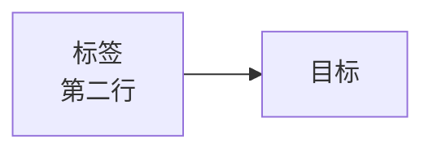
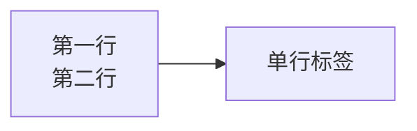

# Mermaid 语法检查与修复

本项目使用 mermaid 9.4.3（CDN 加载），配置 `htmlLabels: false`。

## 核心问题

`<div class="mermaid">` 中的内容会被浏览器 HTML 解析器预处理，导致：
- `<br>` 被解析为 DOM 元素，`textContent` 读取时在节点标签中间插入换行 → syntax error
- `\n` 是字面文本（反斜杠+n），mermaid 不认识 → syntax error
- Unicode 箭头 `→` `←` 干扰 mermaid 的箭头语法解析

## 正确方案

将 `<div class="mermaid">...</div>` 转为 ` ```mermaid ` 代码围栏。原因：

1. kramdown 将代码围栏渲染为 `<div class="language-mermaid"><code>...</code></div>`
2. 代码块内的 `<br>` 被 kramdown 转义为 `&lt;br&gt;`
3. 项目 JS 通过 `code.textContent` 读取（浏览器自动解码实体） → 得到原始的 `<br>` 文本
4. 设置 `div.textContent = src` 后，mermaid 的 init 函数读 `innerHTML`（它会做 `&lt;` → `<` 解码）
5. mermaid 解析器正确识别 `<br>` 为换行指令

## 检查流程

### Step 1：扫描目标文件

如果用户指定了文件，只检查该文件。否则扫描整个项目：

```bash
grep -rn '<div class="mermaid">' --include="*.md" .
```

### Step 2：逐一检查每个 mermaid block

对每个 block 检查以下问题：

| 问题 | 检测方式 | 修复 |
|------|---------|------|
| 使用 `<div class="mermaid">` | grep `<div class="mermaid">` | 转为 ` ```mermaid ` 围栏 |
| 节点标签中有 `\n` | 正则 `\\n` 在非代码块内 | 替换为 `<br>` |
| Unicode 箭头 `→` `←` `↔` | 正则匹配 | 替换为文本（to、from 等） |
| 标签含特殊字符未加引号 | 含 `()` `{}` `[]` `#` `&` 的标签 | 加双引号包裹 |

### Step 3：格式转换

将：
```html
<div class="mermaid">
flowchart LR
    A[标签<br>第二行] --> B[目标]
</div>
```

转为：
````markdown

````

注意：
- 保留 `<br>` 在代码围栏内（mermaid 解析器会正确处理）
- 去掉前后的空行（围栏内不需要）
- 确保围栏前后有空行（markdown 格式要求）

### Step 4：验证（可选）

如果安装了 `@mermaid-js/mermaid-cli`：

```bash
npx mmdc -i temp.mmd -o /dev/null 2>&1
```

没安装也无妨——大多数问题通过模式匹配即可识别。

## 节点标签换行的正确写法

在 ` ```mermaid ` 代码围栏中：



- 使用 `<br>` 或 `<br/>`（mermaid 解析器均支持）
- 不要用 `\n`（在代码围栏中也只是字面文本）
- 如果标签含特殊字符，用双引号包裹：`A["含(括号)的<br>标签"]`

## 常见 mermaid 9.4.3 兼容性问题

1. **subgraph 标题需要引号**：`subgraph FW["标题文本"]` 而非 `subgraph FW[标题文本]`
2. **edge label 中的特殊字符**：`-->|"含/斜杠"|` 需要引号
3. **Unicode 字符**：`×` `✓` `⏸` 等在 flowchart 中通常安全，但 `→` `←` 不安全
4. **htmlLabels:false 下**：`<br>` 仍然有效（mermaid 自己的解析器处理，不依赖 HTML 渲染）
