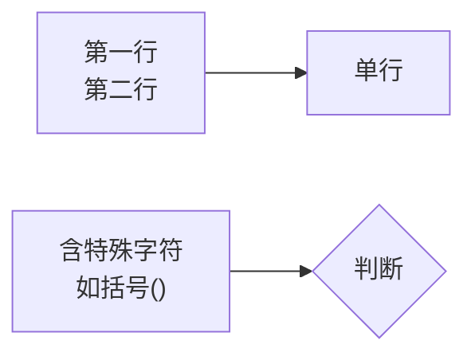

# Mermaid 语法检查与修复

本项目使用 mermaid 9.4.3（CDN 加载），配置 `htmlLabels: false`，`securityLevel: 'loose'`。
图表写在 ` ```mermaid ` 代码围栏中，由 `_layouts/default.html` 中的 JS 转换后渲染。

---

## 渲染管线原理

```
```mermaid 代码围栏
  ↓ kramdown 渲染
<div class="language-mermaid"><code>原始文本（HTML 实体转义）</code></div>
  ↓ 项目 JS（default.html）
code.textContent → 原始 mermaid 文本（含 <br>、-->、| 等）
  ↓ srcToInnerHTML() 转换
innerHTML: 转义 < > & 但保留 <br/> 为真实 HTML 标签
  ↓ mermaid.init()
读取 innerHTML → entityDecode() → 解析器
```

### 关键函数 srcToInnerHTML

```javascript
function srcToInnerHTML(src) {
    return src
        .replace(/&/g, '&amp;')
        .replace(/</g, '&lt;')
        .replace(/>/g, '&gt;')
        .replace(/&lt;br\s*\/?&gt;/gi, '<br/>');
}
```

原理：先将所有 HTML 特殊字符转义，再把 `<br>` 从实体还原为真实标签。
mermaid 的 entityDecode 通过 `escape()`/`unescape()` 能正确处理：
- `--&gt;` → 解码回 `-->`
- `<br/>` (真实标签) → escape 变为 `%3Cbr/%3E` → unescape 变回 `<br/>`
- `|` → escape 变为 `%7C` → unescape 变回 `|`

---

## 使用 Node.js 验证 mermaid 语法

安装 mermaid CLI：
```bash
npm install -g @mermaid-js/mermaid-cli
```

验证单个图表：
```bash
echo 'flowchart LR
    A[text] -->|label| B' > /tmp/test.mmd
npx mmdc -i /tmp/test.mmd -o /tmp/test.svg 2>&1
```

批量验证项目中所有 mermaid 块：
```bash
python3 << 'EOF'
import re, os, subprocess, tempfile

base = os.getcwd()
errors = []
for root, dirs, files in os.walk(base):
    dirs[:] = [d for d in dirs if d not in ['.git', '.claude', 'node_modules']]
    for f in files:
        if not f.endswith('.md'): continue
        path = os.path.join(root, f)
        with open(path) as fh:
            content = fh.read()
        for m in re.finditer(r'```mermaid\n(.*?)\n```', content, re.DOTALL):
            block = m.group(1)
            line = content[:m.start()].count('\n') + 1
            with tempfile.NamedTemporaryFile(suffix='.mmd', mode='w', delete=False) as tmp:
                tmp.write(block)
                tmp_path = tmp.name
            result = subprocess.run(
                ['npx', 'mmdc', '-i', tmp_path, '-o', '/dev/null'],
                capture_output=True, text=True
            )
            os.unlink(tmp_path)
            if result.returncode != 0:
                errors.append((path, line, result.stderr.strip()))

if errors:
    for path, line, err in errors:
        print(f'{path}:{line}')
        print(f'  {err[:200]}')
        print()
else:
    print('All mermaid blocks pass syntax check')
EOF
```

---

## 常见 Bug 与修复方案

### Bug 1：`\n` 在代码围栏中不是换行

**现象**：节点标签想换行，写了 `A[第一行\n第二行]`，渲染出错或显示字面 `\n`

**原因**：`\n` 只是两个字符（反斜杠+n），mermaid 不认识

**修复**：用 `<br>` 或 `<br/>`
```
A[第一行<br>第二行]
```

### Bug 2：Unicode 箭头 `→` `←` 导致 syntax error

**现象**：`A -->|8k → 64k| B` 报错

**原因**：mermaid 的 lexer 把 `→` 误认为箭头 token

**修复**：替换为 ASCII 文本
```
A -->|8k to 64k| B
```

### Bug 3：`<div class="mermaid">` 中的 `<br>` 导致解析失败

**现象**：写在 `<div class="mermaid">` 中的 `<br>` 被浏览器 HTML 解析器消费，textContent 在节点标签中间断行

**原因**：浏览器先于 mermaid 解析 HTML，`<br>` 变成 DOM 元素

**修复**：使用 ` ```mermaid ` 代码围栏（kramdown 保留原始文本）
```markdown
` ` `mermaid
flowchart LR
    A[第一行<br>第二行] --> B
` ` `
```

### Bug 4：`div.textContent = src` 破坏 entityDecode

**现象**：代码围栏图表初次渲染无法显示

**原因**：`textContent` 赋值导致 innerHTML 中 `<br>` 变为 `&lt;br&gt;`。mermaid 的 entityDecode 内部用临时 div 的 innerHTML 解码实体时，`<br>` 被解析为真实 HTML 元素，然后被 textContent 吞掉

**修复**：使用 srcToInnerHTML() 转换——先转义所有 HTML 字符，再将 `&lt;br&gt;` 恢复为真实 `<br/>` 标签

### Bug 5：主题切换后 mermaid 图表损坏

**现象**：切换深色/浅色模式后图表无法重新渲染

**原因**：rerenderMermaid 中用 `el.innerHTML = src` 直接设置原始文本，`<br>` 和 `>` 被当作 HTML 解析

**修复**：rerenderMermaid 也必须使用 srcToInnerHTML() 转换

### Bug 6：初始化时 mermaid 不根据当前主题渲染

**现象**：浅色模式下 mermaid 图显示为深色背景

**原因**：`<head>` 中 mermaid.initialize() 硬编码了 `theme: 'dark'`

**修复**：读取 `data-theme` 属性动态选择主题变量

### Bug 7：subgraph 标题含特殊字符

**现象**：`subgraph 内部框架` 报错

**修复**：用引号包裹 `subgraph FW["内部框架"]`

### Bug 8：edge label 含引号或特殊字符

**现象**：`-->|含"引号"的文本|` 报错

**修复**：整个 edge label 加引号 `-->|"含引号的文本"|`

---

## 检查流程

### Step 1：扫描

```bash
grep -rn '```mermaid' --include="*.md" . | grep -v ".claude/"
```

如仍有 `<div class="mermaid">`，先转为代码围栏。

### Step 2：模式匹配检测

对每个 mermaid block 检查：

| 问题 | 检测 | 修复 |
|------|------|------|
| 使用 `<div class="mermaid">` | grep | 转为代码围栏 |
| `\n` 在节点标签中 | `\\n` 在方括号/花括号内 | → `<br>` |
| Unicode 箭头 `→` `←` | 正则 | → 文本 |
| subgraph 标题无引号 | `subgraph \w+ [` 后无引号 | 加引号 |
| 嵌套引号 | `"` 在已有引号标签内 | 移除或转义 |

### Step 3：验证

有 mmdc 就用 mmdc 验证，没有则依赖模式匹配。

---

## 节点标签换行正确写法



规则：
- 用 `<br>` 或 `<br/>` 换行
- 不要用 `\n`
- 含 `(){}[]#&` 等特殊字符时用双引号包裹整个标签
- edge label 中含特殊字符也用引号：`-->|"文本"|`
