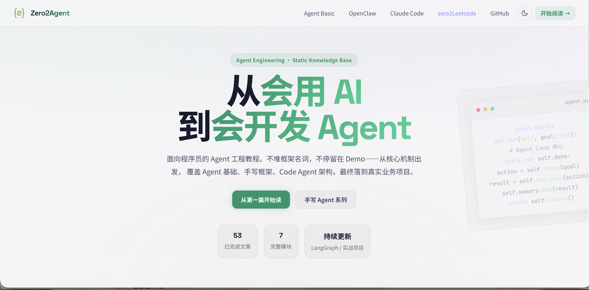
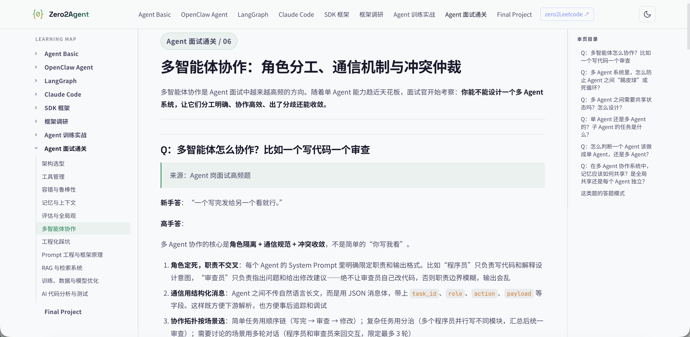

<div align="center">

# zero2Agent

**面向程序员的 Agent 工程教程 · 从概念到生产**

[](LICENSE)
[](https://github.com/ranxi2001/zero2Agent)
[](https://onefly.top/zero2Agent)

[在线阅读](https://onefly.top/zero2Agent) · [Agent Basic](https://onefly.top/zero2Agent/learn-agent-basic/) · [OpenClaw](https://onefly.top/zero2Agent/learn-openclaw/) · [Claude Code](https://onefly.top/zero2Agent/learn-claude-code/) · [LangGraph](https://onefly.top/zero2Agent/learn-langgraph/) · [SDK 框架](https://onefly.top/zero2Agent/learn-sdk-frameworks/) · [框架调研](https://onefly.top/zero2Agent/learn-agent-survey/)

</div>

---

## 这是什么

**zero2Agent** 是一个面向程序员的 Agent 工程教程仓库，目标是帮助已经会写代码、会用 AI 工具，但还没系统做过 Agent 工程的开发者，真正从零搭出自己的 Agent 系统。

内容不停留在 Demo、Prompt、套壳工作流，而是从核心机制出发，覆盖 Agent 的工程设计原理、框架拆解、代码实现，最终落到一个完整的实战项目。

**在线阅读（GitHub Pages）**：[https://onefly.top/zero2Agent](https://onefly.top/zero2Agent)




---

## 模块概览

| 模块 | 文章数 | 状态 | 内容 |
|------|--------|------|------|
| [Agent Basic](https://onefly.top/zero2Agent/learn-agent-basic/) | 8 篇 | ✅ 完成 | Agent 核心概念、Tool Calling、Memory、Planning、RAG、多 Agent 模式 |
| [OpenClaw Agent](https://onefly.top/zero2Agent/learn-openclaw/) | 9 篇 | ✅ 完成 | 60 行核心框架，从 Node 推导到 Agent，pi-mono 架构解析，部署实战 |
| [Claude Code](https://onefly.top/zero2Agent/learn-claude-code/) | 12 篇 | ✅ 完成 | 12 节课手写 Coding Agent：Loop → Tools → Subagent → Teams → Worktree 隔离 |
| [LangGraph](https://onefly.top/zero2Agent/learn-langgraph/) | 7 篇 | ✅ 完成 | StateGraph 三件套、条件分支、并行 Fan-out/Fan-in、Prompt Chaining、LLM 集成 |
| [SDK 框架](https://onefly.top/zero2Agent/learn-sdk-frameworks/) | 4 篇 | ✅ 完成 | OpenAI Agents SDK · Google genai SDK · Claude Anthropic SDK · 三大 SDK 横向对比 |
| [框架调研](https://onefly.top/zero2Agent/learn-agent-survey/) | 13 篇 | ✅ 完成 | AgentScope · Mastra · Semantic Kernel · Eino · DeerFlow · LangChain · Google ADK · AutoGen · Vercel AI SDK 等 |
| Final Project | — | 🔲 待开始 | 加密货币市场风控 Agent 完整实战 |

> **当前进度：53 篇文章，6 个完整模块**

---

## 模块详情

### Agent Basic

建立正确的 Agent 工程认知，覆盖：

- 什么是 Agent，与 Workflow 的本质区别
- Tool Calling 的完整机制
- Memory 设计模式（短期 / 长期 / 外部存储）
- Planning、Reflection、RAG 的作用边界
- 单 Agent vs 多 Agent 的常见架构模式
- 为什么 Demo 能跑、落地就不稳定

### OpenClaw Agent

从 60 行核心代码出发，一步步推导出完整的 Agent 框架：

```python
workflow = node + node        # 有向路径，无循环
chatbot  = workflow + loop    # 外层循环，多轮对话
agent    = chatbot + tools    # 图内回路，模型驱动工具
```

覆盖 RAG、Tool/MCP/Skill 三种工具形式、Memory 压缩、多 Agent 并行团队、pi-mono 架构解析，以及完整的部署和面试准备。

参考仓库：[lasywolf/Learn-OpenClaw](https://github.com/lasywolf/Learn-OpenClaw) · [pi-mcp/pi-mono](https://github.com/pi-mcp/pi-mono)

### Claude Code

12 节课，从 30 行 Agent 循环逐步构建完整 Coding Agent 系统：

| 章节 | 机制 |
|------|------|
| s01–s06 | Agent Loop · Tool Dispatch · TodoWrite · Subagent · Skill Loading · Context Compact |
| s07–s12 | Task DAG · Background Tasks · Agent Teams · Protocols · Autonomous Agents · Worktree Isolation |

参考仓库：[shareAI-lab/learn-claude-code](https://github.com/shareAI-lab/learn-claude-code)

### LangGraph

用图结构描述 Agent 执行逻辑，从 Demo 到可维护系统：

| 文章 | 内容 |
|------|------|
| State、Node、Graph 三件套 | TypedDict 状态设计，节点函数，编译运行 |
| 顺序图 | add_edge 模式，BMI 计算器实战 |
| 条件分支 | add_conditional_edges，情感分析路由 |
| 并行执行 | Fan-out / Fan-in，多节点并发 |
| Prompt Chaining | 分步生成，节点间传递中间结果 |
| LLM 集成 | OpenAI / HuggingFace 在节点里的完整写法 |

### SDK 框架

三大原厂 SDK 的核心用法与选型指南：

- **OpenAI Agents SDK**：`@function_tool` 装饰器，`Runner` 自动循环，`handoffs` 多 Agent
- **Google genai SDK**：两种后端（AI Studio / Vertex AI），Function Calling，多模态
- **Claude Anthropic SDK**：Messages API，Tool Use 手动循环，Extended Thinking
- **横向对比**：API 设计差异、Tool Calling 实现、定价参考、选型建议

### 框架调研

13 个主流 Agent 框架横向调研：

| 框架 | 来源 | 核心特色 |
|------|------|---------|
| AgentScope | 阿里巴巴 | 分布式多 Agent，Service 工具体系 |
| Mastra | 开源 | TypeScript 原生，Workflow + 记忆 + RAG |
| Semantic Kernel | 微软 | Plugin 体系，Azure 企业级集成 |
| Eino | 字节跳动 | Go 语言，流式原生，高并发 |
| GitAgent | — | 代码仓库 Agent 模式，PR 自动审查 |
| 手搓 Agent | — | 200 行从零实现，看透框架本质 |
| AgentUniverse | 华为 | PEER 协作模式，企业可观测性 |
| DeerFlow | 字节跳动 | Deep Research，基于 LangGraph |
| LangChain | 开源 | LCEL、RAG，以及何时不该用它 |
| Google ADK | Google | 官方 Agent 套件，Sequential/Parallel/Router |
| Skills + Claude Code | Anthropic | 模块化技能系统，按需加载 |
| Vercel AI SDK | Vercel | useChat/streamText，Next.js 全栈 |
| AutoGen | 微软 | 多 Agent 对话，代码执行，HITL |

---

## 适合谁

- 学过深度学习，但没做过 LLM 应用开发
- 会 Python，想补齐 Agent 工程能力
- 用过 Claude Code / Cursor 等工具，想理解背后的实现
- 准备 Agent 方向技术面试或实习
- 想把 Agent 真正部署上线，而不只是跑 Demo

## 不适合谁

- 大模型预训练、对齐、推理优化等底层算法研究
- 纯学术导向的 Agent 论文综述
- 只想快速复制“几分钟搭建 Agent”的短教程

---

## 仓库结构

```
zero2Agent/
├── _layouts/               # Jekyll 页面模板
├── _data/
│   └── nav.yml             # 导航配置
├── assets/
│   ├── css/docs.css        # 三栏布局样式
│   └── js/app.js           # 侧边栏 + TOC + Mermaid
├── learn-agent-basic/      # Agent 基础概念（8 篇）
├── learn-openclaw/         # OpenClaw 框架教程（9 篇）
├── learn-claude-code/      # Claude Code 课程（12 篇）
├── learn-langgraph/        # LangGraph（7 篇）
├── learn-sdk-frameworks/   # 三大原厂 SDK（4 篇）
├── learn-agent-survey/     # 框架调研（13 篇）
└── final-project/          # 加密货币风控 Agent 实战（待开始）
```

---

## 本地运行

```bash
git clone https://github.com/ranxi2001/zero2Agent
cd zero2Agent

# 安装 Jekyll（需要 Ruby）
gem install bundler jekyll
bundle install

# 本地预览
bundle exec jekyll serve
# 访问 http://localhost:4000/zero2Agent
```

---

## 引用与致谢

本仓库的内容参考并引用了以下开源项目：

- **[shareAI-lab/learn-claude-code](https://github.com/shareAI-lab/learn-claude-code)** — Claude Code 模块的课程结构和核心内容来源，12 节渐进式 Agent 构建课程
- **[lasywolf/Learn-OpenClaw](https://github.com/lasywolf/Learn-OpenClaw)** — OpenClaw 模块的核心思路和代码框架来源
- **[pi-mcp/pi-mono](https://github.com/pi-mcp/pi-mono)** — 生产级 Coding Agent 的参考实现
- **[SandeepMuhal88/LangGraph_BASIC_TO_Advance](https://github.com/SandeepMuhal88/LangGraph_BASIC_TO_Advance)** — LangGraph 模块的实战案例参考

---

## Contributing

欢迎 PR 和 Issue。内容补充、错误修正、新模块建议均可。

提 Issue 前请先检查是否已有相关讨论。PR 建议一个 PR 只做一件事。

---

## License

[MIT](LICENSE)
