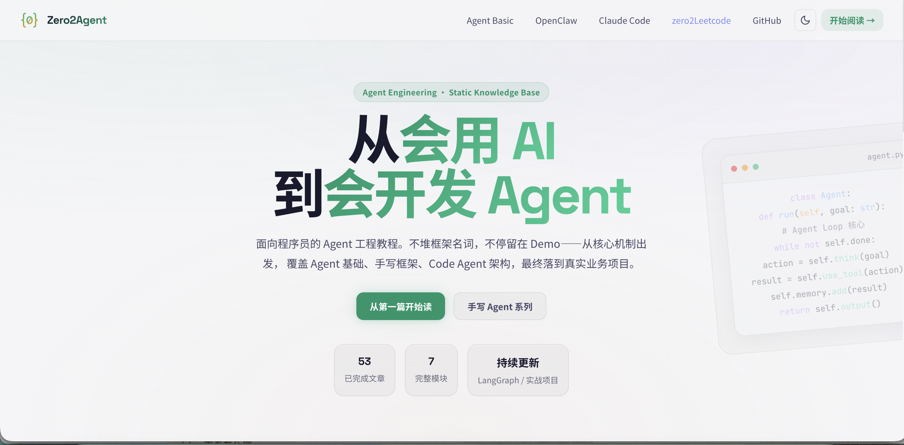
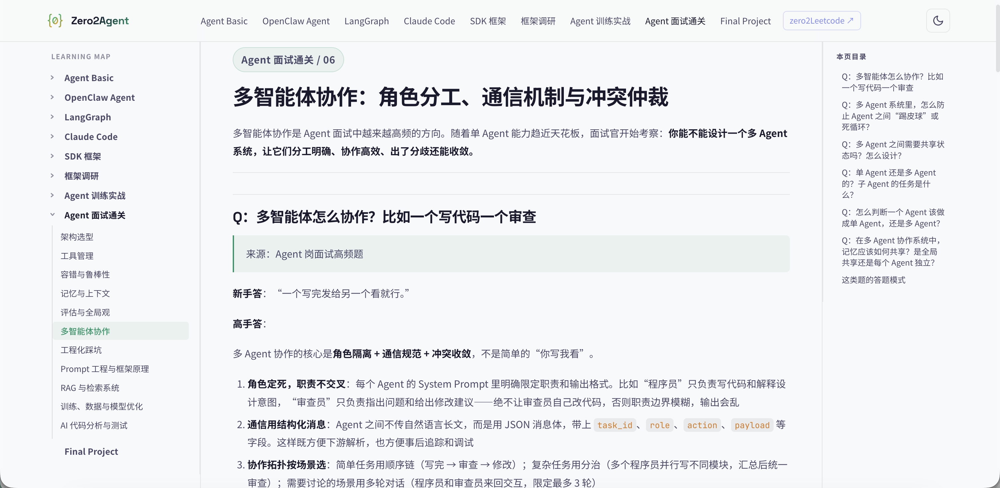

<div align="center">

# zero2Agent

**面向程序员的 Agent 工程教程 · 从概念到生产**

[](LICENSE)
[](https://github.com/ranxi2001/zero2Agent)
[](https://onefly.top/zero2Agent)

[在线阅读](https://onefly.top/zero2Agent) · [Agent Basic](https://onefly.top/zero2Agent/learn-agent-basic/) · [LangGraph](https://onefly.top/zero2Agent/learn-langgraph/) · [SDK 框架](https://onefly.top/zero2Agent/learn-sdk-frameworks/) · [框架调研](https://onefly.top/zero2Agent/learn-agent-survey/) · [OpenClaw](https://onefly.top/zero2Agent/learn-openclaw/) · [Claude Code](https://onefly.top/zero2Agent/learn-claude-code/) · [DeepSeek Harness](https://onefly.top/zero2Agent/learn-deepseek-harness/) · [Pi Coding Agent](https://onefly.top/zero2Agent/learn-pi/) · [Codex CLI](https://onefly.top/zero2Agent/learn-codex/) · [训练实战](https://onefly.top/zero2Agent/learn-agent-training/) · [应用实战](https://onefly.top/zero2Agent/learn-agent-practice/) · [面试通关](https://onefly.top/zero2Agent/learn-agent-interview/) · [Final Project](https://onefly.top/zero2Agent/final-project/)

</div>

---

## 📗 绿皮书发布

**《Agent 面试 500 问》** 绿皮书 PDF v1.2.0 正式发布！面试前速查速记，保留“新手答 vs 高手答”对比，快速看清答案层次。

- 覆盖 **17 大考察维度**、**619 道 Agent / AI 高频面试题**
- 蚂蚁、阿里、字节、腾讯、携程、百度等大厂真题
- 同一主题内按真实面经出现频次排序，适合面试当天翻阅

**下载**：[`publish-pdf/output/zero2Agent-绿皮书-Agent面试500问.pdf`](publish-pdf/output/zero2Agent-绿皮书-Agent面试500问.pdf)

> 授权协议：CC BY-NC-SA 4.0 · 转载请注明出处  
> 作者：[Onefly](https://github.com/ranxi2001)

---

## 这是什么

**zero2Agent** 是一个面向程序员的 Agent 工程教程仓库，目标是帮助已经会写代码、会用 AI 工具，但还没系统做过 Agent 工程的开发者，真正从零搭出自己的 Agent 系统。同时也适合应届生或转行开发者，作为 AI Agent 方向面试备战的系统性参考。

内容不停留在 Demo、Prompt、套壳工作流，而是从核心机制出发，覆盖 Agent 的工程设计原理、框架拆解、代码实现，最终落到完整的实战项目与大厂面试题深度拆解。

**在线阅读（GitHub Pages）**：[https://onefly.top/zero2Agent](https://onefly.top/zero2Agent)




---

## 模块概览

| 模块 | 文章数 | 状态 | 内容 |
|------|--------|------|------|
| [Agent Basic](https://onefly.top/zero2Agent/learn-agent-basic/) | 17 篇 | ✅ 完成 | Agent 核心概念、模型 API、Tool Calling、Context、Memory、Loop 与 Infra |
| [LangGraph](https://onefly.top/zero2Agent/learn-langgraph/) | 7 篇 | ✅ 完成 | StateGraph 三件套、条件分支、并行 Fan-out/Fan-in、Prompt Chaining、LLM 集成 |
| [SDK 框架](https://onefly.top/zero2Agent/learn-sdk-frameworks/) | 4 篇 | ✅ 完成 | OpenAI Agents SDK · Google genai SDK · Claude Anthropic SDK · 三大 SDK 横向对比 |
| [框架调研](https://onefly.top/zero2Agent/learn-agent-survey/) | 13 篇 | ✅ 完成 | AgentScope · Mastra · Semantic Kernel · Eino · DeerFlow · LangChain · Google ADK · AutoGen · Vercel AI SDK 等 |
| [OpenClaw Agent](https://onefly.top/zero2Agent/learn-openclaw/) | 9 篇 | ✅ 完成 | 60 行核心框架，从 Node 推导到 Agent，pi-mono 架构解析，部署实战 |
| [Claude Code](https://onefly.top/zero2Agent/learn-claude-code/) | 12 篇 | ✅ 完成 | 12 节课手写 Coding Agent：Loop → Tools → Subagent → Teams → Worktree 隔离 |
| [DeepSeek Harness](https://onefly.top/zero2Agent/learn-deepseek-harness/) | 13 篇 | ✅ 完成 | 从设计理念拆解可拼装的 Agent Runtime：插件、接缝、事实源、控制平面、安全与自进化边界 |
| [Agent 训练实战](https://onefly.top/zero2Agent/learn-agent-training/) | 7 篇 | ✅ 完成 | SFT、RL、GRPO/PPO、数据配比、仿真沙箱、评估回流与部署 |
| [Agent 应用实战](https://onefly.top/zero2Agent/learn-agent-practice/) | 5 篇 | 🚧 进行中 | Vibe Coding、AI Coding 面试、日常开发工作流、Auto Harness 工程与 Eval-Driven 实践 |
| [Pi Coding Agent](https://onefly.top/zero2Agent/learn-pi/) | 8 篇 | ✅ 完成 | 可验证 Agent Loop、Provider、Skill/Extension/Package、MCP、安全与树形 Session Runtime |
| [Codex CLI](https://onefly.top/zero2Agent/learn-codex/) | 7 篇 | ✅ 完成 | OpenAI 终端 Agent：Rust 双层架构、TOML 配置、平台原生沙箱、MCP 集成、SDK 与横向对比 |
| [面试通关](https://onefly.top/zero2Agent/learn-agent-interview/) | 17 篇 | ✅ 完成 | 大厂 AI Agent 岗位高频面试题拆解，17 大考察维度，新手答 vs 高手答对比 |
| [Final Project](https://onefly.top/zero2Agent/final-project/) | 12 篇 | ✅ 完成 | OfferPilot 面试诊断 Agent 实战：手写 Harness 10 层架构，从 PRD 到部署 |

> **当前进度：131 篇文章，12 个完整模块，1 个模块持续更新**

---

## 模块详情

### Agent Basic

建立正确的 Agent 工程认知，覆盖：

- 什么是 Agent，与 Workflow 的本质区别
- 大模型 API 的输入输出、消息轨迹与 Tool Calling 完整机制
- Memory 设计模式（短期 / 长期 / 外部存储）
- Context、KV/Prompt Cache 与上下文压缩
- Planning、Reflection、RAG 的作用边界
- 单 Agent vs 多 Agent 的常见架构模式
- 为什么 Demo 能跑、落地就不稳定，以及 Loop/Infra 如何托底

### LangGraph

用图结构描述 Agent 执行逻辑，从 Demo 到可维护系统：

| 文章 | 内容 |
|------|------|
| State、Node、Graph 三件套 | TypedDict 状态设计，节点函数，编译运行 |
| 顺序图 | add_edge 模式，BMI 计算器实战 |
| 条件分支 | add_conditional_edges，情感分析路由 |
| 并行执行 | Fan-out / Fan-in，多节点并发 |
| Prompt Chaining | 分步生成，节点间传递中间结果 |
| LLM 集成 | OpenAI / HuggingFace 在节点里的完整写法 |

### SDK 框架

三大原厂 SDK 的核心用法与选型指南：

- **OpenAI Agents SDK**：`@function_tool` 装饰器，`Runner` 自动循环，`handoffs` 多 Agent
- **Google genai SDK**：两种后端（AI Studio / Vertex AI），Function Calling，多模态
- **Claude Anthropic SDK**：Messages API，Tool Use 手动循环，Extended Thinking
- **横向对比**：API 设计差异、Tool Calling 实现、定价参考、选型建议

### 框架调研

13 个主流 Agent 框架横向调研：

| 框架 | 来源 | 核心特色 |
|------|------|---------|
| AgentScope | 阿里巴巴 | 分布式多 Agent，Service 工具体系 |
| Mastra | 开源 | TypeScript 原生，Workflow + 记忆 + RAG |
| Semantic Kernel | 微软 | Plugin 体系，Azure 企业级集成 |
| Eino | 字节跳动 | Go 语言，流式原生，高并发 |
| GitAgent | — | 代码仓库 Agent 模式，PR 自动审查 |
| Harness 工程 | — | 200 行从零实现，看透框架本质 |
| AgentUniverse | 华为 | PEER 协作模式，企业可观测性 |
| DeerFlow | 字节跳动 | Deep Research，基于 LangGraph |
| LangChain | 开源 | LCEL、RAG，以及何时不该用它 |
| Google ADK | Google | 官方 Agent 套件，Sequential/Parallel/Router |
| Skills + Claude Code | Anthropic | 模块化技能系统，按需加载 |
| Vercel AI SDK | Vercel | useChat/streamText，Next.js 全栈 |
| AutoGen | 微软 | 多 Agent 对话，代码执行，HITL |

### OpenClaw Agent

从 60 行核心代码出发，一步步推导出完整的 Agent 框架：

```python
workflow = node + node        # 有向路径，无循环
chatbot  = workflow + loop    # 外层循环，多轮对话
agent    = chatbot + tools    # 图内回路，模型驱动工具
```

覆盖 RAG、Tool/MCP/Skill 三种工具形式、Memory 压缩、多 Agent 并行团队、pi-mono 架构解析，以及完整的部署和面试准备。

参考仓库：[lasywolf/Learn-OpenClaw](https://github.com/lasywolf/Learn-OpenClaw) · [pi-mcp/pi-mono](https://github.com/pi-mcp/pi-mono)

### Claude Code

12 节课，从 30 行 Agent 循环逐步构建完整 Coding Agent 系统：

| 章节 | 机制 |
|------|------|
| s01–s06 | Agent Loop · Tool Dispatch · TodoWrite · Subagent · Skill Loading · Context Compact |
| s07–s12 | Task DAG · Background Tasks · Agent Teams · Protocols · Autonomous Agents · Worktree Isolation |

参考仓库：[shareAI-lab/learn-claude-code](https://github.com/shareAI-lab/learn-claude-code)

### DeepSeek Harness

这个模块以设计理念为主，把 DeepSeek Harness 同时看成一个可以直接运行的 Coding Agent，以及一套可以重新拼装的 Agent 开发框架。它不是“固定内核加扩展槽”，而是尽量不保留不可替换的特权内核。官方 Web 和 headless 是预置 Profile；模型、工具、文件系统、Shell、沙箱、会话存储、Subagent、UI 甚至 Loop 都可以通过插件和接缝替换。文章先讲 Cordis 的依赖、事件与可逆副作用，再拆解插件树、LLM 接缝、事实源、控制平面、上下文成本和安全策略，最后讨论动态生成插件的实验性自进化边界。

官方 API 仍固定参考 `dsh-v0.1.0-rc.8`，但 API 只作为设计判断的证据；社区教程、电子书、白皮书和 NanoCordis 用于补充原理与教学实现。社区资料基于较早的 `rc.6` 时，README 不把它当作当前 API 规范，具体来源和许可证见 [THIRD_PARTY_NOTICES.md](THIRD_PARTY_NOTICES.md)。

### Pi Coding Agent

以 2026-08-24 核验的官方仓库 commit `a470b121` 为事实基线，从一次完整工具往返进入 Pi：区分运行事件、持久 transcript 与模型 Context，理解 Provider 适配、Skill 的渐进披露、Extension 的运行时能力、Package 的分发职责，以及 MCP 只在协议互操作场景中的价值。每篇都加入可复现步骤、失败实验和验收证据，最后通过 Session tree、resume/fork/clone、compaction、RPC 和 SDK，把 Pi 从终端工具还原成可恢复、可嵌入的 Agent Runtime。

学习入口优先使用 [Pi 官网](https://pi.dev)、[官方文档](https://pi.dev/docs/latest/) 和 [官方源码](https://github.com/badlogic/pi-mono)；[《动手学 Pi》](https://chasen-liao.github.io/pi-textbook-page/learn/prologue/)用于补充 checkpoint、聚焦测试和故障实验。中文文档只作辅助阅读，已归档的 awesome 列表只作历史发现。

### 面试通关

大厂 AI Agent 岗位高频面试题深度拆解，覆盖蚂蚁、阿里、字节、腾讯、携程等真实面试场景。每道题对比“新手答”和“高手答”，17 大考察维度：

| 维度 | 核心考点 |
|------|---------|
| 架构选型 | ReAct vs Plan-and-Execute、ToT 线上化、四种设计范式 |
| 工具管理 | 参数校验、百级工具路由、多工具调度 |
| 容错与鲁棒性 | 超时处理、误操作防范、幻觉治理 |
| 记忆与上下文 | 长对话不丢信息、上下文污染防治 |
| 多智能体协作 | 角色分工、通信机制、冲突仲裁 |
| Prompt 工程 | 模板分层构建、Skills 可复用能力单元 |
| RAG 与检索 | chunk 设计、查询改写、多路召回精排 |
| 训练与数据 | 数据清洗、LoRA vs 全参微调、DPO/PPO/GRPO |
| AI 代码测试 | 覆盖率插桩、代码过滤策略 |
| 业务 AI 工程 | 业务需求拆解、AI 方案选型 |
| 简历项目拷打 | 面试官追着你的 Agent 项目问到底 |
| 各公司偏好 | 按公司统计高频考点与面试风格 |
| Agent 概念考察 | Harness Engineering、Context Engineering、MCP/Skills 前沿范式 |
| Agent Infra | Runtime、状态恢复、Sandbox、Kubernetes 与可靠执行 |
| AI Infra | 分布式训练、LLM Serving、GPU 调度与 AIOps |

### Final Project：OfferPilot

上传面试录音或文字稿，自动诊断回答质量，输出结构化改进建议。纯手写 Harness 10 层架构，不依赖 LangChain / LangGraph。

| 编号 | 文档 | 内容 |
|------|------|------|
| 01 | PRD | 产品定位、用户场景、10 层架构映射、技术选型 |
| 02 | 系统架构 | 模块划分、数据流、接口定义 |
| 03 | Query Engine | 三 Provider + stream + retry + cache + 路由 |
| 04 | Tools & Skills | 原子工具 + 任务级 Skill 编排 |
| 05 | 知识库 | 385 题导入 + FTS5/embedding 双通道检索 |
| 06 | Context & Memory | 5 层上下文管理 + 跨会话记忆 |
| 07 | Permission & Session | 权限分级 + 检查点恢复 + 审计日志 |
| 08 | Hook & Command | 可插拔治理管线 + 14 个确定性命令 |
| 09 | Sub-agent | Agent-as-Tool + 并发池 + 上下文隔离 |
| 10 | STT 语音 | Whisper/FunASR + 说话人分离 + 语音诊断 |
| 11 | 部署演示 | CLI 入口 + Demo + 三种部署方案 |
| 12 | Web UI | Next.js + SSE 流式 + 三大核心交互流程 |

参考仓库：[ranxi2001/OfferPilot](https://github.com/ranxi2001/OfferPilot)

---

## 适合谁

- 学过深度学习，但没做过 LLM 应用开发
- 会 Python，想补齐 Agent 工程能力
- 用过 Claude Code / Cursor 等工具，想理解背后的实现
- 准备 Agent 方向技术面试或实习
- 想把 Agent 真正部署上线，而不只是跑 Demo

## 不适合谁

- 大模型预训练、对齐、推理优化等底层算法研究
- 纯学术导向的 Agent 论文综述
- 只想快速复制“几分钟搭建 Agent”的短教程

---

## 仓库结构

```
zero2Agent/
├── _layouts/               # Jekyll 页面模板
├── _data/
│   └── nav.yml             # 导航配置
├── assets/
│   ├── css/docs.css        # 三栏布局样式
│   └── js/app.js           # 侧边栏 + TOC + Mermaid
├── examples/
│   └── agent-api-lab/      # 无密钥 API 协议、上下文消融和故障注入实验
├── learn-agent-basic/      # Agent 基础概念（17 篇）
├── learn-langgraph/        # LangGraph（7 篇）
├── learn-sdk-frameworks/   # 三大原厂 SDK（4 篇）
├── learn-agent-survey/     # 框架调研（13 篇）
├── learn-openclaw/         # OpenClaw 框架教程（9 篇）
├── learn-claude-code/      # Claude Code 课程（12 篇）
├── learn-deepseek-harness/ # DeepSeek Harness 运行时拆解（13 篇）
├── learn-agent-training/   # Agent 训练实战（7 篇）
├── learn-agent-practice/   # Agent 应用实战（5 篇，持续更新）
├── learn-pi/               # Pi Coding Agent（8 篇）
├── learn-codex/            # OpenAI Codex CLI（7 篇）
├── learn-agent-interview/  # 大厂面试题拆解（17 篇）
└── final-project/          # OfferPilot 面试诊断 Agent 实战（12 篇）
```

---

## 本地运行

```bash
git clone https://github.com/ranxi2001/zero2Agent
cd zero2Agent

# 安装 Jekyll（需要 Ruby）
gem install bundler jekyll
bundle install

# 本地预览
bundle exec jekyll serve
# 访问 http://localhost:4000/zero2Agent
```

---

## 引用与致谢

本仓库的内容参考并引用了以下开源项目：

- **[bojieli/ai-agent-book](https://github.com/bojieli/ai-agent-book/tree/e3883f8cec222c31e59c646be96641120863027e)** — Agent Basic 中模型 API、上下文工程与消融实验的概念参考；本仓库使用独立文字、示例与实验实现，详见 [THIRD_PARTY_NOTICES.md](THIRD_PARTY_NOTICES.md)
- **[shareAI-lab/learn-claude-code](https://github.com/shareAI-lab/learn-claude-code)** — Claude Code 模块的课程结构和核心内容来源，12 节渐进式 Agent 构建课程
- **[lasywolf/Learn-OpenClaw](https://github.com/lasywolf/Learn-OpenClaw)** — OpenClaw 模块的核心思路和代码框架来源
- **[pi-mcp/pi-mono](https://github.com/pi-mcp/pi-mono)** — 生产级 Coding Agent 的参考实现
- **[SandeepMuhal88/LangGraph_BASIC_TO_Advance](https://github.com/SandeepMuhal88/LangGraph_BASIC_TO_Advance)** — LangGraph 模块的实战案例参考
- **[ranxi2001/OfferPilot](https://github.com/ranxi2001/OfferPilot)** — Final Project 配套代码仓库，手写 Harness 10 层面试诊断 Agent
- **[deepseek-ai/deepseek-harness](https://github.com/deepseek-ai/deepseek-harness/tree/dsh-v0.1.0-rc.8)** — DeepSeek Harness 模块的官方 API、架构和子系统基线
- **[libukai/awesome-deepseek-harness](https://github.com/libukai/awesome-deepseek-harness)** — 教程、电子书、白皮书、交互式专题和 NanoCordis 等社区资料索引
- **[badlogic/pi-mono@a470b121](https://github.com/badlogic/pi-mono/tree/a470b121bf683b4c2b9fc0b3a7c807de7e0cfe9c)** — Pi 模块的官方实现、文档与 API 事实基线
- **[hahhforest/pi-textbook](https://github.com/hahhforest/pi-textbook)** — Chunhao Zhang 创作的《动手学 Pi》，为 Pi 模块提供 checkpoint、故障实验与验收式教学参考；用户提供的[在线镜像](https://chasen-liao.github.io/pi-textbook-page/learn/prologue/)用于阅读
- **[nicobailon/pi-mcp-adapter](https://github.com/nicobailon/pi-mcp-adapter)** — Pi MCP 篇的 proxy/direct tools、生命周期、审批与输出边界参考实现

---

## Contributing

欢迎 PR 和 Issue。内容补充、错误修正、新模块建议均可。

提 Issue 前请先检查是否已有相关讨论。PR 建议一个 PR 只做一件事。

---

## Star History

<picture>
  <source media="(prefers-color-scheme: dark)" srcset="https://raw.githubusercontent.com/ranxi2001/zero2Agent/output/star-history-dark.svg">
  
</picture>

---

## License

[MIT](LICENSE)
