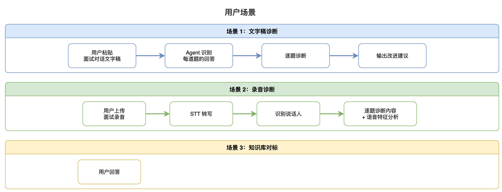
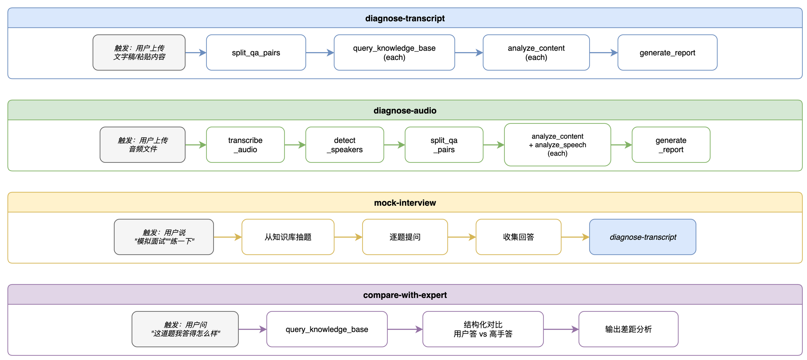
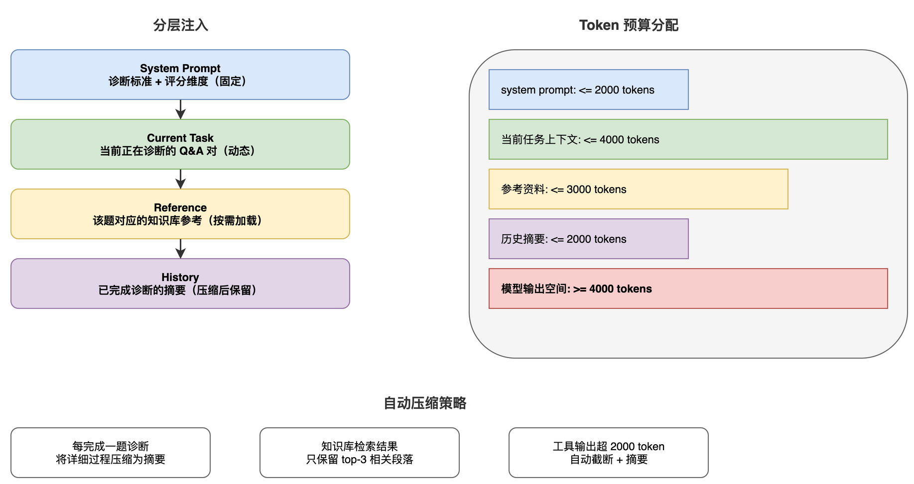
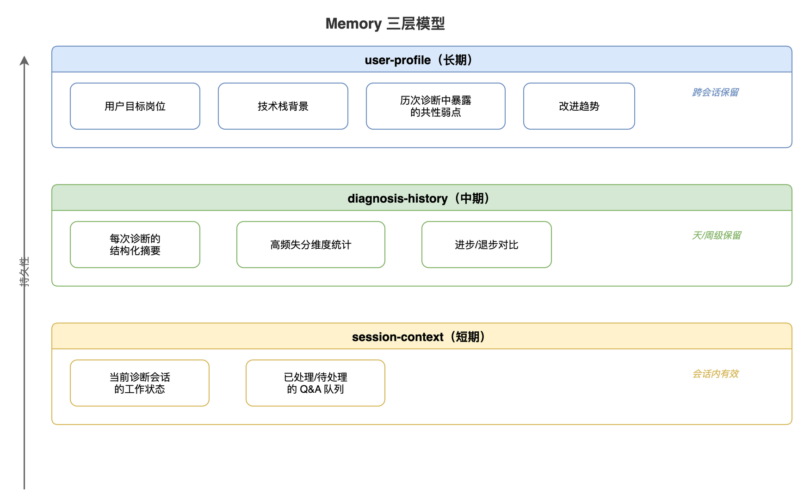
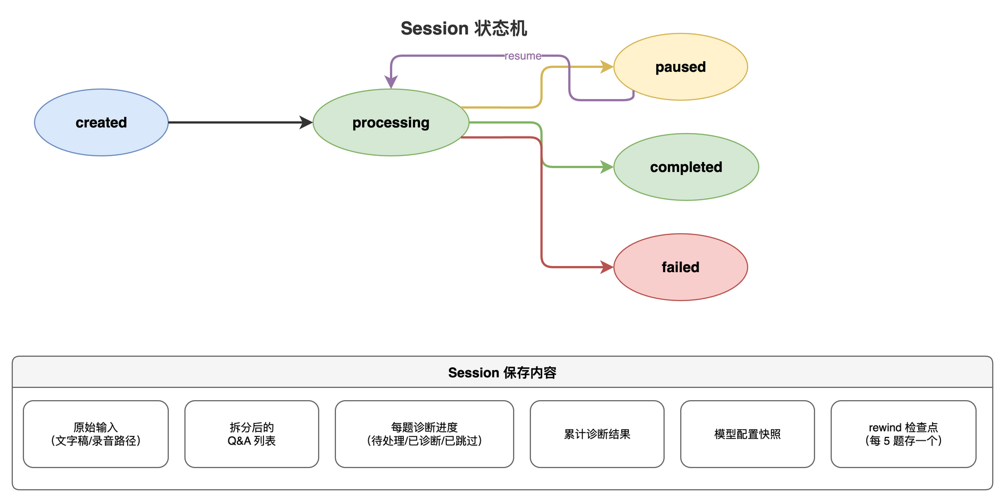
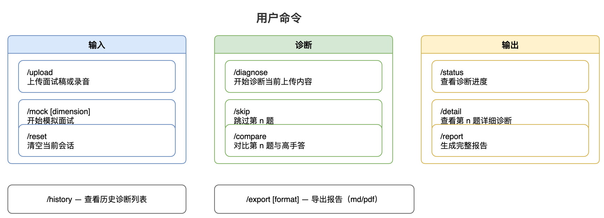
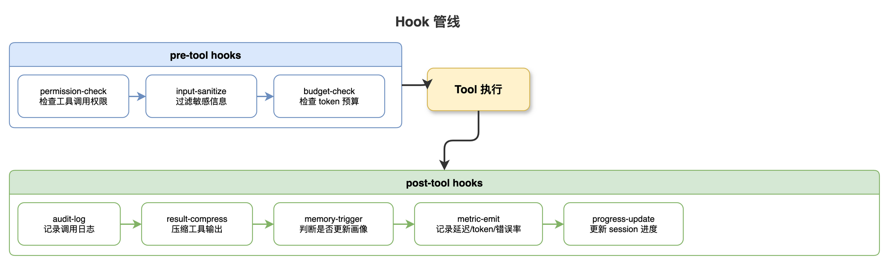
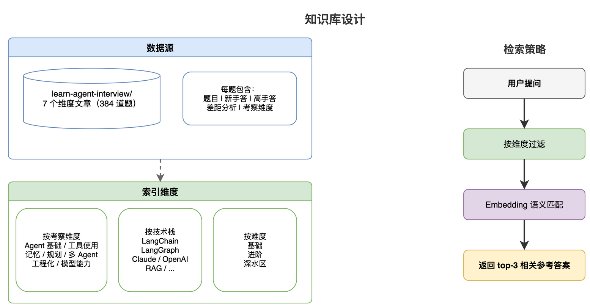
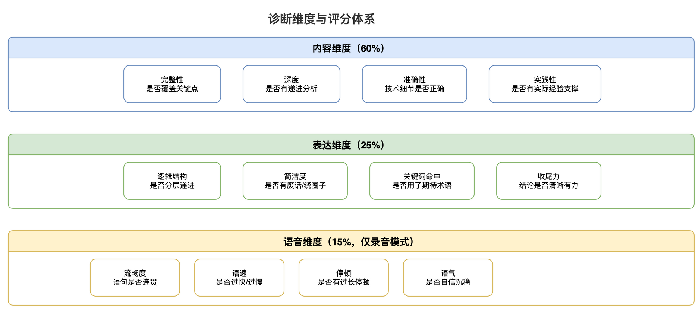
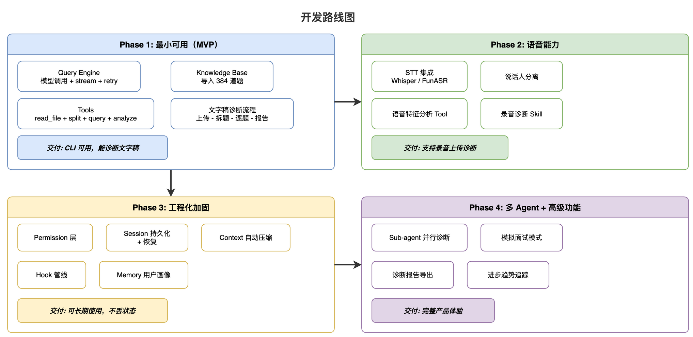

# 面试诊断 Agent PRD

面试准备最大的问题不是“不知道答案”，而是“不知道自己答得有什么问题”。

候选人花大量时间刷题，但真正上场时暴露的问题往往不是知识盲区——而是表达混乱、逻辑断层、关键点遗漏、语气不自信、顿挫感明显。这些问题自己很难察觉，复盘时也抓不到重点。

本项目要做的就是：一个能精准诊断面试回答的 Agent 系统。

## 产品定位

**面试诊断 Agent** —— 上传面试录音或文字稿，自动诊断回答质量，输出结构化改进建议。

核心价值：

- 不只是给答案，而是告诉你“你的回答哪里有问题、为什么有问题、怎么改”
- 不只看内容，还看表达：语气、流畅度、顿挫感、逻辑连贯性
- 背后是 zero2Agent 项目沉淀的 Agent 知识库，诊断标准不是拍脑袋，是工程化的评估维度

## 用户场景

## 系统架构：基于 Harness 工程的 10 层设计

本项目不是“调一个 LLM + 几个工具”的 Demo，而是基于完整 Harness 工程架构的实战。

每一层对应具体的工程模块：

## 第 1 层：Tools —— 原子能力清单

| Tool | 职责 | 输入 | 输出 |
|------|------|------|------|
| `transcribe_audio` | 调用 STT 模型将录音转为文字 | audio_file_path, language | transcript with timestamps |
| `detect_speakers` | 说话人分离（面试官 vs 候选人） | transcript | labeled_segments |
| `split_qa_pairs` | 从连续文本中拆分出 Q&A 对 | transcript | qa_pairs[] |
| `query_knowledge_base` | 从知识库检索相关高手答 | question, dimension | reference_answers[] |
| `analyze_content` | 诊断回答的内容质量 | answer, reference, rubric | content_diagnosis |
| `analyze_speech` | 分析语音特征（语速/停顿/语气） | audio_segment, timestamps | speech_diagnosis |
| `generate_report` | 汇总诊断结果生成报告 | diagnoses[] | structured_report |
| `read_file` | 读取用户上传的文件 | file_path | content |
| `web_search` | 搜索补充资料 | query | results[] |

设计原则：

- 每个 Tool 只做一件事，参数 schema 严格定义
- 返回结构化 JSON，不是自由文本
- 错误分类明确：`input_error` / `service_error` / `timeout`
- 所有调用记录审计日志

## 第 2 层：Skills —— 任务级能力

Skills 是 Tools 的有意义组合，代表一个完整的诊断流程。

**核心 Skills：**

## 第 3 层：Query Engine —— 模型调用的工程化

不是简单 `await model.invoke()`，而是完整的调用管线：

关键设计：

- **流式输出**：诊断过程实时显示，不让用户干等
- **缓存**：相同问题的知识库检索结果缓存，避免重复计算
- **Token 预算**：每次诊断设定 token 上限，防止成本失控
- **降级**：主模型不可用时，切换备用模型

## 第 4 层：Context —— 信息密度管理

面试诊断的上下文特别容易爆：一场面试可能有 20+ 道题，每题的回答、参考答案、诊断结果都在膨胀。

## 第 5 层：Memory —— 用户画像与诊断历史

Memory 写入规则（克制原则）：

- 只保存稳定结论，不保存中间推理过程
- 只保存用户画像变化，不保存每次对话细节
- 诊断结果只保存摘要 + 关键数据点

## 第 6 层：Permission —— 安全与隐私底座

面试内容是高度隐私数据，权限设计必须严格：

隐私保护：

- 面试录音处理后不持久化存储，只保留文字稿
- 用户可随时要求删除所有诊断历史
- 模型调用不附带用户身份信息

## 第 7 层：Sessions —— 诊断过程可恢复

一场面试诊断可能需要 10–30 分钟。Session 必须支持中断恢复。

## 第 8 层：Command —— 确定性操作入口

## 第 9 层：Hook —— 治理逻辑的扩展点

## 第 10 层：Sub-agent —— 诊断任务的并行分发

单题诊断可以串行，但多题诊断适合并行分发：

Sub-agent 职责划分：

| Agent | 职责 | 可用 Tools | 上下文边界 |
|-------|------|-----------|-----------|
| 内容诊断 | 评估回答的完整性、深度、准确性 | query_knowledge_base, analyze_content | 单题 Q&A + 参考答案 |
| 表达诊断 | 评估逻辑结构、措辞、条理 | analyze_content | 单题回答文本 |
| 知识对标 | 对比高手答，输出差距 | query_knowledge_base | 单题 Q&A + 知识库全文 |
| 语音分析 | 语速、停顿、语气、顿挫 | analyze_speech | 音频片段 + 时间戳 |
| 报告生成 | 汇总所有诊断，生成最终报告 | generate_report | 所有诊断摘要 |

## 知识库设计

知识库来源就是 zero2Agent 项目本身的面试内容：

## 诊断维度与评分体系

## 技术选型

核心原则：**不用框架做胶水，Harness 自己就是系统。** 代码即教程，每一层的实现都是可讲解的工程模块。

| 层 | 技术 | 说明 |
|----|------|------|
| Runtime | Node.js + TypeScript | Agent 主循环，手写 event loop |
| CLI | Commander.js | 命令入口 |
| Agent Loop | 手写执行内核 | 自实现 loop → tool dispatch → stream 解析 → 回传，不依赖 LangChain/LangGraph |
| LLM 接入 | Anthropic SDK + OpenAI SDK | 直接调 Claude / GPT-4o / DeepSeek（后两者共用 OpenAI SDK），自己封装 retry / stream / cache |
| 存储 | SQLite (better-sqlite3) | Session / Memory / 审计日志，同步 API 无回调地狱 |
| 知识库 | SQLite FTS5 + Embedding | 全文检索 + 语义检索双通道 |
| STT | Whisper API / FunASR | 语音转文字 |
| Embedding | text-embedding-3-small | 知识库向量化 |
| 包管理 | pnpm | Monorepo 友好 |

**不用什么：**

- 不用 LangChain：模型调用、tool calling schema、output parser 全部手写，保持透明
- 不用 LangGraph：状态机和多步工作流用 TypeScript 原生实现，不引入图编排抽象
- 不用 ORM：SQLite 直接 SQL，schema 清晰可控

## 开发路线图

## 与 zero2Agent 课程的关系

本项目是 zero2Agent 课程的毕业设计，同时也是课程内容的“吃自己的狗粮”：

- **知识库**来自课程的面试维度文章
- **架构**来自课程讲的 Harness 10 层设计
- **开发过程**本身就是一篇教程，记录如何从 0 搭建一个生产级 Agent

每个 Phase 的开发过程都会写成 final-project 下的文档，让读者能跟着从零复现。

## 小结

- 面试诊断 Agent 解决的核心问题：候选人无法客观评估自己的面试表现
- 不只诊断“答了什么”，还诊断“怎么答的”——内容 + 表达 + 语音三维评估
- 基于 Harness 10 层架构，不是 Demo，是可恢复、可审计、可扩展的工程系统
- 知识库直接复用 zero2Agent 项目 384 道面试题，诊断标准有据可依
- 开发过程本身就是教程，Phase by Phase 可跟随复现

下一篇建议继续看：

- [02-architecture：系统架构设计](../02-architecture/index.html)
