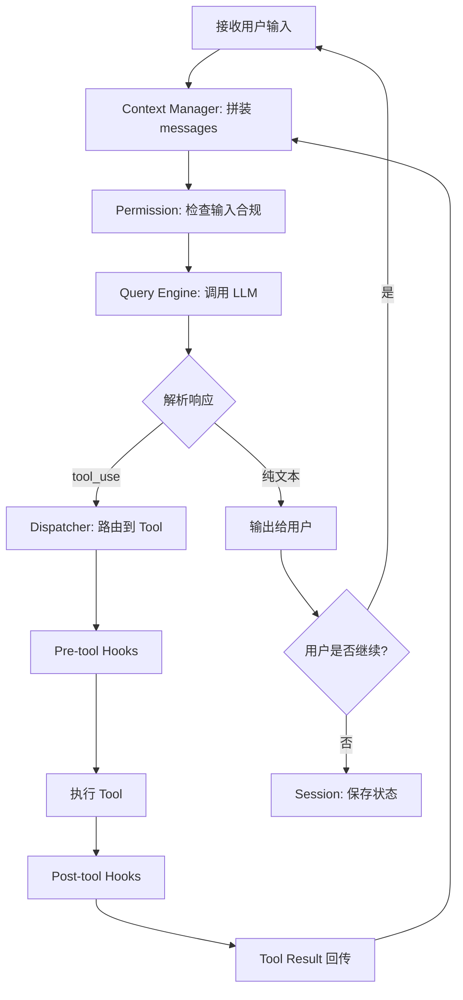
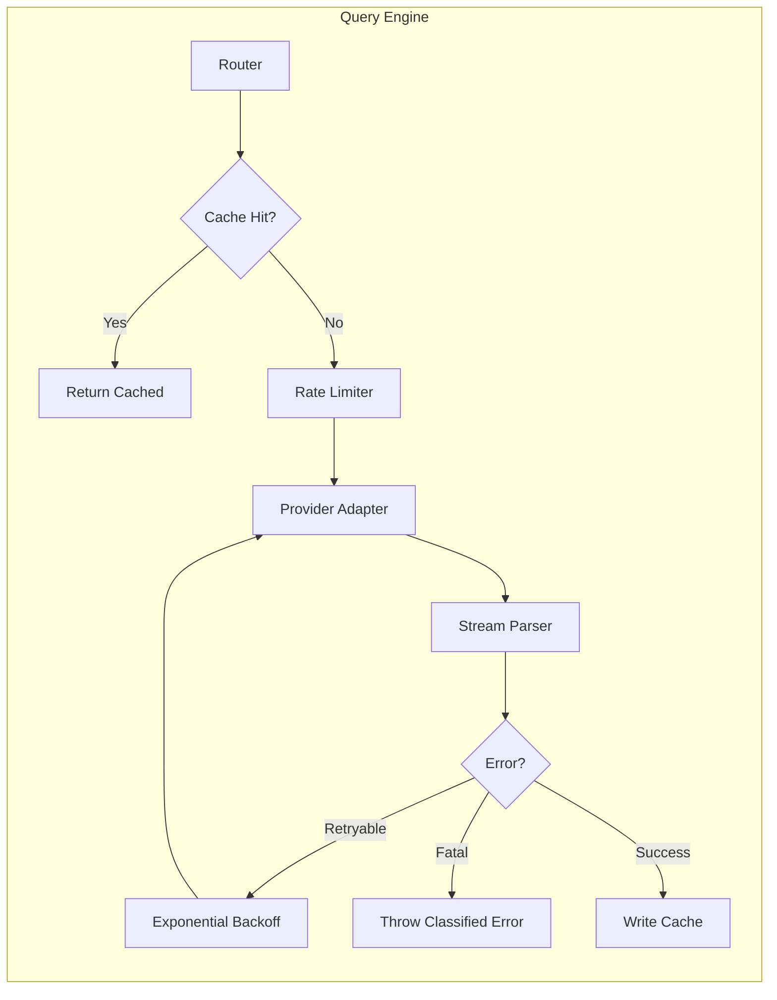
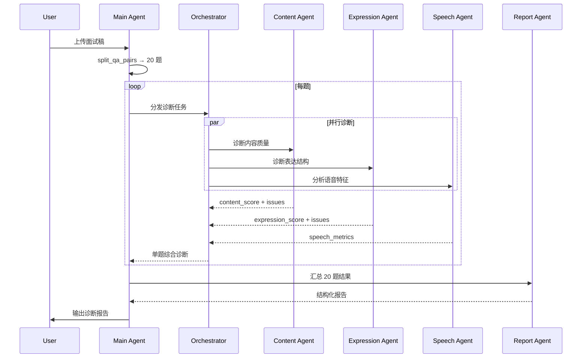
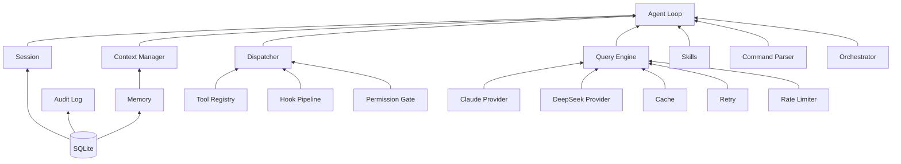

# 系统架构设计

上一篇 PRD 定义了"做什么"，这篇定义"怎么做"——模块怎么划分、数据怎么流动、接口怎么定义。

核心设计决策：**不用框架，手写 Harness。** Agent loop、tool dispatch、stream 解析、context 管理全部自己实现。代码即教程，每一层都是可独立讲解的工程模块。

## 整体目录结构

```text
interview-diagnosis-agent/
├── src/
│   ├── index.ts                 # CLI 入口（Commander.js）
│   ├── agent/
│   │   ├── loop.ts             # 核心 Agent Loop
│   │   ├── dispatcher.ts      # Tool Call 分发器
│   │   └── orchestrator.ts    # Sub-agent 编排器
│   ├── query-engine/
│   │   ├── provider.ts        # LLM Provider 抽象（Claude / DeepSeek）
│   │   ├── stream.ts          # 流式响应解析
│   │   ├── retry.ts           # 重试策略
│   │   ├── cache.ts           # 语义缓存
│   │   └── rate-limiter.ts    # 令牌桶限流
│   ├── tools/
│   │   ├── registry.ts        # Tool 注册表
│   │   ├── schema.ts          # Tool JSON Schema 定义
│   │   ├── transcribe.ts      # STT 转写
│   │   ├── split-qa.ts        # Q&A 拆分
│   │   ├── knowledge-base.ts  # 知识库检索
│   │   ├── analyze-content.ts # 内容诊断
│   │   ├── analyze-speech.ts  # 语音分析
│   │   └── generate-report.ts # 报告生成
│   ├── skills/
│   │   ├── registry.ts        # Skill 注册与检索
│   │   ├── diagnose-transcript.ts
│   │   ├── diagnose-audio.ts
│   │   ├── mock-interview.ts
│   │   └── compare-expert.ts
│   ├── context/
│   │   ├── manager.ts         # 上下文拼装与窗口管理
│   │   ├── compressor.ts      # 自动压缩
│   │   └── budget.ts          # Token 预算追踪
│   ├── memory/
│   │   ├── store.ts           # Memory CRUD
│   │   ├── retriever.ts       # 召回策略
│   │   └── profile.ts         # 用户画像管理
│   ├── permission/
│   │   ├── gate.ts            # 权限检查入口
│   │   ├── rules.ts           # 规则定义
│   │   └── confirm.ts         # Human-in-the-loop 确认
│   ├── session/
│   │   ├── manager.ts         # Session CRUD
│   │   ├── state.ts           # 状态机定义
│   │   └── rewind.ts          # 回滚/恢复
│   ├── command/
│   │   ├── parser.ts          # 命令解析
│   │   └── handlers/          # 各命令处理器
│   ├── hooks/
│   │   ├── pipeline.ts        # Hook 执行管线
│   │   ├── pre-tool/          # 工具调用前 hooks
│   │   └── post-tool/         # 工具调用后 hooks
│   └── db/
│       ├── schema.sql          # DDL
│       ├── connection.ts       # SQLite 连接
│       └── migrations/         # Schema 迁移
├── knowledge/
│   ├── import.ts              # 从 learn-agent-interview 导入
│   ├── embed.ts               # 生成 embedding
│   └── data/                  # 导入后的结构化数据
├── tests/
├── package.json
├── tsconfig.json
└── pnpm-lock.yaml
```

## Agent Loop：核心运行时

整个系统最关键的一段代码——Agent 的主循环。手写，不依赖任何框架。



**伪代码（TypeScript）：**

```typescript
async function agentLoop(input: string, session: Session): Promise<void> {
  const context = contextManager.build(session, input);
  permission.checkInput(input);

  while (true) {
    const response = await queryEngine.stream({
      model: session.config.model,
      messages: context.messages,
      tools: toolRegistry.getSchemas(),
    });

    if (response.type === 'text') {
      output.print(response.content);
      session.addMessage({ role: 'assistant', content: response.content });
      break;
    }

    if (response.type === 'tool_use') {
      for (const toolCall of response.toolCalls) {
        const result = await dispatcher.execute(toolCall, session);
        context.addToolResult(toolCall.id, result);
      }
      // 继续循环，把 tool result 回传给模型
    }
  }

  sessionManager.save(session);
}
```

## Query Engine：模型调用层

不是 `await anthropic.messages.create()`，而是一个完整的可靠性层。



**Provider 接口（统一 Claude 和 DeepSeek）：**

```typescript
interface LLMProvider {
  name: string;
  stream(params: StreamParams): AsyncIterable<StreamChunk>;
  countTokens(messages: Message[]): number;
}

interface StreamParams {
  model: string;
  messages: Message[];
  tools?: ToolSchema[];
  maxTokens?: number;
  temperature?: number;
}

type StreamChunk =
  | { type: 'text_delta'; content: string }
  | { type: 'tool_use_start'; id: string; name: string }
  | { type: 'tool_use_delta'; input: string }
  | { type: 'tool_use_end' }
  | { type: 'message_end'; usage: TokenUsage };
```

**三个 Provider 实现：**

| Provider | SDK | 模型 | 用途 |
|----------|-----|------|------|
| ClaudeProvider | @anthropic-ai/sdk | claude-sonnet-4-20250514 | 主力诊断、报告生成 |
| OpenAIProvider | openai SDK | gpt-4o | 备用诊断、多模型交叉验证 |
| DeepSeekProvider | openai SDK (兼容) | deepseek-chat | 轻量任务、知识库摘要 |

## Tool 系统：注册 + Schema + 分发

每个 Tool 是一个标准接口：

```typescript
interface Tool<TInput, TOutput> {
  name: string;
  description: string;
  schema: JSONSchema;        // 参数的 JSON Schema
  execute(input: TInput, ctx: ToolContext): Promise<TOutput>;
}

interface ToolContext {
  session: Session;
  permission: PermissionGate;
  hooks: HookPipeline;
  abortSignal: AbortSignal;
}
```

**Tool Registry 的工作：**

```typescript
class ToolRegistry {
  private tools = new Map<string, Tool>();

  register(tool: Tool): void;
  getSchemas(): ToolSchema[];           // 给 LLM 的 tool 列表
  resolve(name: string): Tool;          // 按名称找 tool
  list(): ToolMetadata[];               // 列出所有 tool（不含实现）
}
```

**Dispatcher 的工作（关键路径）：**

```typescript
async function dispatch(toolCall: ToolCall, session: Session): Promise<ToolResult> {
  const tool = registry.resolve(toolCall.name);

  // 1. Pre-tool hooks
  await hooks.runPre(toolCall, session);

  // 2. Permission check
  permission.checkTool(toolCall);

  // 3. Execute
  const result = await tool.execute(toolCall.input, {
    session, permission, hooks, abortSignal: session.abortController.signal
  });

  // 4. Post-tool hooks
  await hooks.runPost(toolCall, result, session);

  return { toolCallId: toolCall.id, content: JSON.stringify(result) };
}
```

## Context Manager：信息密度控制

```typescript
interface ContextManager {
  build(session: Session, input: string): ContextWindow;
  addToolResult(id: string, result: ToolResult): void;
  compact(): void;            // 手动触发压缩
  autoCompact(): void;        // 接近 token 上限时自动压缩
  getTokenCount(): number;
  getBudget(): TokenBudget;
}

interface ContextWindow {
  messages: Message[];
  systemPrompt: string;
  tokenCount: number;
  maxTokens: number;
}
```

**压缩策略（分层）：**

```text
Level 0: 无压缩（token < 50%）
Level 1: 工具输出截断（保留 top 段落）
Level 2: 历史对话摘要（保留最近 3 轮完整，其余压缩）
Level 3: 主动 compact（调用模型生成全局摘要）
```

## Memory Store：SQLite 实现

```sql
CREATE TABLE memories (
  id TEXT PRIMARY KEY,
  type TEXT NOT NULL,          -- 'user_profile' | 'diagnosis_history' | 'session_context'
  key TEXT NOT NULL,
  value TEXT NOT NULL,         -- JSON
  embedding BLOB,             -- 向量（可选）
  created_at TEXT NOT NULL,
  updated_at TEXT NOT NULL,
  expires_at TEXT              -- 短期记忆有过期时间
);

CREATE INDEX idx_memories_type ON memories(type);
CREATE INDEX idx_memories_key ON memories(key);
```

**接口：**

```typescript
interface MemoryStore {
  create(type: MemoryType, key: string, value: unknown): void;
  retrieve(query: string, opts?: { type?: MemoryType; limit?: number }): Memory[];
  update(id: string, value: unknown): void;
  delete(id: string): void;
  getProfile(): UserProfile;
  updateProfile(patch: Partial<UserProfile>): void;
}
```

## Permission Gate：风险分级

```typescript
type RiskLevel = 'low' | 'medium' | 'high' | 'critical';

interface PermissionRule {
  pattern: string | RegExp;   // 匹配 tool name 或参数
  level: RiskLevel;
  action: 'allow' | 'confirm' | 'deny';
  reason: string;
}

interface PermissionGate {
  checkTool(toolCall: ToolCall): Promise<PermissionResult>;
  checkInput(input: string): void;
  addRule(rule: PermissionRule): void;
  getRules(): PermissionRule[];
}

// confirm 时调用 human-in-the-loop
interface PermissionResult {
  allowed: boolean;
  reason?: string;
  confirmedBy?: 'rule' | 'user';
}
```

## Session Manager：状态持久化

```sql
CREATE TABLE sessions (
  id TEXT PRIMARY KEY,
  status TEXT NOT NULL,        -- 'created' | 'processing' | 'paused' | 'completed' | 'failed'
  input_type TEXT NOT NULL,    -- 'transcript' | 'audio'
  input_path TEXT,
  config TEXT NOT NULL,        -- JSON: model, temperature, etc.
  progress TEXT NOT NULL,      -- JSON: { total: 20, done: 12, current: 13 }
  created_at TEXT NOT NULL,
  updated_at TEXT NOT NULL
);

CREATE TABLE session_messages (
  id INTEGER PRIMARY KEY AUTOINCREMENT,
  session_id TEXT NOT NULL REFERENCES sessions(id),
  role TEXT NOT NULL,
  content TEXT NOT NULL,
  tool_calls TEXT,            -- JSON
  token_count INTEGER,
  created_at TEXT NOT NULL
);

CREATE TABLE session_checkpoints (
  id TEXT PRIMARY KEY,
  session_id TEXT NOT NULL REFERENCES sessions(id),
  snapshot TEXT NOT NULL,      -- JSON: 完整状态快照
  created_at TEXT NOT NULL
);
```

## Hook Pipeline：可插拔扩展

```typescript
type HookTiming = 'pre-tool' | 'post-tool';

interface Hook {
  name: string;
  timing: HookTiming;
  priority: number;           // 越小越先执行
  execute(ctx: HookContext): Promise<void>;
}

interface HookContext {
  toolCall: ToolCall;
  result?: ToolResult;        // post-tool 才有
  session: Session;
  metadata: Record<string, unknown>;  // hook 间传递数据
}

class HookPipeline {
  register(hook: Hook): void;
  async runPre(toolCall: ToolCall, session: Session): Promise<void>;
  async runPost(toolCall: ToolCall, result: ToolResult, session: Session): Promise<void>;
}
```

**默认 Hooks：**

| Hook | Timing | Priority | 职责 |
|------|--------|----------|------|
| permission-check | pre | 10 | 权限检查 |
| input-sanitize | pre | 20 | 敏感信息过滤 |
| budget-check | pre | 30 | Token 预算检查 |
| audit-log | post | 10 | 记录调用日志 |
| result-compress | post | 20 | 压缩输出，控制上下文 |
| memory-trigger | post | 30 | 判断是否更新记忆 |
| progress-update | post | 40 | 更新 session 进度 |

## Command Layer：确定性入口

```typescript
interface Command {
  name: string;
  aliases?: string[];
  description: string;
  args?: ArgumentSchema[];
  execute(args: ParsedArgs, session: Session): Promise<void>;
}

class CommandParser {
  register(cmd: Command): void;
  parse(input: string): { command: Command; args: ParsedArgs } | null;
  isCommand(input: string): boolean;  // 以 / 开头
  listCommands(): CommandMetadata[];
}
```

## Sub-agent：并行诊断编排

```typescript
interface SubAgent {
  id: string;
  name: string;
  tools: string[];            // 该子 agent 可用的 tool 名称
  systemPrompt: string;       // 子 agent 专属 system prompt
  contextBoundary: string[];  // 传入的上下文字段
}

interface Orchestrator {
  spawn(agent: SubAgent, input: string): Promise<AgentResult>;
  parallel(agents: SubAgent[], inputs: string[]): Promise<AgentResult[]>;
  aggregate(results: AgentResult[]): DiagnosisReport;
}
```

**诊断任务的编排流程：**



## 数据流：一次完整诊断的生命周期

```text
用户输入文字稿
  │
  ├─ CommandParser: 不是命令，进入 Agent Loop
  │
  ├─ Context Manager: 拼装 system prompt + 用户输入
  │
  ├─ Query Engine → LLM: "请分析这段面试稿"
  │
  ├─ LLM 返回 tool_use: split_qa_pairs
  │   ├─ Pre-hook: permission ✓, budget ✓
  │   ├─ Execute: 拆出 15 道 Q&A
  │   ├─ Post-hook: audit log, progress update
  │   └─ Result 回传 Context
  │
  ├─ LLM 返回 tool_use: query_knowledge_base (Q1)
  │   ├─ Execute: FTS5 + embedding → top-3 参考答案
  │   └─ Result 回传
  │
  ├─ LLM 返回 tool_use: analyze_content (Q1)
  │   ├─ Execute: 对比用户答案 vs 参考 → 诊断结果
  │   ├─ Post-hook: result-compress (截断到 500 tokens)
  │   └─ Result 回传
  │
  ├─ ... 重复 Q2–Q15 ...
  │
  ├─ Context Manager: 历史诊断结果已压缩为摘要
  │
  ├─ LLM 返回 tool_use: generate_report
  │   ├─ Execute: 汇总所有诊断 → 结构化报告
  │   └─ Result 回传
  │
  ├─ LLM 返回 text: 最终报告输出给用户
  │
  └─ Session Manager: 保存完整状态 + checkpoint
```

## 依赖清单（package.json 核心）

```json
{
  "dependencies": {
    "@anthropic-ai/sdk": "^0.52.0",
    "openai": "^4.70.0",
    "better-sqlite3": "^11.0.0",
    "commander": "^12.0.0",
    "chalk": "^5.3.0",
    "ora": "^8.0.0"
  },
  "devDependencies": {
    "typescript": "^5.5.0",
    "vitest": "^2.0.0",
    "@types/better-sqlite3": "^7.6.0",
    "tsx": "^4.0.0"
  }
}
```

极简依赖：两个 LLM SDK + SQLite + CLI 工具。Harness 的全部逻辑自己写。

## 模块间依赖关系



**依赖规则：**

- Agent Loop 是顶层调度者，依赖所有模块
- 各模块之间不直接互相依赖（通过 Agent Loop 协调）
- DB 是最底层，被 Session / Memory / Audit 依赖
- Query Engine 独立，只被 Agent Loop 和 Orchestrator 使用

## 小结

- 纯手写 Harness，不用 LangChain / LangGraph，代码本身就是可讲解的工程教程
- 10 层模块各有清晰接口，通过 Agent Loop 统一调度
- 直接调 Anthropic SDK + OpenAI SDK，自己封装 stream / retry / cache
- SQLite 单文件数据库，覆盖 session / memory / audit 三类持久化
- 依赖极简：两个 SDK + SQLite + CLI，其余全部自实现

下一篇建议继续看：

- [03-query-engine：模型调用层实现](../03-query-engine/index.html)（待产出）
