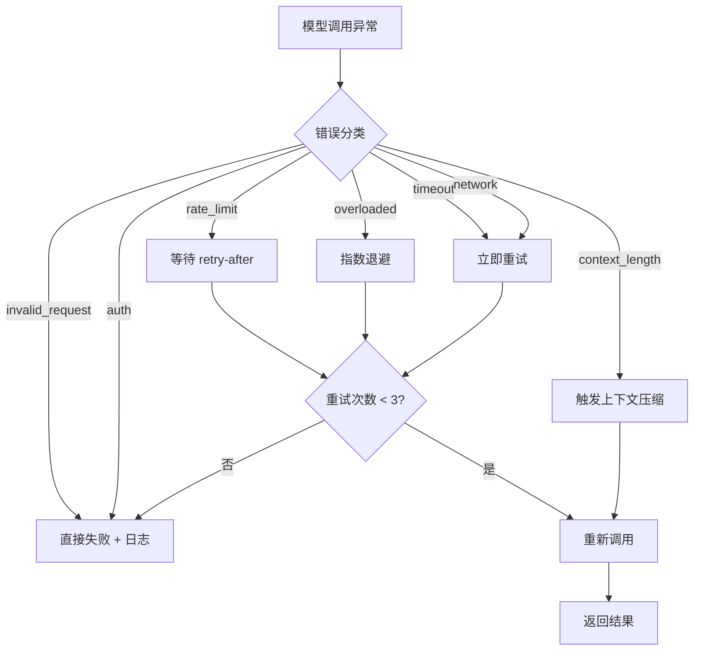

# Query Engine 实现

Query Engine 是 Harness 的第一个要做稳的模块。原因很简单：Agent 的每一步决策都要过它，如果这层不稳，上面所有逻辑都是空中楼阁。

很多人写 Agent 把模型调用当成一行代码：

```typescript
const result = await anthropic.messages.create({ ... });
```

这对 Demo 没问题。但生产环境你会遇到：

- 模型 API 偶发 500，需要重试
- 请求太频繁被限流，需要排队
- 流式输出中途断开，需要优雅恢复
- 相同问题反复问，需要缓存
- 不同任务适合不同模型，需要路由
- Token 用超了，需要预判和截断

Query Engine 就是把这些问题收敛到一层，让上层只关心“发消息、收回复”。

## 模块结构

```text
src/query-engine/
├── index.ts           # 统一出口
├── engine.ts          # QueryEngine 主类
├── provider.ts        # Provider 接口定义
├── providers/
│   ├── claude.ts      # Anthropic 实现
│   ├── openai.ts      # OpenAI 实现
│   └── deepseek.ts    # DeepSeek 实现（继承 OpenAI）
├── stream.ts          # 流式响应解析器
├── retry.ts           # 重试策略
├── cache.ts           # 语义缓存
├── rate-limiter.ts    # 令牌桶限流
├── router.ts          # 模型路由
├── token-counter.ts   # Token 计数与预算
└── errors.ts          # 统一错误分类
```

## Provider 接口：统一三家模型

三家模型 API 的差异不小（Anthropic 有自己的格式，OpenAI 和 DeepSeek 共用 OpenAI 格式但细节有别），Provider 层把这些差异屏蔽掉。

```typescript
// provider.ts

export interface StreamParams {
  model: string;
  messages: Message[];
  tools?: ToolSchema[];
  maxTokens?: number;
  temperature?: number;
  systemPrompt?: string;
  abortSignal?: AbortSignal;
}

export interface TokenUsage {
  inputTokens: number;
  outputTokens: number;
  cacheReadTokens?: number;
  cacheWriteTokens?: number;
}

export type StreamEvent =
  | { type: 'text_delta'; content: string }
  | { type: 'tool_use_start'; id: string; name: string }
  | { type: 'tool_use_delta'; input: string }
  | { type: 'tool_use_end' }
  | { type: 'message_end'; usage: TokenUsage; stopReason: StopReason };

export type StopReason = 'end_turn' | 'tool_use' | 'max_tokens';

export interface LLMProvider {
  name: string;
  stream(params: StreamParams): AsyncIterable<StreamEvent>;
  countTokens(messages: Message[], tools?: ToolSchema[]): Promise<number>;
}
```

## Claude Provider 实现

Anthropic SDK 有独立的消息格式和 tool calling 协议，需要做转换。

```typescript
// providers/claude.ts

import Anthropic from '@anthropic-ai/sdk';
import { LLMProvider, StreamParams, StreamEvent } from '../provider';

export class ClaudeProvider implements LLMProvider {
  name = 'claude';
  private client: Anthropic;

  constructor(apiKey: string) {
    this.client = new Anthropic({ apiKey });
  }

  async *stream(params: StreamParams): AsyncIterable<StreamEvent> {
    const stream = this.client.messages.stream({
      model: params.model,
      max_tokens: params.maxTokens ?? 4096,
      temperature: params.temperature ?? 0,
      system: params.systemPrompt,
      messages: this.toAnthropicMessages(params.messages),
      tools: params.tools ? this.toAnthropicTools(params.tools) : undefined,
    });

    for await (const event of stream) {
      switch (event.type) {
        case 'content_block_start':
          if (event.content_block.type === 'tool_use') {
            yield {
              type: 'tool_use_start',
              id: event.content_block.id,
              name: event.content_block.name,
            };
          }
          break;

        case 'content_block_delta':
          if (event.delta.type === 'text_delta') {
            yield { type: 'text_delta', content: event.delta.text };
          } else if (event.delta.type === 'input_json_delta') {
            yield { type: 'tool_use_delta', input: event.delta.partial_json };
          }
          break;

        case 'content_block_stop':
          // 判断是否是 tool_use block 结束
          yield { type: 'tool_use_end' };
          break;

        case 'message_stop':
          const finalMessage = await stream.finalMessage();
          yield {
            type: 'message_end',
            usage: {
              inputTokens: finalMessage.usage.input_tokens,
              outputTokens: finalMessage.usage.output_tokens,
              cacheReadTokens: finalMessage.usage.cache_read_input_tokens,
              cacheWriteTokens: finalMessage.usage.cache_creation_input_tokens,
            },
            stopReason: finalMessage.stop_reason as StopReason,
          };
          break;
      }
    }
  }

  async countTokens(messages: Message[], tools?: ToolSchema[]): Promise<number> {
    const result = await this.client.messages.countTokens({
      model: 'claude-sonnet-4-20250514',
      messages: this.toAnthropicMessages(messages),
      tools: tools ? this.toAnthropicTools(tools) : undefined,
    });
    return result.input_tokens;
  }

  private toAnthropicMessages(messages: Message[]): Anthropic.MessageParam[] {
    // 转换通用 Message 格式到 Anthropic 格式
    // 处理 tool_result 消息的嵌套结构
  }

  private toAnthropicTools(tools: ToolSchema[]): Anthropic.Tool[] {
    return tools.map(t => ({
      name: t.name,
      description: t.description,
      input_schema: t.parameters,
    }));
  }
}
```

## OpenAI Provider 实现

OpenAI 和 DeepSeek 共用 OpenAI SDK，但 base URL 不同。

```typescript
// providers/openai.ts

import OpenAI from 'openai';
import { LLMProvider, StreamParams, StreamEvent } from '../provider';

export class OpenAIProvider implements LLMProvider {
  name = 'openai';
  protected client: OpenAI;

  constructor(apiKey: string, baseURL?: string) {
    this.client = new OpenAI({ apiKey, baseURL });
  }

  async *stream(params: StreamParams): AsyncIterable<StreamEvent> {
    const messages = this.toOpenAIMessages(params);
    const stream = await this.client.chat.completions.create({
      model: params.model,
      messages,
      tools: params.tools ? this.toOpenAITools(params.tools) : undefined,
      max_tokens: params.maxTokens ?? 4096,
      temperature: params.temperature ?? 0,
      stream: true,
    });

    let currentToolCallId = '';
    let currentToolName = '';
    let inputTokens = 0;
    let outputTokens = 0;

    for await (const chunk of stream) {
      const delta = chunk.choices[0]?.delta;
      if (!delta) continue;

      // 文本输出
      if (delta.content) {
        yield { type: 'text_delta', content: delta.content };
      }

      // Tool call
      if (delta.tool_calls) {
        for (const tc of delta.tool_calls) {
          if (tc.id) {
            currentToolCallId = tc.id;
            currentToolName = tc.function?.name ?? '';
            yield { type: 'tool_use_start', id: currentToolCallId, name: currentToolName };
          }
          if (tc.function?.arguments) {
            yield { type: 'tool_use_delta', input: tc.function.arguments };
          }
        }
      }

      // 结束
      if (chunk.choices[0]?.finish_reason) {
        if (currentToolCallId) {
          yield { type: 'tool_use_end' };
        }

        if (chunk.usage) {
          inputTokens = chunk.usage.prompt_tokens;
          outputTokens = chunk.usage.completion_tokens;
        }

        yield {
          type: 'message_end',
          usage: { inputTokens, outputTokens },
          stopReason: this.mapStopReason(chunk.choices[0].finish_reason),
        };
      }
    }
  }

  async countTokens(messages: Message[]): Promise<number> {
    // OpenAI 没有官方 count API，用 tiktoken 本地估算
    // 或简单按 4 chars ≈ 1 token 粗估
    const text = JSON.stringify(messages);
    return Math.ceil(text.length / 4);
  }

  private toOpenAIMessages(params: StreamParams): OpenAI.ChatCompletionMessageParam[] {
    const msgs: OpenAI.ChatCompletionMessageParam[] = [];
    if (params.systemPrompt) {
      msgs.push({ role: 'system', content: params.systemPrompt });
    }
    // 转换通用 Message → OpenAI 格式
    // 处理 tool_result → tool role 的映射
    return msgs;
  }

  private toOpenAITools(tools: ToolSchema[]): OpenAI.ChatCompletionTool[] {
    return tools.map(t => ({
      type: 'function',
      function: {
        name: t.name,
        description: t.description,
        parameters: t.parameters,
      },
    }));
  }

  private mapStopReason(reason: string): StopReason {
    if (reason === 'tool_calls') return 'tool_use';
    if (reason === 'length') return 'max_tokens';
    return 'end_turn';
  }
}
```

## DeepSeek Provider：继承 OpenAI

DeepSeek 兼容 OpenAI 接口，只需换 base URL 和模型名。

```typescript
// providers/deepseek.ts

import { OpenAIProvider } from './openai';

export class DeepSeekProvider extends OpenAIProvider {
  name = 'deepseek';

  constructor(apiKey: string) {
    super(apiKey, 'https://api.deepseek.com');
  }
}

// 使用时：
// const ds = new DeepSeekProvider(process.env.DEEPSEEK_API_KEY);
// ds.stream({ model: 'deepseek-chat', messages: [...] });
```

这就是 OpenAI 兼容接口的好处——DeepSeek 的 Provider 只有 8 行代码。未来接入 Qwen、GLM 等国产模型同理。

## Stream Parser：把流式事件组装成结构化响应

Provider 产出的是一个个 StreamEvent，Agent Loop 需要的是完整的结构化响应。Stream Parser 负责这个组装。

```typescript
// stream.ts

export interface ParsedResponse {
  type: 'text' | 'tool_use';
  content?: string;
  toolCalls?: ToolCall[];
  usage: TokenUsage;
  stopReason: StopReason;
}

export interface ToolCall {
  id: string;
  name: string;
  input: Record<string, unknown>;
}

export async function parseStream(
  events: AsyncIterable<StreamEvent>,
  onTextDelta?: (text: string) => void,
): Promise<ParsedResponse> {
  let textContent = '';
  const toolCalls: ToolCall[] = [];
  let currentToolInput = '';
  let currentToolId = '';
  let currentToolName = '';
  let usage: TokenUsage = { inputTokens: 0, outputTokens: 0 };
  let stopReason: StopReason = 'end_turn';

  for await (const event of events) {
    switch (event.type) {
      case 'text_delta':
        textContent += event.content;
        onTextDelta?.(event.content);
        break;

      case 'tool_use_start':
        currentToolId = event.id;
        currentToolName = event.name;
        currentToolInput = '';
        break;

      case 'tool_use_delta':
        currentToolInput += event.input;
        break;

      case 'tool_use_end':
        toolCalls.push({
          id: currentToolId,
          name: currentToolName,
          input: JSON.parse(currentToolInput),
        });
        break;

      case 'message_end':
        usage = event.usage;
        stopReason = event.stopReason;
        break;
    }
  }

  return {
    type: toolCalls.length > 0 ? 'tool_use' : 'text',
    content: textContent || undefined,
    toolCalls: toolCalls.length > 0 ? toolCalls : undefined,
    usage,
    stopReason,
  };
}
```

## Retry：分类错误 + 指数退避

不是所有错误都该重试。先分类，再决定策略。

```typescript
// errors.ts

export type ErrorCategory =
  | 'rate_limit'      // 429，应该等待后重试
  | 'overloaded'      // 529/503，服务过载，退避重试
  | 'timeout'         // 请求超时，可重试
  | 'network'         // 网络错误，可重试
  | 'invalid_request' // 400，参数错误，不可重试
  | 'auth'            // 401/403，鉴权失败，不可重试
  | 'context_length'  // 上下文超长，需要压缩后重试
  | 'unknown';        // 未知错误

export class QueryEngineError extends Error {
  constructor(
    message: string,
    public category: ErrorCategory,
    public retryable: boolean,
    public retryAfterMs?: number,
  ) {
    super(message);
  }
}

export function classifyError(err: unknown): QueryEngineError {
  if (err instanceof Anthropic.RateLimitError) {
    const retryAfter = parseInt(err.headers?.['retry-after'] ?? '5') * 1000;
    return new QueryEngineError('Rate limited', 'rate_limit', true, retryAfter);
  }
  if (err instanceof Anthropic.APIStatusError) {
    if (err.status === 529) return new QueryEngineError('Overloaded', 'overloaded', true, 10000);
    if (err.status === 400) return new QueryEngineError(err.message, 'invalid_request', false);
    if (err.status === 401) return new QueryEngineError('Auth failed', 'auth', false);
  }
  if (err instanceof Error && err.message.includes('timeout')) {
    return new QueryEngineError('Timeout', 'timeout', true, 3000);
  }
  return new QueryEngineError(String(err), 'unknown', false);
}
```

```typescript
// retry.ts

export interface RetryConfig {
  maxRetries: number;
  baseDelayMs: number;
  maxDelayMs: number;
  backoffMultiplier: number;
}

const DEFAULT_RETRY_CONFIG: RetryConfig = {
  maxRetries: 3,
  baseDelayMs: 1000,
  maxDelayMs: 30000,
  backoffMultiplier: 2,
};

export async function withRetry<T>(
  fn: () => Promise<T>,
  config: RetryConfig = DEFAULT_RETRY_CONFIG,
): Promise<T> {
  let lastError: QueryEngineError | undefined;

  for (let attempt = 0; attempt <= config.maxRetries; attempt++) {
    try {
      return await fn();
    } catch (err) {
      const classified = classifyError(err);

      if (!classified.retryable || attempt === config.maxRetries) {
        throw classified;
      }

      lastError = classified;
      const delay = classified.retryAfterMs ??
        Math.min(
          config.baseDelayMs * Math.pow(config.backoffMultiplier, attempt),
          config.maxDelayMs,
        );

      await sleep(delay);
    }
  }

  throw lastError;
}

function sleep(ms: number): Promise<void> {
  return new Promise(resolve => setTimeout(resolve, ms));
}
```

## Rate Limiter：令牌桶算法

防止瞬间打满 API 限额，尤其是 Sub-agent 并行诊断时。

```typescript
// rate-limiter.ts

export class TokenBucketLimiter {
  private tokens: number;
  private lastRefill: number;
  private queue: Array<{ resolve: () => void }> = [];

  constructor(
    private maxTokens: number,        // 桶容量
    private refillRate: number,       // 每秒补充多少
  ) {
    this.tokens = maxTokens;
    this.lastRefill = Date.now();
  }

  async acquire(): Promise<void> {
    this.refill();

    if (this.tokens >= 1) {
      this.tokens -= 1;
      return;
    }

    // 桶空了，排队等待
    return new Promise(resolve => {
      this.queue.push({ resolve });
      setTimeout(() => this.processQueue(), 1000 / this.refillRate);
    });
  }

  private refill(): void {
    const now = Date.now();
    const elapsed = (now - this.lastRefill) / 1000;
    this.tokens = Math.min(this.maxTokens, this.tokens + elapsed * this.refillRate);
    this.lastRefill = now;
  }

  private processQueue(): void {
    this.refill();
    while (this.tokens >= 1 && this.queue.length > 0) {
      this.tokens -= 1;
      this.queue.shift()!.resolve();
    }
  }
}
```

## Cache：避免重复调用

面试诊断中有大量重复场景：同一道面试题的知识库检索、相似回答的诊断。Cache 层可以显著降低成本。

```typescript
// cache.ts

import Database from 'better-sqlite3';

export interface CacheEntry {
  key: string;
  response: string;       // JSON serialized ParsedResponse
  tokensSaved: number;
  createdAt: string;
  expiresAt: string;
}

export class QueryCache {
  private db: Database.Database;

  constructor(dbPath: string) {
    this.db = new Database(dbPath);
    this.db.exec(`
      CREATE TABLE IF NOT EXISTS query_cache (
        key TEXT PRIMARY KEY,
        response TEXT NOT NULL,
        tokens_saved INTEGER NOT NULL,
        created_at TEXT NOT NULL,
        expires_at TEXT NOT NULL
      )
    `);
  }

  get(key: string): ParsedResponse | null {
    const row = this.db.prepare(
      'SELECT response FROM query_cache WHERE key = ? AND expires_at > datetime("now")'
    ).get(key) as { response: string } | undefined;

    return row ? JSON.parse(row.response) : null;
  }

  set(key: string, response: ParsedResponse, ttlSeconds: number): void {
    this.db.prepare(`
      INSERT OR REPLACE INTO query_cache (key, response, tokens_saved, created_at, expires_at)
      VALUES (?, ?, ?, datetime('now'), datetime('now', '+' || ? || ' seconds'))
    `).run(key, JSON.stringify(response), response.usage.inputTokens, ttlSeconds);
  }

  generateKey(params: StreamParams): string {
    // 基于 model + messages + tools 生成确定性 hash
    const payload = JSON.stringify({
      model: params.model,
      messages: params.messages,
      tools: params.tools?.map(t => t.name),
      temperature: params.temperature,
    });
    return createHash('sha256').update(payload).digest('hex').slice(0, 16);
  }

  evictExpired(): number {
    const result = this.db.prepare(
      'DELETE FROM query_cache WHERE expires_at <= datetime("now")'
    ).run();
    return result.changes;
  }
}
```

## Router：按任务选模型

不是所有任务都需要最强模型。Router 根据任务类型自动选择。

```typescript
// router.ts

export interface RouteRule {
  task: string;              // 任务标识
  provider: string;          // provider name
  model: string;             // 模型 id
  reason: string;            // 路由原因（debug 用）
}

const DEFAULT_ROUTES: RouteRule[] = [
  { task: 'diagnose_content', provider: 'claude', model: 'claude-sonnet-4-20250514', reason: '需要深度分析能力' },
  { task: 'diagnose_expression', provider: 'claude', model: 'claude-sonnet-4-20250514', reason: '需要语言理解能力' },
  { task: 'generate_report', provider: 'claude', model: 'claude-sonnet-4-20250514', reason: '长文本生成' },
  { task: 'knowledge_summary', provider: 'deepseek', model: 'deepseek-chat', reason: '轻量摘要，成本低' },
  { task: 'split_qa', provider: 'deepseek', model: 'deepseek-chat', reason: '结构化拆分，简单任务' },
  { task: 'cross_validate', provider: 'openai', model: 'gpt-4o', reason: '多模型交叉验证，避免单一偏差' },
  { task: 'embedding', provider: 'openai', model: 'text-embedding-3-small', reason: '向量化' },
];

export class ModelRouter {
  private rules: RouteRule[];

  constructor(rules?: RouteRule[]) {
    this.rules = rules ?? DEFAULT_ROUTES;
  }

  resolve(task: string): { provider: string; model: string } {
    const rule = this.rules.find(r => r.task === task);
    if (!rule) {
      // 默认走 Claude
      return { provider: 'claude', model: 'claude-sonnet-4-20250514' };
    }
    return { provider: rule.provider, model: rule.model };
  }
}
```

## Token Counter：预算管理

每次诊断有成本上限，Token Counter 负责实时追踪。

```typescript
// token-counter.ts

export interface TokenBudget {
  maxInputTokens: number;
  maxOutputTokens: number;
  maxTotalCost: number;     // 单位：美元
  spent: {
    inputTokens: number;
    outputTokens: number;
    totalCost: number;
    requests: number;
  };
}

export class TokenCounter {
  private budget: TokenBudget;

  constructor(budget: Partial<TokenBudget> = {}) {
    this.budget = {
      maxInputTokens: budget.maxInputTokens ?? 500_000,
      maxOutputTokens: budget.maxOutputTokens ?? 100_000,
      maxTotalCost: budget.maxTotalCost ?? 1.0,
      spent: { inputTokens: 0, outputTokens: 0, totalCost: 0, requests: 0 },
    };
  }

  record(usage: TokenUsage, provider: string): void {
    this.budget.spent.inputTokens += usage.inputTokens;
    this.budget.spent.outputTokens += usage.outputTokens;
    this.budget.spent.totalCost += this.calculateCost(usage, provider);
    this.budget.spent.requests += 1;
  }

  checkBudget(): { ok: boolean; reason?: string } {
    if (this.budget.spent.totalCost >= this.budget.maxTotalCost) {
      return { ok: false, reason: `Cost limit reached: $${this.budget.spent.totalCost.toFixed(4)}` };
    }
    if (this.budget.spent.inputTokens >= this.budget.maxInputTokens) {
      return { ok: false, reason: 'Input token limit reached' };
    }
    return { ok: true };
  }

  getSummary(): string {
    const { spent } = this.budget;
    return `Requests: ${spent.requests} | Tokens: ${spent.inputTokens}in + ${spent.outputTokens}out | Cost: $${spent.totalCost.toFixed(4)}`;
  }

  private calculateCost(usage: TokenUsage, provider: string): number {
    const pricing: Record<string, { input: number; output: number }> = {
      claude: { input: 3.0 / 1_000_000, output: 15.0 / 1_000_000 },
      openai: { input: 2.5 / 1_000_000, output: 10.0 / 1_000_000 },
      deepseek: { input: 0.27 / 1_000_000, output: 1.10 / 1_000_000 },
    };
    const p = pricing[provider] ?? pricing.claude;
    return usage.inputTokens * p.input + usage.outputTokens * p.output;
  }
}
```

## QueryEngine 主类：把所有模块组装起来

```typescript
// engine.ts

export class QueryEngine {
  private providers: Map<string, LLMProvider>;
  private cache: QueryCache;
  private rateLimiter: TokenBucketLimiter;
  private router: ModelRouter;
  private tokenCounter: TokenCounter;

  constructor(config: QueryEngineConfig) {
    this.providers = new Map();
    this.providers.set('claude', new ClaudeProvider(config.anthropicApiKey));
    this.providers.set('openai', new OpenAIProvider(config.openaiApiKey));
    this.providers.set('deepseek', new DeepSeekProvider(config.deepseekApiKey));

    this.cache = new QueryCache(config.cachePath);
    this.rateLimiter = new TokenBucketLimiter(config.rateLimit ?? 10, config.refillRate ?? 2);
    this.router = new ModelRouter(config.routes);
    this.tokenCounter = new TokenCounter(config.budget);
  }

  async query(params: QueryParams): Promise<ParsedResponse> {
    // 1. 预算检查
    const budgetCheck = this.tokenCounter.checkBudget();
    if (!budgetCheck.ok) {
      throw new QueryEngineError(budgetCheck.reason!, 'rate_limit', false);
    }

    // 2. 路由选择
    const route = params.task
      ? this.router.resolve(params.task)
      : { provider: 'claude', model: params.model ?? 'claude-sonnet-4-20250514' };

    // 3. 缓存检查
    const streamParams: StreamParams = {
      model: route.model,
      messages: params.messages,
      tools: params.tools,
      maxTokens: params.maxTokens,
      temperature: params.temperature,
      systemPrompt: params.systemPrompt,
    };

    if (params.useCache !== false) {
      const cacheKey = this.cache.generateKey(streamParams);
      const cached = this.cache.get(cacheKey);
      if (cached) return cached;
    }

    // 4. 限流等待
    await this.rateLimiter.acquire();

    // 5. 带重试的模型调用
    const provider = this.providers.get(route.provider)!;
    const response = await withRetry(async () => {
      const events = provider.stream(streamParams);
      return parseStream(events, params.onTextDelta);
    });

    // 6. 记录 token 消耗
    this.tokenCounter.record(response.usage, route.provider);

    // 7. 写入缓存
    if (params.useCache !== false && response.type === 'text') {
      const cacheKey = this.cache.generateKey(streamParams);
      this.cache.set(cacheKey, response, params.cacheTtl ?? 3600);
    }

    return response;
  }

  getUsageSummary(): string {
    return this.tokenCounter.getSummary();
  }
}
```

**上层使用示例：**

```typescript
const engine = new QueryEngine({
  anthropicApiKey: process.env.ANTHROPIC_API_KEY!,
  openaiApiKey: process.env.OPENAI_API_KEY!,
  deepseekApiKey: process.env.DEEPSEEK_API_KEY!,
  cachePath: './data/cache.db',
});

// 诊断任务——自动路由到 Claude
const diagnosis = await engine.query({
  task: 'diagnose_content',
  messages: [{ role: 'user', content: '请诊断这个回答...' }],
  tools: diagnosticTools,
  onTextDelta: (text) => process.stdout.write(text),
});

// 轻量任务——自动路由到 DeepSeek
const split = await engine.query({
  task: 'split_qa',
  messages: [{ role: 'user', content: '请拆分以下面试稿...' }],
});

// 交叉验证——路由到 OpenAI
const validation = await engine.query({
  task: 'cross_validate',
  messages: [{ role: 'user', content: '请验证以下诊断结论...' }],
});
```

## 错误处理流程



`context_length` 错误比较特殊——不是简单重试，而是触发 Context Manager 的压缩逻辑，压缩后重新调用。这个跨模块协作是 Harness 架构的典型场景。

## 测试要点

```text
单元测试:
- Provider: mock HTTP 响应，验证 StreamEvent 转换正确
- Retry: 模拟各种错误，验证重试策略
- Cache: 验证命中/未命中/过期逻辑
- Rate Limiter: 验证并发控制和排队
- Token Counter: 验证预算计算和阈值判断

集成测试:
- 真实调用三家 API（需要 API key）
- 验证流式输出完整性
- 验证 tool_use 解析正确
- 压力测试：并发 10 请求，验证限流生效
```

## 小结

- Query Engine 是 Harness 的可靠性边界，把模型 API 的不确定性收敛到一层
- 三个 Provider 统一了 Claude / OpenAI / DeepSeek 的流式接口差异
- Router 按任务自动选模型：重活给 Claude，轻活给 DeepSeek，验证给 OpenAI
- Retry 基于错误分类决定策略，不是无脑重试
- Cache + Rate Limiter + Token Counter 三重成本控制
- 所有代码手写，不依赖 LangChain，每一行都可讲解

下一篇建议继续看：

- [04-tools-skills：工具层与技能层实现](../04-tools-skills/index.html)（待产出）
