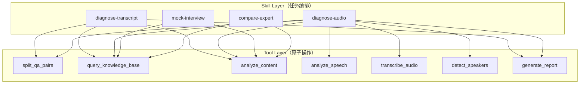

# Tools & Skills 实现

Tools 让 Agent 能动手，Skills 让 Agent 会做事。

这两层的区别很关键：Tool 是原子操作（读文件、调 API、跑查询），Skill 是一段可复用的任务流程（诊断一道题、生成报告）。把它们混在一起，系统会变成一坨无法复用的胶水代码。

## 模块结构

```text
src/tools/
├── registry.ts            # Tool 注册表
├── schema.ts              # JSON Schema 工具定义
├── types.ts               # 通用类型
├── transcribe.ts          # STT 转写
├── detect-speakers.ts     # 说话人分离
├── split-qa.ts            # Q&A 对拆分
├── knowledge-base.ts      # 知识库检索
├── analyze-content.ts     # 内容诊断
├── analyze-speech.ts      # 语音特征分析
├── generate-report.ts     # 报告生成
└── read-file.ts           # 文件读取

src/skills/
├── registry.ts            # Skill 注册与检索
├── types.ts               # Skill 类型定义
├── diagnose-transcript.ts # 文字稿全流程诊断
├── diagnose-audio.ts      # 录音全流程诊断
├── mock-interview.ts      # 模拟面试
└── compare-expert.ts      # 单题专家对比
```

## Tool 接口设计

每个 Tool 是一个标准化对象，包含名称、描述、参数 schema 和执行函数。

```typescript
// tools/types.ts

export interface ToolSchema {
  name: string;
  description: string;
  parameters: JSONSchema7;
}

export interface ToolResult<T = unknown> {
  success: boolean;
  data?: T;
  error?: {
    code: 'input_error' | 'service_error' | 'timeout' | 'permission_denied';
    message: string;
  };
}

export interface ToolContext {
  session: Session;
  queryEngine: QueryEngine;
  knowledgeBase: KnowledgeBase;
  abortSignal: AbortSignal;
}

export interface Tool<TInput = unknown, TOutput = unknown> {
  name: string;
  description: string;
  parameters: JSONSchema7;
  execute(input: TInput, ctx: ToolContext): Promise<ToolResult<TOutput>>;
}
```

设计原则：

- `execute` 永远返回 `ToolResult`，不抛异常——让上层统一处理
- `ToolContext` 提供依赖注入，Tool 不直接 import 全局状态
- `parameters` 是标准 JSON Schema，直接传给 LLM 的 tool calling

## Tool Registry：注册、检索、schema 导出

```typescript
// tools/registry.ts

export class ToolRegistry {
  private tools = new Map<string, Tool>();

  register(tool: Tool): void {
    if (this.tools.has(tool.name)) {
      throw new Error(`Tool "${tool.name}" already registered`);
    }
    this.tools.set(tool.name, tool);
  }

  resolve(name: string): Tool {
    const tool = this.tools.get(name);
    if (!tool) {
      throw new Error(`Tool "${name}" not found`);
    }
    return tool;
  }

  getSchemas(): ToolSchema[] {
    return Array.from(this.tools.values()).map(t => ({
      name: t.name,
      description: t.description,
      parameters: t.parameters,
    }));
  }

  getSchemasFor(names: string[]): ToolSchema[] {
    return names.map(n => {
      const t = this.resolve(n);
      return { name: t.name, description: t.description, parameters: t.parameters };
    });
  }

  list(): Array<{ name: string; description: string }> {
    return Array.from(this.tools.values()).map(t => ({
      name: t.name,
      description: t.description,
    }));
  }

  has(name: string): boolean {
    return this.tools.has(name);
  }
}
```

**初始化时注册所有 Tool：**

```typescript
// tools/index.ts

import { ToolRegistry } from './registry';
import { splitQaTool } from './split-qa';
import { knowledgeBaseTool } from './knowledge-base';
import { analyzeContentTool } from './analyze-content';
import { analyzeSpeechTool } from './analyze-speech';
import { transcribeTool } from './transcribe';
import { detectSpeakersTool } from './detect-speakers';
import { generateReportTool } from './generate-report';
import { readFileTool } from './read-file';

export function createToolRegistry(): ToolRegistry {
  const registry = new ToolRegistry();

  registry.register(splitQaTool);
  registry.register(knowledgeBaseTool);
  registry.register(analyzeContentTool);
  registry.register(analyzeSpeechTool);
  registry.register(transcribeTool);
  registry.register(detectSpeakersTool);
  registry.register(generateReportTool);
  registry.register(readFileTool);

  return registry;
}
```

## 核心 Tool 实现

### split_qa_pairs：从面试稿中拆分 Q&A 对

这个 Tool 的核心挑战是：面试稿格式不统一。有的用“面试官：/候选人：”标记，有的是纯对话流，有的甚至没有明确分隔。

```typescript
// tools/split-qa.ts

interface SplitQaInput {
  transcript: string;
  format?: 'labeled' | 'raw' | 'auto';
}

interface QaPair {
  index: number;
  question: string;
  answer: string;
  startOffset: number;
  endOffset: number;
}

interface SplitQaOutput {
  pairs: QaPair[];
  totalQuestions: number;
  format: string;
}

export const splitQaTool: Tool<SplitQaInput, SplitQaOutput> = {
  name: 'split_qa_pairs',
  description: '从面试文字稿中识别并拆分出问答对。支持带标签格式（面试官:/候选人:）和无标签的原始对话格式。',
  parameters: {
    type: 'object',
    properties: {
      transcript: { type: 'string', description: '面试文字稿全文' },
      format: {
        type: 'string',
        enum: ['labeled', 'raw', 'auto'],
        description: '文稿格式。labeled=有角色标签，raw=无标签纯文本，auto=自动检测',
      },
    },
    required: ['transcript'],
  },

  async execute(input, ctx): Promise<ToolResult<SplitQaOutput>> {
    const { transcript, format = 'auto' } = input;

    if (!transcript || transcript.length < 50) {
      return { success: false, error: { code: 'input_error', message: '文字稿内容过短，无法拆分' } };
    }

    const detectedFormat = format === 'auto' ? detectFormat(transcript) : format;

    let pairs: QaPair[];
    if (detectedFormat === 'labeled') {
      pairs = splitLabeled(transcript);
    } else {
      // 无标签格式需要调用 LLM 辅助识别
      pairs = await splitWithLLM(transcript, ctx.queryEngine);
    }

    return {
      success: true,
      data: { pairs, totalQuestions: pairs.length, format: detectedFormat },
    };
  },
};

function detectFormat(text: string): 'labeled' | 'raw' {
  const labelPatterns = [/面试官[：:]/, /候选人[：:]/, /Q[：:]/, /A[：:]/i, /Interviewer:/i];
  const matches = labelPatterns.filter(p => p.test(text));
  return matches.length >= 2 ? 'labeled' : 'raw';
}

function splitLabeled(text: string): QaPair[] {
  // 按角色标签切分
  const segments = text.split(/(?=(?:面试官|候选人|Q|A|Interviewer|Candidate)[：:])/i);
  const pairs: QaPair[] = [];
  let currentQ = '';
  let startOffset = 0;

  for (const seg of segments) {
    if (/^(?:面试官|Q|Interviewer)[：:]/i.test(seg)) {
      currentQ = seg.replace(/^(?:面试官|Q|Interviewer)[：:]\s*/i, '').trim();
      startOffset = text.indexOf(seg);
    } else if (/^(?:候选人|A|Candidate)[：:]/i.test(seg) && currentQ) {
      const answer = seg.replace(/^(?:候选人|A|Candidate)[：:]\s*/i, '').trim();
      pairs.push({
        index: pairs.length + 1,
        question: currentQ,
        answer,
        startOffset,
        endOffset: text.indexOf(seg) + seg.length,
      });
      currentQ = '';
    }
  }

  return pairs;
}

async function splitWithLLM(text: string, queryEngine: QueryEngine): Promise<QaPair[]> {
  const response = await queryEngine.query({
    task: 'split_qa',
    messages: [{
      role: 'user',
      content: `请从以下面试文字稿中识别出所有问答对。输出JSON数组，每项包含 question 和 answer 字段。

文字稿：
${text.slice(0, 8000)}`,
    }],
    systemPrompt: '你是一个面试稿解析器。只输出JSON，不加任何解释。',
    temperature: 0,
  });

  const parsed = JSON.parse(response.content ?? '[]');
  return parsed.map((item: any, i: number) => ({
    index: i + 1,
    question: item.question,
    answer: item.answer,
    startOffset: 0,
    endOffset: 0,
  }));
}
```

### query_knowledge_base：知识库检索

```typescript
// tools/knowledge-base.ts

interface KBQueryInput {
  question: string;
  dimension?: string;
  limit?: number;
}

interface KBResult {
  question: string;
  noviceAnswer: string;
  expertAnswer: string;
  gap: string;
  dimension: string;
  similarity: number;
}

interface KBQueryOutput {
  results: KBResult[];
  totalMatched: number;
}

export const knowledgeBaseTool: Tool<KBQueryInput, KBQueryOutput> = {
  name: 'query_knowledge_base',
  description: '从面试知识库中检索与给定问题最相关的参考答案。返回高手答、新手答和差距分析。',
  parameters: {
    type: 'object',
    properties: {
      question: { type: 'string', description: '要检索的面试问题' },
      dimension: {
        type: 'string',
        description: '限定检索的维度（可选）',
        enum: ['agent-basic', 'tool-calling', 'memory', 'planning', 'multi-agent', 'engineering', 'model-capability'],
      },
      limit: { type: 'number', description: '返回结果数量，默认3', minimum: 1, maximum: 10 },
    },
    required: ['question'],
  },

  async execute(input, ctx): Promise<ToolResult<KBQueryOutput>> {
    const { question, dimension, limit = 3 } = input;
    const kb = ctx.knowledgeBase;

    // 双通道检索：FTS5 全文 + embedding 语义
    const ftsResults = kb.searchFTS(question, { dimension, limit: limit * 2 });
    const embeddingResults = await kb.searchEmbedding(question, { dimension, limit: limit * 2 });

    // 合并去重 + 重排序
    const merged = mergeAndRank(ftsResults, embeddingResults, limit);

    return {
      success: true,
      data: { results: merged, totalMatched: merged.length },
    };
  },
};

function mergeAndRank(fts: KBResult[], embedding: KBResult[], limit: number): KBResult[] {
  const seen = new Set<string>();
  const all: KBResult[] = [];

  for (const r of [...embedding, ...fts]) {
    const key = r.question.slice(0, 50);
    if (!seen.has(key)) {
      seen.add(key);
      all.push(r);
    }
  }

  // 按 similarity 降序
  return all.sort((a, b) => b.similarity - a.similarity).slice(0, limit);
}
```

### analyze_content：内容质量诊断

这是最核心的 Tool——调用 LLM 对比用户回答和参考答案，输出结构化诊断。

```typescript
// tools/analyze-content.ts

interface AnalyzeInput {
  question: string;
  userAnswer: string;
  referenceAnswers: KBResult[];
  rubric?: string;
}

interface ContentDiagnosis {
  overallScore: number;           // 0-100
  dimensions: {
    completeness: { score: number; detail: string };
    depth: { score: number; detail: string };
    accuracy: { score: number; detail: string };
    practicality: { score: number; detail: string };
  };
  keyMissing: string[];           // 遗漏的关键点
  inaccuracies: string[];         // 技术错误
  strengths: string[];            // 做得好的地方
  improvementPlan: string;        // 具体改进建议
}

export const analyzeContentTool: Tool<AnalyzeInput, ContentDiagnosis> = {
  name: 'analyze_content',
  description: '对比用户的面试回答与知识库参考答案，从完整性、深度、准确性、实践性四个维度诊断内容质量。',
  parameters: {
    type: 'object',
    properties: {
      question: { type: 'string', description: '面试问题' },
      userAnswer: { type: 'string', description: '用户的回答' },
      referenceAnswers: {
        type: 'array',
        description: '知识库中的参考答案',
        items: { type: 'object' },
      },
      rubric: { type: 'string', description: '额外的评分标准（可选）' },
    },
    required: ['question', 'userAnswer', 'referenceAnswers'],
  },

  async execute(input, ctx): Promise<ToolResult<ContentDiagnosis>> {
    const { question, userAnswer, referenceAnswers, rubric } = input;

    const systemPrompt = `你是一位资深技术面试官和诊断专家。你的任务是对比候选人的回答与参考答案，给出精确的结构化诊断。

评分维度（各 0-100）：
- completeness: 是否覆盖了所有关键点
- depth: 是否有递进分析，不只是表面描述
- accuracy: 技术细节是否正确
- practicality: 是否有实际经验支撑

输出格式为 JSON，严格遵循 schema。不要客气，直接指出问题。`;

    const userPrompt = `## 面试问题
${question}

## 候选人回答
${userAnswer}

## 参考答案（高手答）
${referenceAnswers.map((r, i) => `### 参考 ${i + 1}\n${r.expertAnswer}`).join('\n\n')}

${rubric ? `## 额外评分标准\n${rubric}` : ''}

请输出诊断结果（JSON）。`;

    const response = await ctx.queryEngine.query({
      task: 'diagnose_content',
      messages: [{ role: 'user', content: userPrompt }],
      systemPrompt,
      temperature: 0,
    });

    try {
      const diagnosis = JSON.parse(response.content ?? '{}') as ContentDiagnosis;
      return { success: true, data: diagnosis };
    } catch {
      return { success: false, error: { code: 'service_error', message: 'LLM 输出非法 JSON' } };
    }
  },
};
```

### analyze_speech：语音特征分析

```typescript
// tools/analyze-speech.ts

interface SpeechInput {
  audioSegmentPath: string;
  transcript: string;
  timestamps: Array<{ start: number; end: number; text: string }>;
}

interface SpeechDiagnosis {
  overallScore: number;
  metrics: {
    fluency: { score: number; wordsPerMinute: number; detail: string };
    pace: { score: number; avgPauseMs: number; detail: string };
    confidence: { score: number; fillerCount: number; detail: string };
    rhythm: { score: number; longPauses: number; detail: string };
  };
  fillerWords: Array<{ word: string; count: number; timestamps: number[] }>;
  longPauses: Array<{ startMs: number; durationMs: number }>;
  suggestion: string;
}

export const analyzeSpeechTool: Tool<SpeechInput, SpeechDiagnosis> = {
  name: 'analyze_speech',
  description: '分析面试回答的语音特征：语速、停顿、填充词（嗯/那个/就是）、节奏感。需要带时间戳的转写结果。',
  parameters: {
    type: 'object',
    properties: {
      audioSegmentPath: { type: 'string', description: '音频片段文件路径' },
      transcript: { type: 'string', description: '该片段的转写文本' },
      timestamps: {
        type: 'array',
        description: '带时间戳的逐句转写',
        items: {
          type: 'object',
          properties: {
            start: { type: 'number' },
            end: { type: 'number' },
            text: { type: 'string' },
          },
        },
      },
    },
    required: ['transcript', 'timestamps'],
  },

  async execute(input, ctx): Promise<ToolResult<SpeechDiagnosis>> {
    const { transcript, timestamps } = input;

    // 基于时间戳的计算——不需要 LLM
    const totalDurationMs = timestamps[timestamps.length - 1].end - timestamps[0].start;
    const totalWords = transcript.split(/\s+/).length;
    const wordsPerMinute = Math.round((totalWords / totalDurationMs) * 60000);

    // 填充词检测
    const fillerPatterns = ['嗯', '那个', '就是', '然后', '这个', '额', 'um', 'uh', 'like'];
    const fillerWords = detectFillers(transcript, timestamps, fillerPatterns);
    const fillerCount = fillerWords.reduce((sum, f) => sum + f.count, 0);

    // 停顿检测：相邻句之间 gap > 2000ms
    const longPauses = detectLongPauses(timestamps, 2000);

    // 评分
    const fluencyScore = calculateFluencyScore(wordsPerMinute, fillerCount, totalWords);
    const paceScore = calculatePaceScore(timestamps);
    const confidenceScore = Math.max(0, 100 - fillerCount * 8);
    const rhythmScore = Math.max(0, 100 - longPauses.length * 15);

    const overallScore = Math.round(
      fluencyScore * 0.3 + paceScore * 0.2 + confidenceScore * 0.3 + rhythmScore * 0.2
    );

    return {
      success: true,
      data: {
        overallScore,
        metrics: {
          fluency: { score: fluencyScore, wordsPerMinute, detail: fluencyDetail(wordsPerMinute) },
          pace: { score: paceScore, avgPauseMs: avgPause(timestamps), detail: paceDetail(paceScore) },
          confidence: { score: confidenceScore, fillerCount, detail: confidenceDetail(fillerCount) },
          rhythm: { score: rhythmScore, longPauses: longPauses.length, detail: rhythmDetail(longPauses.length) },
        },
        fillerWords,
        longPauses,
        suggestion: generateSpeechSuggestion(overallScore, fillerWords, longPauses),
      },
    };
  },
};

function detectFillers(
  transcript: string,
  timestamps: Array<{ start: number; end: number; text: string }>,
  patterns: string[],
): Array<{ word: string; count: number; timestamps: number[] }> {
  return patterns.map(word => {
    const hits: number[] = [];
    for (const seg of timestamps) {
      if (seg.text.includes(word)) {
        hits.push(seg.start);
      }
    }
    return { word, count: hits.length, timestamps: hits };
  }).filter(f => f.count > 0);
}

function detectLongPauses(
  timestamps: Array<{ start: number; end: number }>,
  thresholdMs: number,
): Array<{ startMs: number; durationMs: number }> {
  const pauses: Array<{ startMs: number; durationMs: number }> = [];
  for (let i = 1; i < timestamps.length; i++) {
    const gap = timestamps[i].start - timestamps[i - 1].end;
    if (gap > thresholdMs) {
      pauses.push({ startMs: timestamps[i - 1].end, durationMs: gap });
    }
  }
  return pauses;
}
```

### generate_report：诊断报告生成

```typescript
// tools/generate-report.ts

interface ReportInput {
  qaPairs: QaPair[];
  contentDiagnoses: ContentDiagnosis[];
  speechDiagnoses?: SpeechDiagnosis[];
  userProfile?: UserProfile;
}

interface DiagnosisReport {
  summary: {
    totalQuestions: number;
    overallScore: number;
    contentAvg: number;
    speechAvg?: number;
    topStrengths: string[];
    topWeaknesses: string[];
  };
  perQuestion: Array<{
    index: number;
    question: string;
    contentScore: number;
    speechScore?: number;
    keyIssue: string;
  }>;
  improvementPlan: {
    immediate: string[];      // 立即可改的
    shortTerm: string[];      // 1-2 周内提升的
    longTerm: string[];       // 需要持续积累的
  };
  comparedToLast?: {
    scoreChange: number;
    improvedDimensions: string[];
    declinedDimensions: string[];
  };
}

export const generateReportTool: Tool<ReportInput, DiagnosisReport> = {
  name: 'generate_report',
  description: '汇总所有题目的诊断结果，生成结构化的面试诊断报告。包含总分、分题得分、强弱项和改进路径。',
  parameters: {
    type: 'object',
    properties: {
      qaPairs: { type: 'array', description: '所有题目的 Q&A 对' },
      contentDiagnoses: { type: 'array', description: '每题的内容诊断结果' },
      speechDiagnoses: { type: 'array', description: '每题的语音诊断结果（可选）' },
      userProfile: { type: 'object', description: '用户画像（可选，用于对比进步）' },
    },
    required: ['qaPairs', 'contentDiagnoses'],
  },

  async execute(input, ctx): Promise<ToolResult<DiagnosisReport>> {
    const { qaPairs, contentDiagnoses, speechDiagnoses, userProfile } = input;

    // 计算汇总统计
    const contentScores = contentDiagnoses.map(d => d.overallScore);
    const contentAvg = Math.round(contentScores.reduce((a, b) => a + b, 0) / contentScores.length);

    let speechAvg: number | undefined;
    if (speechDiagnoses?.length) {
      const speechScores = speechDiagnoses.map(d => d.overallScore);
      speechAvg = Math.round(speechScores.reduce((a, b) => a + b, 0) / speechScores.length);
    }

    const overallScore = speechAvg
      ? Math.round(contentAvg * 0.75 + speechAvg * 0.25)
      : contentAvg;

    // 提取共性强项和弱项
    const allStrengths = contentDiagnoses.flatMap(d => d.strengths);
    const allMissing = contentDiagnoses.flatMap(d => d.keyMissing);
    const topStrengths = findTopRecurring(allStrengths, 3);
    const topWeaknesses = findTopRecurring(allMissing, 3);

    // 分题摘要
    const perQuestion = qaPairs.map((qa, i) => ({
      index: qa.index,
      question: qa.question.slice(0, 80),
      contentScore: contentDiagnoses[i]?.overallScore ?? 0,
      speechScore: speechDiagnoses?.[i]?.overallScore,
      keyIssue: contentDiagnoses[i]?.keyMissing[0] ?? '无明显问题',
    }));

    // 改进计划（调用 LLM 生成）
    const improvementPlan = await generateImprovementPlan(
      topWeaknesses, contentDiagnoses, ctx.queryEngine
    );

    // 与历史对比
    let comparedToLast: DiagnosisReport['comparedToLast'];
    if (userProfile?.lastDiagnosisScore) {
      comparedToLast = {
        scoreChange: overallScore - userProfile.lastDiagnosisScore,
        improvedDimensions: [],
        declinedDimensions: [],
      };
    }

    return {
      success: true,
      data: {
        summary: { totalQuestions: qaPairs.length, overallScore, contentAvg, speechAvg, topStrengths, topWeaknesses },
        perQuestion,
        improvementPlan,
        comparedToLast,
      },
    };
  },
};
```

## Skills 层：任务级编排

Skill 不是一个新的抽象层级——它就是“一段被命名和注册的 Tool 调用序列”。重点是可复用和可发现。

### Skill 接口

```typescript
// skills/types.ts

export interface Skill {
  name: string;
  description: string;
  triggers: string[];          // 触发关键词
  requiredTools: string[];     // 依赖的 tools
  execute(input: SkillInput, ctx: SkillContext): Promise<SkillOutput>;
}

export interface SkillInput {
  rawInput: string;            // 用户原始输入
  parsedArgs?: Record<string, unknown>;
}

export interface SkillContext {
  toolRegistry: ToolRegistry;
  queryEngine: QueryEngine;
  session: Session;
  hooks: HookPipeline;
}

export interface SkillOutput {
  success: boolean;
  result?: unknown;
  report?: string;             // 可直接输出给用户的文本
  error?: string;
}
```

### Skill Registry

```typescript
// skills/registry.ts

export class SkillRegistry {
  private skills = new Map<string, Skill>();

  register(skill: Skill): void {
    this.skills.set(skill.name, skill);
  }

  find(query: string): Skill | null {
    // 按 trigger 关键词匹配
    for (const skill of this.skills.values()) {
      if (skill.triggers.some(t => query.includes(t))) {
        return skill;
      }
    }
    return null;
  }

  resolve(name: string): Skill {
    const skill = this.skills.get(name);
    if (!skill) throw new Error(`Skill "${name}" not found`);
    return skill;
  }

  list(): Array<{ name: string; description: string; triggers: string[] }> {
    return Array.from(this.skills.values()).map(s => ({
      name: s.name,
      description: s.description,
      triggers: s.triggers,
    }));
  }
}
```

### diagnose-transcript：核心 Skill

这是使用频率最高的 Skill——拿到文字稿，跑完全流程诊断。

```typescript
// skills/diagnose-transcript.ts

export const diagnoseTranscriptSkill: Skill = {
  name: 'diagnose-transcript',
  description: '从面试文字稿完成全流程诊断：拆题 → 逐题检索知识库 → 逐题诊断 → 生成报告',
  triggers: ['诊断', '分析面试', '帮我看看', '面试稿', 'diagnose'],
  requiredTools: ['split_qa_pairs', 'query_knowledge_base', 'analyze_content', 'generate_report'],

  async execute(input, ctx): Promise<SkillOutput> {
    const { toolRegistry, queryEngine, session, hooks } = ctx;
    const transcript = input.rawInput;

    // Step 1: 拆分 Q&A
    const splitTool = toolRegistry.resolve('split_qa_pairs');
    const splitResult = await splitTool.execute(
      { transcript, format: 'auto' },
      { session, queryEngine, knowledgeBase: null!, abortSignal: session.abortController.signal }
    );

    if (!splitResult.success) {
      return { success: false, error: `拆题失败: ${splitResult.error?.message}` };
    }

    const pairs = splitResult.data!.pairs;
    const contentDiagnoses: ContentDiagnosis[] = [];

    // Step 2 & 3: 逐题检索 + 诊断
    for (const pair of pairs) {
      // 检索知识库
      const kbTool = toolRegistry.resolve('query_knowledge_base');
      const kbResult = await kbTool.execute(
        { question: pair.question, limit: 3 },
        { session, queryEngine, knowledgeBase: ctx.knowledgeBase, abortSignal: session.abortController.signal }
      );

      const references = kbResult.success ? kbResult.data!.results : [];

      // 诊断内容
      const diagTool = toolRegistry.resolve('analyze_content');
      const diagResult = await diagTool.execute(
        { question: pair.question, userAnswer: pair.answer, referenceAnswers: references },
        { session, queryEngine, knowledgeBase: null!, abortSignal: session.abortController.signal }
      );

      if (diagResult.success) {
        contentDiagnoses.push(diagResult.data!);
      }

      // 更新进度
      session.updateProgress(pair.index, pairs.length);
    }

    // Step 4: 生成报告
    const reportTool = toolRegistry.resolve('generate_report');
    const reportResult = await reportTool.execute(
      { qaPairs: pairs, contentDiagnoses },
      { session, queryEngine, knowledgeBase: null!, abortSignal: session.abortController.signal }
    );

    if (!reportResult.success) {
      return { success: false, error: '报告生成失败' };
    }

    return {
      success: true,
      result: reportResult.data,
      report: formatReportForUser(reportResult.data!),
    };
  },
};
```

### diagnose-audio：录音诊断 Skill

```typescript
// skills/diagnose-audio.ts

export const diagnoseAudioSkill: Skill = {
  name: 'diagnose-audio',
  description: '从录音完成全流程诊断：STT转写 → 说话人分离 → 拆题 → 内容诊断 + 语音分析 → 报告',
  triggers: ['录音', '音频', 'audio', '语音诊断'],
  requiredTools: ['transcribe_audio', 'detect_speakers', 'split_qa_pairs', 'analyze_content', 'analyze_speech', 'generate_report'],

  async execute(input, ctx): Promise<SkillOutput> {
    const audioPath = input.parsedArgs?.path as string;

    // Step 1: STT 转写
    const transcribeTool = ctx.toolRegistry.resolve('transcribe_audio');
    const transcribeResult = await transcribeTool.execute(
      { audioFilePath: audioPath, language: 'zh' },
      makeToolCtx(ctx)
    );

    if (!transcribeResult.success) {
      return { success: false, error: `转写失败: ${transcribeResult.error?.message}` };
    }

    const { transcript, timestamps } = transcribeResult.data!;

    // Step 2: 说话人分离
    const speakerTool = ctx.toolRegistry.resolve('detect_speakers');
    const speakerResult = await speakerTool.execute(
      { transcript },
      makeToolCtx(ctx)
    );

    const labeled = speakerResult.success ? speakerResult.data! : { segments: [] };

    // Step 3: 拆题（使用带标签的 transcript）
    const splitTool = ctx.toolRegistry.resolve('split_qa_pairs');
    const splitResult = await splitTool.execute(
      { transcript: labeled.labeledTranscript ?? transcript, format: 'labeled' },
      makeToolCtx(ctx)
    );

    if (!splitResult.success) {
      return { success: false, error: '拆题失败' };
    }

    const pairs = splitResult.data!.pairs;
    const contentDiagnoses: ContentDiagnosis[] = [];
    const speechDiagnoses: SpeechDiagnosis[] = [];

    // Step 4: 逐题并行诊断（内容 + 语音）
    for (const pair of pairs) {
      // 内容诊断（同 transcript skill）
      const kbResult = await ctx.toolRegistry.resolve('query_knowledge_base')
        .execute({ question: pair.question, limit: 3 }, makeToolCtx(ctx));
      const references = kbResult.success ? kbResult.data!.results : [];

      const contentResult = await ctx.toolRegistry.resolve('analyze_content')
        .execute({ question: pair.question, userAnswer: pair.answer, referenceAnswers: references }, makeToolCtx(ctx));

      if (contentResult.success) contentDiagnoses.push(contentResult.data!);

      // 语音诊断
      const segTimestamps = timestamps.filter(
        t => t.start >= pair.startOffset && t.end <= pair.endOffset
      );
      const speechResult = await ctx.toolRegistry.resolve('analyze_speech')
        .execute({ transcript: pair.answer, timestamps: segTimestamps }, makeToolCtx(ctx));

      if (speechResult.success) speechDiagnoses.push(speechResult.data!);

      ctx.session.updateProgress(pair.index, pairs.length);
    }

    // Step 5: 生成报告
    const reportResult = await ctx.toolRegistry.resolve('generate_report')
      .execute({ qaPairs: pairs, contentDiagnoses, speechDiagnoses }, makeToolCtx(ctx));

    return {
      success: true,
      result: reportResult.data,
      report: formatReportForUser(reportResult.data!),
    };
  },
};
```

### mock-interview：模拟面试 Skill

```typescript
// skills/mock-interview.ts

export const mockInterviewSkill: Skill = {
  name: 'mock-interview',
  description: '模拟面试：从知识库抽题 → 逐题提问 → 收集回答 → 即时反馈',
  triggers: ['模拟面试', '练一下', 'mock', '面试练习'],
  requiredTools: ['query_knowledge_base', 'analyze_content'],

  async execute(input, ctx): Promise<SkillOutput> {
    const dimension = input.parsedArgs?.dimension as string | undefined;
    const count = (input.parsedArgs?.count as number) ?? 5;

    // 从知识库随机抽题
    const questions = await ctx.knowledgeBase.sampleQuestions({ dimension, count });

    // 模拟面试是交互式的——返回第一道题，后续通过 session 状态驱动
    ctx.session.setState({
      mode: 'mock-interview',
      questions,
      currentIndex: 0,
      answers: [],
      diagnoses: [],
    });

    return {
      success: true,
      report: `模拟面试开始！共 ${questions.length} 道题，维度：${dimension ?? '综合'}。\n\n**第 1 题：**\n${questions[0].question}\n\n请回答（输入你的答案，或 /skip 跳过）：`,
    };
  },
};
```

## Tool 与 Skill 的协作关系



## Agent 如何决定用 Tool 还是 Skill？

Agent Loop 里有一个关键判断：用户的输入是应该直接给 LLM 自由规划（LLM 自己选 tool），还是走一个已知的 Skill 流程？

```typescript
// agent/loop.ts 中的决策逻辑

async function agentLoop(input: string, session: Session): Promise<void> {
  // 1. 先检查是否命中已知 Skill
  const skill = skillRegistry.find(input);

  if (skill && session.config.preferSkills) {
    // 走确定性流程
    const result = await skill.execute({ rawInput: input }, makeSkillCtx(session));
    if (result.report) output.print(result.report);
    return;
  }

  // 2. 否则进入自由 Agent Loop，让 LLM 自己选 tool
  const context = contextManager.build(session, input);
  // ... 正常 loop（LLM → tool_use → dispatch → 回传 → 循环）
}
```

这个设计让系统同时具备两种模式：

- **Skill 模式**：流程确定、可预测、快速——适合已知的高频场景
- **Agent 模式**：灵活、自主规划——适合未知的探索性任务

## 小结

- Tool 是原子操作，Skill 是 Tool 的有意义组合——不要混为一谈
- 每个 Tool 返回 `ToolResult`（success/error），不抛异常，让上层统一处理
- 知识库检索用 FTS5 + embedding 双通道，合并去重后排序
- 语音分析的计算部分（语速/停顿/填充词）不需要 LLM，纯算法
- 内容诊断是 LLM 密集型——交给 Query Engine 路由到 Claude
- Skill 可以被关键词触发走确定性流程，也可以让 LLM 自由选择 Tool
- diagnose-transcript 是全流程串联：拆题 → 检索 → 诊断 → 报告

下一篇建议继续看：

- [05-knowledge-base：知识库构建](../05-knowledge-base/index.html)
