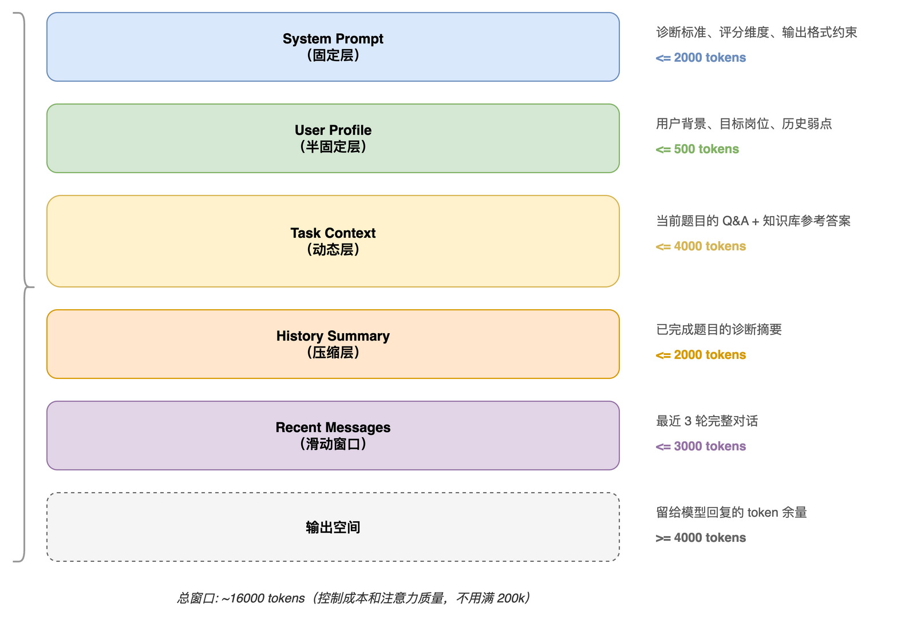
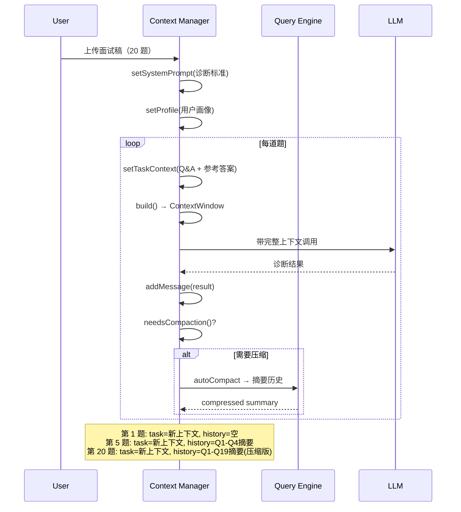
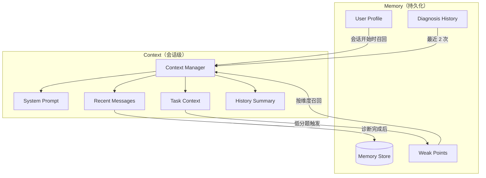

# Context & Memory 实现

Agent 失败最常见的原因不是模型不聪明，而是上下文被污染了。

一场面试诊断可能有 20 道题，每题需要：用户回答（~200 tokens）+ 知识库参考答案×3（~1500 tokens）+ 诊断结果（~500 tokens）。20 题就是 44000 tokens 的工具输出——还没算 system prompt 和历史对话。

如果不做任何管理，第 5 题的时候上下文就超窗口了。模型要么报错，要么开始幻觉。

Context 层解决“当前任务看什么”，Memory 层解决“跨会话记什么”。

## 模块结构

```text
src/context/
├── manager.ts         # ContextManager 主类
├── compressor.ts      # 压缩策略实现
├── budget.ts          # Token 预算追踪
├── system-prompt.ts   # System prompt 模板
└── types.ts           # 类型定义

src/memory/
├── store.ts           # MemoryStore（SQLite）
├── retriever.ts       # 记忆召回策略
├── profile.ts         # 用户画像管理
├── triggers.ts        # 自动写入触发器
└── types.ts           # 类型定义
```

## Context Manager：核心设计

### 信息分层模型

上下文不是“把所有东西塞进去”，而是分层管理，每层有独立的生命周期和 token 预算。



为什么不用满 200k 窗口？两个原因：
1. **成本**：input tokens 按量计费，20 题诊断如果每次都带 100k 上下文，成本会翻 10 倍
2. **注意力稀释**：窗口越长，模型对关键信息的注意力越分散，诊断质量反而下降

### ContextManager 实现

```typescript
// context/types.ts

export interface ContextConfig {
  maxTotalTokens: number;      // 总窗口上限
  systemPromptBudget: number;  // system prompt 预算
  profileBudget: number;       // 用户画像预算
  taskBudget: number;          // 当前任务预算
  historyBudget: number;       // 历史摘要预算
  recentBudget: number;        // 最近消息预算
  outputReserve: number;       // 输出保留空间
}

export const DEFAULT_CONTEXT_CONFIG: ContextConfig = {
  maxTotalTokens: 16000,
  systemPromptBudget: 2000,
  profileBudget: 500,
  taskBudget: 4000,
  historyBudget: 2000,
  recentBudget: 3000,
  outputReserve: 4000,
};

export interface ContextWindow {
  systemPrompt: string;
  messages: Message[];
  tokenCount: number;
  layers: {
    system: number;
    profile: number;
    task: number;
    history: number;
    recent: number;
  };
}
```

```typescript
// context/manager.ts

import { ContextConfig, ContextWindow, DEFAULT_CONTEXT_CONFIG } from './types';
import { Compressor } from './compressor';
import { TokenBudget } from './budget';

export class ContextManager {
  private config: ContextConfig;
  private compressor: Compressor;
  private budget: TokenBudget;

  private systemPrompt: string = '';
  private profileBlock: string = '';
  private taskBlock: string = '';
  private historySummary: string = '';
  private recentMessages: Message[] = [];
  private allMessages: Message[] = [];

  constructor(config: Partial<ContextConfig> = {}) {
    this.config = { ...DEFAULT_CONTEXT_CONFIG, ...config };
    this.compressor = new Compressor();
    this.budget = new TokenBudget(this.config);
  }

  setSystemPrompt(prompt: string): void {
    this.systemPrompt = this.compressor.truncate(prompt, this.config.systemPromptBudget);
  }

  setProfile(profile: string): void {
    this.profileBlock = this.compressor.truncate(profile, this.config.profileBudget);
  }

  setTaskContext(context: string): void {
    this.taskBlock = this.compressor.truncate(context, this.config.taskBudget);
  }

  addMessage(message: Message): void {
    this.allMessages.push(message);
    this.recentMessages.push(message);

    // 滑动窗口：只保留最近 N 条
    while (this.countTokens(this.recentMessages) > this.config.recentBudget) {
      const evicted = this.recentMessages.shift()!;
      // 被踢出的消息进入历史摘要队列
      this.appendToHistory(evicted);
    }
  }

  addToolResult(toolCallId: string, result: string): void {
    // 工具输出可能很长，先压缩再加入
    const compressed = this.compressor.compressToolOutput(result, 1000);
    this.addMessage({
      role: 'tool',
      toolCallId,
      content: compressed,
    });
  }

  build(): ContextWindow {
    const fullSystem = this.buildSystemBlock();
    const messages = this.buildMessages();
    const tokenCount = this.countTokens(messages) + this.estimateTokens(fullSystem);

    return {
      systemPrompt: fullSystem,
      messages,
      tokenCount,
      layers: {
        system: this.estimateTokens(this.systemPrompt),
        profile: this.estimateTokens(this.profileBlock),
        task: this.estimateTokens(this.taskBlock),
        history: this.estimateTokens(this.historySummary),
        recent: this.countTokens(this.recentMessages),
      },
    };
  }

  needsCompaction(): boolean {
    const current = this.build().tokenCount;
    const threshold = this.config.maxTotalTokens - this.config.outputReserve;
    return current > threshold * 0.9; // 90% 时预警
  }

  async autoCompact(queryEngine: QueryEngine): Promise<void> {
    if (!this.needsCompaction()) return;

    // Level 1: 压缩工具输出
    this.compressRecentToolOutputs();

    if (this.needsCompaction()) {
      // Level 2: 压缩历史为摘要
      this.historySummary = await this.compressor.summarizeHistory(
        this.historySummary,
        this.recentMessages.slice(0, -3), // 保留最近 3 条不压缩
        queryEngine,
      );
      this.recentMessages = this.recentMessages.slice(-3);
    }

    if (this.needsCompaction()) {
      // Level 3: 激进压缩——任务上下文也压缩
      this.taskBlock = await this.compressor.summarize(this.taskBlock, queryEngine, 1000);
    }
  }

  getStats(): string {
    const window = this.build();
    const used = window.tokenCount;
    const max = this.config.maxTotalTokens;
    return `Context: ${used}/${max} tokens (${Math.round(used / max * 100)}%) | ` +
      `system:${window.layers.system} profile:${window.layers.profile} ` +
      `task:${window.layers.task} history:${window.layers.history} recent:${window.layers.recent}`;
  }

  private buildSystemBlock(): string {
    const parts: string[] = [this.systemPrompt];
    if (this.profileBlock) parts.push(`\n## 用户背景\n${this.profileBlock}`);
    if (this.historySummary) parts.push(`\n## 已完成诊断摘要\n${this.historySummary}`);
    return parts.join('\n');
  }

  private buildMessages(): Message[] {
    const messages: Message[] = [];

    // 任务上下文作为第一条 user 消息注入
    if (this.taskBlock) {
      messages.push({ role: 'user', content: this.taskBlock });
      messages.push({ role: 'assistant', content: '好的，我已了解当前任务上下文。请继续。' });
    }

    // 最近消息
    messages.push(...this.recentMessages);

    return messages;
  }

  private appendToHistory(message: Message): void {
    // 简单追加，等 autoCompact 时统一压缩
    if (message.role === 'assistant' && message.content) {
      this.historySummary += `\n- ${message.content.slice(0, 100)}`;
    }
  }

  private compressRecentToolOutputs(): void {
    this.recentMessages = this.recentMessages.map(msg => {
      if (msg.role === 'tool' && msg.content && msg.content.length > 500) {
        return { ...msg, content: this.compressor.compressToolOutput(msg.content, 500) };
      }
      return msg;
    });
  }

  private countTokens(messages: Message[]): number {
    return messages.reduce((sum, m) => sum + this.estimateTokens(m.content ?? ''), 0);
  }

  private estimateTokens(text: string): number {
    // 粗估：中文 ~1.5 token/字，英文 ~0.25 token/字
    const cjk = (text.match(/[一-鿿]/g) || []).length;
    const ascii = text.length - cjk;
    return Math.ceil(cjk * 1.5 + ascii * 0.25);
  }
}
```

### Compressor：压缩策略

```typescript
// context/compressor.ts

export class Compressor {
  truncate(text: string, maxTokens: number): string {
    const estimated = this.estimateTokens(text);
    if (estimated <= maxTokens) return text;

    // 按比例截断
    const ratio = maxTokens / estimated;
    const maxChars = Math.floor(text.length * ratio * 0.9); // 留 10% 余量
    return text.slice(0, maxChars) + '\n\n[... 已截断]';
  }

  compressToolOutput(output: string, maxTokens: number): string {
    const estimated = this.estimateTokens(output);
    if (estimated <= maxTokens) return output;

    // 策略：保留 JSON 的 key 结构 + 值的前 N 字符
    try {
      const parsed = JSON.parse(output);
      return JSON.stringify(this.compressObject(parsed, maxTokens), null, 0);
    } catch {
      // 非 JSON，直接截断
      return this.truncate(output, maxTokens);
    }
  }

  async summarizeHistory(
    existingSummary: string,
    messages: Message[],
    queryEngine: QueryEngine,
  ): Promise<string> {
    const content = messages
      .filter(m => m.role === 'assistant' && m.content)
      .map(m => m.content!.slice(0, 200))
      .join('\n');

    if (!content) return existingSummary;

    const response = await queryEngine.query({
      task: 'knowledge_summary',
      messages: [{
        role: 'user',
        content: `请将以下对话历史压缩为简洁摘要（保留关键结论和数据，删除过程细节）：\n\n已有摘要：\n${existingSummary}\n\n新增内容：\n${content}`,
      }],
      systemPrompt: '你是一个对话压缩器。输出尽量简洁，用 bullet points，保留数字和关键结论。',
      maxTokens: 500,
    });

    return response.content ?? existingSummary;
  }

  async summarize(text: string, queryEngine: QueryEngine, maxTokens: number): Promise<string> {
    const response = await queryEngine.query({
      task: 'knowledge_summary',
      messages: [{ role: 'user', content: `请将以下内容压缩到 ${maxTokens} tokens 以内，保留关键信息：\n\n${text}` }],
      maxTokens: Math.min(maxTokens, 1000),
    });
    return response.content ?? this.truncate(text, maxTokens);
  }

  private compressObject(obj: any, maxTokens: number): any {
    if (typeof obj === 'string') {
      return obj.length > 100 ? obj.slice(0, 100) + '...' : obj;
    }
    if (Array.isArray(obj)) {
      // 数组只保留前 3 项
      return obj.slice(0, 3).map(item => this.compressObject(item, maxTokens));
    }
    if (typeof obj === 'object' && obj !== null) {
      const result: any = {};
      for (const [key, value] of Object.entries(obj)) {
        result[key] = this.compressObject(value, maxTokens);
      }
      return result;
    }
    return obj;
  }

  private estimateTokens(text: string): number {
    const cjk = (text.match(/[一-鿿]/g) || []).length;
    const ascii = text.length - cjk;
    return Math.ceil(cjk * 1.5 + ascii * 0.25);
  }
}
```

### 面试诊断场景的 Context 生命周期



## Memory Store：跨会话记忆

Memory 解决的问题和 Context 不同：Context 管理“这一次对话看什么”，Memory 管理“跨多次对话记什么”。

### 记忆类型

```typescript
// memory/types.ts

export type MemoryType = 'user_profile' | 'diagnosis_summary' | 'weak_point' | 'preference';

export interface MemoryEntry {
  id: string;
  type: MemoryType;
  key: string;                   // 语义标识符
  value: unknown;                // 结构化数据
  confidence: number;            // 0-1，多次验证后提升
  createdAt: string;
  updatedAt: string;
  expiresAt?: string;            // 短期记忆有过期
  accessCount: number;           // 被召回次数
}

export interface UserProfile {
  targetRole?: string;           // 目标岗位
  techStack?: string[];          // 技术栈
  experience?: string;           // 工作经验
  weakDimensions?: string[];     // 历次诊断中暴露的弱项
  strongDimensions?: string[];   // 强项
  lastDiagnosisScore?: number;   // 上次诊断总分
  totalDiagnoses?: number;       // 累计诊断次数
  scoreHistory?: Array<{ date: string; score: number }>;
}
```

### MemoryStore 实现

```typescript
// memory/store.ts

import Database from 'better-sqlite3';
import { MemoryEntry, MemoryType, UserProfile } from './types';

export class MemoryStore {
  private db: Database.Database;

  constructor(dbPath: string) {
    this.db = new Database(dbPath);
    this.db.pragma('journal_mode = WAL');
    this.initSchema();
  }

  private initSchema(): void {
    this.db.exec(`
      CREATE TABLE IF NOT EXISTS memories (
        id TEXT PRIMARY KEY,
        type TEXT NOT NULL,
        key TEXT NOT NULL,
        value TEXT NOT NULL,
        confidence REAL NOT NULL DEFAULT 0.5,
        created_at TEXT NOT NULL DEFAULT (datetime('now')),
        updated_at TEXT NOT NULL DEFAULT (datetime('now')),
        expires_at TEXT,
        access_count INTEGER NOT NULL DEFAULT 0
      );

      CREATE INDEX IF NOT EXISTS idx_memories_type ON memories(type);
      CREATE INDEX IF NOT EXISTS idx_memories_key ON memories(key);
      CREATE INDEX IF NOT EXISTS idx_memories_type_key ON memories(type, key);
    `);
  }

  create(type: MemoryType, key: string, value: unknown): string {
    const id = `${type}:${key}:${Date.now()}`;
    this.db.prepare(`
      INSERT INTO memories (id, type, key, value, confidence)
      VALUES (?, ?, ?, ?, 0.5)
    `).run(id, type, key, JSON.stringify(value));
    return id;
  }

  retrieve(opts: {
    type?: MemoryType;
    key?: string;
    limit?: number;
    minConfidence?: number;
  } = {}): MemoryEntry[] {
    let sql = 'SELECT * FROM memories WHERE 1=1';
    const params: any[] = [];

    if (opts.type) {
      sql += ' AND type = ?';
      params.push(opts.type);
    }
    if (opts.key) {
      sql += ' AND key LIKE ?';
      params.push(`%${opts.key}%`);
    }
    if (opts.minConfidence) {
      sql += ' AND confidence >= ?';
      params.push(opts.minConfidence);
    }
    sql += ' AND (expires_at IS NULL OR expires_at > datetime("now"))';
    sql += ' ORDER BY confidence DESC, updated_at DESC';

    if (opts.limit) {
      sql += ' LIMIT ?';
      params.push(opts.limit);
    }

    const rows = this.db.prepare(sql).all(...params);

    // 记录访问次数
    for (const row of rows) {
      this.db.prepare('UPDATE memories SET access_count = access_count + 1 WHERE id = ?')
        .run((row as any).id);
    }

    return rows.map(r => this.rowToEntry(r));
  }

  update(id: string, value: unknown, boostConfidence?: boolean): void {
    const updates: string[] = ['value = ?', 'updated_at = datetime("now")'];
    const params: any[] = [JSON.stringify(value)];

    if (boostConfidence) {
      updates.push('confidence = MIN(1.0, confidence + 0.1)');
    }

    this.db.prepare(`UPDATE memories SET ${updates.join(', ')} WHERE id = ?`)
      .run(...params, id);
  }

  delete(id: string): void {
    this.db.prepare('DELETE FROM memories WHERE id = ?').run(id);
  }

  deleteAll(type?: MemoryType): void {
    if (type) {
      this.db.prepare('DELETE FROM memories WHERE type = ?').run(type);
    } else {
      this.db.prepare('DELETE FROM memories').run();
    }
  }

  // 用户画像快捷方法
  getProfile(): UserProfile {
    const entries = this.retrieve({ type: 'user_profile' });
    const profile: UserProfile = {};
    for (const entry of entries) {
      Object.assign(profile, entry.value);
    }
    return profile;
  }

  updateProfile(patch: Partial<UserProfile>): void {
    const existing = this.retrieve({ type: 'user_profile', key: 'main' });
    if (existing.length > 0) {
      const merged = { ...(existing[0].value as UserProfile), ...patch };
      this.update(existing[0].id, merged, true);
    } else {
      this.create('user_profile', 'main', patch);
    }
  }

  // 清理过期记忆
  evictExpired(): number {
    const result = this.db.prepare(
      'DELETE FROM memories WHERE expires_at IS NOT NULL AND expires_at <= datetime("now")'
    ).run();
    return result.changes;
  }

  // 统计
  getStats(): { total: number; byType: Record<string, number> } {
    const total = (this.db.prepare('SELECT COUNT(*) as c FROM memories').get() as any).c;
    const byType = this.db.prepare(
      'SELECT type, COUNT(*) as c FROM memories GROUP BY type'
    ).all().reduce((acc: any, r: any) => ({ ...acc, [r.type]: r.c }), {});
    return { total, byType };
  }

  private rowToEntry(row: any): MemoryEntry {
    return {
      id: row.id,
      type: row.type,
      key: row.key,
      value: JSON.parse(row.value),
      confidence: row.confidence,
      createdAt: row.created_at,
      updatedAt: row.updated_at,
      expiresAt: row.expires_at,
      accessCount: row.access_count,
    };
  }
}
```

### Memory Retriever：智能召回

不是每次都把所有记忆塞进上下文。Retriever 根据当前任务语义决定召回什么。

```typescript
// memory/retriever.ts

export class MemoryRetriever {
  private store: MemoryStore;

  constructor(store: MemoryStore) {
    this.store = store;
  }

  retrieveForDiagnosis(question: string, dimension?: string): RetrievedMemories {
    // 1. 始终召回用户画像
    const profile = this.store.getProfile();

    // 2. 按维度召回历史弱点
    const weakPoints = this.store.retrieve({
      type: 'weak_point',
      key: dimension,
      limit: 3,
      minConfidence: 0.6,
    });

    // 3. 召回相关的历史诊断摘要
    const history = this.store.retrieve({
      type: 'diagnosis_summary',
      limit: 2,
    });

    return { profile, weakPoints, history };
  }

  formatForContext(memories: RetrievedMemories): string {
    const parts: string[] = [];

    if (memories.profile.targetRole) {
      parts.push(`目标岗位: ${memories.profile.targetRole}`);
    }
    if (memories.profile.techStack?.length) {
      parts.push(`技术栈: ${memories.profile.techStack.join(', ')}`);
    }
    if (memories.profile.weakDimensions?.length) {
      parts.push(`历史弱项: ${memories.profile.weakDimensions.join(', ')}`);
    }
    if (memories.weakPoints.length) {
      parts.push(`近期同维度弱点:\n${memories.weakPoints.map(w => `- ${(w.value as any).description}`).join('\n')}`);
    }

    return parts.join('\n');
  }
}

interface RetrievedMemories {
  profile: UserProfile;
  weakPoints: MemoryEntry[];
  history: MemoryEntry[];
}
```

### Memory Triggers：什么时候写入记忆

记忆写入不能靠 Agent 自由决定（会变成垃圾桶），需要明确的触发规则。

```typescript
// memory/triggers.ts

export class MemoryTriggers {
  private store: MemoryStore;

  constructor(store: MemoryStore) {
    this.store = store;
  }

  afterDiagnosis(report: DiagnosisReport): void {
    // 触发 1: 更新用户诊断历史
    const profile = this.store.getProfile();
    this.store.updateProfile({
      lastDiagnosisScore: report.summary.overallScore,
      totalDiagnoses: (profile.totalDiagnoses ?? 0) + 1,
      scoreHistory: [
        ...(profile.scoreHistory ?? []),
        { date: new Date().toISOString().slice(0, 10), score: report.summary.overallScore },
      ].slice(-20), // 只保留最近 20 次
    });

    // 触发 2: 更新弱项维度
    if (report.summary.topWeaknesses.length > 0) {
      this.updateWeakDimensions(report.summary.topWeaknesses);
    }

    // 触发 3: 诊断摘要（保留关键数据点，不保留全文）
    this.store.create('diagnosis_summary', `diag-${Date.now()}`, {
      date: new Date().toISOString().slice(0, 10),
      totalQuestions: report.summary.totalQuestions,
      overallScore: report.summary.overallScore,
      contentAvg: report.summary.contentAvg,
      speechAvg: report.summary.speechAvg,
      topWeaknesses: report.summary.topWeaknesses.slice(0, 3),
    });
  }

  afterSingleQuestion(question: string, diagnosis: ContentDiagnosis, dimension: string): void {
    // 只在低分题触发弱点记录
    if (diagnosis.overallScore < 50) {
      const existing = this.store.retrieve({ type: 'weak_point', key: dimension });
      const alreadyKnown = existing.some(e =>
        (e.value as any).description?.includes(diagnosis.keyMissing[0])
      );

      if (!alreadyKnown) {
        this.store.create('weak_point', dimension, {
          question: question.slice(0, 80),
          score: diagnosis.overallScore,
          description: diagnosis.keyMissing[0] ?? '回答深度不足',
          dimension,
        });
      } else {
        // 已知弱点再次出现——提升 confidence
        const match = existing.find(e =>
          (e.value as any).description?.includes(diagnosis.keyMissing[0])
        );
        if (match) this.store.update(match.id, match.value, true);
      }
    }
  }

  onUserInfo(info: Partial<UserProfile>): void {
    this.store.updateProfile(info);
  }

  private updateWeakDimensions(weaknesses: string[]): void {
    const profile = this.store.getProfile();
    const current = new Set(profile.weakDimensions ?? []);
    weaknesses.forEach(w => current.add(w));
    // 保留最近 5 个弱项
    this.store.updateProfile({
      weakDimensions: [...current].slice(-5),
    });
  }
}
```

## Memory 写入的克制原则

记忆系统最大的陷阱是写太多。写入不克制，召回就变成噪声。

```text
写入规则（白名单模式）：

✓ 写入:
  - 用户画像变化（岗位、技术栈、经验）
  - 每次诊断的关键数据点（总分、弱项、趋势）
  - 反复出现的弱点（confidence > 0.6 才召回）
  - 用户明确偏好（"以后不要诊断语音"）

✗ 不写入:
  - 每道题的完整诊断结果（太大、太细）
  - 对话的中间推理过程
  - 工具调用的原始输出
  - 一次性的临时状态
  - 任何可以从知识库重新检索的信息
```

## Context 与 Memory 的协作



关键点：

- **Memory → Context**：会话开始时，Retriever 从 Memory 召回相关记忆注入 Context
- **Context → Memory**：诊断完成后，Triggers 从当前结果中提取值得长期保存的数据点写入 Memory
- 两者通过 Agent Loop 中的 Hook 协调，不直接互相调用

## 在 Agent Loop 中的集成

```typescript
// agent/loop.ts 中相关片段

async function agentLoop(input: string, session: Session): Promise<void> {
  const contextManager = session.contextManager;
  const memoryStore = session.memoryStore;
  const retriever = new MemoryRetriever(memoryStore);

  // 1. 召回记忆注入 Context
  const memories = retriever.retrieveForDiagnosis(input);
  contextManager.setProfile(retriever.formatForContext(memories));

  // 2. 正常 Agent Loop...
  contextManager.addMessage({ role: 'user', content: input });
  const window = contextManager.build();

  const response = await queryEngine.query({
    messages: window.messages,
    systemPrompt: window.systemPrompt,
    // ...
  });

  // 3. 检查是否需要压缩
  await contextManager.autoCompact(queryEngine);

  // 4. 诊断完成后触发记忆写入（通过 post-tool hook）
  // 见 Hook 层实现
}
```

## 小结

- Context 分 5 层管理，每层有独立 token 预算，不把所有信息都塞给模型
- 三级压缩策略：工具输出截断 → 历史对话摘要 → 任务上下文压缩
- 不用满 200k 窗口——控制在 16k 以内，省成本、保注意力质量
- Memory 只保存稳定结论：用户画像、弱项趋势、诊断关键数据
- 写入白名单模式，不克制就退化成噪声仓库
- 弱点通过 confidence 分数管理：反复出现才提升优先级
- Context 和 Memory 通过 Hook 层协调，不直接互相调用

下一篇建议继续看：

- [07-permission-session：权限系统与会话恢复](../07-permission-session/index.html)
