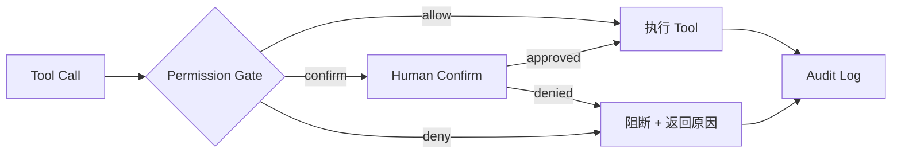
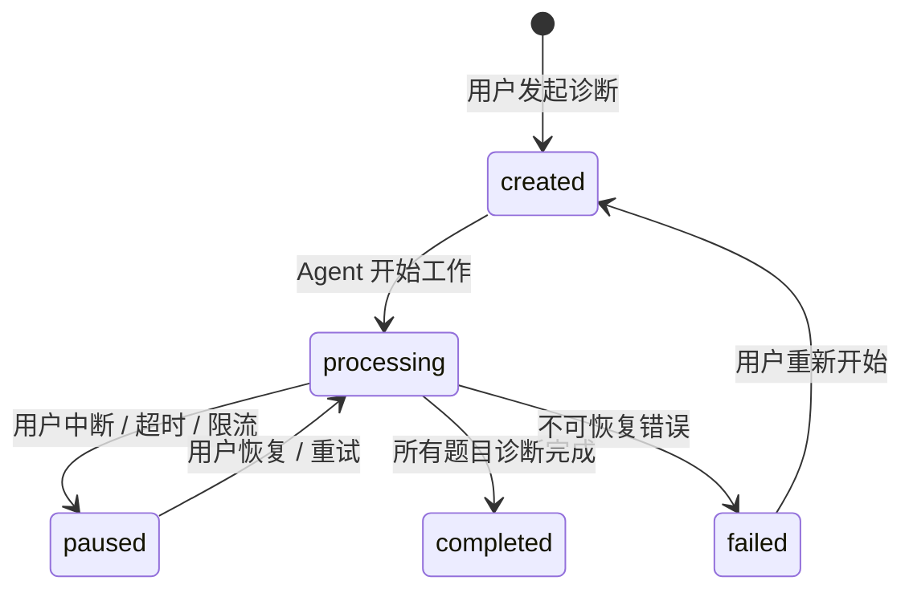
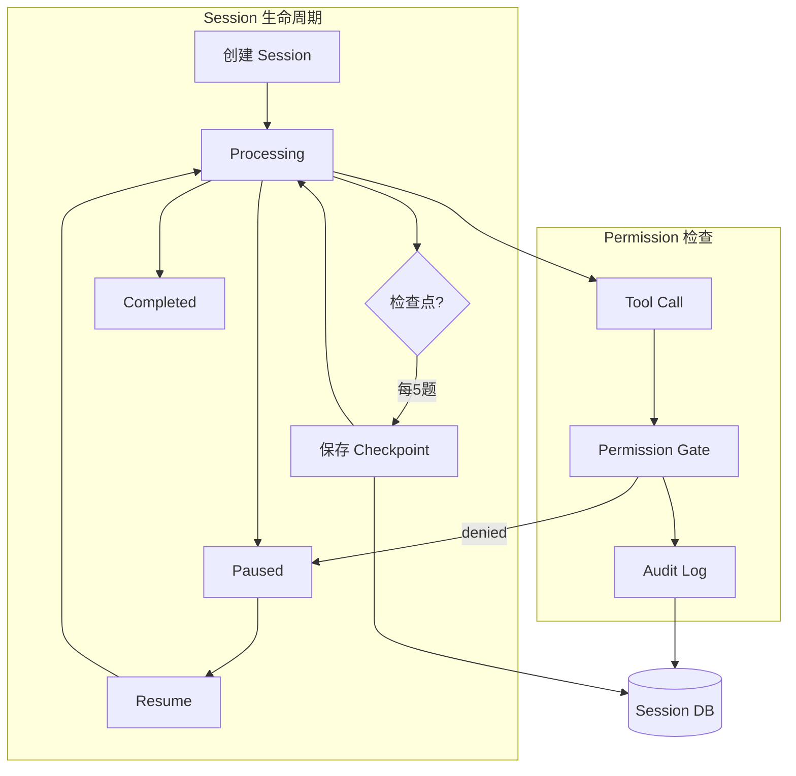

# Permission & Session 实现

Agent 越能干，越需要约束。Permission 决定"能不能做"，Session 决定"做到哪了"。

面试诊断 Agent 处理的是高隐私数据（面试内容、个人表现评估），能调用多种外部 API（STT、LLM），还能写入文件。如果没有权限系统，一个 prompt injection 就可能导致面试内容泄露。如果没有 Session，一次长诊断中断后只能从头来过。

## Part 1: Permission —— 安全底座

### 设计原则

```text
1. 默认拒绝，显式允许
   - 没有规则匹配的操作一律拦截
   - 新增工具必须同步配置权限规则

2. 风险分级，策略分层
   - 低风险：自动放行
   - 中风险：首次确认，后续记住
   - 高风险：每次确认

3. 可审计
   - 每次权限决策（允许/拒绝/确认）都记录日志
   - 支持事后追溯

4. 不影响正常流程
   - 权限检查 < 1ms（本地规则匹配）
   - human-in-the-loop 时清晰告知用户为什么需要确认
```

### 模块结构

```text
src/permission/
├── gate.ts            # PermissionGate 主类
├── rules.ts           # 规则定义 + 默认规则集
├── classifier.ts      # 风险分类器
├── confirm.ts         # Human-in-the-loop 交互
├── audit.ts           # 审计日志
└── types.ts           # 类型定义
```

### 类型定义

```typescript
// permission/types.ts

export type RiskLevel = 'low' | 'medium' | 'high' | 'critical';
export type PermissionAction = 'allow' | 'confirm' | 'deny';
export type ConfirmResult = 'approved' | 'denied' | 'timeout';

export interface PermissionRule {
  id: string;
  name: string;
  match: RuleMatcher;
  level: RiskLevel;
  action: PermissionAction;
  reason: string;
  rememberApproval?: boolean;   // 用户确认后是否记住
}

export type RuleMatcher =
  | { type: 'tool_name'; pattern: string | RegExp }
  | { type: 'tool_arg'; tool: string; arg: string; pattern: string | RegExp }
  | { type: 'operation'; category: string };

export interface PermissionDecision {
  allowed: boolean;
  rule: PermissionRule;
  confirmedBy?: 'rule' | 'user' | 'remembered';
  timestamp: string;
}

export interface AuditEntry {
  id: string;
  sessionId: string;
  toolName: string;
  toolArgs: Record<string, unknown>;
  decision: PermissionDecision;
  timestamp: string;
}
```

### 默认规则集

```typescript
// permission/rules.ts

import { PermissionRule } from './types';

export const DEFAULT_RULES: PermissionRule[] = [
  // === 低风险：自动放行 ===
  {
    id: 'allow-split-qa',
    name: '允许拆分Q&A',
    match: { type: 'tool_name', pattern: 'split_qa_pairs' },
    level: 'low',
    action: 'allow',
    reason: '纯文本处理，无副作用',
  },
  {
    id: 'allow-analyze-content',
    name: '允许内容诊断',
    match: { type: 'tool_name', pattern: 'analyze_content' },
    level: 'low',
    action: 'allow',
    reason: 'LLM 分析，不写入外部系统',
  },
  {
    id: 'allow-analyze-speech',
    name: '允许语音分析',
    match: { type: 'tool_name', pattern: 'analyze_speech' },
    level: 'low',
    action: 'allow',
    reason: '本地计算，无外部调用',
  },
  {
    id: 'allow-knowledge-query',
    name: '允许知识库检索',
    match: { type: 'tool_name', pattern: 'query_knowledge_base' },
    level: 'low',
    action: 'allow',
    reason: '只读本地数据库',
  },
  {
    id: 'allow-generate-report',
    name: '允许生成报告',
    match: { type: 'tool_name', pattern: 'generate_report' },
    level: 'low',
    action: 'allow',
    reason: '汇总已有数据，无新副作用',
  },

  // === 中风险：首次确认，后续记住 ===
  {
    id: 'confirm-transcribe',
    name: 'STT 转写确认',
    match: { type: 'tool_name', pattern: 'transcribe_audio' },
    level: 'medium',
    action: 'confirm',
    reason: '将上传音频到外部 STT 服务处理',
    rememberApproval: true,
  },
  {
    id: 'confirm-read-file',
    name: '读取文件确认',
    match: { type: 'tool_name', pattern: 'read_file' },
    level: 'medium',
    action: 'confirm',
    reason: '读取用户本地文件',
    rememberApproval: true,
  },

  // === 高风险：每次确认 ===
  {
    id: 'confirm-save-memory',
    name: '保存记忆确认',
    match: { type: 'operation', category: 'memory_write' },
    level: 'high',
    action: 'confirm',
    reason: '将面试相关内容持久化保存',
    rememberApproval: false,
  },
  {
    id: 'confirm-export',
    name: '导出确认',
    match: { type: 'tool_name', pattern: /export|share/ },
    level: 'high',
    action: 'confirm',
    reason: '将诊断报告导出到外部',
    rememberApproval: false,
  },

  // === 关键：始终拒绝 ===
  {
    id: 'deny-network-unknown',
    name: '拒绝未知网络请求',
    match: { type: 'operation', category: 'network_unknown' },
    level: 'critical',
    action: 'deny',
    reason: '未识别的外部网络调用',
  },
];
```

### PermissionGate 实现

```typescript
// permission/gate.ts

import { PermissionRule, PermissionDecision, RiskLevel } from './types';
import { DEFAULT_RULES } from './rules';
import { PermissionConfirm } from './confirm';
import { AuditLogger } from './audit';

export class PermissionGate {
  private rules: PermissionRule[];
  private approvalCache = new Map<string, boolean>();  // 记住用户的确认结果
  private confirm: PermissionConfirm;
  private audit: AuditLogger;

  constructor(
    rules?: PermissionRule[],
    confirm?: PermissionConfirm,
    audit?: AuditLogger,
  ) {
    this.rules = rules ?? DEFAULT_RULES;
    this.confirm = confirm ?? new PermissionConfirm();
    this.audit = audit ?? new AuditLogger();
  }

  async checkTool(toolCall: {
    name: string;
    input: Record<string, unknown>;
  }, sessionId: string): Promise<PermissionDecision> {
    // 1. 找到匹配的规则
    const rule = this.findMatchingRule(toolCall);

    if (!rule) {
      // 没有规则匹配 → 默认拒绝
      const decision: PermissionDecision = {
        allowed: false,
        rule: { id: 'default-deny', name: '默认拒绝', match: { type: 'tool_name', pattern: '*' }, level: 'critical', action: 'deny', reason: '无匹配规则' },
        timestamp: new Date().toISOString(),
      };
      this.audit.log(sessionId, toolCall, decision);
      return decision;
    }

    // 2. 根据 action 执行策略
    let decision: PermissionDecision;

    switch (rule.action) {
      case 'allow':
        decision = { allowed: true, rule, confirmedBy: 'rule', timestamp: new Date().toISOString() };
        break;

      case 'deny':
        decision = { allowed: false, rule, timestamp: new Date().toISOString() };
        break;

      case 'confirm':
        decision = await this.handleConfirm(rule, toolCall);
        break;

      default:
        decision = { allowed: false, rule, timestamp: new Date().toISOString() };
    }

    // 3. 记录审计日志
    this.audit.log(sessionId, toolCall, decision);

    return decision;
  }

  addRule(rule: PermissionRule): void {
    this.rules.unshift(rule); // 新规则优先级最高
  }

  clearApprovalCache(): void {
    this.approvalCache.clear();
  }

  private async handleConfirm(
    rule: PermissionRule,
    toolCall: { name: string; input: Record<string, unknown> },
  ): Promise<PermissionDecision> {
    // 检查是否已经记住了
    const cacheKey = `${rule.id}:${toolCall.name}`;
    if (rule.rememberApproval && this.approvalCache.has(cacheKey)) {
      return {
        allowed: this.approvalCache.get(cacheKey)!,
        rule,
        confirmedBy: 'remembered',
        timestamp: new Date().toISOString(),
      };
    }

    // 向用户发起确认
    const result = await this.confirm.ask({
      toolName: toolCall.name,
      reason: rule.reason,
      level: rule.level,
      details: this.formatToolDetails(toolCall),
    });

    const allowed = result === 'approved';

    // 记住结果
    if (rule.rememberApproval) {
      this.approvalCache.set(cacheKey, allowed);
    }

    return { allowed, rule, confirmedBy: 'user', timestamp: new Date().toISOString() };
  }

  private findMatchingRule(toolCall: { name: string; input: Record<string, unknown> }): PermissionRule | null {
    for (const rule of this.rules) {
      if (this.matchesRule(rule, toolCall)) {
        return rule;
      }
    }
    return null;
  }

  private matchesRule(
    rule: PermissionRule,
    toolCall: { name: string; input: Record<string, unknown> },
  ): boolean {
    const { match } = rule;
    switch (match.type) {
      case 'tool_name':
        return typeof match.pattern === 'string'
          ? toolCall.name === match.pattern
          : match.pattern.test(toolCall.name);
      case 'tool_arg':
        return toolCall.name === match.tool &&
          typeof match.pattern === 'string'
            ? String(toolCall.input[match.arg]) === match.pattern
            : (match.pattern as RegExp).test(String(toolCall.input[match.arg]));
      case 'operation':
        return false; // operation 类型由调用方显式标记
      default:
        return false;
    }
  }

  private formatToolDetails(toolCall: { name: string; input: Record<string, unknown> }): string {
    const args = Object.entries(toolCall.input)
      .map(([k, v]) => `  ${k}: ${String(v).slice(0, 100)}`)
      .join('\n');
    return `工具: ${toolCall.name}\n参数:\n${args}`;
  }
}
```

### Human-in-the-loop 确认

```typescript
// permission/confirm.ts

import * as readline from 'readline';
import chalk from 'chalk';

export interface ConfirmRequest {
  toolName: string;
  reason: string;
  level: RiskLevel;
  details: string;
}

export class PermissionConfirm {
  private rl: readline.Interface | null = null;
  private timeoutMs: number;

  constructor(timeoutMs = 30000) {
    this.timeoutMs = timeoutMs;
  }

  async ask(request: ConfirmRequest): Promise<ConfirmResult> {
    const levelColor = {
      low: chalk.green,
      medium: chalk.yellow,
      high: chalk.red,
      critical: chalk.bgRed.white,
    };

    const badge = levelColor[request.level](`[${request.level.toUpperCase()}]`);
    console.log(`\n${badge} 权限确认请求`);
    console.log(chalk.dim(`原因: ${request.reason}`));
    console.log(chalk.dim(request.details));
    console.log('');

    return new Promise<ConfirmResult>((resolve) => {
      const timer = setTimeout(() => {
        console.log(chalk.dim('(超时，默认拒绝)'));
        resolve('timeout');
      }, this.timeoutMs);

      this.rl = readline.createInterface({ input: process.stdin, output: process.stdout });
      this.rl.question(chalk.bold('允许执行? (y/n): '), (answer) => {
        clearTimeout(timer);
        this.rl?.close();
        resolve(answer.toLowerCase().startsWith('y') ? 'approved' : 'denied');
      });
    });
  }
}
```

### 审计日志

```typescript
// permission/audit.ts

import Database from 'better-sqlite3';

export class AuditLogger {
  private db: Database.Database;

  constructor(dbPath?: string) {
    this.db = new Database(dbPath ?? ':memory:');
    this.db.exec(`
      CREATE TABLE IF NOT EXISTS permission_audit (
        id INTEGER PRIMARY KEY AUTOINCREMENT,
        session_id TEXT NOT NULL,
        tool_name TEXT NOT NULL,
        tool_args TEXT NOT NULL,
        rule_id TEXT NOT NULL,
        risk_level TEXT NOT NULL,
        decision TEXT NOT NULL,
        confirmed_by TEXT,
        timestamp TEXT NOT NULL
      );
      CREATE INDEX IF NOT EXISTS idx_audit_session ON permission_audit(session_id);
      CREATE INDEX IF NOT EXISTS idx_audit_time ON permission_audit(timestamp);
    `);
  }

  log(sessionId: string, toolCall: { name: string; input: Record<string, unknown> }, decision: PermissionDecision): void {
    this.db.prepare(`
      INSERT INTO permission_audit (session_id, tool_name, tool_args, rule_id, risk_level, decision, confirmed_by, timestamp)
      VALUES (?, ?, ?, ?, ?, ?, ?, ?)
    `).run(
      sessionId,
      toolCall.name,
      JSON.stringify(toolCall.input),
      decision.rule.id,
      decision.rule.level,
      decision.allowed ? 'allowed' : 'denied',
      decision.confirmedBy ?? null,
      decision.timestamp,
    );
  }

  getSessionLog(sessionId: string): AuditEntry[] {
    return this.db.prepare(
      'SELECT * FROM permission_audit WHERE session_id = ? ORDER BY timestamp'
    ).all(sessionId) as AuditEntry[];
  }

  getStats(): { total: number; allowed: number; denied: number; confirmed: number } {
    const row = this.db.prepare(`
      SELECT
        COUNT(*) as total,
        SUM(CASE WHEN decision = 'allowed' THEN 1 ELSE 0 END) as allowed,
        SUM(CASE WHEN decision = 'denied' THEN 1 ELSE 0 END) as denied,
        SUM(CASE WHEN confirmed_by = 'user' THEN 1 ELSE 0 END) as confirmed
      FROM permission_audit
    `).get() as any;
    return row;
  }
}
```

### Permission 在 Dispatcher 中的位置



---

## Part 2: Session —— 状态持久化与恢复

### 为什么需要 Session

一场面试诊断涉及 20 道题，每题 3-5 次工具调用，总计 60-100 次模型交互。这个过程可能需要 10-30 分钟。中间任何一个环节中断（网络断开、用户关闭终端、模型限流）都不应该导致从头来过。

Session 保存的是"Agent 做到哪一步了"的完整快照。

### 模块结构

```text
src/session/
├── manager.ts         # SessionManager CRUD
├── state.ts           # 状态机定义
├── rewind.ts          # 回滚/恢复
├── checkpoint.ts      # 检查点管理
└── types.ts           # 类型定义
```

### 状态机

```typescript
// session/types.ts

export type SessionStatus = 'created' | 'processing' | 'paused' | 'completed' | 'failed';

export interface Session {
  id: string;
  status: SessionStatus;
  inputType: 'transcript' | 'audio';
  inputContent: string;            // 原始输入文本（或音频路径）
  config: SessionConfig;
  progress: SessionProgress;
  state: SessionState;             // 自定义状态（Skill 写入）
  createdAt: string;
  updatedAt: string;
  abortController: AbortController;
  contextManager: ContextManager;
}

export interface SessionConfig {
  model: string;
  temperature: number;
  maxBudget: number;               // 美元
  preferSkills: boolean;
}

export interface SessionProgress {
  total: number;                   // 总题数
  done: number;                    // 已完成
  current: number;                 // 当前正在处理
  phase: string;                   // 当前阶段描述
}

export interface SessionState {
  mode?: string;                   // 'diagnose' | 'mock-interview' | ...
  qaPairs?: QaPair[];
  contentDiagnoses?: ContentDiagnosis[];
  speechDiagnoses?: SpeechDiagnosis[];
  [key: string]: unknown;          // Skill 自定义状态
}

export interface SessionCheckpoint {
  id: string;
  sessionId: string;
  progress: SessionProgress;
  state: SessionState;
  messages: Message[];             // 当时的消息快照
  createdAt: string;
}
```

### 状态转换



### SessionManager 实现

```typescript
// session/manager.ts

import Database from 'better-sqlite3';
import { Session, SessionStatus, SessionCheckpoint } from './types';
import { randomUUID } from 'crypto';

export class SessionManager {
  private db: Database.Database;
  private activeSessions = new Map<string, Session>();

  constructor(dbPath: string) {
    this.db = new Database(dbPath);
    this.db.pragma('journal_mode = WAL');
    this.initSchema();
  }

  private initSchema(): void {
    this.db.exec(`
      CREATE TABLE IF NOT EXISTS sessions (
        id TEXT PRIMARY KEY,
        status TEXT NOT NULL,
        input_type TEXT NOT NULL,
        input_content TEXT NOT NULL,
        config TEXT NOT NULL,
        progress TEXT NOT NULL,
        state TEXT NOT NULL,
        messages TEXT NOT NULL,
        created_at TEXT NOT NULL DEFAULT (datetime('now')),
        updated_at TEXT NOT NULL DEFAULT (datetime('now'))
      );

      CREATE TABLE IF NOT EXISTS checkpoints (
        id TEXT PRIMARY KEY,
        session_id TEXT NOT NULL REFERENCES sessions(id),
        progress TEXT NOT NULL,
        state TEXT NOT NULL,
        messages TEXT NOT NULL,
        created_at TEXT NOT NULL DEFAULT (datetime('now'))
      );

      CREATE INDEX IF NOT EXISTS idx_sessions_status ON sessions(status);
      CREATE INDEX IF NOT EXISTS idx_checkpoints_session ON checkpoints(session_id);
    `);
  }

  create(input: { type: 'transcript' | 'audio'; content: string }, config?: Partial<SessionConfig>): Session {
    const session: Session = {
      id: randomUUID(),
      status: 'created',
      inputType: input.type,
      inputContent: input.content,
      config: {
        model: config?.model ?? 'claude-sonnet-4-20250514',
        temperature: config?.temperature ?? 0,
        maxBudget: config?.maxBudget ?? 1.0,
        preferSkills: config?.preferSkills ?? true,
      },
      progress: { total: 0, done: 0, current: 0, phase: '初始化' },
      state: {},
      createdAt: new Date().toISOString(),
      updatedAt: new Date().toISOString(),
      abortController: new AbortController(),
      contextManager: new ContextManager(),
    };

    this.persist(session);
    this.activeSessions.set(session.id, session);
    return session;
  }

  get(id: string): Session | null {
    // 先查内存
    if (this.activeSessions.has(id)) return this.activeSessions.get(id)!;
    // 再查 DB
    return this.load(id);
  }

  list(opts?: { status?: SessionStatus; limit?: number }): SessionSummary[] {
    let sql = 'SELECT id, status, input_type, progress, created_at, updated_at FROM sessions';
    const params: any[] = [];

    if (opts?.status) {
      sql += ' WHERE status = ?';
      params.push(opts.status);
    }
    sql += ' ORDER BY updated_at DESC';
    if (opts?.limit) {
      sql += ' LIMIT ?';
      params.push(opts.limit);
    }

    return this.db.prepare(sql).all(...params).map((row: any) => ({
      id: row.id,
      status: row.status,
      inputType: row.input_type,
      progress: JSON.parse(row.progress),
      createdAt: row.created_at,
      updatedAt: row.updated_at,
    }));
  }

  updateStatus(id: string, status: SessionStatus): void {
    const session = this.get(id);
    if (!session) throw new Error(`Session ${id} not found`);
    session.status = status;
    session.updatedAt = new Date().toISOString();
    this.persist(session);
  }

  updateProgress(id: string, done: number, total: number, phase?: string): void {
    const session = this.get(id);
    if (!session) return;
    session.progress = { ...session.progress, done, total, current: done + 1, phase: phase ?? session.progress.phase };
    session.updatedAt = new Date().toISOString();
    this.persist(session);
  }

  updateState(id: string, patch: Partial<SessionState>): void {
    const session = this.get(id);
    if (!session) return;
    session.state = { ...session.state, ...patch };
    session.updatedAt = new Date().toISOString();
    this.persist(session);
  }

  save(session: Session): void {
    this.persist(session);
  }

  delete(id: string): void {
    this.activeSessions.delete(id);
    this.db.prepare('DELETE FROM checkpoints WHERE session_id = ?').run(id);
    this.db.prepare('DELETE FROM sessions WHERE id = ?').run(id);
  }

  private persist(session: Session): void {
    this.db.prepare(`
      INSERT OR REPLACE INTO sessions (id, status, input_type, input_content, config, progress, state, messages, created_at, updated_at)
      VALUES (?, ?, ?, ?, ?, ?, ?, ?, ?, ?)
    `).run(
      session.id,
      session.status,
      session.inputType,
      session.inputContent,
      JSON.stringify(session.config),
      JSON.stringify(session.progress),
      JSON.stringify(session.state),
      JSON.stringify([]), // messages 由 ContextManager 管理，这里存快照
      session.createdAt,
      session.updatedAt,
    );
  }

  private load(id: string): Session | null {
    const row = this.db.prepare('SELECT * FROM sessions WHERE id = ?').get(id) as any;
    if (!row) return null;

    return {
      id: row.id,
      status: row.status,
      inputType: row.input_type,
      inputContent: row.input_content,
      config: JSON.parse(row.config),
      progress: JSON.parse(row.progress),
      state: JSON.parse(row.state),
      createdAt: row.created_at,
      updatedAt: row.updated_at,
      abortController: new AbortController(),
      contextManager: new ContextManager(),
    };
  }
}
```

### Checkpoint：检查点与回滚

```typescript
// session/checkpoint.ts

import { Session, SessionCheckpoint } from './types';
import Database from 'better-sqlite3';
import { randomUUID } from 'crypto';

export class CheckpointManager {
  private db: Database.Database;
  private checkpointInterval: number;  // 每 N 题存一个检查点

  constructor(db: Database.Database, interval = 5) {
    this.db = db;
    this.checkpointInterval = interval;
  }

  shouldCheckpoint(session: Session): boolean {
    return session.progress.done > 0 &&
      session.progress.done % this.checkpointInterval === 0;
  }

  create(session: Session, messages: Message[]): string {
    const id = randomUUID();

    this.db.prepare(`
      INSERT INTO checkpoints (id, session_id, progress, state, messages, created_at)
      VALUES (?, ?, ?, ?, ?, datetime('now'))
    `).run(
      id,
      session.id,
      JSON.stringify(session.progress),
      JSON.stringify(session.state),
      JSON.stringify(messages),
    );

    return id;
  }

  list(sessionId: string): SessionCheckpoint[] {
    return this.db.prepare(
      'SELECT * FROM checkpoints WHERE session_id = ? ORDER BY created_at'
    ).all(sessionId).map((row: any) => ({
      id: row.id,
      sessionId: row.session_id,
      progress: JSON.parse(row.progress),
      state: JSON.parse(row.state),
      messages: JSON.parse(row.messages),
      createdAt: row.created_at,
    }));
  }

  getLatest(sessionId: string): SessionCheckpoint | null {
    const row = this.db.prepare(
      'SELECT * FROM checkpoints WHERE session_id = ? ORDER BY created_at DESC LIMIT 1'
    ).get(sessionId) as any;

    if (!row) return null;
    return {
      id: row.id,
      sessionId: row.session_id,
      progress: JSON.parse(row.progress),
      state: JSON.parse(row.state),
      messages: JSON.parse(row.messages),
      createdAt: row.created_at,
    };
  }

  rewind(sessionId: string, checkpointId: string): SessionCheckpoint | null {
    const checkpoint = this.db.prepare(
      'SELECT * FROM checkpoints WHERE id = ? AND session_id = ?'
    ).get(checkpointId, sessionId) as any;

    if (!checkpoint) return null;

    // 删除该检查点之后的所有检查点
    this.db.prepare(
      'DELETE FROM checkpoints WHERE session_id = ? AND created_at > ?'
    ).run(sessionId, checkpoint.created_at);

    return {
      id: checkpoint.id,
      sessionId: checkpoint.session_id,
      progress: JSON.parse(checkpoint.progress),
      state: JSON.parse(checkpoint.state),
      messages: JSON.parse(checkpoint.messages),
      createdAt: checkpoint.created_at,
    };
  }
}
```

### Session 恢复流程

```typescript
// session/rewind.ts

export class SessionRestorer {
  private sessionManager: SessionManager;
  private checkpoints: CheckpointManager;

  constructor(sessionManager: SessionManager, checkpoints: CheckpointManager) {
    this.sessionManager = sessionManager;
    this.checkpoints = checkpoints;
  }

  async resume(sessionId: string): Promise<Session> {
    const session = this.sessionManager.get(sessionId);
    if (!session) throw new Error(`Session ${sessionId} not found`);
    if (session.status === 'completed') throw new Error('Session already completed');

    // 从最近的检查点恢复
    const checkpoint = this.checkpoints.getLatest(sessionId);

    if (checkpoint) {
      // 恢复状态
      session.progress = checkpoint.progress;
      session.state = checkpoint.state;

      // 恢复 Context（从 checkpoint messages 重建）
      session.contextManager = new ContextManager();
      for (const msg of checkpoint.messages) {
        session.contextManager.addMessage(msg);
      }

      console.log(`Resumed from checkpoint: ${checkpoint.progress.done}/${checkpoint.progress.total} done`);
    } else {
      // 没有检查点——从头开始但保留已有诊断结果
      console.log('No checkpoint found, resuming from session state');
    }

    // 标记为 processing
    session.status = 'processing';
    this.sessionManager.save(session);

    return session;
  }

  async rewindTo(sessionId: string, checkpointId: string): Promise<Session> {
    const checkpoint = this.checkpoints.rewind(sessionId, checkpointId);
    if (!checkpoint) throw new Error('Checkpoint not found');

    const session = this.sessionManager.get(sessionId)!;
    session.progress = checkpoint.progress;
    session.state = checkpoint.state;
    session.status = 'processing';

    session.contextManager = new ContextManager();
    for (const msg of checkpoint.messages) {
      session.contextManager.addMessage(msg);
    }

    this.sessionManager.save(session);
    console.log(`Rewound to checkpoint ${checkpointId}: ${checkpoint.progress.done}/${checkpoint.progress.total}`);

    return session;
  }
}
```

### 在 Agent Loop 中的集成

```typescript
// agent/loop.ts 中 Session 相关逻辑

async function agentLoop(input: string, session: Session): Promise<void> {
  session.status = 'processing';
  sessionManager.save(session);

  try {
    // ... 正常 loop 逻辑 ...

    // 每完成一题检查是否需要检查点
    if (checkpointManager.shouldCheckpoint(session)) {
      const messages = session.contextManager.getRecentMessages();
      checkpointManager.create(session, messages);
    }

    session.status = 'completed';
  } catch (err) {
    if (isRetryable(err)) {
      session.status = 'paused';
      console.log(`Session paused: ${err.message}. Use /resume to continue.`);
    } else {
      session.status = 'failed';
      console.error(`Session failed: ${err.message}`);
    }
  } finally {
    sessionManager.save(session);
  }
}
```

### 中断恢复的用户体验

```text
场景: 用户正在诊断 20 道题，诊断到第 12 题时网络断开

[正常诊断中]
✓ Q1  ... 75分
✓ Q2  ... 62分
  ...
✓ Q11 ... 81分
● Q12 诊断中...
✗ 网络错误: API timeout

Session 已暂停 (12/20)。输入 /resume 继续。

[用户稍后回来]
> /resume

从检查点恢复: 第 10 题已保存
跳过 Q1-Q10（已有诊断结果）
继续从 Q11 开始...
● Q11 诊断中...
✓ Q11 ... 81分
● Q12 诊断中...
...
```

### Permission × Session 协作



当 Permission 拒绝一个关键 Tool（比如用户拒绝 STT 调用），Session 自动进入 paused 状态，而不是 failed——因为用户可能只是暂时不想授权，稍后可以恢复。

## 小结

- **Permission**：默认拒绝 + 风险分级（low/medium/high/critical），中风险支持"记住"
- human-in-the-loop 通过 CLI readline 实现，超时默认拒绝
- 所有权限决策记录审计日志，支持事后追溯
- **Session**：完整状态机（created → processing → paused/completed/failed）
- 检查点每 5 题自动保存，支持回滚到任意检查点
- 中断恢复：从最近检查点加载状态，跳过已完成的题目
- Permission 拒绝导致 Session 暂停而非失败——可恢复

下一篇建议继续看：

- [08-hook-command：扩展点与命令层](../08-hook-command/index.html)（待产出）
