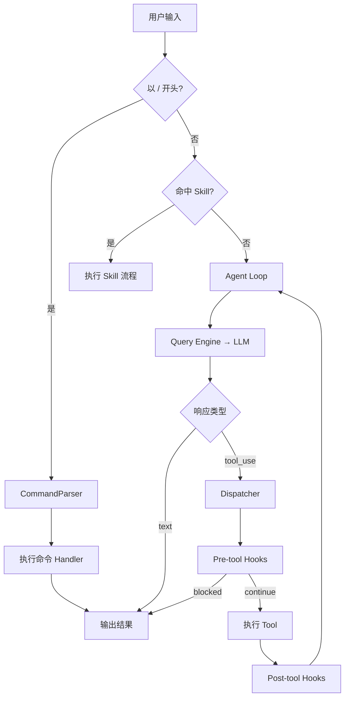

# Hook & Command 实现

Hook 和 Command 解决的是两个互补的问题：

- **Hook**：治理逻辑怎么不散落在业务代码里？怎么让权限、审计、压缩、记忆这些关注点插入执行链，但不和核心逻辑耦合？
- **Command**：自然语言适合表达意图，但不适合所有操作。用户要清空会话、跳过某题、切换模型，自然语言解析不如一个确定性命令来得稳。

## Part 1: Hook —— 执行链的扩展点

### 为什么需要 Hook

没有 Hook 的 Agent，Dispatcher 里会充满这样的代码：

```typescript
// 坏味道：所有治理逻辑混在一起
async function dispatch(toolCall) {
  // 权限检查
  const allowed = await permission.check(toolCall);
  if (!allowed) return blocked();

  // 预算检查
  if (!budget.canAfford(toolCall)) return budgetExceeded();

  // 敏感信息过滤
  toolCall.input = sanitize(toolCall.input);

  const result = await tool.execute(toolCall.input);

  // 审计日志
  audit.log(toolCall, result);

  // 压缩输出
  const compressed = compressor.compress(result);

  // 更新记忆
  if (shouldUpdateMemory(result)) memory.update(result);

  // 更新进度
  session.updateProgress();

  // 指标上报
  metrics.emit(toolCall, result);

  return compressed;
}
```

每加一个关注点，Dispatcher 就膨胀一层。Hook 把这些逻辑变成独立的、可插拔的单元。

### 模块结构

```text
src/hooks/
├── pipeline.ts        # HookPipeline 主类
├── types.ts           # Hook 接口定义
├── pre-tool/
│   ├── permission-check.ts
│   ├── input-sanitize.ts
│   └── budget-check.ts
└── post-tool/
    ├── audit-log.ts
    ├── result-compress.ts
    ├── memory-trigger.ts
    ├── progress-update.ts
    └── metric-emit.ts
```

### Hook 接口

```typescript
// hooks/types.ts

export type HookTiming = 'pre-tool' | 'post-tool';

export interface HookContext {
  toolCall: { name: string; id: string; input: Record<string, unknown> };
  result?: ToolResult;           // post-tool 才有
  session: Session;
  metadata: Map<string, unknown>;  // hook 间传递数据
}

export type HookOutcome =
  | { action: 'continue' }                   // 正常继续
  | { action: 'modify_input'; input: Record<string, unknown> }  // 修改 tool 输入
  | { action: 'modify_result'; result: ToolResult }              // 修改 tool 输出
  | { action: 'block'; reason: string }      // 阻断执行
  | { action: 'skip' };                      // 跳过剩余 hooks

export interface Hook {
  name: string;
  timing: HookTiming;
  priority: number;              // 越小越先执行（0-100）
  enabled: boolean;
  execute(ctx: HookContext): Promise<HookOutcome>;
}
```

### HookPipeline 实现

```typescript
// hooks/pipeline.ts

import { Hook, HookContext, HookOutcome, HookTiming } from './types';

export class HookPipeline {
  private hooks: Hook[] = [];

  register(hook: Hook): void {
    this.hooks.push(hook);
    this.hooks.sort((a, b) => a.priority - b.priority);
  }

  unregister(name: string): void {
    this.hooks = this.hooks.filter(h => h.name !== name);
  }

  enable(name: string): void {
    const hook = this.hooks.find(h => h.name === name);
    if (hook) hook.enabled = true;
  }

  disable(name: string): void {
    const hook = this.hooks.find(h => h.name === name);
    if (hook) hook.enabled = false;
  }

  async runPre(ctx: HookContext): Promise<HookOutcome> {
    return this.run('pre-tool', ctx);
  }

  async runPost(ctx: HookContext): Promise<HookOutcome> {
    return this.run('post-tool', ctx);
  }

  private async run(timing: HookTiming, ctx: HookContext): Promise<HookOutcome> {
    const applicable = this.hooks.filter(h => h.timing === timing && h.enabled);

    for (const hook of applicable) {
      try {
        const outcome = await hook.execute(ctx);

        switch (outcome.action) {
          case 'continue':
            break;

          case 'modify_input':
            ctx.toolCall.input = outcome.input;
            break;

          case 'modify_result':
            ctx.result = outcome.result;
            break;

          case 'block':
            return outcome;  // 立即终止管线

          case 'skip':
            return { action: 'continue' };  // 跳过剩余 hooks
        }
      } catch (err) {
        // Hook 自身报错不应该阻断主流程
        console.error(`Hook "${hook.name}" error: ${err}`);
        // 继续执行下一个 hook
      }
    }

    return { action: 'continue' };
  }

  list(): Array<{ name: string; timing: HookTiming; priority: number; enabled: boolean }> {
    return this.hooks.map(h => ({
      name: h.name,
      timing: h.timing,
      priority: h.priority,
      enabled: h.enabled,
    }));
  }
}
```

### Pre-tool Hooks 实现

#### permission-check

```typescript
// hooks/pre-tool/permission-check.ts

import { Hook, HookContext, HookOutcome } from '../types';
import { PermissionGate } from '../../permission/gate';

export function createPermissionCheckHook(gate: PermissionGate): Hook {
  return {
    name: 'permission-check',
    timing: 'pre-tool',
    priority: 10,   // 最先执行
    enabled: true,

    async execute(ctx: HookContext): Promise<HookOutcome> {
      const decision = await gate.checkTool(
        { name: ctx.toolCall.name, input: ctx.toolCall.input },
        ctx.session.id,
      );

      if (!decision.allowed) {
        return { action: 'block', reason: `Permission denied: ${decision.rule.reason}` };
      }

      // 把决策信息传递给后续 hooks（比如 audit-log）
      ctx.metadata.set('permissionDecision', decision);
      return { action: 'continue' };
    },
  };
}
```

#### input-sanitize

```typescript
// hooks/pre-tool/input-sanitize.ts

import { Hook, HookContext, HookOutcome } from '../types';

export const inputSanitizeHook: Hook = {
  name: 'input-sanitize',
  timing: 'pre-tool',
  priority: 20,
  enabled: true,

  async execute(ctx: HookContext): Promise<HookOutcome> {
    const sanitized = { ...ctx.toolCall.input };
    let modified = false;

    // 过滤可能的敏感信息（用户可配置）
    for (const [key, value] of Object.entries(sanitized)) {
      if (typeof value === 'string') {
        // 脱敏手机号
        const phoneRedacted = value.replace(/1[3-9]\d{9}/g, '***PHONE***');
        // 脱敏邮箱
        const emailRedacted = phoneRedacted.replace(
          /[\w.-]+@[\w.-]+\.\w+/g, '***EMAIL***'
        );

        if (emailRedacted !== value) {
          sanitized[key] = emailRedacted;
          modified = true;
        }
      }
    }

    if (modified) {
      return { action: 'modify_input', input: sanitized };
    }
    return { action: 'continue' };
  },
};
```

#### budget-check

```typescript
// hooks/pre-tool/budget-check.ts

import { Hook, HookContext, HookOutcome } from '../types';

export function createBudgetCheckHook(tokenCounter: TokenCounter): Hook {
  return {
    name: 'budget-check',
    timing: 'pre-tool',
    priority: 30,
    enabled: true,

    async execute(ctx: HookContext): Promise<HookOutcome> {
      const check = tokenCounter.checkBudget();

      if (!check.ok) {
        return {
          action: 'block',
          reason: `Budget exceeded: ${check.reason}. Use /budget to check or /config to increase limit.`,
        };
      }

      return { action: 'continue' };
    },
  };
}
```

### Post-tool Hooks 实现

#### audit-log

```typescript
// hooks/post-tool/audit-log.ts

import { Hook, HookContext, HookOutcome } from '../types';
import { AuditLogger } from '../../permission/audit';

export function createAuditLogHook(logger: AuditLogger): Hook {
  return {
    name: 'audit-log',
    timing: 'post-tool',
    priority: 10,   // 最先记录
    enabled: true,

    async execute(ctx: HookContext): Promise<HookOutcome> {
      logger.logToolExecution({
        sessionId: ctx.session.id,
        toolName: ctx.toolCall.name,
        inputSummary: JSON.stringify(ctx.toolCall.input).slice(0, 200),
        outputSummary: ctx.result
          ? JSON.stringify(ctx.result).slice(0, 200)
          : 'no result',
        success: ctx.result?.success ?? false,
        timestamp: new Date().toISOString(),
      });

      return { action: 'continue' };
    },
  };
}
```

#### result-compress

```typescript
// hooks/post-tool/result-compress.ts

import { Hook, HookContext, HookOutcome } from '../types';
import { Compressor } from '../../context/compressor';

export function createResultCompressHook(compressor: Compressor, maxTokens = 1000): Hook {
  return {
    name: 'result-compress',
    timing: 'post-tool',
    priority: 20,
    enabled: true,

    async execute(ctx: HookContext): Promise<HookOutcome> {
      if (!ctx.result?.data) return { action: 'continue' };

      const raw = JSON.stringify(ctx.result.data);
      const estimated = Math.ceil(raw.length / 4);  // 粗估 tokens

      if (estimated <= maxTokens) return { action: 'continue' };

      const compressed = compressor.compressToolOutput(raw, maxTokens);
      return {
        action: 'modify_result',
        result: { ...ctx.result, data: JSON.parse(compressed) },
      };
    },
  };
}
```

#### memory-trigger

```typescript
// hooks/post-tool/memory-trigger.ts

import { Hook, HookContext, HookOutcome } from '../types';
import { MemoryTriggers } from '../../memory/triggers';

export function createMemoryTriggerHook(triggers: MemoryTriggers): Hook {
  return {
    name: 'memory-trigger',
    timing: 'post-tool',
    priority: 30,
    enabled: true,

    async execute(ctx: HookContext): Promise<HookOutcome> {
      // 只在特定 tool 完成后触发记忆写入
      if (ctx.toolCall.name === 'analyze_content' && ctx.result?.success) {
        const diagnosis = ctx.result.data as ContentDiagnosis;
        const question = ctx.toolCall.input.question as string;
        const dimension = ctx.metadata.get('currentDimension') as string;

        triggers.afterSingleQuestion(question, diagnosis, dimension);
      }

      if (ctx.toolCall.name === 'generate_report' && ctx.result?.success) {
        triggers.afterDiagnosis(ctx.result.data as DiagnosisReport);
      }

      return { action: 'continue' };
    },
  };
}
```

#### progress-update

```typescript
// hooks/post-tool/progress-update.ts

import { Hook, HookContext, HookOutcome } from '../types';

export const progressUpdateHook: Hook = {
  name: 'progress-update',
  timing: 'post-tool',
  priority: 40,
  enabled: true,

  async execute(ctx: HookContext): Promise<HookOutcome> {
    // 完成一道题的诊断后更新进度
    if (ctx.toolCall.name === 'analyze_content' && ctx.result?.success) {
      const { done, total } = ctx.session.progress;
      ctx.session.progress = {
        ...ctx.session.progress,
        done: done + 1,
        current: done + 2,
        phase: `诊断中 (${done + 1}/${total})`,
      };
    }

    return { action: 'continue' };
  },
};
```

#### metric-emit

```typescript
// hooks/post-tool/metric-emit.ts

import { Hook, HookContext, HookOutcome } from '../types';

interface MetricPoint {
  tool: string;
  durationMs: number;
  success: boolean;
  timestamp: string;
}

export class MetricCollector {
  private points: MetricPoint[] = [];

  createHook(): Hook {
    const self = this;
    return {
      name: 'metric-emit',
      timing: 'post-tool',
      priority: 50,  // 最后执行
      enabled: true,

      async execute(ctx: HookContext): Promise<HookOutcome> {
        const startTime = ctx.metadata.get('toolStartTime') as number;
        const durationMs = startTime ? Date.now() - startTime : 0;

        self.points.push({
          tool: ctx.toolCall.name,
          durationMs,
          success: ctx.result?.success ?? false,
          timestamp: new Date().toISOString(),
        });

        return { action: 'continue' };
      },
    };
  }

  getSummary(): { totalCalls: number; avgDurationMs: number; successRate: number; byTool: Record<string, { calls: number; avgMs: number }> } {
    const total = this.points.length;
    if (total === 0) return { totalCalls: 0, avgDurationMs: 0, successRate: 0, byTool: {} };

    const avgMs = this.points.reduce((s, p) => s + p.durationMs, 0) / total;
    const successRate = this.points.filter(p => p.success).length / total;

    const byTool: Record<string, { calls: number; avgMs: number }> = {};
    for (const p of this.points) {
      if (!byTool[p.tool]) byTool[p.tool] = { calls: 0, avgMs: 0 };
      byTool[p.tool].calls++;
      byTool[p.tool].avgMs += p.durationMs;
    }
    for (const t of Object.values(byTool)) {
      t.avgMs = Math.round(t.avgMs / t.calls);
    }

    return { totalCalls: total, avgDurationMs: Math.round(avgMs), successRate, byTool };
  }
}
```

### Dispatcher 集成 Hook Pipeline

有了 Hook Pipeline，Dispatcher 变得干净：

```typescript
// agent/dispatcher.ts

export class Dispatcher {
  private registry: ToolRegistry;
  private hooks: HookPipeline;

  constructor(registry: ToolRegistry, hooks: HookPipeline) {
    this.registry = registry;
    this.hooks = hooks;
  }

  async execute(toolCall: ToolCall, session: Session): Promise<ToolResult> {
    const ctx: HookContext = {
      toolCall: { name: toolCall.name, id: toolCall.id, input: toolCall.input },
      session,
      metadata: new Map([['toolStartTime', Date.now()]]),
    };

    // Pre-tool hooks
    const preOutcome = await this.hooks.runPre(ctx);
    if (preOutcome.action === 'block') {
      return { success: false, error: { code: 'permission_denied', message: preOutcome.reason } };
    }

    // 执行 Tool（用可能被 hook 修改过的 input）
    const tool = this.registry.resolve(ctx.toolCall.name);
    const result = await tool.execute(ctx.toolCall.input, {
      session,
      queryEngine: session.queryEngine,
      knowledgeBase: session.knowledgeBase,
      abortSignal: session.abortController.signal,
    });

    // Post-tool hooks
    ctx.result = result;
    const postOutcome = await this.hooks.runPost(ctx);
    if (postOutcome.action === 'modify_result') {
      return postOutcome.result;
    }

    return ctx.result;
  }
}
```

Dispatcher 只做两件事：执行 tool + 调用 hooks。所有治理逻辑都在 hooks 里。

---

## Part 2: Command —— 确定性操作入口

### 为什么需要 Command

自然语言的问题是歧义。"重新开始"是重置当前 session？还是创建新 session？"跳过"是跳过当前题还是跳过当前阶段？

Command 给用户一条确定性通道：输入明确、行为可预测、不经过 LLM 解析。

### 模块结构

```text
src/command/
├── parser.ts          # CommandParser 主类
├── registry.ts        # 命令注册表
├── types.ts           # 类型定义
└── handlers/
    ├── upload.ts
    ├── diagnose.ts
    ├── status.ts
    ├── skip.ts
    ├── detail.ts
    ├── compare.ts
    ├── report.ts
    ├── history.ts
    ├── mock.ts
    ├── resume.ts
    ├── reset.ts
    ├── export.ts
    ├── budget.ts
    ├── config.ts
    └── help.ts
```

### Command 接口

```typescript
// command/types.ts

export interface CommandArg {
  name: string;
  description: string;
  required: boolean;
  type: 'string' | 'number' | 'boolean';
  choices?: string[];
}

export interface Command {
  name: string;
  aliases: string[];
  description: string;
  args: CommandArg[];
  examples: string[];
  execute(args: ParsedArgs, session: Session): Promise<CommandResult>;
}

export interface ParsedArgs {
  positional: string[];
  flags: Record<string, string | boolean>;
}

export interface CommandResult {
  output: string;            // 展示给用户的文本
  action?: 'continue' | 'exit' | 'new_session';
  data?: unknown;            // 结构化结果（供后续命令使用）
}
```

### CommandParser 实现

```typescript
// command/parser.ts

import { Command, ParsedArgs, CommandResult } from './types';

export class CommandParser {
  private commands = new Map<string, Command>();
  private aliasMap = new Map<string, string>();   // alias → command name

  register(cmd: Command): void {
    this.commands.set(cmd.name, cmd);
    for (const alias of cmd.aliases) {
      this.aliasMap.set(alias, cmd.name);
    }
  }

  isCommand(input: string): boolean {
    return input.trimStart().startsWith('/');
  }

  parse(input: string): { command: Command; args: ParsedArgs } | null {
    if (!this.isCommand(input)) return null;

    const trimmed = input.trimStart().slice(1);  // 去掉 /
    const parts = trimmed.split(/\s+/);
    const name = parts[0].toLowerCase();

    // 解析命令名（支持别名）
    const resolvedName = this.aliasMap.get(name) ?? name;
    const command = this.commands.get(resolvedName);
    if (!command) return null;

    // 解析参数
    const args = this.parseArgs(parts.slice(1));

    return { command, args };
  }

  async execute(input: string, session: Session): Promise<CommandResult> {
    const parsed = this.parse(input);
    if (!parsed) {
      return { output: `未知命令。输入 /help 查看可用命令。` };
    }

    try {
      return await parsed.command.execute(parsed.args, session);
    } catch (err) {
      return { output: `命令执行失败: ${err instanceof Error ? err.message : String(err)}` };
    }
  }

  listCommands(): Array<{ name: string; aliases: string[]; description: string }> {
    return Array.from(this.commands.values()).map(c => ({
      name: c.name,
      aliases: c.aliases,
      description: c.description,
    }));
  }

  private parseArgs(parts: string[]): ParsedArgs {
    const positional: string[] = [];
    const flags: Record<string, string | boolean> = {};

    for (let i = 0; i < parts.length; i++) {
      const part = parts[i];
      if (part.startsWith('--')) {
        const key = part.slice(2);
        const next = parts[i + 1];
        if (next && !next.startsWith('--')) {
          flags[key] = next;
          i++;
        } else {
          flags[key] = true;
        }
      } else {
        positional.push(part);
      }
    }

    return { positional, flags };
  }
}
```

### 命令实现

#### /status

```typescript
// command/handlers/status.ts

export const statusCommand: Command = {
  name: 'status',
  aliases: ['s', 'info'],
  description: '查看当前诊断进度和资源使用',
  args: [],
  examples: ['/status'],

  async execute(args, session): Promise<CommandResult> {
    const { progress } = session;
    const contextStats = session.contextManager.getStats();
    const budgetSummary = session.queryEngine.getUsageSummary();

    const lines: string[] = [
      `Session: ${session.id.slice(0, 8)}  Status: ${session.status}`,
      `Progress: ${progress.done}/${progress.total}  Phase: ${progress.phase}`,
      `${contextStats}`,
      `${budgetSummary}`,
    ];

    if (session.state.mode === 'mock-interview') {
      lines.push(`Mode: 模拟面试  当前第 ${(session.state.currentIndex ?? 0) + 1} 题`);
    }

    return { output: lines.join('\n') };
  },
};
```

#### /skip

```typescript
// command/handlers/skip.ts

export const skipCommand: Command = {
  name: 'skip',
  aliases: [],
  description: '跳过当前题目（或指定编号的题目）',
  args: [{ name: 'n', description: '题目编号（可选）', required: false, type: 'number' }],
  examples: ['/skip', '/skip 5'],

  async execute(args, session): Promise<CommandResult> {
    const qaPairs = session.state.qaPairs as QaPair[] | undefined;
    if (!qaPairs) {
      return { output: '当前没有正在诊断的题目列表。' };
    }

    const targetIndex = args.positional[0]
      ? parseInt(args.positional[0]) - 1
      : session.progress.current - 1;

    if (targetIndex < 0 || targetIndex >= qaPairs.length) {
      return { output: `无效的题号。范围: 1-${qaPairs.length}` };
    }

    // 标记跳过
    if (!session.state.skipped) session.state.skipped = [];
    (session.state.skipped as number[]).push(targetIndex);

    const q = qaPairs[targetIndex].question.slice(0, 50);
    return { output: `已跳过第 ${targetIndex + 1} 题: "${q}..."` };
  },
};
```

#### /resume

```typescript
// command/handlers/resume.ts

export const resumeCommand: Command = {
  name: 'resume',
  aliases: ['r', 'continue'],
  description: '从上次中断处继续诊断',
  args: [{ name: 'session-id', description: 'Session ID（可选，默认最近一次）', required: false, type: 'string' }],
  examples: ['/resume', '/resume abc123'],

  async execute(args, session): Promise<CommandResult> {
    const sessionManager = session.sessionManager;
    const restorer = session.restorer;

    // 找到要恢复的 session
    let targetId: string;
    if (args.positional[0]) {
      targetId = args.positional[0];
    } else {
      const paused = sessionManager.list({ status: 'paused', limit: 1 });
      if (paused.length === 0) {
        return { output: '没有可恢复的会话。' };
      }
      targetId = paused[0].id;
    }

    const restored = await restorer.resume(targetId);
    const { progress } = restored;

    return {
      output: `已恢复会话 ${targetId.slice(0, 8)}\n进度: ${progress.done}/${progress.total}  从第 ${progress.current} 题继续`,
      action: 'continue',
    };
  },
};
```

#### /history

```typescript
// command/handlers/history.ts

export const historyCommand: Command = {
  name: 'history',
  aliases: ['h', 'sessions'],
  description: '查看历史诊断会话',
  args: [{ name: 'limit', description: '显示条数', required: false, type: 'number' }],
  examples: ['/history', '/history 5'],

  async execute(args, session): Promise<CommandResult> {
    const limit = args.positional[0] ? parseInt(args.positional[0]) : 10;
    const sessions = session.sessionManager.list({ limit });

    if (sessions.length === 0) {
      return { output: '暂无历史会话。' };
    }

    const lines = sessions.map(s => {
      const status = { created: '○', processing: '●', paused: '◐', completed: '✓', failed: '✗' }[s.status];
      return `${status} ${s.id.slice(0, 8)}  ${s.progress.done}/${s.progress.total}题  ${s.inputType}  ${s.updatedAt.slice(0, 10)}`;
    });

    return { output: ['ID        进度    类型        日期', ...lines].join('\n') };
  },
};
```

#### /mock

```typescript
// command/handlers/mock.ts

export const mockCommand: Command = {
  name: 'mock',
  aliases: ['interview', 'practice'],
  description: '开始模拟面试',
  args: [
    { name: 'dimension', description: '维度（可选）', required: false, type: 'string', choices: ['architecture', 'tool', 'memory', 'planning', 'multi-agent', 'engineering', 'rag'] },
    { name: 'count', description: '题数（默认5）', required: false, type: 'number' },
  ],
  examples: ['/mock', '/mock memory', '/mock rag --count 10'],

  async execute(args, session): Promise<CommandResult> {
    const dimension = args.positional[0];
    const count = args.flags.count ? parseInt(args.flags.count as string) : 5;

    const skill = session.skillRegistry.resolve('mock-interview');
    const result = await skill.execute(
      { rawInput: '', parsedArgs: { dimension, count } },
      session.makeSkillContext(),
    );

    return { output: result.report ?? '模拟面试启动失败', action: 'continue' };
  },
};
```

#### /export

```typescript
// command/handlers/export.ts

export const exportCommand: Command = {
  name: 'export',
  aliases: ['save', 'download'],
  description: '导出诊断报告',
  args: [
    { name: 'format', description: '格式', required: false, type: 'string', choices: ['md', 'json', 'pdf'] },
    { name: 'path', description: '输出路径', required: false, type: 'string' },
  ],
  examples: ['/export', '/export md ./report.md', '/export json'],

  async execute(args, session): Promise<CommandResult> {
    const format = (args.positional[0] ?? 'md') as 'md' | 'json' | 'pdf';
    const path = args.positional[1] ?? `./diagnosis-report-${Date.now()}.${format}`;

    const report = session.state.latestReport as DiagnosisReport | undefined;
    if (!report) {
      return { output: '当前会话没有可导出的报告。请先完成诊断。' };
    }

    let content: string;
    switch (format) {
      case 'json':
        content = JSON.stringify(report, null, 2);
        break;
      case 'md':
        content = formatReportAsMarkdown(report);
        break;
      default:
        return { output: 'PDF 导出暂未实现，请使用 md 或 json 格式。' };
    }

    await writeFile(path, content);
    return { output: `报告已导出: ${path} (${format})` };
  },
};
```

#### /help

```typescript
// command/handlers/help.ts

export const helpCommand: Command = {
  name: 'help',
  aliases: ['?', 'commands'],
  description: '显示所有可用命令',
  args: [{ name: 'command', description: '查看某个命令的详细帮助', required: false, type: 'string' }],
  examples: ['/help', '/help mock'],

  async execute(args, session): Promise<CommandResult> {
    const parser = session.commandParser;

    if (args.positional[0]) {
      const parsed = parser.parse(`/${args.positional[0]}`);
      if (!parsed) return { output: `未知命令: ${args.positional[0]}` };

      const cmd = parsed.command;
      const lines = [
        `/${cmd.name}${cmd.aliases.length ? ` (${cmd.aliases.map(a => '/' + a).join(', ')})` : ''}`,
        cmd.description,
        '',
        '参数:',
        ...cmd.args.map(a => `  ${a.name}${a.required ? '' : '?'}  ${a.description}`),
        '',
        '示例:',
        ...cmd.examples.map(e => `  ${e}`),
      ];
      return { output: lines.join('\n') };
    }

    const commands = parser.listCommands();
    const lines = [
      '可用命令:',
      '',
      ...commands.map(c => `  /${c.name.padEnd(12)} ${c.description}`),
      '',
      '输入 /help <command> 查看详细帮助',
    ];
    return { output: lines.join('\n') };
  },
};
```

### 命令注册

```typescript
// command/index.ts

import { CommandParser } from './parser';
import { statusCommand } from './handlers/status';
import { skipCommand } from './handlers/skip';
import { resumeCommand } from './handlers/resume';
import { historyCommand } from './handlers/history';
import { mockCommand } from './handlers/mock';
import { exportCommand } from './handlers/export';
import { helpCommand } from './handlers/help';
// ... 其他命令

export function createCommandParser(): CommandParser {
  const parser = new CommandParser();

  parser.register(statusCommand);
  parser.register(skipCommand);
  parser.register(resumeCommand);
  parser.register(historyCommand);
  parser.register(mockCommand);
  parser.register(exportCommand);
  parser.register(helpCommand);
  // ... 注册其他命令

  return parser;
}
```

### Agent Loop 中的命令拦截

命令必须在进入 LLM 之前被拦截——它不应该被当作自然语言处理。

```typescript
// agent/loop.ts

async function handleInput(input: string, session: Session): Promise<void> {
  const commandParser = session.commandParser;

  // 1. 命令优先
  if (commandParser.isCommand(input)) {
    const result = await commandParser.execute(input, session);
    output.print(result.output);

    if (result.action === 'exit') process.exit(0);
    if (result.action === 'new_session') await createNewSession();
    return;
  }

  // 2. 否则进入 Agent Loop
  await agentLoop(input, session);
}
```

### 完整命令清单

```text
命令             别名              描述
─────────────────────────────────────────────────────────
/upload          -                上传面试稿或录音
/diagnose        /d               开始诊断当前内容
/status          /s, /info        查看进度和资源使用
/skip [n]        -                跳过当前/指定题
/detail [n]      -                查看第 n 题详细诊断
/compare [n]     -                对比第 n 题与高手答
/report          -                生成完整报告
/history         /h, /sessions    查看历史会话
/mock [dim]      /interview       模拟面试
/resume [id]     /r, /continue    恢复中断的会话
/reset           -                清空当前会话
/export [fmt]    /save            导出报告 (md/json)
/budget          -                查看 token 预算
/config          -                查看/修改配置
/hooks           -                查看 hook 状态
/help [cmd]      /?, /commands    帮助信息
```

## Hook × Command × Agent Loop 全景



## 小结

- **Hook Pipeline**：pre-tool + post-tool 两个时机，按 priority 顺序执行
- Hook 可以 continue / modify_input / modify_result / block / skip，Dispatcher 只剩两行核心逻辑
- Hook 自身报错不阻断主流程（容错设计）
- 默认 7 个 Hook 覆盖：权限 → 脱敏 → 预算 → 审计 → 压缩 → 记忆 → 进度 → 指标
- **Command**：/ 前缀触发，不经过 LLM，参数确定性解析
- 14 个命令覆盖诊断全生命周期：上传 → 诊断 → 跳过 → 恢复 → 导出
- 命令在 Agent Loop 之前拦截，不是事后补丁

下一篇建议继续看：

- [09-sub-agent：多 Agent 并行诊断编排](../09-sub-agent/index.html)（待产出）
