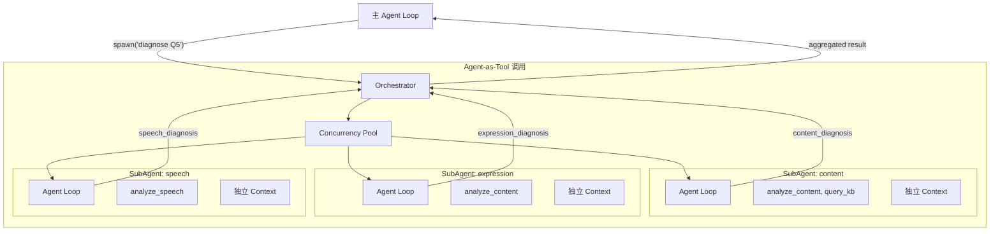
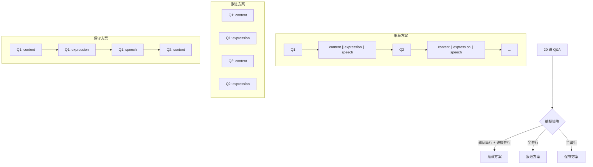
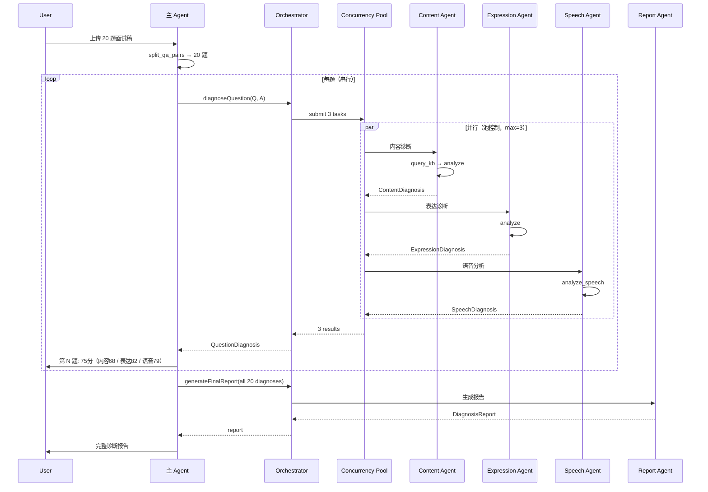

# Sub-agent 编排

前面 8 篇把单 Agent 做稳了。现在是时候让它“长出团队”。

面试诊断有一个天然的并行结构：一道题的**内容诊断**、**表达诊断**、**语音分析**三个维度之间没有依赖关系。如果串行执行，20 道题 × 3 个维度 = 60 次模型调用，每次 3-5 秒，总计 3-5 分钟。如果三个维度并行，理论上只需要 1-2 分钟。

但 Sub-agent 不是“多开几个并发请求”这么简单。它需要解决：

- 每个子 Agent 应该看到什么上下文？（太多会干扰，太少会缺信息）
- 子 Agent 之间怎么隔离？（一个失败不能影响其他）
- 结果怎么汇聚？（格式不一致怎么办）
- 并发怎么控制？（不能同时打满 API 限流）

## 模块结构

```text
src/agent/
├── loop.ts             # 主 Agent Loop（前面已实现）
├── dispatcher.ts       # Tool Dispatcher（前面已实现）
├── orchestrator.ts     # Sub-agent 编排器（本篇核心）
├── sub-agent.ts        # SubAgent 运行时
├── pool.ts             # 并发池
└── types.ts            # 类型定义
```

## 设计决策：Agent-as-Tool 模式

Sub-agent 有多种编排模式（消息传递、共享黑板、层级委托）。我们选最简单清晰的一种：**Agent-as-Tool**。

子 Agent 被包装成一个 Tool，主 Agent 像调用普通 Tool 一样调用它。区别是：这个 “Tool” 内部有自己的 Agent Loop（独立的 system prompt、tools 子集、Context）。



## 类型定义

```typescript
// agent/types.ts

export interface SubAgentConfig {
  id: string;
  name: string;
  description: string;
  systemPrompt: string;
  tools: string[];              // 该子 agent 可用的 tool 名称
  maxTurns: number;             // 最大对话轮次（防止无限循环）
  timeout: number;              // 超时 ms
  contextBoundary: string[];    // 从主 agent 传入的上下文字段
}

export interface SubAgentTask {
  agentConfig: SubAgentConfig;
  input: string;                // 发给子 agent 的任务描述
  context?: Record<string, unknown>;  // 传入的上下文数据
}

export interface SubAgentResult {
  agentId: string;
  agentName: string;
  success: boolean;
  output: unknown;              // 结构化输出
  usage: { inputTokens: number; outputTokens: number };
  turns: number;
  durationMs: number;
  error?: string;
}

export interface OrchestratorConfig {
  maxConcurrency: number;       // 最大并行数
  timeout: number;              // 整体超时
  failureStrategy: 'fail_fast' | 'continue' | 'retry';
}
```

## 预定义的 Sub-agent 角色

```typescript
// agent/roles.ts

import { SubAgentConfig } from './types';

export const CONTENT_AGENT: SubAgentConfig = {
  id: 'content-agent',
  name: '内容诊断 Agent',
  description: '评估面试回答的完整性、深度、准确性、实践性',
  systemPrompt: `你是一位资深技术面试官。你的任务是精确诊断候选人回答的内容质量。

评估维度:
- completeness: 是否覆盖了关键点（对照参考答案）
- depth: 是否有递进分析，不只是表面描述
- accuracy: 技术细节是否正确
- practicality: 是否有实际经验支撑

输出必须是 JSON 格式的 ContentDiagnosis。
不要客气，不要鼓励性评价，直接指出问题。`,
  tools: ['query_knowledge_base', 'analyze_content'],
  maxTurns: 3,
  timeout: 30000,
  contextBoundary: ['question', 'userAnswer'],
};

export const EXPRESSION_AGENT: SubAgentConfig = {
  id: 'expression-agent',
  name: '表达诊断 Agent',
  description: '评估回答的逻辑结构、简洁度、关键词命中和收尾力',
  systemPrompt: `你是一位面试表达教练。你的任务是分析候选人回答的表达质量——不是内容对不对，而是说得好不好。

评估维度:
- structure: 是否分层递进，有框架感（总-分-总、先结论后展开）
- conciseness: 是否有废话、重复、绕圈子
- keywords: 是否用了面试官期待的术语和概念
- closure: 结论是否清晰有力，还是虎头蛇尾

不要评估技术正确性（那是内容 Agent 的事）。
只关注"同样的内容，怎么说得更好"。
输出 JSON 格式。`,
  tools: ['analyze_content'],
  maxTurns: 2,
  timeout: 20000,
  contextBoundary: ['question', 'userAnswer'],
};

export const SPEECH_AGENT: SubAgentConfig = {
  id: 'speech-agent',
  name: '语音分析 Agent',
  description: '分析语速、停顿、填充词、语气和节奏',
  systemPrompt: `你是一位语音表达分析师。基于转写文本和时间戳数据，分析候选人的口语表达特征。

分析维度:
- fluency: 语句连贯性，是否频繁断句
- pace: 语速是否过快或过慢（理想: 200-250 字/分钟）
- confidence: 填充词（嗯/那个/就是）的频率
- rhythm: 是否有不自然的长停顿

注意: 你拿到的是带时间戳的转写数据，用工具做定量分析后给出诊断。`,
  tools: ['analyze_speech'],
  maxTurns: 2,
  timeout: 15000,
  contextBoundary: ['transcript', 'timestamps'],
};

export const REPORT_AGENT: SubAgentConfig = {
  id: 'report-agent',
  name: '报告生成 Agent',
  description: '汇总所有维度的诊断结果，生成结构化报告',
  systemPrompt: `你是一位面试诊断报告撰写者。你的任务是将多个维度的诊断结果汇总成一份清晰、可执行的诊断报告。

报告要求:
- 先给总结（一句话总评 + 总分）
- 再按题列出关键问题
- 最后给出分层改进建议（立即可改 / 短期提升 / 长期积累）
- 语言要直接，不要客套话

输出 JSON 格式的 DiagnosisReport。`,
  tools: ['generate_report'],
  maxTurns: 2,
  timeout: 30000,
  contextBoundary: ['allDiagnoses'],
};
```

## SubAgent 运行时

每个 Sub-agent 是一个独立的微型 Agent Loop：自己的 system prompt、tools 子集、Context，但共享 QueryEngine 和 Rate Limiter。

```typescript
// agent/sub-agent.ts

import { SubAgentConfig, SubAgentResult, SubAgentTask } from './types';
import { ContextManager } from '../context/manager';
import { QueryEngine } from '../query-engine/engine';
import { ToolRegistry } from '../tools/registry';
import { parseStream } from '../query-engine/stream';

export class SubAgentRuntime {
  private queryEngine: QueryEngine;
  private toolRegistry: ToolRegistry;

  constructor(queryEngine: QueryEngine, toolRegistry: ToolRegistry) {
    this.queryEngine = queryEngine;
    this.toolRegistry = toolRegistry;
  }

  async run(task: SubAgentTask): Promise<SubAgentResult> {
    const { agentConfig, input, context } = task;
    const startTime = Date.now();
    let turns = 0;
    let totalInput = 0;
    let totalOutput = 0;

    // 独立的 Context（只包含子 agent 需要的信息）
    const ctx = new ContextManager({ maxTotalTokens: 8000 });
    ctx.setSystemPrompt(agentConfig.systemPrompt);

    // 注入传入的上下文
    if (context) {
      const contextStr = agentConfig.contextBoundary
        .map(key => context[key] ? `${key}: ${JSON.stringify(context[key])}` : '')
        .filter(Boolean)
        .join('\n\n');
      ctx.setTaskContext(contextStr);
    }

    ctx.addMessage({ role: 'user', content: input });

    // 子 agent 可用的 tools（子集）
    const toolSchemas = this.toolRegistry.getSchemasFor(agentConfig.tools);

    // Mini Agent Loop
    while (turns < agentConfig.maxTurns) {
      turns++;
      const window = ctx.build();

      const response = await this.queryEngine.query({
        messages: window.messages,
        systemPrompt: window.systemPrompt,
        tools: toolSchemas,
        maxTokens: 2000,
      });

      totalInput += response.usage.inputTokens;
      totalOutput += response.usage.outputTokens;

      if (response.type === 'text') {
        // 子 agent 结束——尝试解析 JSON 输出
        const output = this.parseOutput(response.content ?? '');
        return {
          agentId: agentConfig.id,
          agentName: agentConfig.name,
          success: true,
          output,
          usage: { inputTokens: totalInput, outputTokens: totalOutput },
          turns,
          durationMs: Date.now() - startTime,
        };
      }

      if (response.type === 'tool_use' && response.toolCalls) {
        // 执行 tool（不经过主 agent 的 hooks——子 agent 有自己的简化流程）
        for (const toolCall of response.toolCalls) {
          const tool = this.toolRegistry.resolve(toolCall.name);
          const result = await tool.execute(toolCall.input, {
            session: null as any, // 子 agent 不绑定 session
            queryEngine: this.queryEngine,
            knowledgeBase: null as any,
            abortSignal: AbortSignal.timeout(agentConfig.timeout),
          });
          ctx.addToolResult(toolCall.id, JSON.stringify(result));
        }
        ctx.addMessage({ role: 'assistant', content: '', toolCalls: response.toolCalls });
      }
    }

    // 超过 maxTurns
    return {
      agentId: agentConfig.id,
      agentName: agentConfig.name,
      success: false,
      output: null,
      usage: { inputTokens: totalInput, outputTokens: totalOutput },
      turns,
      durationMs: Date.now() - startTime,
      error: `Exceeded max turns (${agentConfig.maxTurns})`,
    };
  }

  private parseOutput(content: string): unknown {
    // 尝试从回复中提取 JSON
    const jsonMatch = content.match(/```json\n?([\s\S]+?)\n?```/) ||
                      content.match(/\{[\s\S]+\}/);
    if (jsonMatch) {
      try {
        return JSON.parse(jsonMatch[1] ?? jsonMatch[0]);
      } catch {
        return content;
      }
    }
    return content;
  }
}
```

## 并发池：控制并行度

不能无限并发——API 有限流，机器有资源上限。

```typescript
// agent/pool.ts

export class ConcurrencyPool {
  private running = 0;
  private queue: Array<{ resolve: () => void }> = [];
  private maxConcurrency: number;

  constructor(maxConcurrency: number) {
    this.maxConcurrency = maxConcurrency;
  }

  async acquire(): Promise<void> {
    if (this.running < this.maxConcurrency) {
      this.running++;
      return;
    }

    // 排队等待
    return new Promise(resolve => {
      this.queue.push({ resolve });
    });
  }

  release(): void {
    this.running--;
    if (this.queue.length > 0) {
      this.running++;
      this.queue.shift()!.resolve();
    }
  }

  async run<T>(fn: () => Promise<T>): Promise<T> {
    await this.acquire();
    try {
      return await fn();
    } finally {
      this.release();
    }
  }

  async runAll<T>(tasks: Array<() => Promise<T>>): Promise<T[]> {
    return Promise.all(tasks.map(task => this.run(task)));
  }

  getStats(): { running: number; queued: number; max: number } {
    return {
      running: this.running,
      queued: this.queue.length,
      max: this.maxConcurrency,
    };
  }
}
```

## Orchestrator：编排核心

Orchestrator 是主 Agent 调用子 Agent 的统一入口。

```typescript
// agent/orchestrator.ts

import { SubAgentRuntime } from './sub-agent';
import { ConcurrencyPool } from './pool';
import { SubAgentTask, SubAgentResult, OrchestratorConfig } from './types';
import { CONTENT_AGENT, EXPRESSION_AGENT, SPEECH_AGENT, REPORT_AGENT } from './roles';

export class Orchestrator {
  private runtime: SubAgentRuntime;
  private pool: ConcurrencyPool;
  private config: OrchestratorConfig;

  constructor(
    runtime: SubAgentRuntime,
    config: Partial<OrchestratorConfig> = {},
  ) {
    this.runtime = runtime;
    this.config = {
      maxConcurrency: config.maxConcurrency ?? 3,
      timeout: config.timeout ?? 60000,
      failureStrategy: config.failureStrategy ?? 'continue',
    };
    this.pool = new ConcurrencyPool(this.config.maxConcurrency);
  }

  /**
   * 单题多维度并行诊断
   */
  async diagnoseQuestion(params: {
    question: string;
    userAnswer: string;
    transcript?: string;
    timestamps?: Array<{ start: number; end: number; text: string }>;
  }): Promise<QuestionDiagnosis> {
    const tasks: SubAgentTask[] = [
      {
        agentConfig: CONTENT_AGENT,
        input: `请诊断以下面试回答的内容质量。\n\n问题: ${params.question}\n\n回答: ${params.userAnswer}`,
        context: { question: params.question, userAnswer: params.userAnswer },
      },
      {
        agentConfig: EXPRESSION_AGENT,
        input: `请分析以下面试回答的表达质量（不评估内容正确性）。\n\n问题: ${params.question}\n\n回答: ${params.userAnswer}`,
        context: { question: params.question, userAnswer: params.userAnswer },
      },
    ];

    // 语音分析只在有音频数据时加入
    if (params.timestamps) {
      tasks.push({
        agentConfig: SPEECH_AGENT,
        input: '请分析以下面试回答的语音特征。',
        context: { transcript: params.transcript, timestamps: params.timestamps },
      });
    }

    // 并行执行
    const results = await this.parallel(tasks);

    // 汇聚结果
    return this.aggregateQuestionResults(results);
  }

  /**
   * 批量诊断（多题并行）
   */
  async diagnoseBatch(
    questions: Array<{
      index: number;
      question: string;
      userAnswer: string;
      transcript?: string;
      timestamps?: any[];
    }>,
    onProgress?: (done: number, total: number) => void,
  ): Promise<QuestionDiagnosis[]> {
    const results: QuestionDiagnosis[] = [];
    let done = 0;

    // 题间也可以并行，但受限于并发池
    const tasks = questions.map(q => async () => {
      const diagnosis = await this.diagnoseQuestion(q);
      done++;
      onProgress?.(done, questions.length);
      return diagnosis;
    });

    // 使用池控制并发
    return this.pool.runAll(tasks);
  }

  /**
   * 生成最终报告（聚合所有题目的诊断）
   */
  async generateFinalReport(diagnoses: QuestionDiagnosis[]): Promise<SubAgentResult> {
    const task: SubAgentTask = {
      agentConfig: REPORT_AGENT,
      input: '请汇总以下所有题目的诊断结果，生成最终诊断报告。',
      context: { allDiagnoses: diagnoses },
    };

    return this.runtime.run(task);
  }

  /**
   * 并行执行多个子 Agent 任务
   */
  async parallel(tasks: SubAgentTask[]): Promise<SubAgentResult[]> {
    const wrappedTasks = tasks.map(task => () =>
      this.runWithTimeout(task, task.agentConfig.timeout)
    );

    const results = await this.pool.runAll(wrappedTasks);

    // 根据失败策略处理
    if (this.config.failureStrategy === 'fail_fast') {
      const failed = results.find(r => !r.success);
      if (failed) throw new Error(`Sub-agent "${failed.agentName}" failed: ${failed.error}`);
    }

    return results;
  }

  private async runWithTimeout(task: SubAgentTask, timeout: number): Promise<SubAgentResult> {
    const timer = new Promise<SubAgentResult>((_, reject) =>
      setTimeout(() => reject(new Error('timeout')), timeout)
    );

    try {
      return await Promise.race([this.runtime.run(task), timer]);
    } catch (err) {
      return {
        agentId: task.agentConfig.id,
        agentName: task.agentConfig.name,
        success: false,
        output: null,
        usage: { inputTokens: 0, outputTokens: 0 },
        turns: 0,
        durationMs: timeout,
        error: err instanceof Error ? err.message : 'Unknown error',
      };
    }
  }

  private aggregateQuestionResults(results: SubAgentResult[]): QuestionDiagnosis {
    const content = results.find(r => r.agentId === 'content-agent');
    const expression = results.find(r => r.agentId === 'expression-agent');
    const speech = results.find(r => r.agentId === 'speech-agent');

    return {
      content: content?.success ? (content.output as ContentDiagnosis) : null,
      expression: expression?.success ? (expression.output as ExpressionDiagnosis) : null,
      speech: speech?.success ? (speech.output as SpeechDiagnosis) : null,
      overallScore: this.calculateOverall(content, expression, speech),
      agentStats: results.map(r => ({
        name: r.agentName,
        success: r.success,
        turns: r.turns,
        durationMs: r.durationMs,
        tokens: r.usage.inputTokens + r.usage.outputTokens,
      })),
    };
  }

  private calculateOverall(
    content: SubAgentResult | undefined,
    expression: SubAgentResult | undefined,
    speech: SubAgentResult | undefined,
  ): number {
    let score = 0;
    let weight = 0;

    if (content?.success) {
      score += (content.output as any)?.overallScore ?? 0 * 0.6;
      weight += 0.6;
    }
    if (expression?.success) {
      score += (expression.output as any)?.overallScore ?? 0 * 0.25;
      weight += 0.25;
    }
    if (speech?.success) {
      score += (speech.output as any)?.overallScore ?? 0 * 0.15;
      weight += 0.15;
    }

    return weight > 0 ? Math.round(score / weight) : 0;
  }
}

interface QuestionDiagnosis {
  content: ContentDiagnosis | null;
  expression: ExpressionDiagnosis | null;
  speech: SpeechDiagnosis | null;
  overallScore: number;
  agentStats: Array<{ name: string; success: boolean; turns: number; durationMs: number; tokens: number }>;
}
```

## 编排策略：什么时候并行、什么时候串行



**推荐方案：题间串行 + 维度并行**

理由：
- 题间串行：诊断结果可以即时反馈给用户，用户知道进度
- 维度并行：3 个子 Agent 没有依赖关系，并行不影响质量
- 并发度 = 3，不会打满 API 限流（大多数 LLM API 允许 10+ 并发）

```typescript
// 推荐的编排模式
async function diagnoseAll(pairs: QaPair[], orchestrator: Orchestrator): Promise<void> {
  for (const pair of pairs) {
    // 题间串行——每题完成后用户可以看到结果
    const diagnosis = await orchestrator.diagnoseQuestion({
      question: pair.question,
      userAnswer: pair.answer,
    });

    // 即时输出
    printQuestionDiagnosis(pair.index, diagnosis);

    // 更新进度
    session.updateProgress(pair.index, pairs.length);
  }
}
```

**什么时候用全并行（激进方案）：**
- 用户不需要即时反馈，只要最终报告
- API 限流余量充足
- 需要最快速度（比如 CI 中自动诊断）

```typescript
// 激进方案：批量并行
const allDiagnoses = await orchestrator.diagnoseBatch(pairs, (done, total) => {
  console.log(`Progress: ${done}/${total}`);
});
```

## 上下文隔离：子 Agent 只看必要信息

最常见的错误是给子 Agent 太多上下文。

```text
✗ 错误做法: 把主 Agent 的完整 Context（20 题的历史、用户画像、所有参考答案）传给每个子 Agent
→ 子 Agent 注意力被分散，诊断质量下降
→ token 成本 × 3（每个子 Agent 都带全量上下文）

✓ 正确做法: 子 Agent 只拿完成子任务需要的信息
→ 内容诊断 Agent: 只需要当前题的 question + userAnswer + 参考答案
→ 表达诊断 Agent: 只需要当前题的 question + userAnswer
→ 语音分析 Agent: 只需要当前题的 transcript + timestamps
```

这就是 `contextBoundary` 字段的作用——白名单声明子 Agent 能看到哪些数据。

## 失败处理策略

```typescript
type FailureStrategy = 'fail_fast' | 'continue' | 'retry';
```

| 策略 | 行为 | 适用场景 |
|------|------|---------|
| `fail_fast` | 任一子 Agent 失败 → 整体失败 | 所有维度都必须有结果才有意义 |
| `continue` | 失败的子 Agent 跳过，其他继续 | 推荐方案——语音分析失败不影响内容诊断 |
| `retry` | 失败后自动重试 1 次 | 网络抖动场景 |

**推荐 `continue`：**

```typescript
const results = await orchestrator.parallel(tasks);

// 即使语音 Agent 失败，内容和表达的结果仍然可用
const contentOk = results.find(r => r.agentId === 'content-agent')?.success;
const expressionOk = results.find(r => r.agentId === 'expression-agent')?.success;
const speechOk = results.find(r => r.agentId === 'speech-agent')?.success;

console.log(`诊断完成: 内容${contentOk ? '✓' : '✗'} 表达${expressionOk ? '✓' : '✗'} 语音${speechOk ? '✓' : '✗'}`);
```

## 成本控制

多 Agent 最大的风险是成本失控。3 个子 Agent 每个都带自己的 system prompt + 独立的模型调用。

```text
单题成本估算（3 个子 Agent 并行）:

内容 Agent:
  system prompt: ~500 tokens
  context (Q + A + 参考答案): ~1500 tokens
  output: ~800 tokens
  小计: input 2000 + output 800 = ~$0.009 (Claude Sonnet)

表达 Agent:
  system prompt: ~400 tokens
  context (Q + A): ~500 tokens
  output: ~600 tokens
  小计: input 900 + output 600 = ~$0.006

语音 Agent:
  system prompt: ~300 tokens
  context (timestamps): ~800 tokens
  output: ~500 tokens
  小计: input 1100 + output 500 = ~$0.005

单题总计: ~$0.02
20 题总计: ~$0.40

对比串行方案（单 Agent 做所有维度）: ~$0.25
多 Agent 溢价: ~60%，但速度提升 2-3x
```

**成本优化策略：**

1. 表达 Agent 和语音 Agent 路由到 DeepSeek（便宜 10x），只有内容 Agent 用 Claude
2. 相似题目共享参考答案的 cache
3. 低分题才触发全维度诊断，高分题只做内容诊断

```typescript
// 智能编排：根据初步评分决定深度
async function smartDiagnose(pair: QaPair, orchestrator: Orchestrator): Promise<QuestionDiagnosis> {
  // 先做快速内容评估
  const quickResult = await orchestrator.runtime.run({
    agentConfig: { ...CONTENT_AGENT, maxTurns: 1 },
    input: `快速评估（只给分数，不详细分析）: ${pair.answer.slice(0, 200)}`,
    context: { question: pair.question, userAnswer: pair.answer },
  });

  const quickScore = (quickResult.output as any)?.overallScore ?? 50;

  if (quickScore >= 80) {
    // 高分题：只做内容诊断，省钱
    return orchestrator.diagnoseQuestion({ question: pair.question, userAnswer: pair.answer });
  } else {
    // 低分题：全维度并行，深度诊断
    return orchestrator.diagnoseQuestion({
      question: pair.question,
      userAnswer: pair.answer,
      transcript: pair.answer,
      timestamps: pair.timestamps,
    });
  }
}
```

## 完整诊断流程（含 Sub-agent）



## 与其他层的协作

| 层 | 与 Sub-agent 的关系 |
|----|-------------------|
| Query Engine | 共享——所有子 Agent 使用同一个 QueryEngine（共享限流和缓存） |
| Tools | 子集——每个子 Agent 只能用配置中声明的 tools |
| Permission | 简化——子 Agent 的 tool 调用不经过完整 Hook 管线，只做基础权限检查 |
| Context | 独立——每个子 Agent 有自己的 ContextManager（8k 窗口） |
| Memory | 不访问——子 Agent 不读写 Memory，避免并发冲突 |
| Session | 间接——通过 Orchestrator 汇报进度，不直接操作 Session |
| Hooks | 不经过——子 Agent 的 tool 调用走简化路径，主 Agent 的 Hook 只覆盖主 Loop |

## 小结

- Agent-as-Tool 模式：子 Agent 被当作 Tool 调用，接口统一、概念简单
- 每个子 Agent 有独立的 Agent Loop、system prompt、tools 子集和 Context
- 并发池控制并行度（默认 max=3），防止打满 API 限流
- 推荐编排策略：题间串行（即时反馈）+ 维度并行（3x 加速）
- 上下文隔离：子 Agent 只看 contextBoundary 声明的字段，不继承主 Agent 全量上下文
- 失败策略 `continue`：一个维度失败不影响其他维度的结果
- 成本溢价 ~60%，但速度提升 2-3x；可通过路由 DeepSeek + 智能分流优化

下一篇建议继续看：

- [10-stt-speech：STT 集成与语音分析](../10-stt-speech/index.html)（待产出）
