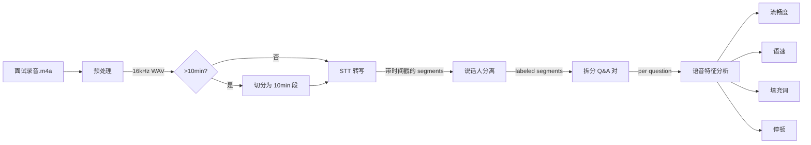

# STT 集成与语音分析

前面所有文章处理的都是文字稿。但面试诊断的差异化价值在于：**不只诊断“答了什么”，还诊断“怎么说的”**。

语气犹豫、停顿过长、填充词过多、语速失控——这些问题文字稿看不出来，只有从音频里才能提取。这一篇把音频处理管线从头搭起来：STT 转写 → 说话人分离 → 时间戳对齐 → 语音特征分析。

## 技术选型

| 组件 | 方案 | 说明 |
|------|------|------|
| STT 转写 | OpenAI Whisper API | 精度高，支持中文，返回带时间戳的逐句转写 |
| 备选 STT | FunASR（本地） | 离线运行，免费，适合隐私敏感场景 |
| 说话人分离 | pyannote-based / 启发式规则 | 区分面试官和候选人 |
| 音频预处理 | ffmpeg | 格式转换、降噪、分段 |

**为什么同时支持两个 STT 方案？**

- Whisper API：精度最高、开发最快，但需要联网 + 费用
- FunASR：完全离线、免费，但需要本地 Python 环境 + 精度略低

用户可以在配置中选择，Permission 层也会在调用 Whisper API 前确认（因为要上传音频到外部服务）。

## 模块结构

```text
src/tools/
├── transcribe.ts          # STT 转写 Tool
├── detect-speakers.ts     # 说话人分离 Tool
└── analyze-speech.ts      # 语音特征分析 Tool（前面已实现）

src/audio/
├── preprocessor.ts        # 音频预处理（ffmpeg）
├── whisper.ts             # Whisper API 适配器
├── funasr.ts              # FunASR 本地适配器
├── speaker-detect.ts      # 说话人分离逻辑
├── types.ts               # 音频相关类型
└── utils.ts               # 工具函数
```

## 类型定义

```typescript
// audio/types.ts

export interface TranscriptSegment {
  start: number;           // 开始时间（毫秒）
  end: number;             // 结束时间（毫秒）
  text: string;            // 转写文本
  confidence?: number;     // 置信度 0-1
  speaker?: string;        // 说话人标签
}

export interface TranscriptResult {
  fullText: string;                    // 完整转写文本
  segments: TranscriptSegment[];       // 带时间戳的逐句转写
  language: string;                    // 检测到的语言
  duration: number;                    // 总时长（毫秒）
}

export interface AudioMetadata {
  path: string;
  format: string;          // wav, mp3, m4a, ...
  sampleRate: number;
  channels: number;
  duration: number;        // 秒
  fileSize: number;        // bytes
}

export interface SpeakerSegment {
  speaker: 'interviewer' | 'candidate' | 'unknown';
  start: number;
  end: number;
  text: string;
}

export type STTProvider = 'whisper' | 'funasr';
```

## 音频预处理

面试录音格式五花八门（手机录的 m4a、电脑录的 wav、在线会议导出的 mp4）。统一转换为 Whisper 能处理的格式。

```typescript
// audio/preprocessor.ts

import { execSync } from 'child_process';
import { statSync } from 'fs';
import { AudioMetadata } from './types';

export class AudioPreprocessor {
  /**
   * 探测音频元信息
   */
  probe(filePath: string): AudioMetadata {
    const output = execSync(
      `ffprobe -v quiet -print_format json -show_format -show_streams "${filePath}"`,
      { encoding: 'utf-8' }
    );
    const info = JSON.parse(output);
    const audioStream = info.streams.find((s: any) => s.codec_type === 'audio');

    return {
      path: filePath,
      format: info.format.format_name,
      sampleRate: parseInt(audioStream?.sample_rate ?? '16000'),
      channels: audioStream?.channels ?? 1,
      duration: parseFloat(info.format.duration),
      fileSize: statSync(filePath).size,
    };
  }

  /**
   * 转换为 Whisper 友好格式（16kHz mono WAV）
   */
  normalize(inputPath: string, outputPath: string): string {
    execSync(
      `ffmpeg -y -i "${inputPath}" -ar 16000 -ac 1 -f wav "${outputPath}"`,
      { stdio: 'pipe' }
    );
    return outputPath;
  }

  /**
   * 按时间分段（长录音切割，Whisper 有 25MB 限制）
   */
  split(inputPath: string, outputDir: string, segmentSeconds = 600): string[] {
    const metadata = this.probe(inputPath);
    const totalSeconds = metadata.duration;

    if (totalSeconds <= segmentSeconds) {
      return [inputPath];
    }

    const segments: string[] = [];
    for (let start = 0; start < totalSeconds; start += segmentSeconds) {
      const outputPath = `${outputDir}/segment_${start}.wav`;
      execSync(
        `ffmpeg -y -i "${inputPath}" -ss ${start} -t ${segmentSeconds} -ar 16000 -ac 1 "${outputPath}"`,
        { stdio: 'pipe' }
      );
      segments.push(outputPath);
    }

    return segments;
  }

  /**
   * 简单降噪（可选，对低质量录音有帮助）
   */
  denoise(inputPath: string, outputPath: string): string {
    // 使用 ffmpeg 的 anlmdn 滤镜做轻量降噪
    execSync(
      `ffmpeg -y -i "${inputPath}" -af "anlmdn=s=7:p=0.002:r=0.002" "${outputPath}"`,
      { stdio: 'pipe' }
    );
    return outputPath;
  }
}
```

## Whisper API 适配器

```typescript
// audio/whisper.ts

import OpenAI from 'openai';
import { createReadStream } from 'fs';
import { TranscriptResult, TranscriptSegment } from './types';

export class WhisperAdapter {
  private client: OpenAI;

  constructor(apiKey: string) {
    this.client = new OpenAI({ apiKey });
  }

  async transcribe(filePath: string, language = 'zh'): Promise<TranscriptResult> {
    const response = await this.client.audio.transcriptions.create({
      file: createReadStream(filePath),
      model: 'whisper-1',
      language,
      response_format: 'verbose_json',
      timestamp_granularities: ['segment'],
    });

    const segments: TranscriptSegment[] = (response as any).segments?.map((seg: any) => ({
      start: Math.round(seg.start * 1000),
      end: Math.round(seg.end * 1000),
      text: seg.text.trim(),
      confidence: seg.avg_logprob ? Math.exp(seg.avg_logprob) : undefined,
    })) ?? [];

    return {
      fullText: response.text,
      segments,
      language: (response as any).language ?? language,
      duration: segments.length > 0 ? segments[segments.length - 1].end : 0,
    };
  }

  /**
   * 处理长音频（分段转写 + 合并）
   */
  async transcribeLong(
    segmentPaths: string[],
    language = 'zh',
    onProgress?: (done: number, total: number) => void,
  ): Promise<TranscriptResult> {
    const allSegments: TranscriptSegment[] = [];
    let fullText = '';
    let timeOffset = 0;

    for (let i = 0; i < segmentPaths.length; i++) {
      const result = await this.transcribe(segmentPaths[i], language);

      // 偏移时间戳
      const offsetSegments = result.segments.map(seg => ({
        ...seg,
        start: seg.start + timeOffset,
        end: seg.end + timeOffset,
      }));

      allSegments.push(...offsetSegments);
      fullText += result.fullText + '\n';
      timeOffset += result.duration;

      onProgress?.(i + 1, segmentPaths.length);
    }

    return {
      fullText: fullText.trim(),
      segments: allSegments,
      language,
      duration: timeOffset,
    };
  }
}
```

**成本估算：**

```text
Whisper API 定价: $0.006 / 分钟
一场 30 分钟面试: $0.18
一场 60 分钟面试: $0.36
```

## FunASR 本地适配器

FunASR 是阿里开源的语音识别模型，支持完全离线运行。通过子进程调用 Python 脚本。

```typescript
// audio/funasr.ts

import { execSync } from 'child_process';
import { readFileSync } from 'fs';
import { TranscriptResult, TranscriptSegment } from './types';

export class FunASRAdapter {
  private modelPath: string;
  private pythonBin: string;

  constructor(opts: { modelPath?: string; pythonBin?: string } = {}) {
    this.modelPath = opts.modelPath ?? '~/.cache/funasr/models';
    this.pythonBin = opts.pythonBin ?? 'python3';
  }

  async transcribe(filePath: string): Promise<TranscriptResult> {
    // 调用 Python 脚本执行 FunASR 推理
    const scriptPath = `${__dirname}/funasr_infer.py`;
    const outputPath = `/tmp/funasr_result_${Date.now()}.json`;

    execSync(
      `${this.pythonBin} "${scriptPath}" --input "${filePath}" --output "${outputPath}" --model-dir "${this.modelPath}"`,
      { timeout: 120000, stdio: 'pipe' }
    );

    const result = JSON.parse(readFileSync(outputPath, 'utf-8'));

    const segments: TranscriptSegment[] = result.sentences.map((s: any) => ({
      start: s.start,
      end: s.end,
      text: s.text,
      confidence: s.confidence,
    }));

    return {
      fullText: segments.map(s => s.text).join(''),
      segments,
      language: 'zh',
      duration: segments.length > 0 ? segments[segments.length - 1].end : 0,
    };
  }

  /**
   * 检查 FunASR 是否可用
   */
  isAvailable(): boolean {
    try {
      execSync(`${this.pythonBin} -c "import funasr"`, { stdio: 'pipe' });
      return true;
    } catch {
      return false;
    }
  }
}
```

配套的 Python 推理脚本：

```python
# audio/funasr_infer.py

import argparse
import json
from funasr import AutoModel

def main():
    parser = argparse.ArgumentParser()
    parser.add_argument('--input', required=True)
    parser.add_argument('--output', required=True)
    parser.add_argument('--model-dir', default='~/.cache/funasr/models')
    args = parser.parse_args()

    model = AutoModel(
        model="paraformer-zh",
        vad_model="fsmn-vad",
        punc_model="ct-punc",
        model_dir=args.model_dir,
    )

    result = model.generate(input=args.input, batch_size_s=300)

    # 转换为统一格式
    sentences = []
    for item in result:
        if 'sentence_info' in item:
            for sent in item['sentence_info']:
                sentences.append({
                    'start': sent['start'],
                    'end': sent['end'],
                    'text': sent['text'],
                    'confidence': sent.get('confidence', 0.9),
                })
        else:
            sentences.append({
                'start': 0,
                'end': 0,
                'text': item['text'],
                'confidence': 0.9,
            })

    with open(args.output, 'w', encoding='utf-8') as f:
        json.dump({'sentences': sentences}, f, ensure_ascii=False)

if __name__ == '__main__':
    main()
```

## STT 转写 Tool 实现

```typescript
// tools/transcribe.ts

import { Tool, ToolResult, ToolContext } from './types';
import { AudioPreprocessor } from '../audio/preprocessor';
import { WhisperAdapter } from '../audio/whisper';
import { FunASRAdapter } from '../audio/funasr';
import { TranscriptResult, STTProvider } from '../audio/types';

interface TranscribeInput {
  audioFilePath: string;
  language?: string;
  provider?: STTProvider;
  denoise?: boolean;
}

export const transcribeTool: Tool<TranscribeInput, TranscriptResult> = {
  name: 'transcribe_audio',
  description: '将面试录音转为带时间戳的文字稿。支持 Whisper API（在线）和 FunASR（离线）两种模式。',
  parameters: {
    type: 'object',
    properties: {
      audioFilePath: { type: 'string', description: '音频文件路径' },
      language: { type: 'string', description: '语言（默认 zh）', enum: ['zh', 'en'] },
      provider: { type: 'string', description: 'STT 引擎', enum: ['whisper', 'funasr'] },
      denoise: { type: 'boolean', description: '是否预降噪（默认 false）' },
    },
    required: ['audioFilePath'],
  },

  async execute(input, ctx): Promise<ToolResult<TranscriptResult>> {
    const { audioFilePath, language = 'zh', provider = 'whisper', denoise = false } = input;
    const preprocessor = new AudioPreprocessor();

    // 1. 探测音频信息
    let metadata;
    try {
      metadata = preprocessor.probe(audioFilePath);
    } catch {
      return { success: false, error: { code: 'input_error', message: `无法读取音频文件: ${audioFilePath}` } };
    }

    // 2. 预处理
    const normalizedPath = `/tmp/normalized_${Date.now()}.wav`;
    let processedPath = preprocessor.normalize(audioFilePath, normalizedPath);

    if (denoise) {
      const denoisedPath = `/tmp/denoised_${Date.now()}.wav`;
      processedPath = preprocessor.denoise(processedPath, denoisedPath);
    }

    // 3. 分段（如果超过 10 分钟）
    const segments = preprocessor.split(processedPath, '/tmp', 600);

    // 4. 转写
    let result: TranscriptResult;
    try {
      if (provider === 'whisper') {
        const whisper = new WhisperAdapter(process.env.OPENAI_API_KEY!);
        result = segments.length === 1
          ? await whisper.transcribe(segments[0], language)
          : await whisper.transcribeLong(segments, language);
      } else {
        const funasr = new FunASRAdapter();
        if (!funasr.isAvailable()) {
          return { success: false, error: { code: 'service_error', message: 'FunASR 未安装。请运行: pip install funasr' } };
        }
        result = await funasr.transcribe(processedPath);
      }
    } catch (err) {
      return { success: false, error: { code: 'service_error', message: `转写失败: ${err}` } };
    }

    return { success: true, data: result };
  },
};
```

## 说话人分离

面试录音至少有两个人说话：面试官和候选人。我们需要区分“谁在说什么”才能拆出 Q&A 对。

### 方案对比

| 方案 | 优点 | 缺点 |
|------|------|------|
| pyannote（神经网络） | 精度高 | 需要 GPU、Python 环境 |
| 基于时长启发式 | 无依赖、快速 | 精度低，不适合自由对话 |
| 基于内容的 LLM 分类 | 无额外模型 | 消耗 token、有延迟 |

**推荐：启发式 + LLM 辅助**（MVP 阶段不引入额外模型依赖）

```typescript
// audio/speaker-detect.ts

import { TranscriptSegment, SpeakerSegment } from './types';

/**
 * 启发式说话人分离
 * 逻辑：面试中通常面试官说话短（提问），候选人说话长（回答）
 */
export function detectSpeakersHeuristic(segments: TranscriptSegment[]): SpeakerSegment[] {
  // Step 1: 按停顿分组（>2s 的间隔认为是换人）
  const groups = groupByPause(segments, 2000);

  // Step 2: 计算每组的时长
  const durations = groups.map(g => ({
    segments: g,
    totalDuration: g.reduce((sum, s) => sum + (s.end - s.start), 0),
    text: g.map(s => s.text).join(''),
  }));

  // Step 3: 启发式分类
  // - 短发言 + 问号结尾 → 面试官
  // - 长发言 → 候选人
  const avgDuration = durations.reduce((s, d) => s + d.totalDuration, 0) / durations.length;

  return durations.map(d => {
    const isQuestion = d.text.includes('？') || d.text.includes('?') || d.text.endsWith('吗');
    const isShort = d.totalDuration < avgDuration * 0.5;

    const speaker = (isQuestion || isShort) ? 'interviewer' : 'candidate';

    return {
      speaker,
      start: d.segments[0].start,
      end: d.segments[d.segments.length - 1].end,
      text: d.text,
    } as SpeakerSegment;
  });
}

/**
 * LLM 辅助说话人分离（精度更高）
 */
export async function detectSpeakersWithLLM(
  segments: TranscriptSegment[],
  queryEngine: QueryEngine,
): Promise<SpeakerSegment[]> {
  // 先用启发式做初步分类
  const heuristic = detectSpeakersHeuristic(segments);

  // 对不确定的段落用 LLM 辅助判断
  const uncertain = heuristic.filter(s => s.speaker === 'unknown');
  if (uncertain.length === 0) return heuristic;

  const response = await queryEngine.query({
    task: 'split_qa',
    messages: [{
      role: 'user',
      content: `以下是面试录音的转写片段，请判断每段是面试官还是候选人在说话。输出JSON数组。

${uncertain.map((s, i) => `[${i}] "${s.text.slice(0, 100)}"`).join('\n')}`,
    }],
    systemPrompt: '你是面试录音的说话人分类器。面试官通常提问、追问，候选人通常回答、解释。只输出JSON。',
  });

  try {
    const labels = JSON.parse(response.content ?? '[]');
    for (let i = 0; i < uncertain.length && i < labels.length; i++) {
      uncertain[i].speaker = labels[i].speaker ?? 'candidate';
    }
  } catch {
    // LLM 输出解析失败，保持启发式结果
  }

  return heuristic;
}

function groupByPause(segments: TranscriptSegment[], pauseThreshold: number): TranscriptSegment[][] {
  const groups: TranscriptSegment[][] = [];
  let current: TranscriptSegment[] = [];

  for (let i = 0; i < segments.length; i++) {
    current.push(segments[i]);

    if (i < segments.length - 1) {
      const gap = segments[i + 1].start - segments[i].end;
      if (gap > pauseThreshold) {
        groups.push(current);
        current = [];
      }
    }
  }

  if (current.length > 0) groups.push(current);
  return groups;
}
```

## 说话人分离 Tool

```typescript
// tools/detect-speakers.ts

import { Tool, ToolResult } from './types';
import { SpeakerSegment, TranscriptSegment } from '../audio/types';
import { detectSpeakersHeuristic, detectSpeakersWithLLM } from '../audio/speaker-detect';

interface DetectSpeakersInput {
  segments: TranscriptSegment[];
  method?: 'heuristic' | 'llm_assisted';
}

interface DetectSpeakersOutput {
  speakers: SpeakerSegment[];
  labeledTranscript: string;
  interviewerSegments: number;
  candidateSegments: number;
}

export const detectSpeakersTool: Tool<DetectSpeakersInput, DetectSpeakersOutput> = {
  name: 'detect_speakers',
  description: '对转写结果进行说话人分离，区分面试官和候选人。',
  parameters: {
    type: 'object',
    properties: {
      segments: { type: 'array', description: '带时间戳的转写分段' },
      method: { type: 'string', enum: ['heuristic', 'llm_assisted'], description: '分离方法' },
    },
    required: ['segments'],
  },

  async execute(input, ctx): Promise<ToolResult<DetectSpeakersOutput>> {
    const { segments, method = 'heuristic' } = input;

    let speakers: SpeakerSegment[];
    if (method === 'llm_assisted' && ctx.queryEngine) {
      speakers = await detectSpeakersWithLLM(segments, ctx.queryEngine);
    } else {
      speakers = detectSpeakersHeuristic(segments);
    }

    // 生成带标签的完整文本
    const labeledTranscript = speakers.map(s => {
      const label = s.speaker === 'interviewer' ? '面试官' : '候选人';
      return `${label}：${s.text}`;
    }).join('\n\n');

    return {
      success: true,
      data: {
        speakers,
        labeledTranscript,
        interviewerSegments: speakers.filter(s => s.speaker === 'interviewer').length,
        candidateSegments: speakers.filter(s => s.speaker === 'candidate').length,
      },
    };
  },
};
```

## 语音特征分析的完整管线

把前面已实现的 `analyze_speech` Tool 和本篇的 STT + 说话人分离串联起来：



## 语音诊断报告输出示例

```text
━━━━━━━━━━━━━━━━━━━━━━━━━━━━━━━━━━
  语音诊断 · 第 3 题
  "Agent 的记忆系统怎么设计"
━━━━━━━━━━━━━━━━━━━━━━━━━━━━━━━━━━

语音总分: 65/100

┌─────────┬────────┬────────────────────────────────┐
│ 维度     │ 得分   │ 详情                            │
├─────────┼────────┼────────────────────────────────┤
│ 流畅度   │ 58     │ 语速 180 字/分（偏慢）           │
│ 停顿     │ 70     │ 2 处长停顿（>3s）               │
│ 自信度   │ 55     │ 填充词 12 次（嗯×5 那个×4 就是×3）│
│ 节奏感   │ 78     │ 整体节奏尚可，后半段加速          │
└─────────┴────────┴────────────────────────────────┘

填充词热点:
  00:32 "嗯...那个..."
  00:45 "就是...就是那个..."
  01:12 "嗯..."

长停顿:
  00:28-00:32 (4.1s) ← 思考时间过长
  01:05-01:08 (3.2s)

建议:
  ① 回答前先用 1-2 秒组织框架，减少中途停顿
  ② "嗯/那个/就是"用沉默替代——短暂沉默比填充词更自信
  ③ 第一句就给结论，后面展开，避免"嗯...我觉得..."开头
```

## 配置项

```typescript
// 在 SessionConfig 中新增音频相关配置

interface AudioConfig {
  sttProvider: 'whisper' | 'funasr';       // STT 引擎选择
  language: 'zh' | 'en';                    // 语言
  denoise: boolean;                         // 是否降噪
  speakerDetection: 'heuristic' | 'llm_assisted';  // 说话人分离方法
  fillerWords: string[];                    // 填充词列表（可自定义）
  longPauseThreshold: number;               // 长停顿阈值（ms）
  idealWpm: { min: number; max: number };   // 理想语速范围
}

const DEFAULT_AUDIO_CONFIG: AudioConfig = {
  sttProvider: 'whisper',
  language: 'zh',
  denoise: false,
  speakerDetection: 'heuristic',
  fillerWords: ['嗯', '那个', '就是', '然后', '这个', '额', '对对对'],
  longPauseThreshold: 2000,
  idealWpm: { min: 200, max: 280 },
};
```

## 隐私保护

音频是最敏感的数据类型。设计原则：

```text
1. 录音不持久化
   - STT 转写完成后，临时 WAV 文件立即删除
   - 只保留文字稿（已是最小信息量）

2. Permission 层把关
   - 调用 Whisper API 前需要用户确认（音频将上传到 OpenAI）
   - FunASR 模式完全离线，无需确认

3. 文字稿可选脱敏
   - input-sanitize hook 可过滤人名、公司名
   - 用户可配置是否脱敏

4. 导出控制
   - 语音分析结果可导出
   - 但原始时间戳数据默认不包含在导出报告中
```

## 小结

- 双 STT 引擎：Whisper API（精度高/联网）+ FunASR（离线/免费），用户可配置
- 音频预处理：ffmpeg 做格式标准化 + 长音频分段 + 可选降噪
- 说话人分离：启发式（短发言+问号=面试官）+ LLM 辅助，MVP 阶段不引入额外模型
- 语音特征分析是纯算法（不需要 LLM）：从时间戳计算语速/停顿/填充词/节奏
- 隐私保护：录音处理后立即删除，Permission 层在联网 STT 前拦截确认
- 成本：30 分钟面试 Whisper 转写 $0.18，FunASR 免费

下一篇建议继续看：

- [11-deploy-demo：部署与演示](../11-deploy-demo/index.html)
