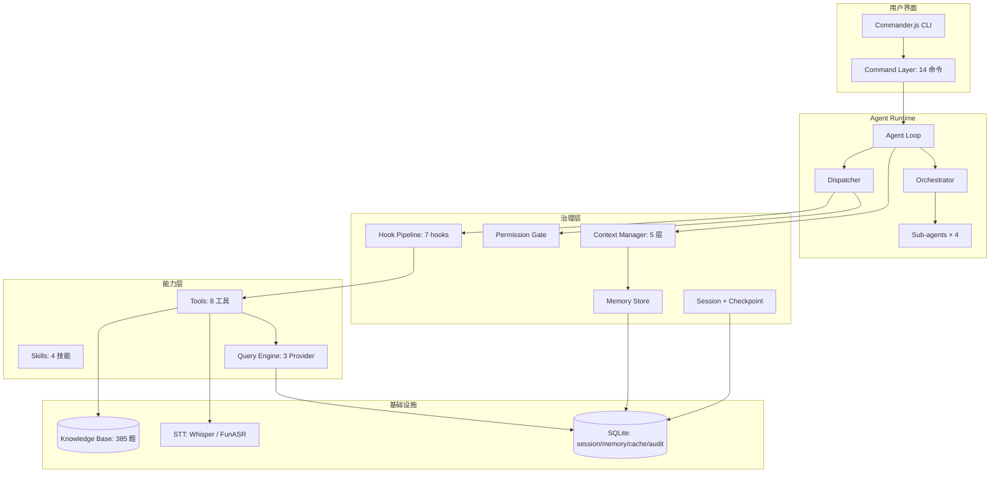

# 部署与演示

前面 10 篇把系统的每一层都设计清楚了。这一篇把它跑起来——从 `npm install` 到完整的诊断流程。

## CLI 入口

```typescript
// src/index.ts

import { Command as Cmd } from 'commander';
import { createApp } from './app';
import chalk from 'chalk';

const program = new Cmd();

program
  .name('interview-diag')
  .description('面试诊断 Agent —— 诊断你的面试回答质量')
  .version('0.1.0');

program
  .command('start')
  .description('启动交互式诊断会话')
  .option('-m, --model <model>', '主力模型', 'claude-sonnet-4-20250514')
  .option('--stt <provider>', 'STT 引擎 (whisper|funasr)', 'whisper')
  .option('--offline', '离线模式（FunASR + 不联网）')
  .action(async (opts) => {
    const app = await createApp(opts);
    await app.repl();
  });

program
  .command('diagnose <file>')
  .description('直接诊断一个文件（非交互式）')
  .option('-f, --format <format>', '输入格式 (transcript|audio)', 'transcript')
  .option('-o, --output <path>', '报告输出路径')
  .action(async (file, opts) => {
    const app = await createApp(opts);
    await app.diagnoseFile(file, opts);
  });

program
  .command('build-kb')
  .description('构建知识库（从 learn-agent-interview 导入）')
  .option('-d, --dir <path>', '面试题目录', '../learn-agent-interview')
  .option('--db <path>', '数据库路径', './data/knowledge.db')
  .action(async (opts) => {
    const { buildKnowledgeBase } = await import('./knowledge/cli');
    await buildKnowledgeBase({
      interviewDir: opts.dir,
      dbPath: opts.db,
      openaiApiKey: process.env.OPENAI_API_KEY!,
    });
  });

program
  .command('stats')
  .description('查看知识库和历史诊断统计')
  .action(async () => {
    const app = await createApp({});
    app.printStats();
  });

program.parse();
```

## App 主类：组装所有模块

```typescript
// src/app.ts

import { QueryEngine } from './query-engine/engine';
import { createToolRegistry } from './tools';
import { createCommandParser } from './command';
import { SkillRegistry } from './skills/registry';
import { ContextManager } from './context/manager';
import { MemoryStore } from './memory/store';
import { PermissionGate } from './permission/gate';
import { SessionManager } from './session/manager';
import { CheckpointManager } from './session/checkpoint';
import { HookPipeline } from './hooks/pipeline';
import { Orchestrator } from './agent/orchestrator';
import { SubAgentRuntime } from './agent/sub-agent';
import { KnowledgeStore } from './knowledge/store';
import { KnowledgeSearch } from './knowledge/search';
import { handleInput } from './agent/loop';
import * as readline from 'readline';
import chalk from 'chalk';

export async function createApp(opts: any): Promise<App> {
  // 1. 基础设施
  const queryEngine = new QueryEngine({
    anthropicApiKey: process.env.ANTHROPIC_API_KEY!,
    openaiApiKey: process.env.OPENAI_API_KEY!,
    deepseekApiKey: process.env.DEEPSEEK_API_KEY!,
    cachePath: './data/cache.db',
    budget: { maxTotalCost: 2.0 },
  });

  // 2. 知识库
  const knowledgeStore = new KnowledgeStore('./data/knowledge.db');
  const knowledgeSearch = new KnowledgeSearch(knowledgeStore, process.env.OPENAI_API_KEY!);

  // 3. Tools & Skills
  const toolRegistry = createToolRegistry();
  const skillRegistry = new SkillRegistry();

  // 4. 治理层
  const permissionGate = new PermissionGate();
  const hooks = createDefaultHookPipeline(permissionGate, queryEngine);

  // 5. 持久化
  const memoryStore = new MemoryStore('./data/memory.db');
  const sessionManager = new SessionManager('./data/sessions.db');
  const checkpoints = new CheckpointManager(sessionManager.db, 5);

  // 6. Sub-agent
  const subAgentRuntime = new SubAgentRuntime(queryEngine, toolRegistry);
  const orchestrator = new Orchestrator(subAgentRuntime, { maxConcurrency: 3 });

  // 7. Command
  const commandParser = createCommandParser();

  return new App({
    queryEngine, knowledgeSearch, toolRegistry, skillRegistry,
    permissionGate, hooks, memoryStore, sessionManager, checkpoints,
    orchestrator, commandParser, opts,
  });
}

class App {
  private deps: AppDependencies;
  private session: Session | null = null;

  constructor(deps: AppDependencies) {
    this.deps = deps;
  }

  async repl(): Promise<void> {
    this.printBanner();

    const rl = readline.createInterface({
      input: process.stdin,
      output: process.stdout,
      prompt: chalk.cyan('> '),
    });

    rl.prompt();

    rl.on('line', async (line) => {
      const input = line.trim();
      if (!input) { rl.prompt(); return; }
      if (input === 'exit' || input === 'quit') { rl.close(); return; }

      try {
        if (!this.session) {
          this.session = this.deps.sessionManager.create(
            { type: 'transcript', content: '' },
            { model: this.deps.opts.model }
          );
        }
        await handleInput(input, this.session, this.deps);
      } catch (err) {
        console.error(chalk.red(`Error: ${err}`));
      }

      rl.prompt();
    });

    rl.on('close', () => {
      console.log(chalk.dim('\n再见！'));
      process.exit(0);
    });
  }

  async diagnoseFile(filePath: string, opts: any): Promise<void> {
    const session = this.deps.sessionManager.create(
      { type: opts.format, content: filePath },
      { model: this.deps.opts.model }
    );

    const skill = opts.format === 'audio'
      ? this.deps.skillRegistry.resolve('diagnose-audio')
      : this.deps.skillRegistry.resolve('diagnose-transcript');

    const content = await readFile(filePath, 'utf-8');
    const result = await skill.execute(
      { rawInput: content, parsedArgs: { path: filePath } },
      session.makeSkillContext(),
    );

    if (result.report) console.log(result.report);
    if (opts.output) {
      await writeFile(opts.output, result.report ?? JSON.stringify(result.result, null, 2));
      console.log(chalk.green(`\n报告已保存: ${opts.output}`));
    }
  }

  printStats(): void {
    const kbStats = this.deps.knowledgeSearch.store.getStats();
    const memStats = this.deps.memoryStore.getStats();
    const sessions = this.deps.sessionManager.list({ limit: 100 });

    console.log(chalk.bold('\n📊 系统统计\n'));
    console.log(`知识库: ${kbStats.totalEntries} 题 / ${kbStats.dimensions} 维度 / ${kbStats.withEmbedding} 有向量`);
    console.log(`记忆: ${memStats.total} 条 (${Object.entries(memStats.byType).map(([k, v]) => `${k}:${v}`).join(', ')})`);
    console.log(`会话: ${sessions.length} 次 (完成:${sessions.filter(s => s.status === 'completed').length} / 暂停:${sessions.filter(s => s.status === 'paused').length})`);
  }

  private printBanner(): void {
    console.log(chalk.bold(`
┌─────────────────────────────────────────────┐
│  面试诊断 Agent v0.1.0                       │
│  上传面试稿或录音，获得结构化诊断报告          │
│                                             │
│  /help   查看命令    /mock   模拟面试         │
│  /status 查看状态    exit    退出             │
└─────────────────────────────────────────────┘
`));
  }
}
```

## 环境配置

```bash
# .env
ANTHROPIC_API_KEY=sk-ant-...
OPENAI_API_KEY=sk-...
DEEPSEEK_API_KEY=sk-...
```

```json
// package.json
{
  "name": "interview-diagnosis-agent",
  "version": "0.1.0",
  "type": "module",
  "scripts": {
    "start": "tsx src/index.ts start",
    "diagnose": "tsx src/index.ts diagnose",
    "build-kb": "tsx src/index.ts build-kb",
    "build": "tsc",
    "test": "vitest",
    "test:e2e": "vitest run tests/e2e"
  },
  "dependencies": {
    "@anthropic-ai/sdk": "^0.52.0",
    "openai": "^4.70.0",
    "better-sqlite3": "^11.0.0",
    "commander": "^12.0.0",
    "chalk": "^5.3.0",
    "ora": "^8.0.0"
  },
  "devDependencies": {
    "typescript": "^5.5.0",
    "vitest": "^2.0.0",
    "@types/better-sqlite3": "^7.6.0",
    "tsx": "^4.0.0"
  }
}
```

## 首次运行流程

```bash
# 1. 安装依赖
pnpm install

# 2. 配置环境变量
cp .env.example .env
# 编辑 .env 填入 API Key

# 3. 构建知识库
pnpm build-kb --dir ../learn-agent-interview

# 4. 启动
pnpm start
```

## Demo 演示：完整诊断流程

### 场景 1：文字稿诊断

```text
> 我要诊断一份面试稿

好的，请粘贴面试内容，或使用 /upload <文件路径> 上传。

> /upload ./mock-interview.txt

[MEDIUM] 权限确认请求
原因: 读取用户本地文件
工具: read_file
  path: ./mock-interview.txt
允许执行? (y/n): y

✓ 已读取文件 (3.2KB)
✓ 检测到格式: labeled（面试官:/候选人:）
✓ 拆分出 8 道 Q&A

开始诊断...

● Q1: "ReAct 和 Plan-and-Execute 怎么选"
  ├─ 知识库匹配: architecture-design:1 (相似度 0.94)
  ├─ 内容诊断: 62/100
  │   completeness: 55 | depth: 68 | accuracy: 72 | practicality: 52
  │   关键遗漏: 没提到"检查点"机制，没区分不确定性
  └─ 表达诊断: 71/100
      structure: 65 | conciseness: 78 | keywords: 72 | closure: 68
      问题: 没有先给结论再展开，开头犹豫

● Q2: "Tool Calling 失败怎么兜底"
  ├─ 知识库匹配: fault-tolerance:5 (相似度 0.91)
  ├─ 内容诊断: 78/100
  └─ 表达诊断: 82/100

... (Q3-Q7) ...

● Q8: "多 Agent 之间怎么协调"
  ├─ 知识库匹配: multi-agent-collab:3 (相似度 0.87)
  ├─ 内容诊断: 45/100
  │   关键遗漏: 没提到上下文隔离、没区分编排模式
  └─ 表达诊断: 58/100
      问题: 回答没有结构，流水账式描述

━━━━━━━━━━━━━━━━━━━━━━━━━━━━━━━━━━
  诊断完成 · 8/8 题
━━━━━━━━━━━━━━━━━━━━━━━━━━━━━━━━━━

总分: 67/100
内容平均: 64  表达平均: 71

强项:
  • 容错和兜底策略理解到位
  • 技术术语使用准确

弱项:
  • 架构选型缺乏场景化判断
  • 多 Agent 部分回答太浅
  • 表达缺乏框架感，开头常犹豫

改进建议:
  [立即可改]
    ① 每题先给结论（1句话），再展开
    ② "我认为..."开头改为直接陈述
  [短期提升]
    ③ 架构选型题练习"场景→约束→选择→代价"四步法
    ④ 多 Agent 重点补充"上下文隔离"和"编排策略"
  [长期积累]
    ⑤ 补充实际项目中的 Agent 工程经验

资源使用:
  Requests: 24 | Tokens: 38,200in + 12,400out | Cost: $0.31

> /export md ./my-report.md
报告已导出: ./my-report.md (md)
```

### 场景 2：录音诊断

```text
> /upload ./interview-recording.m4a

[MEDIUM] 权限确认请求
原因: 将上传音频到外部 STT 服务处理
工具: transcribe_audio
允许执行? (y/n): y

⠋ 预处理音频...
✓ 格式: m4a → 16kHz WAV (28.3MB)
⠋ STT 转写中... (预计 30s)
✓ 转写完成: 32分钟 / 5,420 字
✓ 说话人分离: 面试官 12 段 / 候选人 12 段
✓ 拆分出 12 道 Q&A

开始诊断（含语音分析）...

● Q1: "Agent 的记忆系统怎么设计"
  ├─ 内容: 58/100
  ├─ 表达: 62/100
  └─ 语音: 55/100
      语速 180字/分（偏慢） | 填充词 8 次 | 长停顿 2 处

... (Q2-Q12) ...

总分: 61/100 (内容 60 / 表达 65 / 语音 58)

语音整体建议:
  • 平均填充词 6.5 次/题——目标 < 3 次
  • 3 处 >4s 的长停顿出现在架构题——建议提前准备框架
  • 语速后半段明显加快——可能是紧张导致

> /detail 1

[第 1 题详细诊断]
问题: Agent 的记忆系统怎么设计

你的回答:
  "嗯...那个...记忆系统的话，我觉得就是分成短期和长期的。
   短期就是当前对话的内容，长期就是...嗯...比如用户的偏好什么的。
   然后可以用向量数据库存，检索的时候用 embedding 匹配..."

高手答（知识库参考）:
  "记忆分三层：工作记忆（当前任务状态）、情景记忆（历史交互摘要）、
   语义记忆（长期事实和偏好）。关键设计点不在存储，而在两个动作：
   什么时候写入、什么时候召回。写入要克制，否则变成噪声仓库..."

差距:
  ① 你只说了"短期/长期"二分法，缺少"工作记忆"这个关键概念
  ② 没提"写入克制"原则——面试官最想听的工程 insight
  ③ 表达上以"嗯...那个..."开头，缺乏自信感
```

### 场景 3：模拟面试

```text
> /mock memory --count 3

模拟面试开始！共 3 道题，维度：记忆与上下文

━━━━━━━━━━━━━━━━━━━━━━━━━━━━━━━━━━
  第 1 题
  Agent 中的"长短期记忆"分别存什么、怎么协调？
━━━━━━━━━━━━━━━━━━━━━━━━━━━━━━━━━━

请回答（输入答案，/skip 跳过）：

> 短期记忆存当前对话上下文，长期记忆存用户偏好和历史事实。协调的话，每次对话开始时从长期记忆里检索相关内容注入短期记忆。

[即时反馈]
得分: 55/100

问题:
  • 缺少"工作记忆"概念（当前任务的中间状态）
  • "协调"只说了检索注入，没说写入时机和淘汰策略
  • 表述太简单，没有递进分析

升级建议:
  分三层说：工作记忆（任务态）→ 情景记忆（交互摘要）→ 语义记忆（事实）
  重点讲"什么时候写入"和"什么时候召回"两个动作

━━━━━━━━━━━━━━━━━━━━━━━━━━━━━━━━━━
  第 2 题
  ...
```

## 部署方案

### 方案 A：本地 CLI（推荐开发阶段）

```text
优点: 隐私安全、开发调试方便、无需服务器
缺点: 需要 Node.js 环境、API Key 在本地

适合: 个人使用、开发迭代
```

```bash
# 全局安装
npm install -g interview-diagnosis-agent
interview-diag start
```

### 方案 B：Docker 容器

```dockerfile
FROM node:20-slim

RUN apt-get update && apt-get install -y ffmpeg python3 pip
RUN pip install funasr modelscope

WORKDIR /app
COPY package.json pnpm-lock.yaml ./
RUN corepack enable && pnpm install --frozen-lockfile
COPY . .
RUN pnpm build

VOLUME ["/app/data"]
ENV NODE_ENV=production

ENTRYPOINT ["node", "dist/index.js"]
CMD ["start"]
```

```bash
docker build -t interview-diag .
docker run -it \
  -v ./data:/app/data \
  --env-file .env \
  interview-diag
```

### 方案 C：Web 服务（未来扩展）

```text
前端: Next.js + 录音组件 + 实时流式输出
后端: 本项目 CLI 改造为 HTTP Server（Express/Fastify）
部署: Vercel (前端) + Railway/Fly.io (后端)

接口设计:
  POST /api/diagnose        上传文字稿 → SSE 流式诊断
  POST /api/upload-audio    上传录音 → 转写 + 诊断
  GET  /api/sessions        会话列表
  GET  /api/report/:id      获取报告
  POST /api/mock/start      开始模拟面试
  POST /api/mock/answer     提交回答
```

这是 Phase 5 的扩展方向，当前 MVP 聚焦 CLI。

## 测试策略

```text
单元测试 (vitest):
├── query-engine/   stream 解析、retry 逻辑、cache 命中
├── tools/          每个 tool 的输入验证和输出格式
├── context/        压缩逻辑、token 估算
├── permission/     规则匹配、缓存
├── session/        状态机转换、checkpoint
├── hooks/          管线执行顺序、block/modify
└── knowledge/      FTS 检索、embedding 相似度

集成测试:
├── 知识库导入 → 检索 → 命中
├── Agent Loop: 输入 → tool_use → result → 输出
├── Session: create → process → pause → resume
└── 完整诊断流程 (mock LLM 响应)

E2E 测试（需要真实 API Key）:
├── 文字稿诊断全流程
├── 录音诊断全流程
└── 模拟面试全流程
```

## 项目总结：从 Harness 工程到完整产品



**10 层 Harness 对照：**

| 层 | 本项目实现 | 文档 |
|----|-----------|------|
| 1. Tools | 8 个原子工具，标准 schema | 04 |
| 2. Skills | 4 个任务级流程 | 04 |
| 3. Query Engine | 3 Provider + stream + retry + cache + 路由 | 03 |
| 4. Context | 5 层分区 + 3 级压缩 | 06 |
| 5. Memory | SQLite + 画像 + 弱点追踪 + 触发器 | 06 |
| 6. Permission | 风险分级 + human-in-the-loop + 审计 | 07 |
| 7. Sessions | 状态机 + checkpoint + rewind | 07 |
| 8. Command | 14 个确定性命令 | 08 |
| 9. Hook | 7 个 pre/post hooks 管线 | 08 |
| 10. Sub-agent | 4 个角色 + 并发池 + 上下文隔离 | 09 |

## 小结

- CLI 是 MVP 的最佳交互形式：快速、确定、无前端依赖
- App 主类把 10 个模块组装起来，REPL 循环驱动整个系统
- 首次运行三步：install → build-kb → start
- 三种部署方案：本地 CLI（开发）→ Docker（分享）→ Web 服务（产品化）
- 测试分三层：单元 → 集成 → E2E，覆盖所有模块
- 完整实现了 Harness 10 层架构——不是 Demo，是可恢复、可审计、可扩展的工程系统

---

**这是 Final Project 系列的最后一篇。**

从 PRD 到架构、从 Query Engine 到 Sub-agent、从知识库到语音分析——11 篇文档完整记录了如何从 0 搭建一个生产级面试诊断 Agent。

核心教训只有一个：**Agent 的主战场不在模型，在 Harness。**
