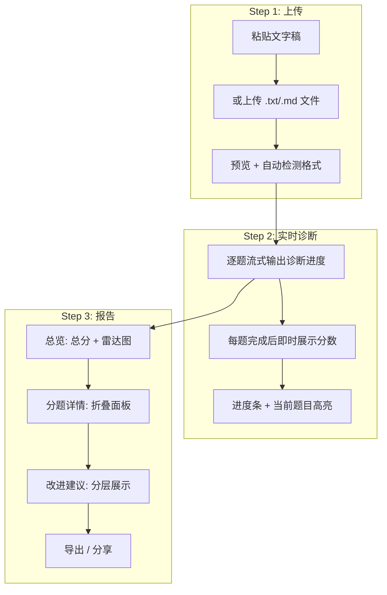
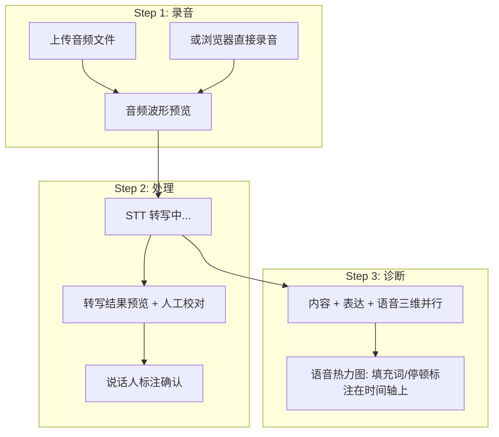
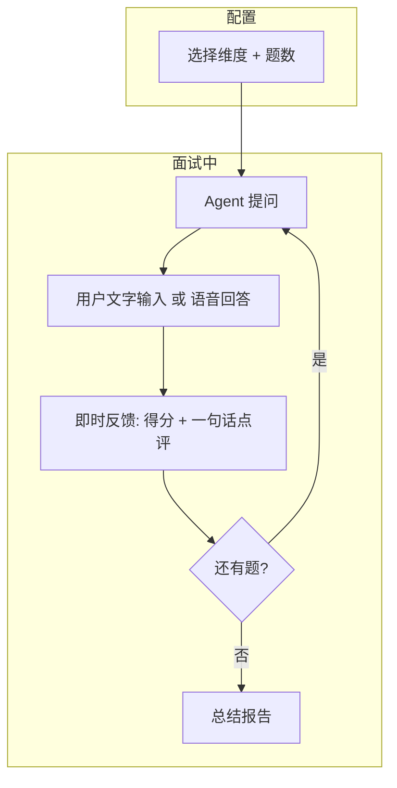
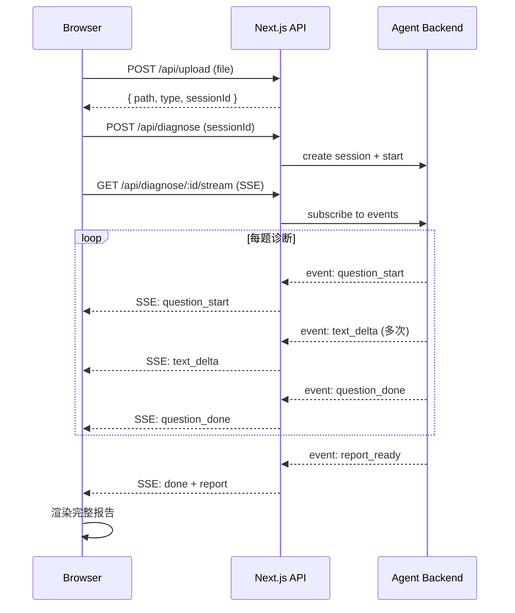

# Web UI 交互设计

CLI 适合开发调试，但面试诊断的用户不是开发者——他们是准备面试的候选人。

TUI 的问题很明显：

- **显示局限**：诊断报告有表格、分数、对比视图，终端排版做不到直观
- **交互局限**：上传文件、录音、模拟面试的即时反馈，CLI 体验很差
- **门槛高**：装 Node.js、配环境变量、敲命令——90% 的目标用户到不了这一步

所以 Web UI 不是"锦上添花"，是让产品真正可用的必要条件。

## 技术选型

| 层 | 技术 | 理由 |
|----|------|------|
| 框架 | Next.js 14 (App Router) | RSC + API Routes + 部署一体化 |
| UI 库 | shadcn/ui + Tailwind CSS | 组件质量高、可定制、不臃肿 |
| 状态管理 | Zustand | 轻量、TypeScript 友好 |
| 实时通信 | Server-Sent Events (SSE) | 单向流式输出，比 WebSocket 简单 |
| 录音 | MediaRecorder API | 浏览器原生，无依赖 |
| 图表 | Recharts | 分数趋势、雷达图 |
| 部署 | Vercel (前端) + Railway (后端) | 各自最佳实践 |

**为什么不用 WebSocket？**

诊断是单向流——服务端持续输出诊断进度和结果，客户端只在开始时发一次请求。SSE 恰好满足，且 Next.js API Routes 原生支持。

## 页面结构

```text
/                          首页（上传入口 + 功能介绍）
/diagnose                  诊断主页面（上传 → 实时诊断 → 报告）
/diagnose/[sessionId]      历史诊断报告查看
/mock                      模拟面试页面
/history                   诊断历史列表
/settings                  配置页面（模型、STT、偏好）
```

## 核心交互流程

### Flow 1：文字稿诊断



### Flow 2：录音诊断



### Flow 3：模拟面试



## 页面设计

### 首页 `/`

```text
┌─────────────────────────────────────────────────────┐
│  [Logo] 面试诊断 Agent                    [历史] [设置] │
├─────────────────────────────────────────────────────┤
│                                                     │
│     上传面试稿或录音，获得 AI 结构化诊断              │
│                                                     │
│  ┌──────────────────┐  ┌──────────────────┐         │
│  │   📝 文字稿诊断   │  │   🎤 录音诊断    │         │
│  │                  │  │                  │         │
│  │ 粘贴或上传面试稿  │  │ 上传或现场录音   │         │
│  │ 诊断内容 + 表达   │  │ 诊断内容+表达+语音│         │
│  └──────────────────┘  └──────────────────┘         │
│                                                     │
│  ┌──────────────────┐  ┌──────────────────┐         │
│  │   🎯 模拟面试    │  │   📊 诊断历史    │         │
│  │                  │  │                  │         │
│  │ Agent 提问+即时反馈│  │ 查看趋势和进步   │         │
│  └──────────────────┘  └──────────────────┘         │
│                                                     │
│  ─────────── 最近诊断 ───────────                    │
│  ○ 2026-06-12  8题  67分  "字节 Agent 岗"           │
│  ○ 2026-06-10  12题 61分  "蚂蚁 AI应用"             │
│                                                     │
└─────────────────────────────────────────────────────┘
```

### 诊断主页面 `/diagnose`

分为三个阶段，渐进式展开：

#### 阶段 1：输入

```text
┌─────────────────────────────────────────────────────┐
│  ← 返回                  面试稿诊断                   │
├─────────────────────────────────────────────────────┤
│                                                     │
│  ┌─────────────────────────────────────────────┐    │
│  │                                             │    │
│  │  在此粘贴面试内容...                          │    │
│  │                                             │    │
│  │  支持格式:                                   │    │
│  │  · 面试官：xxx / 候选人：xxx                  │    │
│  │  · Q：xxx / A：xxx                          │    │
│  │  · 纯对话文本（AI 自动识别）                  │    │
│  │                                             │    │
│  │                                     [上传文件]│    │
│  └─────────────────────────────────────────────┘    │
│                                                     │
│  检测结果: ✓ labeled 格式 · 约 8 道题               │
│                                                     │
│              [开始诊断]                              │
│                                                     │
└─────────────────────────────────────────────────────┘
```

#### 阶段 2：实时诊断（SSE 流式更新）

```text
┌─────────────────────────────────────────────────────┐
│  诊断进行中                         3/8 题 ████░░░░ 37% │
├─────────────────────────────────────────────────────┤
│                                                     │
│  ✓ Q1: ReAct vs Plan-and-Execute        62分 ──────│
│  ✓ Q2: Tool Calling 失败兜底             78分 ──────│
│  ● Q3: Agent 记忆系统设计              诊断中... ─ │
│  ○ Q4: 多 Agent 协调                     待处理     │
│  ○ Q5: ...                              待处理     │
│                                                     │
│  ─────────── Q3 实时输出 ───────────                 │
│                                                     │
│  📎 知识库匹配: memory-context:5 (相似度 0.92)      │
│  ⠋ 正在对比参考答案...                              │
│                                                     │
└─────────────────────────────────────────────────────┘
```

#### 阶段 3：报告

```text
┌─────────────────────────────────────────────────────┐
│  诊断报告                   2026-06-13    [导出] [分享] │
├─────────────────────────────────────────────────────┤
│                                                     │
│  总分 67/100          [雷达图]                        │
│  内容 64 ████████░░   完整性 ┐                       │
│  表达 71 █████████░        │ 深度                   │
│  语音 --                实践性 ┘ 准确性               │
│                                                     │
│  ─────────── 关键发现 ───────────                    │
│  🔴 架构选型缺乏场景化判断                            │
│  🔴 多 Agent 回答过于表面                             │
│  🟢 容错策略理解到位                                  │
│                                                     │
│  ─────────── 分题详情 ───────────                    │
│  ▸ Q1: ReAct vs Plan...         62分  [展开]        │
│  ▸ Q2: Tool Calling 兜底         78分  [展开]        │
│  ▾ Q3: 记忆系统设计              45分               │
│  │                                                  │
│  │ 你的回答:                                        │
│  │ "短期记忆存当前对话，长期存偏好..."                │
│  │                                                  │
│  │ 高手答:                                          │
│  │ "分三层：工作记忆、情景记忆、语义记忆..."          │
│  │                                                  │
│  │ 关键差距:                                        │
│  │ · 缺少"工作记忆"概念                             │
│  │ · 没提写入克制原则                                │
│  │                                                  │
│  ─────────── 改进路径 ───────────                    │
│  立即可改:                                          │
│    ① 先结论后展开                                    │
│    ② 去掉"我觉得"开头                               │
│  短期提升:                                          │
│    ③ 练习"场景→约束→选择→代价"框架                   │
│  长期积累:                                          │
│    ④ 补充实际 Agent 工程项目经验                     │
│                                                     │
└─────────────────────────────────────────────────────┘
```

### 录音诊断 `/diagnose?mode=audio`

独特组件：

```text
┌─────────────────────────────────────────────────────┐
│  录音诊断                                            │
├─────────────────────────────────────────────────────┤
│                                                     │
│  ┌──── 音频波形 ────────────────────────────────┐   │
│  │ ▁▂▃▅▇█▇▅▃▂▁▁▂▃▅▇▇▅▃▂▁▁▁▂▃▅▇█▇▅▃▂▁        │   │
│  │ 00:00          15:00          30:00           │   │
│  └──────────────────────────────────────────────┘   │
│                                                     │
│  STT: ✓ 完成 (32分钟 / 5420字)                      │
│  说话人: 面试官 12段 / 候选人 12段                    │
│                                                     │
│  ─── 转写预览（可编辑校对）───                        │
│  面试官：请介绍一下 Agent 的记忆系统怎么设计          │
│  候选人：嗯...那个...记忆系统的话，我觉得就是...      │
│  [确认无误，开始诊断]                                │
│                                                     │
└─────────────────────────────────────────────────────┘
```

诊断报告中的语音维度展示：

```text
┌─────────── 语音分析 · Q3 ───────────┐
│                                      │
│  ┌── 时间轴 ──────────────────────┐  │
│  │ ▓▓▓░░▓▓▓▓▓▓░░░░▓▓▓▓▓▓▓▓▓▓▓▓  │  │
│  │     ↑停顿      ↑停顿           │  │
│  │ "嗯" "那个"        "就是"       │  │
│  │  ↓     ↓            ↓          │  │
│  │ 🔴    🔴           🟡          │  │
│  └────────────────────────────────┘  │
│                                      │
│  流畅度: 58   语速: 180字/分（偏慢）  │
│  自信度: 55   填充词: 8次             │
│  节奏:  78   长停顿: 2处             │
│                                      │
└──────────────────────────────────────┘
```

### 模拟面试 `/mock`

```text
┌─────────────────────────────────────────────────────┐
│  模拟面试                    维度: 记忆  题数: 2/5    │
├─────────────────────────────────────────────────────┤
│                                                     │
│  ┌── 面试官 ──────────────────────────────────┐     │
│  │                                            │     │
│  │  Agent 中的"长短期记忆"分别存什么、          │     │
│  │  怎么协调？                                 │     │
│  │                                            │     │
│  └────────────────────────────────────────────┘     │
│                                                     │
│  ┌── 你的回答 ────────────────────────────────┐     │
│  │                                            │     │
│  │  短期记忆存当前对话上下文，长期记忆存用户    │     │
│  │  偏好和历史事实...                          │     │
│  │                                            │     │
│  │                          [提交回答] [🎤录音]│     │
│  └────────────────────────────────────────────┘     │
│                                                     │
│  ─── 即时反馈 ───                                   │
│  ┌────────────────────────────────────────────┐     │
│  │ 得分: 55/100                               │     │
│  │                                            │     │
│  │ 🔴 缺少"工作记忆"概念                      │     │
│  │ 🔴 "协调"只说了检索，没说写入时机            │     │
│  │ 🟡 表述太简单，缺少递进分析                  │     │
│  │                                            │     │
│  │ 💡 升级提示: 分三层说，重点讲两个动作        │     │
│  │                                            │     │
│  │           [查看高手答] [下一题 →]            │     │
│  └────────────────────────────────────────────┘     │
│                                                     │
└─────────────────────────────────────────────────────┘
```

## 组件设计

### 核心组件清单

```text
components/
├── layout/
│   ├── Header.tsx              # 导航栏
│   ├── Sidebar.tsx             # 侧边历史列表
│   └── Footer.tsx
├── diagnose/
│   ├── TranscriptInput.tsx     # 文字稿输入（TextArea + 文件上传）
│   ├── AudioUploader.tsx       # 音频上传 + 波形预览
│   ├── AudioRecorder.tsx       # 浏览器录音组件
│   ├── ProgressTracker.tsx     # 实时诊断进度（SSE 驱动）
│   ├── QuestionCard.tsx        # 单题诊断结果卡片
│   ├── ScoreRadar.tsx          # 雷达图（四维/三维）
│   ├── CompareView.tsx         # 用户答 vs 高手答对比
│   ├── ImprovementPlan.tsx     # 分层改进建议
│   └── ReportExport.tsx        # 导出/分享按钮
├── speech/
│   ├── WaveformView.tsx        # 音频波形
│   ├── TimelineAnnotation.tsx  # 时间轴标注（填充词/停顿）
│   └── SpeechMetrics.tsx       # 语音指标卡片
├── mock/
│   ├── QuestionDisplay.tsx     # 面试官提问展示
│   ├── AnswerInput.tsx         # 用户回答（文字+语音）
│   ├── InstantFeedback.tsx     # 即时反馈面板
│   └── MockSummary.tsx         # 模拟面试总结
├── shared/
│   ├── ScoreBadge.tsx          # 分数标签（颜色映射）
│   ├── DimensionBar.tsx        # 维度得分条
│   ├── StreamText.tsx          # 流式文字渲染
│   └── ConfirmDialog.tsx       # 权限确认弹窗
└── history/
    ├── SessionList.tsx         # 历史会话列表
    └── TrendChart.tsx          # 得分趋势折线图
```

### 关键组件实现

#### StreamText：流式文字渲染

诊断过程中 Agent 的输出是流式的（SSE），需要逐字渲染：

```typescript
// components/shared/StreamText.tsx

'use client';

import { useEffect, useState } from 'react';

interface StreamTextProps {
  url: string;           // SSE endpoint
  onComplete?: (text: string) => void;
}

export function StreamText({ url, onComplete }: StreamTextProps) {
  const [text, setText] = useState('');
  const [isStreaming, setIsStreaming] = useState(true);

  useEffect(() => {
    const eventSource = new EventSource(url);

    eventSource.onmessage = (event) => {
      const data = JSON.parse(event.data);

      switch (data.type) {
        case 'text_delta':
          setText(prev => prev + data.content);
          break;
        case 'progress':
          // 进度更新由父组件处理
          break;
        case 'done':
          setIsStreaming(false);
          onComplete?.(text);
          eventSource.close();
          break;
      }
    };

    eventSource.onerror = () => {
      setIsStreaming(false);
      eventSource.close();
    };

    return () => eventSource.close();
  }, [url]);

  return (
    <div className="whitespace-pre-wrap">
      {text}
      {isStreaming && <span className="animate-pulse">▊</span>}
    </div>
  );
}
```

#### ProgressTracker：实时诊断进度

```typescript
// components/diagnose/ProgressTracker.tsx

'use client';

import { useEffect, useState } from 'react';
import { ScoreBadge } from '../shared/ScoreBadge';

interface QuestionProgress {
  index: number;
  question: string;
  status: 'pending' | 'processing' | 'done';
  score?: number;
}

export function ProgressTracker({ sessionId }: { sessionId: string }) {
  const [questions, setQuestions] = useState<QuestionProgress[]>([]);
  const [currentOutput, setCurrentOutput] = useState('');

  useEffect(() => {
    const es = new EventSource(`/api/diagnose/${sessionId}/stream`);

    es.addEventListener('question_start', (e) => {
      const data = JSON.parse(e.data);
      setQuestions(prev => prev.map(q =>
        q.index === data.index ? { ...q, status: 'processing' } : q
      ));
      setCurrentOutput('');
    });

    es.addEventListener('question_done', (e) => {
      const data = JSON.parse(e.data);
      setQuestions(prev => prev.map(q =>
        q.index === data.index ? { ...q, status: 'done', score: data.score } : q
      ));
    });

    es.addEventListener('text_delta', (e) => {
      const data = JSON.parse(e.data);
      setCurrentOutput(prev => prev + data.content);
    });

    es.addEventListener('init', (e) => {
      const data = JSON.parse(e.data);
      setQuestions(data.questions.map((q: any, i: number) => ({
        index: i + 1,
        question: q.question,
        status: 'pending',
      })));
    });

    return () => es.close();
  }, [sessionId]);

  const done = questions.filter(q => q.status === 'done').length;
  const total = questions.length;

  return (
    <div className="space-y-4">
      {/* 进度条 */}
      <div className="flex items-center gap-3">
        <div className="flex-1 h-2 bg-gray-200 rounded-full overflow-hidden">
          <div
            className="h-full bg-blue-500 transition-all duration-300"
            style={{ width: `${total ? (done / total) * 100 : 0}%` }}
          />
        </div>
        <span className="text-sm text-gray-500">{done}/{total}</span>
      </div>

      {/* 题目列表 */}
      <div className="space-y-2">
        {questions.map(q => (
          <div key={q.index} className="flex items-center gap-3 py-2 border-b">
            <StatusIcon status={q.status} />
            <span className="flex-1 text-sm truncate">
              Q{q.index}: {q.question}
            </span>
            {q.score !== undefined && <ScoreBadge score={q.score} />}
          </div>
        ))}
      </div>

      {/* 当前题目的实时输出 */}
      {currentOutput && (
        <div className="mt-4 p-3 bg-gray-50 rounded-lg text-sm">
          <p className="text-gray-500 mb-1">实时诊断:</p>
          <p className="whitespace-pre-wrap">{currentOutput}</p>
        </div>
      )}
    </div>
  );
}
```

#### AudioRecorder：浏览器录音

```typescript
// components/diagnose/AudioRecorder.tsx

'use client';

import { useState, useRef } from 'react';

interface AudioRecorderProps {
  onRecordingComplete: (blob: Blob) => void;
}

export function AudioRecorder({ onRecordingComplete }: AudioRecorderProps) {
  const [isRecording, setIsRecording] = useState(false);
  const [duration, setDuration] = useState(0);
  const mediaRecorderRef = useRef<MediaRecorder | null>(null);
  const chunksRef = useRef<Blob[]>([]);
  const timerRef = useRef<NodeJS.Timeout>();

  async function startRecording() {
    const stream = await navigator.mediaDevices.getUserMedia({ audio: true });
    const mediaRecorder = new MediaRecorder(stream, { mimeType: 'audio/webm' });
    mediaRecorderRef.current = mediaRecorder;
    chunksRef.current = [];

    mediaRecorder.ondataavailable = (e) => {
      if (e.data.size > 0) chunksRef.current.push(e.data);
    };

    mediaRecorder.onstop = () => {
      const blob = new Blob(chunksRef.current, { type: 'audio/webm' });
      onRecordingComplete(blob);
      stream.getTracks().forEach(track => track.stop());
    };

    mediaRecorder.start(1000); // 每秒一个 chunk
    setIsRecording(true);
    setDuration(0);
    timerRef.current = setInterval(() => setDuration(d => d + 1), 1000);
  }

  function stopRecording() {
    mediaRecorderRef.current?.stop();
    setIsRecording(false);
    clearInterval(timerRef.current);
  }

  return (
    <div className="flex items-center gap-4">
      <button
        onClick={isRecording ? stopRecording : startRecording}
        className={`w-12 h-12 rounded-full flex items-center justify-center
          ${isRecording ? 'bg-red-500 animate-pulse' : 'bg-blue-500 hover:bg-blue-600'}`}
      >
        {isRecording ? '■' : '●'}
      </button>
      {isRecording && (
        <span className="text-sm text-gray-500">
          录音中 {Math.floor(duration / 60)}:{String(duration % 60).padStart(2, '0')}
        </span>
      )}
    </div>
  );
}
```

## 后端 API 设计

### API Routes (Next.js App Router)

```text
app/api/
├── diagnose/
│   ├── route.ts              POST: 创建诊断任务
│   └── [sessionId]/
│       ├── stream/route.ts   GET:  SSE 流式诊断输出
│       └── route.ts          GET:  获取诊断报告
├── upload/
│   └── route.ts              POST: 上传文件（文字稿/音频）
├── mock/
│   ├── start/route.ts        POST: 开始模拟面试
│   └── answer/route.ts       POST: 提交回答
├── sessions/
│   └── route.ts              GET:  会话列表
└── settings/
    └── route.ts              GET/PUT: 用户配置
```

### SSE 流式接口实现

```typescript
// app/api/diagnose/[sessionId]/stream/route.ts

import { NextRequest } from 'next/server';
import { createApp } from '@/lib/app';

export async function GET(
  req: NextRequest,
  { params }: { params: { sessionId: string } }
) {
  const encoder = new TextEncoder();

  const stream = new ReadableStream({
    async start(controller) {
      const app = await createApp();
      const session = app.getSession(params.sessionId);

      if (!session) {
        controller.enqueue(encoder.encode(`data: ${JSON.stringify({ type: 'error', message: 'Session not found' })}\n\n`));
        controller.close();
        return;
      }

      // 发送初始化事件
      controller.enqueue(encoder.encode(
        `event: init\ndata: ${JSON.stringify({ questions: session.state.qaPairs })}\n\n`
      ));

      // 注册进度回调
      session.onProgress = (event) => {
        controller.enqueue(encoder.encode(
          `event: ${event.type}\ndata: ${JSON.stringify(event.data)}\n\n`
        ));
      };

      session.onTextDelta = (text) => {
        controller.enqueue(encoder.encode(
          `event: text_delta\ndata: ${JSON.stringify({ content: text })}\n\n`
        ));
      };

      // 开始诊断
      try {
        await app.runDiagnosis(session);
        controller.enqueue(encoder.encode(
          `event: done\ndata: ${JSON.stringify({ report: session.state.latestReport })}\n\n`
        ));
      } catch (err) {
        controller.enqueue(encoder.encode(
          `event: error\ndata: ${JSON.stringify({ message: String(err) })}\n\n`
        ));
      }

      controller.close();
    },
  });

  return new Response(stream, {
    headers: {
      'Content-Type': 'text/event-stream',
      'Cache-Control': 'no-cache',
      'Connection': 'keep-alive',
    },
  });
}
```

### 文件上传接口

```typescript
// app/api/upload/route.ts

import { NextRequest, NextResponse } from 'next/server';
import { writeFile } from 'fs/promises';
import { join } from 'path';

export async function POST(req: NextRequest) {
  const formData = await req.formData();
  const file = formData.get('file') as File;

  if (!file) {
    return NextResponse.json({ error: 'No file provided' }, { status: 400 });
  }

  // 验证文件类型和大小
  const allowedTypes = ['text/plain', 'text/markdown', 'audio/mpeg', 'audio/wav', 'audio/webm', 'audio/mp4'];
  if (!allowedTypes.some(t => file.type.startsWith(t.split('/')[0]))) {
    return NextResponse.json({ error: 'Unsupported file type' }, { status: 400 });
  }

  const maxSize = 100 * 1024 * 1024; // 100MB
  if (file.size > maxSize) {
    return NextResponse.json({ error: 'File too large (max 100MB)' }, { status: 400 });
  }

  // 保存文件
  const buffer = Buffer.from(await file.arrayBuffer());
  const filename = `${Date.now()}-${file.name}`;
  const uploadDir = join(process.cwd(), 'uploads');
  const filePath = join(uploadDir, filename);
  await writeFile(filePath, buffer);

  // 自动检测类型
  const isAudio = file.type.startsWith('audio/');
  const fileType = isAudio ? 'audio' : 'transcript';

  return NextResponse.json({
    path: filePath,
    type: fileType,
    size: file.size,
    name: file.name,
  });
}
```

## 状态管理（Zustand）

```typescript
// lib/store.ts

import { create } from 'zustand';

interface DiagnosisState {
  // 当前诊断
  sessionId: string | null;
  status: 'idle' | 'uploading' | 'diagnosing' | 'done' | 'error';
  progress: { done: number; total: number };
  questions: QuestionProgress[];
  report: DiagnosisReport | null;
  currentOutput: string;

  // Actions
  startDiagnosis: (sessionId: string, questions: any[]) => void;
  updateQuestion: (index: number, update: Partial<QuestionProgress>) => void;
  appendOutput: (text: string) => void;
  setReport: (report: DiagnosisReport) => void;
  reset: () => void;
}

export const useDiagnosisStore = create<DiagnosisState>((set) => ({
  sessionId: null,
  status: 'idle',
  progress: { done: 0, total: 0 },
  questions: [],
  report: null,
  currentOutput: '',

  startDiagnosis: (sessionId, questions) => set({
    sessionId,
    status: 'diagnosing',
    progress: { done: 0, total: questions.length },
    questions: questions.map((q, i) => ({ index: i + 1, question: q.question, status: 'pending' })),
    report: null,
    currentOutput: '',
  }),

  updateQuestion: (index, update) => set((state) => ({
    questions: state.questions.map(q => q.index === index ? { ...q, ...update } : q),
    progress: { ...state.progress, done: state.questions.filter(q => q.status === 'done').length + (update.status === 'done' ? 1 : 0) },
  })),

  appendOutput: (text) => set((state) => ({
    currentOutput: state.currentOutput + text,
  })),

  setReport: (report) => set({ report, status: 'done' }),

  reset: () => set({
    sessionId: null, status: 'idle', progress: { done: 0, total: 0 },
    questions: [], report: null, currentOutput: '',
  }),
}));
```

## 权限确认的 Web 化

CLI 里的 human-in-the-loop 用 readline，Web 里用弹窗：

```typescript
// components/shared/ConfirmDialog.tsx

'use client';

interface ConfirmDialogProps {
  open: boolean;
  level: 'medium' | 'high';
  toolName: string;
  reason: string;
  onConfirm: () => void;
  onDeny: () => void;
}

export function ConfirmDialog({ open, level, toolName, reason, onConfirm, onDeny }: ConfirmDialogProps) {
  if (!open) return null;

  return (
    <div className="fixed inset-0 bg-black/50 flex items-center justify-center z-50">
      <div className="bg-white rounded-lg p-6 max-w-md shadow-xl">
        <div className="flex items-center gap-2 mb-3">
          <span className={`px-2 py-0.5 rounded text-xs font-medium
            ${level === 'high' ? 'bg-red-100 text-red-700' : 'bg-yellow-100 text-yellow-700'}`}>
            {level.toUpperCase()}
          </span>
          <h3 className="font-semibold">权限确认</h3>
        </div>

        <p className="text-sm text-gray-600 mb-2">操作: {toolName}</p>
        <p className="text-sm text-gray-500 mb-4">{reason}</p>

        <div className="flex justify-end gap-3">
          <button onClick={onDeny} className="px-4 py-2 text-sm text-gray-600 hover:bg-gray-100 rounded">
            拒绝
          </button>
          <button onClick={onConfirm} className="px-4 py-2 text-sm text-white bg-blue-500 hover:bg-blue-600 rounded">
            允许
          </button>
        </div>
      </div>
    </div>
  );
}
```

## 响应式设计

面试复习经常在手机上做（通勤路上看报告、睡前练两题），必须移动端友好：

```text
断点策略:
  - mobile (<768px): 单列布局，折叠面板，底部导航
  - tablet (768-1024px): 双栏（题目列表 + 详情）
  - desktop (>1024px): 三栏（历史侧栏 + 主区域 + 参考答案）

移动端优化:
  - 模拟面试: 全屏沉浸式
  - 语音录入: 大按钮 + 震动反馈
  - 报告: 卡片式滑动浏览
  - 对比视图: 上下堆叠（而非左右）
```

## 前后端通信时序



## 小结

- Web UI 不是可选项，是面试诊断产品可用的必要条件
- Next.js App Router + SSE 实现流式诊断实时反馈
- 三个核心流程：文字稿诊断（粘贴→流式→报告）、录音诊断（上传→转写→校对→诊断）、模拟面试（提问→回答→即时反馈）
- 组件化设计：ProgressTracker / StreamText / AudioRecorder / CompareView 等 20+ 组件
- 状态管理用 Zustand，SSE 驱动 UI 更新
- 响应式设计：移动端也能用（复习报告、练面试题）
- 权限确认从 CLI readline 升级为 Web 弹窗
- 后端 API 复用已有的 Agent Harness，只需加一层 HTTP 入口

下一篇建议继续看：

- 回到 [Final Project 首页](../index.html) 查看完整文档目录
