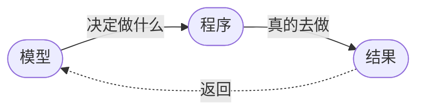
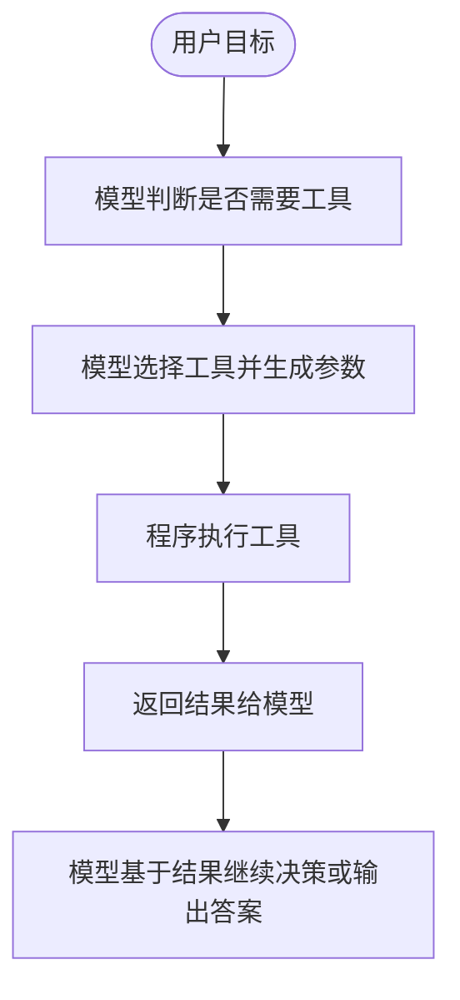

# Tool Calling 入门

很多人第一次感受到 Agent 和普通聊天应用的差别，往往就是从 Tool Calling 开始。

因为一旦系统能调工具，它就不再只能“基于参数里的知识说话”，而是开始具备外部行动能力。

## 为什么模型需要工具

单靠模型本身，通常做不到下面这些事：

- 获取实时数据
- 查询私有数据库
- 读写文件
- 调用内部系统
- 执行代码
- 与外部 API 交互

模型擅长的是理解、推理、生成。  
工具解决的是访问外部世界和执行动作。

所以 Tool Calling 的意义不是“让模型更聪明”，而是“让系统更有手”。

## 一个最简单的心智模型

你可以把工具调用理解成：

更完整一点就是：

这里最关键的是分工。

模型不应该“假装自己已经查到了数据”，而应该明确说：

- 需要调用哪个工具
- 参数是什么
- 为什么需要调它

程序则负责：

- 真正执行工具
- 校验参数
- 处理异常
- 把结果返回给系统

## 工具调用不等于随便开放能力

很多新手一做 Tool Calling，就喜欢把很多能力一次性暴露给模型：

- 搜索
- 文件系统
- shell
- 数据库
- 浏览器
- 写入接口

这在 Demo 阶段看起来很酷，但问题也很快会出现：

- 模型选错工具
- 参数乱填
- 调用次数失控
- 权限过大
- 调试困难

所以工具系统设计的第一原则不是“越多越强”，而是“越清晰越稳”。

## 一个好工具至少要满足什么

至少要满足这几件事：

### 1. 职责清晰

工具到底做什么，边界必须明确。  
不要让一个工具同时负责搜索、总结、打分、写入。

### 2. 输入清晰

参数结构应该明确、稳定、可校验。  
最好是结构化字段，而不是一大段模糊字符串。

### 3. 输出清晰

返回值尽量稳定，方便模型和程序继续处理。

### 4. 权限清晰

能不能写、能不能删、能不能执行命令，必须有边界。

### 5. 错误可处理

工具失败时要能区分：

- 参数错误
- 权限错误
- 网络错误
- 数据为空

否则系统一失败就不知道问题在哪。

## Tool Calling 最容易踩的坑

### 模型假装调用过工具

这是最常见的问题之一。  
模型可能直接编一个结果，而不是老老实实发起工具请求。

所以系统需要显式区分：

- 模型输出普通文本
- 模型输出工具调用意图

### 工具接口设计过于宽泛

例如一个搜索工具同时支持十几种模式，但没有明确字段。  
这会让模型很难稳定地产生正确参数。

### 工具返回结果太脏

如果工具返回的是超长原始文本、混乱 JSON 或不稳定结构，模型后续也会处理得很差。

### 没有调用预算

一旦任务进入循环，系统可能不断尝试：

- 再搜一次
- 再换个参数
- 再调用一次

如果没有预算和结束条件，成本很容易失控。

## 工具设计的一个务实建议

比起一开始就设计一个万能工具系统，更好的方法是：

1. 先围绕具体任务列出真正需要的能力
2. 每个能力做成边界清晰的小工具
3. 优先保证输入输出稳定
4. 再逐步补权限控制、异常处理和预算控制

也就是说，先做“可控工具”，再做“强大工具”。

## 小结

Tool Calling 是 Agent 非常关键的一步，因为它让系统从“只会说”变成“能行动”。

但工具系统不是插件市场，不是接得越多越好。  
真正重要的是：

- 分工清晰
- 接口稳定
- 权限明确
- 错误可控

下一篇建议继续看：

- [Memory 设计模式](../06-memory-patterns/index.html)
