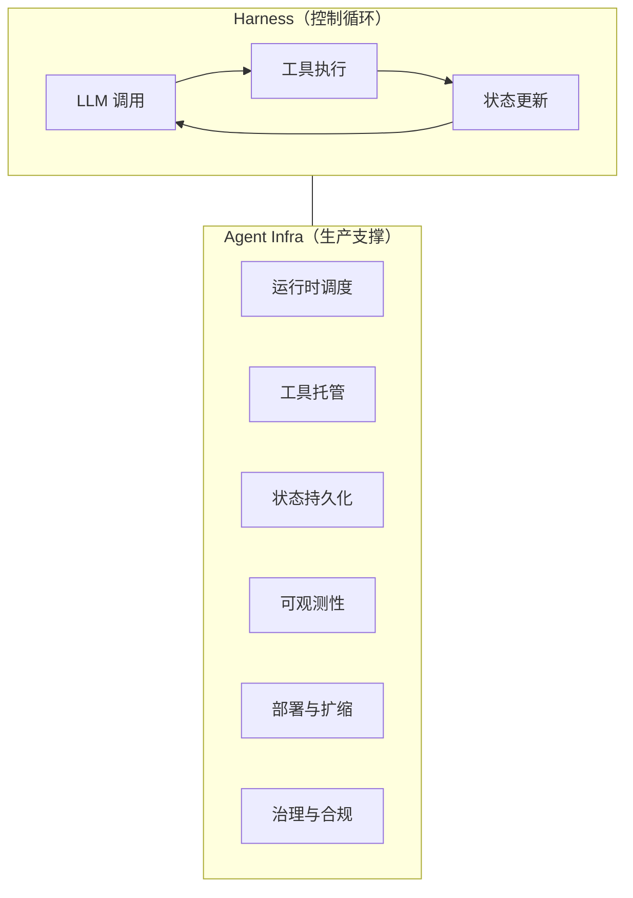
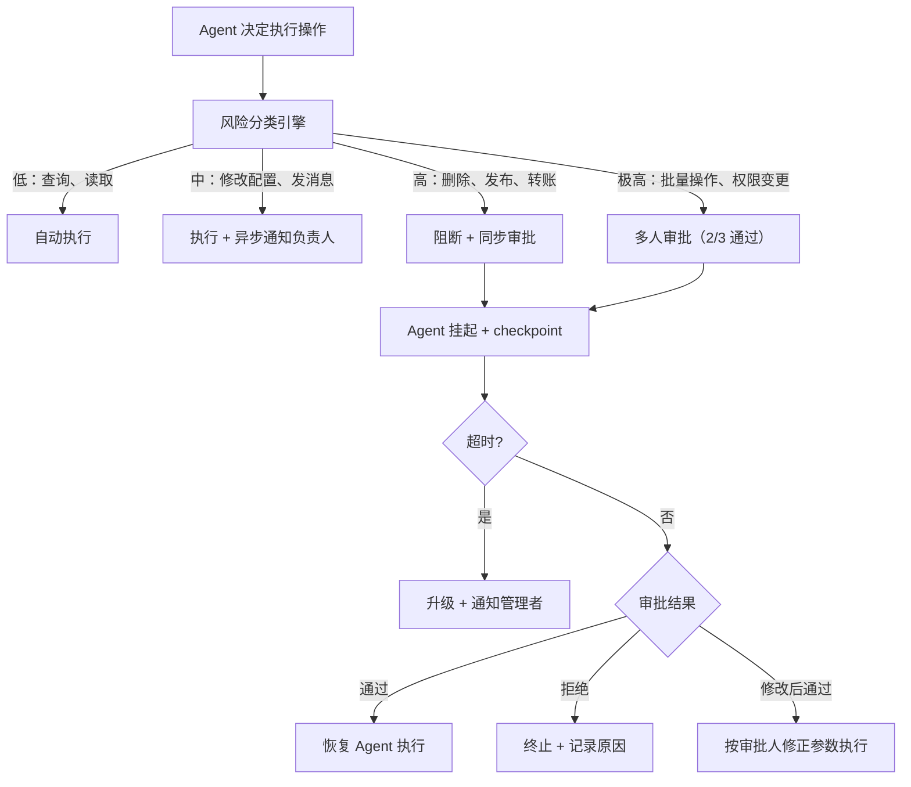
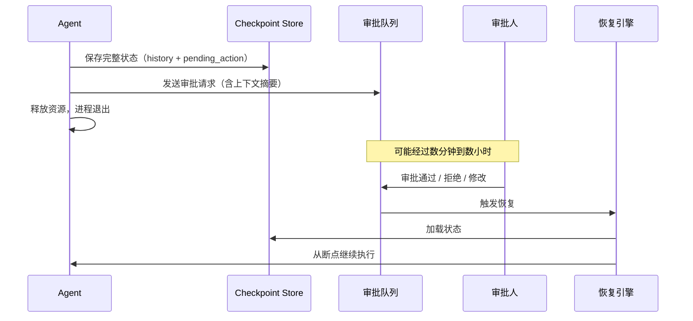
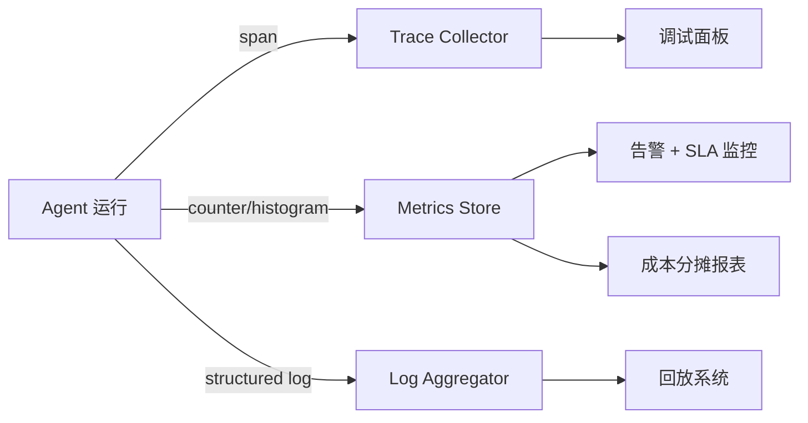
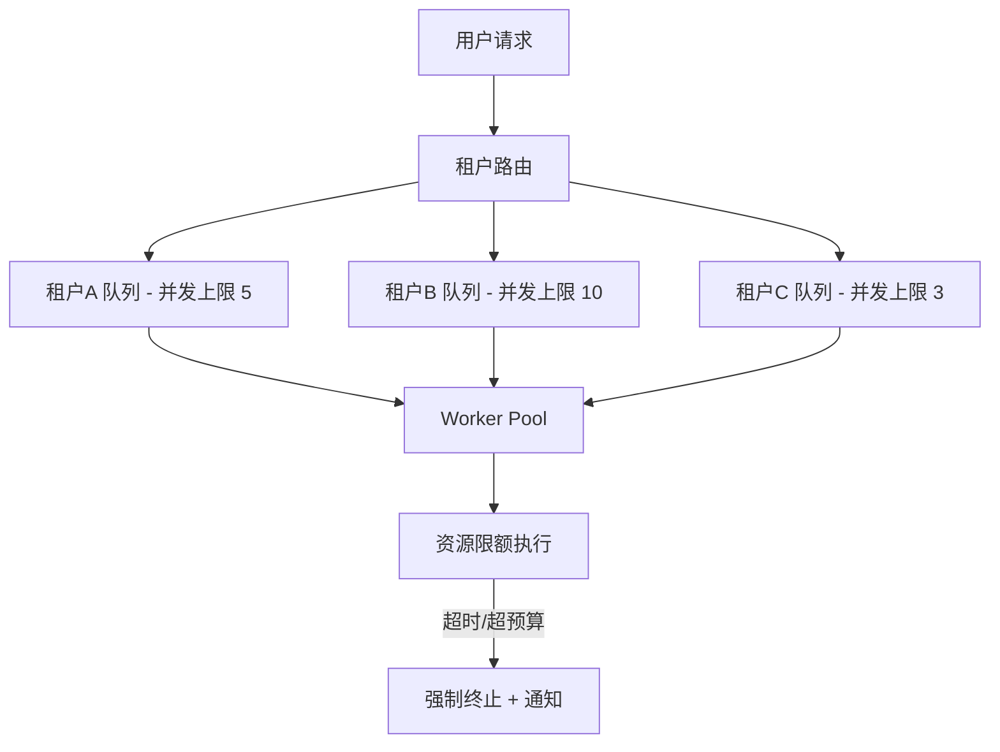
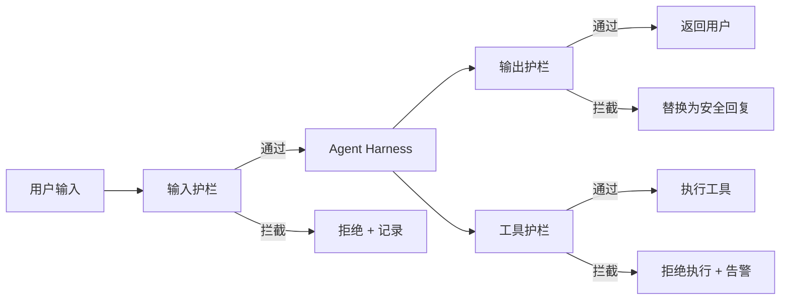

# Agent Infra：从 Harness 到生产环境

你已经知道一个 Agent 的核心是一个 while 循环——Harness。但把这个循环直接部署到生产环境，第一天就会出问题：工具调用超时没人知道，对话状态丢了无法恢复，token 费用失控却没有监控。

Agent Infra 就是解决这些问题的基础设施层。它不改变 Agent 的逻辑，而是让这个逻辑能在真实环境中稳定、可观测、可扩展地运行。

**企业级 Agent 和个人 Demo 的本质区别不在模型能力，而在 Infra 的厚度。** 同样一个 Harness，套上企业级 Infra 之后要处理的事情多出一个数量级：合规审计、多租户隔离、成本分摊、故障自愈、灰度发布……这些在 Demo 阶段完全不存在的需求，在企业场景中任何一个缺失都可能让整个系统无法上线。

## Harness 和 Infra 的边界



Harness 关心的是"下一步调什么工具、怎么决策"；Infra 关心的是"这个循环怎么不挂、挂了怎么恢复、跑了多少钱、谁有权限用、出事了怎么审计"。

## 六层基础设施

### 1. 运行时调度

Agent 不是一次 HTTP 请求就能结束的。一次任务可能跑几十轮迭代，持续数分钟甚至更久。运行时调度要解决的问题：

| 问题 | 个人项目的做法 | 企业级的做法 |
|------|--------------|-------------|
| 单次工具调用超时 | try/except + 固定重试 | 分级超时策略，区分幂等/非幂等，指数退避 + 断路器 |
| 整体任务超时 | max_iterations 硬上限 | wall-clock timeout + token budget + 成本熔断，三重保险 |
| 并发控制 | 单进程顺序执行 | per-tenant 并发槽位，优先级队列，抢占式调度 |
| 异步长任务 | 同步等待返回 | 任务队列（Celery/Temporal）+ Webhook 回调 + 进度推送 |
| 故障恢复 | 失败就重跑 | 从最近的 checkpoint 恢复，跳过已完成的幂等步骤 |

**企业级的关键差异：Durable Execution。** 企业场景中 Agent 任务可能跨越数小时（如代码审查、数据管线编排）。用 Temporal 或 Inngest 这类 durable workflow 引擎来编排 Agent 步骤，每个 step 自动持久化，进程崩溃后从断点自动恢复，不丢失已完成的工作。

```text
┌─────────────────────────────────────────────────────┐
│  Durable Execution Engine (Temporal / Inngest)      │
│                                                     │
│  Step 1: LLM 决策  ──✓──  checkpoint               │
│  Step 2: 工具调用A  ──✓──  checkpoint               │
│  Step 3: 工具调用B  ──✗──  进程崩溃                  │
│                          │                          │
│  恢复 → 跳过 Step 1,2 → 重试 Step 3                 │
└─────────────────────────────────────────────────────┘
```

### 2. 工具托管（MCP 与 Tool Gateway）

Demo 阶段，工具就是几个本地函数。企业环境中，工具是分布式服务，而且涉及敏感数据和操作权限。

#### 基本架构

```text
Agent Harness
    │
    ▼
Tool Gateway（鉴权、限流、路由、审计日志）
    │
    ├── MCP Server A（文件系统 — 只读）
    ├── MCP Server B（数据库查询 — 行级权限）
    ├── MCP Server C（外部 API — 带 secret 注入）
    └── MCP Server D（内部微服务 — mTLS）
```

#### 企业级工具治理

| 维度 | 个人项目 | 企业级 |
|------|---------|--------|
| 注册与发现 | 硬编码在代码里 | 中心化 Tool Registry，版本管理，按需加载 |
| 权限控制 | 无，所有工具对所有人开放 | RBAC + scope 控制 + 动态授权（"这个 Agent 只能读不能写"）|
| 数据边界 | 不区分 | 工具返回结果需要脱敏、字段裁剪、防止数据泄露到 LLM |
| 操作审批 | 无 | 高危操作（删除、转账、发布）触发 Human-in-the-Loop 审批流 |
| 协议标准 | 自定义 JSON | MCP（Model Context Protocol），统一 schema + transport |

**MCP 在企业中的真正价值**：不只是"统一协议"，而是让安全团队能在 Gateway 层统一做策略，不需要逐个审查每个 Agent 的工具调用代码。工具的实现、Agent 的实现、安全策略三者完全解耦。

#### Human-in-the-Loop：企业级实施

企业 Agent 不是所有操作都能自动执行。但"加个审批"远比想象中复杂——你需要解决：Agent 等待审批时状态怎么保持？审批超时怎么办？审批人看到的上下文够不够做决策？如何防止审批疲劳导致橡皮图章？

##### 风险分级策略

第一步是对工具操作做风险分级，不同级别走不同流程：



风险分级不是硬编码的静态表，企业级实现通常有三层判断：

| 层次 | 判断依据 | 示例 |
|------|---------|------|
| 工具级别 | 工具本身的固有风险 | `delete_record` 固有高风险，`query_db` 固有低风险 |
| 参数级别 | 同一工具的不同参数组合 | `send_email(to=internal)` 中风险，`send_email(to=external, count>50)` 高风险 |
| 上下文级别 | 当前会话的累积行为 | 同一会话连续第三次修改同一资源 → 升级风险等级 |

```text
风险评分公式（示例）：
risk_score = tool_base_risk
           + param_risk_modifier(args)
           + context_risk_modifier(session_history)
           + time_risk_modifier(outside_business_hours ? +20 : 0)

if risk_score >= 80: 多人审批
elif risk_score >= 50: 单人审批
elif risk_score >= 20: 执行 + 通知
else: 静默执行
```

##### Agent 挂起与恢复

审批流最大的工程难题不是"弹个对话框"，而是 **Agent 等待期间的状态管理**。审批可能几秒钟回来，也可能几小时。你不能让一个进程 sleep 几小时等审批结果。



关键实现要点：

| 问题 | 解法 |
|------|------|
| 进程不能一直等待 | checkpoint + 事件驱动恢复，而非长轮询 |
| 审批超时 | 可配置 SLA（如 30 分钟），超时自动升级或自动拒绝 |
| 审批期间上下文过期 | 恢复时重新验证前置条件（如"要删的文件还存在吗"）|
| 多个待审批操作 | 批量审批 UI，支持"全部通过"/"逐条审核" |

这就是为什么 Durable Execution（Temporal/Inngest）对企业 Agent 如此重要——它天然支持"等待外部信号"的语义，状态自动持久化，不需要手搓 checkpoint 逻辑。

##### 审批人的上下文呈现

审批人不是 Agent 的操作者，通常不了解完整对话历史。如果只给一句"Agent 请求执行 delete_user(id=12345)"，审批人无法做出有效判断。

企业级审批请求需要包含：

```text
┌─────────────────────────────────────────────────┐
│  审批请求 #2847                                   │
├─────────────────────────────────────────────────┤
│  操作：delete_user(id=12345)                     │
│  风险等级：高                                     │
│  请求时间：2025-03-15 14:23:07                   │
│  超时时间：30 分钟后自动拒绝                       │
├─────────────────────────────────────────────────┤
│  上下文摘要：                                     │
│  · 用户 Alice 要求注销账号                        │
│  · Agent 已验证用户身份（MFA 通过）               │
│  · 用户账户余额 $0，无未完成订单                   │
│  · Agent 之前已执行 export_user_data（已完成）     │
├─────────────────────────────────────────────────┤
│  影响范围：                                       │
│  · 删除用户记录及关联数据                         │
│  · 不可逆操作                                     │
│  · 关联账号：无                                   │
├─────────────────────────────────────────────────┤
│  [通过]  [拒绝]  [修改后通过]  [升级给主管]        │
└─────────────────────────────────────────────────┘
```

上下文摘要不是简单截取对话记录，而是由 LLM 生成的结构化摘要，聚焦于"审批人做决策需要知道什么"。这本身也是一个 prompt engineering 问题。

##### 防止审批疲劳

当审批量大时，审批人会产生"橡皮图章"心理——所有东西都通过。企业级的应对策略：

| 策略 | 做法 |
|------|------|
| 自适应分级 | 同一操作连续 N 次被秒批后，自动降级为"执行+通知" |
| 批量审批 + 抽检 | 低风险操作批量通过，但随机抽取 10% 要求逐条审核 |
| 审批质量监控 | 追踪每个审批人的平均审批时间，<3 秒的批次标记为可能的橡皮图章 |
| 职责分离 | 同一人不能既是 Agent 的创建者又是审批人 |
| 时间窗口 | 非工作时间的高风险操作自动阻断到下一个工作日 |

##### 审计与回溯

每一次审批决策都需要完整记录：

```text
审计记录 schema：
{
  "request_id": "req_2847",
  "agent_id": "agent_cs_01",
  "tenant_id": "tenant_acme",
  "action": "delete_user",
  "params": {"id": 12345},
  "risk_score": 82,
  "risk_factors": ["irreversible", "affects_user_data"],
  "context_summary": "用户主动注销，已完成数据导出",
  "approver": "bob@acme.com",
  "decision": "approved",
  "decision_time_ms": 45000,
  "decision_reason": null,
  "executed_at": "2025-03-15T14:24:12Z",
  "execution_result": "success"
}
```

这些记录不只是给合规审计用——出了事故时，回溯链是：谁创建的 Agent → Agent 为什么做这个决策 → 谁审批的 → 审批时看到了什么上下文。任何一环缺失，责任就说不清。

### 3. 状态与记忆持久化

Harness 里的 `self.history` 是内存数组，进程一挂就没了。生产环境需要多层持久化：

| 层次 | 内容 | 个人项目 | 企业级 |
|------|------|---------|--------|
| 对话历史 | 完整的 messages 列表 | 内存 / SQLite | PostgreSQL + 加密存储，保留策略（GDPR 删除权）|
| Checkpoint | 每轮迭代后的状态快照 | 不做 | 对象存储 / KV Store，支持版本回溯 |
| 长期记忆 | 跨会话的用户偏好和知识 | 本地文件 | 向量数据库 + 关系库，租户隔离 |
| 工具结果缓存 | 幂等工具的结果复用 | 不做 | 分布式缓存 + TTL，降低重复调用成本 |
| 审计日志 | 完整的决策和操作记录 | 不需要 | 不可篡改的 append-only log，满足合规要求 |

**企业级的核心挑战：数据隔离与合规。**

多租户环境下，不同租户的对话历史、记忆、工具执行结果必须严格隔离。不只是逻辑隔离（where tenant_id = ?），在金融、医疗等行业可能要求物理隔离（独立数据库实例）。

同时还有数据生命周期管理：

- 对话记录保留多久？GDPR 要求用户有"被遗忘权"
- LLM 的 input/output 是否落盘？某些行业禁止将敏感数据发送给第三方模型
- Checkpoint 数据包含中间状态，可能含有 PII，加密和访问控制不能少

### 4. 可观测性（Trace / Metrics / Logs）

Agent 系统最难调试的地方在于：它的行为不确定。同样的输入可能走不同的工具路径。没有可观测性，出了问题只能猜。

#### 三大信号

| 信号 | 采集内容 | 企业级要求 |
|------|---------|-----------|
| Trace | 完整调用链：LLM 请求 → 工具调用 → 结果 → 下一轮决策 | 分布式 trace，跨服务关联，支持采样率调节 |
| Metrics | token 用量、延迟、工具成功率、迭代次数 | 多维度聚合（按租户/Agent 类型/模型），实时告警 |
| Logs | LLM 原始 request/response | 脱敏后存储，支持全文检索和回放 |



#### 企业级可观测性的独特需求

**成本归因与分摊**：企业里 Agent 是多团队共用的平台。每个团队用了多少 token、调了多少次工具、产生了多少费用——需要精确到租户和 Agent 实例级别的计量，用于内部 chargeback。

```text
月度成本报表示例：
┌──────────────┬──────────┬───────────┬──────────┐
│ 团队         │ Token 用量│ 工具调用次数│ 费用（$）  │
├──────────────┼──────────┼───────────┼──────────┤
│ 客服 Agent   │ 12.3M    │ 45,000    │ 2,460    │
│ 代码审查     │ 8.7M     │ 12,000    │ 1,740    │
│ 数据分析     │ 3.2M     │ 8,500     │ 640      │
└──────────────┴──────────┴───────────┴──────────┘
```

**SLA 监控**：企业 Agent 对外承诺响应时间。需要监控 P50/P95/P99 延迟，在 SLA 即将违约时自动降级（比如减少迭代次数、切换更快的模型）。

**异常行为检测**：Agent 可能产生"幻觉"后连续调用不存在的工具，或进入死循环。需要检测异常模式并自动熔断：

- 连续 N 次工具调用失败 → 熔断
- 单次任务 token 消耗超过阈值 → 强制终止
- 同一工具被反复调用相同参数 → 检测循环

#### 工具生态

| 工具 | 定位 | 企业适用性 |
|------|------|-----------|
| LangSmith | LangChain 生态的 trace + eval | 绑定 LangChain，功能全面 |
| Langfuse | 开源 LLM 可观测平台 | 可私有化部署，适合数据合规要求高的企业 |
| Arize Phoenix | 开源，侧重 eval 和 drift 检测 | 适合需要持续评估 Agent 质量的场景 |
| OpenTelemetry | 通用分布式 trace 标准 | 最灵活，但需要自建 Agent 特定的 span 规范 |

### 5. 部署与扩缩

Agent 的资源消耗模式和普通 Web 服务完全不同：

| 特征 | 传统 Web 服务 | Agent 服务 |
|------|-------------|-----------|
| 请求时长 | 毫秒级 | 秒到分钟级 |
| 内存模式 | 稳定 | 随迭代增长，峰值远高于启动时 |
| I/O 模式 | 单次请求-响应 | 多次串行/并发外部调用 |
| 失败模式 | 明确的错误码 | 模型"幻觉"导致的静默失败 |
| 扩缩信号 | QPS / CPU | 并发任务数 + 排队深度 + token 消耗速率 |

#### 企业级部署模式

| 模式 | 适合场景 | 企业考量 |
|------|----------|---------|
| 常驻进程 + Temporal | 长任务、需要 checkpoint、跨天运行 | 最可靠，成本较高 |
| K8s + HPA | 多租户、流量波动大 | 需要自定义 scaler（基于任务队列深度而非 CPU）|
| Serverless + 状态外置 | 轻量 Agent、突发流量 | 冷启动延迟 + 执行时长限制是瓶颈 |

**企业级的关键差异：多租户资源隔离。**

一个用户的 Agent 死循环不能拖垮其他用户。企业级隔离策略：



每个租户有独立的：
- 并发任务上限
- Token 预算（日/月）
- 工具调用频率限制
- 最大单任务时长

### 6. 治理与合规（企业独有层）

这一层在个人项目中完全不存在，但在企业中可能是上线的最大阻碍。

#### Agent 版本管理与灰度发布

Agent 的行为由 system prompt + 工具集 + 模型版本共同决定。任何一个变更都可能导致行为突变。企业需要：

| 需求 | 方案 |
|------|------|
| 版本化 | 每次变更生成不可变的 Agent 版本号（prompt hash + tool set hash + model version）|
| 灰度发布 | 新版本先灰度 5% 流量，观察成功率和用户反馈，再逐步放量 |
| 快速回滚 | 发现问题后秒级切回上一版本，不需要重新部署 |
| A/B 测试 | 同一用户群体对比不同 prompt 策略的效果 |

#### 合规与审计

```text
企业合规清单：
├── 数据合规
│   ├── PII 不能发送给第三方模型（或需要脱敏）
│   ├── 对话记录满足数据保留 / 删除策略
│   └── 跨境数据传输限制（模型 API 部署区域）
├── 操作合规
│   ├── 高危操作必须有审批链
│   ├── 所有 Agent 决策可追溯、可解释
│   └── 操作日志不可篡改（append-only）
└── 模型合规
    ├── 输出内容安全过滤（Guardrails）
    ├── 禁止生成特定类型内容
    └── 模型供应商的数据使用协议审查
```

**Guardrails（护栏）** 是企业 Agent 的标配：

- **输入护栏**：检测用户输入中的 prompt injection、越权请求
- **输出护栏**：过滤模型输出中的有害内容、PII 泄露、不合规建议
- **工具护栏**：拦截危险的工具调用参数（如 SQL 注入、路径穿越）



## 个人 Agent 和企业 Agent 的全景对比

| 维度 | 个人 / Demo | 企业级 |
|------|------------|--------|
| 运行时 | 单进程，跑完即止 | Durable Execution，自动恢复 |
| 工具管理 | 硬编码本地函数 | MCP + Gateway + RBAC + 审批流 |
| 状态管理 | 内存数组 | 多层持久化 + 加密 + 租户隔离 |
| 可观测性 | print 调试 | 分布式 trace + 成本归因 + SLA 告警 |
| 部署 | 本地运行 | K8s/Temporal + 多租户隔离 + 灰度 |
| 治理 | 不需要 | 版本管理 + 合规审计 + Guardrails |
| 故障处理 | 重跑 | checkpoint 恢复 + 熔断 + 自动降级 |
| 成本控制 | 个人信用卡 | per-tenant 预算 + chargeback + 熔断 |

## 什么阶段该关心什么

不需要一开始就把六层全搭起来。按阶段递进：

| 阶段 | 优先建设 | 可以先不做 |
|------|---------|-----------|
| PoC / Demo | Harness 本身 | 全部 Infra |
| 内部工具（<10 人用）| + 状态持久化 + 基础日志 + 简单超时 | 多租户、合规、灰度 |
| 面向用户的产品 | + 可观测性 + 重试策略 + 权限控制 + 输出护栏 | 精细成本分摊、A/B 测试 |
| 企业平台（多团队共用）| + 多租户隔离 + 成本归因 + 灰度发布 + 审计 | — |
| 强合规行业（金融/医疗）| + 全部治理层 + 数据隔离 + 操作审批 | — |

最常见的错误是两种极端：

- **裸奔上线**：没有 Infra 直接部署，Agent 死循环一晚上烧掉几千美元 token，第二天才发现
- **过度设计**：在 PoC 阶段花三个月搭 Infra，结果 Agent 本身的效果还没验证就被砍掉了

正确的节奏是：先用最简 Harness 验证 Agent 逻辑可行，然后按照用户规模和合规要求逐层加固。

## 小结

- Agent Infra 是让 Harness 能在生产环境稳定运行的外围支撑，不改变 Agent 逻辑本身。
- 六个核心层次：运行时调度、工具托管、状态持久化、可观测性、部署扩缩、治理合规。
- **企业级的本质区别**：多租户隔离、成本归因、合规审计、Guardrails、灰度发布——这些在 Demo 中不存在的需求占据了企业 Infra 70% 以上的工作量。
- MCP + Tool Gateway 是工具层的演进方向，让安全策略可以在网关层统一管控。
- Checkpoint + Durable Execution 是从 Demo 到生产最关键的一步——没有它，Agent 挂了只能从头来。
- 按阶段递进建设：先验证 Agent 逻辑，再按用户规模逐层加固 Infra。

下一篇建议继续看：

- [Harness 工程：从原理到实现](../../learn-agent-survey/06-harness/index.html)——亲手写一遍 Harness，再回来看 Infra 会更有体感。
