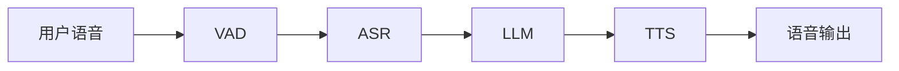
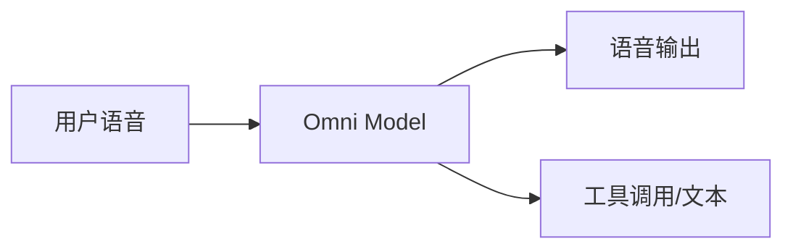
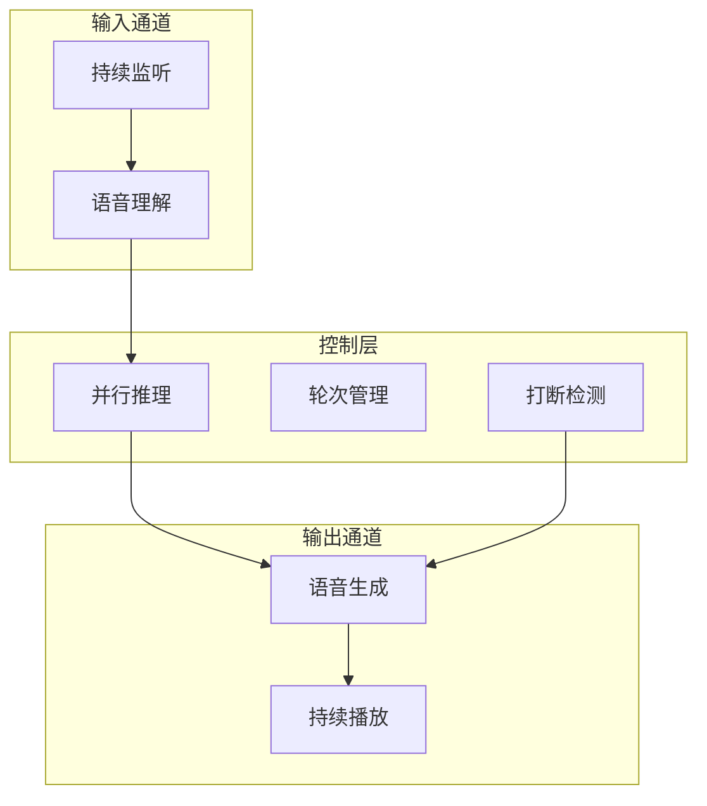
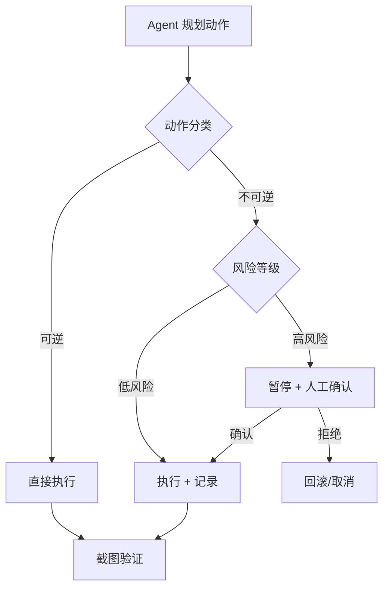
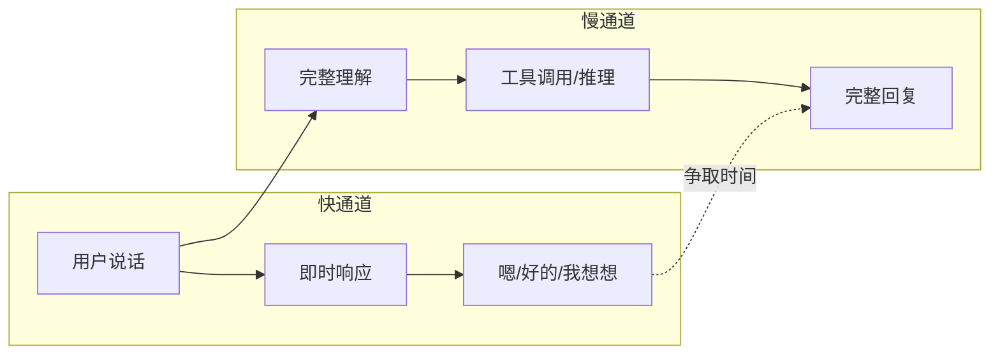
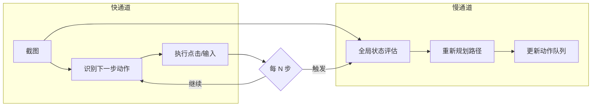

# 多模态与实时交互 Agent

前面十三篇讲的 Agent 几乎都在处理文本：文本输入、文本推理、文本输出。但 2026 年的现实是，用户越来越多地期望 Agent 能**听、能看、能操作界面**——而不只是读写文字。

这篇文章覆盖两大方向：

- **Voice Agent**：语音输入/输出的实时对话系统
- **Computer Use / GUI Agent**：直接操作图形界面的自主 Agent

以及它们共享的核心工程原则：**快慢解耦**。

## 为什么多模态 Agent 在 2026 年成为刚需

从 2023 年到 2026 年，Agent 的交互界面经历了三个阶段：

```text
Text-only Agent → Voice/Vision 增强 → 多模态原生 Agent
   (CLI/API)       (加个语音接口)      (感知-决策-执行 全链路多模态)
```

驱动这个变化的不是技术酷炫度，而是三个工程现实：

1. **用户场景要求**：客服、车载、智能家居——用户的手和眼睛被占用，文本交互不可行
2. **任务复杂度要求**：自动化操作网页/桌面软件，纯 API 集成覆盖不了长尾应用
3. **模型能力到位**：多模态模型在 2025-2026 年密集发布，延迟和成本降到可用水平

关键认知：多模态不是"给文本 Agent 加个语音前端"，而是需要重新设计 Agent 的感知-决策-执行循环。延迟约束、信息密度、错误恢复方式都完全不同。

## Voice Agent 三种架构范式

### Cascaded 级联架构

最经典的 pipeline 方案：



- **VAD**（Voice Activity Detection）：检测用户是否在说话
- **ASR**（Automatic Speech Recognition）：语音转文本
- **LLM**：文本推理，生成回复
- **TTS**（Text-to-Speech）：文本转语音

工程特点：

- 每个环节独立优化、独立替换
- LLM 部分和文本 Agent 完全复用，工具调用、记忆管理等已有方案直接适用
- 延迟是各环节之和：VAD(~200ms) + ASR(~300ms) + LLM(~500ms) + TTS(~300ms) = 1.3s+
- 语调、情感等副语言信息在 ASR 阶段丢失

### Omni 端到端架构

单一多模态模型直接处理音频输入、产生音频输出：



工程特点：

- 延迟极低（模型直接从音频 token 生成音频 token，无中间转换）
- 保留副语言信息：语调、情感、说话速度
- 可控性差：难以约束模型的回复格式、工具调用逻辑
- 调试困难：中间没有文本表示，无法 log 模型"想了什么"
- 成本高：音频 token 数量远大于等价文本

### Full-duplex 全双工架构

模拟人类对话：可以被打断、可以边听边说、可以在对方说话时思考。



工程特点：

- 最接近自然人类对话体验
- 需要处理"同时说话"的冲突
- 打断检测本身就是一个独立的模型/规则模块
- 需要流式生成 + 流式播放 + 随时取消的基础设施

### 三种范式对比

| 维度 | Cascaded 级联 | Omni 端到端 | Full-duplex 全双工 |
| --- | --- | --- | --- |
| 端到端延迟 | 1.3s+ | 300-500ms | 500-800ms |
| 可控性 | 高（文本中间层可审计） | 低（黑盒） | 中（混合架构） |
| 工具调用支持 | 成熟 | 有限 | 成熟 |
| 情感/语调保留 | 丢失 | 保留 | 部分保留 |
| 工程复杂度 | 低 | 中 | 高 |
| 成本（相同对话量） | 低 | 高 | 中 |
| 适用场景 | 客服、内部工具 | 陪伴、娱乐 | 实时助手、电话场景 |

实际工程中，很多团队采用**混合方案**：用 Omni 做快速响应的"嗯、好的"等短回复，用 Cascaded 做需要工具调用的复杂回复。

## Computer Use / GUI Agent

GUI Agent 的目标：让 AI 像人类用户一样操作图形界面——点击按钮、输入文字、滚动页面、读取屏幕内容。

### 动作空间设计

GUI Agent 需要定义一组有限的动作原语：

```python
# 典型动作空间
actions = {
    "click": {"x": int, "y": int, "button": "left|right"},
    "type": {"text": str},
    "scroll": {"direction": "up|down|left|right", "amount": int},
    "key": {"keys": str},          # 如 "ctrl+c"
    "screenshot": {},               # 获取当前屏幕截图
    "wait": {"seconds": float},     # 等待页面加载
    "drag": {"from_x": int, "from_y": int, "to_x": int, "to_y": int},
}
```

设计原则：

- **原子性**：每个动作是最小操作单元，组合出复杂行为
- **可逆性标注**：区分可逆操作（滚动、切换标签页）和不可逆操作（删除、提交、发送）
- **等待机制**：UI 操作后需要等待渲染完成再截图验证

### 视觉定位方法

模型看到截图后，如何指定"点击哪里"？两种主流方案：

**方案 A：Set-of-Mark（SoM）标注选择**

```text
截图 → 视觉模型检测可交互元素 → 标注编号 → 发给 LLM
LLM 回复："点击标记 [7] 的按钮"
```

优点：LLM 只需选 ID，不需要空间推理能力；定位精确。
缺点：多一步检测；遗漏元素时无法操作。

**方案 B：坐标定位**

```text
截图 → 直接发给多模态 LLM
LLM 回复："click(324, 178)"
```

优点：无需额外检测步骤；能操作任何可见元素。
缺点：坐标精度依赖模型视觉能力；分辨率变化时坐标失效。

实践建议：优先用 SoM（稳定性高），对 SoM 覆盖不到的元素 fallback 到坐标定位。

### 安全边界

GUI Agent 直接操作用户界面，安全问题比 API 调用严重得多：



关键安全措施：

| 层次 | 措施 | 说明 |
| --- | --- | --- |
| 环境隔离 | 沙箱/虚拟机 | Agent 在隔离环境中操作，不影响宿主机 |
| 权限收窄 | 白名单应用 | 只允许操作指定应用，禁止访问敏感区域 |
| 操作审批 | 不可逆操作确认 | 删除、发送、付款等动作需人工确认 |
| 执行限速 | 动作频率限制 | 防止失控循环高频点击 |
| 状态验证 | 操作后截图对比 | 确认动作产生了预期效果 |

### 当前落地的代表产品

- **Claude Computer Use**：Anthropic 提供的 API 能力，模型直接接收截图、输出鼠标/键盘动作坐标
- **Open Interpreter / OS-Copilot**：开源方案，组合视觉模型 + 动作执行层
- **各类 RPA 增强**：传统 RPA 工具接入 LLM 做决策层，保留原有的元素定位和操作基础设施
- **浏览器自动化**：基于 Playwright/Puppeteer + 视觉理解，处理网页交互

共同的架构模式：

```text
截图/DOM → 理解当前状态 → 规划下一步动作 → 执行 → 验证 → 循环
```

## 快慢解耦：跨模态的共性设计原则

Voice Agent 和 GUI Agent 看起来是完全不同的场景，但它们面临同一个核心矛盾：

> 用户期望实时响应（快），但深度推理需要时间（慢）。

解决方案是同一个：**把实时响应通道和深度推理通道分离，并行运行。**

### Voice Agent 中的快慢解耦



- **快通道**：识别到用户说完，立即给出填充词或短确认，维持对话节奏
- **慢通道**：同时启动完整的语义理解、工具调用、回复生成
- 快通道为慢通道"争取时间"，用户感知延迟从实际推理时间降到填充词的响应时间

### GUI Agent 中的快慢解耦



- **快通道**：按已有计划快速执行下一个动作（不重新思考整体策略）
- **慢通道**：每隔 N 步或检测到异常时，做全局状态评估，必要时重新规划
- 避免"每一步都做完整推理"带来的延迟爆炸

### 核心思想总结

| 维度 | 快通道 | 慢通道 |
| --- | --- | --- |
| 职责 | 维持交互节奏 | 保证决策质量 |
| 延迟要求 | <200ms | 可接受 1-5s |
| 模型规模 | 小模型/规则 | 大模型/多步推理 |
| 触发条件 | 每次交互 | 定期/异常时 |
| 失败代价 | 低（填充词/单步动作） | 高（整体策略错误） |

这个模式在系统设计中并不新鲜——它本质上就是**缓存 + 后台刷新**的交互版本。

## 工程挑战

### 延迟预算管理

多模态 Agent 的延迟是硬约束，不像文本 Agent 可以"多想一会儿"。

```text
Voice Agent 延迟预算示例：
总预算 = 800ms（超过则用户感知"卡顿"）

分配：
- 网络传输：100ms
- 语音理解：150ms
- LLM 推理：350ms（含首 token 时间）
- 语音合成：150ms
- 播放缓冲：50ms
```

工程手段：

- **流式处理**：LLM 生成第一个句子时就开始 TTS，不等全部生成完
- **预计算**：根据对话上下文预测可能的回复方向，提前准备
- **分级降级**：延迟超标时，降级到模板回复或短确认

### 多模态信息对齐

不同模态的信息需要在时间和语义上对齐：

- Voice：用户说"就是那个"时，"那个"指代什么？需要对话历史 + 可能的视觉上下文
- GUI：截图中的文字内容需要和操作记忆对齐——"我刚才填的那个表单"在哪里？

对齐策略：

1. **统一时间轴**：所有模态的事件按时间戳排序，形成统一上下文
2. **显式引用消解**：在 prompt 中把指代关系解析为具体对象
3. **状态快照**：关键时刻保存完整状态（截图 + 文本 + 音频片段），供后续引用

### 错误恢复

多模态场景的错误恢复比文本场景复杂得多：

**Voice Agent 错误恢复**：

```text
检测到错误 → 主动确认
"您是说要转到人工客服，还是查询账户余额？"
```

- ASR 识别不确定时，主动向用户确认
- 工具调用失败时，用自然语言解释并给出替代方案
- 关键操作前复述确认："我将为您转账 500 元到 XXX 账户，确认吗？"

**GUI Agent 错误恢复**：

```text
执行动作 → 截图验证 → 不符合预期 → 回退/重试
```

- 每次动作后截图，对比预期状态和实际状态
- 页面未响应：等待 + 重试
- 导航到错误页面：检测到后回退
- 操作产生错误弹窗：识别弹窗内容，决定如何处理

共同原则：**检测-确认-恢复**三步循环，而不是盲目重试。

## 小结

多模态 Agent 不是"给文本 Agent 加个语音/视觉接口"，而是需要重新设计感知-决策-执行循环。

核心要点：

1. Voice Agent 三种范式各有适用场景：Cascaded 可控性最高，Omni 延迟最低，Full-duplex 体验最好
2. GUI Agent 的核心挑战是动作空间设计、视觉定位、安全边界三个维度
3. 快慢解耦是跨模态的通用设计原则——把实时响应和深度推理分成并行通道
4. 延迟预算是硬约束，需要流式处理、预计算、分级降级等工程手段
5. 错误恢复需要"检测-确认-恢复"循环，而不是简单重试

对于开发者的实践建议：

- 如果你在做 Voice Agent，从 Cascaded 起步（可控、可调试），需要低延迟时再引入 Omni 混合
- 如果你在做 GUI Agent，从 SoM + 沙箱环境起步，建立完善的截图验证机制
- 无论哪种模态，都优先实现快慢解耦——这是用户体验和系统可靠性的关键

## 延伸：Embodied Agent 与机器人控制

Voice 和 GUI 之后，多模态的下一个边界是物理世界——让 Agent 控制机械臂、移动机器人或具身智能体。这比屏幕操作多了连续控制、物理安全和感知延迟等新维度。

### 双层架构：规划与控制分离

Embodied Agent 通常把系统拆成两层：

```text
┌──────────────────────────────────────┐
│  高层规划（VLM / LLM）               │
│  · 理解自然语言指令                   │
│  · 把目标分解为子任务序列              │
│  · 周期性重新评估（秒级）             │
├──────────────────────────────────────┤
│  底层控制（VLA / Policy Network）     │
│  · 把子任务转为连续动作轨迹            │
│  · 毫秒级实时执行                     │
│  · 处理物理反馈和安全约束              │
└──────────────────────────────────────┘
```

这本质上就是"快慢解耦"在物理世界的体现：

- **慢通道**（规划层）：用大模型理解任务语义、做长程规划，允许几百毫秒延迟
- **快通道**（控制层）：用轻量策略网络高频输出动作指令，必须实时

### VLA（Vision-Language-Action）模型

VLA 是把视觉、语言和动作统一到一个模型中的方向：

- 输入：摄像头画面 + 自然语言指令
- 输出：机器人关节动作序列

代表工作：RT-2、Octo、OpenVLA 等。核心思路是把动作 token 化，让语言模型直接"生成"动作序列，复用预训练的视觉-语言能力。

### Action Chunking：弥补频率鸿沟

LLM 推理一次需要几十到几百毫秒，但机器人控制通常需要 50-200Hz 的频率。解决方案是 **Action Chunking**——模型一次预测 0.5-1 秒的动作序列（chunk），控制器按频率逐步执行：

```text
模型推理（200ms）→ 输出 10 个动作步（覆盖 500ms）→ 控制器 50Hz 回放
                  → 下一次推理在回放结束前开始（pipeline）
```

这让模型推理频率降到 2-5Hz 而控制仍保持高频。

### Sim2Real：仿真到真实的迁移

在真实机器人上收集数据成本极高。主流做法是先在仿真环境中训练，再迁移到真实世界：

| 阶段 | 做什么 | 关键挑战 |
| --- | --- | --- |
| 仿真训练 | 在物理模拟器中大量生成交互轨迹 | 仿真器的物理精度有限 |
| Domain Randomization | 随机化纹理、光照、物理参数 | 让策略不依赖特定视觉/物理特征 |
| Real-world Fine-tune | 用少量真实数据微调 | 真实数据昂贵但必不可少 |

核心原则：**在仿真中获得泛化，在真实中获得精度**。

### 安全是物理 Agent 的第一约束

与软件 Agent 不同，物理 Agent 的错误可能造成真实伤害：

- 力矩限制：关节力不能超过安全阈值
- 碰撞检测：实时监测与人/物的距离
- 紧急停止：任何异常立即触发硬件级别的安全停止
- 行为约束：高层规划的动作必须通过安全验证才能下发给控制层

这也是为什么双层架构中，控制层往往不直接使用大模型输出，而是经过安全过滤器。

### 对软件 Agent 工程师的启示

即使你不做机器人，Embodied AI 的工程模式也有迁移价值：

- **双层架构**的思想适用于任何"规划慢但执行要快"的场景
- **Action Chunking** 的思想适用于高频决策场景（如实时交易、游戏 AI）
- **Sim2Real** 的思想适用于"用模拟环境训练、在真实环境部署"的任何 Agent 系统
- **安全第一**的原则在所有有副作用的 Agent 中都应遵守

## 参考资料

- 李博杰《深入理解 AI Agent：设计原理与工程实践》，[第九章：多模态 Agent](https://github.com/bojieli/ai-agent-book/blob/e3883f8cec222c31e59c646be96641120863027e/book/chapter9.md)，固定提交 `e3883f8c`。本文按本仓库基础教程定位重新组织结构和表述，聚焦工程模式层面。
- OpenAI Realtime API 文档：Voice Agent 的 Full-duplex 参考实现
- Anthropic Claude Computer Use 文档：GUI Agent 的 API 设计参考
- WebArena / OSWorld benchmark：GUI Agent 的评测基准
