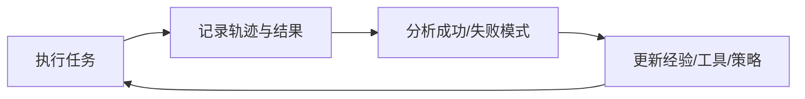
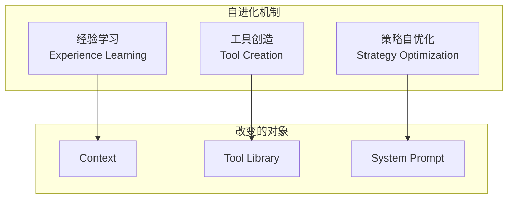
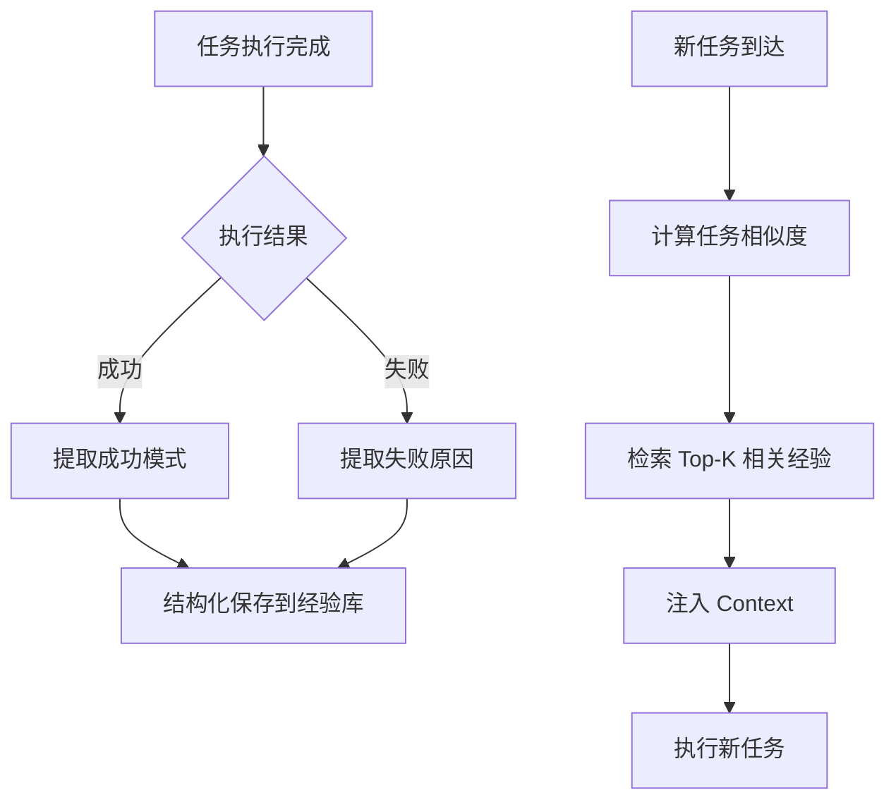
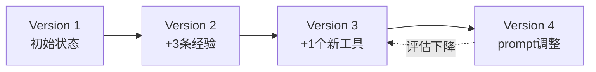

# Agent 自进化：不改权重也能持续变强

前面几篇我们讨论了 Agent 的核心组件、工具调用、规划与反思、评估体系。但有一个问题始终没有回答：

> Agent 部署上线之后，怎么让它越用越好？

传统软件的答案是人工迭代。但 Agent 系统面对的任务分布不断变化，靠人手动调 prompt 和加工具，迭代速度远远跟不上。这一篇讲的就是：如何让 Agent 在不修改模型权重的前提下，通过运行时机制实现自我改进。

## 为什么 Agent 需要自进化

### 模型权重是静态的，但世界在变

一个部署好的 Agent，它的基座模型权重在推理时不会改变。但它面对的环境在不断变化：

- 用户的需求模式在漂移（新的任务类型、新的边界场景）
- 外部 API 接口在更新（参数变化、返回格式变化）
- 业务规则在调整（合规要求、流程变更）

如果 Agent 的行为完全由静态的 prompt + 工具定义决定，它的有效期是有限的。

### 人工迭代太慢

典型的 Agent 改进循环：

```text
发现问题 → 人工分析原因 → 修改 prompt/工具 → 测试验证 → 部署
```

这个循环的瓶颈在"人工分析"和"修改"环节。一个复杂的 Agent 系统可能有几十个 prompt 模板和上百个工具，每次调整都需要工程师深入理解上下文。

### 理想状态：Agent 改善 Agent

自进化的目标是让 Agent 通过使用自己来改善自己：



这不是 AGI 的自我意识，而是工程上可实现的反馈闭环。

## 三种自进化机制

在不修改模型权重的前提下，Agent 可以通过三种机制实现持续改进：



### 机制一：经验学习（Experience Learning）

核心思路：把每次任务执行的轨迹结构化保存，下次遇到类似任务时检索相关经验作为 Context 注入。

**为什么比 RL 高效？**

传统强化学习通过梯度更新来"记住"经验，需要大量样本才能改变模型行为。而经验学习通过上下文学习（In-Context Learning）实现，样本效率高 250-400 倍：

| 方法 | 学习方式 | 所需样本量 | 更新速度 |
| --- | --- | --- | --- |
| 强化学习 | 梯度更新权重 | 数千-数万 | 需要训练 |
| 经验学习 | 检索注入 Context | 1-5 个相关案例 | 即时生效 |

差距的来源很直观：In-Context Learning 不需要通过反复试错来"压入"权重，只需要在推理时把相关经验放进 Context 就行。

**工程实现流程：**



### 机制二：从 Tool User 到 Tool Creator

在 12 篇中我们讲过，Coding Agent 的核心优势是"创造工具的工具"。自进化场景中，这个能力可以被系统化：

1. Agent 在执行任务时发现现有工具无法完成某个子步骤
2. Agent 生成新工具的代码（函数实现 + 参数 Schema + 文档）
3. 新工具经过自动化测试验证
4. 验证通过后加入工具库，后续任务可以直接调用

**能力边界的动态扩展：**

```text
初始状态：Agent 拥有工具 {A, B, C}
第 1 周：  发现任务需要格式转换 → 创建工具 D
第 2 周：  发现 API 返回变化 → 创建适配器工具 E
第 3 周：  发现重复模式 → 创建组合工具 F（封装 A+D 的流水线）
当前状态：Agent 拥有工具 {A, B, C, D, E, F}
```

**安全约束是必须的：**

新工具不能直接上线。最低限度的安全机制：

- 沙箱执行：新工具只能在隔离环境中运行，直到通过验证
- 权限继承：新工具的权限不能超过创建它的 Agent 的权限
- 人工审批：涉及外部调用（网络、文件系统、数据库）的新工具需要人工确认
- 自动回滚：新工具导致任务失败率上升时，自动禁用

### 机制三：Prompt/Strategy 自优化

Agent 根据执行结果自动调整自己的系统指令和策略：

**保存有效的 few-shot 示例：** 当某次执行表现特别好时，将输入-输出对保存为 few-shot 示例，在后续相似任务中自动注入。

**自动发现 edge case 处理策略：** 当 Agent 在某类任务上反复失败、最终找到解决方案时，将该方案固化为规则：

```text
# 自动生成的策略补丁
当任务涉及日期解析且输入包含中文日期格式时：
- 先用正则提取日期部分
- 统一转换为 ISO 8601
- 再传给下游工具
原因：下游 API 不支持中文日期格式，2024-03 发现，已验证 47 次
```

**System Prompt 的版本化管理：** 每次策略变更生成新版本，保留回滚能力：

```text
prompt_v1.0 → prompt_v1.1(+日期处理规则) → prompt_v1.2(+错误恢复策略)
```

## 经验库的工程设计

经验学习是三种机制中最通用、实现成本最低的。下面给出具体的工程方案。

### Schema 设计

```json
{
  "experience_id": "exp_20260715_003",
  "task_type": "data_extraction",
  "input_summary": "从 PDF 发票中提取结构化字段，含手写备注",
  "trajectory": [
    {"step": 1, "action": "call ocr_tool", "result": "部分识别失败"},
    {"step": 2, "action": "call vision_model", "result": "手写部分识别成功"},
    {"step": 3, "action": "merge_results", "result": "完整提取"}
  ],
  "outcome": "success",
  "lessons": "含手写内容的 PDF 需要先尝试 OCR，失败后回退到视觉模型",
  "context_tags": ["pdf", "handwriting", "invoice"],
  "created_at": "2026-07-15T10:30:00Z",
  "success_count": 12,
  "last_used": "2026-07-20T08:15:00Z"
}
```

关键字段说明：

- `task_type`：粗粒度分类，用于快速过滤
- `input_summary`：任务输入的摘要，用于相似度计算
- `trajectory`：执行轨迹，精简到关键步骤
- `lessons`：从这次经验中提取的可复用结论
- `context_tags`：用于检索的标签
- `success_count`：该经验被复用且成功的次数（置信度指标）

### 检索策略

当新任务到达时，需要找到最相关的历史经验：

```text
相关性得分 = w1 * task_type_match
           + w2 * embedding_similarity(input_summary, new_task)
           + w3 * tag_overlap
           + w4 * recency_score
           + w5 * success_rate
```

典型权重分配：

- `w1 = 0.2`（任务类型完全匹配给满分）
- `w2 = 0.4`（语义相似度是最重要的信号）
- `w3 = 0.15`（标签重叠）
- `w4 = 0.1`（时间衰减，越近的经验越可能有效）
- `w5 = 0.15`（历史复用成功率）

### 注入方式

检索到 Top-K 经验后，以结构化格式注入 Context：

```text
<relevant_experiences>
## 相关历史经验（共 2 条）

### 经验 1（相关度 0.91，成功 12 次）
任务：从 PDF 发票中提取结构化字段，含手写备注
关键教训：含手写内容的 PDF 需要先尝试 OCR，失败后回退到视觉模型
成功路径：ocr_tool → (失败时) vision_model → merge_results

### 经验 2（相关度 0.85，成功 8 次）
任务：从扫描件中提取表格数据
关键教训：表格识别需要先做倾斜校正，否则行列对齐会出错
成功路径：deskew → table_detect → cell_extract
</relevant_experiences>
```

注意：只注入 `lessons` 和关键路径，不注入完整的执行轨迹。完整轨迹太长，会浪费 Context 窗口。

### 过期与清理

经验不是越多越好。环境变化后，旧经验可能有害：

- **时间衰减**：超过 N 天未被成功复用的经验，降低检索权重
- **失败追踪**：经验被复用但导致失败时，标记 `failure_count`
- **自动淘汰**：`failure_count / (success_count + failure_count) > 0.3` 时自动归档
- **环境变更感知**：当检测到工具定义或 API 接口变化时，标记相关经验为"待验证"

## 自进化的风险与约束

自进化不是银弹。没有约束的自我修改会带来严重问题。

### 风险一：错误经验被固化

如果一次侥幸成功的路径被保存为经验，后续类似任务会反复走错误路线。

**对策：经验验证机制**

- 新经验需要被成功复用 >= 3 次才提升权重
- 失败的经验立即标记，不等积累
- 定期用固定测试集验证经验库中的 lessons 是否仍然有效

### 风险二：自我修改导致不可预测行为

当 Agent 同时修改了 prompt、工具和经验库，行为可能偏离预期且难以调试。

**对策：版本控制 + 回滚**



- 每次自进化变更生成一个版本快照
- 持续监控关键指标（成功率、延迟、用户满意度）
- 指标下降超过阈值时自动回滚到上一个稳定版本

### 风险三：能力膨胀超出安全边界

Agent 创建了越来越多的工具，能力范围不断扩大，可能超出设计时的安全约束。

**对策：权限不随能力扩展**

```text
设计原则：
- 新工具继承创建者的权限，不能获得额外权限
- 工具总数设置上限
- 涉及敏感操作的工具需要人工审批
- 定期审计工具库，清理不再使用的工具
```

### 风险四：评估漂移

Agent 自己修改了自己的评估标准（比如调整了"成功"的定义），导致指标看起来在提升但实际质量在下降。

**对策：固定外部测试集**

- 维护一个人工标注的 golden test set，永远不让 Agent 修改
- 定期用该测试集评估 Agent 的实际表现
- 自进化的内部评估和外部评估独立运行，两者出现偏差时告警

## 自进化 vs 训练：什么时候用什么

| 维度 | 自进化（运行时） | SFT/RL（训练时） |
| --- | --- | --- |
| 改变什么 | Context / Tools / Prompt | 模型权重 |
| 生效速度 | 即时 | 需要训练周期 |
| 可逆性 | 版本回滚，秒级恢复 | 需要重新训练 |
| 适用场景 | 部署后持续改进、长尾问题 | 大规模行为修正、基础能力提升 |
| 样本效率 | 高（1-5 个案例即可） | 低（需要大量标注数据） |
| 能力上限 | 受限于模型本身的 ICL 能力 | 可以突破原有能力边界 |
| 风险 | Context 污染、经验过期 | 灾难性遗忘、对齐漂移 |

实践中两者配合使用：

1. 日常改进用自进化（快、低成本、可回滚）
2. 积累足够多的经验数据后，用 SFT 将通用模式"烧入"权重
3. 烧入后清理对应的经验库条目，释放 Context 空间

这形成了一个从"运行时适应"到"永久学习"的梯度：

```text
即时适应 ←──────────────────────────→ 永久学习
Context注入    经验库    Prompt修改    SFT    RL
(本次生效)   (跨会话)   (持久化)    (权重)  (权重)
```

## 小结

- Agent 自进化 = 不修改权重，通过运行时机制持续改进
- 三种核心机制：经验学习（改 Context）、工具创造（改 Tool Library）、策略优化（改 Prompt）
- 经验学习的样本效率比 RL 高两个数量级，是最实用的自进化手段
- 自进化必须有约束：版本控制、权限隔离、固定外部评估、自动回滚
- 自进化和训练不是替代关系，而是"快速适应"和"永久固化"的梯度两端

工程上的核心建议：先实现经验库（成本最低、收益最直接），再考虑工具创造（需要沙箱基础设施），最后做策略自优化（风险最高、需要完善的评估体系）。

## 参考资料

- 李博杰.《深入理解 AI Agent：设计原理与工程实践》第八章. Fixed commit e3883f8c
- Zhao et al. "ExpeL: LLM Agents Are Experiential Learners." NeurIPS 2023
- Wang et al. "VOYAGER: An Open-Ended Embodied Agent with Large Language Models." NeurIPS 2023
- Qian et al. "CREATOR: Tool Creation for Disentangling Abstract and Concrete Reasoning of Large Language Models." EMNLP 2023
