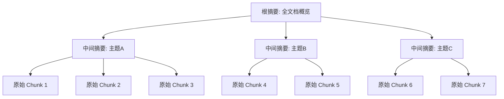
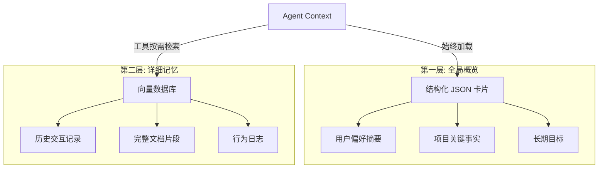

# 高级 RAG 与记忆架构

第 06 篇讲了 Context、State、Memory 的概念区分；第 13 篇讲了 Context Engineering 的系统化设计。本篇聚焦 RAG 和记忆系统的**深水区**：当基础向量检索无法满足 Agent 的知识需求时，工程上有哪些进阶方案。

---

## 1. 基础 RAG 的瓶颈

标准 RAG 流程（Split → Embed → Retrieve → Generate）在原型阶段效果不错，但投入生产后会暴露四类系统性问题：

| 瓶颈 | 表现 | 根因 |
| --- | --- | --- |
| Chunk 孤立 | 检索到的段落脱离上下文，模型无法理解其在全文中的位置 | 切分时丢弃了文档级结构 |
| 语义鸿沟 | 用户问"怎么扩容"，文档写"水平伸缩"，余弦相似度低 | Query 和 Document 用词体系不同 |
| 扁平检索 | "A 和 B 有什么关系"需要先找到 A，再找到 B，再推理——单次检索做不到 | 无法处理多跳推理 |
| 结果噪声 | Top-K 里混入语义相关但对当前问题无用的段落 | 相关性 ≠ 有用性 |

下面的方案分别针对这些瓶颈。

---

## 2. Contextual Retrieval：上下文增强检索

### 核心思想

在索引阶段，用 LLM 为每个 chunk 补充一段"上下文前缀"，描述这个 chunk 在原文档中的位置和作用。检索时，这段前缀参与 embedding 计算，让语义表示更完整。

### 实现方式


**离线预处理**：对每个 chunk，把完整文档（或足够长的上下文窗口）和该 chunk 一起送入模型，让模型输出一段 50-100 字的位置描述。

### 伪代码

```python
def contextual_retrieval_index(doc: str, chunks: list[str]) -> list[str]:
    """为每个 chunk 生成上下文前缀，拼接后入库"""
    enhanced = []
    for chunk in chunks:
        prompt = f"""<document>
{doc}
</document>

以下是文档中的一个片段：
<chunk>
{chunk}
</chunk>

请用 1-2 句话描述这个片段在整篇文档中的位置和作用。"""
        
        prefix = llm.generate(prompt)
        enhanced.append(f"{prefix}\n\n{chunk}")
    return enhanced
```

### 效果与成本

- 召回率提升 20-50%（Anthropic 公开实验数据）
- 成本集中在**离线索引阶段**，在线检索无额外开销
- 适合文档更新频率中低的场景（每次文档变更需重新生成前缀）

---

## 3. GraphRAG：基于图结构的检索

### 核心思想

将文档中的实体和关系建模为知识图谱，检索时利用图的连通性做多跳推理。

### 三步流程


**步骤详解**：

1. **实体抽取**：用 LLM 从每个 chunk 中识别命名实体（人物、概念、组件、事件）
2. **关系构建**：提取实体间关系，构建有向图（例如："微服务 A" --依赖--> "数据库 B"）
3. **图遍历检索**：用户查询时，先定位起始实体，沿关系边遍历 1-3 跳，收集相关子图作为上下文

### 适用场景

- 多实体关联查询（"项目 A 的负责人和项目 B 的技术栈有什么关系"）
- 需要聚合全局信息的问题（"整个代码库中最核心的 5 个模块是什么"）
- 组织知识管理、合规审查等需要跨文档推理的领域

### 局限

- 构建成本高：实体抽取和关系构建需要大量 LLM 调用
- 图质量强依赖抽取准确性——错误的关系会导致错误的推理路径
- 实时性差：文档更新后需要增量更新图结构

---

## 4. RAPTOR：递归摘要树

### 核心思想

将文档 chunk 按语义聚类，为每个簇生成摘要，然后对摘要再聚类、再生成上层摘要，递归形成一棵树。

### 树状结构



### 检索策略

- **自底向上**：先在叶子节点（原始 chunk）做相似度匹配，如果置信度不够，上升到父节点层级获取更宏观的信息
- **自顶向下**：先在根/中间层确定相关主题，再下钻到具体 chunk 获取细节
- **全层级搜索**：将所有层级的节点统一入库，检索时让相似度自然决定从哪个层级返回结果

### 适用场景

- 长文档理解（技术规范、法律合同、学术论文）
- 需要同时兼顾"全局视野"和"细节准确"的问答
- 用户问题粒度不确定时（可能问宏观概览，也可能问具体细节）

---

## 5. 双层记忆架构

### 设计动机

Agent 需要"认识"用户或掌握长期知识，但不能每次都把所有记忆塞进 Context。双层架构的核心是：**用低成本保持全局感知，用按需检索补充细节**。

### 架构设计



### 第一层：概览卡片

概览卡片是一个结构化的 JSON 对象，体积小（通常 < 2000 tokens），始终放在 System Prompt 或 Context 前部：

```json
{
  "user_profile": {
    "name": "张工",
    "role": "后端开发",
    "tech_stack": ["Go", "PostgreSQL", "Kubernetes"],
    "preferences": {
      "communication_style": "简洁直接",
      "code_style": "偏好函数式，避免全局状态"
    },
    "active_projects": ["order-service 重构", "监控平台迁移"]
  },
  "last_updated": "2026-07-20"
}
```

### 第二层：详细记忆

通过工具调用按需检索，只在需要时拉入 Context：

```python
@tool
def recall_memory(query: str, time_range: str = None) -> str:
    """从长期记忆中检索与 query 相关的历史信息"""
    filters = {}
    if time_range:
        filters["timestamp"] = parse_time_range(time_range)
    results = vector_store.search(query, top_k=5, filters=filters)
    return format_results(results)
```

### 工程要点

| 方面 | 第一层（概览） | 第二层（详情） |
| --- | --- | --- |
| 加载方式 | 始终注入 Context | 工具按需检索 |
| 更新频率 | 每次会话结束时更新 | 实时写入 |
| Token 开销 | 固定，可控（< 2K） | 按检索量动态增长 |
| 信息粒度 | 摘要、标签、关键事实 | 原始记录、完整上下文 |

---

## 6. 记忆评估框架

记忆系统的质量不能只看"能不能查到"，需要分层评估：

### Level 1：基本召回

> 能否找到之前明确存储过的事实？

- 测试方法：存入 N 条事实，隔一段时间后用不同措辞查询
- 指标：召回率、延迟
- 基线要求：> 95% 准确召回

### Level 2：多轮关联

> 能否跨会话关联分散的信息？

- 测试方法：在不同会话中分别提到"我在做 X"和"X 依赖 Y"，之后问"我的项目依赖什么"
- 指标：推理正确率
- 基线要求：> 80%

### Level 3：主动服务

> 能否基于记忆主动提供个性化帮助，而非被动应答？

- 测试方法：用户开始新任务时，Agent 是否主动关联历史偏好和经验
- 指标：主动建议的相关性评分（人工评估）
- 基线要求：用户认为"有帮助"的比例 > 60%


---

## 7. 记忆的隐私与遗忘

记忆系统不是越持久越好。工程上需要正面解决几个问题：

### GDPR 删除权

用户要求"删除我的所有数据"时，系统能否**真正清除**？

- 向量数据库中的 embedding 需要能按 user_id 过滤删除
- 如果概览卡片被缓存到多处，需要级联清除
- 删除后需要验证：用相同 query 检索不应再命中已删内容

### 过期策略

旧信息何时自动失效？

```python
MEMORY_TTL = {
    "user_preference": timedelta(days=180),   # 偏好半年未确认则过期
    "project_context": timedelta(days=90),    # 项目上下文 3 个月后降权
    "factual_statement": timedelta(days=365), # 事实性陈述 1 年后需要重新确认
}
```

### 选择性遗忘

用户纠正错误信息时，系统需要：

1. 标记原记忆为"已失效"（而非简单删除，保留审计链）
2. 写入新的正确记忆
3. 更新概览卡片中的相关摘要
4. 确保后续检索不再返回旧版本

### 猜测不升级为事实

一个关键设计原则：**模型的推断不能自动写入长期记忆**。

```text
用户说："我最近在学 Rust"
  -> 可以写入记忆："用户提到正在学 Rust"（有明确来源）

模型推断："用户可能对系统编程感兴趣"
  -> 不能写入记忆为事实，只能作为临时推理标签
```

只有用户明确确认或多次行为一致验证的信息，才能升级为长期事实。

---

## 小结

| 技术 | 解决的瓶颈 | 核心代价 | 适用条件 |
| --- | --- | --- | --- |
| Contextual Retrieval | Chunk 孤立 | 离线预处理 LLM 调用 | 文档更新频率中低 |
| GraphRAG | 多跳推理、全局问题 | 图构建和维护成本 | 实体关系密集的知识库 |
| RAPTOR | 细节与全局兼顾 | 递归摘要的计算量 | 长文档、粒度不确定的查询 |
| 双层记忆 | Context 容量有限 | 架构复杂度 | 长期运行的个性化 Agent |

选择方案时的决策路径：

1. 先确认基础 RAG 的瓶颈属于哪一类
2. 如果是 Chunk 孤立，优先尝试 Contextual Retrieval（成本最低）
3. 如果需要多跳推理或全局聚合，考虑 GraphRAG
4. 如果文档很长且查询粒度不确定，考虑 RAPTOR
5. 如果 Agent 需要长期记忆，设计双层架构

记忆系统的工程挑战不仅在"记住"，更在于"遗忘得体面"和"记忆有分寸"。

---

## 参考资料

- 李博杰.《深入理解 AI Agent：设计原理与工程实践》第三章. commit e3883f8c
- Anthropic. Contextual Retrieval. 2024
- Microsoft Research. GraphRAG: Unlocking LLM Discovery on Narrative Private Data. 2024
- Sarthi et al. RAPTOR: Recursive Abstractive Processing for Tree-Organized Retrieval. ICLR 2024
- Letta (MemGPT). Tiered Memory Architecture for LLM Agents. 2023
