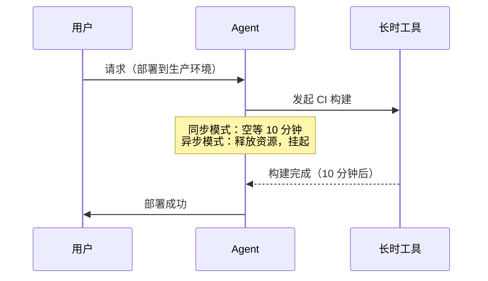
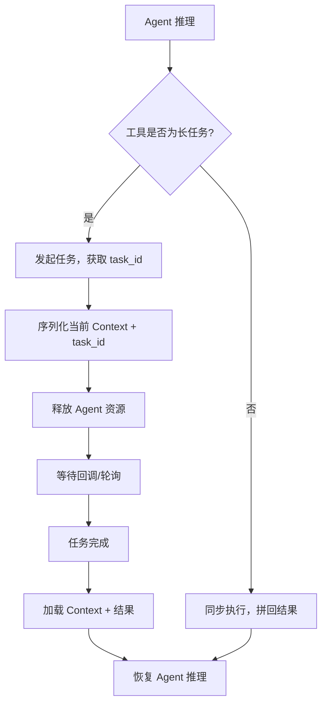
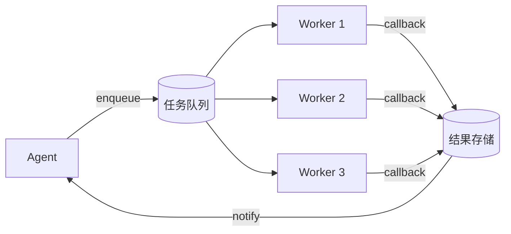
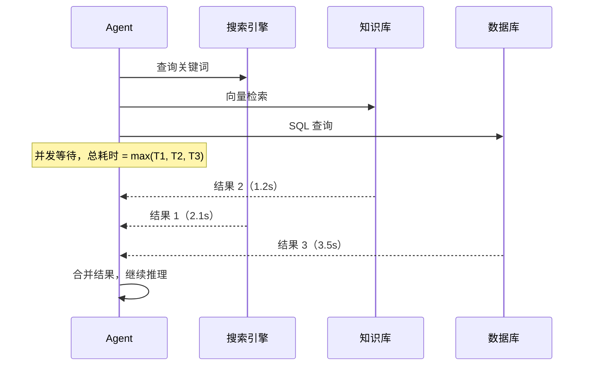
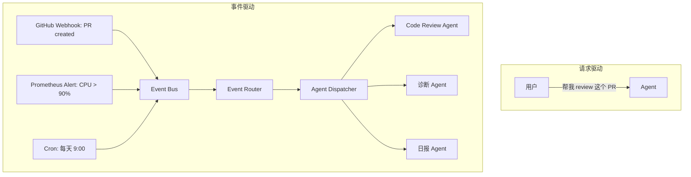
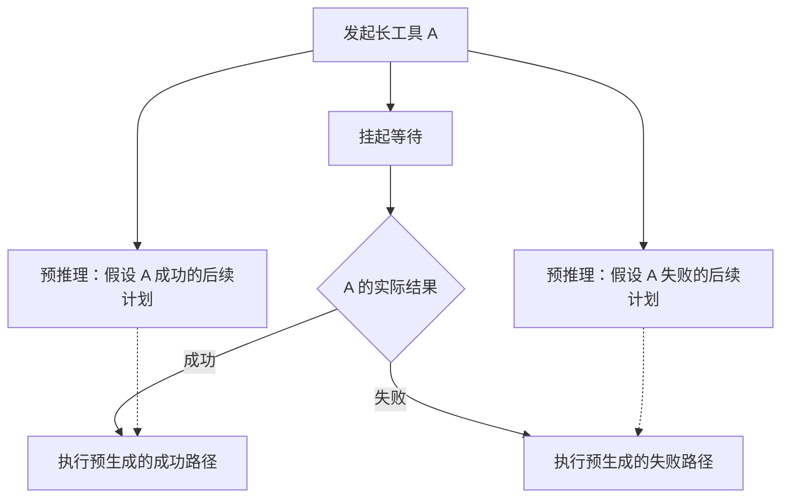
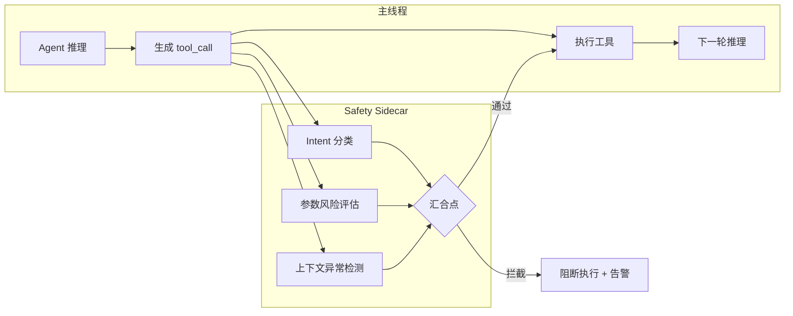
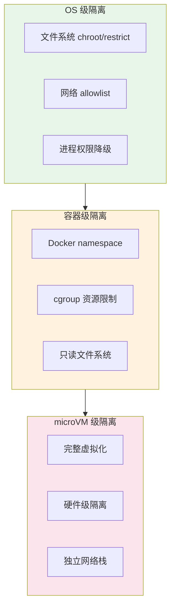
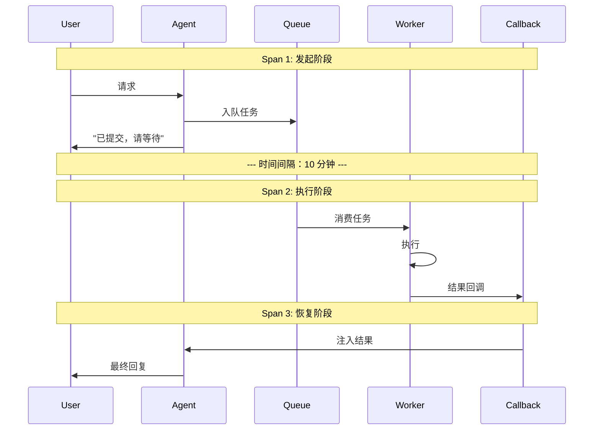

# 异步 Agent 与事件驱动架构

前面的文章（05 篇 Tool Calling、09 篇 Agent Infra）描述的都是同步场景：用户发请求，Agent 调用工具，工具几秒内返回结果，Agent 生成回复。整个链路在一个 HTTP 请求或 WebSocket 帧内闭合。

但真实系统里，工具不总是秒回的。CI/CD 构建要五分钟，人工审批要半小时，大数据 ETL 要几个小时。如果 Agent 一直等着，不仅浪费算力，还可能触发超时被杀掉。

这篇文章聚焦一个核心问题：**当工具执行时间远超模型推理时间时，Agent 架构需要怎样演进？**

## 同步模型 vs 异步现实的矛盾

LLM 的训练范式是同步的：给定输入序列，预测下一个 token。Tool Calling 协议也是同步设计：模型输出 `tool_call`，客户端执行，把 `tool_result` 拼回 messages 数组，继续下一轮推理。

这套模型隐含了一个假设：**工具执行是"瞬时"的。**

现实打破了这个假设：

| 工具类型 | 典型耗时 | 同步等待的代价 |
|---------|---------|--------------|
| 代码搜索 / 知识库查询 | 1-5 秒 | 可以接受 |
| CI 构建 / 单元测试 | 3-15 分钟 | GPU/内存空转，连接超时 |
| 人工审批 | 10 分钟 - 数小时 | 完全不可接受 |
| 大数据处理 / 模型训练 | 数小时 - 数天 | 不可能同步等待 |

矛盾的本质：LLM 是无状态的函数调用，但异步工具要求系统有持久状态来记住"我在等什么"以及"等到了之后该做什么"。



## 三种异步执行模式

### 取消-重提交模式（Cancellation-based）

最简单的异步化方式：发起长任务后，Agent 主动挂起当前执行。任务完成后，系统重新构建 Context 并恢复推理。



实现要点：

- **Context 序列化**：挂起前，完整保存 messages 数组、当前 system prompt、工具定义。恢复时原封不动地加载回来，对模型来说就像"刚返回了结果"。
- **幂等设计**：长任务可能被重复触发（比如超时重试），工具侧必须做幂等校验。
- **超时兜底**：设置最大等待时间，超时后注入 `tool_result: "timeout"` 让模型决定下一步。

适合场景：单个长工具调用、审批流、CI 触发。

### 队列模式（Queue-based）

Agent 不直接调用工具，而是把任务写入队列。独立的 Worker 消费队列、执行工具、通过回调把结果送回。



适合场景：批量操作（一次发 20 个文件转换任务）、多步工作流中的并行子任务、需要限流和背压控制的高并发场景。

优势在于解耦：Agent 不需要知道 Worker 的数量、位置和负载情况。Worker 可以独立扩缩容，Queue 提供天然的背压能力。

### 并发模式（Parallel）

多个独立工具调用同时发出，全部完成（或部分超时）后统一处理。这不是"异步"的字面含义，但它解决的问题一样：减少总等待时间。



实现上通常用 `asyncio.gather` / `Promise.all` 或类似机制。关键决策是超时策略：全部等齐还是"够用就走"（如 3 个源返回了 2 个就开始推理）。

### 三种模式对比

| 维度 | 取消-重提交 | 队列模式 | 并发模式 |
|------|-----------|---------|---------|
| 适用场景 | 单个长任务 | 批量/多步任务 | 多源信息收集 |
| 实现复杂度 | 中（需要 Context 持久化） | 高（需要队列 + Worker + 回调） | 低（语言层面原生支持） |
| 资源效率 | 高（挂起时不占资源） | 高（Worker 独立扩缩） | 中（并发等待期间占连接） |
| 故障恢复 | 需要 checkpoint | 队列天然支持重试 | 单个失败可降级 |
| 典型耗时范围 | 分钟-小时 | 分钟-天 | 秒-分钟 |

## 事件驱动 Agent

前面三种模式的共同点是：**依然由用户请求触发**。Agent 收到指令，发起异步任务，等待结果。

事件驱动 Agent 更进一步：**不需要用户主动请求，外部事件本身就是触发条件。**

### 从请求驱动到事件驱动



### 事件驱动架构的核心组件

| 组件 | 职责 | 实现选型 |
|------|------|---------|
| Event Source | 产生事件（webhook、定时器、数据库 CDC） | GitHub/GitLab webhook、CloudWatch、Kafka Connect |
| Event Bus | 事件传输和持久化 | Kafka、NATS、Redis Streams、SQS |
| Event Router | 事件过滤、路由、去重 | EventBridge Rules、自定义 router |
| Agent Dispatcher | 选择 Agent 实例、注入上下文、启动执行 | 自研调度器 |
| Execution Runtime | Agent 运行环境 | Temporal Worker、K8s Job、Lambda |

### 典型场景

**代码 PR 提交 → 自动触发 Code Review Agent：**

1. GitHub 发送 `pull_request.opened` webhook
2. Event Router 匹配规则：repo=X, files_changed 包含 .py
3. Dispatcher 启动 Code Review Agent，注入 PR diff 作为上下文
4. Agent 执行审查，结果写回 PR comment

**监控告警 → 触发诊断 Agent：**

1. Prometheus 触发 alert：某服务 P99 延迟超过 5s
2. Event Router 判断严重级别，选择对应 Agent
3. Dispatcher 注入告警详情 + 最近 15 分钟日志
4. Agent 执行诊断链路，输出根因分析报告

**定时任务 → 触发数据分析 Agent：**

1. Cron 每天 9:00 产生 `daily_report` 事件
2. Agent 拉取前一天的业务数据
3. 生成分析报告，推送到 Slack/邮件

### 和 Workflow 编排的区别

容易混淆的是：事件驱动 Agent 和 Airflow/Temporal 这类 Workflow 编排有什么区别？

| 维度 | Workflow 编排 | 事件驱动 Agent |
|------|-------------|--------------|
| 触发方式 | 预定义的 DAG/流程图 | 响应式，事件到来才启动 |
| 执行路径 | 确定性的（分支也是预定义的） | 不确定性的（LLM 动态决策） |
| 适合什么 | 步骤固定的 ETL、审批流 | 需要推理判断的开放性任务 |
| 失败处理 | 重试固定步骤 | Agent 自主选择替代方案 |

两者不互斥。常见模式是：Workflow 编排负责宏观流程，某些需要推理的节点委托给 Agent 执行。

## 连续时间推理（Continuous-time Reasoning）

同步训练的 LLM 面对异步场景，有一个根本问题：它的"思考"和"等待"不能同时进行。模型要么在推理，要么在等结果，不像人类可以"边等边想"。

### 核心技巧：预生成后续步骤

在等待 Tool A 结果时，让模型预先规划后续动作：

```text
Context 注入策略：

[当前状态]
- Tool A (CI 构建) 已发起，预计 8 分钟后返回
- Tool B (代码检查) 结果已返回：3 个 lint warning

[模型被要求做的事]
基于已有信息，预生成：
1. 如果 CI 成功，下一步做什么
2. 如果 CI 失败，下一步做什么
3. 当前已有的 lint warning 能否先处理
```

这种方式让模型在等待期间产出有价值的规划，而不是纯粹空等。

### 实现模式：Speculative Execution



注意：预推理的结果不一定能直接用。实际结果和预期可能有差异（比如 CI 失败的原因和预想不同），此时需要丢弃预推理结果，重新推理。

### Context 中的"等待状态"注入

给模型的 system prompt 或 messages 中注入时间感知信息：

```text
[系统状态快照 - 2025-03-15 14:35:00]
正在执行的异步任务：
  1. deploy_staging (已等待 3m22s / 预计总时长 8m)
  2. run_integration_tests (已等待 1m05s / 预计总时长 5m)

已完成的任务：
  1. lint_check → 通过，0 errors
  2. unit_test → 通过，覆盖率 87%

你可以：
  - 基于已完成的结果继续规划
  - 预判正在执行任务的可能结果并准备应对方案
  - 如果有不依赖当前等待任务的工作，现在就执行
```

## Safety Sidecar 模式

异步架构引入一个安全问题：如果 Agent 的决策和安全检查是串行的，延迟会翻倍。

### 传统串行安全检查

```text
Agent 决策 (200ms) → 安全检查 (150ms) → 执行工具 (Xms)
总额外延迟：350ms per tool call
10 次工具调用：3.5s 额外延迟
```

当 Agent 一次任务调用几十个工具时，串行安全检查的累积延迟就不可忽视了。

### Sidecar 并行架构



关键设计：Agent 主线程和 Safety Sidecar 并行启动，在**执行前**汇合。如果 Sidecar 的判断快于工具执行的准备阶段，就不会增加额外延迟。

### Sidecar 的判断维度

| 维度 | 检查内容 | 示例 |
|------|---------|------|
| Intent Classification | 工具调用的意图是否和用户原始请求一致 | 用户问天气，Agent 却调用了支付接口 |
| Parameter Risk | 参数值是否在安全范围内 | 删除操作的 scope 是 "all" 而非特定 ID |
| Context Anomaly | 当前调用链是否偏离正常模式 | 前 3 次都是查询，突然变成写入操作 |
| Rate Anomaly | 调用频率是否异常 | 同一工具 1 秒内被调用 50 次 |

Sidecar 本身可以是一个轻量 LLM（如 Haiku 级别），也可以是基于规则的分类器。选择取决于延迟预算：规则引擎 <5ms，轻量 LLM 50-100ms。

## 工具执行的安全隔离

异步执行的工具往往涉及副作用（写文件、发请求、操作数据库）。隔离级别决定了工具"能伤害多大范围"。

### 三层隔离



### 隔离级别对比

| 维度 | OS 级 | 容器级 | microVM 级 |
|------|-------|-------|-----------|
| 启动时间 | 无额外开销 | 100ms-1s | 1-5s |
| 内存开销 | 无 | 20-50MB | 128MB+ |
| 隔离强度 | 弱（共享内核） | 中（共享内核但 namespace 隔离） | 强（独立内核） |
| 逃逸风险 | 高 | 中（内核漏洞可逃逸） | 低 |
| 适合工具 | 只读查询、计算型工具 | 文件读写、网络请求 | 任意代码执行、不可信插件 |
| 典型实现 | seccomp, AppArmor | Docker, gVisor | Firecracker, Cloud Hypervisor |

### 选择依据

决策树：

1. 工具是否执行用户提供的代码？ → 是：microVM
2. 工具是否有网络或文件系统副作用？ → 是：容器级
3. 工具是否为纯计算/只读查询？ → 是：OS 级或无隔离

实际工程中，常见做法是对工具打"信任标签"：

```text
tools:
  - name: web_search
    trust_level: high      # 无副作用，OS 级即可
    isolation: os

  - name: run_python
    trust_level: low       # 执行任意代码
    isolation: microvm
    resource_limits:
      cpu: 1 core
      memory: 512MB
      timeout: 30s
      network: deny

  - name: write_file
    trust_level: medium    # 有副作用但受控
    isolation: container
    resource_limits:
      writable_paths: ["/workspace/output"]
      network: allow_list: ["internal-api.company.com"]
```

## 异步系统的可观测性挑战

同步系统的 trace 是一条连续的线：请求进来，处理完成，响应出去。异步系统的 trace 被时间打断了。

### 问题：断裂的 Trace



三个 Span 在时间上可能相隔几分钟到几小时，但逻辑上是同一个任务。如果没有关联机制，调试时根本找不到它们之间的关系。

### 解决方案：Correlation ID

每个异步任务在发起时生成唯一的 `correlation_id`，贯穿整个生命周期：

```text
{
  "correlation_id": "task_abc123",
  "trace_id": "trace_xyz",
  "spans": [
    {"phase": "initiate", "timestamp": "14:00:00", "duration": "200ms"},
    {"phase": "execute",  "timestamp": "14:08:32", "duration": "45s"},
    {"phase": "resume",   "timestamp": "14:09:17", "duration": "1.2s"}
  ],
  "total_wall_time": "9m17s",
  "total_compute_time": "46.4s"
}
```

区分 `wall_time`（用户视角的总等待时间）和 `compute_time`（实际消耗计算资源的时间），这对成本归因至关重要。

### 事件驱动系统的特有挑战

| 挑战 | 表现 | 应对 |
|------|------|------|
| Dead Letter Queue | 事件处理失败 N 次后进入 DLQ，无人处理 | DLQ 深度监控 + 告警，定期人工审查 |
| 事件乱序 | 网络延迟导致事件到达顺序和发生顺序不一致 | 事件携带时间戳 + 序列号，消费端排序 |
| 重复投递 | At-least-once 语义导致同一事件被处理多次 | 消费端幂等设计，用 event_id 去重 |
| 事件风暴 | 某个源突然产生大量事件，压垮下游 | 限流 + 背压 + 采样降级 |
| 因果链丢失 | 事件 A 触发了事件 B，但 trace 中看不出关联 | 事件中携带 `caused_by` 字段，构建因果图 |

### 监控仪表盘关键指标

对于异步 Agent 系统，以下指标是必须监控的：

```text
异步任务维度：
  - 排队深度（当前等待执行的任务数）
  - 排队时长 P95（任务等了多久才被消费）
  - 执行成功率（按工具类型分组）
  - 端到端延迟分布（从发起到最终完成）

事件驱动维度：
  - 事件吞吐量（按 source 和 type 分组）
  - 事件处理延迟 P95
  - DLQ 深度及增长趋势
  - Agent 触发频率和成功率
```

## 小结

- LLM 的同步推理模型和真实工具的异步执行之间存在根本矛盾，需要架构层面的方案来弥合。
- 三种异步模式各有适用场景：取消-重提交适合单个长任务，队列模式适合批量操作，并发模式适合多源信息收集。
- 事件驱动 Agent 不需要用户主动请求，由外部事件（webhook、告警、定时器）触发执行，是 Agent 从被动工具走向主动服务的关键架构演进。
- 连续时间推理通过预生成后续步骤、注入等待状态，让模型在异步等待期间仍能产出价值。
- Safety Sidecar 通过并行化安全检查避免串行延迟累积，是异步 Agent 安全架构的核心模式。
- 工具隔离分三层（OS / 容器 / microVM），根据工具的信任等级和副作用范围选择。
- 异步系统的可观测性核心是 Correlation ID：把被时间打断的多个 Span 关联为同一个逻辑任务。

## 参考资料

- 李博杰《深入理解 AI Agent：设计原理与工程实践》，[第四章](https://github.com/bojieli/ai-agent-book/blob/e3883f8cec222c31e59c646be96641120863027e/book/chapter4.md)（固定提交 `e3883f8c`，本文按自己的结构与示例重新整理）
