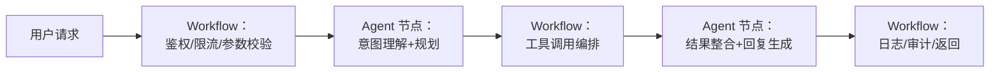
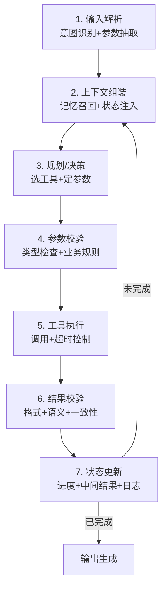
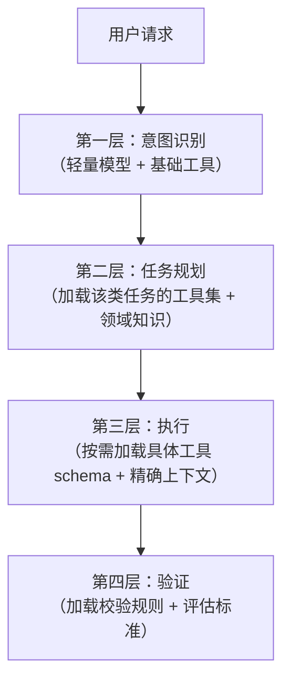
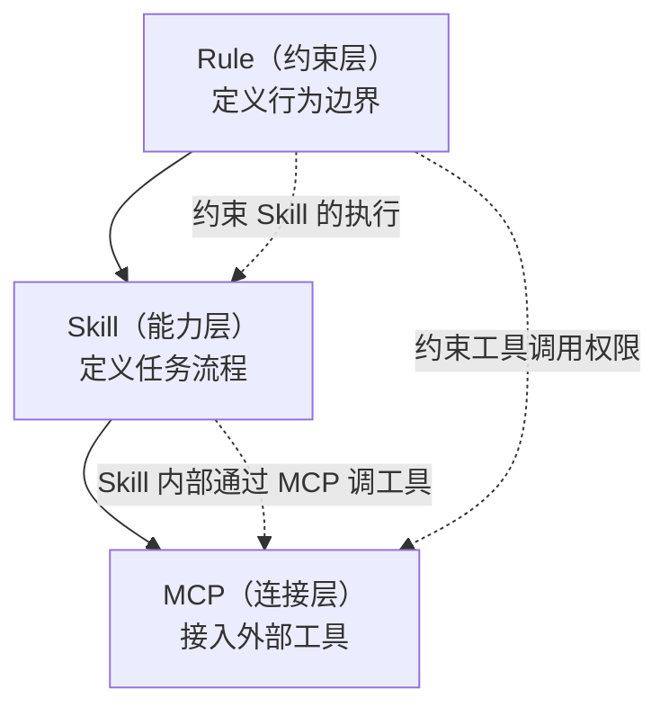
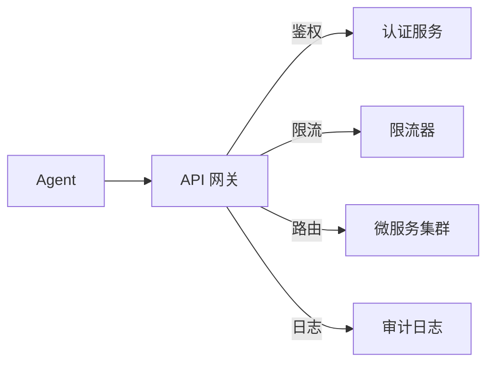
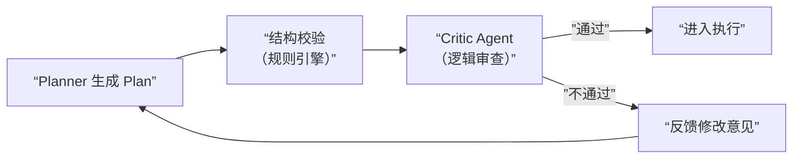
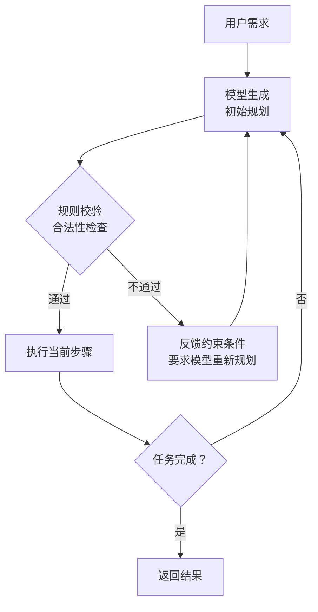
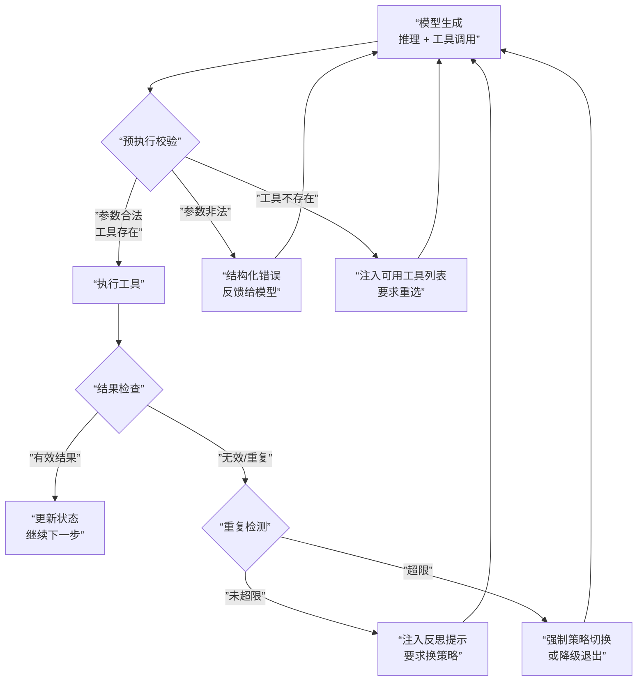
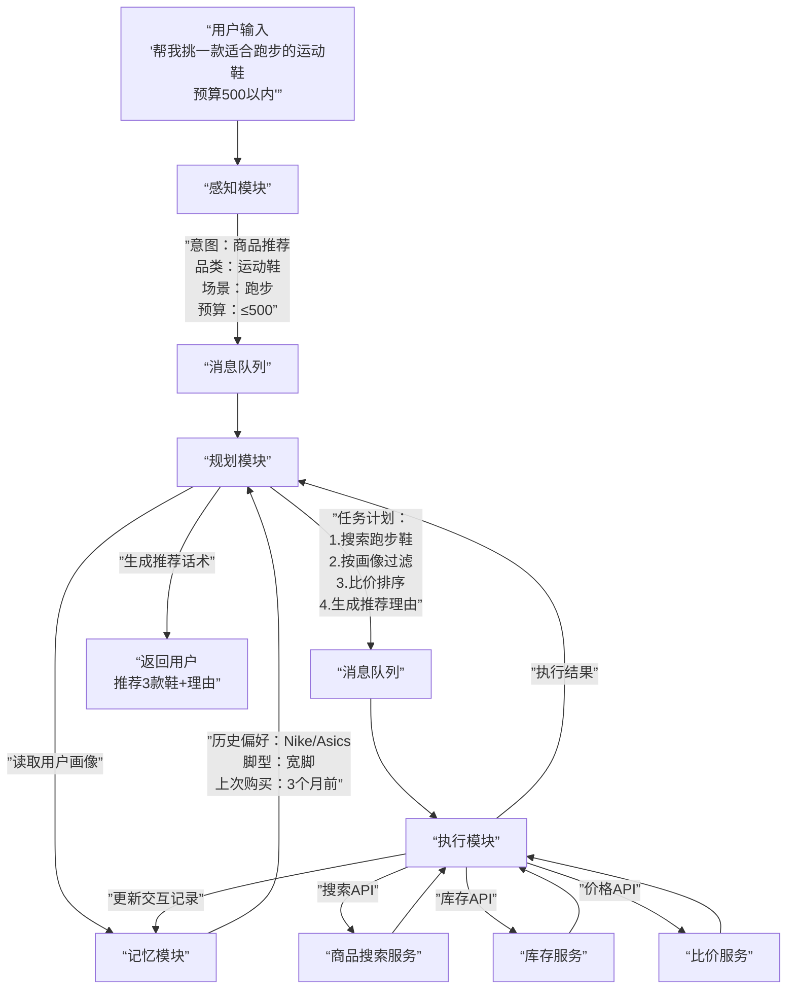

# 架构选型：ReAct、Plan-and-Execute 与 ToT 怎么选

架构选型是 Agent 面试的第一类高频题。面试官不关心你能不能背出 ReAct 的定义——他关心的是：**给你一个真实场景，你怎么选、为什么选、选完怎么落地。**

---

## Q：你用 ReAct 还是 Plan-and-Execute？为什么？

> 来源：腾讯 Agent 岗终面

**新手答**：“看情况，复杂用 ReAct，简单用 Plan。”

**高手答**：

我们按**任务不确定性**来选。流程固定的内部工具（如日报生成）用 Plan-and-Execute，省成本。面对用户的开放任务（如旅行规划）必须用 ReAct，因为用户下一秒就可能改需求。

核心技巧是在 Plan 的每个步骤里嵌入“ReAct 式检查点”——比如调用天气 API 后，自动检查返回字段是否完整，不完整立刻触发修复，而不是让整个计划崩掉。

**差距在哪**：新手只说了“看情况”，但没有给出判断标准。高手的回答有三个层次：① 明确的选择维度（任务不确定性）；② 具体的业务对应（内部工具 vs 用户任务）；③ 混合方案的工程技巧（检查点机制）。面试官要的不是“我知道这两个东西”，而是“我在实际系统里怎么选、怎么用”。

---

## Q：Tree of Thoughts (ToT) 在线上系统里能用吗？成本不高？

> 来源：腾讯 Agent 岗终面

**新手答**：“理论上可以，但成本高，一般不用。”

**高手答**：

重度 ToT 线上不能用，但**轻量化版本是杀手锏**。

我们用在“客服话术生成”上：当用户投诉时，让模型并行生成 3 条不同风格（共情、解释、补偿）的回复草稿，然后用一个非常轻量的评判模型（甚至是一组规则）快速选出一条最合适的，再继续细化。

这本质是束搜索（Beam Search），成本是单次生成的 3 倍，但换来的是回复质量质的提升，在关键场景 ROI 很高。

**差距在哪**：新手只回答了“能不能用”，结论是“不能”——这等于没回答。高手的思路是“原版不能直接用，但核心思想可以工程化降级”，并给了一个具体场景。面试官考的是“你能不能把论文里的方法落地”，这需要理解方法的本质（并行搜索 + 评估筛选）而不是只记住名字。

---

## Q：Agent 的架构设计？从系统角度来拆分

> 来源：阿里 AI Agent 开发一面

**新手答**：“用大模型接工具就行。”

**高手答**：

一个完整的 Agent 不是单独一个大模型就能跑，核心拆成四层：

1. **任务入口层**：负责接收用户问题和上下文
2. **决策层**：意图识别、任务拆解、规划、工具选择
3. **执行层**：真正去调工具、查知识库、访问服务
4. **记忆与状态层**：维护多轮上下文、历史执行结果和中间变量

如果做得再工程化一点，通常还要加一个**校验层**——模型规划出来的步骤不一定对，工具参数也可能填错，所以在执行前后都要做检查：参数合法性校验、工具返回结构校验、结果一致性校验。

Agent 正确的地方不是“能不能想”，而是“想完能不能稳定执行”。

**差距在哪**：新手把 Agent 等同于“大模型 + Prompt”。高手的回答展示了分层架构的思维——入口、决策、执行、记忆各司其职，还有校验层做兜底。面试官想看你脑子里有没有系统设计的概念。

---

## Q：Agent 在学术上由哪些部分组成？

> 来源：字节后端开发 Agent 一面

**新手答**：“大模型加上工具调用。”

**高手答**：

按学术界的主流框架（参考 Lilian Weng 的综述），Agent 由四个核心模块组成：

```text
Agent = LLM（大脑）+ Planning（规划）+ Memory（记忆）+ Tool Use（工具使用）
```

1. **LLM（大脑）**：核心推理引擎，负责理解任务、生成决策。它不等于 Agent——它是 Agent 的一个组件
2. **Planning（规划）**：把复杂任务拆解成可执行的步骤序列。包括任务分解（Task Decomposition）、自我反思（Self-Reflection）、方案修正。典型方法：Chain of Thought、Tree of Thoughts、ReAct
3. **Memory（记忆）**：分短期记忆（当前上下文窗口内的信息）和长期记忆（持久化存储的历史信息、知识、用户偏好）。短期记忆就是 in-context learning，长期记忆通常靠外部存储 + 检索
4. **Tool Use（工具使用）**：调用外部 API、数据库、搜索引擎、代码执行器等。让 Agent 能做 LLM 本身做不到的事——精确计算、实时信息获取、执行操作

进阶补充：工业界还会加两个模块——**Perception（感知）** 处理多模态输入，**Action（执行）** 管理对外部环境的操作和副作用控制。

**差距在哪**：新手只看到了“大模型 + 工具”两个组件。高手的回答基于学术框架，把 Agent 拆成四个独立模块，每个模块有明确的职责和典型方法。面试官想确认你读过核心论文，对 Agent 有结构化的认知。

---

## Q：了解过 Agent 的设计范式吗？

> 来源：字节后端开发 Agent 一面

**新手答**：“ReAct，就是边想边做。”

**高手答**：

主流的 Agent 设计范式有四种，适用场景不同：

**1. ReAct（Reason + Act）**

```text
循环：思考 → 行动 → 观察 → 思考 → 行动 → ...
```

每一步先推理下一步该做什么，执行后观察结果，再决定下一步。**灵活，适合开放性任务**，但 token 消耗大，且容易在循环中迷失方向。

**2. Plan-and-Execute**

```text
先规划：任务 → 拆解成步骤列表
再执行：逐步执行，不回头修改计划
```

先出完整计划再执行，**适合流程固定的任务**（如日报生成、数据 ETL）。省 token，但不灵活——中间出了预期外的情况没有修正机制。

**3. 反思范式（Reflexion / Self-Refine）**

```text
生成 → 评估 → 修正 → 再生成
```

生成结果后，用另一个 Prompt（或另一个模型）评估结果质量，发现不足后修正并重新生成。**适合质量要求高的场景**（代码生成、文案润色）。代价是多轮调用，延迟和成本翻倍。

**4. 多 Agent 协作范式**

```text
多个角色 Agent，各负其责，通过消息协作
```

把复杂任务拆给不同角色的 Agent——程序员、审查员、产品经理等。**适合需要多视角的复杂任务**。工程复杂度最高，需要解决通信、冲突、一致性等问题。

**实际工程中怎么选**：

```text
任务确定性高 + 流程固定  → Plan-and-Execute
任务开放 + 需要灵活应变   → ReAct
输出质量要求极高           → Reflexion
任务复杂 + 需要多视角      → 多 Agent 协作
```

大多数生产系统是**混合范式**——宏观用 Plan-and-Execute 做任务分解，微观用 ReAct 处理每个步骤，关键输出用 Reflexion 做质量检查。

**差距在哪**：新手只知道一种范式。高手列出了四种范式、各自的适用场景和代价，且指出生产系统通常是混合范式。面试官考的是你有没有对 Agent 设计范式的全局认知——不是只知道一种，而是知道多种，并且能说清楚什么场景用哪种。

---

## Q：如果让你设计一个 Agent 的规划器，怎么避免它每一步都重新规划，导致路径震荡？

> 来源：腾讯大模型应用开发二面

**新手答**：“加个缓存，记住之前的计划就行。”

**高手答**：

规划器不能每拿到一个 observation 就整体重算，不然很容易出现前一步刚决定检索、后一步又改成总结、再下一步又回去检索——整个执行路径来回抖动。

更稳的做法是把规划分成**“全局计划”和“局部调整”两层**：

1. **全局计划**只定义阶段目标，比如信息收集 → 证据检验 → 结果生成
2. **局部调整**只允许在当前阶段内微调具体动作，不回头改全局计划

另外要给 planner 一个**明确的状态表示**——当前子目标、已完成步骤、失败原因、剩余预算。如果没有状态约束，模型会把每次新 observation 当成全新任务来理解。

线上一般还会加**“重规划阈值”**，只有在关键前提失效、连续失败或者用户目标变化时才允许重新规划，日常微调不触发全局重规划。这样路径会稳定很多。

**差距在哪**：新手没有意识到路径震荡的根因——每次重规划等于丢弃之前的决策积累。高手用“全局 + 局部”两层分离解决了稳定性问题，且引入了状态表示和重规划阈值两个工程手段。面试官考的是你有没有把规划器当成一个需要工程约束的系统来设计。

---

## Q：如果模型特别擅长生成，但不擅长严格遵守流程，你会怎么把它放进一个强约束工作流里？

> 来源：腾讯大模型应用开发二面

**新手答**：“在 Prompt 里强调让模型按步骤执行。”

**高手答**：

最常见的办法是把**“生成自由度”和“流程控制权”拆开**。模型只负责局部判断和内容生成，流程推进由外部状态机控制。

比如工作流规定必须先做参数校验 → 再检索知识 → 再调用工具 → 最后生成答复。模型不能跳步，能做的只是当前节点下的判断，例如“检索关键词应该怎么改写”“看了这些证据后怎么总结”。

```text
状态机控制：参数校验 → 知识检索 → 工具调用 → 结果生成
模型负责：  每个节点内的局部判断和内容生成
```

这样一来，模型仍然发挥语言理解优势，但不会破坏整体流程。真正线上稳定的 Agent，很多都不是纯模型自治，而是**“系统控流程，模型控局部智能”**。

**差距在哪**：新手试图用 Prompt 约束模型行为——这是最弱的防线。高手的回答把流程控制权从模型手里拿走，交给外部状态机，模型只在受控的节点内发挥能力。面试官考的是你理不理解“生产级 Agent = 系统控流程 + 模型控智能”这个核心设计原则。

---

## Q：设计一个 AI Agent 爬取短视频平台内容，如何设计？

> 来源：字节 Agent 实习一面

**新手答**：“写个爬虫脚本，调 API 下载视频。”

**高手答**：

这道题考的不是爬虫技术，而是**如何用 Agent 架构解决一个复杂的端到端任务**。系统设计分四层：

**1. 任务规划层**：

- Agent 接收用户需求（如“爬取某话题下的热门视频及评论”），先做任务分解：
  - 目标页面发现 → 内容抓取 → 数据解析 → 结构化存储
- 每个子任务可能需要不同工具，规划器负责编排执行顺序和依赖关系

**2. 工具执行层**：

| 工具 | 职责 | 技术选型 |
|------|------|---------|
| 浏览器工具 | 模拟用户浏览、滚动加载、点击交互 | Playwright / Selenium |
| API 探测工具 | 抓包分析移动端 API，直接请求数据接口 | mitmproxy + requests |
| 多模态解析工具 | 视频转文字、封面 OCR、音频转录 | Whisper、PaddleOCR |
| 存储工具 | 结构化存储爬取结果 | MongoDB / S3 |

**3. 反爬对抗层**（这是核心难点）：

- **请求频率控制**：Agent 需要感知限流信号（429 状态码、验证码），自动降频或切换策略
- **身份伪装**：UA 轮换、Cookie 池、代理 IP 池。Agent 根据被封情况动态调整
- **动态渲染**：很多内容是 JS 动态加载的，需要无头浏览器渲染后再抓取
- **失败恢复**：Agent 记录爬取进度，断点续爬，不因单次失败丢失已有成果

**4. 数据质量层**：

- 去重：相同视频不同入口可能重复，按 video_id 去重
- 校验：检查视频是否下载完整、元信息是否齐全
- 合规：过滤违规内容，遵守 robots.txt 和平台 ToS

**关键设计决策**：优先走 API 接口（速度快、结构化好），API 被封时降级到浏览器模拟（慢但稳）。Agent 的价值在于**能根据反爬反馈自适应切换策略**，而不是写死一套流程。

**差距在哪**：新手只想到写爬虫脚本。高手把问题转化成一个 Agent 系统设计——任务规划、工具编排、反爬对抗、数据质量四层架构。面试官考的是你能不能用 Agent 的思维方式（规划 + 工具 + 自适应）解决一个复杂的端到端工程问题。

---

## Q：什么时候该做 Agent？和 Workflow 的边界在哪？

> 来源：Agent 开发面试 30 题

**新手答**：“需求复杂就用 Agent，简单就用 Workflow。”

**高手答**：

判断标准不是“复杂不复杂”，而是**决策路径是否在设计时可穷举**：

| 类型 | 特征 | 适合方案 |
|------|------|---------|
| 所有分支可预知 | 审批流、ETL 管线 | Workflow / 后端服务 |
| 分支可预知但语言理解复杂 | 客服分流、意图提取 | Prompt 链 |
| 分支不可穷举，需运行时决策 | 开放问答、自主任务执行 | Agent |

更精确的判断框架：

1. **决策维度是否开放**：用户输入只需分成有限几类去处理 → Workflow。用户可能提出任何要求，且处理路径取决于中间结果 → Agent
2. **是否需要运行时工具选择**：处理流程固定（先查数据库 → 再格式化 → 返回）→ Workflow。“查什么、用什么工具”要根据当前情况判断 → Agent
3. **是否需要自我修正**：Workflow 出错只能按预设路径降级。Agent 能根据错误原因调整策略——这是核心区别

**Agent 和 Workflow 的本质区别**：Workflow 是“编排”——设计者画好流程图，系统按图执行。Agent 是“委托”——给一个目标，让系统自己决定怎么达成。Workflow 的确定性更高，Agent 的灵活性更高。

大部分真实需求的答案是：**用 Workflow 做主干流程控制，在需要灵活判断的节点嵌入 Agent**。纯 Agent 系统太不可控，纯 Workflow 系统太僵化。

**差距在哪**：新手用“复杂度”做判断，但复杂的 ETL 也可以是 Workflow。高手用“决策路径可否穷举”这个精确标准，且给出了三个具体判断维度和两者的本质区别。面试官考的是你选方案时有没有明确的决策框架。

---

## Q：为什么很多团队做到最后是“Workflow + Agent 节点”的混合架构？

> 来源：Agent 开发面试 30 题

**新手答**：“因为纯 Agent 不够稳定。”

**高手答**：

不是 Agent“不够好”，是**不同环节对确定性的要求不同**。一个完整的业务流程里，80% 的步骤是确定性的（权限校验、数据查询、格式转换），只有 20% 需要智能判断（意图理解、方案推荐、自然语言生成）。

如果全用 Agent：
- 确定性步骤被模型处理 → 偶尔出错，不如规则可靠
- 成本翻倍 → 每个确定性步骤都消耗 token，毫无必要
- 可测试性差 → 模型输出概率性的，同样输入不一定同样输出



混合架构的原则是：**确定性环节用 Workflow（可靠、可测、低成本），不确定性环节用 Agent（灵活、智能）**。Agent 节点像状态机里的“智能节点”——系统控制它何时被调用、输入什么、输出约束是什么，但节点内部允许模型自由推理。

这也解释了为什么纯 Agent 创业项目容易死——不是技术不行，是把本该确定性处理的东西也交给了模型，导致系统整体可靠性无法保证。

**差距在哪**：新手只说了“不稳定”。高手分析了根因——不同环节对确定性的要求不同，且给出了 80/20 的量化认知和混合架构的设计原则。面试官考的是你有没有把 Agent 从 Demo 推到生产的实战认知。

---

## Q：Agent 系统里，模型和系统代码的职责边界怎么划？

> 来源：Agent 开发面试 30 题

**新手答**：“模型负责思考，代码负责执行。”

**高手答**：

方向对但太粗。精确的边界划分：

**模型负责的**（需要语言理解/生成/推理的）：
- 意图识别：理解用户到底想做什么
- 参数抽取：从自然语言中提取结构化参数
- 方案选择：在多个可行路径中选最优的
- 内容生成：自然语言回复、代码、摘要

**系统代码负责的**（需要确定性保证的）：
- 流程控制：任务状态机、步骤编排、超时管理
- 参数校验：类型检查、范围约束、必填项检查
- 权限管控：工具访问控制、操作审批
- 状态持久化：中间结果存储、断点恢复
- 安全兜底：输出过滤、敏感信息脱敏、成本熔断

**核心原则：永远不要让模型做它不擅长的事——精确计算、状态维护、流程控制、安全决策**。

一个简单的验证标准：如果这个环节出错后果严重且不可接受 → 系统代码负责。如果这个环节出错可以通过重试/降级补救 → 可以交给模型。

**差距在哪**：新手的“思考 vs 执行”太笼统。高手把两者的职责列表拉出来对比，且给出了一个实用的验证标准（出错后果是否可接受）。面试官考的是你能不能精确划分系统设计中的职责边界。

---

## Q：如果面试官说“Agent 本质上就是套壳调用工具”，你怎么反驳？

> 来源：Agent 开发面试 30 题

**新手答**：“不是套壳，Agent 更智能。”

**高手答**：

这句话的逻辑类似于说“操作系统就是套壳调硬件”——技术上没错，但忽略了**中间层的价值**。

“套壳调工具”只描述了 Agent 的最表层行为（接收输入 → 调工具 → 返回结果），但 Agent 的核心价值在于三个“套壳”做不到的能力：

1. **动态规划**：不是“收到请求 → 调固定工具 → 返回”，而是“理解意图 → 拆解任务 → 根据中间结果动态选择下一步”。一个订机票的 Agent 可能需要先查航班 → 发现满了 → 改查临近日期 → 发现价格高 → 问用户是否接受 → 最终下单。这个决策链在设计时不可穷举
2. **自我修正**：调工具失败后不是报错，而是分析失败原因、换一个工具或调整参数重试。这种“错了知道怎么补救”的能力是纯工具链做不到的
3. **上下文推理**：能把多轮对话、用户画像、当前任务状态综合起来做决策，而不是每次请求都是无状态的

API Wrapper 是确定性的——同样输入永远同样输出。Agent 是概率性的但有推理能力——面对未见过的输入也能给出合理响应。这个区别就像“if-else 路由器”和“有经验的客服”的区别。

**差距在哪**：新手的反驳苍白无力。高手从动态规划、自我修正、上下文推理三个具体能力点说明 Agent 不是“套壳”，且用“操作系统 vs 硬件”类比让论证更有力。面试官用这种挑衅式问题考的是你对 Agent 的理解有多深。

---

## Q：生产级 Agent 的执行循环包含哪些阶段？哪些必须显式状态化？

> 来源：Agent 开发面试 30 题

**新手答**：“就是思考 → 行动 → 观察的循环。”

**高手答**：

ReAct 的“思考 → 行动 → 观察”只是学术简化。生产级 Agent 的执行循环至少包含**七个阶段**：



**哪些必须显式状态化**（不能靠模型上下文承载）：

| 必须状态化的 | 原因 |
|------------|------|
| 当前执行阶段 | 断点恢复、异常重入 |
| 已完成步骤和结果 | 防止重复执行 |
| 累计 token / 调用次数 | 成本控制和熔断 |
| 失败次数和失败原因 | 决定重试/降级/终止 |
| 用户确认的关键约束 | 防止被后续上下文淹没 |

**不需要状态化的**：模型的中间推理过程、工具返回的原始 JSON（提取关键字段后可丢弃）。

核心认知：**学术论文里的 Agent 循环是三步（think-act-observe），生产级的是七步，多出来的四步（输入解析、参数校验、结果校验、状态更新）全是工程防线**。没有这四步，Agent 能跑 Demo 但上不了生产。

**差距在哪**：新手只知道 ReAct 三步循环。高手展示了生产级的七阶段循环，且明确了哪些状态必须显式持久化——这是“做过”和“听过”的本质区别。面试官考的是你对生产级 Agent 工程化的理解深度。

---

## Q：什么样的任务适合先全局规划再执行，什么样的任务更适合边走边决策？

> 来源：Agent 开发面试 30 题

**新手答**：“简单任务边走边做，复杂任务先规划。”

**高手答**：

不是“简单 vs 复杂”，而是**任务的信息完备度和可预测性**：

**适合先规划再执行（Plan-and-Execute）**：
- 任务目标明确、步骤可预知：日报生成、数据 ETL、固定流程的表单填写
- 所有需要的信息在开始时就已具备
- 步骤之间有强依赖，必须按顺序执行
- 关键特征：**开始时就能画出完整的流程图**

**适合边走边决策（ReAct）**：
- 下一步取决于上一步的结果：故障诊断、信息调研、开放式对话
- 用户可能随时改变需求
- 中间步骤可能失败，需要动态调整路线
- 关键特征：**开始时画不出完整流程图，因为分支取决于运行时的数据**

**混合策略**（实际生产中最常见）：先做一次粗粒度规划（定义 3-5 个阶段目标），每个阶段内部用 ReAct 灵活执行。阶段目标变化时才触发重规划，不是每步都重规划。

```text
粗规划：信息收集 → 方案对比 → 用户确认 → 执行操作
每个阶段内部：ReAct（边做边调整）
重规划触发：用户改需求 / 关键前提失效 / 连续失败
```

**差距在哪**：新手用“简单 vs 复杂”做判断——但“简单”的信息调研可能需要边走边做，“复杂”的 ETL 反而适合先规划。高手用“信息完备度”和“可预测性”两个维度做判断，且给出了混合策略。面试官考的是你在选执行策略时有没有清晰的判断标准。

---

## Q：现在的 Agent 架构和之前有什么本质不同？渐进式披露是什么思路？

> 来源：蚂蚁集团 Agent 开发二面

**新手答**：“现在用更强的模型了。”

**高手答**：

Agent 架构正在经历从**“一次性全量加载”到“渐进式按需披露”**的范式转变。

**之前的架构思路——全量预加载**：

系统启动时就把所有工具、所有知识、所有规则一次性塞进上下文。Agent 拿到全部信息后做决策。

问题：① 上下文爆炸——100 个工具的 schema 占掉大半窗口；② 信息干扰——和当前任务无关的工具描述反而影响模型判断；③ 不可扩展——工具或知识增长后系统无法线性扩展。

**现在的架构思路——渐进式披露（Progressive Disclosure）**：

不预加载所有信息，而是**根据任务进展逐步暴露相关能力**。Agent 在每个阶段只看到当前阶段需要的工具、知识和规则：



**关键设计原则**：

1. **按需加载工具**：不是一次性给模型 100 个工具，而是先给 5-8 个工具大类，选中大类后再展开具体工具
2. **上下文随阶段演化**：规划阶段看全局信息，执行阶段只看当前步骤的精确上下文，验证阶段切换到评估视角
3. **能力逐级升级**：简单请求用小模型 + 少量工具处理；判断需要更强能力时才升级到大模型 + 完整工具集

**和传统分层架构的区别**：传统分层是静态的——每层负责什么在设计时就定死了。渐进式披露是动态的——**每层暴露什么取决于运行时的任务状态**。同一个请求，在不同执行阶段看到的“系统”是不一样的。

这也是为什么上下文工程成为 2026 年 Agent 开发的核心挑战——不是“怎么把信息塞进去”，而是“怎么在正确的时机给出正确的信息”。

**差距在哪**：新手只看到了模型变化。高手理解了架构范式的本质转变——从全量预加载到渐进式按需披露。面试官考的是你对 Agent 架构演进方向的认知，以及你理不理解“上下文不是越多越好”这个核心洞察。

---

## Q：Skill、MCP、Rule 三者有什么区别？

> 来源：蚂蚁集团一面

**新手答**：“都是给 Agent 加功能的方式吧。”

**高手答**：

三者解决的是 Agent 系统中**不同层次的扩展问题**，看起来都是“给 Agent 加东西”，但职责完全不同：

| 概念 | 本质 | 解决什么问题 | 类比 |
|------|------|------------|------|
| **Rule** | 行为约束规则 | Agent 什么能做、什么不能做 | 公司制度 / 安全规范 |
| **Skill** | 可复用的能力模块 | Agent 怎么做某类特定任务 | 员工的专业技能 / SOP |
| **MCP** | 工具连接协议 | Agent 怎么接入外部工具和数据 | USB 接口标准 |

**Rule（规则/约束）**：

定义 Agent 的行为边界和决策偏好。不是“能力”，而是“约束”：

```text
Rule 示例：
- 禁止执行 rm -rf 命令
- 回答必须使用中文
- 代码修改前必须先读取文件
- 敏感操作需要用户确认
```

Rule 通常写在配置文件中（如 CLAUDE.md），在每次对话中持续生效。它约束的是 Agent 的**所有行为**，不绑定特定任务。

**Skill（技能模块）**：

封装了完成某类特定任务的完整流程——包括步骤定义、输入输出格式、注意事项、甚至子工具的组合使用方式：

```text
Skill 示例：
- "代码审查"技能：定义了审查流程、检查维度、输出格式
- "文章写作"技能：定义了写作风格、结构模板、质量标准
- "面试题分类"技能：定义了分类维度、插入格式、来源标注规范
```

Skill 是**按需激活**的——用户触发特定任务时才加载。它解决的是“同类任务每次都要从头教 Agent 怎么做”的问题。

**MCP（Model Context Protocol）**：

标准化的工具连接协议。解决的不是“怎么用工具”，而是“怎么发现和接入工具”：

```text
MCP 示例：
- 数据库 MCP Server：暴露 query、insert、update 等工具
- GitHub MCP Server：暴露 create_pr、list_issues 等工具
- 搜索 MCP Server：暴露 web_search、image_search 等工具
```

MCP 的价值是**标准化**——任何工具只要实现 MCP 协议，任何 Agent 都能即插即用，不需要为每个工具写适配代码。

**三者的协作关系**：



Rule 是最上层的约束，贯穿所有行为；Skill 在 Rule 的约束下定义任务流程；Skill 内部通过 MCP 调用具体工具。三者不是平行关系，而是**约束 → 能力 → 连接的层次关系**。

**差距在哪**：新手把三者混为一谈。高手从“约束 / 能力 / 连接”三个层次清晰区分了三者的职责，且说明了它们的层次关系和协作方式。面试官考的是你对 Agent 系统扩展机制的架构理解——不是“都能加功能”，而是“在不同层次解决不同问题”。

---

## Q：微服务怎么接入一个 Agent 系统？

> 来源：蚂蚁集团一面

**新手答**：“Agent 调微服务的 API 就行。”

**高手答**：

“调 API”只是最表面的一层。微服务接入 Agent 系统要解决**发现、适配、治理**三个层面的问题：

**1. 服务发现与注册（Agent 怎么知道有哪些微服务可用）**

不能把所有微服务的 API 文档硬编码在 Agent 的 Prompt 里——微服务会增删改。需要一个**动态的工具注册中心**：

```text
微服务 A 注册：
  name: "订单查询服务"
  capabilities: ["查询订单状态", "查询订单详情", "查询历史订单"]
  endpoint: "order-service.internal:8080"
  schema: OpenAPI 3.0 spec
  auth: Bearer Token
  rate_limit: 100 RPM
```

Agent 在需要时从注册中心按能力描述检索合适的服务，而不是预加载所有服务。这就是 MCP 协议在解决的问题——用标准化的方式让 Agent 发现和调用工具。

**2. 协议适配（微服务的接口怎么变成 Agent 能理解的工具）**

微服务的 REST/gRPC 接口和 Agent 的工具调用接口之间需要**适配层**：

| 微服务侧 | 适配层处理 | Agent 侧 |
|---------|-----------|---------|
| REST API + JSON | 转换成 Tool Schema | function calling 参数 |
| gRPC + Protobuf | 序列化/反序列化 | 结构化输入输出 |
| 复杂嵌套参数 | 简化 + 文字描述 | 模型可理解的扁平参数 |
| 技术性错误码 | 翻译成自然语言 | 模型可推理的错误信息 |

关键：适配层不只是格式转换，还需要**把技术概念翻译成模型能理解的语义描述**。比如微服务返回 `{"code": 40301, "msg": "insufficient_balance"}`，适配层要翻译成“用户余额不足，无法完成支付”。

**3. 治理（接入后怎么保证稳定可控）**



- **鉴权**：Agent 调微服务不能用同一个“超级 Token”，应该按任务类型分发不同权限的临时凭证
- **限流**：Agent 可能短时间内高频调用某个服务（比如循环查询），需要在网关层做 Agent 维度的限流
- **熔断**：某个微服务不可用时，Agent 不能死等，需要快速感知并切换策略
- **可观测**：每次调用的入参、出参、延迟、状态码都要记录，方便排查 Agent 行为异常时的根因

**差距在哪**：新手只想到”调 API”。高手从服务发现、协议适配、运行治理三层说清了微服务接入 Agent 的完整方案，且指出了”语义翻译”和”Agent 维度限流”这两个 Agent 系统特有的难点。面试官考的是你能不能把传统微服务架构的经验迁移到 Agent 系统中。

---

## Q：如何保证规划 Agent plan 的结果正确？

> 来源：AI 工程师面试

**新手答**：”让模型多想想，加个 CoT 就行。”

**高手答**：

Plan 的正确性不能只靠模型”想得好”，要从**事前约束、事中校验、事后修正**三个阶段建立保障机制：

**事前——约束 Plan 的输出质量**：

1. **Structured Output**：强制模型以 JSON 格式输出 plan，每个步骤必须包含 `step_id`、`action`、`tool`、`expected_output`、`dependencies`。格式约束本身就能过滤掉”一句话笼统计划”
2. **Few-shot 示范**：在 Prompt 中给出 2-3 个高质量的 plan 示例，让模型学到正确的粒度和结构
3. **领域知识注入**：把当前任务相关的工具列表、能力边界、业务规则注入上下文，避免模型规划出”做不到的步骤”

**事中——引入 Critic 校验**：

4. **Critic Agent**：用另一个模型（或同一个模型不同 Prompt）审查 plan，检查逻辑一致性、步骤可执行性、是否有遗漏
5. **规则校验器**：用代码检查 plan 的结构合法性——步骤依赖是否成环、引用的工具是否存在、参数是否完整



**事后——执行中反馈修正**：

6. **Self-Reflection**：每个步骤执行完后，检查实际结果和 plan 预期是否一致，不一致时触发局部修正
7. **Re-plan 机制**：当关键前提失效（如某个工具不可用、用户改了需求）时，允许重新规划，但保留已完成步骤的成果
8. **Plan 版本管理**：每次修改 plan 都保存历史版本，方便回溯和复盘

核心认知：**Plan 的正确性不是一次生成就能保证的，而是通过”生成 → 审查 → 执行 → 反馈 → 修正”的闭环逐步收敛的**。只靠 Prompt 调优永远不够，必须有外部校验机制。

**差距在哪**：新手只想到让模型”想清楚”——这是最弱的保障。高手从事前（格式约束 + Few-shot + 知识注入）、事中（Critic + 规则校验）、事后（反馈修正 + Re-plan）三个阶段构建了完整的 Plan 质量保障体系。面试官考的是你对规划可靠性的工程化认知。

---

## Q：规划完成后需要人工介入修改大纲，SSE 怎么实现这种 Human-in-the-Loop？前端怎么让用户输入？

> 来源：AI 工程师面试

**新手答**：”弹个输入框让用户改就行。”

**高手答**：

这道题考的是**Human-in-the-Loop（HITL）的工程实现**——Agent 执行到某个节点时暂停，等待人类输入后再继续。核心挑战是：后端是异步流式的（SSE），前端需要在正确的时机切换到”等待用户输入”状态。

**后端实现（以 LangGraph 为例）**：

LangGraph 原生支持 `interrupt_before` 机制——在指定节点执行前暂停 graph，等待外部输入：

```python
graph = create_graph()
# 在 search_node 之前中断，等待人工确认/修改大纲
app = graph.compile(
    checkpointer=checkpointer,
    interrupt_before=[“search_node”]
)
```

执行流程：

```mermaid
flowchart TB
    A[“Plan Agent 生成大纲”] --> B[“触发 interrupt_before”]
    B --> C[“SSE 推送暂停事件\n{type: 'interrupt', data: outline}”]
    C --> D[“前端展示大纲\n+ 编辑器”]
    D --> E[“用户修改大纲\n提交”]
    E --> F[“POST /resume\n携带修改后的大纲”]
    F --> G[“graph.update_state()\n注入用户修改”]
    G --> H[“graph.stream(None, config)\n从断点继续执行”]
```

关键 API 调用：

```python
# 1. 用户修改后，更新 graph 状态
graph.update_state(
    config,
    {“outline”: user_modified_outline},
    as_node=”plan_node”  # 以 plan_node 的身份写入状态
)

# 2. 传入 None 表示从上次中断处继续
for event in graph.stream(None, config):
    send_sse_event(event)
```

**SSE 通信协议设计**：

后端通过 SSE 推送不同类型的事件，前端根据事件类型切换 UI 状态：

```text
event: node_output      # 普通节点输出，前端展示流式内容
data: {“node”: “plan”, “content”: “...”}

event: interrupt         # 中断事件，前端切换到编辑模式
data: {“node”: “plan”, “outline”: [...], “editable”: true}

event: resumed           # 恢复执行，前端切回流式展示模式
data: {“node”: “search”}
```

**前端交互设计**：

1. **监听 SSE 事件流**：收到 `interrupt` 事件时，停止流式展示，渲染大纲编辑器
2. **用户编辑并提交**：提交时调用 `POST /resume` 接口，携带修改后的大纲和当前 `thread_id`
3. **恢复流式展示**：收到 `resumed` 事件后，前端切回流式输出模式，继续展示后续节点的输出

核心认知：**HITL 不是简单的”弹窗确认”，而是后端状态暂停 + 前端模式切换 + 状态注入恢复的完整链路**。LangGraph 的 `interrupt_before` + `update_state` + `stream(None)` 三板斧是标准实现。

**差距在哪**：新手只想到前端交互。高手从后端中断机制（interrupt_before）、SSE 事件协议设计、前端状态切换、恢复执行（update_state + stream(None)）四个环节说清了完整的 HITL 实现方案。面试官考的是你对 Agent 系统中”人机协作”的全链路工程化理解。

---

## Q：Agent 的任务规划是怎么做的？规划由模型完成还是规则实现？

> 来源：快手 AI Agent 开发一面

**新手答**：“让模型自己决定每一步做什么。”

**高手答**：

生产级 Agent 的规划**几乎都是模型 + 规则的混合架构**，纯模型或纯规则都有致命缺陷：

| 方案 | 优势 | 缺陷 | 适用场景 |
|------|------|------|---------|
| 纯模型规划（ReAct） | 灵活，能处理新任务 | 不可控，可能跑偏 | 探索性任务、开放域 |
| 纯规则规划（状态机） | 确定性强，行为可预测 | 僵化，无法处理意外 | 流程固定的业务场景 |
| **混合架构** | 灵活性 + 可控性 | 设计复杂度高 | 生产环境首选 |

**混合架构的典型做法**：

```text
规则层：定义任务的主干流程（必经节点、禁止操作、超时限制）
模型层：在规则允许的范围内，负责子任务拆解和具体决策
验证层：每步规划结果经过规则校验后才执行
```



**多工具调用时如何决定调用顺序**：

1. **显式依赖**：工具 B 的输入依赖工具 A 的输出 → A 必须先执行，由 DAG（有向无环图）描述依赖关系
2. **无依赖并行**：工具之间无数据依赖 → 并行执行，总延迟取最慢的那个
3. **模型推理**：依赖关系不明确时，让模型根据任务上下文判断调用顺序，但要加防护——限制最大步数、禁止循环调用

```text
工程实践：先用规则解析工具间的硬依赖（参数传递关系），
再用模型判断软依赖（逻辑上应该先查天气再推荐穿搭），
无依赖的全部并行
```

**工具调用失败的处理**：

| 失败类型 | 处理策略 |
|---------|---------|
| 网络超时/5xx | 指数退避重试（最多 2 次） |
| 参数错误/4xx | 让模型分析错误信息，修正参数后重试 |
| 工具不可用 | 切换到备选工具（如主搜索引擎挂了切备用） |
| 多次失败 | 跳过该步骤，用已有信息给出部分结果，告知用户“XX 信息暂时无法获取” |

**差距在哪**：新手把规划全交给模型——这在生产中不可控。高手用”模型规划 + 规则校验”的混合架构，在灵活性和安全性之间找到了平衡。多工具调用有 DAG 依赖分析 + 并行优化，失败有分类处理策略。面试官考的是你能不能设计一个既灵活又可控的规划系统。

---

## Q：在”推理-行动”循环中，如何设计来纠正逻辑塌缩或无效工具调用？

> 来源：淘天 AI Agent 一面

**新手答**：”失败了就重试，多试几次总能成功。”

**高手答**：

先定义两个核心问题：

- **逻辑塌缩**：模型在推理-行动循环中陷入局部最优——反复用同一个工具、重复相同的推理模式、或者在同一组参数上死循环。本质是模型的”思维多样性”丧失了
- **无效工具调用**：选错工具、参数填错、调用了不存在的工具、或者工具返回了错误但模型没有正确处理

我们的纠正体系分**三层**：实时检测、主动干预、结构预防。

**第一层：实时检测**

```text
检测信号：
① 重复检测：连续 N 步（通常 N=3）选择同一个工具或生成相似的推理文本
② 无进展检测：执行了 K 步但任务状态没有实质变化（用状态哈希判断）
③ 工具调用异常率：最近 M 次调用中失败率超过阈值（如 >60%）
④ 推理深度超限：总步数超过预设上限（根据任务复杂度动态调整）
```

**第二层：主动干预**

检测到异常后，不是简单重试，而是根据异常类型采取不同策略：

| 异常类型 | 干预策略 |
|---------|---------|
| 逻辑塌缩（重复工具） | 强制排除最近使用的工具，注入”请换一种方法”的反思提示 |
| 逻辑塌缩（推理打转） | 注入任务进度摘要 + 已尝试方法列表，要求模型重新审视目标 |
| 参数错误 | 结构化错误信息反馈：将工具的参数 schema 和实际传入值一起喂给模型 |
| 工具不存在 | 将可用工具列表重新注入上下文，附带每个工具的功能摘要 |
| 多次失败 | 触发”策略切换”：暂停当前子任务，尝试替代路径或降级方案 |

**第三层：结构预防**

从架构上减少塌缩和无效调用的概率：



**预防机制的关键设计**：

1. **工具调用前置校验**：在调用工具之前，用 JSON Schema 校验参数格式和取值范围，拦截明显错误
2. **多样性约束**：在工具选择时引入”最近 N 步不重复”的软约束，降低塌缩概率
3. **错误分类与结构化反馈**：不是把原始报错扔给模型，而是分类后构造”错误原因 + 建议修正方向”的结构化提示
4. **全局进度追踪**：维护一个任务状态快照，每步执行后更新，模型能看到”已完成什么、还差什么”，减少无意义重复

**差距在哪**：新手只会”失败重试”——这是最低级的容错，对逻辑塌缩完全无效（重试只会重复同样的错误）。高手有检测、干预、预防三层体系：检测层识别异常模式，干预层按异常类型精准应对，预防层从架构上降低问题发生的概率。面试官考的是你对 ReAct 循环失败模式的理解深度——不只是”能跑”，而是”跑偏了怎么纠”。

---

## Q：设计一个智能导购助手 Agent，描述其感知、规划、记忆和执行四大模块在分布式架构下的协同逻辑

> 来源：淘天 AI Agent 一面

**新手答**：”用大模型对接商品数据库，用户问什么就查什么。”

**高手答**：

智能导购助手不是一个”大模型 + 商品 API”的简单对接，而是一个四模块协同的分布式系统。

**四大模块的职责划分**：

| 模块 | 核心职责 | 关键组件 |
|------|---------|---------|
| 感知（Perception） | 理解用户输入，提取意图和实体 | 多模态理解（文本/图片/语音）、意图分类器、实体抽取器 |
| 规划（Planning） | 任务拆解，制定推荐策略 | 任务分解器、策略选择器（精准匹配/探索推荐/比较决策） |
| 记忆（Memory） | 维护用户画像和知识 | 用户画像服务、会话状态管理、商品知识图谱 |
| 执行（Execution） | 调用下游服务完成操作 | 商品搜索、比价、加购、下单、库存查询 |

**分布式架构下的协同逻辑**：



**模块间协同的三个关键设计**：

**1. 用户画像服务作为共享记忆**

记忆模块不是每个请求独立维护的，而是一个独立的用户画像微服务。感知模块提取的实体信息、执行模块的操作结果，都会异步写回用户画像。规划模块每次制定策略前先读取画像，保证推荐的个性化：

```text
用户画像结构：
├── 基础信息：尺码、偏好品牌、价格敏感度
├── 行为序列：最近浏览/购买/收藏的商品
├── 偏好模型：品类偏好向量（基于行为序列计算）
└── 会话上下文：当前对话中的临时约束（预算、场景等）
```

**2. 商品知识图谱作为结构化知识**

不是每次都用自然语言去查商品数据库。规划模块可以直接在知识图谱上做结构化查询——“跑步鞋”关联”缓震”、”透气”等属性，”宽脚”关联特定鞋楦型号。这比纯文本检索精确得多。

**3. 分布式状态管理**

会话状态（用户当前在比较哪几款、已经排除了什么）存在分布式缓存中（如 Redis），每个模块通过会话 ID 读写状态。关键是要做好**状态一致性**——执行模块发现某商品缺货时，要同步更新会话状态，规划模块下一步才不会继续推荐已缺货商品。

**电商场景的特殊挑战**：

| 挑战 | 应对方案 |
|------|---------|
| 实时库存变动 | 执行模块在最终推荐前做库存二次校验，缺货自动替换 |
| 价格波动 | 比价结果加时效标记，超过 5 分钟重新查询 |
| 跨品类推荐 | 规划模块识别”搭配购买”意图后，并行发起多品类搜索 |
| 用户犹豫不决 | 规划模块切换到”对比决策”策略，主动生成对比表格 |

**差距在哪**：新手把导购助手当成简单的问答系统——用户问、模型查、返回结果。高手的回答展示了完整的分布式架构设计：四个模块各自独立部署为微服务，通过消息队列解耦；用户画像作为共享记忆保证个性化；商品知识图谱作为结构化知识提升精准度；分布式状态管理保证多模块协同的一致性。面试官考的是你能不能把一个”听起来简单”的需求设计成一个可落地的分布式系统。

---

## 这类题的答题模式

架构选型题的高分回答有一个固定结构：

```text
1. 给出明确的选择维度（不说"看情况"）
2. 用具体的业务场景说明怎么选
3. 说出混合方案或工程化降级的技巧
4. 点一句代价和适用边界
```

面试官听到“看情况”就知道你没做过。听到具体的判断维度和混合方案，才会继续追问——而追问意味着你已经通过了这道题。

下一篇建议继续看：

- [工具管理：参数校验、工具路由与百级工具库](../02-tool-management/index.html)
