# 架构选型：ReAct、Plan-and-Execute 与 ToT 怎么选

架构选型是 Agent 面试的第一类高频题。面试官不关心你能不能背出 ReAct 的定义——他关心的是：**给你一个真实场景，你怎么选、为什么选、选完怎么落地。**

---


## 推理范式与架构选型

### Q：你用 ReAct 还是 Plan-and-Execute？为什么？

> 来源：腾讯 Agent 岗终面 【蚂蚁AI应用开发二面同题：ReAct 核心原理与复杂任务提升逻辑】【字节二面同题：ReAct vs Plan-and-Execute 理解与优劣对比】【小红书 Agent 岗一面追问：ReAct/Plan Mode 双模式与多轮状态机实现】【字节火山引擎 Managed Agent 一面追问：Reasoning + Action 循环】【[OPPO IT 开发一面](https://www.nowcoder.com/discuss/923561467092160512)同题】【[去哪儿旅行AI面试+笔试](https://www.nowcoder.com/discuss/926507047238078464)追问：ReAct和Plan-and-Execute两种AI agent运行框架的核心差异？】【[深圳tuitti视界之外实习一面](https://www.nowcoder.com/feed/main/detail/9b1329caf4b64389a0ab666585bda045)追问：你这里支持 ReAct 循环，但又由 Planner 将任务拆分成带依赖关系和验收条件的 DAG，这是不是就不是经典 ReAct 了？】【[阿里边缘bu 秋招一面 （已过）](https://www.nowcoder.com/feed/main/detail/bdebbb6088b6405e9eb2bd2c345acb6e)追问：在这个场景中，直接采用 ReAct + Tool 是否也能满足需求？】；[字节数据中台Agent全栈面经](https://www.nowcoder.com/feed/main/detail/fe77496948f74b4091ab4bb6e8156c8b)

**新手答**：“看情况，复杂用 ReAct，简单用 Plan。”

**高手答**：

先明确两者的核心机制。**ReAct**（Reasoning + Acting）是推理与行动交替的循环——模型先 Thought（思考当前该做什么）、再 Action（调用工具）、拿到 Observation（工具返回），根据新信息再 Thought，循环直到任务完成。它的特点是**每一步决策都基于上一步的真实反馈**，天然适应不确定性。**Plan-and-Execute** 则是规划与执行分离——Planner 先一次性生成完整步骤序列，Executor 按序执行，互不干扰。它的特点是**全局最优、可预测、可审计**，但对中间变化的适应性弱。

我们按**任务不确定性**来选。流程固定的内部工具（如日报生成）用 Plan-and-Execute，省成本。面对用户的开放任务（如旅行规划）必须用 ReAct，因为用户下一秒就可能改需求。

核心技巧是在 Plan 的每个步骤里嵌入“ReAct 式检查点”——比如调用天气 API 后，自动检查返回字段是否完整，不完整立刻触发修复，而不是让整个计划崩掉。

**差距在哪**：新手只说了“看情况”，但没有给出判断标准。高手的回答有三个层次：① 明确的选择维度（任务不确定性）；② 具体的业务对应（内部工具 vs 用户任务）；③ 混合方案的工程技巧（检查点机制）。面试官要的不是“我知道这两个东西”，而是“我在实际系统里怎么选、怎么用”。

**追问：CoT 和 ReAct 的核心区别是什么？**

> 来源：淘天 AI Agent 二面

很多人把 CoT 和 ReAct 混为一谈，认为“ReAct 就是带工具的 CoT”——这只对了一半。

| 维度 | CoT（Chain of Thought） | ReAct（Reasoning + Acting） |
|------|------------------------|---------------------------|
| 本质 | 纯推理链——模型在输出答案前先“想一想” | 推理 + 行动交替——想一步、做一步、看结果、再想 |
| 信息来源 | 仅靠模型内部知识和上下文 | 可以通过工具调用获取外部信息 |
| 典型输出 | `思考过程 → 最终答案` | `Thought → Action → Observation → Thought → ...` |
| 适用场景 | 逻辑推理、数学、常识推理 | 需要查询外部数据、调用 API、操作环境的任务 |
| 局限 | 无法获取模型不知道的信息 | 工具调用引入延迟和不确定性 |

**关键区别：信息闭环 vs 信息开环**

CoT 是**闭环推理**——所有信息在推理开始时就已经确定，模型只是把隐式推理显式化。ReAct 是**开环推理**——每一步行动的结果会改变后续推理的方向，信息在推理过程中动态增加。

```text
CoT：已知信息 → 推理步骤1 → 推理步骤2 → 答案
ReAct：已知信息 → 推理 → 行动（搜索/查询）→ 新信息 → 推理 → 行动 → 答案
```

所以判断用哪个的标准很简单：**回答这个问题需不需要模型目前不知道的信息？** 需要就用 ReAct，不需要就用 CoT。

**追问：Plan-and-Execute 架构里，Planner 和 Executor 之间是如何通信的？**

> 来源：字节后端 Agent 二面

Planner 和 Executor 之间的通信是 Plan-and-Execute 架构的核心设计点——通信格式决定了系统的灵活性和可调试性。

**标准通信协议**：

Planner 输出的不是自然语言描述，而是**结构化的执行计划**：

```json
{
  "plan": [
    {"step": 1, "action": "search_flights", "params": {"from": "北京", "to": "上海", "date": "2026-05-10"}, "depends_on": []},
    {"step": 2, "action": "search_hotels", "params": {"city": "上海", "checkin": "2026-05-10"}, "depends_on": []},
    {"step": 3, "action": "generate_itinerary", "params": {}, "depends_on": [1, 2]}
  ]
}
```

Executor 按依赖关系执行每步，返回结构化结果：

```json
{"step": 1, "status": "success", "result": {"flights": [...]}}
```

**三种通信模式**：

| 模式 | 流程 | 适用场景 |
|------|------|---------|
| 一次性计划 | Planner 生成完整计划 → Executor 顺序执行 → 返回最终结果 | 任务确定、步骤间依赖少 |
| 迭代式重规划 | Planner 生成计划 → Executor 执行一步 → 结果回传 Planner → Planner 决定是否调整后续计划 | 中间结果影响后续步骤 |
| 事件驱动 | Planner 注册事件监听 → Executor 执行并发出事件 → Planner 响应事件动态调整 | 长时间运行、外部环境会变化 |

生产中最常用**迭代式重规划**——每步执行完 Planner 都重新评估，兼顾了计划性和灵活性。关键是 Executor 返回的结果要带上足够的上下文（成功/失败/部分成功 + 关键数据），让 Planner 有足够信息做判断。

---

### Q：Tree of Thoughts (ToT) 在线上系统里能用吗？成本不高？

> 来源：腾讯 Agent 岗终面

**新手答**：“理论上可以，但成本高，一般不用。”

**高手答**：

重度 ToT 线上不能用，但**轻量化版本是杀手锏**。

我们用在“客服话术生成”上：当用户投诉时，让模型并行生成 3 条不同风格（共情、解释、补偿）的回复草稿，然后用一个非常轻量的评判模型（甚至是一组规则）快速选出一条最合适的，再继续细化。

这本质是束搜索（Beam Search），成本是单次生成的 3 倍，但换来的是回复质量质的提升，在关键场景 ROI 很高。

**差距在哪**：新手只回答了“能不能用”，结论是“不能”——这等于没回答。高手的思路是“原版不能直接用，但核心思想可以工程化降级”，并给了一个具体场景。面试官考的是“你能不能把论文里的方法落地”，这需要理解方法的本质（并行搜索 + 评估筛选）而不是只记住名字。

---


## Agent 组成与设计边界

### Q：Agent 的架构设计？从系统角度来拆分

> 来源：阿里 AI Agent 开发一面【[月之暗面（Moonshot）- Agent 应用开发岗](https://www.nowcoder.com/discuss/926274239747952640)追问：Agent 项目的架构如何设计？解决了什么问题？】【[阿里边缘bu 秋招一面 （已过）](https://www.nowcoder.com/feed/main/detail/bdebbb6088b6405e9eb2bd2c345acb6e)追问：为什么把系统设计成三级 Agent 架构？】；[本轮来源](https://www.nowcoder.com/discuss/927597050630270976)；[本轮来源](https://www.nowcoder.com/feed/main/detail/08b8ba3555674c7b9d1de6c7d68c9b9d)；本轮追问：Agent项目里承担什么角色，有参与架构设计吗？（[本轮追问](https://www.nowcoder.com/feed/main/detail/0a081f7c63464a39b9888c1af7b121ab)）；本轮追问：看你项目主要使用 Java 开发，视频平台项目技术栈和中间件较多，从技术架构角度介绍项目整体技术编排。（[本轮追问](https://www.nowcoder.com/feed/main/detail/4f486761a999482fa6819b3e45ae3346)）；本轮追问：画一下你自己这个项目的架构图。（[本轮追问](https://www.nowcoder.com/feed/main/detail/6a7fbdcf484a4b2bbe4b900b2dbd5750)）；本轮追问：Agent项目的多模式引擎怎么做的？（[本轮追问](https://www.nowcoder.com/feed/main/detail/b3ca025c64914a259b878ede711b6aed)）；[本轮来源](https://www.nowcoder.com/feed/main/detail/cd9443129c2a4b05ad4e6b630bf46ad6)；本轮追问：这个项目为什么要设计成 Agent？（[本轮追问](https://www.nowcoder.com/feed/main/detail/ed25d2f60ddc4436b0139a7c52e62a61)）；本轮追问：你怎么会想着做这个系统？（项目背景）（[本轮追问](https://www.nowcoder.com/feed/main/detail/fbd28b541e1b4f498a58e84efb7314cf)）；[字节 AI 全栈一面（飞书）](https://www.nowcoder.com/discuss/931555466247700480)；本轮追问：如何补齐平台能力的 CLI 与 Skills 暴露，并将前端交互改造成以 Agent 为中心的模式？（[9.21 蚂蚁二面](https://www.nowcoder.com/feed/main/detail/52b419448b854e24bbdf41ca9e6ffe06)）；[字节数据中台Agent全栈面经](https://www.nowcoder.com/feed/main/detail/fe77496948f74b4091ab4bb6e8156c8b)；本轮追问：如果让你从零做一个多模态内容理解Agent，技术选型是什么？（[小红书多模态秋招二面](https://www.nowcoder.com/discuss/930755993066041344)）；本轮追问：如何完成 Coding Agent 的技术方案、架构设计以及项目开发规划？（[9.14小红书 PE（产品工程师/全栈方向--实习）二面 (流程泡到9.21挂)](https://www.nowcoder.com/discuss/929891805049421824)）

**新手答**：“用大模型接工具就行。”

**高手答**：

一个完整的 Agent 不是单独一个大模型就能跑，核心拆成四层：

1. **任务入口层**：负责接收用户问题和上下文
2. **决策层**：意图识别、任务拆解、规划、工具选择
3. **执行层**：真正去调工具、查知识库、访问服务
4. **记忆与状态层**：维护多轮上下文、历史执行结果和中间变量

如果做得再工程化一点，通常还要加一个**校验层**——模型规划出来的步骤不一定对，工具参数也可能填错，所以在执行前后都要做检查：参数合法性校验、工具返回结构校验、结果一致性校验。

Agent 正确的地方不是“能不能想”，而是“想完能不能稳定执行”。


平台能力应统一成带 schema、权限、超时和幂等约束的 CLI/Skills，前端围绕任务、计划、审批、结果和人工接管组织，而非堆功能按钮。多模态 Agent 可按内容选视觉、语音或文本模型，配预处理、抽取、检索和校验链。Coding Agent 则拆规划、代码检索、编辑执行、测试评审与回滚，先做最小闭环，再用任务集和门禁迭代。

**差距在哪**：新手把 Agent 等同于“大模型 + Prompt”。高手的回答展示了分层架构的思维——入口、决策、执行、记忆各司其职，还有校验层做兜底。面试官想看你脑子里有没有系统设计的概念。

---

### Q：了解过 Agent 的设计范式吗？

> 来源：字节后端开发 Agent 一面 【淘宝闪购一面同题：Agent 有哪些模式】【[深圳tuitti视界之外实习一面](https://www.nowcoder.com/feed/main/detail/9b1329caf4b64389a0ab666585bda045)追问：你的方案更接近哪一种 Agent 范式？】；本轮追问：Agent 相关现在了解哪些？（[本轮追问](https://www.nowcoder.com/feed/main/detail/4dab7dac5d114250a5b8025bb05cf17f)）；本轮追问：ReAct范式是什么？（[滴滴一些面经合集（算法）](https://www.nowcoder.com/feed/main/detail/37cae17c5f2a49ee81375721f53bbf9b)）

**新手答**：“ReAct，就是边想边做。”

**高手答**：

主流的 Agent 设计范式有四种，适用场景不同：

**1. ReAct（Reason + Act）**

```text
循环：思考 → 行动 → 观察 → 思考 → 行动 → ...
```

每一步先推理下一步该做什么，执行后观察结果，再决定下一步。**灵活，适合开放性任务**，但 token 消耗大，且容易在循环中迷失方向。

**2. Plan-and-Execute**

```text
先规划：任务 → 拆解成步骤列表
再执行：逐步执行，不回头修改计划
```

先出完整计划再执行，**适合流程固定的任务**（如日报生成、数据 ETL）。省 token，但不灵活——中间出了预期外的情况没有修正机制。

**3. 反思范式（Reflexion / Self-Refine）**

```text
生成 → 评估 → 修正 → 再生成
```

生成结果后，用另一个 Prompt（或另一个模型）评估结果质量，发现不足后修正并重新生成。**适合质量要求高的场景**（代码生成、文案润色）。代价是多轮调用，延迟和成本翻倍。

**4. 多 Agent 协作范式**

```text
多个角色 Agent，各负其责，通过消息协作
```

把复杂任务拆给不同角色的 Agent——程序员、审查员、产品经理等。**适合需要多视角的复杂任务**。工程复杂度最高，需要解决通信、冲突、一致性等问题。

**实际工程中怎么选**：

```text
任务确定性高 + 流程固定  → Plan-and-Execute
任务开放 + 需要灵活应变   → ReAct
输出质量要求极高           → Reflexion
任务复杂 + 需要多视角      → 多 Agent 协作
```

大多数生产系统是**混合范式**——宏观用 Plan-and-Execute 做任务分解，微观用 ReAct 处理每个步骤，关键输出用 Reflexion 做质量检查。

**差距在哪**：新手只知道一种范式。高手列出了四种范式、各自的适用场景和代价，且指出生产系统通常是混合范式。面试官考的是你有没有对 Agent 设计范式的全局认知——不是只知道一种，而是知道多种，并且能说清楚什么场景用哪种。

---

### Q：Agent 在学术上由哪些部分组成？

> 来源：字节后端开发 Agent 一面 【[OPPO IT 开发一面](https://www.nowcoder.com/discuss/923561467092160512)同题：Agent 具备哪些特征】；[度小满一面](https://www.nowcoder.com/feed/main/detail/41baab8c631647568203ebfaf3898574)；[9.18 虾皮shopee chatbot研发实习一面凉经](https://www.nowcoder.com/feed/main/detail/9f02a7f8009d4aca9fc730a18b9f96cc)

**新手答**：“大模型加上工具调用。”

**高手答**：

按学术界的主流框架（参考 Lilian Weng 的综述），Agent 由四个核心模块组成：

```text
Agent = LLM（大脑）+ Planning（规划）+ Memory（记忆）+ Tool Use（工具使用）
```

1. **LLM（大脑）**：核心推理引擎，负责理解任务、生成决策。它不等于 Agent——它是 Agent 的一个组件
2. **Planning（规划）**：把复杂任务拆解成可执行的步骤序列。包括任务分解（Task Decomposition）、自我反思（Self-Reflection）、方案修正。典型方法：Chain of Thought、Tree of Thoughts、ReAct
3. **Memory（记忆）**：分短期记忆（当前上下文窗口内的信息）和长期记忆（持久化存储的历史信息、知识、用户偏好）。短期记忆就是 in-context learning，长期记忆通常靠外部存储 + 检索
4. **Tool Use（工具使用）**：调用外部 API、数据库、搜索引擎、代码执行器等。让 Agent 能做 LLM 本身做不到的事——精确计算、实时信息获取、执行操作

进阶补充：工业界还会加两个模块——**Perception（感知）** 处理多模态输入，**Action（执行）** 管理对外部环境的操作和副作用控制。

**差距在哪**：新手只看到了“大模型 + 工具”两个组件。高手的回答基于学术框架，把 Agent 拆成四个独立模块，每个模块有明确的职责和典型方法。面试官想确认你读过核心论文，对 Agent 有结构化的认知。

---

### Q：如果让你设计一个 Agent 的规划器，怎么避免它每一步都重新规划，导致路径震荡？

> 来源：腾讯大模型应用开发二面【[字节跳动 - AI Agent 开发岗（工程方向）](https://www.nowcoder.com/discuss/926273296180547584)追问：路径震荡（反复失败）的原因是什么？如何引入失败记忆？】

**新手答**：“加个缓存，记住之前的计划就行。”

**高手答**：

规划器不能每拿到一个 observation 就整体重算，不然很容易出现前一步刚决定检索、后一步又改成总结、再下一步又回去检索——整个执行路径来回抖动。

更稳的做法是把规划分成**“全局计划”和“局部调整”两层**：

1. **全局计划**只定义阶段目标，比如信息收集 → 证据检验 → 结果生成
2. **局部调整**只允许在当前阶段内微调具体动作，不回头改全局计划

另外要给 planner 一个**明确的状态表示**——当前子目标、已完成步骤、失败原因、剩余预算。如果没有状态约束，模型会把每次新 observation 当成全新任务来理解。

线上一般还会加**“重规划阈值”**，只有在关键前提失效、连续失败或者用户目标变化时才允许重新规划，日常微调不触发全局重规划。这样路径会稳定很多。

**差距在哪**：新手没有意识到路径震荡的根因——每次重规划等于丢弃之前的决策积累。高手用“全局 + 局部”两层分离解决了稳定性问题，且引入了状态表示和重规划阈值两个工程手段。面试官考的是你有没有把规划器当成一个需要工程约束的系统来设计。

---

### Q：如果模型特别擅长生成，但不擅长严格遵守流程，你会怎么把它放进一个强约束工作流里？

> 来源：腾讯大模型应用开发二面 【[阿里国际 Agent 开发三面](https://www.nowcoder.com/feed/main/detail/747f07e71f4448bebdce6ada5de800cd)追问：Skill 步骤跳过与强制执行】

**新手答**：“在 Prompt 里强调让模型按步骤执行。”

**高手答**：

最常见的办法是把**“生成自由度”和“流程控制权”拆开**。模型只负责局部判断和内容生成，流程推进由外部状态机控制。

比如工作流规定必须先做参数校验 → 再检索知识 → 再调用工具 → 最后生成答复。模型不能跳步，能做的只是当前节点下的判断，例如“检索关键词应该怎么改写”“看了这些证据后怎么总结”。

```text
状态机控制：参数校验 → 知识检索 → 工具调用 → 结果生成
模型负责：  每个节点内的局部判断和内容生成
```

这样一来，模型仍然发挥语言理解优势，但不会破坏整体流程。真正线上稳定的 Agent，很多都不是纯模型自治，而是**“系统控流程，模型控局部智能”**。

Skill 只能告诉模型“应该怎么做”，不能证明模型一定照做。涉及权限、资金、发布、数据写入或合规检查时，应把不可跳过步骤编译成状态迁移、Tool 前置 Hook 和独立验收条件；模型可以选择节点内策略，但不能自行标记关键门禁通过。Skill 版本变化后还要绑定执行版本并跑流程覆盖测试，避免文字步骤更新后状态机仍走旧路径。

**差距在哪**：新手试图用 Prompt 约束模型行为——这是最弱的防线。高手的回答把流程控制权从模型手里拿走，交给外部状态机，模型只在受控的节点内发挥能力。面试官考的是你理不理解“生产级 Agent = 系统控流程 + 模型控智能”这个核心设计原则。

---


## 系统设计原则与模式

### Q：什么时候该做 Agent？和 Workflow 的边界在哪？

> 来源：Agent 开发面试 30 题 【小红书 Rednote AI Native 一面追问：大模型与工作流如何权衡、固定流程为何仍用 Agent】【广报 Agent 开发追问：没有长期记忆或不完全自主是否仍算 Agent】【阿里 Agent Infra 一面题库同题】【[虾皮Agent一面](https://www.nowcoder.com/feed/main/detail/409dc8793a7b450eb51ee32c2b923d49)追问：Agent 是人工触发任务吗？整体工作流程是否固定？】；本轮追问：Workflow 的优点和缺点是什么？（[本轮追问](https://www.nowcoder.com/discuss/926528416512315392)）；[本轮来源](https://www.nowcoder.com/feed/main/detail/13bdf306b95f4cc9b6fafeec2e74ad70)；本轮追问：动态 Workflow 了解吗？（[本轮追问](https://www.nowcoder.com/feed/main/detail/a11a3a9e0d824969b44db5bb2149ef9f)）；[千问AI研发一面凉经](https://www.nowcoder.com/feed/main/detail/ebf0ec03e5ee4fa8a140cc8d247b1e20)；[搜狐畅游 Agent 开发一面（已oc）](https://www.nowcoder.com/feed/main/detail/f0648c2e373f4f03a10dd0fffbd235cd)；本轮追问：如何理解 Agent、工具、RAG、记忆与工作流的边界？（[脑利一面](https://www.nowcoder.com/feed/main/detail/4002450a24194b4eaa759a2450cab7f5)）

**新手答**：“需求复杂就用 Agent，简单就用 Workflow。”

**高手答**：

判断标准不是“复杂不复杂”，而是**决策路径是否在设计时可穷举**：

| 类型 | 特征 | 适合方案 |
|------|------|---------|
| 所有分支可预知 | 审批流、ETL 管线 | Workflow / 后端服务 |
| 分支可预知但语言理解复杂 | 客服分流、意图提取 | Prompt 链 |
| 分支不可穷举，需运行时决策 | 开放问答、自主任务执行 | Agent |

不要把“有长期记忆”或“完全自主”当成 Agent 的硬门槛。Agent 的最小必要特征是：**围绕目标，根据运行时观察决定下一步动作或工具**。记忆、长期规划、反思、多 Agent 协作都属于可选增强；一个无长期记忆、只在受限工具集里做两三步决策的系统，仍然可以是 Agent。

因此 Workflow 和 Agent 更像一条连续谱，而不是非黑即白的分类：`固定代码流程 → 含 LLM 判断节点的 Workflow → 在边界内自主规划的 Agent → 高自主长周期 Agent`。越往右，开放决策越多，同时评测、权限、预算和人工门禁也要越强。选型时应先确定需要开放到哪一级，再补相应治理能力，而不是为了“像 Agent”而追求记忆或全自动。

更精确的判断框架：

1. **决策维度是否开放**：用户输入只需分成有限几类去处理 → Workflow。用户可能提出任何要求，且处理路径取决于中间结果 → Agent
2. **是否需要运行时工具选择**：处理流程固定（先查数据库 → 再格式化 → 返回）→ Workflow。“查什么、用什么工具”要根据当前情况判断 → Agent
3. **是否需要自我修正**：Workflow 出错只能按预设路径降级。Agent 能根据错误原因调整策略——这是核心区别

**Agent 和 Workflow 的本质区别**：Workflow 是“编排”——设计者画好流程图，系统按图执行。Agent 是“委托”——给一个目标，让系统自己决定怎么达成。Workflow 的确定性更高，Agent 的灵活性更高。

大部分真实需求的答案是：**用 Workflow 做主干流程控制，在需要灵活判断的节点嵌入 Agent**。纯 Agent 系统太不可控，纯 Workflow 系统太僵化。


边界可这样划分：工具是 Agent 可调用的外部能力；RAG 是检索并注入知识的实现链路，不等于记忆；记忆保存跨轮或长期状态；Workflow 是预先编排的控制结构，Agent 则依据目标和观察选择工具、决定下一步。可通过调用日志、状态读写和流程图验证各自职责。

**差距在哪**：新手用“复杂度”做判断，但复杂的 ETL 也可以是 Workflow。高手用“决策路径可否穷举”这个精确标准，且给出了三个具体判断维度和两者的本质区别。面试官考的是你选方案时有没有明确的决策框架。

---

### Q：生产级 Agent 的执行循环包含哪些阶段？哪些必须显式状态化？

> 来源：Agent 开发面试 30 题【阿里 Agent Infra 一面题库追问：Agent Loop】【[字节中国交易与广告 AI 应用开发一面](https://www.nowcoder.com/feed/main/detail/b34f6902e8544fe2953696ed52e49dba)同题】【[蚂蚁 Agent 开发一面](https://www.nowcoder.com/feed/main/detail/39451cad5d2245b491d16778f2a9ca01)同题】；[腾讯元宝 风控实习一面](https://www.nowcoder.com/feed/main/detail/12909ba0b0cf46e4b64b37c5f51228fb)；[字节跳动 AI Agent研发工程师｜AI算力基础设施 27秋招面经](https://www.nowcoder.com/discuss/930155293864914944)；本轮追问：大模型在 Agent Loop 中可能返回哪几种 Action？（[字节 aime 一面 9.10](https://www.nowcoder.com/feed/main/detail/ed5e9d17f26e489da94afbf1241b885e)）

**新手答**：“就是思考 → 行动 → 观察的循环。”

**高手答**：

ReAct 的“思考 → 行动 → 观察”只是学术简化。生产级 Agent 的执行循环至少包含**七个阶段**：

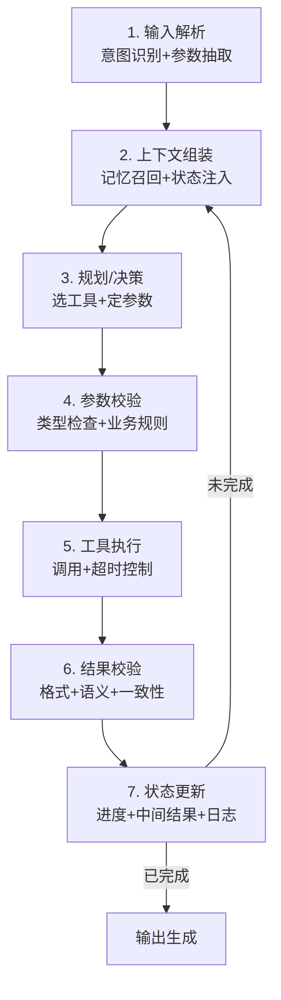
```mermaid
flowchart TB
    A["1. 输入解析\n意图识别+参数抽取"] --> B["2. 上下文组装\n记忆召回+状态注入"]
    B --> C["3. 规划/决策\n选工具+定参数"]
    C --> D["4. 参数校验\n类型检查+业务规则"]
    D --> E["5. 工具执行\n调用+超时控制"]
    E --> F["6. 结果校验\n格式+语义+一致性"]
    F --> G["7. 状态更新\n进度+中间结果+日志"]
    G -->|未完成| B
    G -->|已完成| H["输出生成"]
```

**哪些必须显式状态化**（不能靠模型上下文承载）：

| 必须状态化的 | 原因 |
|------------|------|
| 当前执行阶段 | 断点恢复、异常重入 |
| 已完成步骤和结果 | 防止重复执行 |
| 累计 token / 调用次数 | 成本控制和熔断 |
| 失败次数和失败原因 | 决定重试/降级/终止 |
| 用户确认的关键约束 | 防止被后续上下文淹没 |

**不需要状态化的**：模型的中间推理过程、工具返回的原始 JSON（提取关键字段后可丢弃）。

核心认知：**学术论文里的 Agent 循环是三步（think-act-observe），生产级的是七步，多出来的四步（输入解析、参数校验、结果校验、状态更新）全是工程防线**。没有这四步，Agent 能跑 Demo 但上不了生产。


模型通常返回三类 Action：调用一个或多个工具并给出结构化参数；请求用户补充信息或确认高风险操作；直接生成最终答案或声明无法完成。系统应校验 Action schema、权限和状态，禁止把普通文本误当工具调用，并为并行调用、重试和终止设置明确边界。

**差距在哪**：新手只知道 ReAct 三步循环。高手展示了生产级的七阶段循环，且明确了哪些状态必须显式持久化——这是“做过”和“听过”的本质区别。面试官考的是你对生产级 Agent 工程化的理解深度。

---

### Q：现在的 Agent 架构和之前有什么本质不同？渐进式披露是什么思路？

> 来源：蚂蚁集团 Agent 开发二面【[上海某量化开发 一面](https://www.nowcoder.com/feed/main/detail/87319d167f494d28a361ffd4a0215e06)追问：老架构有什么问题，新架构如何解决？】

**新手答**：“现在用更强的模型了。”

**高手答**：

Agent 架构正在经历从**“一次性全量加载”到“渐进式按需披露”**的范式转变。

**之前的架构思路——全量预加载**：

系统启动时就把所有工具、所有知识、所有规则一次性塞进上下文。Agent 拿到全部信息后做决策。

问题：① 上下文爆炸——100 个工具的 schema 占掉大半窗口；② 信息干扰——和当前任务无关的工具描述反而影响模型判断；③ 不可扩展——工具或知识增长后系统无法线性扩展。

**现在的架构思路——渐进式披露（Progressive Disclosure）**：

不预加载所有信息，而是**根据任务进展逐步暴露相关能力**。Agent 在每个阶段只看到当前阶段需要的工具、知识和规则：

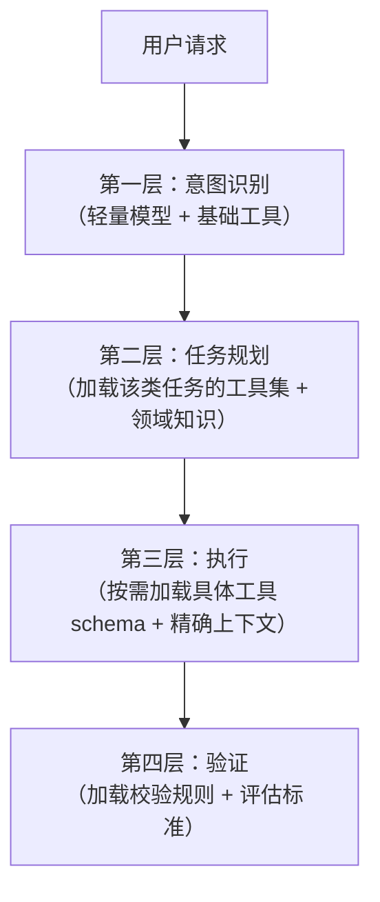
```mermaid
flowchart TB
    A["用户请求"] --> B["第一层：意图识别\n（轻量模型 + 基础工具）"]
    B --> C["第二层：任务规划\n（加载该类任务的工具集 + 领域知识）"]
    C --> D["第三层：执行\n（按需加载具体工具 schema + 精确上下文）"]
    D --> E["第四层：验证\n（加载校验规则 + 评估标准）"]
```

**关键设计原则**：

1. **按需加载工具**：不是一次性给模型 100 个工具，而是先给 5-8 个工具大类，选中大类后再展开具体工具
2. **上下文随阶段演化**：规划阶段看全局信息，执行阶段只看当前步骤的精确上下文，验证阶段切换到评估视角
3. **能力逐级升级**：简单请求用小模型 + 少量工具处理；判断需要更强能力时才升级到大模型 + 完整工具集

**和传统分层架构的区别**：传统分层是静态的——每层负责什么在设计时就定死了。渐进式披露是动态的——**每层暴露什么取决于运行时的任务状态**。同一个请求，在不同执行阶段看到的“系统”是不一样的。

这也是为什么上下文工程成为 2026 年 Agent 开发的核心挑战——不是“怎么把信息塞进去”，而是“怎么在正确的时机给出正确的信息”。

**差距在哪**：新手只看到了模型变化。高手理解了架构范式的本质转变——从全量预加载到渐进式按需披露。面试官考的是你对 Agent 架构演进方向的认知，以及你理不理解“上下文不是越多越好”这个核心洞察。

---


### Q：设计一个 AI Agent 爬取短视频平台内容，如何设计？

> 来源：字节 Agent 实习一面；本轮追问：项目中最大的挑战是什么，采集风控如何处理？ / 海外平台采集涉及哪些账号和设备风控？（[携程 AI 应用开发二面（已oc）](https://www.nowcoder.com/feed/main/detail/781cfc04e3bc4697acf0a5c913543a28)）

**新手答**：“写个爬虫脚本，调 API 下载视频。”

**高手答**：

这道题考的不是爬虫技术，而是**如何用 Agent 架构解决一个复杂的端到端任务**。系统设计分四层：

**1. 任务规划层**：

- Agent 接收用户需求（如“爬取某话题下的热门视频及评论”），先做任务分解：
  - 目标页面发现 → 内容抓取 → 数据解析 → 结构化存储
- 每个子任务可能需要不同工具，规划器负责编排执行顺序和依赖关系

**2. 工具执行层**：

| 工具 | 职责 | 技术选型 |
|------|------|---------|
| 浏览器工具 | 模拟用户浏览、滚动加载、点击交互 | Playwright / Selenium |
| API 探测工具 | 抓包分析移动端 API，直接请求数据接口 | mitmproxy + requests |
| 多模态解析工具 | 视频转文字、封面 OCR、音频转录 | Whisper、PaddleOCR |
| 存储工具 | 结构化存储爬取结果 | MongoDB / S3 |

**3. 反爬对抗层**（这是核心难点）：

- **请求频率控制**：Agent 需要感知限流信号（429 状态码、验证码），自动降频或切换策略
- **身份伪装**：UA 轮换、Cookie 池、代理 IP 池。Agent 根据被封情况动态调整
- **动态渲染**：很多内容是 JS 动态加载的，需要无头浏览器渲染后再抓取
- **失败恢复**：Agent 记录爬取进度，断点续爬，不因单次失败丢失已有成果

**4. 数据质量层**：

- 去重：相同视频不同入口可能重复，按 video_id 去重
- 校验：检查视频是否下载完整、元信息是否齐全
- 合规：过滤违规内容，遵守 robots.txt 和平台 ToS

**关键设计决策**：优先走 API 接口（速度快、结构化好），API 被封时降级到浏览器模拟（慢但稳）。Agent 的价值在于**能根据反爬反馈自适应切换策略**，而不是写死一套流程。


海外采集不能只靠轮换 UA、Cookie 或代理规避风控，应优先使用授权接口并遵守平台规则。需分别控制账号登录异常、权限和地域策略，以及设备指纹、网络来源、时区语言和行为频率；遇到验证码、封禁或异常挑战应停止降级并转人工核验，记录风险事件而非持续试探。

**差距在哪**：新手只想到写爬虫脚本。高手把问题转化成一个 Agent 系统设计——任务规划、工具编排、反爬对抗、数据质量四层架构。面试官考的是你能不能用 Agent 的思维方式（规划 + 工具 + 自适应）解决一个复杂的端到端工程问题。

---

### Q：Agent 系统里，模型和系统代码的职责边界怎么划？

> 来源：Agent 开发面试 30 题

**新手答**：“模型负责思考，代码负责执行。”

**高手答**：

方向对但太粗。精确的边界划分：

**模型负责的**（需要语言理解/生成/推理的）：
- 意图识别：理解用户到底想做什么
- 参数抽取：从自然语言中提取结构化参数
- 方案选择：在多个可行路径中选最优的
- 内容生成：自然语言回复、代码、摘要

**系统代码负责的**（需要确定性保证的）：
- 流程控制：任务状态机、步骤编排、超时管理
- 参数校验：类型检查、范围约束、必填项检查
- 权限管控：工具访问控制、操作审批
- 状态持久化：中间结果存储、断点恢复
- 安全兜底：输出过滤、敏感信息脱敏、成本熔断

**核心原则：永远不要让模型做它不擅长的事——精确计算、状态维护、流程控制、安全决策**。

一个简单的验证标准：如果这个环节出错后果严重且不可接受 → 系统代码负责。如果这个环节出错可以通过重试/降级补救 → 可以交给模型。

**差距在哪**：新手的“思考 vs 执行”太笼统。高手把两者的职责列表拉出来对比，且给出了一个实用的验证标准（出错后果是否可接受）。面试官考的是你能不能精确划分系统设计中的职责边界。

---

### Q：如果面试官说“Agent 本质上就是套壳调用工具”，你怎么反驳？

> 来源：Agent 开发面试 30 题

**新手答**：“不是套壳，Agent 更智能。”

**高手答**：

这句话的逻辑类似于说“操作系统就是套壳调硬件”——技术上没错，但忽略了**中间层的价值**。

“套壳调工具”只描述了 Agent 的最表层行为（接收输入 → 调工具 → 返回结果），但 Agent 的核心价值在于三个“套壳”做不到的能力：

1. **动态规划**：不是“收到请求 → 调固定工具 → 返回”，而是“理解意图 → 拆解任务 → 根据中间结果动态选择下一步”。一个订机票的 Agent 可能需要先查航班 → 发现满了 → 改查临近日期 → 发现价格高 → 问用户是否接受 → 最终下单。这个决策链在设计时不可穷举
2. **自我修正**：调工具失败后不是报错，而是分析失败原因、换一个工具或调整参数重试。这种“错了知道怎么补救”的能力是纯工具链做不到的
3. **上下文推理**：能把多轮对话、用户画像、当前任务状态综合起来做决策，而不是每次请求都是无状态的

API Wrapper 是确定性的——同样输入永远同样输出。Agent 是概率性的但有推理能力——面对未见过的输入也能给出合理响应。这个区别就像“if-else 路由器”和“有经验的客服”的区别。

**差距在哪**：新手的反驳苍白无力。高手从动态规划、自我修正、上下文推理三个具体能力点说明 Agent 不是“套壳”，且用“操作系统 vs 硬件”类比让论证更有力。面试官用这种挑衅式问题考的是你对 Agent 的理解有多深。

---

### Q：为什么很多团队做到最后是“Workflow + Agent 节点”的混合架构？

> 来源：Agent 开发面试 30 题

**新手答**：“因为纯 Agent 不够稳定。”

**高手答**：

不是 Agent“不够好”，是**不同环节对确定性的要求不同**。一个完整的业务流程里，80% 的步骤是确定性的（权限校验、数据查询、格式转换），只有 20% 需要智能判断（意图理解、方案推荐、自然语言生成）。

如果全用 Agent：
- 确定性步骤被模型处理 → 偶尔出错，不如规则可靠
- 成本翻倍 → 每个确定性步骤都消耗 token，毫无必要
- 可测试性差 → 模型输出概率性的，同样输入不一定同样输出

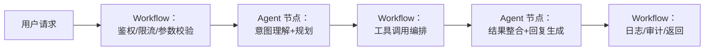
```mermaid
flowchart LR
    A["用户请求"] --> B["Workflow：\n鉴权/限流/参数校验"]
    B --> C["Agent 节点：\n意图理解+规划"]
    C --> D["Workflow：\n工具调用编排"]
    D --> E["Agent 节点：\n结果整合+回复生成"]
    E --> F["Workflow：\n日志/审计/返回"]
```

混合架构的原则是：**确定性环节用 Workflow（可靠、可测、低成本），不确定性环节用 Agent（灵活、智能）**。Agent 节点像状态机里的“智能节点”——系统控制它何时被调用、输入什么、输出约束是什么，但节点内部允许模型自由推理。

这也解释了为什么纯 Agent 创业项目容易死——不是技术不行，是把本该确定性处理的东西也交给了模型，导致系统整体可靠性无法保证。

**差距在哪**：新手只说了“不稳定”。高手分析了根因——不同环节对确定性的要求不同，且给出了 80/20 的量化认知和混合架构的设计原则。面试官考的是你有没有把 Agent 从 Demo 推到生产的实战认知。

---

### Q：什么样的任务适合先全局规划再执行，什么样的任务更适合边走边决策？

> 来源：Agent 开发面试 30 题

**新手答**：“简单任务边走边做，复杂任务先规划。”

**高手答**：

不是“简单 vs 复杂”，而是**任务的信息完备度和可预测性**：

**适合先规划再执行（Plan-and-Execute）**：
- 任务目标明确、步骤可预知：日报生成、数据 ETL、固定流程的表单填写
- 所有需要的信息在开始时就已具备
- 步骤之间有强依赖，必须按顺序执行
- 关键特征：**开始时就能画出完整的流程图**

**适合边走边决策（ReAct）**：
- 下一步取决于上一步的结果：故障诊断、信息调研、开放式对话
- 用户可能随时改变需求
- 中间步骤可能失败，需要动态调整路线
- 关键特征：**开始时画不出完整流程图，因为分支取决于运行时的数据**

**混合策略**（实际生产中最常见）：先做一次粗粒度规划（定义 3-5 个阶段目标），每个阶段内部用 ReAct 灵活执行。阶段目标变化时才触发重规划，不是每步都重规划。

```text
粗规划：信息收集 → 方案对比 → 用户确认 → 执行操作
每个阶段内部：ReAct（边做边调整）
重规划触发：用户改需求 / 关键前提失效 / 连续失败
```

**差距在哪**：新手用“简单 vs 复杂”做判断——但“简单”的信息调研可能需要边走边做，“复杂”的 ETL 反而适合先规划。高手用“信息完备度”和“可预测性”两个维度做判断，且给出了混合策略。面试官考的是你在选执行策略时有没有清晰的判断标准。

---

## 系统集成与规划保障

### Q：Skill、MCP、Rule 三者有什么区别？

> 来源：蚂蚁集团一面；[本轮来源](https://www.nowcoder.com/discuss/928313631916199936)

**新手答**：“都是给 Agent 加功能的方式吧。”

**高手答**：

三者解决的是 Agent 系统中**不同层次的扩展问题**，看起来都是“给 Agent 加东西”，但职责完全不同：

| 概念 | 本质 | 解决什么问题 | 类比 |
|------|------|------------|------|
| **Rule** | 行为约束规则 | Agent 什么能做、什么不能做 | 公司制度 / 安全规范 |
| **Skill** | 可复用的能力模块 | Agent 怎么做某类特定任务 | 员工的专业技能 / SOP |
| **MCP** | 工具连接协议 | Agent 怎么接入外部工具和数据 | USB 接口标准 |

**Rule（规则/约束）**：

定义 Agent 的行为边界和决策偏好。不是“能力”，而是“约束”：

```text
Rule 示例：
- 禁止执行 rm -rf 命令
- 回答必须使用中文
- 代码修改前必须先读取文件
- 敏感操作需要用户确认
```

Rule 通常写在配置文件中（如 CLAUDE.md），在每次对话中持续生效。它约束的是 Agent 的**所有行为**，不绑定特定任务。

**Skill（技能模块）**：

封装了完成某类特定任务的完整流程——包括步骤定义、输入输出格式、注意事项、甚至子工具的组合使用方式：

```text
Skill 示例：
- "代码审查"技能：定义了审查流程、检查维度、输出格式
- "文章写作"技能：定义了写作风格、结构模板、质量标准
- "面试题分类"技能：定义了分类维度、插入格式、来源标注规范
```

Skill 是**按需激活**的——用户触发特定任务时才加载。它解决的是“同类任务每次都要从头教 Agent 怎么做”的问题。

**MCP（Model Context Protocol）**：

标准化的工具连接协议。解决的不是“怎么用工具”，而是“怎么发现和接入工具”：

```text
MCP 示例：
- 数据库 MCP Server：暴露 query、insert、update 等工具
- GitHub MCP Server：暴露 create_pr、list_issues 等工具
- 搜索 MCP Server：暴露 web_search、image_search 等工具
```

MCP 的价值是**标准化**——任何工具只要实现 MCP 协议，任何 Agent 都能即插即用，不需要为每个工具写适配代码。

**三者的协作关系**：

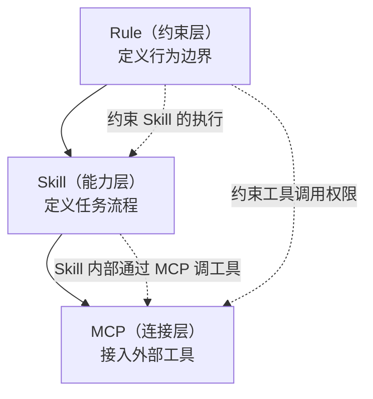
```mermaid
flowchart TB
    R["Rule（约束层）\n定义行为边界"] --> S["Skill（能力层）\n定义任务流程"]
    S --> M["MCP（连接层）\n接入外部工具"]

    R -.->|"约束 Skill 的执行"| S
    R -.->|"约束工具调用权限"| M
    S -.->|"Skill 内部通过 MCP 调工具"| M
```

Rule 是最上层的约束，贯穿所有行为；Skill 在 Rule 的约束下定义任务流程；Skill 内部通过 MCP 调用具体工具。三者不是平行关系，而是**约束 → 能力 → 连接的层次关系**。

**本地工具 vs MCP Tools vs Skill 的三层对比**：

面试中经常把这三者放一起问，核心区别在于**抽象层级不同**：

| 维度 | 本地工具（Native Tool） | MCP Tool | Skill |
|------|----------------------|----------|-------|
| 本质 | 硬编码的函数调用 | 协议标准化的外部能力 | 领域知识 + 执行流程 |
| 注册方式 | 代码中直接定义 | 通过 MCP Server 动态发现 | Markdown 文件加载到上下文 |
| 调用方式 | Agent 直接调用函数 | 通过 MCP Client 发 JSON-RPC | 注入上下文后影响模型行为 |
| 可扩展性 | 改代码、重部署 | 新增 MCP Server 即可 | 新增 .md 文件即可 |
| 典型例子 | Read、Edit、Bash | GitHub MCP、Slack MCP | classify-interview-questions |
| 类比 | 内置器官 | 外接设备（USB） | 操作手册 |

关键洞察：本地工具是“能力”，MCP 是“能力的标准化接口”，Skill 是“怎么用能力的知识”。三者不是替代关系，而是**互补的不同层级**。一个完整的 Agent 系统通常同时需要这三层。

**差距在哪**：新手把三者混为一谈。高手从“约束 / 能力 / 连接”三个层次清晰区分了三者的职责，且说明了它们的层次关系和协作方式。面试官考的是你对 Agent 系统扩展机制的架构理解——不是“都能加功能”，而是“在不同层次解决不同问题”。

---

### Q：Agent 的任务规划是怎么做的？规划由模型完成还是规则实现？

> 来源：快手 AI Agent 开发一面 【[阿里国际 Agent 开发三面](https://www.nowcoder.com/feed/main/detail/747f07e71f4448bebdce6ada5de800cd)追问：长任务规划与拆解】；本轮追问：如果让你设计一个“行程规划Agent”，结合车辆续航、充电桩，你会怎么做？ / 如果电量不足以到达目的地，Agent怎么提醒和规划？（[蔚来——大模型算法岗（智能座舱/自动驾驶）实习一面](https://www.nowcoder.com/discuss/930755708008558592)）

**新手答**：“让模型自己决定每一步做什么。”

**高手答**：

生产级 Agent 的规划**几乎都是模型 + 规则的混合架构**，纯模型或纯规则都有致命缺陷：

| 方案 | 优势 | 缺陷 | 适用场景 |
|------|------|------|---------|
| 纯模型规划（ReAct） | 灵活，能处理新任务 | 不可控，可能跑偏 | 探索性任务、开放域 |
| 纯规则规划（状态机） | 确定性强，行为可预测 | 僵化，无法处理意外 | 流程固定的业务场景 |
| **混合架构** | 灵活性 + 可控性 | 设计复杂度高 | 生产环境首选 |

**混合架构的典型做法**：

```text
规则层：定义任务的主干流程（必经节点、禁止操作、超时限制）
模型层：在规则允许的范围内，负责子任务拆解和具体决策
验证层：每步规划结果经过规则校验后才执行
```

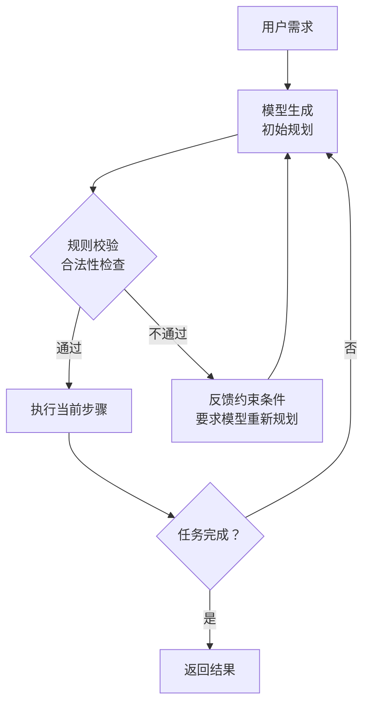
```mermaid
flowchart TB
    U["用户需求"] --> M["模型生成\n初始规划"]
    M --> V{"规则校验\n合法性检查"}
    V -->|"通过"| E["执行当前步骤"]
    V -->|"不通过"| R["反馈约束条件\n要求模型重新规划"]
    R --> M
    E --> C{"任务完成？"}
    C -->|"否"| M
    C -->|"是"| D["返回结果"]
```

**多工具调用时如何决定调用顺序**：

1. **显式依赖**：工具 B 的输入依赖工具 A 的输出 → A 必须先执行，由 DAG（有向无环图）描述依赖关系
2. **无依赖并行**：工具之间无数据依赖 → 并行执行，总延迟取最慢的那个
3. **模型推理**：依赖关系不明确时，让模型根据任务上下文判断调用顺序，但要加防护——限制最大步数、禁止循环调用

```text
工程实践：先用规则解析工具间的硬依赖（参数传递关系），
再用模型判断软依赖（逻辑上应该先查天气再推荐穿搭），
无依赖的全部并行
```

**工具调用失败的处理**：

| 失败类型 | 处理策略 |
|---------|---------|
| 网络超时/5xx | 指数退避重试（最多 2 次） |
| 参数错误/4xx | 让模型分析错误信息，修正参数后重试 |
| 工具不可用 | 切换到备选工具（如主搜索引擎挂了切备用） |
| 多次失败 | 跳过该步骤，用已有信息给出部分结果，告知用户“XX 信息暂时无法获取” |


行程规划需读取车辆实时电量、能耗估计、目的地和充电桩可用性，以带安全余量的可达性校验筛选路线和充电站；电量不足时明确告知预计剩余电量与风险，优先给出途中充电、缩短目的地或改道方案，并在用户确认后执行。行驶中根据位置、拥堵和桩状态变化触发重规划。

**差距在哪**：新手把规划全交给模型——这在生产中不可控。高手用“模型规划 + 规则校验”的混合架构，在灵活性和安全性之间找到了平衡。多工具调用有 DAG 依赖分析 + 并行优化，失败有分类处理策略。面试官考的是你能不能设计一个既灵活又可控的规划系统。

---


### Q：如何保证规划 Agent plan 的结果正确？

> 来源：AI 工程师面试；本轮追问：除了检查是否路由到正确的 Skill、是否调用了正确工具和知识文档，还如何判断最终诊断结果是正确的？（[本轮追问](https://www.nowcoder.com/discuss/926528416512315392)）；本轮追问：客户回答回来后，如何确保它对应的是正确的问题和正确的信审任务？（[本轮追问](https://www.nowcoder.com/feed/main/detail/6a7fbdcf484a4b2bbe4b900b2dbd5750)）

**新手答**：“让模型多想想，加个 CoT 就行。”

**高手答**：

Plan 的正确性不能只靠模型“想得好”，要从**事前约束、事中校验、事后修正**三个阶段建立保障机制：

**事前——约束 Plan 的输出质量**：

1. **Structured Output**：强制模型以 JSON 格式输出 plan，每个步骤必须包含 `step_id`、`action`、`tool`、`expected_output`、`dependencies`。格式约束本身就能过滤掉“一句话笼统计划”
2. **Few-shot 示范**：在 Prompt 中给出 2-3 个高质量的 plan 示例，让模型学到正确的粒度和结构
3. **领域知识注入**：把当前任务相关的工具列表、能力边界、业务规则注入上下文，避免模型规划出“做不到的步骤”

**事中——引入 Critic 校验**：

4. **Critic Agent**：用另一个模型（或同一个模型不同 Prompt）审查 plan，检查逻辑一致性、步骤可执行性、是否有遗漏
5. **规则校验器**：用代码检查 plan 的结构合法性——步骤依赖是否成环、引用的工具是否存在、参数是否完整

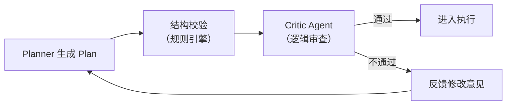
```mermaid
flowchart LR
    A["Planner 生成 Plan"] --> B["结构校验\n（规则引擎）"]
    B --> C["Critic Agent\n（逻辑审查）"]
    C -->|"通过"| D["进入执行"]
    C -->|"不通过"| E["反馈修改意见"]
    E --> A
```

**事后——执行中反馈修正**：

6. **Self-Reflection**：每个步骤执行完后，检查实际结果和 plan 预期是否一致，不一致时触发局部修正
7. **Re-plan 机制**：当关键前提失效（如某个工具不可用、用户改了需求）时，允许重新规划，但保留已完成步骤的成果
8. **Plan 版本管理**：每次修改 plan 都保存历史版本，方便回溯和复盘

核心认知：**Plan 的正确性不是一次生成就能保证的，而是通过“生成 → 审查 → 执行 → 反馈 → 修正”的闭环逐步收敛的**。只靠 Prompt 调优永远不够，必须有外部校验机制。

**差距在哪**：新手只想到让模型“想清楚”——这是最弱的保障。高手从事前（格式约束 + Few-shot + 知识注入）、事中（Critic + 规则校验）、事后（反馈修正 + Re-plan）三个阶段构建了完整的 Plan 质量保障体系。面试官考的是你对规划可靠性的工程化认知。

---

### Q：微服务怎么接入一个 Agent 系统？

> 来源：蚂蚁集团一面

**新手答**：“Agent 调微服务的 API 就行。”

**高手答**：

“调 API”只是最表面的一层。微服务接入 Agent 系统要解决**发现、适配、治理**三个层面的问题：

**1. 服务发现与注册（Agent 怎么知道有哪些微服务可用）**

不能把所有微服务的 API 文档硬编码在 Agent 的 Prompt 里——微服务会增删改。需要一个**动态的工具注册中心**：

```text
微服务 A 注册：
  name: "订单查询服务"
  capabilities: ["查询订单状态", "查询订单详情", "查询历史订单"]
  endpoint: "order-service.internal:8080"
  schema: OpenAPI 3.0 spec
  auth: Bearer Token
  rate_limit: 100 RPM
```

Agent 在需要时从注册中心按能力描述检索合适的服务，而不是预加载所有服务。这就是 MCP 协议在解决的问题——用标准化的方式让 Agent 发现和调用工具。

**2. 协议适配（微服务的接口怎么变成 Agent 能理解的工具）**

微服务的 REST/gRPC 接口和 Agent 的工具调用接口之间需要**适配层**：

| 微服务侧 | 适配层处理 | Agent 侧 |
|---------|-----------|---------|
| REST API + JSON | 转换成 Tool Schema | function calling 参数 |
| gRPC + Protobuf | 序列化/反序列化 | 结构化输入输出 |
| 复杂嵌套参数 | 简化 + 文字描述 | 模型可理解的扁平参数 |
| 技术性错误码 | 翻译成自然语言 | 模型可推理的错误信息 |

关键：适配层不只是格式转换，还需要**把技术概念翻译成模型能理解的语义描述**。比如微服务返回 `{"code": 40301, "msg": "insufficient_balance"}`，适配层要翻译成“用户余额不足，无法完成支付”。

**3. 治理（接入后怎么保证稳定可控）**

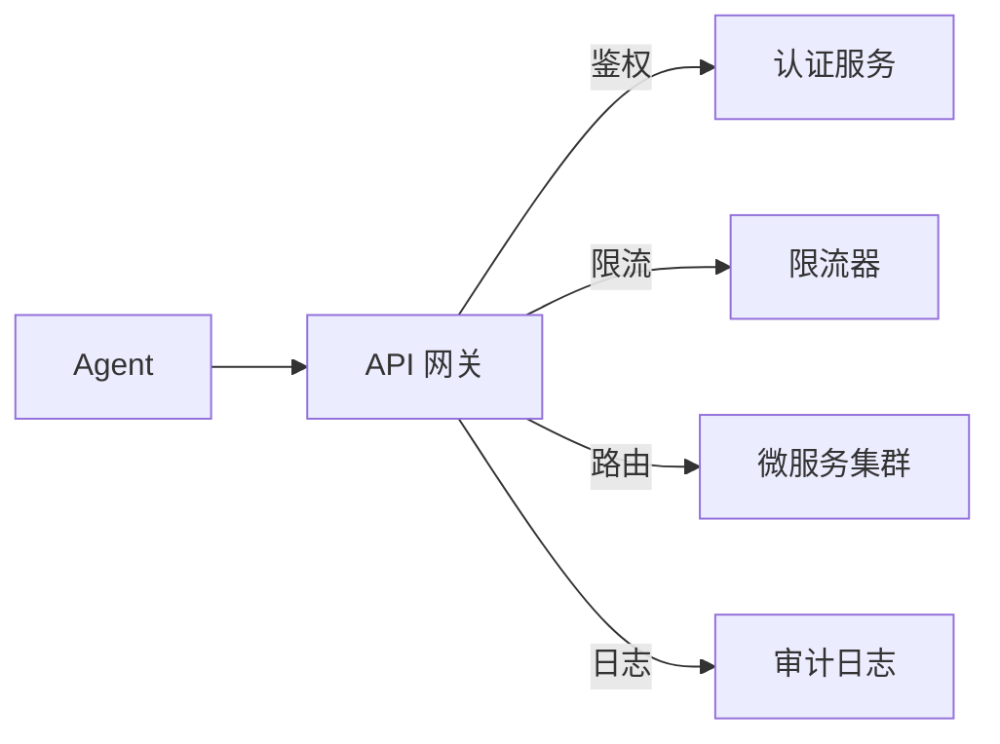
```mermaid
flowchart LR
    A["Agent"] --> GW["API 网关"]
    GW --> |"鉴权"| AUTH["认证服务"]
    GW --> |"限流"| RL["限流器"]
    GW --> |"路由"| SVC["微服务集群"]
    GW --> |"日志"| LOG["审计日志"]
```

- **鉴权**：Agent 调微服务不能用同一个“超级 Token”，应该按任务类型分发不同权限的临时凭证
- **限流**：Agent 可能短时间内高频调用某个服务（比如循环查询），需要在网关层做 Agent 维度的限流
- **熔断**：某个微服务不可用时，Agent 不能死等，需要快速感知并切换策略
- **可观测**：每次调用的入参、出参、延迟、状态码都要记录，方便排查 Agent 行为异常时的根因

**差距在哪**：新手只想到“调 API”。高手从服务发现、协议适配、运行治理三层说清了微服务接入 Agent 的完整方案，且指出了“语义翻译”和“Agent 维度限流”这两个 Agent 系统特有的难点。面试官考的是你能不能把传统微服务架构的经验迁移到 Agent 系统中。

---

### Q：规划完成后需要人工介入修改大纲，SSE 怎么实现这种 Human-in-the-Loop？前端怎么让用户输入？

> 来源：AI 工程师面试

**新手答**：“弹个输入框让用户改就行。”

**高手答**：

这道题考的是**Human-in-the-Loop（HITL）的工程实现**——Agent 执行到某个节点时暂停，等待人类输入后再继续。核心挑战是：后端是异步流式的（SSE），前端需要在正确的时机切换到“等待用户输入”状态。

**后端实现（以 LangGraph 为例）**：

LangGraph 原生支持 `interrupt_before` 机制——在指定节点执行前暂停 graph，等待外部输入：

```python
graph = create_graph()
# 在 search_node 之前中断，等待人工确认/修改大纲
app = graph.compile(
    checkpointer=checkpointer,
    interrupt_before=[“search_node”]
)
```

执行流程：

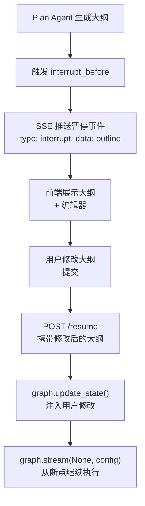
```mermaid
flowchart TB
    A["Plan Agent 生成大纲"] --> B["触发 interrupt_before"]
    B --> C["SSE 推送暂停事件\ntype: interrupt, data: outline"]
    C --> D["前端展示大纲\n+ 编辑器"]
    D --> E["用户修改大纲\n提交"]
    E --> F["POST /resume\n携带修改后的大纲"]
    F --> G["graph.update_state()\n注入用户修改"]
    G --> H["graph.stream(None, config)\n从断点继续执行"]
```

关键 API 调用：

```python
# 1. 用户修改后，更新 graph 状态
graph.update_state(
    config,
    {“outline”: user_modified_outline},
    as_node=”plan_node”  # 以 plan_node 的身份写入状态
)

# 2. 传入 None 表示从上次中断处继续
for event in graph.stream(None, config):
    send_sse_event(event)
```

**SSE 通信协议设计**：

后端通过 SSE 推送不同类型的事件，前端根据事件类型切换 UI 状态：

```text
event: node_output      # 普通节点输出，前端展示流式内容
data: {“node”: “plan”, “content”: “...”}

event: interrupt         # 中断事件，前端切换到编辑模式
data: {“node”: “plan”, “outline”: [...], “editable”: true}

event: resumed           # 恢复执行，前端切回流式展示模式
data: {“node”: “search”}
```

**前端交互设计**：

1. **监听 SSE 事件流**：收到 `interrupt` 事件时，停止流式展示，渲染大纲编辑器
2. **用户编辑并提交**：提交时调用 `POST /resume` 接口，携带修改后的大纲和当前 `thread_id`
3. **恢复流式展示**：收到 `resumed` 事件后，前端切回流式输出模式，继续展示后续节点的输出

核心认知：**HITL 不是简单的“弹窗确认”，而是后端状态暂停 + 前端模式切换 + 状态注入恢复的完整链路**。LangGraph 的 `interrupt_before` + `update_state` + `stream(None)` 三板斧是标准实现。

**差距在哪**：新手只想到前端交互。高手从后端中断机制（interrupt_before）、SSE 事件协议设计、前端状态切换、恢复执行（update_state + stream(None)）四个环节说清了完整的 HITL 实现方案。面试官考的是你对 Agent 系统中“人机协作”的全链路工程化理解。

---

## 场景设计与可靠性

### Q：LangChain 和 LangGraph 有什么区别？分别适合什么场景？

> 来源：淘宝闪购 AI应用研发 一面【[0827-字节大模型应用开发(一面)-秋招](https://www.nowcoder.com/discuss/926086211272196096)追问：对于 LangChain 和 LangGraph 这些框架了解吗，能说说两者的区别吗？】【[快手 - Agent 开发岗（应用落地 + AI 工具）](https://www.nowcoder.com/discuss/926274020192841728)追问：LangGraph 和 LangChain 有什么区别？图状态机适用于哪些场景？】【[第三次去哪儿旅行一面，AI面试问的是前端吗？](https://www.nowcoder.com/feed/main/detail/2ed12b3fa1d4491f8bb029f99cf9de73)追问：LangChain和LangGraph有什么区别？为什么现在项目优先使用LangGraph？】【[pdd agent二面](https://www.nowcoder.com/feed/main/detail/f5e7351df8364147ac8da085b99d9d18)追问：LangChain与LangGraph核心区别？】；[本轮来源](https://www.nowcoder.com/feed/main/detail/2f4e4cde4e524a16aae5f55a89c49273)；本轮追问：说说你对 Graph Engineer 的理解，图结构在安全 Agent 里有什么价值？（[本轮追问](https://www.nowcoder.com/feed/main/detail/c639e7ea920b49b1834839f2a090809e)）；[金蝶 Agent开发 一面](https://www.nowcoder.com/feed/main/detail/0cfe501739834deb90c2a1f741b7b7fe)；[字节数据中台Agent全栈面经](https://www.nowcoder.com/feed/main/detail/fe77496948f74b4091ab4bb6e8156c8b)；本轮追问：LangChain 和 LangGraph 的区别？LangGraph 为什么适合做循环、图流转？（[千问AI研发一面凉经](https://www.nowcoder.com/feed/main/detail/ebf0ec03e5ee4fa8a140cc8d247b1e20)）；[飞书深诺（全栈AI应用开发方向）](https://www.nowcoder.com/feed/main/detail/46a9336c7ead4586bae34e521d4f61d0)；[赛诺贝斯 面经 一面过 笔试过 hc无](https://www.nowcoder.com/discuss/930126120177926144)；本轮追问：LangChain 和 LangGraph 有什么区别和关联？（[字节跳动 AI Agent研发工程师｜AI算力基础设施 27秋招面经](https://www.nowcoder.com/discuss/930155293864914944)）；本轮追问：LangChain框架、LongGraph框架，还有原生手写Agent，三者区别和优劣势？（[美团AI Agent一面](https://www.nowcoder.com/feed/main/detail/50bcdc47e7754aa7be59b6318fea514b)）

**新手答**：“LangChain 是做大模型应用的框架，LangGraph 没怎么了解。”

**高手答**：

两者都是 LangChain 团队的产品，但解决的问题层次不同：

**LangChain**：链式编排框架

核心抽象是 Chain——把 Prompt、模型调用、输出解析串成一条线性管线。适合**流程固定的 LLM 应用**，比如“输入→检索→生成→输出”这种 DAG 结构。

优势：上手快，生态丰富（文档加载器、向量数据库集成、Tool 抽象）。
劣势：链式抽象不支持循环和条件分支——而 Agent 的核心特征就是“根据结果决定下一步”，这需要循环。

**LangGraph**：有状态图执行框架

核心抽象是 Graph——用节点（Node）和边（Edge）定义执行流程，支持条件分支、循环、并行。每个节点可以读写一个共享的 State 对象。

```text
LangChain：A → B → C（线性管线）
LangGraph：A → B → C（可以从 C 跳回 A，或者 B 分叉成 B1/B2 并行）
```

适合**需要复杂控制流的 Agent**——多轮工具调用、条件分支、人工介入（Human-in-the-Loop）、检查点恢复。

**选型建议**：

| 场景 | 选择 | 原因 |
|------|------|------|
| 简单 RAG 管线 | LangChain | 线性流程，不需要循环 |
| 单步工具调用 | LangChain | 不需要复杂控制流 |
| 多轮 Agent 交互 | LangGraph | 需要循环和状态管理 |
| 多 Agent 协作 | LangGraph | 需要图结构编排 |
| 需要断点恢复 | LangGraph | 内置 Checkpoint 机制 |

**行业趋势**：LangChain 团队自己也在推动从 Chain 向 Graph 迁移——LangChain v0.3 废弃了大量旧抽象，推荐用 LangGraph 做 Agent 类应用。但 LangChain 的生态组件（文档加载器、Embedding 封装）依然有价值。


原生手写 Agent 可获得更强的流程与性能控制，但需自行实现状态管理、重试、持久化和可观测性；LangGraph/Graph Engineer 更关注状态模式、节点边界、幂等与恢复。在安全 Agent 中，图结构可约束工具权限、审批路径和循环上限，并保留审计轨迹。

**差距在哪**：新手只知道 LangChain 是框架，对 LangGraph 没概念。高手区分了两者的设计哲学——Chain 是线性管线、Graph 是有状态图执行，且能说清楚各自的适用场景和行业演进方向。面试官考的是你对 Agent 开发工具链的了解深度。

---

### Q：模型和 Agent 的区别到底是什么？

> 来源：字节 Agent 开发实习一面【[MiniMax - 大模型算法岗（后训练 / SFT / RL 方向，独角兽）](https://www.nowcoder.com/discuss/925527528259743744)追问：介绍一下大模型和 Agent 的区别和关系？】【[MiniMax - 大模型算法岗（后训练 / SFT / RL）](https://www.nowcoder.com/discuss/926272883872075776)追问：大模型与 Agent 的区别联系？】【[百度 - Agent 研发岗（架构方向）](https://www.nowcoder.com/discuss/926273622006665216)追问：在“AI 原生应用”中，Agent 的角色是什么？】；[小米--后端--二面](https://www.nowcoder.com/discuss/929769764719775744)；[上海联蔚数科agent面经](https://www.nowcoder.com/feed/main/detail/97ee6dec31b14d12a1f800b709e21a4c)；[百度Agent二面，不看简历不问八股](https://www.nowcoder.com/feed/main/detail/c7f00d0e48aa4017911b46ed928d15f3)

**新手答**：“Agent 就是模型加了工具调用。”

**高手答**：

这是 Agent 面试中最基础也最高频的问题，回答必须清晰且有结构。

**一句话区分**：模型是一个**函数**（输入 → 输出），Agent 是一个**系统**（目标 → 自主多步执行）。

四个关键维度的差异：

| 维度 | 模型（Model） | Agent |
|------|-------------|-------|
| 交互模式 | 单轮：问 → 答 | 多轮循环：观察 → 思考 → 行动 → 观察 → ... |
| 环境感知 | 无法访问外部状态 | 能读文件、调 API、查数据库——感知并作用于环境 |
| 自主决策 | 生成最大概率的下一个 token | 决定做什么、用哪个工具、何时停止——拥有自主性 |
| 状态管理 | 无状态（每次调用独立） | 跨步骤维护状态（记忆、任务进度、中间结果） |

用公式表达：

```text
Agent = LLM + Tools + Memory + Planning Loop
```

**类比**：模型是一个装在罐子里的大脑——你问它问题它能回答，但它看不见、摸不着、也记不住上一次对话。Agent 是一个有眼睛、有双手、还有待办清单的大脑——它能感知环境、操作工具、记住进度，并且自主决定下一步做什么。

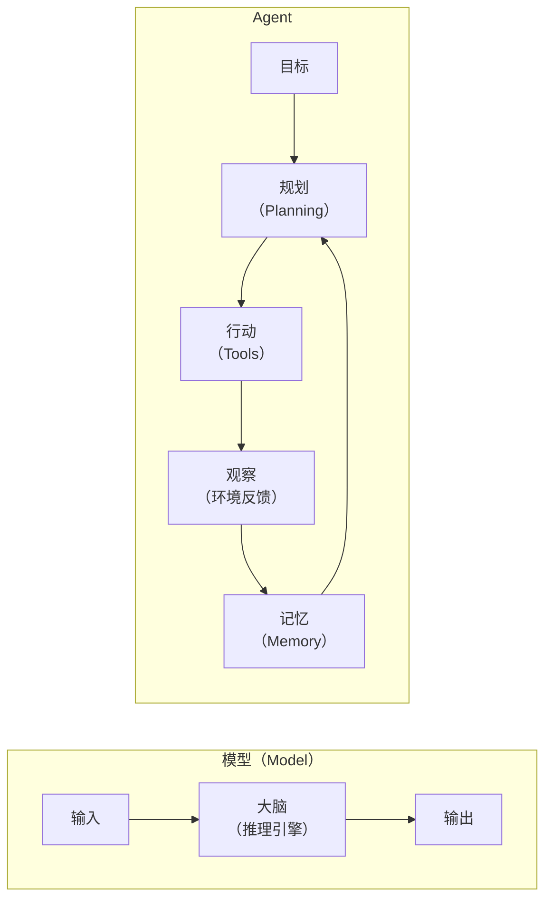
```mermaid
flowchart LR
    subgraph model["模型（Model）"]
        direction LR
        I1["输入"] --> M["大脑\n（推理引擎）"] --> O1["输出"]
    end

    subgraph agent["Agent"]
        direction TB
        G["目标"] --> P["规划\n（Planning）"]
        P --> A["行动\n（Tools）"]
        A --> OB["观察\n（环境反馈）"]
        OB --> MEM["记忆\n（Memory）"]
        MEM --> P
    end
```

**灰色地带——“带 function calling 的模型”算不算 Agent？**

区分的关键在于**循环（Loop）**。如果模型调一次工具就结束，那只是“增强版模型”。如果它能**不经人类干预、自主决定执行多个步骤**——观察上一步结果、判断任务是否完成、决定下一步做什么——这才是 Agent。自主循环是 Agent 的定义性特征。

**差距在哪**：新手只看到了工具调用这一个维度——“加了工具就是 Agent”。高手从交互模式、环境感知、自主决策、状态管理四个维度拆解差异，并指出自主循环才是 Agent 和“模型 + 工具”的根本分界线。面试官用这道题考的是你对 Agent 最基础概念的认知精度——定义模糊的人，后面的架构设计也不会清晰。

---

### Q：如果设计一个科研辅助 Agent，整体流程应该怎么设计？

> 来源：bilibili AI研发实习一面；本轮追问：你们的agent是怎么设计的？你负责哪一部分？（[本轮追问](https://www.nowcoder.com/feed/main/detail/595a0cb450cf45e9a47a0d32084b9099)）；本轮追问：code agent 是怎么设计的，做了哪些优化？（[本轮追问](https://www.nowcoder.com/feed/main/detail/77660a0c109d42f89001980a8f94c1a6)）；本轮追问：如果设计这些游戏里的 Agent，会怎么进行设计？（[本轮追问](https://www.nowcoder.com/feed/main/detail/85a64d94c3374a10afa20d7466d24d5d)）；本轮追问：如何设计一个 Agent？（[本轮追问](https://www.nowcoder.com/feed/main/detail/f9e65706c3274fac86b52f27a70bf902)）；本轮追问：如果让你设计一个“智能创作助手”，帮用户生成笔记文案和配图，你会怎么做？（[小红书多模态秋招二面](https://www.nowcoder.com/discuss/930755993066041344)）；本轮追问：如果要实现一个简单个人助理Agent，可查当日当地天气、规划两地路线，说出实现框架和步骤。（[斑头雁（Agent实习生面试一面）](https://www.nowcoder.com/discuss/930139676764102656)）

**新手答**：“让大模型帮忙搜论文、写摘要。”

**高手答**：

科研辅助 Agent 不是“搜论文的 chatbot”，而是一个**多阶段、闭环迭代**的研究管线。设计的核心是把科研工作流拆成可自动化的阶段，每个阶段对应不同的 Agent 能力。

**典型的科研 Agent 流程**：

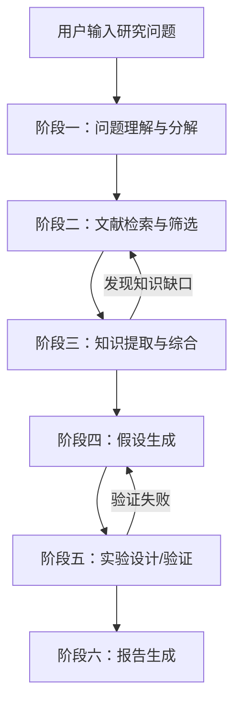
```mermaid
flowchart TB
    U["用户输入研究问题"] --> A["阶段一：问题理解与分解"]
    A --> B["阶段二：文献检索与筛选"]
    B --> C["阶段三：知识提取与综合"]
    C --> D["阶段四：假设生成"]
    D --> E["阶段五：实验设计/验证"]
    E --> F["阶段六：报告生成"]

    C -->|"发现知识缺口"| B
    E -->|"验证失败"| D
```

**各阶段的设计要点**：

**阶段一：问题理解与分解**

用户给出一个研究问题（如“大语言模型在医疗诊断中的应用现状”），Agent 需要：
- 把宽泛的问题拆解成多个具体的子问题（应用场景有哪些？效果如何？局限性？）
- 识别关键术语和概念，为后续检索做准备
- 确定研究范围和边界（时间范围、领域限定）

**阶段二：文献检索与筛选**

这一步不是简单的关键词搜索，而是**迭代式多源检索**：
- 第一轮：用关键术语在学术数据库（Semantic Scholar、arXiv API）做广泛检索
- 筛选：按引用数、发表时间、相关度做粗筛
- 第二轮：从初筛论文的引用列表中扩展检索（引文追溯），发现初始检索遗漏的关键文献
- 每轮检索后评估覆盖率，决定是否需要进一步检索

**阶段三：知识提取与综合**

对筛选后的文献做结构化信息抽取：
- 提取每篇论文的核心方法、实验设置、关键结论
- 跨论文比较：不同方法的效果对比、争议观点识别
- 构建知识图谱：论文之间的引用关系、方法演进脉络

**阶段四：假设生成**

基于综合分析，生成研究假设或研究方向建议。这一步需要模型的推理能力——不是简单总结现有文献，而是发现研究空白和潜在的创新点。

**阶段五：实验设计/验证**

如果是代码类研究，Agent 可以直接执行实验（调用代码执行工具跑 benchmark）；如果是理论类，生成实验方案供研究者参考。

**阶段六：报告生成**

按学术规范生成结构化报告，带引用、图表和结论。

**工程实现的关键挑战**：

| 挑战 | 解决方案 |
|------|---------|
| 文献量大，单次上下文装不下 | 分阶段处理：检索阶段只看摘要和元信息，精读阶段按需加载全文 |
| 模型可能编造论文引用 | 所有引用必须来自实际检索结果，生成后做引用校验——对比生成的引用标题与检索结果库 |
| 研究方向需要人工判断 | 在假设生成后设置 Human-in-the-Loop，让用户确认方向再继续 |
| 跨学科检索困难 | 多轮检索 + 查询改写，每轮根据已有发现调整检索策略和关键词 |

**和 Deep Research 产品的关系**：

Gemini Deep Research、Perplexity 的深度研究功能，本质上就是这套流程的产品化——用户给一个问题，Agent 自动完成检索→筛选→综合→生成的全流程。区别在于：科研 Agent 对引用准确性和知识完整性的要求远高于通用 Deep Research 产品。


若做智能创作助手，可让规划器先解析主题、风格和尺寸，再调用检索、文案生成、配图生成与编辑工具，统一保存用户偏好和素材状态，并校验文字事实、图片安全和图文一致性；个人助理同样通过天气、地图路线工具获取结果，处理地点、时间、权限和失败重试，关键步骤交给用户确认。

**差距在哪**：新手把科研 Agent 当成“搜论文+写摘要”的两步流程。高手设计了六阶段闭环管线——问题分解、迭代检索、知识综合、假设生成、实验验证、报告生成——每个阶段有明确的输入输出和质量控制。面试官考的是你能不能把一个领域的工作流拆解成可自动化的 Agent 管线。

---

### Q：Agent 的 Self-Reflection 机制是什么？它怎么识别输出中的逻辑错误？

> 来源：蚂蚁 AI应用开发 二面 【小红书 Agent 开发一面追问：Planner、Executor、Critic 的职责边界】【[去哪儿 AI 全栈 AI 面](https://www.nowcoder.com/feed/main/detail/9cf516b3c2404100baeac52564e40709)追问：Critic 如何量化目标达成】；本轮追问：Critic 和 Executor 使用的同一个模型吗？（[本轮追问](https://www.nowcoder.com/feed/main/detail/ed25d2f60ddc4436b0139a7c52e62a61)）

**新手答**：「让模型自己检查一遍输出，发现错误就修正。」

**高手答**：

先把闭环里的三个角色分清：**Planner** 把目标、约束和当前状态转成带依赖与成功条件的计划，并在前提失效时重规划；**Executor** 只执行获准的当前步骤，做参数、权限、幂等校验并返回结构化 Observation，不擅自改目标；**Critic** 按验收标准和证据评估计划、步骤或最终结果，输出通过/拒绝、错误位置和修正建议，但不直接执行工具或静默改写状态。角色之间通过版本化的 Plan、Observation 和 Critique 通信，由编排器决定重试、重规划、终止或转人工。

独立 Critic 不等于普通 ReAct 自检。ReAct 自检通常仍由同一个决策角色在循环里根据 Observation 调整下一步，容易继承生成时的上下文偏差，重点也是局部动作是否继续；独立 Critic 使用隔离的评估上下文、固定 rubric 和外部证据，没有执行权限，可以否决结果并触发重规划。它不一定非要换一个模型，但至少要隔离角色 Prompt、可见上下文和权限，留下可审计的评价结果，否则只是“让原模型再看一遍”。

Critic 的分数不能替代外部成功条件。可执行任务优先读取测试、业务状态、Schema 和不变量；开放任务再用 rubric 评分，并记录每个分项的证据与不确定性。若 Critic 与确定性 Oracle 冲突，以可验证状态为准；连续打回则升级人工或重审目标，不能让生成器和 Critic 在同一错误假设上循环互相认可。

Self-Reflection 不是简单的「再看一遍」，而是一个结构化的评估-修正循环。核心机制分三层：

**1. 输出评估（Critic）**

生成结果后，用一个独立的评估 Prompt（或独立模型）对输出做结构化检查：
- **事实一致性**：输出中的事实陈述是否与检索到的证据一致
- **逻辑连贯性**：推理链条是否存在跳跃、矛盾或循环论证
- **任务对齐度**：输出是否真正回答了用户的问题，而非「答非所问」

关键设计：评估 Prompt 不能是泛泛的「检查有没有错」，而要针对具体任务设计检查清单。比如代码生成任务的检查清单包括「语法正确性、边界条件、返回值类型」，客服场景的检查清单包括「信息准确性、语气合规、是否遗漏关键信息」。

**2. 错误定位（Localize）**

发现问题后，不是推倒重来，而是精准定位出错的步骤。在 ReAct 模式下，可以回溯 Thought-Action-Observation 链条，找到第一个出错的节点——通常是某次工具调用的参数错误，或者某个推理步骤的前提假设不成立。

**3. 定向修正（Refine）**

只修正出错的部分，保留正确的部分。把错误描述和修正要求拼接到新的 Prompt 中：

```text
原始输出：[完整输出]
发现的问题：[具体错误描述]
请修正上述问题，保留其他正确部分。
```

**底层原理**：Self-Reflection 有效的前提是模型的**评估能力强于生成能力**——模型在「判断对错」时的准确率通常高于「一次生成正确答案」的概率。这是因为评估是一个约束更强的任务（有明确的判断标准），而生成是一个开放性任务。

**工程限制**：Self-Reflection 不能无限循环——通常限制 1-2 轮。多轮反思的收益递减明显，且 token 成本线性增长。如果两轮反思后仍有问题，应该触发人工介入而非继续循环。

**差距在哪**：新手把 Self-Reflection 理解为「让模型自查」——这太模糊了。高手展示了三层机制（评估→定位→修正），解释了它有效的底层原理（评估能力 > 生成能力），并指出了工程限制。面试官考的是你对这个机制的理解是停留在概念还是有工程化思考。

---

### Q：场景题——如果有一个监控日志，给 Agent 分析，需要得到分析结果，怎么设计这个 Agent？怎么设计工具？

> 来源：腾讯 AI 应用开发实习一面 【[百度 Agent 一面](https://www.nowcoder.com/feed/main/detail/53542e2dcfd44b1d84b0ae55b4fc1b35)追问：本机异常进程排查 Agent】；本轮追问：如果让你设计一个“车辆健康监测Agent”，实时检测故障，你会怎么做？（[蔚来——大模型算法岗（智能座舱/自动驾驶）实习一面](https://www.nowcoder.com/discuss/930755708008558592)）；本轮追问：给一个传统课程平台新增 AI 助教，你怎么设计？（[智谱ai native builder实习一面](https://www.nowcoder.com/discuss/929419257438302208)）

**新手答**：「把日志喂给大模型，让它分析。」

**高手答**：

直接把原始日志塞进 Prompt 有两个致命问题：**日志量远超上下文窗口**，且**非结构化文本充满噪声**。正确做法是把 Agent 设计成「先结构化、再分层分析」的管线：

**整体架构**：

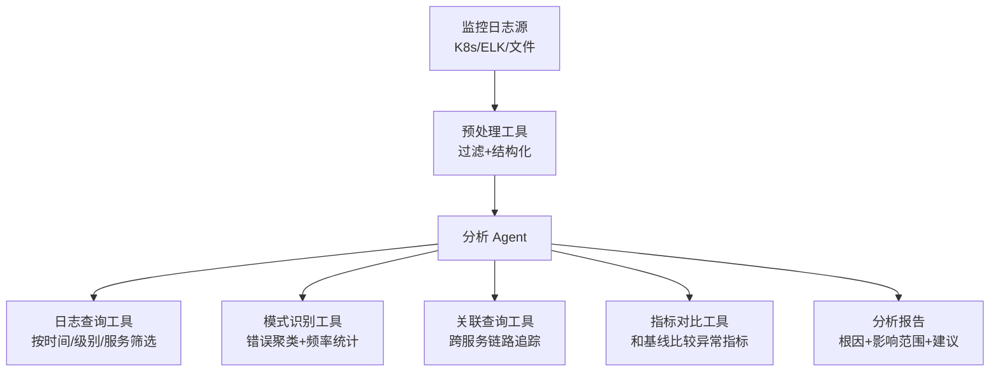
```mermaid
flowchart TD
    L["监控日志源\nK8s/ELK/文件"] --> P["预处理工具\n过滤+结构化"]
    P --> A["分析 Agent"]
    A --> T1["日志查询工具\n按时间/级别/服务筛选"]
    A --> T2["模式识别工具\n错误聚类+频率统计"]
    A --> T3["关联查询工具\n跨服务链路追踪"]
    A --> T4["指标对比工具\n和基线比较异常指标"]
    A --> R["分析报告\n根因+影响范围+建议"]
```

**Agent 设计——三阶段推理**：

| 阶段 | 目标 | 关键动作 |
|------|------|---------|
| **定位** | 从海量日志中缩小范围 | 按时间窗口、错误级别、服务名过滤，得到关键日志片段 |
| **诊断** | 找到根因 | 对错误日志做聚类，识别高频错误模式；跨服务做链路追踪 |
| **输出** | 结构化分析报告 | 根因假设 + 影响范围 + 置信度 + 建议操作 |

Agent 不是一次性读完所有日志——而是**迭代缩小范围**：先用工具查「最近 30 分钟 ERROR 级别日志」，拿到初步线索后再用工具查「相关服务的上下游调用链」，逐步聚焦。

本机进程诊断默认只读。Discovery 先采集 PID、启动时间、命令、父进程、资源和 cgroup 身份；不能只记 PID，因为退出后 PID 会复用。Linux 的 [`/proc/<pid>/status`](https://man7.org/linux/man-pages/man5/proc_pid_status.5.html)可提供状态、UID、线程数、内存、能力与 seccomp 等诊断字段，[`/proc/<pid>/stat`](https://man7.org/linux/man-pages/man5/proc_pid_stat.5.html)包含进程启动时刻；需要跨检查步骤持有稳定引用时使用 [`pidfd_open`](https://man7.org/linux/man-pages/man2/pidfd_open.2.html)，而不是只保存裸 PID。[cgroup v2 文档](https://docs.kernel.org/admin-guide/cgroup-v2.html)则说明进程归属和资源控制接口。执行动作前再次校验身份，避免把旧诊断作用到新进程。

操作按风险分级：读取状态、日志和只读快照可自动；发送诊断信号、抓栈或提高采样率需要限时与审计；`kill`、重启、调整 cgroup 或提权必须展示目标进程、影响和证据并由人工确认。所有命令使用参数化工具与白名单，不让模型拼接任意 shell；动作后重新读取权威状态，迟到结果不能覆盖新的进程生命周期。

**工具设计——四个核心工具**：

```text
1. log_query(time_range, level, service, keyword)
   → 按条件筛选日志，返回结构化结果（时间戳、服务名、错误码、消息）
   → 限制单次返回条数（如 50 条），防止上下文爆炸

2. error_cluster(logs)
   → 对错误日志做文本聚类（相似错误归为一类）
   → 返回：错误模式 + 出现次数 + 首次/末次出现时间 + 代表性日志

3. trace_lookup(trace_id | service + time_range)
   → 查询分布式链路追踪，返回完整调用链和各节点耗时
   → 标出超时/失败节点

4. metric_compare(service, metric, time_range, baseline)
   → 对比当前指标和基线（如 P99 延迟、错误率、QPS）
   → 返回偏离程度和趋势
```

**工具设计的关键原则**：

1. **工具返回结构化数据而非原始文本**：`log_query` 不返回原始日志行，而是解析后的结构化 JSON（时间、级别、服务、错误码），模型更容易推理
2. **单次返回量有上限**：每个工具限制返回条数，Agent 通过缩小条件迭代查询，而非一次拉取全部
3. **工具之间可组合**：`log_query` 的结果中提取 `trace_id`，传给 `trace_lookup` 做链路追踪——Agent 自主决定组合顺序


车辆健康监测应接入车载总线、传感器和维修记录，按时间窗做时序特征、阈值与基线异常检测，再由 Agent 解释故障码并评估风险；高风险故障立即告警或建议停车，不能仅凭模型结论执行控制。课程平台则接入课程资料 RAG，并通过 LMS 工具查询进度、作业和错题，按权限生成讲解、练习与学习计划。

**差距在哪**：新手把日志直接喂模型——这在数据量和噪声面前完全不可行。高手的设计有三个层次：Agent 层做三阶段推理（定位→诊断→输出），工具层做结构化查询和分析，两者通过迭代缩小范围配合工作。面试官考的是你面对大规模非结构化数据时的**系统设计能力**——不是「模型能看多少」，而是「怎么让模型只看关键信息」。

---

### Q：设计一个智能导购助手 Agent，描述其感知、规划、记忆和执行四大模块在分布式架构下的协同逻辑

> 来源：淘天 AI Agent 一面；本轮追问：如果让你设计一个“多模态客服Agent”，用户发图片问问题，你怎么处理？（[小红书多模态秋招二面](https://www.nowcoder.com/discuss/930755993066041344)）；本轮追问：如果让你设计一个“车内语音助手Agent”，你会怎么做？ / 如果让你设计一个“智能泊车Agent”，你会怎么做？（[蔚来——大模型算法岗（智能座舱/自动驾驶）实习一面](https://www.nowcoder.com/discuss/930755708008558592)）

**新手答**：“用大模型对接商品数据库，用户问什么就查什么。”

**高手答**：

智能导购助手不是一个“大模型 + 商品 API”的简单对接，而是一个四模块协同的分布式系统。

**四大模块的职责划分**：

| 模块 | 核心职责 | 关键组件 |
|------|---------|---------|
| 感知（Perception） | 理解用户输入，提取意图和实体 | 多模态理解（文本/图片/语音）、意图分类器、实体抽取器 |
| 规划（Planning） | 任务拆解，制定推荐策略 | 任务分解器、策略选择器（精准匹配/探索推荐/比较决策） |
| 记忆（Memory） | 维护用户画像和知识 | 用户画像服务、会话状态管理、商品知识图谱 |
| 执行（Execution） | 调用下游服务完成操作 | 商品搜索、比价、加购、下单、库存查询 |

**分布式架构下的协同逻辑**：

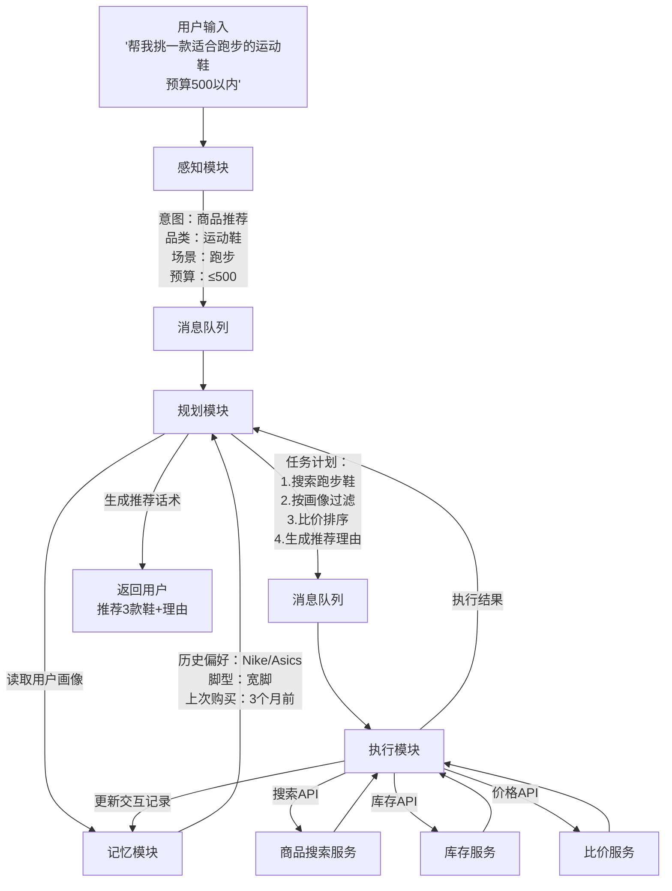
```mermaid
flowchart TB
    U["用户输入\n'帮我挑一款适合跑步的运动鞋\n预算500以内'"] --> P["感知模块"]

    P -->|"意图：商品推荐\n品类：运动鞋\n场景：跑步\n预算：≤500"| MQ1["消息队列"]

    MQ1 --> PL["规划模块"]

    PL -->|"读取用户画像"| M["记忆模块"]
    M -->|"历史偏好：Nike/Asics\n脚型：宽脚\n上次购买：3个月前"| PL

    PL -->|"任务计划：\n1.搜索跑步鞋\n2.按画像过滤\n3.比价排序\n4.生成推荐理由"| MQ2["消息队列"]

    MQ2 --> EX["执行模块"]
    EX -->|"搜索API"| S1["商品搜索服务"]
    EX -->|"库存API"| S2["库存服务"]
    EX -->|"价格API"| S3["比价服务"]

    S1 --> EX
    S2 --> EX
    S3 --> EX

    EX -->|"执行结果"| PL
    PL -->|"生成推荐话术"| R["返回用户\n推荐3款鞋+理由"]

    EX -->|"更新交互记录"| M
```

**模块间协同的三个关键设计**：

**1. 用户画像服务作为共享记忆**

记忆模块不是每个请求独立维护的，而是一个独立的用户画像微服务。感知模块提取的实体信息、执行模块的操作结果，都会异步写回用户画像。规划模块每次制定策略前先读取画像，保证推荐的个性化：

```text
用户画像结构：
├── 基础信息：尺码、偏好品牌、价格敏感度
├── 行为序列：最近浏览/购买/收藏的商品
├── 偏好模型：品类偏好向量（基于行为序列计算）
└── 会话上下文：当前对话中的临时约束（预算、场景等）
```

**2. 商品知识图谱作为结构化知识**

不是每次都用自然语言去查商品数据库。规划模块可以直接在知识图谱上做结构化查询——“跑步鞋”关联“缓震”、“透气”等属性，“宽脚”关联特定鞋楦型号。这比纯文本检索精确得多。

**3. 分布式状态管理**

会话状态（用户当前在比较哪几款、已经排除了什么）存在分布式缓存中（如 Redis），每个模块通过会话 ID 读写状态。关键是要做好**状态一致性**——执行模块发现某商品缺货时，要同步更新会话状态，规划模块下一步才不会继续推荐已缺货商品。

**电商场景的特殊挑战**：

| 挑战 | 应对方案 |
|------|---------|
| 实时库存变动 | 执行模块在最终推荐前做库存二次校验，缺货自动替换 |
| 价格波动 | 比价结果加时效标记，超过 5 分钟重新查询 |
| 跨品类推荐 | 规划模块识别“搭配购买”意图后，并行发起多品类搜索 |
| 用户犹豫不决 | 规划模块切换到“对比决策”策略，主动生成对比表格 |


车内语音助手需增加唤醒、VAD、ASR、对话状态和低时延播报链路，网络异常时保留端侧基础控制；智能泊车则由感知融合车位与障碍物，规划轨迹并由控制器执行，涉及安全的制动、转向必须走确定性校验、限幅和人工接管，不能直接由大模型下发。

**差距在哪**：新手把导购助手当成简单的问答系统——用户问、模型查、返回结果。高手的回答展示了完整的分布式架构设计：四个模块各自独立部署为微服务，通过消息队列解耦；用户画像作为共享记忆保证个性化；商品知识图谱作为结构化知识提升精准度；分布式状态管理保证多模块协同的一致性。面试官考的是你能不能把一个“听起来简单”的需求设计成一个可落地的分布式系统。

---

### Q：多角色智能客服场景（B/C/D 端），用 RAG 还是 Skill？怎么设计？

> 来源：美团Keeta Agent开发一面；本轮追问：如果让你设计一个“车主助手Agent”，回答车辆使用问题，RAG怎么设计？（[蔚来——大模型算法岗（智能座舱/自动驾驶）实习一面](https://www.nowcoder.com/discuss/930755708008558592)）；本轮追问：针对查询杭州今日天气这个具体场景，该场景用不到RAG，该如何处理？（[斑头雁（Agent实习生面试一面）](https://www.nowcoder.com/discuss/930139676764102656)）

**新手答**：「全部用 RAG，建一个大知识库。」

**高手答**：

外卖平台智能客服的核心挑战是**问题类型差异巨大**——同一个平台上，C 端用户问优惠券和问订单赔偿，需要的处理方式完全不同。不能一刀切。

**按问题类型选方案，而非按角色**：

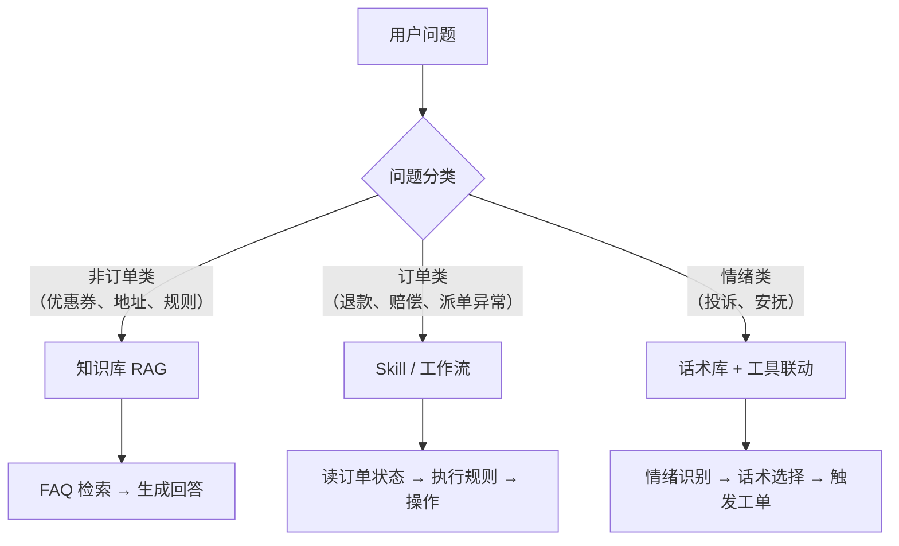
```mermaid
flowchart TB
    Q["用户问题"] --> CLS{"问题分类"}
    CLS -->|"非订单类\n（优惠券、地址、规则）"| RAG["知识库 RAG"]
    CLS -->|"订单类\n（退款、赔偿、派单异常）"| SKILL["Skill / 工作流"]
    CLS -->|"情绪类\n（投诉、安抚）"| HYBRID["话术库 + 工具联动"]

    RAG --> R1["FAQ 检索 → 生成回答"]
    SKILL --> S1["读订单状态 → 执行规则 → 操作"]
    HYBRID --> H1["情绪识别 → 话术选择 → 触发工单"]
```

| 问题类型 | 方案 | 原因 |
|---------|------|------|
| 非订单类（优惠券规则、地址查询、活动说明） | **RAG 知识库** | 答案在文档中，检索即可，不需要操作后端系统 |
| 订单类（退款、赔偿、骑手派单异常） | **Skill / 工作流** | 需要读订单状态、执行业务规则、调用后端 API，知识库搞不定 |
| 情绪类（投诉、差评安抚） | **话术模板 + 工具联动** | 先安抚（检索话术库），再触发工单或转人工 |

**为什么订单类不能用 RAG**：

订单类问题的「答案」不在文档里，而是在**实时业务状态**中。比如用户说「我的外卖怎么还没到」——答案取决于当前订单状态、骑手位置、预计送达时间，这些是动态数据，不是知识库能预先存储的。处理逻辑也不是生成一段文字，而是执行一系列操作：查订单 → 判断状态 → 按规则赔偿/催单/转人工。

这类问题适合**Skill 模式**：预定义好业务流程（状态机或 DAG），Agent 在流程框架内填充参数、执行操作，而非自由生成。

**多角色（B/C/D）的架构差异**：

| 角色 | 典型问题 | 工具集 | 特殊约束 |
|------|---------|--------|---------|
| C 端用户 | 餐品问题、地址、退款、优惠券 | 订单查询、退款申请、优惠券查询 | 需要安抚情绪，赔偿有上限规则 |
| D 端骑手 | 派单异常、长时间无单、导航问题 | 派单系统查询、异常上报、重新派单 | 话术简洁直接，涉及调度系统权限 |
| B 端商户 | 订单管理、结算问题、评价申诉 | 商户后台 API、结算系统、评价管理 | 涉及财务敏感操作，审批链更长 |

三个角色共享底层能力（RAG 知识库、订单系统接口），但**Skill 集合和权限边界完全不同**。架构上用一个 Router 做角色识别，分发到不同的 Agent 配置（不同的 System Prompt + 不同的工具白名单）。


车主助手的 RAG 应按车型、年款、配置和地区建立版本化手册库，解析表格与图片并按故障码、部件和适用范围切分，检索时先识别车辆上下文并过滤权限，回答附来源和不确定性。天气查询属于实时数据场景，应路由到天气 API，校验地点与时间后直接返回，不必检索静态知识库。

**差距在哪**：新手一刀切用 RAG——这对订单类问题完全无效。高手按问题类型（非订单/订单/情绪）选不同方案，且解释了为什么订单类必须用 Skill 而非知识库。面试官考的是你在具体业务场景下的**方案选型能力**——不是「什么都能用 RAG」，而是「什么场景该用什么」。

---

### Q：在“推理-行动”循环中，如何设计来纠正逻辑塌缩或无效工具调用？

> 来源：淘天 AI Agent 一面；本轮追问：工具调用型Agent的基本流程如何设计？（[滴滴一些面经合集（算法）](https://www.nowcoder.com/feed/main/detail/37cae17c5f2a49ee81375721f53bbf9b)）

**新手答**：“失败了就重试，多试几次总能成功。”

**高手答**：

先定义两个核心问题：

- **逻辑塌缩**：模型在推理-行动循环中陷入局部最优——反复用同一个工具、重复相同的推理模式、或者在同一组参数上死循环。本质是模型的“思维多样性”丧失了
- **无效工具调用**：选错工具、参数填错、调用了不存在的工具、或者工具返回了错误但模型没有正确处理

我们的纠正体系分**三层**：实时检测、主动干预、结构预防。

**第一层：实时检测**

```text
检测信号：
① 重复检测：连续 N 步（通常 N=3）选择同一个工具或生成相似的推理文本
② 无进展检测：执行了 K 步但任务状态没有实质变化（用状态哈希判断）
③ 工具调用异常率：最近 M 次调用中失败率超过阈值（如 >60%）
④ 推理深度超限：总步数超过预设上限（根据任务复杂度动态调整）
```

**第二层：主动干预**

检测到异常后，不是简单重试，而是根据异常类型采取不同策略：

| 异常类型 | 干预策略 |
|---------|---------|
| 逻辑塌缩（重复工具） | 强制排除最近使用的工具，注入“请换一种方法”的反思提示 |
| 逻辑塌缩（推理打转） | 注入任务进度摘要 + 已尝试方法列表，要求模型重新审视目标 |
| 参数错误 | 结构化错误信息反馈：将工具的参数 schema 和实际传入值一起喂给模型 |
| 工具不存在 | 将可用工具列表重新注入上下文，附带每个工具的功能摘要 |
| 多次失败 | 触发“策略切换”：暂停当前子任务，尝试替代路径或降级方案 |

**第三层：结构预防**

从架构上减少塌缩和无效调用的概率：

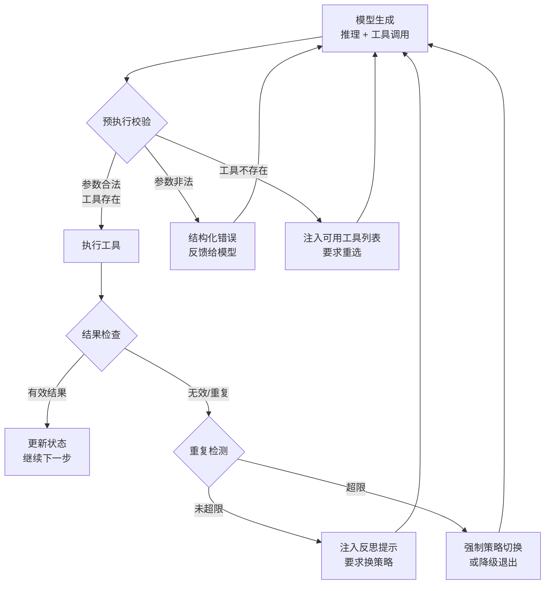
```mermaid
flowchart TB
    T["模型生成\n推理 + 工具调用"] --> V{"预执行校验"}
    V -->|"参数合法\n工具存在"| E["执行工具"]
    V -->|"参数非法"| F1["结构化错误\n反馈给模型"]
    V -->|"工具不存在"| F2["注入可用工具列表\n要求重选"]
    F1 --> T
    F2 --> T
    E --> O{"结果检查"}
    O -->|"有效结果"| P["更新状态\n继续下一步"]
    O -->|"无效/重复"| D{"重复检测"}
    D -->|"未超限"| R["注入反思提示\n要求换策略"]
    D -->|"超限"| S["强制策略切换\n或降级退出"]
    R --> T
    S --> T
```

**预防机制的关键设计**：

1. **工具调用前置校验**：在调用工具之前，用 JSON Schema 校验参数格式和取值范围，拦截明显错误
2. **多样性约束**：在工具选择时引入“最近 N 步不重复”的软约束，降低塌缩概率
3. **错误分类与结构化反馈**：不是把原始报错扔给模型，而是分类后构造“错误原因 + 建议修正方向”的结构化提示
4. **全局进度追踪**：维护一个任务状态快照，每步执行后更新，模型能看到“已完成什么、还差什么”，减少无意义重复

**差距在哪**：新手只会“失败重试”——这是最低级的容错，对逻辑塌缩完全无效（重试只会重复同样的错误）。高手有检测、干预、预防三层体系：检测层识别异常模式，干预层按异常类型精准应对，预防层从架构上降低问题发生的概率。面试官考的是你对 ReAct 循环失败模式的理解深度——不只是“能跑”，而是“跑偏了怎么纠”。

---

### Q：如何保障自然语言任务描述能精准转化为稳定、可靠的执行路径？

> 来源：蚂蚁 AI应用开发 二面；[本轮来源](https://www.nowcoder.com/feed/main/detail/14fe3975c0464b02bb58b24be1b63a21)；[本轮来源](https://www.nowcoder.com/feed/main/detail/595a0cb450cf45e9a47a0d32084b9099)

**新手答**：「优化 Prompt，让模型更好地理解任务。」

**高手答**：

自然语言到执行路径的转化是 Agent 系统最核心也最脆弱的环节。保障策略分四层：

**1. 意图结构化（NL → Structured Intent）**

不要让模型直接从自然语言跳到执行。先用一步将自然语言转为**结构化意图表示**——任务类型、关键参数、约束条件、期望输出格式。结构化表示是后续所有处理的基础。

```text
用户：「帮我查一下上周北京到上海的机票，最便宜的」
→ {task: "flight_search", params: {from: "北京", to: "上海", date_range: "上周", sort: "price_asc"}}
```

**2. 执行计划校验（Plan Validation）**

模型生成执行计划后，不直接执行，先做校验：
- **参数完整性**：必要参数是否都有值
- **工具可用性**：计划中调用的工具是否存在且可用
- **逻辑合理性**：步骤顺序是否合理（不能在查询前就尝试格式化结果）
- **安全合规**：是否涉及高风险操作，需不需要人工确认

**3. 确定性兜底（Deterministic Fallback）**

对于高频、模式固定的任务，不依赖模型规划，而是用**规则引擎或模板匹配**直接路由到预设流程。模型只在规则无法覆盖的情况下才介入规划。

```text
高频固定任务 → 规则路由（确定性100%）
中频半固定任务 → 模型规划 + 模板约束
低频开放任务 → 模型自由规划 + 校验兜底
```

**4. 执行监控与回滚**

执行过程中持续监控——每一步的输入输出是否符合预期。发现偏离时，优先尝试局部修正；修正失败则回滚到最近的正确状态，而非从头重来。

**差距在哪**：新手把问题简化为「优化 Prompt」。高手展示了四层保障体系——意图结构化→计划校验→确定性兜底→执行监控，且能说清楚不同任务类型适用不同的可靠性策略。面试官考的是你有没有把「NL→执行」当成一个需要系统性保障的工程问题来设计。

---

## Q：Skill 和 Workflow 的区别是什么？什么场景该用 Skill 而不是 Workflow？

> 来源：快手AI应用开发一面 【[快手 AI 全栈一面](https://www.nowcoder.com/feed/main/detail/a30242712e8d456c839ff4223470f491)同题】；[本轮来源](https://www.nowcoder.com/discuss/926528416512315392)；本轮追问：为什么不用固定代码 workflow，而是用 prompt 描述流程？（[本轮追问](https://www.nowcoder.com/feed/main/detail/ac25d49b0692473c8f65654adda82b9b)）；本轮追问：Loop Engineer 和 Graph Engineer 的区别是什么？（[本轮追问](https://www.nowcoder.com/feed/main/detail/c639e7ea920b49b1834839f2a090809e)）

**新手答**：“Skill 就是一个功能模块，Workflow 是流程编排，两个差不多吧。”

**高手答**：

Workflow 是面向**业务流程**的编排，适合步骤稳定、分支明确、有审批和状态流转的任务，比如“提交理赔申请 → 校验材料 → 人工审核 → 打款”。它强调的是顺序、状态、重试和完整性。

Skill 是面向**能力复用**的封装，适合被不同 Agent、不同流程按需调用。它有明确的输入输出契约，强调可组合、可编排。

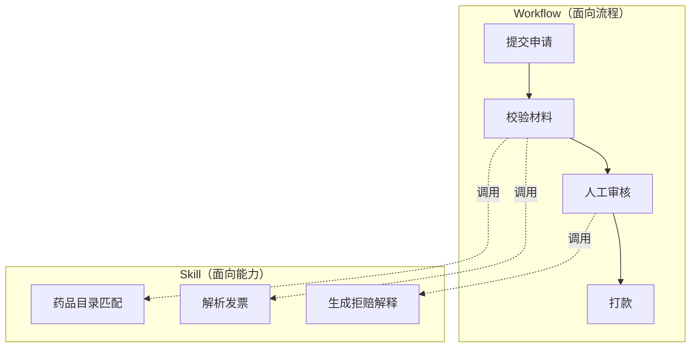
```mermaid
graph TB
    subgraph Workflow["Workflow（面向流程）"]
        W1[提交申请] --> W2[校验材料]
        W2 --> W3[人工审核]
        W3 --> W4[打款]
    end
    subgraph Skill["Skill（面向能力）"]
        S1[药品目录匹配]
        S2[解析发票]
        S3[生成拒赔解释]
    end
    W2 -.->|调用| S1
    W2 -.->|调用| S2
    W3 -.->|调用| S3
```

关键判断标准：

| 维度 | Workflow | Skill |
|------|----------|-------|
| 目的 | 完成端到端业务流程 | 完成一个稳定业务能力 |
| 复用 | 流程间很难复用 | 跨流程、跨 Agent 复用 |
| 接口 | 状态机 + 审批点 | 稳定 Input/Output Schema |
| 典型例 | 理赔审核全流程 | 药品目录匹配能力 |

以理赔场景为例：门诊理赔、住院理赔、药品理赔三条 Workflow 都需要“药品目录匹配”能力。如果做成 Workflow 节点，三条流程各复制一份，改一处要改三处。做成 Skill 后只维护一份，任何流程按需调用。

Skill 的定义更像一个稳定接口：

```json
{
  "skillName": "medical_catalog_match",
  "input": {
    "drugName": "string",
    "diagnosisCode": "string"
  },
  "output": {
    "covered": "boolean",
    "matchedRuleId": "string",
    "reason": "string"
  }
}
```

**差距在哪**：新手分不清 Skill 和 Workflow，混为一谈或者觉得 Skill 只是小功能。高手能清晰说出两者的设计目标不同——Workflow 关注流程完整性和状态流转，Skill 关注能力复用和可组合性。面试官考的是你对**系统解耦和能力沉淀**的理解：什么时候该固化流程，什么时候该抽取通用能力。

---

## Q：DAG 与含循环图在 Agent 编排中的区别和适用场景

> 来源：猎豹移动Agent全栈开发；[度小满一面](https://www.nowcoder.com/feed/main/detail/41baab8c631647568203ebfaf3898574)

**新手答**：“DAG 就是不能有环的图，有环就是循环图。”

**高手答**：

这涉及 Agent 编排的底层拓扑选择：

**DAG（有向无环图）**：
- 特点：每个节点只执行一次，执行路径确定，可以拓扑排序
- 适合场景：确定性工作流（数据 ETL、文档处理管线、审批流程）
- 优势：可预测执行时间和成本、容易做并行优化、调试简单
- LangGraph 中：用条件边但无回边，本质是分支-汇聚结构

**含循环图（如循环 RAG、ReAct Loop）**：
- 特点：允许回边，节点可能多次执行，需要终止条件
- 适合场景：需要迭代精化的任务（多轮检索、自我修正、Plan-Execute-Reflect）
- 优势：能处理不确定性任务，支持 self-reflection 和渐进式解决
- 风险：死循环、成本不可控，需要 max_iterations + 循环检测

**混合架构**：实际生产中常见——外层 DAG 控制大流程（如：理解→规划→执行→验证），内层节点允许循环（如执行节点内的 ReAct loop）。

**差距在哪**：面试官要看你是否理解“确定性和灵活性的 trade-off”——DAG 省钱可控但傻，循环图聪明但贵且危险，工程上常常混合使用。

---

## Q：基于强化学习的 Agent 与传统基于 Prompt 的 Agent 有何区别？各自的适用场景？

> 来源：Agent开发八股合集（南京大学）；本轮追问：对 Agent 的学习了解多少？（[本轮追问](https://www.nowcoder.com/feed/main/detail/5b7e7cb510914d3baa40af22ce602b4c)）

**新手答**：“RL Agent 就是用强化学习训练模型，Prompt Agent 就是写提示词让模型做事，RL 更高级。”

**高手答**：

这两种范式解决的核心问题不同：**Prompt-based Agent 依赖模型的 in-context learning 能力做决策，RL-based Agent 通过环境反馈直接优化策略网络。**

| 维度 | Prompt-based Agent | RL-based Agent |
|------|-------------------|----------------|
| **决策机制** | 每步由 LLM 根据 Prompt + 上下文生成动作 | 策略网络根据状态直接输出动作概率 |
| **学习方式** | 无需训练，靠 Prompt 设计 + Few-shot 引导 | 需要大量环境交互数据 + 奖励信号训练 |
| **可解释性** | 高——每步有自然语言推理链 | 低——策略是黑箱权重 |
| **泛化性** | 强——LLM 自带海量世界知识，换任务改 Prompt 即可 | 弱——换环境需要重新训练或 Transfer |
| **稳定性** | 依赖模型能力上限，复杂任务易偏 | 训练收敛后执行确定性高 |
| **成本结构** | 推理时 token 成本高 | 训练成本高，推理成本低 |

**适用场景对比：**

- **Prompt-based**：任务多样、需要通用推理、环境复杂且难以模拟（如代码编写、开放对话、信息检索）。大多数企业级 Agent 产品用这种。
- **RL-based**：环境可模拟、奖励信号明确、动作空间有限（如游戏 AI、机器人控制、特定优化任务）。WebArena 类 benchmark 中 RL fine-tuned Agent 效果好。

**现实中的融合趋势（RLHF/GRPO）：**

当前 LLM Agent 实际上已经融合了两者——基座模型用 RL（RLHF/GRPO）对齐人类偏好后，部署时以 Prompt-based 方式运行。更前沿的方向如 Agentic RL（Agent 在环境中探索生成轨迹，再用 RL 优化推理策略）正在模糊这条界限。

**差距在哪**：面试官考的是你对“Agent 决策机制”的深度理解。新手把 RL 和 Prompt 当成对立面，高手能指出两者解决不同层面的问题，并能说出当前“基座用 RL 训练 + 推理用 Prompt 驱动”的融合范式，体现你对技术全栈的理解。

---

## Agent 中间件（Middleware）

### Q：AI 系统该做单域工具还是跨团队通用平台？怎么选？

> 来源：数据智能查询平台面试 【[英迈软件一面](https://www.nowcoder.com/feed/main/detail/355e6818b7e7418ba6f2c88c6bc50351)追问：垂直 Agent 相比 Coze 的优势】【[阿里国际 Agent 开发三面](https://www.nowcoder.com/feed/main/detail/747f07e71f4448bebdce6ada5de800cd)追问：标准模型服务与业务工程化】【[互联网金融 Agent 开发三面](https://www.nowcoder.com/feed/main/detail/88c55ee65af04ac98c218b9d17c47a71)追问：通用能力垂直化】【[阿里千问平台开发复活赛一面](https://www.nowcoder.com/feed/main/detail/141447389dab4e8e9ca6db742a514f39)追问：Agent 中台耦合边界】；本轮追问：你本地搭建Agent工作流，还是团队有统一工作流平台？（[美团AI Agent一面](https://www.nowcoder.com/feed/main/detail/50bcdc47e7754aa7be59b6318fea514b)）

**新手答**：“做通用平台，这样 ROI 高。”

**高手答**：

这不是一个技术问题，是一个**阶段+资源**的决策问题：

| 维度 | 单域工具 | 通用平台 |
|------|---------|---------|
| 适用阶段 | 0→1 验证、早期团队 | 已有多个业务域验证成功后 |
| 投入成本 | 低（聚焦一个场景做深） | 高（需要抽象能力+多场景适配） |
| 迭代速度 | 快（只服务一个业务方） | 慢（改一处需兼容所有域） |
| 核心风险 | 做深了但推不开 | 做薄了每个域都不好用 |

**判断框架——三个信号判断是否该平台化：**

1. **重复建设信号**：多个团队在独立做类似的事（比如 3 个团队各自搭了 Text2SQL），说明有平台化需求
2. **架构可抽象性**：核心链路（检索→生成→校验）是否跨域通用？差异是否可以通过配置而非代码隔离？
3. **组织支撑**：有没有平台团队的编制和 KPI 支持？没有专人维护的“通用平台”最终会变成无人认领的烂尾项目

**Text2SQL 场景的典型路径：**
- 阶段一：先为一个业务域（如电商运营）做单域 Text2SQL，把准确率做到 85%+
- 阶段二：第二个业务域（如财务）接入时，抽取通用层（DDL 管理、SQL 校验、评测框架）+ 业务配置层（规则库、示例库按域隔离）
- 阶段三：多域验证后再做平台化——提供 Web 控制台让业务方自助配置规则和示例

平台只标准化稳定契约，例如模型/Tool 接入、身份、Trace、评测、版本和发布；领域层保留业务 Schema、规则、权限、专属工具、流程门禁和验收集。所谓“垂直 Agent 的优势”必须能落到这些资产及业务指标，而不是换一个 Prompt。中台与业务通过版本化接口和扩展点协作：平台不能直接依赖某个业务对象，业务也不能绕过平台安全与审计；当第二、第三个领域仍需要复制核心代码时，才有证据继续上收抽象。


实践上先在本地用轻量编排完成单域 PoC，验证任务链路、工具协议和效果；团队已有统一平台时优先接入其模型、权限、Trace、评测和发布能力，业务差异通过配置和扩展点保留。只有平台能力不足且验证需要快速迭代时，才暂时本地实现，再按稳定契约迁移。

**差距在哪**：新手直觉性地选“做通用的”——但过早平台化是创业公司最常见的失败模式之一。高手用阶段判断框架说明“先单域做深验证，再逐步抽象平台化”的渐进策略。面试官考的是你对“做什么”的决策能力，而不只是“怎么做”的执行能力。

---


### Q：讲一讲 Agent 的 Middleware（中间件）是什么？

> 来源：字节跳动 Agent开发实习生一面

**新手答**：“就是后端框架里的中间件吧，处理请求的。”

**高手答**：

Agent Middleware 和 Web 框架的中间件思想相同——在核心执行流的前后插入**可组合的横切逻辑**——但作用对象从 HTTP 请求变成了 Agent 的每一步决策。

**Agent Middleware 的典型处理位置：**

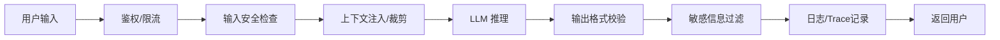
```mermaid
flowchart LR
    A[用户输入] --> M1[鉴权/限流]
    M1 --> M2[输入安全检查]
    M2 --> M3[上下文注入/裁剪]
    M3 --> C[LLM 推理]
    C --> M4[输出格式校验]
    M4 --> M5[敏感信息过滤]
    M5 --> M6[日志/Trace记录]
    M6 --> B[返回用户]
```

**常见 Middleware 类型：**

| 阶段 | 中间件 | 职责 |
|------|--------|------|
| 请求前 | Auth Middleware | 验证用户身份和权限 |
| 请求前 | Rate Limiter | Token 预算控制、QPS 限流 |
| 推理前 | Context Middleware | 注入记忆、检索结果、系统规则 |
| 推理前 | Safety Filter | 拦截 Prompt 注入、敏感输入 |
| 推理后 | Format Validator | 校验 JSON schema、必填字段 |
| 推理后 | PII Redactor | 过滤模型输出中的个人信息 |
| 工具调用 | Tool Guard | 校验参数合法性、拦截危险操作 |
| 全局 | Trace/Log | 记录每步输入输出，支持回溯 |

**为什么用中间件模式而不是硬编码：**
1. **可组合**：不同场景按需组装不同中间件栈，不用改核心逻辑
2. **可复用**：安全检查、日志记录等横切关注点写一次到处用
3. **可测试**：每个中间件可以独立单测
4. **关注点分离**：核心推理逻辑不被安全、日志、格式化等代码污染

**差距在哪**：面试官用这题测试你对“Agent 不只是一个 LLM 调用”的理解。只会调 API 的人不知道生产级 Agent 需要多少横切逻辑。能说出 Middleware 栈的分层设计 + 每层的职责，说明你理解从 Demo 到生产之间的工程距离。

---

## Q：Coding Agent 的完整链路是怎么运转的？从用户输入到代码产出的全流程

> 来源：字节跳动 Agent 二面（Coding Agent）【百度大模型研发二面追问：Claude Code 用户交互全流程数据流】；本轮追问：当前任务主要由数据或其他 Agent 自动驱动，还是由用户通过人机交互发起？（[本轮追问](https://www.nowcoder.com/feed/main/detail/13bdf306b95f4cc9b6fafeec2e74ad70)）；[上海联蔚数科agent面经](https://www.nowcoder.com/feed/main/detail/97ee6dec31b14d12a1f800b709e21a4c)；[拼多多AI Agent一面，双机位，全程严肃](https://www.nowcoder.com/feed/main/detail/3cb8b70b192f4051b3c19ace4dda1beb)；[上海代码一行科技公司 - 9月10日- 一面-秋招](https://www.nowcoder.com/discuss/929791548588294144)；[斑头雁（Agent实习生面试一面）](https://www.nowcoder.com/discuss/930139676764102656)

**新手答**：“用户输入需求，模型生成代码，就这样。”

**高手答**：

Coding Agent 不是“用户说一句话、模型吐一段代码”的单轮对话——它是一个**多阶段闭环系统**，从用户输入到代码产出经历了至少六个阶段：

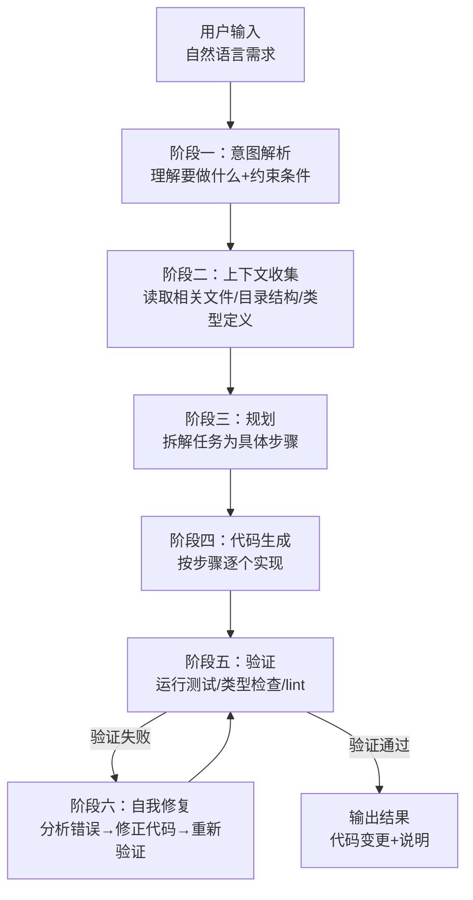
```mermaid
flowchart TB
    A["用户输入\n自然语言需求"] --> B["阶段一：意图解析\n理解要做什么+约束条件"]
    B --> C["阶段二：上下文收集\n读取相关文件/目录结构/类型定义"]
    C --> D["阶段三：规划\n拆解任务为具体步骤"]
    D --> E["阶段四：代码生成\n按步骤逐个实现"]
    E --> F["阶段五：验证\n运行测试/类型检查/lint"]
    F -->|"验证失败"| G["阶段六：自我修复\n分析错误→修正代码→重新验证"]
    G --> F
    F -->|"验证通过"| H["输出结果\n代码变更+说明"]
```

从用户交互数据流看，前端先创建或恢复 Session/Thread，把输入、附件和当前工作区标识交给 Runtime；Runtime 以 SSE/WebSocket 流式返回模型文本、工具请求、审批请求、工具结果摘要和状态变化。需要工具时，前端只展示并收集授权，真正执行由受控 Tool Runtime 完成；结果写入 Transcript/State 后再进入下一轮模型调用。最终代码 diff、测试结果和完成状态分别作为结构化事件返回，断线重连按事件序号续传，而不是重新执行整个任务。

**各阶段的关键设计**：

**阶段一：意图解析**——不只是理解“用户想要什么”，还要识别隐含约束：用户的技术栈偏好（从现有代码推断）、项目规范（从配置文件和 lint 规则推断）、改动范围（是新增功能还是修 bug）。

**阶段二：上下文收集**——这是 Coding Agent 最核心的能力。模型不能凭空写代码，它需要“看到”相关的代码。关键是**精准收集而非全量加载**：
- 先读目录结构，定位相关文件
- 读取目标文件和被依赖的模块
- 检索类型定义、接口契约、测试用例作为参考
- 加载项目级规则（如 CLAUDE.md 中的编码规范）

**阶段三：规划**——把一个模糊需求拆成具体的文件操作序列。例如“添加用户注册功能”拆解为：① 创建路由文件 → ② 实现 handler → ③ 添加数据库迁移 → ④ 补充测试 → ⑤ 更新 API 文档。

**阶段四：代码生成**——按步骤逐个实现，每步生成后立即写入文件。关键技巧是**增量生成**——不是重写整个文件，而是精确编辑目标区域，减少对已有代码的干扰。

**阶段五：验证**——生成的代码必须通过验证才算完成。验证手段包括：运行测试套件、类型检查（TypeScript/mypy）、lint 检查、甚至运行应用看是否启动正常。

**阶段六：自我修复**——验证失败时不直接报错给用户，而是分析错误信息（编译错误、测试失败、lint 警告），定位问题根因，修正代码后重新验证。这个循环通常限制在 2-3 次。

**与普通 Chat 补全的本质区别**：

| 维度 | Chat 代码补全 | Coding Agent |
|------|-------------|--------------|
| 上下文 | 用户手动提供 | Agent 自主探索和收集 |
| 粒度 | 生成一段代码片段 | 完成端到端的功能实现 |
| 验证 | 用户自行验证 | Agent 自动验证并修复 |
| 文件操作 | 无 | 直接创建/编辑/删除文件 |
| 持续性 | 单轮 | 多轮闭环直到任务完成 |

**差距在哪**：新手把 Coding Agent 理解为“更强的代码补全”。高手理解它是一个六阶段闭环系统——意图解析→上下文收集→规划→生成→验证→修复，每个阶段都有独立的工程设计。面试官考的是你对 Coding Agent 全链路的认知深度，以及你理不理解“自主收集上下文”和“自动验证修复”才是它的核心价值。

---

## Q：只有模型 API 和 VS Code，如何从零搭建一套可用的 Agent 应用？

> 来源：百度大模型研发工程师二面（2026-08-21）【[月之暗面（Moonshot）- Agent 应用开发岗](https://www.nowcoder.com/discuss/926274239747952640)追问：从零开始设计一个 Agent 应用时，整体规划如何制定？】；本轮追问：为什么自己去做一个 code agent？（[本轮追问](https://www.nowcoder.com/feed/main/detail/77660a0c109d42f89001980a8f94c1a6)）；[滴滴一些面经合集（算法）](https://www.nowcoder.com/feed/main/detail/37cae17c5f2a49ee81375721f53bbf9b)

**新手答**：“写一个 while 循环调用模型，再把工具函数注册进去。”

**高手答**：

先做最小闭环，而不是先引入框架：定义 `messages` 和 Tool Schema，调用模型；若返回 Tool Call，则校验参数、执行工具、把 Tool Result 以正确角色写回上下文，再次调用模型，直到得到 Final Answer。VS Code 只是开发宿主，真正的 Agent 来自模型决策、工具执行和状态推进三者组成的循环。

从 Demo 到可用系统还要补四层：接入层负责鉴权、流式输出和请求 ID；Runtime 负责状态机、最大步骤、Timeout、取消和 Budget；Tool 层负责权限、幂等、Sandbox 和人工审批；数据与治理层负责 Session、Checkpoint、Trace、Eval 和成本。所有状态应持久化，Worker 不拥有唯一事实，工具副作用也不能依赖“模型不会重复调用”。

实现顺序建议是：先跑通一个只读工具闭环；再增加结构化校验和失败状态；随后加入持久化、恢复与观测；最后才抽象 Skill、Memory、多 Agent 和平台化能力。每一步都用固定任务集做回归，避免代码越来越多但任务成功率没有提升。

**差距在哪**：新手只会写 ReAct 循环，高手能从最小闭环推导出生产 Runtime，并知道框架只是这些责任的封装，不是 Agent 成立的前提。

---

## Q：用拓扑排序（规则式）管理任务依赖 vs 让大模型自己推理决策执行顺序，各有什么问题？

> 来源：广州某小厂 Agent 后端开发二面

**新手答**：“拓扑排序是固定的不灵活，大模型灵活但不准。”

**高手答**：

这道题的核心是**确定性与灵活性的工程权衡**——两种方案各自在什么场景下崩溃。

**方案一：拓扑排序（规则式 DAG 调度）**

原理：把所有任务和依赖关系建模为有向无环图，用拓扑排序确定执行顺序，无依赖的任务可以并行。

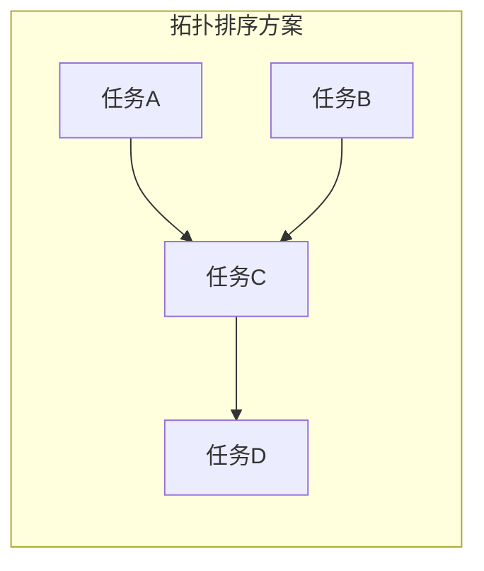
```mermaid
flowchart LR
    subgraph dag["拓扑排序方案"]
        A["任务A"] --> C["任务C"]
        B["任务B"] --> C
        C --> D["任务D"]
    end
```

**优势**：
- 执行顺序确定、可预测、可重复
- 天然支持并行——无依赖的任务同时执行
- 调度开销极低（O(V+E)），不消耗 token
- 容易做可视化和调试

**问题**：
1. **依赖关系必须提前定义**——如果任务之间的依赖取决于运行时结果（“任务 B 是否需要执行取决于任务 A 的返回值”），静态 DAG 无法表达
2. **无法处理动态新增任务**——执行过程中发现需要额外步骤，DAG 已经定死了
3. **对环敏感**——如果业务逻辑本身存在条件性循环（“检查不通过则修正后重新检查”），DAG 无法建模
4. **过度依赖前期规划质量**——如果 Planner 一开始就规划错了依赖关系，整条链路都跑偏

**方案二：大模型自主推理执行顺序**

原理：每步执行完后让模型根据当前状态决定下一步做什么，不预定义执行图。

**优势**：
- 极其灵活——能根据中间结果动态调整策略
- 能处理模糊需求和意外情况
- 不需要提前穷举所有依赖关系

**问题**：
1. **路径震荡**——模型每步重新推理，可能前一步决定做 A，下一步又改成 B，执行路径来回抖动
2. **全局最优缺失**——模型是逐步贪心决策，缺乏全局视角，可能漏掉可以并行的任务
3. **不可重复**——同样的输入，模型可能给出不同的执行顺序，调试困难
4. **成本高昂**——每步决策都消耗一次 LLM 推理，token 成本线性增长
5. **循环风险**——模型可能在两个任务之间来回跳转，没有拓扑排序的“无环保证”

**生产环境的最佳实践：混合方案**

```text
粗粒度：用拓扑排序管理阶段间的硬依赖（信息收集→分析→生成→验证）
细粒度：每个阶段内部让模型灵活决策具体动作
动态修正：当中间结果导致硬依赖变化时，触发重新拓扑排序
```

具体实现：
1. **Planner 生成初始 DAG**：模型规划出任务和依赖关系，系统做拓扑排序确定执行顺序
2. **执行中监控前提条件**：每个任务执行前检查其依赖是否满足，不满足则等待或触发修正
3. **有限重规划**：关键前提失效时允许模型修改 DAG（增删节点/边），但重规划次数有上限
4. **并行兜底**：无依赖任务自动并行，降低总延迟

**差距在哪**：新手只说了“一个固定一个灵活”——这是最表层的对比。高手详细分析了两种方案各自崩溃的具体场景（静态 DAG 无法处理动态依赖、模型决策存在路径震荡和成本问题），且给出了混合方案的工程实现。面试官考的是你在设计 Agent 调度系统时的权衡能力——不是“选 A 还是选 B”，而是“怎么组合 A 和 B 取长补短”。

---

### Q：Agent 如何判断已经收集了足够的信息，最终给出输出结论？

> 来源：字节跳动多模态算法一面【字节火山引擎 Managed Agent 一面追问：Loop 继续与结束条件】【阿里 Agent Infra 一面题库同题：停止条件】【[平安健康保险 AI 应用开发一面](https://www.nowcoder.com/feed/main/detail/6c11a75a8bd44628943deff3e42ae15c)追问：Agent 偷懒、过早结束或省略必要步骤】【[未知公司 Agent 二面](https://www.nowcoder.com/feed/main/detail/16675d793c0c42e8a6b46d42fb561561)追问：任务结束与会话终止策略】【[快手 AI 全栈一面](https://www.nowcoder.com/feed/main/detail/a30242712e8d456c839ff4223470f491)同题】

**新手答**：“设置最大循环次数，到了就输出。”

**高手答**：

这是 Loop Engineering 的核心问题——退出条件设计。仅靠 max iterations 是最粗暴的兜底，真正的“足够”需要多维度判断：

**1. 目标对齐检查**：
- 用户原始需求拆分成的子目标是否都已覆盖
- 对每个子目标标记 resolved/unresolved 状态
- 全部 resolved 时退出

**2. 信息增量检测**：
- 对比最近 N 轮的信息增益——如果连续 2-3 轮没有新增有效信息，说明已达到信息饱和
- 信息增益可以通过“本轮工具返回是否改变了结论”来近似衡量

**3. 置信度收敛**：
- 让模型在每轮结束时输出一个 confidence score
- 当 confidence 超过阈值（如 0.85）且连续 2 轮稳定 → 退出
- 如果 confidence 一直不收敛 → 可能任务本身模糊，需要反问用户

**4. 工程防护**：
- max_iterations 作为硬兜底
- token budget 作为成本约束
- 相同工具+相同参数连续调用 → 强制跳出（死循环检测）

还要区分**任务完成**和**会话结束**。任务只能由成功条件和外部证据关闭，不能因为模型输出了 `finish` 就完成；会话则可以在任务进入 `COMPLETED / FAILED / CANCELLED` 后按 TTL 回收交互状态。任务等待用户时应进入 `WAITING_FOR_USER` 并释放执行资源，而不是提前清空状态或无限占用 Worker。

为防止 Agent “偷懒”，Verifier 应逐项检查子目标、必需步骤和交付物，且关键证据来自工具结果、测试或业务终态，不能让执行模型自证完成。缺少证据时回到补充执行、澄清或明确的部分完成状态；预算耗尽只代表停止执行，不代表目标已经达成。

**差距在哪**：新手只知道 max iterations。高手理解“够不够”是一个多信号融合决策——目标覆盖、信息增量、置信度收敛三个维度联合判断，并用工程防护兜底。这直接决定了 Agent 的“智商”——太早停会漏信息，太晚停会烧 token。

---

### Q：Agent 的 thinking 阶段怎么决定是调用工具还是直接回复？

> 来源：腾讯AI应用开发实习生一面【字节火山引擎 Managed Agent 一面同题】；本轮追问：配置完工具之后，Agent运行时怎样真正去调用工具，拿到工具结果再回复用户？（[斑头雁（Agent实习生面试一面）](https://www.nowcoder.com/discuss/930139676764102656)）

**新手答**：“模型会根据 system prompt 里的指令判断需不需要调用工具。”

**高手答**：

这个决策本质上是模型在每一步的 action space 里做选择——action space 包括「调用某个工具」和「直接生成回复」。决策依据来自三个维度：

**1. 信息完备性判断**：
- 当前上下文是否已经包含回答用户问题的所有信息
- 如果缺失关键信息（如实时数据、外部状态），必须调用工具
- 如果信息已完备，直接回复——多余的工具调用是浪费 token

**2. 工具可用性匹配**：
- 当前 available tools 里有没有能填补信息缺口的工具
- 工具 schema 的语义描述和当前需求的匹配度
- 如果没有匹配的工具，即使信息缺失也只能基于已有知识回复

**3. 置信度与风险评估**：
- 对于高确定性问题（如代码语法）→ 直接回复
- 对于需要实时/准确数据的问题（如查询余额）→ 必须调用工具
- 对于模棱两可的情况 → 优先调用工具确认，而非凭“感觉”回答

**工程上的加强手段**：
- 在 system prompt 中明确“什么情况必须调工具”的规则
- 在 schema 中标注 `required_when` 条件，降低模型犹豫的概率
- 通过 few-shot 示例展示正确的决策模式


运行时通常是循环：把用户消息、历史上下文和工具 schema 一起发给模型；若返回 tool call，校验工具名与参数，执行权限、超时控制后调用工具，将结果以 tool 消息追加上下文，再次请求模型；若返回最终文本则结束。还需限制最大轮次并处理参数错误、超时和失败降级。

**差距在哪**：新手把它当成一个黑盒的“模型自己判断”。高手理解这是一个可以被工程化引导的决策过程——通过工具描述设计、system prompt 规则、few-shot 示例三个抓手，让模型在“工具调用”和“直接回复”之间做出更可控的选择。

---

## Q：设计一个内部的多源文档问答 AI，架构设计是什么？

> 来源：百度/AI智能体开发一面 【[百度 Agent 一面](https://www.nowcoder.com/feed/main/detail/53542e2dcfd44b1d84b0ae55b4fc1b35)同题】【[OPPO IT 开发一面](https://www.nowcoder.com/discuss/923561467092160512)追问：Word 图文上下文与图文混合响应】；本轮追问：RAG 项目的问答对是什么形式？（[本轮追问](https://www.nowcoder.com/discuss/926677767104532480)）；本轮追问：有没有做什么内部的 QA 模型，来专门回答已有的一类问题？（[本轮追问](https://www.nowcoder.com/discuss/926928449204129792)）；本轮追问：如果给一个项目增加AI问答功能，前后端分别要注意什么？请从体验、安全和工程角度说明。（[度小满AI全栈一面](https://www.nowcoder.com/discuss/931241025345978368)）

**新手答**：“用 RAG 就行，把文档切块建索引。”

**高手答**：

这是一道场景设计题，核心约束在“多源”二字——不同来源的文档格式、权限、时效性各不相同，不是单纯的 RAG 能解决的。

**整体架构分五层**：

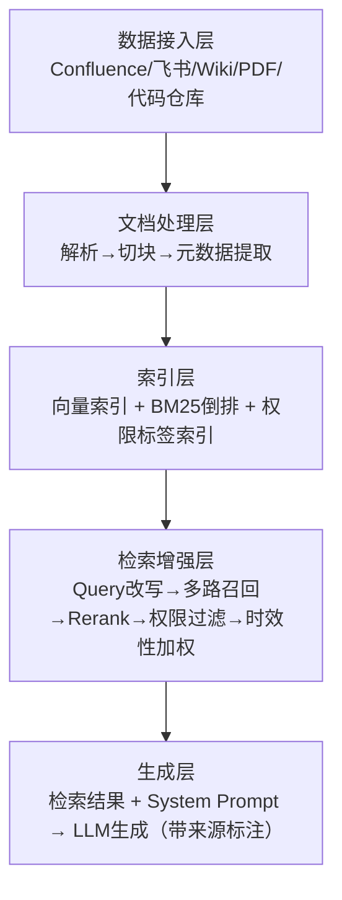
```mermaid
flowchart TB
    A["数据接入层\nConfluence/飞书/Wiki/PDF/代码仓库"] --> B["文档处理层\n解析→切块→元数据提取"]
    B --> C["索引层\n向量索引 + BM25倒排 + 权限标签索引"]
    C --> D["检索增强层\nQuery改写→多路召回→Rerank→权限过滤→时效性加权"]
    D --> E["生成层\n检索结果 + System Prompt → LLM生成（带来源标注）"]
```

**1. 数据接入层**：对接多种文档源（Confluence、飞书文档、内部 Wiki、PDF、代码仓库），每种源一个 connector，统一输出标准化文档格式。

**2. 文档处理层**：解析（PDF→文本、表格→markdown）→ 切块（语义切分，保持章节完整性）→ 元数据提取（来源、更新时间、权限标签、作者）。

Word 不能只按段落文本读取。`.docx` 属于 [ECMA-376 Office Open XML](https://ecma-international.org/publications-and-standards/standards/ecma-376/) 包结构：正文 drawing 中的 relationship ID 用来定位图片 Part，但题注通常仍是主文档里的普通段落、Caption 样式或 `SEQ` 字段，并不由该 relationship 直接指向。解析器先解析图片资源与 inline/anchor 位置，再结合文档顺序、题注样式、编号字段和版面关系关联附近段落；推断结果保留置信度和原始位置。统一中间表示带 `document/part/paragraph/image` source span，图文联合 Chunk 保存正文、图片 Artifact 引用、替代文本和章节路径，OCR/视觉摘要只能作为派生字段，不能覆盖原文件证据。

**3. 索引层**：双路索引（向量索引 + BM25 倒排索引），附带权限标签索引（用于检索时过滤无权限文档）。

**4. 检索增强层**：Query 改写 → 多路召回 → Rerank → 权限过滤 → 时效性加权（近期文档分数 boost）。

**5. 生成层**：检索结果 + System Prompt + 引用要求 → LLM 生成答案（带来源标注）。

若响应需要同时返回文字和图片，模型只生成结构化引用计划，例如文本块与 `artifact_id` 列表；Host 再按用户权限解析为签名 URL、缩略图或附件事件。模型上下文中放受控图片引用或视觉表示，不把二进制塞进消息；最终引用必须能回到 Word 原始 Part 和位置，并分别测试文字正确性、图片对应关系、权限和断链降级。

**多源场景的特殊挑战及解法**：

| 挑战 | 解法 |
|------|------|
| 权限隔离 | 每个文档块带 ACL 标签，检索时按用户身份过滤——不能让 A 部门的人看到 B 部门的机密文档 |
| 信息冲突 | 同一主题多个源说法不同 → 生成时标注每个观点的来源，让用户自行判断 |
| 时效性 | 文档有新旧版本 → 旧版本降权但不删除（可能有“当时为什么这么决定”的查询需求） |
| 增量更新 | 各源更新频率不同 → webhook/轮询混合策略，增量重建索引而非全量 |


前端应支持流式输出、加载与中断、引用跳转、空结果和错误降级，并避免直接渲染不可信内容。后端需做用户鉴权与文档级 ACL、租户隔离、限流配额、提示词注入防护、敏感信息过滤、审计追踪；异步处理长任务，记录召回、引用和生成质量指标，便于回放排障。

**差距在哪**：新手只说了“用 RAG”，把问题简化成了单一数据源的检索生成。高手的回答展示了完整的五层架构，且重点解决了多源场景特有的四个挑战——权限隔离、信息冲突、时效性、增量更新。面试官考的是系统设计能力——不只是 RAG 本身，而是“如何将 RAG 嵌入到一个有权限控制、多数据源、增量更新的企业级系统中”。

---

## Q：ReAct 在工程实现中，消息和状态协议应该怎么设计？

> 来源：字节跳动/AI Agent 秋招一面 【[OPPO IT 开发一面](https://www.nowcoder.com/discuss/923561467092160512)追问：ReAct 工程实现与上一轮结果传递】

**新手答**：“把 Thought、Action、Observation 按顺序拼到 Prompt 里。”

**高手答**：

生产级 ReAct 不能依赖自由文本拼接，而要把每一步建模成可验证的结构化事件。ReAct 和 Plan Mode 也不应是两套互不相干的程序：外层用同一个任务状态机，Plan Mode 先产生带依赖的步骤图，ReAct 则在每个步骤内部根据 observation 动态决策；执行失败、证据不足或环境变化时再回到 Planner 重规划。

典型状态可以设计为 `RECEIVED → CONTEXT_READY → PLANNED → EXECUTING → VERIFYING → COMPLETED`，并允许转入 `WAITING_FOR_USER / RETRYING / REPLANNING / FAILED / CANCELLED`。状态迁移由编排器根据结构化事件驱动，而不是让模型用自然语言声称“现在进入下一步”。

| 字段 | 作用 |
|------|------|
| `step_id / parent_id` | 串起因果链，支持分支与回放 |
| `intent / plan_ref` | 说明本步服务于哪个子目标 |
| `action` | 工具名、版本和结构化参数 |
| `observation` | 标准化结果、错误码、证据引用 |
| `status` | pending/running/succeeded/failed |
| `budget` | 剩余步骤、token、时间和成本 |

模型可见上下文只放完成当前决策所需的摘要；原始 observation、内部错误和审计信息保存在外部状态存储。执行器在工具调用前做 schema、权限和幂等校验，调用后统一标准化结果；策略层再决定继续、重试、重规划或终止。每一步落 checkpoint，才能在断点恢复时从确定状态继续，而不是重放整段自然语言历史。

消息协议与 Runtime 状态要分开：System/User/Assistant/Tool 消息是模型视图，Run/Step/Attempt、租约、预算和副作用记录是控制面事实。上一轮结果先写成带来源、状态和 `tool_call_id` 的 Observation，再由 Context Builder 投影必要摘要；不能把自由文本日志全部回灌，也不能让模型输出的“已完成”直接驱动状态迁移。

**差距在哪**：新手描述论文里的循环，高手把循环落成结构化事件协议、状态机、预算和 checkpoint。面试官考的是能否把 ReAct 从 Prompt Demo 做成可恢复、可审计的系统。

---

## Q：Agent 如何持续推进 Goal，并避免行为漂移和目标漂移？

> 来源：[腾讯 WXG 微信读书一面](https://www.nowcoder.com/feed/main/detail/3ffc762437274543b6a8f5e2ea6fb535)（2026-08-24）【[虾皮一面](https://www.nowcoder.com/feed/main/detail/e133c2610bde4adc812bba66c62e1641)同题】；[滴滴一些面经合集（算法）](https://www.nowcoder.com/feed/main/detail/37cae17c5f2a49ee81375721f53bbf9b)

**新手答**：“把目标写进 System Prompt，每轮提醒模型，并设置最大循环次数。”

**高手答**：Goal 不能只是一句反复拼接的自然语言，而要编译成可执行、可验证的任务契约：包含成功条件、硬约束、禁止事项、证据要求和终止条件。Planner 将它拆成带依赖的子目标；运行时单独维护 `goal_id`、当前计划、完成证据、未决项和预算，不能让模型靠聊天历史自行判断进度。

每次行动前做三项门禁：该行动服务于哪个未完成子目标，是否违反权限或成本约束，成功后能产生什么可验证证据；无法回答就澄清或重规划。行动后由工具结果、测试或规则 Verifier 更新状态，不能让模型凭一句“已完成”关闭任务。环境变化、连续低信息增益或前提失效时允许有限重规划，但原始 Goal 和硬约束不可被重写；用户确实改变目标时，应生成新版本并记录差异。

工程上还要保存结构化 trace，监控无目标行动率、重复行动率、约束违反率和目标覆盖率。最大步数、Token 和时间预算只是失控兜底，不是完成标准；预算耗尽而目标未满足时应明确报告未完成项和所需输入。

**差距在哪**：新手依赖 Prompt 提醒，高手把 Goal 变成版本化契约，用子目标、证据、行动门禁和有限重规划形成闭环。面试官考的是 Agent 能否长期推进任务，同时保持行为可解释、目标不可被中间上下文悄悄改写。

---

## Q：在 AI/Agent 辅助编码时代，为什么 DDD 和清晰的领域边界反而更重要？

> 来源：[地图 Agent 二面](https://www.nowcoder.com/feed/main/detail/0208597586e744c884bdc571dc441fad)（2026-08-24）；本轮追问：你的 AI 辅助编码工作流是怎样的？（[本轮追问](https://www.nowcoder.com/feed/main/detail/d0be5ebcc6a0480d8975498fba408250)）

**新手答**：“DDD 能让代码结构更清晰，AI 生成代码时更容易理解项目。”

**高手答**：Coding Agent 提高了局部代码产量，却不会自动获得组织内部的业务语义。边界模糊时，它很容易复用名字相近但语义不同的模型、跨层修改数据，或为了让测试通过绕过业务不变量；生成越快，错误耦合扩散也越快。DDD 的价值不是多写几层目录，而是为模型提供机器可读的决策边界。

具体做法是先划分 Bounded Context，让订单、计价、路线规划等上下文各自拥有术语、实体和不变量；跨上下文只通过显式 API、领域事件或防腐层交互。把聚合根的写入规则、允许调用的工具、契约测试和架构依赖规则纳入 Agent 的上下文与验证门禁。这样 Agent 可以在单个上下文内自治修改，跨边界变更则必须展示契约影响、迁移方案并由对应 Owner 审核。

DDD 也不能教条化：简单 CRUD 不必堆砌 Value Object 和 Repository。应把建模成本集中在变化频繁、规则复杂、错误代价高的核心域；支撑域保持简单。衡量标准不是“用了多少模式”，而是 Agent 的变更范围是否可预测、跨域回归是否减少、业务规则能否由测试验证。

**差距在哪**：新手把 DDD 当代码分层，高手看到它为高吞吐的 Coding Agent 提供语义、权限和验证边界。面试官考的是如何用领域模型约束自动化能力，而不是背 DDD 名词。

---

## Q：Agent 组件拆解为什么适合责任链模式？与状态机、DAG 的边界是什么？

> 来源：北京四维图新面经（2026-03-06）【阿里 Agent Infra 一面题库追问：为什么 Agent 本质上是状态机】

**新手答**：“责任链可以把 Agent 的组件串起来，每个组件处理一部分逻辑，扩展比较方便。”

**高手答**：

责任链适合解决的是：**同一个请求上下文需要依次经过一组可插拔处理器，而每个处理器只承担一类职责**。例如输入规范化、权限检查、上下文装配、意图识别、规划、工具结果校验和输出过滤，都可以接收统一的 `AgentContext`，读取或追加结构化字段，再选择继续、短路、降级或转交下一处理器。

这样拆有三个直接收益：

1. **关注点隔离**：安全、记忆、规划和观测逻辑不挤在一个巨型 Agent Loop 中，每个处理器可独立测试。
2. **按场景组装**：只读问答、出行规划和高风险交易可以使用不同的处理器集合与顺序。
3. **统一横切治理**：处理器入口和出口可以统一记录 trace、耗时、输入输出 schema 和异常，失败策略也能局部配置。

但这里往往是“管线化责任链”的工程变体，不一定在第一个处理者命中后就结束。需要先定义处理器契约：允许修改哪些字段、是否幂等、失败时是终止还是跳过、短路结果如何表达。否则多个处理器都改写同一份自由文本上下文，会产生隐式顺序依赖，链越长越难调试。

责任链不能替代状态机和 DAG，它们管理的是不同问题：

| 抽象 | 主要回答的问题 | 适合场景 | 不擅长的事情 |
|------|----------------|----------|----------------|
| 责任链 | 一个请求依次经过哪些可插拔处理器 | 输入预处理、上下文装配、校验、过滤 | 表达长生命周期状态和复杂依赖 |
| 状态机 | 任务当前处于什么状态，哪些迁移合法 | 等待用户、执行、重试、取消、恢复 | 表达大量节点的并行依赖 |
| DAG | 任务之间有什么依赖，哪些节点可并行 | 多工具计划、批处理、阶段编排 | 表达运行时循环和长期等待 |

生产系统通常组合三者：状态机控制任务生命周期，DAG 表达一次计划中的依赖和并行，节点内部再用责任链组装校验、上下文注入和执行后处理。若流程只有固定的线性步骤，普通函数管线已经足够；若处理器之间存在大量共享写入和回跳，则应显式建模成状态机或图，不能为了“设计模式”硬套责任链。

**差距在哪**：新手只说“解耦、易扩展”。高手能说清责任链管理请求处理职责、状态机管理合法迁移、DAG 管理依赖并行，并指出共享上下文、顺序依赖和错误语义这些真实落地风险。

---

## Q：设计一个预订机票的 Agent，如何处理澄清、支付确认和失败补偿？

> 来源：百度 Agent 算法岗二面（2026-08-14）

**新手答**：“先搜索航班，选最便宜的，然后调用支付工具。”

**高手答**：先把日期、出发地、舱位、预算、行李和退改偏好补成结构化约束；搜索结果绑定价格与库存快照，向用户展示候选及总价。预订与支付是高风险副作用，必须二次确认具体航班、乘机人和金额，并使用幂等键、预占/确认两阶段和状态查询。支付超时不能直接重试扣款，应先查单；库存失效则释放预占并重新规划。全链路保存订单状态、证据和补偿记录。

**差距在哪**：新手只画顺序流程，高手处理了实时状态、明确确认、幂等和不可逆副作用。

---

## Q：AI Coding Agent 的 Solo 模式和 Plan 模式应该如何设计？

> 来源：[字节 Trae 二面](https://www.nowcoder.com/discuss/924821959647440896)

**新手答**：“Solo 模式让 Agent 直接改代码，Plan 模式先输出计划让用户确认。”

**高手答**：两种模式应共享代码检索、工具权限、工作区快照和任务状态机，区别是决策门禁。Solo 在目标清晰、影响范围小、验证充分时允许 Agent 连续执行；Plan 先产出包含目标、涉及文件、步骤依赖、风险、验证方式和待确认假设的结构化计划，用户确认的应是这些决策点，而不是一段不可执行的说明文字。

计划确认后要冻结 `plan_version` 和基线 commit，每个执行步骤回写状态、证据与偏差。发现新依赖或修改范围扩大时，不能悄悄继续，应生成 plan diff 并重新确认高风险部分；低风险局部调整可以在预先约定的预算内自治。模式切换也必须发生在 checkpoint：Plan 转 Solo 要保留已确认约束，Solo 升级 Plan 则要暂停副作用并解释触发原因。

验收不能只看是否生成代码。还要比较任务成功率、计划变更率、用户确认次数、错误修改范围、回滚率、耗时和 Token 成本，并按重构、修 Bug、跨仓库变更等任务类型切片。这样 Solo/Plan 是风险与自治程度的控制面，而不是两个互不相干的产品按钮。

**差距在哪**：新手只描述交互顺序，高手把计划版本、偏差处理、模式切换和验收指标设计成同一执行协议。


## Q：什么时候需要自研或改造方案，而不是直接采用开源实现？

> 来源：[腾讯AI全栈一面](https://www.nowcoder.com/feed/main/detail/5f08a2b54559471aac95ea8009d38403)

**新手答**：开源方案能减少开发成本，但功能、性能或合规不一定匹配业务。应先比较需求、成熟度和维护成本，再决定复用、扩展还是自研。

**高手答**：

先把硬约束写成指标：延迟、吞吐、准确率、数据合规、部署环境和交付周期；建立 POC 与基线，对开源方案做压测和故障演练。若只是接口或策略差异，优先封装或插件化扩展；只有在核心能力缺失、性能瓶颈或许可证/数据边界不满足时才自研，并保留可替换接口和迁移计划。

**差距在哪**：考察是否能用成本、风险和约束做架构决策，而不是为了“技术先进”盲目自研。

---

---

## Q：自研业务 Agent 与基于通用 Base Agent 开发插件，如何进行架构选型？各有什么优缺点？

> 来源：[9.21 蚂蚁二面](https://www.nowcoder.com/feed/main/detail/52b419448b854e24bbdf41ca9e6ffe06)

**新手答**：“自研 Agent 控制力和定制能力更强但成本高，基于 Base Agent 开发插件上线快、复用好但受通用框架约束。”

**高手答**：

选型应先看业务是否需要独特的状态机、强隔离、低延迟、复杂审批或深度领域优化。自研业务 Agent 可针对任务规划、记忆、工具编排、权限和观测做端到端设计，边界清晰、可控性强，但要承担模型适配、平台建设、评测、升级和运维成本，也可能重复造轮子。基于通用 Base Agent 开发插件能复用对话协议、工具注册、日志和安全能力，交付快、便于多业务共享；代价是生命周期、上下文管理、错误恢复和扩展点受框架限制，复杂场景可能出现绕过框架的补丁。工程上应先定义能力契约和不可违反的安全边界，比较开发成本、延迟、可靠性、迁移风险与长期维护成本。用代表性任务压测成功率、工具调用正确率、失败恢复、权限隔离、可观测性和版本回滚；若插件无法表达核心业务约束，再考虑独立架构，而非仅凭 Demo 效果决定。

**差距在哪**：浅层回答只比较开发速度和灵活性，深入回答会围绕业务约束、平台复用、迁移成本、安全边界及可量化验证做架构决策。

---

## Q：如何设计多用户 AI 服务接入、配置隔离与模型路由？

> 来源：[cherrystudio面试](https://www.nowcoder.com/feed/main/detail/84ecd256fe4d4a1597a0f29f18f853fb)

**新手答**：“可以通过统一网关接入多个模型服务，按用户配置选择模型，并隔离各用户的密钥、权限和调用数据。”

**高手答**：

核心是把 AI 接入层、租户配置、凭据管理、路由策略与模型适配器分开。网关先完成身份认证、租户授权和配额检查，再依据能力、区域、成本、延迟、数据等级及故障状态选择模型；用户配置应通过租户级策略继承和覆盖实现，而不是把密钥放进前端或提示词。凭据应托管并可轮换，日志脱敏，提示词、会话和向量数据按租户隔离。路由需有超时、重试、熔断、降级和幂等边界，避免重试造成重复扣费。用离线评测集、灰度流量、成本延迟监控及越权测试验证效果，并在质量、成本、稳定性和供应商锁定之间权衡。

**差距在哪**：浅层回答只会说“接 API 并按用户选模型”，深层考察租户隔离、凭据安全、路由策略、故障治理、评测与成本权衡。

---

## Q：交易系统如何选择直连第三方支付还是统一支付抽象层？

> 来源：[美团AI Agent一面](https://www.nowcoder.com/feed/main/detail/50bcdc47e7754aa7be59b6318fea514b)

**新手答**：“通常用统一支付抽象层屏蔽不同第三方的接口差异，同时保留少量渠道特有能力。”

**高手答**：

统一支付层的角色是把下单、支付、退款、查询、回调和对账抽象成稳定领域契约；渠道适配器负责协议转换，不能把第三方状态直接暴露给业务。核心机制包括统一订单号与状态机、幂等键、签名验签、回调去重、超时重试、对账和人工补偿。直连适合渠道少、能力高度特殊且团队能长期承担安全与运维责任；统一层适合多渠道、多业务和需要一致治理的组织，但会增加平台复杂度、发布协调和能力泄漏风险。应通过沙箱与契约测试、故障注入、重复回调及对账演练验证，并明确结算、退款差异和数据权限边界。合规判断需结合实际场景与专业意见，工程设计不等同于法律结论。

**差距在哪**：浅层只比较开发效率，深入回答要说明抽象契约、状态与幂等、回调对账、渠道特性泄漏、故障验证及团队边界，这是面试官考察的架构取舍。


## 这类题的答题模式

架构选型题的高分回答有一个固定结构：

```text
1. 给出明确的选择维度（不说"看情况"）
2. 用具体的业务场景说明怎么选
3. 说出混合方案或工程化降级的技巧
4. 点一句代价和适用边界
```

面试官听到“看情况”就知道你没做过。听到具体的判断维度和混合方案，才会继续追问——而追问意味着你已经通过了这道题。

下一篇建议继续看：

- [工具管理：参数校验、工具路由与百级工具库](../02-tool-management/index.html)
