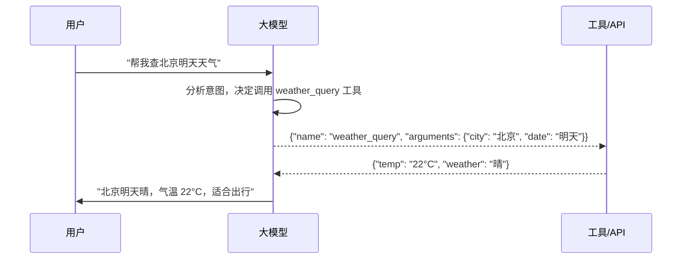
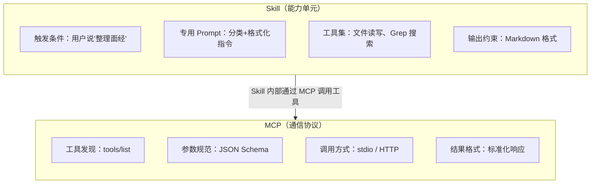
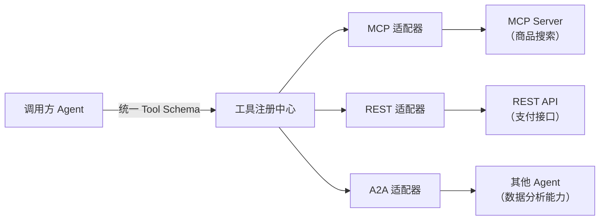
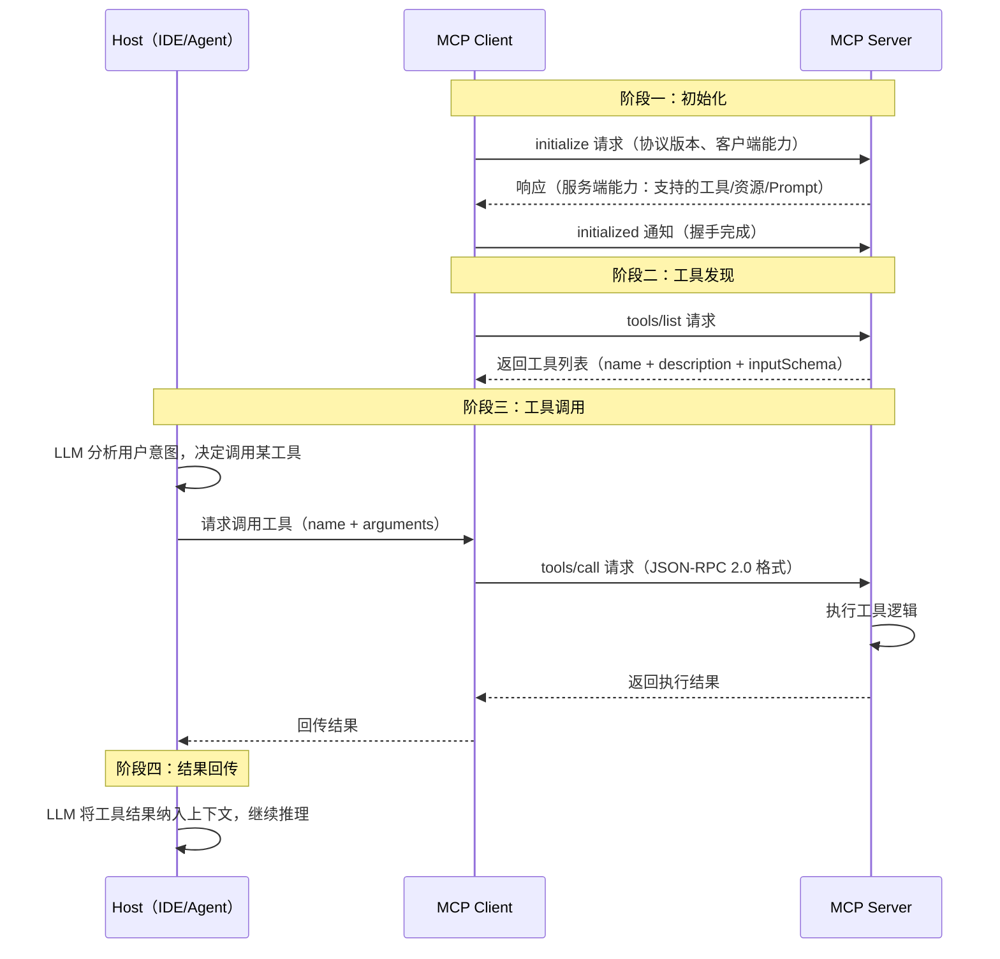
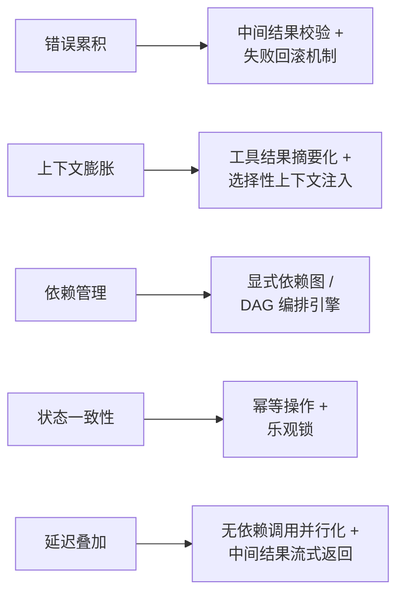

# 工具管理：参数校验、工具路由与百级工具库

工具调用是 Agent 区别于普通对话模型的核心能力。面试官在这个维度考的不是“你知不知道 function calling”，而是**“模型不听话怎么办”和“工具多了怎么管”**——这两个问题决定了你的 Agent 能不能上生产。

---

## Q：工具描述写得再好，模型也瞎传参数怎么办？

> 来源：腾讯 Agent 岗终面

**新手答**：“加强 Prompt，让模型输出 JSON。”

**高手答**：

三层防线：

1. **Schema 里写“负面描述”**：比如“城市名参数，请直接使用用户输入文本，切勿从地址中自行解析提取”。告诉模型不该做什么，比告诉它该做什么更有效。
2. **输出后做硬校验**：用 Pydantic 模型校验，类型不对、枚举值不匹配的直接拒掉，让模型重试。
3. **关键参数业务兜底**：比如查询订单的工具，模型传回的 `order_id`，必须先调用一次“订单是否存在”的校验接口。绝不让未经核实的 ID 直接下发给数据库。

**差距在哪**：新手的答案停留在 Prompt 层面——这是最弱的防线，模型不一定听。高手的三层防线是递进的：Prompt 引导 → 格式硬校验 → 业务逻辑兜底。即使模型完全不听话，后两层也能拦住。面试官考的是“你有没有做过需要防御性编程的系统”。

---

## Q：你们工具库有上百个工具，怎么让模型快速选对？

> 来源：腾讯 Agent 岗终面

**新手答**：“把所有工具描述发给模型让它选。”

**高手答**：

不可能全发，上下文不够，且会干扰。我们做了个**轻量级工具路由层**：

1. 用户请求来时，先用 FastText 之类的小模型快速提取意图关键词
2. 用关键词去工具向量库做语义检索，召回 top 5
3. 最关键的一步：用一个精调过的 7B 小模型，给这 5 个工具的相关性做精排序，只把 **top 2** 工具的完整 schema 交给大模型做最终调用

这个流程让工具选择准确率从 ~70% 提到了 95%+。

**候选工具超过 100 个时的召回偏差问题**：

当工具规模达到百级以上，纯语义检索会出现**召回偏差**——高频工具的描述被模型见过更多次，embedding 和 query 的匹配度天然更高，导致低频但正确的工具被排挤。

| 偏差类型 | 表现 | 解决方案 |
|---------|------|---------|
| 高频偏差 | 常用工具总是排在前面，冷门工具几乎不被召回 | 对工具 embedding 做频率逆加权，降低高频工具的匹配分 |
| 描述偏差 | 描述写得好的工具比描述差的更容易被选中 | 统一工具描述模板，确保描述质量一致 |
| 语义模糊偏差 | 多个工具描述相似，模型分不清选哪个 | 在描述中加”反面说明”——“本工具不用于XX场景” |

更根本的解法是**分层路由**——不让模型在 100 个工具中直接选，而是先分类再选：

```text
第一层：意图分类器 → 5-8 个工具大类（检索/操作/分析/通信...）
第二层：大类内语义检索 → 每类 10-15 个工具中选 top-3
第三层：最终选择 → 模型从 3 个候选中选
```

每层缩小 5-10 倍，三层下来从 100+ 缩到 3，大幅降低选错概率。

**差距在哪**：新手的方案在工具超过 20 个时就会崩——上下文被工具描述占满，模型反而选不好。高手的回答展示了一个完整的召回-排序管线（和搜索引擎的架构一样），每一层都有明确的职责。面试官考的是”你能不能把 Agent 的子问题抽象成一个工程问题来解决”。

---

## Q：多工具场景下的调度策略？

> 来源：阿里 AI Agent 开发一面

**新手答**：“模型自己选。”

**高手答**：

多工具场景的核心问题是**选哪个、按什么顺序、并行还是串行**。

1. **意图路由前置**：用户请求先经过轻量分类器或规则，判断需要哪类工具，不让大模型在全量工具里大海捞针
2. **依赖分析决定编排**：分析工具之间的输入输出依赖关系——无依赖的并行执行，有依赖的串行编排，减少总耗时
3. **优先级与降级**：多个工具都能用时，按可靠性、延迟、成本排优先级；主工具超时自动降级到备选
4. **结果合并与冲突处理**：多工具返回结果可能矛盾，需要合并策略——取最新的、取置信度最高的、或让模型做最终判断

调度策略不是模型能力问题，是**工程编排问题**——模型负责决策“做什么”，编排层负责“怎么执行”。

**差距在哪**：新手把调度交给模型“自己想办法”。高手的回答把多工具调度拆成四个环节：路由、编排、降级、合并——每个环节都有明确策略。面试官考的是你能不能把多工具协作从“模型自己选”变成一个可控的工程流程。

---

## Q：Mock 是怎么实现的？在自动化生成测试的场景下

> 来源：抖音基础架构 Agent 一面

**新手答**：“用 `unittest.mock` 替换依赖。”

**高手答**：

Mock 的实现分三步：**识别依赖 → 生成 Mock 对象 → 注入测试**。

**第一步：识别需要 Mock 的依赖**

从 AST 和 import 分析中提取外部调用——数据库连接、HTTP 请求、文件 I/O、第三方 SDK 调用。判断标准是：**这个依赖在测试环境里能不能正常运行**。能运行的不 Mock，不能运行的才 Mock。

**第二步：生成 Mock 对象**

根据依赖的接口签名生成 Mock：
- 函数调用：Mock 返回值，类型和实际返回一致
- 类实例：Mock 整个类，保留方法签名，返回值用合理的默认值
- 异步调用：生成 `AsyncMock`，保持 `await` 语义

```python
# 自动生成的 Mock 示例
@patch('module.db_client.query')
def test_get_user(mock_query):
    mock_query.return_value = {"id": 1, "name": "test"}
    result = get_user(1)
    assert result["name"] == "test"
    mock_query.assert_called_once_with(user_id=1)
```

**第三步：注入策略**

不同语言注入方式不同——Python 用 `@patch` 装饰器或 `with` 语句，Java 用依赖注入框架（Mockito），JavaScript 用 `jest.mock`。关键是 Mock 的粒度：Mock 太多会让测试脱离真实行为，Mock 太少会因为环境依赖跑不起来。

**差距在哪**：新手只知道用 Mock 库替换依赖。高手的回答展示了自动化场景下的完整 Mock 生成流程——先识别、再生成、再注入——且点出了 Mock 粒度的核心取舍。面试官考的不是你会不会用 Mock 库，而是你能不能让 Agent 自动决定“Mock 什么、怎么 Mock”。

---

## Q：如果工具调用是成功的，但返回结果语义不完整，模型很容易误判，你怎么设计中间层？

> 来源：腾讯大模型应用开发二面

**新手答**：“让模型自己判断返回值是否完整。”

**高手答**：

这个问题非常常见。很多工具从接口层面看是 200 成功，但业务语义上其实不够用——比如只返回了一个 code 没有返回解释信息，或者字段含义不清，模型会自行脑补。

解决方式是加一个 **tool adapter 或 semantic wrapper**，把原始结果转成统一、可解释的中间表示：

1. **字段补全**：缺失字段用默认值或“未知”显式标注，而不是让模型猜
2. **错误翻译**：把错误码转成自然语言描述，比如 `code: 404` → `"未找到对应记录"`
3. **单位归一**：统一数据格式，比如日期统一成 ISO 格式、金额统一带币种
4. **空值处理和置信度标注**：区分“查了没有”和“没查到”，标注数据可信度

核心原则：**不要把外部 API 的脏数据直接回喂给模型**。中间层先清洗，让模型看到的是“可推理对象”，而不是原始接口垃圾。

**差距在哪**：新手让模型自己判断——模型没有业务语义知识，判断不了。高手在工具和模型之间加了一个 semantic wrapper 层，做字段补全、错误翻译、单位归一和置信度标注。面试官考的是你有没有意识到”工具调用成功 ≠ 结果可用”，以及怎么在中间层做数据治理。

**追问：外部工具返回的数据格式和 Agent 期望的不匹配，怎么做自动映射？**

> 来源：淘天 AI Agent 二面

这在接入第三方 API 时非常常见——天气 API 返回 `temp_f`（华氏度），Agent 期望 `temperature_celsius`（摄氏度）；电商 API 返回嵌套 JSON，Agent 期望扁平 key-value。

**三层映射方案**：

| 层次 | 处理内容 | 实现方式 |
|------|---------|---------|
| 结构映射 | 字段重命名、嵌套展平、数组提取 | JSONPath / JMESPath 表达式 |
| 类型转换 | 单位换算、日期格式、枚举值映射 | 预定义转换函数库 |
| 语义补全 | 补充缺失字段、添加业务含义注释 | 模板填充 + 默认值规则 |

**工程实现——Schema 适配器模式**：

```text
工具注册时定义两份 Schema：
  raw_schema：工具实际返回的原始格式
  agent_schema：Agent 期望的标准格式

映射规则（声明式配置，不写代码）：
  {
    “temperature_celsius”: “$.main.temp_f | fahrenheit_to_celsius”,
    “city_name”: “$.name”,
    “wind_speed_mps”: “$.wind.speed | mph_to_mps”,
    “description”: “$.weather[0].description”
  }
```

声明式配置的好处是**新增工具不需要写代码**——只需要写一份映射规则。转换函数（如 `fahrenheit_to_celsius`）是预置的可复用单元。

当映射规则覆盖不了的复杂情况（如返回格式不固定），才降级到用 LLM 做动态格式转换——但这会引入延迟和不确定性，只作为兜底方案。

---

## Q：工具多导致 token 数过多，怎么解决？

> 来源：字节 Agent 实习二面

**新手答**：“减少工具数量。”

**高手答**：

砍工具是下策——工具是 Agent 的能力，砍多了能力就残了。核心思路是**让模型在每次调用时只看到需要的工具，而不是全量工具**。

**1. 动态工具加载**：

- 不把所有工具的 schema 一次性塞进 system prompt
- 根据用户当前意图，只加载相关工具。比如用户在问天气，就只加载天气/地理类工具，不加载数据库/文件操作类工具
- 意图识别可以用轻量分类器或关键词规则，成本极低

**2. 工具描述压缩**：

- 很多工具描述写得太冗长——把 200 字的描述压缩到 50 字以内，只保留“这个工具做什么”和“关键参数”
- 参数的详细约束放在二级描述中，模型选中工具后再加载完整 schema

**3. 分层工具组织**：

```text
第一层：工具大类（5-8 个）
  → 信息查询类 / 数据操作类 / 文件处理类 / 通信类 / ...

第二层：具体工具（每类 5-10 个）
  → 天气查询 / 股票查询 / 地图搜索 / ...
```

模型先选大类，再在大类下选具体工具。两次选择的 token 开销远小于一次展示全量工具。

**4. 工具向量检索**（已有工具百级以上时）：

- 用户 query 做 embedding，和工具描述做语义匹配，只召回 top 3-5 的工具
- 这就是把“工具选择”变成了一个“检索”问题

**差距在哪**：新手的“减少工具”是削足适履。高手用动态加载、描述压缩、分层组织、语义检索四个方法，在不砍工具的前提下把 token 开销控制住。面试官考的是你面对 token 预算约束时的工程化解题能力。

---

## Q：MCP Server 是怎么构建的？

> 来源：字节 Agent 实习二面

**新手答**：“就是写个 API 接口。”

**高手答**：

MCP（Model Context Protocol）是 Anthropic 提出的**模型与外部工具/数据源的标准化通信协议**，目标是让 Agent 以统一的方式调用不同工具，不需要为每个工具写专门的适配代码。

**MCP Server 的核心职责**是：把外部能力（API、数据库、文件系统等）封装成符合 MCP 协议的标准工具，供 Agent 调用。

**构建一个 MCP Server 的关键步骤**：

1. **定义 Tool Schema**：
   - 每个工具需要声明名称、描述、输入参数（JSON Schema）和输出格式
   - 描述要写给模型看——清晰说明“什么时候该用这个工具”和“参数怎么填”

2. **实现 Handler**：
   - 每个工具对应一个 handler 函数，接收标准化的参数，执行实际操作，返回标准化的结果
   - Handler 内部做参数校验、错误处理、超时控制

3. **选择传输方式**：
   - **stdio**：通过标准输入输出通信，适合本地工具（如文件操作、命令行工具）
   - **HTTP/SSE**：通过 HTTP 请求 + Server-Sent Events 通信，适合远程服务
   - 本地开发用 stdio 简单快速，生产部署用 HTTP/SSE 做服务化

4. **注册与发现**：
   - Client 端（Agent）通过配置或服务发现机制找到 MCP Server
   - Server 启动时声明自己提供的工具列表，Client 按需选择

**和直接写 API 的区别**：

- 普通 API：每个工具一套接口定义、一套调用方式、一套错误处理
- MCP：所有工具统一协议，Agent 不需要知道底层是 REST 还是 gRPC 还是本地调用——只需要知道 tool name 和参数

**差距在哪**：新手把 MCP 等同于“写 API”。高手理解 MCP 是一个协议层抽象——统一了工具发现、参数定义、调用方式和错误处理，让 Agent 能以即插即用的方式扩展能力。面试官考的是你对 Agent 工具生态标准化趋势的理解。

---

## Q：大厂开源的 CLI 工具（如 lark-cli）和 MCP 有什么区别？它们跟直接调 API 又有什么不同？

> 来源：大厂 Agent 面试高频题

**新手答**：“CLI 就是命令行工具，MCP 就是协议，API 就是接口，三个不同的东西。”

**高手答**：

这三者解决的问题不同，服务的“用户”也不同：

**1. API——给程序用的原始接口**

API 是最底层的能力暴露方式。比如飞书开放平台的 REST API，你要自己处理鉴权、拼参数、解析响应、处理错误码。它的“用户”是开发者写的代码。

```text
开发者代码 → HTTP 请求 → 飞书 API → 响应 JSON
```

**2. CLI 工具——大厂跟进 Agent 生态的抢位之作**

关键背景：lark-cli、coze-cli 这批大厂 CLI 工具集中涌现，不是偶然——它们是 MCP 和 Agent 生态爆火之后，各平台为了**抢占 Agent 工具生态入口**而快速推出的。

CLI 本质上是 **machine-friendly** 的接口形态。和 GUI（人类友好）不同，CLI 天然适合被程序和 Agent 调用——结构化的输入输出、可脚本化、可管道组合。大厂推 CLI 而不是只提供 API，是因为 CLI 降低了 Agent 接入的门槛：不用写 SDK 集成代码，直接 `lark-cli send --chat "xxx" --text "hello"` 就能调用。

```text
Agent / 脚本 → lark-cli send --chat "xxx" --text "hello"
                    ↓ 内部封装鉴权、参数、错误处理
               飞书 API 调用 → 结构化输出
```

但 CLI 的局限很明显：**每个平台一套 CLI，Agent 需要为每个平台学一套命令**。

**3. MCP——Agent 工具调用的统一协议**

MCP 解决的是 CLI 解决不了的问题：**标准化**。它不是封装某一个平台的 API，而是定义了 Agent 发现和调用任意工具的统一协议。不管底层是飞书 API、数据库还是本地文件系统，Agent 只需要按 MCP 协议交互。

```text
Agent → MCP 协议 → MCP Server A（封装飞书能力）
                  → MCP Server B（封装数据库）
                  → MCP Server C（封装本地文件系统）
```

MCP 的价值在于：Agent 不需要知道底层是 REST、gRPC 还是 CLI——**一套协议打通所有工具**。

**那大厂为什么不直接做 MCP Server，还要出 CLI？**

因为 CLI 是**更低成本的试水方式**：不需要实现完整的 MCP 协议栈，先用 CLI 把平台能力暴露给 Agent 生态，抢个身位。而且 CLI 可以被 MCP Server 二次封装——社区已经有大量“CLI → MCP Server”的适配层了。

**核心区别总结**：

| 维度 | API | CLI 工具 | MCP |
|------|-----|----------|-----|
| 服务对象 | 程序代码 | Agent / 脚本（machine-friendly） | AI Agent（协议级） |
| 设计动机 | 开放平台能力 | 抢占 Agent 工具生态入口 | 统一 Agent 工具标准 |
| 抽象层级 | 原始接口 | 平台级封装 | 协议级抽象 |
| 覆盖范围 | 单一平台 | 单一平台 | 跨平台统一 |
| 工具发现 | 查文档 | `--help` | 协议内置 `tools/list` |
| 典型场景 | 后端集成 | Agent 快速接入单一平台 | Agent 统一工具管理 |

**它们的关系是递进的**：API 是原始能力 → CLI 是大厂面向 Agent 生态的快速封装 → MCP 是最终的协议层标准。一个 MCP Server 内部可以调 API，也可以调 CLI，它们不互斥。

**差距在哪**：新手把三者当成并列的“不同的东西”。高手看到的是 Agent 工具生态的演进脉络——API 一直在，CLI 是大厂看到 MCP/Agent 趋势后的抢位动作，MCP 是最终统一标准。面试官考的是你能不能看到这波 CLI 扎堆出现背后的产业逻辑，以及理解为什么 Agent 时代的终局是协议层标准化而不是各家出各家的 CLI。

---

## Q：大模型的 Function Call 是什么？Tool Use 一般怎么用？

> 来源：蚂蚁集团智能体与大模型应用一面

**新手答**：“就是让模型调用函数。”

**高手答**：

Function Call（Tool Use）是让大模型**不只生成文本，还能结构化地调用外部工具**的核心机制。

**工作原理**：



模型不是直接执行代码——它输出的是**结构化的调用意图**（工具名 + 参数 JSON），由外部编排层执行实际调用，再把结果回传给模型做最终整合。

**和普通 Prompt 的关键区别**：

| 维度 | 普通 Prompt | Function Call |
|------|-----------|---------------|
| 输出 | 自由文本 | 结构化 JSON（工具名 + 参数） |
| 能力边界 | 只能用训练数据 | 可接入实时数据和外部系统 |
| 可控性 | 低（自由发挥） | 高（Schema 约束参数类型和取值） |
| 典型场景 | 问答、创作 | 查天气、操作数据库、发消息、执行代码 |

**在 Agent 项目中的典型 Function Call**：

1. **信息查询类**：知识库检索、数据库查询、API 调用——Agent 不靠记忆回答，而是实时查
2. **操作执行类**：创建工单、发送通知、修改配置——Agent 不只回答问题，还能执行动作
3. **代码执行类**：运行 Python 代码做计算、执行 SQL 查询——把模型的“推理”变成“验证”

**工程上的关键设计**：

- **Schema 定义要精准**：工具描述写给模型看，参数 Schema 约束类型和枚举值。描述越精确，模型选错工具和瞎传参的概率越低
- **返回值要结构化**：工具返回不要是一大段文本，而是 JSON——模型解析结构化数据比理解自然语言更稳定
- **错误处理要前置**：工具调用可能失败，返回值里必须带状态码和错误信息，让模型能根据错误类型决定下一步

**差距在哪**：新手把 Function Call 等同于“调函数”。高手理解它是模型从“文本生成器”升级为“行动执行器”的关键机制，且清楚 Schema 设计、返回值规范和错误处理这些工程细节决定了 Tool Use 的稳定性。面试官考的是你对 Agent 核心能力的理解深度。

---

## Q：MCP 和 Skills 的本质区别是什么？都是工具调用，为什么需要两套机制？

> 来源：蚂蚁集团智能体与大模型应用二面

**新手答**：“MCP 是协议，Skills 是能力，不太一样。”

**高手答**：

MCP 和 Skills 解决的是**不同层次的问题**，虽然都和“Agent 如何使用工具”相关，但它们不在同一个抽象层级上：

**MCP（Model Context Protocol）——工具调用的“通信协议”**

MCP 解决的是：Agent 如何**发现、调用、获取结果**。它定义了一套标准的交互格式——工具怎么注册（`tools/list`）、参数怎么传（JSON Schema）、结果怎么返回。类比网络协议：MCP 是 HTTP，定义了请求/响应的格式，不关心你用这个请求做什么。

**Skills——任务执行的“能力单元”**

Skills 解决的是：Agent 面对某类任务时，**怎么思考、用什么工具、按什么流程执行**。一个 Skill 包含触发条件、专用 Prompt、可用工具集、输出约束。类比：Skill 是一个“微型 Agent 配置”，告诉 Agent“遇到这类问题时按这个方案办”。



**核心区别对照**：

| 维度 | MCP | Skills |
|------|-----|--------|
| 抽象层级 | 通信协议层 | 业务能力层 |
| 解决的问题 | “怎么调工具” | “什么场景用什么方案” |
| 包含内容 | 工具描述、参数规范、传输方式 | 触发条件 + Prompt + 工具集 + 输出约束 |
| 类比 | HTTP 协议 | Web 应用的一个 Controller |
| 复用粒度 | 单个工具 | 一套完整方案 |

**为什么需要两套机制**：

只有 MCP 没有 Skills → Agent 知道怎么调工具，但不知道什么时候该调哪个，需要每次都靠模型自己推理，不稳定。

只有 Skills 没有 MCP → Agent 知道该怎么办，但每个工具要单独写适配代码，不可扩展。

两者结合：Skills 定义“策略”，MCP 提供“基础设施”。Skill 里的工具调用通过 MCP 协议完成——这样新增工具只需要写 MCP Server，不需要改 Skill 逻辑；新增能力只需要写 Skill，不需要改工具接口。

**差距在哪**：新手把 MCP 和 Skills 当成两个并列的概念。高手看到的是**分层架构**——MCP 在协议层解决“怎么调”，Skills 在业务层解决“怎么用”，两者是上下层关系而非替代关系。面试官考的是你能不能把 Agent 架构按层次拆清楚。

---

## Q：Function Calling 的本质价值是什么？它解决的是“模型能力问题”还是“系统约束问题”？

> 来源：Agent 开发面试 30 题

**新手答**：“让模型能调工具，解决的是能力问题。”

**高手答**：

Function Calling 解决的**主要是系统约束问题**，不是模型能力问题。

没有 Function Calling 的时候，模型也能“调工具”——你在 Prompt 里告诉模型“如果需要查天气，请输出 `{"tool": "weather", "city": "北京"}`“，模型大概率能输出正确的 JSON。但这个方案有三个致命问题：

1. **输出格式不可靠**：模型可能在 JSON 前面加一句“好的，我来查一下”，或者少一个引号，导致解析失败
2. **调用时机不可控**：你不知道模型这次输出是“要调工具”还是“在正常回复”，必须靠正则或关键词猜
3. **参数类型无约束**：price 字段可能传成字符串“一百”，而不是数字 100

Function Calling 的本质价值是**把“模型想调工具”这件事从自由文本变成了结构化协议**：

```text
没有 FC：模型生成文本 → 你用正则猜它要不要调工具 → 手动解析参数 → 祈祷格式正确
有了 FC：模型明确返回 tool_call 结构 → 系统确定性地知道要调工具 → 参数有 schema 约束
```

这不是让模型“更聪明”了，而是**给模型和系统之间建立了一个明确的通信协议**——模型的意图（调什么工具、传什么参数）不再是需要“猜”的自由文本，而是有格式保证的结构化消息。

**差距在哪**：新手觉得 FC 是一种“新能力”。高手理解 FC 本质是模型和系统之间的**接口协议**——解决的是“怎么可靠地把模型意图传递给系统”这个工程问题。面试官考的是你对 FC 的理解停留在“会用”还是“理解设计动机”。

---

## Q：你会如何设计工具 schema，才能降低模型传错参数、漏参数、乱调用的问题？

> 来源：Agent 开发面试 30 题

**新手答**：“写清楚参数说明就行。”

**高手答**：

工具 schema 设计的核心原则是**降低模型的决策负担**——参数越少、约束越紧、描述越具体，出错概率越低。

**1. 参数设计——越少越好，越受限越好**：

- **合并冗余参数**：不要同时暴露 `start_date` 和 `start_timestamp`，选一种格式，内部转换
- **用枚举代替自由文本**：`sort_by` 不要让模型自由填，用 `enum: ["price_asc", "price_desc", "rating"]`
- **必填和选填分清楚**：`required` 字段必须标明，可选参数给合理的 `default` 值，减少模型需要做的决定

**2. 描述设计——说“别做什么”比“该做什么”更重要**：

```json
{
  "name": "search_hotel",
  "parameters": {
    "city": {
      "type": "string",
      "description": "城市名，直接使用用户原文（如'北京'），不要从地址中自行提取城市"
    },
    "check_in": {
      "type": "string",
      "description": "入住日期，格式 YYYY-MM-DD。如果用户说'下周五'，请转换为具体日期"
    }
  }
}
```

**3. 命名设计——名字要自解释**：

- `get_weather` 比 `fetch_data` 好——名字越具体，模型越不容易误调
- 相似工具要通过命名区分清楚：`search_hotel_by_city` vs `search_hotel_by_id`，而不是一个 `search_hotel` 靠参数区分

**4. 工具粒度——一个工具做一件事**：

一个“大而全”的工具（既能搜索、又能预订、还能取消）会让模型在参数选择上出错。拆成 `search_hotel`、`book_hotel`、`cancel_booking` 三个工具，每个的参数空间小而确定。

**差距在哪**：新手觉得“描述写清楚”就够了。高手从参数设计、描述技巧、命名规范、工具粒度四个角度系统性地降低出错率。面试官考的是你有没有做过“把模型对接到真实工具”的工程经验——只有踩过坑的人才知道 schema 设计有这么多讲究。

---

## Q：同一个能力是做成“一个大而全工具”还是“多个小工具”，怎么权衡？

> 来源：Agent 开发面试 30 题

**新手答**：“拆小一点好，职责单一。”

**高手答**：

不能一刀切。**拆不拆、怎么拆，取决于模型的工具选择负担和参数填充难度**：

| 维度 | 大而全工具 | 多个小工具 |
|------|----------|----------|
| 模型选择负担 | 低（只需选一个工具） | 高（需从多个里选对的） |
| 参数复杂度 | 高（参数多、组合多） | 低（每个工具参数少） |
| 错误定位 | 难（哪步出错不好查） | 易（哪个工具失败一目了然） |
| 编排灵活性 | 低（绑定了固定流程） | 高（可以自由组合） |

**什么时候用大工具**：
- 操作有强事务性——查库存 + 锁库存 + 扣款必须原子执行，拆开会有一致性风险
- 用户感知是一个动作——“帮我订机票”不应该让用户看到拆成了五步

**什么时候拆小工具**：
- 子步骤可以独立使用——搜索酒店和预订酒店是两个独立需求
- 需要灵活编排——“先搜再比再订”的顺序可能因用户需求变化
- 参数空间差异大——搜索只需要城市和日期，预订还需要用户信息和支付方式

**实际工程中的折中方案**：对外给模型暴露小工具（降低选择和参数负担），对内用**编排层把小工具组合成事务**（保证一致性）。模型只需要说“我要订这个酒店”，编排层自动执行“校验 → 锁房 → 扣款 → 确认”的事务流程。

**差距在哪**：新手只记住了”职责单一”的教条。高手从模型负担、参数复杂度、事务性、编排灵活性四个维度做权衡，且给出了”对外小工具 + 对内事务编排”的折中方案。面试官考的是你在工具设计时有没有系统性的权衡框架。

---

## Q：手撕一个 ReAct 架构的 Agent，实现文件操作（找文件、删除文件）

> 来源：AI 工程师面试（手撕代码，可借助 AI）

**新手答**：写了个 while 循环拼 Prompt，没有工具抽象，逻辑和 I/O 混在一起。

**高手答**：

这道题考的是**能不能用 ReAct 范式把”工具定义 → Agent 编排 → 多轮交互”串起来**。用 LangGraph 的 `create_react_agent` 实现最清晰：

**第一步：定义工具集**

每个文件操作封装成独立工具，用 `@tool` 装饰器标注名称和描述（模型通过描述选择工具）：

```python
import os
import glob
from langchain_core.tools import tool

@tool
def list_py_files(directory: str) -> list[str]:
    “””列出指定目录下所有 .py 文件的路径”””
    return glob.glob(os.path.join(directory, “**/*.py”), recursive=True)

@tool
def check_has_main(file_path: str) -> bool:
    “””检查指定 Python 文件中是否包含 main 函数定义”””
    with open(file_path, “r”) as f:
        content = f.read()
    return “def main” in content or 'if __name__' in content

@tool
def count_lines(file_path: str) -> int:
    “””统计指定文件的行数”””
    with open(file_path, “r”) as f:
        return len(f.readlines())

@tool
def delete_file(file_path: str) -> str:
    “””删除指定文件，返回操作结果”””
    os.remove(file_path)
    return f”已删除: {file_path}”
```

**第二步：创建 ReAct Agent**

```python
from langgraph.prebuilt import create_react_agent
from langchain_openai import ChatOpenAI

llm = ChatOpenAI(model=”gpt-4o”)
tools = [list_py_files, check_has_main, count_lines, delete_file]

agent = create_react_agent(llm, tools)
```

`create_react_agent` 内部实现的就是 ReAct 循环：**思考（选工具 + 定参数）→ 执行（调工具）→ 观察（读返回）→ 思考 → ...**，直到模型认为任务完成。

**第三步：执行任务**

```python
# 任务 1：找包含 main 的 py 文件
result = agent.invoke({
    “messages”: [{“role”: “user”, “content”: “找出 /workspace 目录下所有包含 main 函数的 .py 文件”}]
}, config={“configurable”: {“thread_id”: “task-1”}})

# 任务 2：删除行数最短的 py 文件
result = agent.invoke({
    “messages”: [{“role”: “user”, “content”: “找出 /workspace 下行数最短的 .py 文件并删除它”}]
}, config={“configurable”: {“thread_id”: “task-2”}})
```

**Agent 的实际执行链路（任务 2 为例）**：

```mermaid
flowchart TB
    A[“思考：要找行数最短的 py 文件\n先列出所有 py 文件”] --> B[“行动：list_py_files('/workspace')”]
    B --> C[“观察：返回 5 个文件路径”]
    C --> D[“思考：逐个统计行数”]
    D --> E[“行动：count_lines 逐个调用”]
    E --> F[“观察：a.py=10, b.py=3, c.py=25...”]
    F --> G[“思考：b.py 行数最短，删除它”]
    G --> H[“行动：delete_file('b.py')”]
    H --> I[“观察：已删除”]
    I --> J[“思考：任务完成，输出结果”]
```

**面试官可能追问的细节**：

1. **为什么要用 `@tool` 装饰器而不是直接写函数**：`@tool` 会自动从类型注解和 docstring 生成 JSON Schema，这是模型做 function calling 时需要的工具描述
2. **thread_id 的作用**：支持多轮对话，同一个 thread_id 下的对话共享记忆，Agent 能引用之前的执行结果
3. **如果要加安全限制怎么办**：对 `delete_file` 加权限检查——限制只能删除特定目录下的文件、删除前要求用户确认（`interrupt_before`）
4. **和直接写 Python 脚本的区别**：脚本是写死的流程。ReAct Agent 能根据中间结果动态调整——比如文件读不出来时自动换一种方式查找，不需要提前枚举所有异常路径

**差距在哪**：新手写一堆 if-else 硬编码。高手用标准的 ReAct 框架——工具定义（@tool）、Agent 创建（create_react_agent）、任务执行（invoke），代码简洁且可扩展。面试官考的是你能不能用 Agent 范式（而非脚本思维）解决问题，且理解 ReAct 循环的执行机制。

---

## Q：如何在多智能体环境中实现动态发现并注册跨协议工具？

> 来源：淘天 AI Agent 一面

**新手答**：“在配置文件里列出所有工具。”

**高手答**：

多智能体系统中，每个 Agent 可能需要来自不同来源的工具——MCP Server、REST API、甚至其他 Agent 暴露的能力。**静态配置无法扩展**：新工具上线要改配置重启，Agent 之间的能力共享需要人工同步，协议不同还要分别适配。

解决方案是构建**动态工具发现与注册机制**：

**1. 工具注册中心（Tool Registry Service）**

所有工具向中心化的注册中心注册自己的能力描述、Schema、端点地址和鉴权要求。注册中心就像一个“工具市场”：

```text
注册信息示例：
{
  "tool_id": "product_search_v2",
  "capability": "按关键词搜索商品，支持价格、品类筛选",
  "schema": { ... },          // 输入输出的 JSON Schema
  "endpoint": "mcp://product-server:8080",
  "protocol": "MCP",
  "auth": "bearer_token",
  "owner_agent": "product-agent"
}
```

**2. 基于能力的发现（Capability-based Discovery）**

Agent 不需要知道工具名，只需描述自己需要什么能力：

```text
Agent 请求："我需要一个能搜索商品的工具"
注册中心：语义匹配 → 返回 product_search_v2（MCP）、catalog_api（REST）两个候选
Agent：根据协议偏好和延迟选择最优工具
```

这比按名字查找更灵活——新工具上线后，只要能力描述匹配，就能被自动发现。

**3. 运行时注册（Runtime Registration）**

新的 MCP Server 或 Agent 上线后，无需重启系统即可注册新工具：

```text
新 MCP Server 启动 → 向注册中心发送注册请求 → 注册中心更新索引
→ 其他 Agent 下次查询时自动发现新工具
```

**4. 跨协议适配层（Cross-Protocol Adaptation）**

不同来源的工具协议各异，但调用方 Agent 不应关心底层细节。通过**统一工具接口层 + 协议适配器**解耦：



每个适配器负责将统一的调用格式转换为目标协议的原生格式：
- **MCP 适配器**：直接透传，协议天然兼容
- **REST 适配器**：将 Tool Schema 参数映射为 HTTP 请求参数/body
- **A2A 适配器**：将工具调用转化为对目标 Agent 的任务请求

**5. 安全与权限控制**

- 工具注册需要身份认证——防止恶意工具注入
- Agent 只能发现自己有权限使用的工具——注册中心按角色过滤
- 跨 Agent 能力共享需要双向授权——提供方授权暴露，使用方授权访问

**差距在哪**：新手用静态配置列出所有工具——工具少时能用，工具多了或跨团队协作时根本管不过来。高手设计了一套完整的动态发现机制：注册中心提供工具目录、能力描述实现语义发现、运行时注册支持热扩展、协议适配层屏蔽底层差异。面试官考的是你对多智能体工具生态的架构设计能力。

---

## Q：MCP 协议的完整调用过程是怎样的？

> 来源：高德 AI 应用开发实习一面

**新手答**：“就是调 API。”

**高手答**：

MCP（Model Context Protocol）不是简单的 API 调用——它是一个**三角色架构 + 能力协商 + 标准化通信**的完整协议。

**三个核心角色**：

| 角色 | 职责 | 典型实例 |
|------|------|---------|
| Host | 发起任务的宿主环境，内含 LLM | IDE（如 Cursor）、Agent 框架 |
| Client | 协议客户端，管理与 Server 的连接生命周期 | SDK 内置的 MCP Client |
| Server | 能力提供方，暴露工具/资源/Prompt | 文件系统 Server、数据库 Server |

**完整调用流程**：



**每个阶段的关键细节**：

1. **初始化（Handshake）**：Client 和 Server 交换能力声明——Client 告诉 Server 自己支持什么功能，Server 告诉 Client 自己提供哪些能力（工具、资源、Prompt 模板）。这一步是**能力协商**，双方对齐后才开始正式通信。

2. **工具发现（Discovery）**：Client 调用 `tools/list`，Server 返回所有可用工具的 Schema，包括名称、描述和参数定义（JSON Schema 格式）。这些 Schema 会被注入到 LLM 的上下文中，供模型选择工具。

3. **工具调用（Invocation）**：Host 中的 LLM 根据用户意图和工具 Schema，生成结构化的调用请求（工具名 + 参数 JSON）。Client 将请求以 JSON-RPC 2.0 格式发送给 Server，Server 执行后返回结果。

4. **结果回传（Feedback）**：Client 将工具执行结果回传给 Host，LLM 将结果纳入上下文，决定是继续调用其他工具，还是生成最终回答。

**传输层的两种模式**：

| 传输方式 | 通信机制 | 适用场景 |
|---------|---------|---------|
| stdio | 标准输入/输出（进程间通信） | 本地工具（文件操作、CLI 工具） |
| Streamable HTTP / SSE | HTTP 请求 + Server-Sent Events | 远程服务、跨网络调用 |

**协议设计的核心原则**：
- **每次调用无状态**：Server 不保留调用间的状态，幂等性好
- **Server 声明能力**：Client 不需要提前知道 Server 有什么工具，通过协议动态发现
- **Client 管理生命周期**：连接的建立、维护和关闭都由 Client 负责
- **JSON-RPC 2.0**：所有消息采用统一的 JSON-RPC 2.0 格式，请求和响应结构清晰

**差距在哪**：新手把 MCP 等同于调 API——完全忽略了三角色架构、初始化握手、能力协商这些协议层设计。高手能完整描述从初始化到工具发现到调用到结果回传的全链路，且清楚 stdio 和 HTTP/SSE 两种传输模式的适用场景。面试官考的是你对 MCP 协议的理解是停留在“听说过”还是“真的看过协议规范”。

---

## Q：LLM 是怎么从用户意图匹配到具体工具参数的？

> 来源：高德 AI 应用开发实习一面

**新手答**：“模型自己就能理解。”

**高手答**：

这不是“模型自己理解”——而是一个**Schema 注入 + 模型微调 + 参数校验**的工程化管线。

**核心机制：Schema 注入 + 结构化输出**

LLM 并不是凭空猜出工具参数的。实际流程是：

1. **Schema 注入**：工具的 JSON Schema（名称、描述、参数类型、枚举值等）被注入到系统 Prompt 中，作为模型的上下文信息
2. **意图识别**：模型对用户自然语言做隐式 NLU（自然语言理解），提取关键实体和意图
3. **参数生成**：模型根据 Schema 约束，生成符合格式的 JSON 参数输出
4. **模型微调基础**：模型在训练阶段经过 SFT（有监督微调）和 RLHF（人类反馈强化学习），学会了在特定格式约束下生成结构化输出

**参数匹配的四大难题**：

| 难题类型 | 用户输入示例 | 模型需要做的事 | 出错风险 |
|---------|------------|--------------|---------|
| 意图模糊 | “帮我订明天的机票” | 缺出发城市、到达城市、舱位 → 需要追问 | 模型可能自行脑补参数 |
| 类型转换 | “三百块以下” | 提取数字 300 + 运算符 ≤ | 可能传成字符串而非数值 |
| 必填缺失 | “查一下航班” | 缺航班号或日期 → 必须追问 | 模型可能编造一个航班号 |
| 枚举映射 | “头等舱” | 映射到枚举值 `first_class` | 可能传中文而非枚举值 |

**工程解决方案**：

**1. Schema 设计优化**：
- 在参数描述中加入示例值和格式说明
- 枚举值列表写全，减少模型猜测空间
- 用“负面描述”说明不该怎么填

**2. 参数校验层**：
- 模型输出的 JSON 必须经过 Schema 校验（如 Pydantic / JSON Schema Validator）
- 类型不对、必填缺失、枚举不匹配的直接拒绝，不执行

**3. 多轮纠错机制**：
- 校验失败时，把错误信息回传给模型，让模型修正参数
- 比如“city 字段是必填的，请向用户询问出发城市”

**4. 默认值与上下文推理**：
- 可选参数用合理的默认值填充
- 利用对话历史和用户画像推断缺失信息（如用户常用出发城市）

**三种参数获取策略对比**：

| 策略 | 适用场景 | 优点 | 缺点 |
|------|---------|------|------|
| 直接提取 | 用户意图明确、参数齐全 | 一轮完成，体验好 | 信息不全时会瞎猜 |
| 多轮追问 | 关键参数缺失、意图模糊 | 参数准确，不会瞎编 | 交互轮次多，体验差 |
| 画像推理 | 可选参数、用户有历史偏好 | 减少追问，体验流畅 | 依赖画像数据，冷启动难 |

实际系统中三种策略**混合使用**：必填参数缺失 → 追问；可选参数缺失 → 用默认值或画像推理；所有参数齐全 → 直接提取。

**差距在哪**：新手把参数匹配当成模型的“魔法”。高手清楚这背后是 Schema 注入提供约束、模型微调提供能力、校验层提供兜底的三层机制，且知道意图模糊、类型转换、必填缺失、枚举映射这四类难题各自的解法。面试官考的是你有没有在真实项目中处理过“模型传错参数”的问题。

---

## Q：Agent 做多轮工具调用和单轮调用相比，会面临哪些额外挑战？

> 来源：阿里国际大模型算法一面

**新手答**：“多调几次工具而已，没什么区别。”

**高手答**：

区别非常大。单轮工具调用的链路是“LLM → 调一次工具 → 拿结果 → 回复”，流程短、风险可控。但多轮工具调用的链路是“LLM → 工具 1 → 结果 1 → LLM 再推理 → 工具 2 → 结果 2 → ... → 最终回复”，**每多一轮，系统复杂度都在指数级增长**。

具体来说，多轮工具调用面临**五个单轮不存在的额外挑战**：

**1. 错误累积（Error Propagation）**

单轮调用即使工具返回了不完美的结果，模型直接用就行。但多轮场景下，工具 1 返回的微小偏差会被工具 2 放大——比如第一步查到的商品 ID 有误，后续所有基于这个 ID 的操作（查价格、查库存、下单）全部错误。**错误不是加法，是乘法**。

**2. 上下文膨胀**

每次工具调用都会往上下文里塞入请求参数和返回结果。5-6 轮调用之后，上下文的 50% 以上可能都是工具的中间结果，真正关键的用户意图和任务目标被淹没了，模型的推理质量随之下降。

**3. 规划与依赖管理**

多轮调用意味着工具之间存在依赖关系——工具 B 需要工具 A 的输出作为输入。模型必须正确规划执行顺序，理解哪些工具可以并行、哪些必须串行。单轮调用完全没有这个问题。

**4. 状态一致性**

中间状态可能在调用间隙发生变化。经典场景：第一步查库存显示“有货”，第二步处理支付，第三步准备发货时发现库存已经被别人抢走了。多轮调用需要**类似事务的语义**来保证状态一致。

**5. 延迟叠加**

N 次工具调用 = N ×（网络延迟 + 工具执行时间 + 模型推理时间）。单轮调用可能 2 秒完成，5 轮调用可能要 15-20 秒，用户体验急剧恶化。

**单轮 vs 多轮的系统性对比**：

| 维度 | 单轮工具调用 | 多轮工具调用 |
|------|------------|------------|
| 错误传播 | 无——一次调用，错了就错了 | 逐步累积放大，后续步骤全部受影响 |
| 上下文压力 | 低——只有一组工具输入输出 | 高——N 组中间结果挤占上下文 |
| 依赖管理 | 无——没有工具间依赖 | 必须正确规划执行顺序和依赖图 |
| 状态一致性 | 无风险——单次调用无时间窗口 | 调用间隙状态可能变化 |
| 延迟 | 可控——单次往返 | 线性叠加，用户感知明显 |

**每个挑战对应的工程解法**：



- **错误累积** → 每步工具返回后做中间结果校验，不合理的立即重试或回滚，不让脏数据流入下一步
- **上下文膨胀** → 对工具返回结果做摘要压缩（只保留下游需要的字段），或用选择性上下文注入，只把当前步骤需要的历史结果放进去
- **依赖管理** → 构建显式的工具依赖图（DAG），由编排引擎而非模型来决定执行顺序和并行策略
- **状态一致性** → 关键操作设计为幂等的（重复调用不会产生副作用），配合乐观锁或预留/确认机制处理并发冲突
- **延迟叠加** → 分析依赖图，把无依赖关系的工具调用并行执行；同时对用户做中间结果的流式返回，降低等待感

**差距在哪**：新手觉得多轮和单轮就是“多调几次”的区别。高手能准确识别出错误累积、上下文膨胀、依赖管理、状态一致性、延迟叠加这五个多轮特有的系统性挑战，且每个挑战都有对应的工程解法。面试官考的是你对多轮工具调用的系统复杂度有没有真实的认知——只有做过多步 Agent 的人才会踩到这些坑。

---

## 这类题的答题模式

工具管理题的核心是**防御性思维**：

```text
1. 不信任模型的输出——总会有瞎传参数的时候
2. 分层防御——Prompt 引导 + 格式校验 + 业务兜底
3. 大规模工具管理用检索思路——召回 + 排序，不要全塞给模型
4. 每一层都要有明确的兜底策略
```

面试官听到“加强 Prompt”就知道你只在 Demo 层面做过。听到 Pydantic 校验、业务接口校验、工具向量库检索，才会觉得你做过真实系统。

下一篇建议继续看：

- [容错与鲁棒性：超时、报错、误操作的工程化处理](../03-fault-tolerance/index.html)
