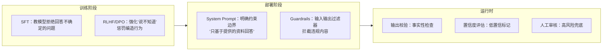

# 容错与鲁棒性：超时、报错、误操作的工程化处理

Agent 的容错设计是面试中最容易暴露“做没做过真实系统”的维度。Demo 环境里 API 永不超时、工具永不报错，但生产环境什么都会出问题。面试官考的就是：**出了问题你怎么办，系统设计上怎么防。**

---

## Q：执行到一半，比如调支付接口超时了，Agent 怎么处理？

> 来源：腾讯 Agent 岗终面

**新手答**：“重试，或者报错给用户。”

**高手答**：

我们有标准的错误处理工作流：

1. **错误分类**：网络超时 / 5xx 错误，走指数退避重试，最多 2 次。4xx 错误（如参数错），触发“参数诊断”子流程——用小模型分析错误信息，调整参数后重试。
2. **备选方案**：如果还不行，且这个工具是核心路径（如支付），就启动备选方案。比如主支付通道挂了，自动切换到备用通道。
3. **完整记录**：所有状态和决策日志完整记录，方便事后复盘。

目标是**任务尽可能完成**，而非一遇错就崩。

**差距在哪**：新手只有两个选项：重试或报错。高手的回答是一个分层的错误处理策略——先分类、再分别处理、有降级方案、有日志记录。面试官考的是“你有没有做过需要高可用的系统”，Agent 的容错设计和传统后端系统是相通的。

---

## Q：如果 Agent 的决策出错了，比如错误删除了数据，系统设计上怎么防范？

> 来源：腾讯 Agent 岗终面

**新手答**：“重要操作前让用户确认。”

**高手答**：

这是系统设计题。核心原则是**“可审计、可回滚、最小权限”**：

1. **Dry-run 模式**：所有写操作工具必须支持 dry-run，先返回预览，确认后再执行
2. **操作分级 + 多人确认**：高风险操作（删、改、支付）不仅需要用户确认，还会强制同步通知第二责任人（如主管）
3. **完整溯源日志**：每个决策的完整思维链、调用的工具、参数、结果都必须打入日志，且能一键重现
4. **权限隔离**：Agent 的操作账号权限必须是最小集，且通过内部审批流程申请

永远不要相信模型的“保证”，要用系统锁死它的操作范围。

**差距在哪**：新手只想到了“用户确认”——这是防范手段之一，但远远不够。高手的回答是一套完整的安全体系：预览 → 确认 → 日志 → 权限隔离。面试官考的是“你有没有系统设计的思维”，这道题和 Agent 的关系不大，和“如何设计一个安全的操作系统”的思路完全一样。

---

## Q：Agent 如何减少幻觉？在工业场景下怎么做？

> 来源：字节后端开发 Agent 一面

**新手答**：“用 RAG 给模型提供事实依据。”

**高手答**：

RAG 是一层，但远远不够。工业场景下减少幻觉要**多层防线**：

**生成前——约束输入**：
1. **Prompt 约束**：在 System Prompt 里明确要求“只基于提供的信息回答，不确定时说不知道”。这是最弱但成本最低的防线
2. **RAG 注入事实**：检索相关文档作为上下文，让模型“有据可依”而不是凭空生成
3. **上下文精简**：注入的信息要精准，噪声太多反而会诱发幻觉——模型会从不相关的上下文里“编”出看似合理的内容

**生成中——约束输出**：
4. **Structured Output**：用 JSON Schema 或 function calling 约束输出格式，减少自由发挥的空间
5. **引用溯源**：要求模型在回答中标注信息来源（“根据文档 A 第 3 段”），强制它把生成和证据绑定

**生成后——校验结果**：
6. **事实校验链路**：用另一个模型或规则引擎校验生成内容的事实性——关键数字、日期、实体名称是否和源数据一致
7. **一致性检测**：对同一问题多次生成，如果答案不一致，说明模型不确定，标记为低置信度
8. **人工兜底**：高风险场景（金融、医疗、法律）不管模型多自信，关键结论都要人工审核

```text
防线层级：Prompt 约束 → RAG 注入 → 格式约束 → 引用溯源 → 事实校验 → 一致性检测 → 人工审核
```

**差距在哪**：新手只有“用 RAG”一句话。高手按生成前、生成中、生成后三个阶段构建了七层防线——和后端系统的“防御性编程”是同一个逻辑。面试官不想听单一手段，想看你有没有多层防线的工程化治理思维。

---

## Q：你怎么设计 Agent 的失败恢复机制？

> 来源：腾讯大模型应用开发二面

**新手答**：“报错后重试。”

**高手答**：

失败恢复不能只理解成“报错后重试”。Agent 的失败通常分成好几类，**不同类型的恢复方式不一样**：

| 失败类型 | 恢复策略 |
|---------|---------|
| 临时性错误（接口超时、网络抖动） | 限次重试，指数退避 |
| 参数缺失 | 回退到追问用户节点 |
| 模型连续选错工具 | 触发降级策略，改成规则路由或人工兜底 |
| 外部系统不可用 | 及时终止并返回清晰失败原因 |
| 依赖数据缺失 | 走备选数据源或降级到有限回答 |

关键原则：恢复机制**一定要和状态绑定**，不能让模型自己“觉得应该再试一下”，不然很容易进入无穷重试。每种失败类型对应一个明确的恢复路径，由编排层控制，而不是靠模型自主判断。

**差距在哪**：新手的“重试”是一种恢复策略，但只适用于临时性错误。高手先对失败做了五类划分，每类有不同的恢复路径，且强调恢复机制要和状态机绑定。面试官考的是你能不能做系统性的错误处理设计，而不是一刀切的重试。

---

## Q：幻觉的各种治理手段，优缺点分别是什么？行为限制在什么阶段做？

> 来源：蚂蚁集团智能体与大模型应用一面

**新手答**：“RAG 最好用，其他的都是辅助。”

**高手答**：

幻觉治理没有银弹，每种手段都有明确的**适用场景和代价**：

| 治理手段 | 优点 | 缺点 | 适用场景 |
|---------|------|------|---------|
| Prompt 约束 | 零成本、即时生效 | 最弱防线，模型可能忽略 | 所有场景的基础层 |
| RAG 注入事实 | 知识可更新、有据可查 | 依赖检索质量，噪声文档反而诱发幻觉 | 知识密集型问答 |
| Structured Output | 格式可控、减少自由发挥 | 限制了表达灵活性 | 需要结构化输出的场景 |
| 引用溯源 | 可追溯、建立信任 | 模型可能伪造引用 | 需要可验证的场景 |
| 事实校验（后置模型） | 精度高、能抓细节错误 | 成本翻倍、增加延迟 | 高风险场景（金融/医疗） |
| 一致性检测（多次采样） | 能识别低置信度回答 | 成本 ×N、延迟 ×N | 关键决策节点 |
| SFT/RLHF 对齐训练 | 从根源降低幻觉倾向 | 需要大量标注数据、训练成本高 | 有自研模型能力的团队 |

**行为限制（Behavioral Constraints）在什么阶段做**：

行为限制的目标是让模型**知道什么不该做**——不该编造、不该超出知识范围、不该执行危险操作。这不是单一阶段的事，而是贯穿全链路：



- **训练阶段**的行为限制效果最深但成本最高——通过 RLHF 让模型内化“不知道就说不知道”的行为模式
- **部署阶段**的行为限制最灵活——改 System Prompt 就能调整约束，不需要重新训练
- **运行时**的行为限制最可靠——不依赖模型是否“听话”，用代码硬拦

工程实践中，三个阶段**必须叠加使用**。只靠训练阶段的对齐不够（模型仍会在分布外输入上幻觉），只靠运行时校验又太贵。最佳实践是：训练给底线、Prompt 给约束、运行时兜底。

**差距在哪**：新手觉得 RAG 就够了。高手逐一分析了七种治理手段的优缺点和适用场景，且把行为限制按训练/部署/运行时三个阶段展开，说明了为什么必须叠加使用。面试官考的是你对幻觉治理的全面认知——不是背手段清单，而是理解每种手段的边界和组合策略。

---

## Q：你会如何限制 Agent 的思考深度、工具调用次数和递归层级，避免无限循环？

> 来源：Agent 开发面试 30 题

**新手答**：“设一个最大步数上限就行。”

**高手答**：

硬上限是必须的，但只有硬上限是不够的——Agent 可能在第 14 步就已经开始做无用功了，等到第 15 步上限才断，浪费了一半的 token 预算。

需要**三层限制机制**：

**第一层：硬性上限（兜底）**

```text
全局步数上限：15 步（超过直接终止，输出当前最优结果）
单工具连续调用上限：同一工具连续失败 2 次，禁用该工具
递归深度上限：子 Agent 嵌套不超过 3 层
单任务 token 预算：超过阈值自动降级或终止
```

**第二层：行为检测（及早发现）**

硬上限只在最后一刻触发，更好的做法是**实时检测无效行为模式**：
- **重复检测**：最近 3 步的 action 和参数高度相似 → 陷入循环，强制换策略
- **进度检测**：连续 N 步没有产生新的有效信息（没有新的工具返回、没有新的用户确认）→ 触发反思或终止
- **目标漂移检测**：当前动作和原始目标的相关性低于阈值 → 强制回到主线

**第三层：预算感知（主动收敛）**

在 System Prompt 中注入当前资源消耗状态，让模型**主动收敛**：

```text
[系统状态] 已执行 8/15 步，已消耗 token 12000/20000，
已调用工具 5 次。请评估是否有足够信息生成最终答案。
```

模型看到预算紧张时，会倾向于给出当前最优答案而非继续探索。

**差距在哪**：新手只想到硬上限——这是最后防线，不是第一道。高手用三层机制（硬上限兜底 + 行为检测及早发现 + 预算感知主动收敛）构建了完整的防循环体系。面试官考的是你有没有处理过 Agent 失控的实战经验。

---

## Q：如果 Agent 在中间步骤已经偏了，但表面上还能继续执行，你怎么尽早发现？

> 来源：Agent 开发面试 30 题

**新手答**：“看最终结果对不对。”

**高手答**：

等到最终结果才发现偏了，意味着前面所有步骤的 token 和时间都浪费了。**越早发现偏离，成本越低**。

检测 Agent 中途偏离的三种方法：

**1. 目标锚定检查（每 N 步做一次）**：

每执行 3-5 步，插入一个“自检节点”——用一个轻量 Prompt 让模型回答：“当前执行的内容和原始目标是否一致？”

```text
[自检 Prompt]
原始目标：帮用户找到北京周末亲子游的方案
当前正在做：查询上海的酒店价格
判断：当前动作是否在朝原始目标推进？如果偏离，应该回到哪一步？
```

成本很低（一次轻量模型调用），但能在偏离的早期就发现。

**2. 输出模式异常检测（实时）**：

- **工具选择异常**：规划的是“查航班 → 查酒店 → 给方案”，实际执行到第二步突然去查天气 → 工具选择偏离预期
- **参数漂移**：前面一直在查北京的信息，突然参数变成了上海 → 关键参数发生了非用户驱动的变化
- **输出冗余**：连续两步的输出内容高度重复 → 可能陷入了无效循环

**3. 关键里程碑校验（阶段性）**：

把任务拆成几个关键里程碑，每个里程碑有明确的“交付物”：

```text
里程碑 1：完成信息收集 → 交付物：至少 3 条有效搜索结果
里程碑 2：完成方案对比 → 交付物：结构化的对比表格
里程碑 3：生成最终方案 → 交付物：包含时间/地点/费用的完整方案
```

每个里程碑检查交付物是否符合预期。不符合 → 不继续往下，先修正当前阶段。

**差距在哪**：新手只看最终结果——这是最贵的检测方式。高手在执行过程中植入了三层检测（目标锚定、输出模式、里程碑校验），越早发现偏离越省成本。面试官考的是你对 Agent 过程监控的工程化思维。

---

## 这类题的答题模式

容错题的核心是**分类处理 + 层层兜底**：

```text
1. 先对错误分类——不同类型的错误处理策略不同
2. 每类错误有明确的处理链路——重试、诊断、降级、兜底
3. 写操作必须有防护——dry-run、确认、权限隔离
4. 所有决策都要有日志——事后复盘靠这个
```

面试官听到“重试或报错”就知道你只写过 happy path。听到错误分类、指数退避、备用通道、dry-run、最小权限，才会觉得你做过需要上线的系统。

下一篇建议继续看：

- [记忆与上下文：长对话不丢信息的实战方案](../04-memory-context/index.html)
