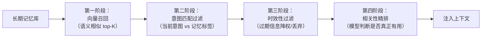
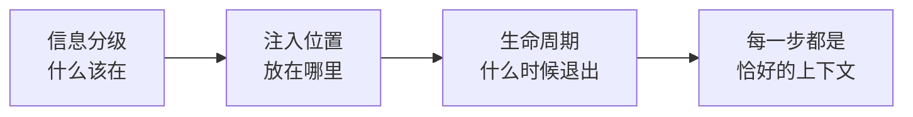
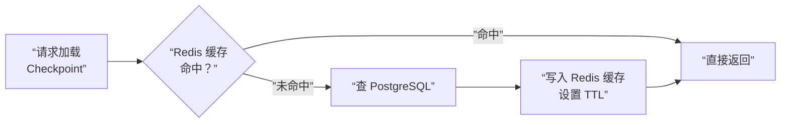
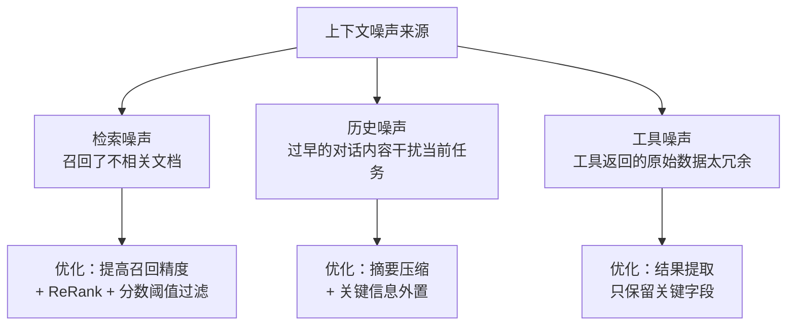
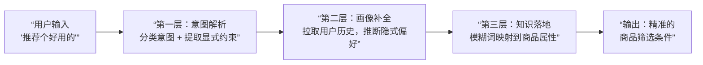
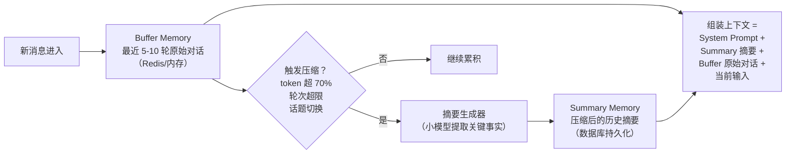
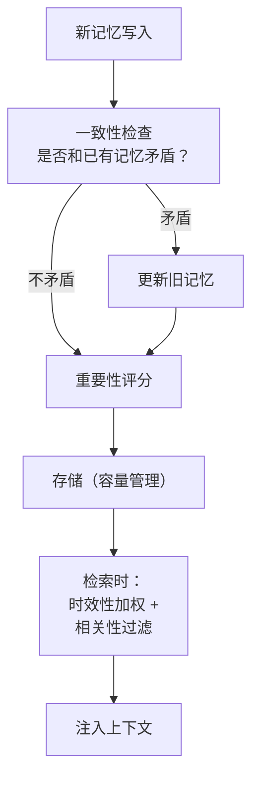
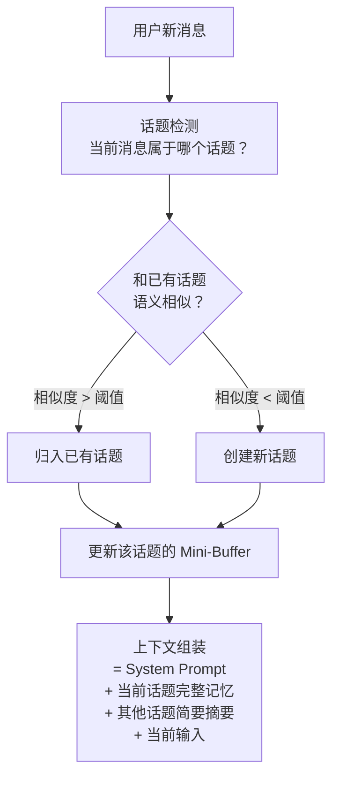
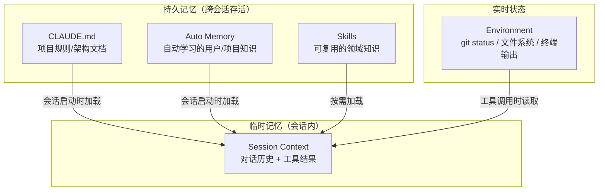
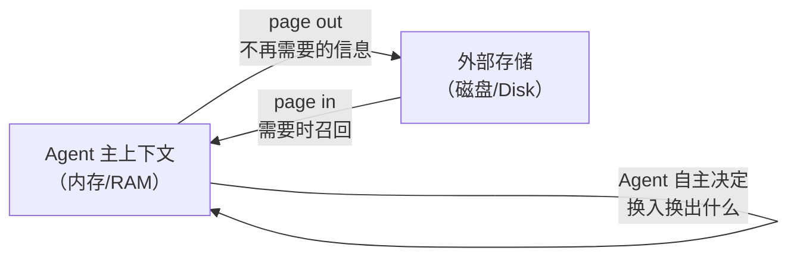

# 记忆与上下文：长对话不丢信息的实战方案

记忆和上下文管理是 Agent 面试中“看起来简单但很容易答浅”的维度。面试官不想听你说“用向量数据库”——他想知道的是**存什么、怎么查、怎么融合**，以及面对模糊输入时 Agent 怎么利用记忆给出好体验。

---

## Q：长上下文里，怎么让 Agent 不忘记关键信息？

> 来源：腾讯 Agent 岗终面

**新手答**：“用向量数据库存起来。”

**高手答**：

单一向量检索在长对话中很容易丢关键信息。我们的方案是**三段式记忆**：

1. **滚动窗口记忆**：最近 3-5 轮对话原样保留，保证强相关
2. **关键实体记忆**：用 NER 实时抽取用户提到的时间、地点、人物、任务，存入一个类似知识图谱的结构，随时可查
3. **周期性摘要记忆**：每 10 轮对话，让模型生成一段结构化摘要（“用户想做什么，目前进展到哪，遇到了什么障碍”）

查询时，三段信息同时召回，按权重融合。这样既能记住”用户对花生过敏”这种细节，又不会被 50 轮前的闲聊干扰。

**模型层面的遗忘缓解机制**：

除了工程手段，还有多种模型/架构层面的技术可以缓解长上下文信息遗忘：

| 机制 | 原理 | 效果 |
|------|------|------|
| 滑动窗口注意力 | 只关注最近 N 个 token，超出窗口的不计算 attention | 降低计算量，但会丢失远距离依赖 |
| 稀疏注意力（Longformer） | 局部窗口 + 全局 token 混合 attention | 平衡效率和长距离关注 |
| 关键信息锚定 | 把关键约束标记为”全局 token”，始终参与 attention | 防止关键信息被稀释 |
| 检索增强生成 | 长文本不全放上下文，关键段落按需检索注入 | 上下文精简，信息不丢 |
| 结构化状态外置 | 关键参数提取到独立 state，每轮强制注入 | 最可靠，不依赖模型记忆力 |

对于 Agent 场景，**结构化状态外置是最可靠的方案**——不依赖模型的 attention 分布，用系统机制保证关键信息每轮都在。模型层面的优化是锦上添花，工程层面的外置才是兜底。

**差距在哪**：新手的”向量数据库”是一个工具，不是方案。它解决了存储问题，但没解决“存什么、怎么查、怎么融合”的问题。高手的三段式记忆在不同时间粒度上各有分工——短期精确、中期结构化、长期摘要——这是 Memory 系统设计的核心思路。面试官考的是“你理不理解 Agent Memory 的多层次需求”。

---

## Q：用户说“按老样子帮我订一下”，这种模糊需求怎么处理？

> 来源：腾讯 Agent 岗终面

**新手答**：“问用户‘老样子’具体指什么。”

**高手答**：

分两步处理，**先“猜”再“问”**：

1. **猜**：立刻检索用户的历史订单，找出时间最近、频次最高、或用户标记过“喜欢”的订单，作为候选
2. **问**：把候选的 1-3 个选项（例如“是订上次的 XX 酒店吗？”）清晰地抛给用户确认

绝不能模型自己去“猜”一个就执行。这个流程把模糊需求转化成了一个清晰的选择题，体验好，且不会错。

**差距在哪**：新手的“直接问”看起来安全，但体验差——用户说“老样子”就是不想再描述一遍，你让他重新说等于没理解他的意图。高手的“先猜再确认”是更好的交互模式：展示你理解了他的意思（通过历史数据），同时用确认保证不出错。面试官考的是“你有没有产品思维”，Agent 不只是技术系统，也是用户交互系统。

---

## Q：上下文窗口不够用，对话太长了怎么办？

> 来源：Agent 岗面试高频题 / 字节 Agent 实习二面

**新手答**：“截断早期消息，只保留最近几轮。”

**高手答**：

截断是最粗暴的做法，会丢失关键上下文。我们的处理分四层：

1. **早期对话压缩成摘要**：不是直接丢掉，而是每隔一段对话，让模型把已完成的部分压缩成结构化摘要（“用户需求是什么、已确认的参数、当前进展”），只保留摘要，释放原始 token
2. **大任务拆子任务**：一个 30 步的复杂任务，不要在一个上下文里硬撑。拆成 5 个子任务，每个子任务用独立对话完成，中间结果通过数据库传递，而不是全靠上下文承载
3. **中间结果落库**：工具调用的返回值、中间计算结果，不要全留在对话里。提取关键字段存数据库，需要时再查回来，上下文里只保留一句“已完成 XX，结果存储在 task_123”
4. **按需回溯而非全量携带**：不是每轮都把所有历史带上。建一个索引，标记每段对话的主题和关键实体，需要时按主题精准召回，而不是全量塞回去

核心思路是：**先用工程手段省 token，实在不够再考虑模型层面的压缩。**

**差距在哪**：新手的“截断”是单一策略，且会造成信息丢失。高手的四层方案各有分工——摘要保留语义、拆任务降低单次复杂度、落库减少冗余、按需召回精准补充。面试官考的是“你有没有在生产环境里处理过长对话的工程经验”，这不是模型能力问题，是系统设计问题。

---

## Q：多 Agent / 多异步任务下，如何防止上下文污染？

> 来源：字节后端开发 Agent 一面

**新手答**：“每个 Agent 用独立的上下文。”

**高手答**：

上下文污染是多 Agent 系统最隐蔽的 bug——一个 Agent 的中间状态泄漏到另一个 Agent 的上下文里，导致输出偏离。

**污染来源**：
- **共享上下文变量**：多个 Agent 读写同一个 conversation history，A 的中间推理过程被 B 当成了事实
- **异步竞态**：并行 Agent 同时更新共享状态，后写入的覆盖先写入的
- **prompt 拼接错误**：动态拼接 Prompt 时，把不属于当前 Agent 的信息混了进去

**防治方案**：

1. **上下文隔离**：每个 Agent 维护独立的消息历史，不共享 conversation history。需要传递信息时，通过**显式的结构化消息**（而不是共享上下文）
2. **作用域控制**：定义每个 Agent 能看到什么——只传入它的 System Prompt、当前任务描述、和上游传来的结构化结果，不传无关历史
3. **状态快照**：并行任务启动前，对共享状态做快照。每个 Agent 基于快照执行，结果通过合并策略写回，不直接覆盖
4. **消息签名**：每条消息标记来源 Agent ID，下游 Agent 可以按来源过滤，只接收自己应该看到的信息

```text
核心原则：Agent 之间传递"结论"，不传递"过程"
```

对比后端思维：这和微服务之间不共享数据库、用 API 通信是同一个原则——**进程隔离，接口通信**。

**差距在哪**：新手只说了“独立上下文”——知道方向但没有方案。高手先分析了三种污染来源，再给出四种防治方案，且类比了后端微服务的隔离原则。面试官用“并发安全”视角考你对多 Agent 系统的理解——上下文污染本质就是“共享可变状态”问题。

---

## Q：讲一下 Agent 中的”长短期记忆”

> 来源：字节后端开发 Agent 一面 【蚂蚁AI应用开发二面同题：Agent 长期记忆设计思路】

**新手答**：“短期记忆是当前对话，长期记忆存数据库。”

**高手答**：

Agent 的记忆系统可以类比人类认知模型，分三层：

| 记忆类型 | 对应人类认知 | Agent 中的实现 | 生命周期 |
|---------|-----------|--------------|---------|
| 感知记忆 | 瞬时记忆 | 当前输入 + 最近 1-2 轮对话 | 当前请求 |
| 短期记忆 | 工作记忆 | 上下文窗口内的全部对话历史 | 当前会话 |
| 长期记忆 | 长时记忆 | 外部存储（向量库、数据库、文件） | 跨会话持久 |

**短期记忆的工程挑战**：

上下文窗口有限。对话轮次多了，早期信息被截断或被淹没。解决方案：
- **滚动窗口**：只保留最近 N 轮原始对话
- **摘要压缩**：定期让模型把已完成的对话压缩成结构化摘要
- **关键信息外置**：实时提取用户提到的关键约束（预算、日期、偏好），存到独立的状态变量里，每轮强制注入

**长期记忆的工程挑战**：

存什么、怎么查、怎么融合：
- **存什么**：不是把所有对话都存，而是提取有价值的信息——用户偏好、历史决策、学到的经验
- **怎么查**：用 embedding 做语义检索，但要控制召回数量——塞太多长期记忆会干扰当前任务
- **怎么融合**：长期记忆和短期上下文可能矛盾（用户偏好变了），需要有时效性权重——最近的记忆优先级更高

进阶：还有一类”工作记忆”——Agent 在执行多步任务时的中间状态（to-do list、已完成步骤、中间结果）。它不属于对话历史，也不属于长期记忆，是任务级别的临时状态。

**记忆更新策略**：

记忆写入后不是一成不变的，需要一套更新机制保证数据质量：

- **增量更新**：新信息覆盖旧信息时不直接替换，而是版本化存储——“用户从北京搬到上海”→ 旧记忆降权但保留，新记忆设为当前有效版本
- **冲突检测**：每次写入前和已有记忆做语义比对，发现矛盾时触发更新流程而非简单追加
- **TTL 分级淘汰**：事实性记忆（手机号、住址）设长 TTL，偏好性记忆（上次选了经济舱）设短 TTL，上下文性记忆（刚才聊了天气）会话结束即清理
- **主动验证**：高频使用的记忆定期通过用户交互确认——“我记得您偏好素食，现在还是吗？”

**差距在哪**：新手只分了两层且没有展开。高手分了三层（感知/短期/长期），每层都说了工程挑战和解法，还补充了“工作记忆”这个进阶概念。面试官要的不是“存数据库”三个字，而是你能不能把记忆按层次拆清楚。

---

## Q：对于上下文工程有什么经验？有没有做过 to-do list？为什么让模型更聚焦？

> 来源：抖音基础架构 Agent 一面 / 字节 Agent 实习二面

**新手答**：“就是把相关信息塞到上下文里。”

**高手答**：

上下文工程的核心不是“塞更多信息”，是**让模型在每一步都能看到恰好需要的信息，不多不少**。

**To-do list 机制**是上下文工程的一个重要实践：

1. **任务开始时**，让模型把复杂任务拆解成一个结构化的 to-do list，每个 item 有状态标记（pending / in_progress / completed）
2. **每一步执行后**，更新对应 item 的状态，并把当前 to-do list 注入到下一步的上下文中
3. **模型在每一步**都能看到“全局做到哪了、当前该做什么、还剩什么没做”

**为什么这样能让模型更聚焦**：

大模型的一个核心问题是**上下文越长越容易迷失**——长对话中，模型会忘记最初的任务目标，或者在中间步骤偏离方向。To-do list 起到**锚点（Anchor）**的作用：
- 它把隐式的任务进度变成了**显式的结构化状态**，模型不需要从历史消息中推断“我做到哪了”
- 每一步都有明确的当前任务，减少了模型的决策空间
- 已完成的 item 可以压缩或折叠，只保留结论，释放上下文空间给当前任务

**实现方式**：
- 在 System Prompt 中定义 to-do list 的格式规范
- 用工具调用（如 `task_update`）让模型显式更新任务状态
- 每轮对话前，把最新的 to-do list 作为上下文的固定部分注入，位置放在历史消息之前、当前任务之前

**差距在哪**：新手把上下文工程等同于“塞信息”。高手展示了 to-do list 这个具体的上下文管理手段，且解释了它为什么有效——把隐式进度变成显式状态。面试官考的是你有没有超越“Prompt Engineering”的认知——上下文工程是系统级的信息管理。

---

## Q：Agent 需要同时读知识库、调外部 API、结合用户历史偏好，怎么处理这三类上下文的优先级？

> 来源：腾讯大模型应用开发二面

**新手答**：“都放进上下文里让模型自己判断。”

**高手答**：

三类信息不能混着塞，要**先定义优先级**：

```text
优先级从高到低：
1. 系统规则（最高）
2. 当前轮用户明确输入
3. 外部工具返回 + 知识库证据
4. 用户历史偏好（最低）
```

因为偏好只影响表达方式或默认选择，不能覆盖当前事实。比如用户历史里一直偏好 Python，但这轮明确说“用 Java 给我写”，那当前轮约定一定优先。又比如知识库里有旧规则，外部 API 返回的是实时状态，那实时状态优先于静态知识。

真正做 Prompt 组装时，**最好按槽位拼接**，把“当前目标”“实时证据”“历史画像”分开，而不是混成一段自然语言。这样模型能清楚地看到每类信息的边界和权重。

**差距在哪**：新手把所有信息混在一起丢给模型——模型没有优先级意识，容易被低优先级信息干扰。高手定义了四级优先级，且在 Prompt 组装时按槽位分离。面试官考的是你有没有对多源上下文做过系统性的优先级设计。

---

## Q：你怎么理解 Agent 里的“状态”而不是“上下文”？

> 来源：腾讯大模型应用开发二面

**新手答**：“状态就是上下文的一部分。”

**高手答**：

上下文更像模型看到的输入材料，状态则是**系统对任务推进过程的结构化刻画**。Agent 做得深一点以后，不能只靠大段对话历史维持执行，因为模型并不天然擅长长期状态一致性。

状态通常包括：

```text
当前阶段、已完成任务、失败次数、已调用工具、关键中间结果、待确认信息
```

这样做的好处是，模型不用每次从自然语言自己猜任务进行到哪一步，系统可以**明确告诉它现在在什么节点**。很多所谓 Agent 不稳定，本质上不是上下文不够，而是**没有显式状态**。

**差距在哪**：新手把状态和上下文混为一谈。高手区分了两者——上下文是“模型看到的输入”，状态是“系统对任务进度的结构化刻画”。面试官考的是你理不理解 Agent 的核心工程挑战：把隐式的执行进度变成显式的结构化状态。

---

## Q：一个 Agent 系统里，什么时候应该追问用户，什么时候应该自己继续推理？

> 来源：腾讯大模型应用开发二面

**新手答**：“不确定就问用户。”

**高手答**：

判断标准主要有两个：**信息缺口是否影响正确执行**，以及**这个缺口能不能通过工具或外部知识补上**。

| 情况 | 策略 |
|------|------|
| 缺的是执行必需参数（如订单号） | 追问用户 |
| 缺的是可由外部系统补齐的信息（如城市从画像获取） | 自己继续推理 |
| 能猜到但猜错代价极高（如支付、删除） | 宁愿追问，不擅自补全 |

追问不是因为模型”不聪明”，而是因为系统要在**体验和风险之间做平衡**。无脑追问体验差，无脑猜测风险高——好的 Agent 需要根据操作的可逆性和代价来决定。

**主动澄清 vs 历史画像推断的决策框架**：

在电商、导购等场景中，Agent 还面临一个更精细的判断：用户说”帮我挑个好用的”——是追问”您需要什么功能？”还是直接结合历史购买记录推荐？

| 条件 | 策略 | 原因 |
|------|------|------|
| 有高置信度历史画像 + 低风险操作 | 强行推断，直接推荐 | 体验好，用户觉得”懂我” |
| 有历史画像但置信度低（很久没买/品类陌生） | 展示推断 + 请求确认 | “根据您之前的偏好，推荐XX，是否合适？” |
| 无历史画像 + 高风险操作（支付/删除） | 必须追问 | 猜错代价大于追问成本 |
| 无历史画像 + 低风险操作 | 给出默认推荐 + 提供修改入口 | 先动起来，不阻塞流程 |

核心原则：**追问的目的是减少不确定性，不是收集所有信息**。如果历史画像能把不确定性降到可接受水平，就不要追问。

**差距在哪**：新手的”不确定就问”看起来安全，但会导致过度追问、体验打折。高手用两个判断标准（是否影响执行 + 能否自动补齐）加一个风险维度（猜错代价）构建了完整的决策框架。面试官考的是你能不能在”用户体验”和”执行安全”之间做工程化的平衡。

**追问：用户表达极度模糊（如”帮我看看””随便推荐”），Agent 在工程上怎么处理？**

上面的决策框架处理的是”有部分信息但不完整”的情况。但实际场景中还有**信息量接近于零**的极端情况——用户说”帮我看看”，连意图分类都做不了。

**工程处理的三层兜底**：

| 层级 | 方法 | 何时触发 |
|------|------|---------|
| 第一层：隐式信号补全 | 从用户当前页面、最近行为、会话上下文推断意图 | 有可用的行为信号时 |
| 第二层：选择式澄清 | 给出 2~3 个最可能的意图选项，让用户选 | 行为信号不足以做高置信推断时 |
| 第三层：默认行动 + 修正入口 | 执行最常见的默认意图，提供”不是我想要的”修正按钮 | 用户对追问不耐烦或场景要求快速响应时 |

**第二层的实现细节**——选择式澄清比开放式追问效果好得多：

```text
❌ 开放式：”您想要什么？”（用户不知道从何说起，可能直接走了）
✅ 选择式：”您是想——A. 看看最近的热门推荐 B. 找上次浏览过的商品 C. 有具体想买的东西？”
```

选项生成的方法：
1. **频率统计**：从历史数据中挖掘该类模糊 query 最常对应的 Top-3 意图
2. **用户画像**：结合用户历史行为，个性化排序选项
3. **场景上下文**：从当前页面/入口推断（从首页进来 vs 从售后页进来，默认选项完全不同）

核心原则：**不要让用户做填空题，让用户做选择题**。每次澄清最多问一个问题，且必须带选项。

---

## Q：设计一个能支持亿级用户、千亿级记忆条目的 Agent 记忆系统，你会如何做技术选型和架构设计？

> 来源：后端 AI 八股 / Memory 系统

**新手答**：“用向量数据库存记忆，加个缓存层。”

**高手答**：

亿级用户 × 千亿条目，核心挑战是**存储成本、检索延迟和写入吞吐**三角平衡。架构分三层：

1. **热记忆层**（最近 7 天 / 高频访问）：Redis Cluster 或 MemoryDB，按 user_id 分片，毫秒级读写。容量小但访问频繁
2. **温记忆层**（近期 + 中等频率）：向量数据库（Milvus / Qdrant）+ 倒排索引（Elasticsearch），支持语义检索和关键词混合召回
3. **冷记忆层**（历史归档）：对象存储（S3 / OSS）+ 列式数据库（ClickHouse），压缩存储，按需加载

关键设计决策：
- **分片策略**：按 user_id 一致性哈希分片，同一用户的记忆在同一分片上，减少跨分片查询
- **冷热分离**：记忆条目带 TTL 和访问计数器，定期冷热迁移。大部分记忆 30 天后几乎不再被访问
- **写入优化**：记忆写入走异步队列（Kafka），批量写入存储层，避免高并发写入打爆数据库
- **索引策略**：不是所有记忆都建向量索引——高频查询的建索引，低频的只做全文检索或按时间范围查
- **Embedding 服务独立部署**：向量化计算是 CPU/GPU 密集型，和业务服务混部会互相影响。独立部署 Embedding 服务（K8s 上按需扩缩），写入时异步调用，避免阻塞主链路
- **两阶段检索**：第一阶段用 ANN（近似最近邻）从百万级候选中快速召回 top-100，第二阶段用 Re-ranking 模型（Cross-Encoder）对候选集做精排，兼顾速度和精度

千亿级的核心不是“用什么数据库”，而是**分层存储 + 冷热分离 + 异步写入**的架构设计。

**差距在哪**：新手只想到了一个组件。高手按访问频率做了三层分离，每层有不同的存储引擎和访问模式，且点出了分片、冷热迁移、异步写入三个关键工程决策。面试官考的是你能不能把“用什么数据库”的问题升级成一个完整的系统架构设计。

---

## Q：如何处理记忆的“新鲜度”与“重要性”之间的冲突？

> 来源：后端 AI 八股 / Memory 系统

**新手答**：“最新的优先。”

**高手答**：

新鲜度和重要性是记忆排序的两个独立维度，不能简单让一个压过另一个。处理思路是**多因子加权 + 衰减函数**：

```text
FinalScore = w1 × Relevance + w2 × Importance + w3 × Recency
```

- **相关性（Relevance）**：当前查询和记忆条目的语义匹配度，用 embedding 相似度或 Cross-Encoder 打分
- **重要性（Importance）**：由记忆的语义权重决定——用户明确表达的偏好（“我对花生过敏”）权重高；闲聊、过渡性对话权重低。可以用分类器或规则标注
- **新鲜度（Recency）**：用时间衰减函数，比如指数衰减 `decay = e^(-λt)`，越久越低

权重 w1、w2、w3 不是拍脑袋定的——通过 **A/B 测试**在线上调优，不同业务场景的最优权重可能完全不同（客服场景重要性权重高，新闻场景新鲜度权重高）。

**冲突消解的关键**是按记忆类型定不同的衰减策略：
- 事实性记忆（如过敏信息）：重要性权重极高，几乎不衰减
- 偏好性记忆（如“喜欢中餐”）：中等衰减，允许被新偏好覆盖
- 上下文性记忆（如“上次聊到了旅行”）：快速衰减，主要靠新鲜度

核心是**不同类型的记忆用不同的衰减策略**，而不是一刀切。

**差距在哪**：新手用单一维度做排序。高手引入了三因子加权模型（相关性 + 重要性 + 新鲜度），按记忆类型定义不同的衰减策略，且用 A/B 测试调优权重。面试官考的是你有没有把“排序”问题建模成一个可量化、可调优的工程方案。

---

## Q：Agent 的记忆可能存在偏见（Bias）或事实性错误，如何发现并纠正？

> 来源：后端 AI 八股 / Memory 系统

**新手答**：“定期清理过期记忆。”

**高手答**：

记忆偏见主要有三种来源：
1. **采样偏差**：如果用户只在不满时反馈，Agent 记住的全是负面信息，导致后续交互过度谨慎
2. **确认偏差**：Agent 用已有记忆过滤新信息，只保留和已有记忆一致的内容，形成“信息茧房”
3. **事实过期**：用户之前说“在北京工作”，后来搬去了上海，旧记忆变成了错误记忆

**发现机制**：
- **矛盾检测**：新记忆写入时，和已有记忆做冲突检查。如果新信息和旧记忆矛盾（“我现在在上海” vs 记忆中的“用户在北京”），触发更新流程
- **置信度衰减**：事实性记忆带置信度分数，长时间未被验证的逐步降低置信度
- **周期性审计**：定期用模型对关键记忆做事实性检查——“这条记忆是否仍然有效？”

**纠正机制**：
- 用户主动纠正时，不只更新当前记忆，还要**级联更新**所有基于错误记忆推导出的下游记忆
- 高置信度新信息覆盖低置信度旧信息，但旧信息不删除，做版本化存储，方便溯源

**差距在哪**：新手只想到了“清理过期”——这是最粗暴的方式。高手从偏见来源、发现机制、纠正策略三个层面构建了完整方案，且提到了级联更新和版本化存储。面试官考的是你有没有意识到记忆系统的“数据质量”问题。

---

## Q：什么是记忆的 Reflection 机制？它与简单的 Summarization 有何不同？

> 来源：后端 AI 八股 / Memory 系统

**新手答**：“Reflection 就是对记忆做总结。”

**高手答**：

Summarization 是**压缩**——把 10 段对话压成 1 段摘要，信息量减少但核心保留。Reflection 是**提炼 + 推理**——不只压缩，还要从记忆中**抽象出更高层次的认知**。这个概念最早在 Stanford 的 Generative Agents 论文中被系统化提出。

```text
原始记忆：
- "用户问了三次 Python 装饰器的用法"
- "用户在 Java 泛型问题上回答得很快"
- "用户说自己是后端开发"

Summarization 输出：
"用户是后端开发，问过 Python 装饰器和 Java 泛型"

Reflection 输出：
"用户是有经验的 Java 后端开发，正在学习 Python。
 Python 基础语法可能已掌握，但高级特性（装饰器、元编程）是薄弱点。
 后续交互建议：Python 解释可以类比 Java 概念来辅助理解。"
```

Reflection 的价值在于它产生了**原始记忆中不存在的新知识**——“正在学习 Python”“可以用 Java 类比”这些推断不是任何一条原始记忆直接包含的。本质上，Reflection 做了三件 Summarization 做不到的事：**归纳**（从多条记忆中提取共性）、**抽象**（从具体事件上升到模式识别）、**策略推导**（基于认知产出行动建议）。

实现上，Reflection 通常是定期运行的后台任务：积累一批记忆后，让模型做一次反思性分析，产出高级认知，存入独立的“反思记忆层”。Generative Agents 的做法是设置一个“重要性累计阈值”——当最近记忆的重要性总分超过阈值时触发一次 Reflection，而不是简单按时间间隔。

**差距在哪**：新手把 Reflection 等同于 Summarization。高手用具体例子展示了本质区别——Summarization 压缩信息，Reflection 通过归纳、抽象、策略推导产生新认知，并引用了 Generative Agents 的触发机制。面试官考的是你对记忆系统“知识蒸馏”能力的理解。

---

## Q：在实现长期记忆时，什么情况选向量数据库，什么情况选传统的 KV 或关系数据库？

> 来源：后端 AI 八股 / Memory 系统

**新手答**：“记忆都用向量数据库。”

**高手答**：

选什么取决于**查询模式**，不是记忆类型：

| 查询模式 | 适用存储 | 示例 |
|---------|---------|------|
| 语义相似性搜索 | 向量数据库 | “用户之前说过关于旅行的偏好” |
| 精确键值查找 | KV 存储 | user_id → 最近 5 条对话（情景记忆 / Episodic Memory） |
| 结构化条件过滤 + 事务 | 关系数据库 | “最近 7 天内、重要性 > 0.8 的记忆”，或需要跨表 JOIN、ACID 事务的场景 |
| 图关系查询 | 图数据库 | “和用户提到的‘张三’相关的所有记忆” |

实际系统通常是**混合存储**：
- 用户画像和结构化偏好 → 关系数据库（PostgreSQL），支持精确查询、复杂 JOIN 和事务——当记忆条目之间有强关联关系（如偏好变更历史、记忆版本链）时，关系数据库的事务保证不可替代
- 最近对话和热记忆 → KV 存储（Redis / DynamoDB），毫秒级读取，适合存储情景记忆（Episodic Memory）——按时间线组织的对话片段
- 语义检索场景 → 向量数据库（Milvus / Qdrant），支持 embedding 相似度召回
- 实体关系 → 图数据库（Neo4j），支持多跳关联查询

向量数据库的局限：不擅长精确匹配、不支持事务、更新成本高。如果你的查询是“查用户的手机号”，向量数据库反而不如 KV 直查。

**差距在哪**：新手“全用向量数据库”是一刀切。高手按查询模式选存储，区分了情景记忆（KV）、语义记忆（向量库）、结构化记忆（关系库）、关联记忆（图库），且指出实际系统是混合架构。面试官考的是你有没有数据存储选型的工程经验——不同查询模式对应不同的最优存储引擎。

---

## Q：什么是记忆的幻觉问题？它和 LLM 本身的幻觉有何区别？如何缓解？

> 来源：后端 AI 八股 / Memory 系统

**新手答**：“都是模型编造信息。”

**高手答**：

两者的来源不同，治理手段也不同：

- **LLM 幻觉**：模型在生成时凭空编造事实，来源是模型参数中的统计偏差。比如问“某公司 CEO 是谁”，模型编了一个不存在的名字
- **记忆幻觉**：Agent 从记忆中检索到了信息，但这条记忆本身是错的、过期的、或被错误关联的。比如检索到“用户喜欢辣”（其实是另一个用户的记忆），然后基于这条错误记忆做了推荐

关键区别：LLM 幻觉是“无中生有”，记忆幻觉是**“有据但据错”**。记忆幻觉更难发现——因为 Agent 确实引用了一条“记忆”，看起来有理有据，但根基是错的。

**缓解手段**：
1. **置信度过滤**：记忆条目带来源标签和置信度分数，检索时设相关性阈值，低置信度记忆降权或标注“不确定”
2. **交叉验证**：关键记忆在使用前和外部数据源做一致性校验
3. **用户确认**：基于记忆做高风险操作前，先向用户确认“我记得你上次说过 XX，是否正确？”

**差距在哪**：新手混淆了两种幻觉。高手区分了来源（模型参数 vs 记忆存储）和表现（无中生有 vs 有据但据错），且针对记忆幻觉给出了置信度过滤、交叉验证、用户确认三种缓解手段。面试官考的是你对 Agent 系统中不同类型错误的精确认知。

---

## Q：什么是“工具态记忆”（Tool-state Memory）？它在 Agent 工作流中如何发挥作用？

> 来源：后端 AI 八股 / Memory 系统

**新手答**：“就是记住工具的使用方法。”

**高手答**：

工具态记忆（也叫 **Procedural Memory**，程序性记忆）是指 Agent 在调用工具过程中产生的**中间状态和执行上下文**，包括四类：

1. **工具调用历史**：哪些工具被调用过、参数是什么、返回了什么——避免重复调用
2. **工具执行状态**：每次工具调用的生命周期状态（`pending → running → success/failed`），供编排层做流转控制和超时检测
3. **工具能力记忆**：某个工具在特定条件下的成功率、平均延迟、已知限制——辅助工具选择决策
4. **失败记忆**：哪些参数组合导致过工具调用失败，失败原因是什么——避免重复犯错，支持自动重试策略调整

**在工作流中的作用**：
- **避免重复调用**：查过一次天气就不需要再查，除非时间过了很久
- **上下文传递**：前一个工具的输出是后一个工具的输入参数，中间需要工具态记忆做承接
- **动态工具选型**：根据历史失败记忆，自动跳过当前不可用的工具，选择备选方案
- **执行状态追踪**：编排层通过工具执行状态判断当前步骤是否完成、是否需要超时干预，这是实现可靠多步工作流的基础

和对话记忆的区别：对话记忆是“用户说了什么”，工具态记忆是“系统做了什么”。很多 Agent 只维护对话记忆，丢失了工具态——导致重复调用、参数丢失、无法从失败中学习。

**差距在哪**：新手把工具态记忆理解成“记住工具说明书”。高手用 Procedural Memory 概念框架，区分了四类工具态记忆（调用历史、执行状态、能力记忆、失败记忆），且说清了它在避免重复、上下文传递、动态选型、状态追踪四个场景的作用。面试官考的是你对 Agent 工作流中“执行态信息”管理的理解。

---

## Q：记忆的容量规划需要考虑哪些因素？如何估算存储成本？

> 来源：后端 AI 八股 / Memory 系统

**新手答**：“按用户数乘以平均记忆条数估算。”

**高手答**：

容量规划要考虑三类因素：

**单条记忆存储拆解**：
```text
原始文本：200-500 字，UTF-8 编码约 0.6-1.5 KB
Embedding 向量：768 维 float32 约 3 KB，1536 维约 6 KB
元数据索引：时间戳、标签、置信度等约 0.5 KB
─────────────────────────────────
单条记忆总存储 ≈ 5-8 KB
```

**规模估算**（两种口径交叉验证）：
```text
口径一：按总用户估算
1 亿用户 × 平均 1000 条/用户 = 1000 亿条
1000 亿条 × 7 KB/条 ≈ 700 TB 原始存储
加上索引、副本、冗余 → 约 2-3 PB

口径二：按 DAU 增长估算
100 万 DAU × 50 条/天 × 365 天 = 182.5 亿条/年
第一年原始存储 ≈ 128 TB，三年累计 ≈ 400 TB
```

**成本估算**（以 AWS 为例）：
```text
冷存储（S3 Standard）：$0.023/GB/月 → 400 TB ≈ $9,200/月
热存储（Redis）：按 50 TB 热数据，r6g.xlarge 集群 ≈ $15,000/月
向量索引（Milvus on EKS）：100 TB 向量 ≈ $8,000/月
Embedding 计算：按 5000 万条/天 × $0.0001/条 ≈ $5,000/月
```

**成本优化手段**：
- **冷热分离**：80% 的记忆超过 30 天不再被访问，转冷存储成本降 10 倍+
- **向量量化**：int8 量化可以把向量存储减半，精度损失约 1-2%
- **记忆合并**：相似记忆做去重和合并，减少冗余条目
- **TTL 策略**：低重要性记忆设过期时间，自动清理

还要考虑**读写比**（记忆系统通常读多写少 10:1 以上，读扩展比写扩展更重要）和**增长速率**（每天新增多少条记忆，决定扩容节奏）。

**差距在哪**：新手只做了简单乘法。高手从单条存储拆解、双口径规模估算、具体云服务成本核算、优化手段四个层面做了完整规划，且给出了可落地的数字（精确到美元/月）。面试官考的是你有没有做过大规模存储系统的容量规划，能不能把一个抽象的“多大”变成具体的数字和优化策略。

---

## Q：如何判断当前对话与历史对话是否相关？

> 来源：字节 Agent 实习二面

**新手答**：“看关键词有没有重叠。”

**高手答**：

相关性判断是上下文管理的前置环节——Agent 需要决定是否召回历史对话来辅助当前回答。做错了要么遗漏关键信息，要么引入无关噪声。

**判断方法分三个层次**：

**1. 实体和意图匹配**（快、粗）：

- 提取当前对话的关键实体（人名、产品名、任务名）和意图标签
- 与历史对话的实体/意图做交集匹配
- 有交集 → 可能相关，进入下一步精判
- 无交集 → 大概率无关，跳过

**2. 语义相似度**（中等精度）：

- 对当前对话和历史对话分别做 embedding
- 计算余弦相似度，设阈值（如 0.7）
- 注意：不能只拿最后一句话做 embedding，应该取当前对话的主题摘要

**3. 模型精判**（慢、准）：

- 把当前对话和候选历史对话组合成一个 prompt，让小模型（7B）判断“这两段对话是否讨论同一主题或有因果关系”
- 适合高价值场景（如客服接续、任务继续），不适合每次都调

**工程实践中的组合策略**：

```text
当前对话 → 实体/意图提取（规则/小模型）
        → 用实体做倒排检索，召回候选历史
        → embedding 相似度粗排，保留 top-K
        → （可选）模型精排
        → 判断是否关联
```

**关键设计点**：

- **时间衰减**：越近的历史对话越可能相关，给相似度分数加时间衰减权重
- **主题切换检测**：如果用户明确说“换个话题”或提了一个完全无关的新需求，直接判定与历史无关
- **会话级 vs 跨会话级**：同一会话内的历史默认相关，跨会话的才需要判断

**差距在哪**：新手只想到关键词匹配，这在语义相近但用词不同时会失效。高手用三层递进的判断方法（实体匹配 → 语义相似 → 模型精判），且考虑了时间衰减和主题切换等实际场景。面试官考的是你能不能把“相关性判断”设计成一个可工程化的方案，而不是拍脑袋设阈值。

---

## Q：你会如何判断一条历史信息该进入长期记忆，还是只留在当前会话里？

> 来源：Agent 开发面试 30 题

**新手答**：“重要的存长期，不重要的只留会话。”

**高手答**：

“重要不重要”太主观了。需要一套**可程序化的判断标准**：

**进入长期记忆的条件（满足任一）**：

| 条件 | 示例 | 原因 |
|------|------|------|
| 用户显式声明的偏好 | “我不吃辣”“预算一般在 5000 以内” | 跨会话复用价值高 |
| 反复出现的模式 | 连续三次对话都查某只股票 | 隐式偏好，值得记住 |
| 身份性信息 | 姓名、角色、所在城市、公司 | 个性化服务的基础 |
| 已确认的事实性结论 | “上次排查发现是 Redis 配置问题” | 避免重复排查 |

**只留在当前会话的条件**：

| 条件 | 示例 | 原因 |
|------|------|------|
| 一次性的任务上下文 | “帮我写封邮件”的具体内容 | 任务完成后无复用价值 |
| 中间推理过程 | 模型的 chain-of-thought | 占空间大、复用价值低 |
| 临时性的环境信息 | “现在网络不好” | 下次对话时已过期 |
| 未经确认的猜测 | Agent 推测用户可能想要 X | 未验证的信息不应持久化 |

**工程实现**：每轮对话结束后，用一个轻量模型做“记忆准入判断”——从当前对话中提取候选记忆条目，按上述条件过滤，通过的写入长期存储。关键是**去重**——新记忆和已有记忆做语义相似度检查，重复的合并而非追加。

**差距在哪**：新手用“重要性”做主观判断。高手给出了可程序化的准入条件表——显式偏好、反复模式、身份信息、确认事实四类进长期，一次性上下文、中间过程、临时信息、未确认猜测只留会话。面试官考的是你能不能把模糊的“重要性”转化成可执行的工程规则。

---

## Q：长期记忆检索时，怎么避免把“语义相关但当前无用”的内容召回进来污染理解？

> 来源：Agent 开发面试 30 题

**新手答**：“调高相似度阈值。”

**高手答**：

单纯调高阈值会漏掉真正有用的记忆。问题的根源不是“检索到了不相关的”，而是**“语义相关”不等于“当前有用”**。

比如用户以前聊过北京的餐厅推荐，现在在聊北京的天气——“北京”“推荐”这些词语义上确实相关，但餐厅记忆对天气问题毫无帮助。

解决方案是**多阶段过滤**：



1. **意图匹配过滤**：每条长期记忆存储时打上意图标签（美食、出行、技术、偏好等），召回时只取和当前意图匹配的类别
2. **时效性过滤**：带时间戳的记忆检查是否过期——“上周的天气”对本周没用，但“用户不吃辣”长期有效
3. **相关性精排**：用一个轻量模型或 Cross-Encoder 判断：“这条记忆对回答当前问题是否有帮助？”

关键原则：**宁可少召回，不要多召回**。注入一条无关记忆的危害比漏掉一条有用记忆更大——因为无关信息会干扰模型的推理方向，而缺少信息模型会主动追问。

**差距在哪**：新手靠调阈值——这是一维调节，解决不了“语义相关但无用”的核心矛盾。高手用四阶段过滤（向量召回 → 意图匹配 → 时效性 → 精排）逐步缩小范围，且给出了“宁少勿多”的设计原则。面试官考的是你对记忆检索质量的工程化思考。

---

## Q：记忆摘要、压缩、去重、合并这几件事，你会怎么设计触发时机？

> 来源：Agent 开发面试 30 题

**新手答**：“定时跑一个清理任务。”

**高手答**：

定时清理是最简单但最粗糙的方案——可能还没到清理时间记忆就爆了，也可能频繁清理浪费资源。更合理的做法是**事件驱动 + 阈值触发**的组合：

| 操作 | 触发时机 | 原因 |
|------|---------|------|
| **摘要** | 单次会话结束时 | 会话原始内容太长，摘要后再存入长期记忆 |
| **压缩** | 当前上下文 token 数达到窗口 70% | 预留 30% 给模型生成和新信息，不等到 100% 才压缩 |
| **去重** | 新记忆写入时 | 写入前和已有记忆做相似度检查，发现重复就合并而非追加 |
| **合并** | 同一主题的记忆条目超过 N 条时 | 5 条关于“用户喜欢日料”的记忆可以合并成 1 条 |

**设计关键点**：

1. **压缩不是简单截断**：不能直接砍掉前面的对话。用模型对历史消息做摘要压缩——保留关键决策和约束条件，丢弃中间推理过程
2. **去重要看语义不是看字面**：“用户偏好日料”和“用户喜欢吃日本菜”字面不同但语义重复，需要用 embedding 相似度判断
3. **合并要保留时间线**：合并后的记忆应保留“最早/最近出现时间”，方便后续做时效性判断

```text
触发策略优先级：
  写入时去重（实时）> 会话结束时摘要（会话级）> 上下文压缩（对话中）> 主题合并（后台异步）
```

**差距在哪**：新手用定时任务一刀切。高手按操作类型分别设计了不同的触发时机——摘要在会话结束、压缩在 token 阈值、去重在写入时、合并在条目超限时，且说清了每个操作的关键约束。面试官考的是你对记忆生命周期管理的工程化设计能力。

---

## Q：如果用户偏好、事实记忆、系统状态三者冲突了，Agent 应该信谁？

> 来源：Agent 开发面试 30 题

**新手答**：“听用户的。”

**高手答**：

不能无条件听用户的。三者的优先级要**按冲突类型分别处理**：

**冲突类型 1：用户偏好 vs 事实记忆**

用户说“我预算不限”，但历史记忆显示用户每次都选最便宜的 → **以当前偏好为准，但可以柔性提醒**：“好的，预算不限。顺便说一下，之前您几次选的都是经济型方案，需要我也推荐一些高端选项吗？”

原则：当前会话的显式声明 > 历史隐式行为模式。

**冲突类型 2：用户偏好 vs 系统状态**

用户说“帮我订明天的机票”，但系统状态显示用户账户已被风控冻结 → **系统状态优先，必须拦截**。不能因为用户想做就帮他做——安全约束、权限约束、业务规则是硬性边界。

原则：系统安全/合规约束 > 一切用户偏好。

**冲突类型 3：事实记忆 vs 系统状态**

记忆里存的是“用户 VIP 等级为金卡”，但系统实时查询显示已降级为银卡 → **以系统实时状态为准**。记忆可能过期，系统状态是当前事实。

原则：实时系统状态 > 历史记忆快照。

**总结优先级**：

```text
系统安全/合规约束（不可违反）
    > 系统实时状态（当前事实）
        > 用户当前显式声明（当前意愿）
            > 历史记忆/行为模式（参考但可被覆盖）
```

**差距在哪**：新手无条件听用户的——但如果用户要做违反安全规则的事呢？高手按冲突类型分别处理，给出了明确的优先级链：安全 > 实时状态 > 当前声明 > 历史记忆。面试官考的是你在设计 Agent 决策逻辑时有没有考虑过“信息源冲突”这个关键问题。

---

## Q：Code Agent 的上下文工程，和普通对话 Agent 相比有哪些独特挑战？

> 来源：蚂蚁集团 Agent 开发一面

**新手答**：“代码多了上下文放不下，截断就行。”

**高手答**：

Code Agent 的上下文工程比普通对话 Agent 难得多，因为**代码的上下文结构是网状的，不是线性的**。

**挑战一：依赖关系是隐式的**

普通对话的上下文是线性的——前几轮说了什么。但代码的上下文是**跨文件、跨模块的依赖图**。要修改一个函数，可能需要知道：调用它的地方、它依赖的类型定义、相关的配置文件、对应的测试文件。这些信息分散在整个项目里，不在对话历史中。

```text
普通对话 Agent：上下文 = 最近 N 轮对话（线性）
Code Agent：上下文 = 当前文件 + 依赖文件 + 类型定义 + 测试 + 配置 + git history（网状）
```

**挑战二：精度要求极高**

自然语言对话“大差不差”也能用，但代码差一个字符就编译不过。上下文里缺少一个类型定义，模型就可能自己编造一个不存在的接口。所以 Code Agent 的上下文不能只求“相关”，必须求**精确和完整**。

**挑战三：上下文随操作动态变化**

Code Agent 每做一步操作（写文件、运行测试），项目状态就变了。下一步的上下文必须基于**操作后的最新状态**，不能用缓存的旧版本。这意味着上下文需要持续刷新，而不是一次组装完就够了。

**工程解法**：

1. **结构化索引**：不把整个文件塞进上下文，而是用 AST/LSP 建立项目的结构化索引——函数签名、类型定义、调用关系。需要时按依赖路径精确召回
2. **分层加载**：当前编辑文件全量加载 → 直接依赖文件加载签名 → 间接依赖只加载类型定义
3. **操作后刷新**：每次文件修改或命令执行后，增量更新受影响文件的上下文，而非全量重建
4. **项目规则注入**：用 CLAUDE.md / .cursorrules 等机制注入编码规范和架构约束，让模型在生成代码时遵守项目约定

**差距在哪**：新手把 Code Agent 的上下文当成普通对话来处理。高手看到了代码上下文的三个独特挑战（网状依赖、精度要求、动态变化），并给出了结构化索引、分层加载、操作后刷新、规则注入四个工程解法。面试官考的是你对 Code Agent 这个垂直场景的深度理解。

---

## Q：做上下文工程最关键的工作是什么？

> 来源：蚂蚁集团 Agent 开发二面

**新手答**：“把相关信息尽量多地塞进上下文。”

**高手答**：

上下文工程最关键的工作不是“塞更多信息”，而是**在有限的窗口里，让模型在每一步都能看到恰好需要的信息——不多不少**。

这个工作可以拆成三个关键环节：

**1. 信息分级——决定“什么信息该在上下文里”**

```text
必须在（每轮注入）：系统规则、当前任务目标、关键约束条件
按需在（检索注入）：相关知识、历史记录、工具返回结果
不该在（外置存储）：中间推理过程、已处理的原始数据、过长的工具返回
```

最常见的错误是把所有东西都往上下文里塞——信息越多，模型越容易在噪声中迷失。

**2. 注入位置——决定“信息放在上下文的哪个位置”**

大模型对上下文不同位置的信息敏感度不同（Lost in the Middle 现象）。关键信息的最佳位置：

```text
System Prompt：系统规则、角色约束、输出格式要求（最稳定的锚点）
对话开头：任务目标、关键约束（不会被中间对话淹没）
最近几轮：工具返回结果、当前步骤信息（和当前决策最相关）
```

**3. 生命周期管理——决定“信息什么时候进、什么时候出”**

上下文不是只进不出的。最关键的工程决策是**信息的退出策略**：

- 工具返回的原始 JSON：提取关键字段后，原始数据退出上下文
- 已完成的子任务：压缩成一句摘要，详情落库
- 过时的约束条件：用户改了需求后，旧约束必须显式移除，不能让它残留干扰



**差距在哪**：新手以为上下文工程就是”塞信息”。高手把它拆成信息分级、注入位置、生命周期管理三个关键环节——重点不是”放什么进去”，而是”什么时候让什么退出”。面试官考的是你对上下文工程的系统性认知，而不只是”会用 RAG 注入知识”。

---

## Q：Agent 的 Checkpoint 用什么数据库存？初始化 session 时如何优化加载 Checkpoint 的速度？

> 来源：AI 工程师面试

**新手答**：”用 Redis 存，读取快。”

**高手答**：

Checkpoint 是 Agent 执行状态的持久化快照——包括当前节点、中间变量、已完成步骤、工具返回结果等。选什么数据库存、怎么优化加载速度，取决于**数据特征和访问模式**。

**存储选型**：

| 方案 | 适用场景 | 优缺点 |
|------|---------|--------|
| **PostgreSQL**（LangGraph 默认） | 生产环境首选 | 事务保证、支持复杂查询、数据持久可靠；延迟略高 |
| **SQLite** | 本地开发、单用户场景 | 零配置、嵌入式；不支持并发写入 |
| **Redis** | 高频读写、短期状态 | 极低延迟；但数据持久性弱，重启可能丢失 |
| **MongoDB** | Checkpoint 结构复杂且多变 | Schema 灵活；但事务支持弱于 PG |

LangGraph 生产部署推荐 **PostgreSQL + 异步连接池**（`AsyncPostgresSaver` + `asyncpg`），兼顾可靠性和性能。

**Checkpoint 表结构设计**（以 LangGraph 为例）：

```text
checkpoints 表：
  thread_id      -- 会话标识
  checkpoint_id  -- 检查点版本号（单调递增）
  parent_id      -- 父检查点 ID（支持版本链）
  channel_values -- 序列化的状态数据（JSON/msgpack）
  metadata       -- 节点名、时间戳、自定义标签
```

通过 `thread_id` 定位会话，`checkpoint_id` 定位最新版本，`parent_id` 支持状态回溯。

**加载速度优化**：

初始化 session 时加载 Checkpoint 的瓶颈通常在**序列化数据的读取和反序列化**。优化分四个方向：

**1. 数据库层优化**：

```text
- 对 (thread_id, checkpoint_id) 建复合索引，精确命中，避免全表扫描
- 使用连接池（asyncpg pool）复用数据库连接，省掉每次建连的开销
- 对历史 checkpoint 做定期归档，保持主表体积小
```

**2. 缓存层**：



热点 session 的最新 Checkpoint 缓存到 Redis，TTL 设为 session 超时时间。命中率高时加载延迟从 10ms 级降到 1ms 级。

**3. 懒加载（Lazy Loading）**：

不一次性加载完整 Checkpoint。先加载元数据（当前节点、步骤数），`channel_values` 中的大字段（如工具返回的长文本、检索结果）按需加载：

```text
第一步：加载 metadata + 当前节点位置（<1ms）
第二步：用户实际交互时，按需加载具体 channel 的值
```

**4. 状态压缩**：

- 历史步骤的完整工具返回可以压缩为摘要——只保留关键结论，丢弃原始 JSON
- 用 msgpack 替代 JSON 做序列化，体积缩小 30-50%，反序列化速度更快
- 超过一定步数的历史 Checkpoint 只保留最近 N 个完整快照，更早的合并为摘要快照

**差距在哪**：新手只想到 Redis——快但不可靠，且没考虑加载优化。高手从存储选型（PostgreSQL + 异步连接池）、表结构设计、四层加载优化（索引 + 缓存 + 懒加载 + 压缩）给出了完整方案。面试官考的是你对状态持久化的工程化设计能力——Checkpoint 是 Agent 断点恢复和多轮对话的基石。

---

## Q：如何减少无关上下文对模型的干扰？当前上下文有哪些优化思路？

> 来源：快手 AI Agent 开发一面

**新手答**：“把不相关的信息删掉。”

**高手答**：

无关上下文对模型的干扰比“缺少信息”更严重——缺信息模型会说“我不知道”，但噪声信息会让模型**自信地给出错误答案**。这是 Lost in the Middle 现象的根源。

**干扰来源和对应优化**：



**优化策略一：信息准入控制（入口减噪）**

不是所有信息都该进上下文。每类信息设**准入条件**：

```text
RAG 检索结果：rerank 分数 > 阈值才注入，低于阈值的宁可不给
工具返回值：提取关键字段（如 status、result），丢弃原始 JSON 全文
历史对话：超过 N 轮的压缩为摘要，只保留关键决策和约束条件
```

**优化策略二：注入位置优化（利用注意力分布）**

大模型对上下文不同位置的关注度不同（开头和结尾关注度高，中间容易被忽略）：

```text
System Prompt 区（最稳定）：系统规则、安全约束、输出格式
上下文开头：当前任务目标、关键约束
上下文结尾（靠近用户输入）：最相关的检索结果
中间区域：次要参考信息（即使被忽略影响也不大）
```

**优化策略三：上下文压缩（动态瘦身）**

| 压缩手段 | 适用对象 | 效果 |
|---------|---------|------|
| 摘要压缩 | 早期对话历史 | 保留语义，释放 70%+ token |
| 字段提取 | 工具返回的 JSON | 只保留关键字段，丢弃冗余 |
| 关键信息外置 | 用户约束（预算、日期） | 存入独立状态变量，每轮强制注入，不依赖上下文传递 |
| 去重 | 多轮对话中重复出现的信息 | 同一信息只保留最新版本 |

**优化策略四：结构化分隔（防止信息混淆）**

用明确的标签/分隔符区分不同来源的信息，让模型清楚知道每段信息的角色：

```text
【系统规则】你是一个客服助手，回答必须基于以下参考资料...
【用户约束】预算：5000元以内，时间：本周末
【检索结果】[来源: 产品手册 v2.3] ...
【当前问题】用户问：...
```

不加分隔符时，模型可能把检索结果当成系统指令，或把历史对话当成当前需求。

**差距在哪**：新手只想到”删掉不相关的”——但怎么判断”不相关”？高手从四个维度给出了完整方案：准入控制（入口减噪）、位置优化（利用注意力分布）、动态压缩（释放 token）、结构化分隔（防止混淆）。面试官考的是你对”上下文质量”这个 Agent 核心问题的系统性思考。

---

## Q：在电商或导购场景下，用户的请求往往高度模糊，Agent 怎么来精准理解这种需求？

> 来源：淘天 AI Agent 一面

**新手答**：”问用户想要什么。”

**高手答**：

电商场景的模糊需求和普通对话不一样——用户说”推荐个好用的””性价比高的””送女朋友的”，这些表述没有明确的商品属性，但用户期望 Agent 能”懂”。直接追问”您想要什么功能？”体验很差，等于把理解工作丢回给了用户。

精准理解模糊需求需要**三层递进的理解管线**：



**第一层：意图解析**

先判断用户的意图类型——是随便逛逛（浏览）、在做对比（比较）、准备下单（购买）、还是来投诉的。不同意图对应完全不同的处理策略。同时提取用户输入中的显式约束：价格范围、品牌偏好、品类限定。”推荐个好用的”意图是浏览/购买，但显式约束几乎为零。

**第二层：画像补全**

显式约束不够时，从用户历史中补齐：
- **购买记录**：过去买过什么品类、什么价位段、什么品牌
- **浏览行为**：最近看了哪些商品、在哪些商品页停留时间长
- **退货模式**：退过什么、退货原因是什么（”质量差”说明用户重品质，”不好用”说明用户重体验）

这些信号组合起来能大幅缩小候选范围——比如历史数据显示用户习惯买 200-500 元价位的电子产品，品牌偏好国产，那”推荐个好用的”就不需要从全品类全价位去猜了。

**第三层：知识落地**

模糊表述需要通过**商品知识图谱**映射到具体的商品属性：
- “好用” → 耐用性评分高 + 用户好评率高 + 操作复杂度低
- “性价比” → 同品类中价格/性能比排名靠前
- “送女朋友” → 品类偏向（美妆/饰品/数码）+ 外观评分高 + 有礼盒包装选项

这一步不是模型自己猜的，而是基于预先构建的品类知识图谱做结构化映射。

**消歧策略**：当多种理解并存时，不要问开放式问题（”您想要什么？”），而是用知识图谱生成**选择式澄清**——“您说的‘好用’，是更看重耐用不容易坏，还是操作简单上手快？”把模糊需求转化成二选一或三选一，用户决策成本低，Agent 也能精准收窄范围。

**差距在哪**：新手只会问开放式问题，把理解工作甩给用户。高手用三层管线（意图解析 → 画像补全 → 知识落地）做多信号融合，在追问之前先把不确定性降到最低，追问时也用选择题而不是开放题。面试官考的是你能不能把”理解用户”从一个模糊的概念变成一个可工程化的管线。

---

## Q：摘要总结往往会丢失关键细节，在长文本 Agent 中一般怎么来处理这一块？

> 来源：淘天 AI Agent 一面

**新手答**：”用模型做摘要就行。”

**高手答**：

一次性摘要是最常见的做法，也是最容易丢信息的做法。问题在于：模型做摘要时会倾向保留”大意”而丢弃”细节”——但在 Agent 场景中，往往**细节才是关键**：一个具体的数字、一条用户约束、一个边界条件，丢了就会导致后续执行出错。

解决思路是**不要让摘要承担所有压缩任务**，而是把关键细节和叙事流分开处理：

**策略一：分层摘要**

不要一次性把长文本压成一段摘要，而是分层递进：

```text
第一层：段落级摘要 —— 每段保留核心论点和关键数据
第二层：章节级摘要 —— 合并同主题段落，保留结论和依据
第三层：全文级摘要 —— 提炼整体结论和核心约束
```

每一层保留不同粒度的信息。需要概览时用第三层，需要细节时回溯到第一层。比单次压缩损失少得多。

**策略二：先提取后摘要**

在做摘要之前，先用 NER + 规则提取把**结构化关键事实**抽出来存到独立的 key-value 存储中：

| 提取类型 | 示例 | 存储位置 |
|---------|------|---------|
| 日期时间 | “截止日期是 4 月 30 日” | 结构化事实库 |
| 数字约束 | “预算不超过 5000 元” | 结构化事实库 |
| 人名/实体 | “负责人是张三” | 结构化事实库 |
| 明确约束 | “必须支持 iOS 和 Android” | 结构化事实库 |
| 叙事内容 | 讨论过程、背景说明 | 交给摘要处理 |

摘要只负责压缩叙事流（讨论了什么、结论是什么），不承担保留具体数字和约束的责任。最终上下文 = 结构化事实 + 叙事摘要，两者合并注入。

**策略三：选择性压缩**

不是所有内容都需要同等程度的压缩：

| 内容类型 | 压缩策略 | 保留程度 |
|---------|---------|---------|
| 用户约束和决策 | 保留原文 | 100% |
| 错误详情和边界条件 | 保留原文 | 100% |
| 工具返回的关键结果 | 提取关键字段 | 50% |
| 讨论过程和背景 | 摘要压缩 | 20% |
| 寒暄和确认性回复 | 直接丢弃 | 0% |

关键部分不压缩，常规部分重度压缩，无价值内容直接丢弃——这比均匀压缩的信息保真度高得多。

**差距在哪**：新手用一次性摘要解决所有问题——模型会自动丢弃它认为”不重要”的细节，但在 Agent 场景中这些细节往往是执行的关键。高手把压缩任务拆成结构化提取 + 分层摘要 + 选择性压缩三个策略，确保关键细节不被摘要过程吞掉。面试官考的是你对长文本信息压缩的精细化设计能力——摘要不是”一键总结”，是一个有策略的信息管理流程。

---

## Q：会话记忆具体是怎么实现的？滑动窗口设几轮？摘要压缩怎么触发？

> 来源：高德 AI 应用开发实习一面

**新手答**：“存最近几轮对话就行。”

**高手答**：

单纯存最近几轮是最朴素的实现，但生产环境中会话记忆需要一个**双层架构：Buffer Memory（近期原始对话）+ Summary Memory（历史压缩摘要）**。

**Buffer Memory（滑动窗口）**：

保留最近 5-10 轮的原始对话。为什么是这个范围？

- 5 轮对话大约消耗 2K-4K token，覆盖了绝大多数即时上下文需求
- 太少（<3 轮）→ 连上一个问题的追问都接不上
- 太多（>15 轮）→ 大量 token 浪费在已经不相关的早期闲聊上

存储介质选 Redis 或内存（快速读写），因为 Buffer 的访问频率极高——每轮对话都要读。

**Summary Memory（摘要层）**：

当 Buffer 中的旧轮次被挤出去时，不是直接丢弃，而是经过摘要压缩后存入持久化存储（数据库）。

**摘要压缩的触发条件**（满足任一即触发）：

| 触发条件 | 具体阈值 | 原因 |
|---------|---------|------|
| Token 数超限 | 总上下文达到窗口的 70% | 预留 30% 给模型生成和新信息 |
| 轮次超限 | Buffer 超过 N 轮（如 8 轮） | 最早的轮次已经不太相关 |
| 话题切换 | 当前轮与 Buffer 的语义相似度低于阈值 | 话题变了，旧话题的细节可以压缩 |

**压缩实现**：将最早的 K 轮对话喂给一个小模型，Prompt 要求：“从以下对话中提取关键事实、用户偏好、已做决策和未解决问题。”

**压缩时保留什么、丢弃什么**：

```text
✅ 保留：用户偏好、关键决策、事实性承诺、未解决的问题
❌ 丢弃：寒暄客套、重复信息、中间推理步骤
```

**双层流转全景**：



**差距在哪**：新手只有一个简单的 Buffer，不知道溢出后怎么办。高手设计了双层架构（Buffer + Summary），明确了滑动窗口的轮次范围及其原因，定义了三种压缩触发条件，且区分了压缩时该保留和该丢弃的信息类型。面试官考的是你能不能把“存最近几轮”这个模糊概念，落地成一个有触发机制、有存储分层、有信息筛选策略的完整方案。

---

## Q：设计会话记忆系统时需要考虑哪些维度？

> 来源：高德 AI 应用开发实习一面

**新手答**：“考虑存多少轮。”

**高手答**：

只考虑容量是远远不够的。设计会话记忆系统需要从**五个核心维度**出发：

| 维度 | 实现策略 | 常见陷阱 |
|------|---------|---------|
| **时效性** | 衰减函数：recency-weighted scoring，越近的记忆权重越高 | 有些信息永远不该衰减（用户名、过敏信息），需要设置“不衰减白名单” |
| **相关性** | 注入上下文前做语义相似度过滤，只取和当前查询相关的记忆 | 不过滤就全塞进去，导致无关记忆干扰模型推理 |
| **重要性** | 重要性评分器（规则 or LLM）：用户承诺（“我要退货”）、关键决策、纠错信息为高重要性；闲聊为低重要性 | 把所有记忆一视同仁，闲聊占满了上下文空间 |
| **容量** | 固定 token 预算分配：系统指令 > 当前查询上下文 > 相关记忆 > 工具结果 | 记忆占了太多 token，挤压了当前任务的空间 |
| **一致性** | 用户更新偏好时（“其实我想要红色的，不是蓝色的”），旧记忆必须被更新而非追加 | 只做追加不做更新，导致记忆自相矛盾，模型不知道该信哪条 |

**五个维度之间的关系**：



**元原则**：记忆不是一份日志（log），而是一个**精心维护的知识库**。日志只管追加，知识库要管理增删改查和数据质量。很多系统把记忆当日志来做——只管往里写、不管清理和更新——最终记忆越来越多，质量越来越差，模型被噪声淹没。

**差距在哪**：新手只想到了容量这一个维度。高手从时效性、相关性、重要性、容量、一致性五个维度系统分析，每个维度都有具体的实现策略和常见陷阱。面试官考的是你对记忆系统的认知深度——它不是一个“存东西的地方”，而是一个需要多维度设计的知识管理系统。

---

## Q：用户对话中频繁切换话题，会话记忆该怎么设计？

> 来源：高德 AI 应用开发实习一面

**新手答**：“按时间顺序存就行。”

**高手答**：

按时间线性存储在话题频繁切换时会崩溃。举个例子：用户先问机票 → 切到酒店 → 又回到机票问“刚才说的那个航班呢”。如果用简单的滑动窗口，第一次讨论机票的对话可能已经被挤出去了，Agent 完全接不上。

核心问题是：**线性对话历史无法处理话题交错**。解决方案是**基于话题分段的记忆架构**。

**整体架构**：



**五个关键机制**：

**1. 话题检测**：对每条用户消息做 embedding，和当前所有活跃话题的 embedding 计算相似度。相似度高于阈值 → 属于该话题；低于所有话题 → 新话题。

**2. 分话题记忆段**：每个话题维护独立的 mini-buffer 和摘要。数据结构：

```text
topics: [
  { id: "flight", label: "机票预订", turns: [...], summary: "...", last_active: "..." },
  { id: "hotel",  label: "酒店预订", turns: [...], summary: "...", last_active: "..." }
]
```

**3. 活跃话题追踪**：维护一个“话题栈”或“话题集合”。当前正在讨论的话题为活跃状态，其他话题为“暂停”（parked）状态——暂停不等于遗忘。

**4. 话题重激活**：当用户说“刚才说的机票呢”时，检测到话题切换回“机票”→ 将机票话题的记忆段重新加载到活跃上下文中，Agent 能无缝接续之前的讨论。

**5. 上下文组装**：

```text
当前上下文 = System Prompt
           + 活跃话题的完整记忆（原始对话）
           + 暂停话题的简要摘要（一句话概括进展）
           + 当前用户输入
```

**关键难点：话题检测的准确性**。误判会导致两种问题：

- 把同一话题的延续误判为新话题 → 记忆碎片化，上下文断裂
- 把新话题误归为已有话题 → 记忆污染，不同话题的信息混杂

**降级方案**：如果话题检测不够可靠，可以用更简单的方式——仍然按时间线保留所有近期对话，但给每轮对话打上话题标签。检索时按话题标签过滤，而不是按时间截断。这样即使检测偶尔出错，也不会丢失关键信息。

**差距在哪**：新手按时间线性存储，话题一交错就丢失上下文。高手设计了基于话题分段的记忆架构，包括话题检测、分话题 buffer、活跃追踪、重激活和智能上下文组装五个机制。核心洞察是：**会话记忆应该按话题组织，而不是按时间组织**。面试官考的是你面对非线性对话场景时的架构设计能力。

---

## Q：Claude Code 的记忆架构是什么？上下文真的等于记忆吗？

> 来源：字节 Agent 开发实习一面

**新手答**：“上下文就是记忆，对话历史就是全部。”

**高手答**：

Claude Code 的记忆**不是**一个单一系统，而是一个**多层架构**，每一层解决不同的持久化和访问需求：

**五层记忆架构**：

| 层级 | 持久性 | 容量 | 更新方式 | 访问时机 |
|------|--------|------|---------|---------|
| 会话上下文（Session Context） | 仅当前会话 | Token 窗口限制 | 自动（每轮更新） | 始终加载 |
| 项目记忆（CLAUDE.md） | 持久化 | 无硬性限制 | 手动维护 | 会话启动时加载 |
| 自动记忆（Auto Memory） | 持久化 | 无硬性限制 | Claude 自动写入 | 会话启动时加载 |
| 技能记忆（Skills） | 持久化 | 无硬性限制 | 手动创建 | 按需加载 |
| 环境状态（Environment） | 实时 | N/A | 外部变化 | 按需（工具调用） |

**上下文等于记忆吗？——不等于。**

上下文是**工作记忆**（当前窗口中加载的内容），而记忆是一个更广的概念——包含了跨会话持久化的知识。两者的关系：

```text
上下文 ⊂ 记忆

上下文：临时性的，会话结束即消失
记忆：持久性的，跨会话存活

上下文：受 token 窗口硬限制
记忆：存储在外部文件中，无硬性容量限制

压缩（Compaction）会销毁上下文细节
但 CLAUDE.md 和 Auto Memory 文件不受影响
```



**核心洞察**：Claude Code 的设计创新在于认识到**不同类型的信息需要不同的持久化和访问模式**。不是所有东西都该塞进上下文窗口——会话上下文是高速但易失的“内存”，CLAUDE.md 和 Auto Memory 是可靠但需要显式加载的“磁盘”，环境状态是实时但需要主动查询的“外设”。

**差距在哪**：新手把上下文等同于记忆，认为对话历史就是 Agent 知道的一切。高手能画出五层记忆架构，清楚地区分临时上下文与持久记忆的关系——上下文只是记忆加载到当前会话的子集，Compaction 会销毁上下文但不影响持久记忆文件。面试官考的是你对 Agent 记忆系统的结构性认知，而不只是“对话历史”三个字。

---

## Q：有没有了解过最前沿的记忆设计？

> 来源：字节 Agent 开发实习一面

**新手答**：“用向量数据库存历史对话。”

**高手答**：

前沿的 Agent 记忆研究正在从“被动存储”走向“主动知识管理”。三个最值得关注的方向：

**1. MemGPT / Letta——虚拟内存管理**

类比操作系统的虚拟内存：主上下文窗口 = “内存”，外部存储 = “磁盘”。



核心创新：**把上下文管理变成了 Agent 可以主动调用的操作**——Agent 自己决定“记住什么、忘掉什么、什么时候召回”。不是被动地被截断，而是主动地管理自己的记忆空间。

**2. Generative Agents（Stanford）——记忆的反思与抽象**

斯坦福“AI 小镇”实验中提出的三层记忆机制：

```text
观察流（Observation Stream）
  → 反思（Reflection）：定期元认知——"最近观察到的最重要洞察是什么？"
    → 规划（Planning）：基于反思结果调整行为策略
```

关键机制：
- **重要性评分**：每条记忆按 **时效性 x 重要性 x 相关性** 综合打分
- **反思触发**：当最近记忆的重要性累计分数超过阈值时触发一次 Reflection，而不是简单按时间间隔
- **效果**：Agent 能形成“关系”、记住过去的交互、随时间演化行为模式

Reflection 和简单 Summarization 的本质区别：Summarization 压缩信息量，Reflection 产生**原始记忆中不存在的新认知**（归纳共性、识别模式、推导策略）。

**3. Claude Code 的实践路线——工程化分层记忆**

没有用复杂的记忆架构，而是用简单但有效的分层方案：Auto Memory 文件 + CLAUDE.md + Context Compaction。

```text
学术路线：复杂的记忆管理算法（MemGPT 的换页、Generative Agents 的反思）
工程路线：简单、可调试、可维护的分层文件系统（Claude Code）

生产系统更倾向后者——简单可调试的记忆 > 精巧但脆弱的架构
```

**元趋势**：记忆正在从**被动存储**走向**主动知识管理**——Agent 不只是存储和检索，还在**筛选、抽象、自我反思**自己的记忆。未来的方向是“给 Agent 管理自己记忆的工具”，而不是“帮 Agent 建更大的记忆库”。

**差距在哪**：新手只知道向量数据库做检索。高手能讨论 MemGPT 的虚拟内存范式（Agent 自主管理上下文换入换出）、Generative Agents 的反思机制（从记忆中产生新认知）、以及生产环境中简单分层记忆的工程优势，展现出对前沿研究的了解和对工程落地的务实判断。面试官考的是你的技术视野——知不知道这个领域最前沿在探索什么方向。

**追问：对比 OpenClaw 和 Hermes 的记忆机制，重点说说分层压缩方案和 .md 文件使用方式？**

> 来源：淘宝闪购 Agent 一面

两者代表了 Agent 记忆的两种设计哲学：

| 维度 | OpenClaw | Hermes |
|------|----------|--------|
| 核心理念 | 时间轴分层压缩 | 情景记忆(Episodic Memory) |
| 压缩策略 | T-1h 完整保留 → T-24h 段落摘要 → T-7d 关键词图 | 双索引（语义+时间），长历史按事件聚类 |
| 召回方式 | 语义相似度 + 时间衰减加权 | 事件关联度 + 上下文匹配 |
| .md 文件角色 | Human-in-the-Loop 审查入口，人可直接编辑记忆 | 配置文件，定义记忆策略和索引规则 |
| 优势 | 压缩粒度精细，长历史不膨胀 | 事件间关联保留好，适合多轮复杂任务 |
| 劣势 | 关键词图层可能丢失语义细节 | 长历史压缩粒度不如 OpenClaw |

**实践融合方案**：工程中可取两者之长——用 OpenClaw 的分层压缩策略控制存储规模，用 Hermes 的双索引提升召回质量，.md 文件作为 human-in-the-loop 审查接口让人可以直接校正记忆偏差。

---

## Q：Lost in the Middle 问题是什么？有哪些解决方案？

> 来源：淘宝闪购 AI应用研发 一面

**新手答**：“把重要信息放在 Prompt 的前面就行了。”

**高手答**：

Lost in the Middle 是指模型处理长上下文时，**对中间位置信息的注意力显著低于开头和结尾**——即使信息在上下文里，放在中间位置也可能被“忽略”。这个现象在 2023 年被 Stanford 的论文系统验证过。

解决方案从四个层面入手：

**1. 信息布局优化**

最直接的策略——把最重要的信息放在上下文的**开头或结尾**：
- 检索结果按相关度排序后，最相关的放最前面
- 系统级指令放在 System Prompt 开头
- 关键约束在 Prompt 末尾再强调一次

**2. 检索阶段优化**

从源头减少“中间”的长度：
- 控制检索结果数量：不是越多越好，Top-3 到 Top-5 通常就够
- Rerank 后严格截断：只保留真正相关的内容，宁缺毋滥
- 结果去重：多路召回后去除重复或高度相似的内容

**3. 上下文压缩**

把长上下文压缩成更短、更密集的形式：
- 摘要压缩：对检索结果先做摘要，只保留与查询相关的部分
- 递归摘要：超长文本分段摘要后再合并
- 提取式压缩：只抽取与问题直接相关的句子，丢弃背景信息

**4. 结构化标记**

用显式的结构标记帮助模型定位信息：
- 给每段检索结果加编号和标签：`[文档1-最相关]`、`[文档2-补充]`
- 在 Prompt 中显式引用：`请主要参考文档1回答`
- 分隔符：用明确的分隔符区分不同来源的信息

**本质理解**：Lost in the Middle 的根因是 Attention 机制的分布不均匀——位置靠前和靠后的 token 天然获得更多注意力权重。上述方案都是在工程层面缓解这个问题，而不是从模型层面根治。随着模型上下文处理能力的提升（如 Claude 的 200K 上下文），这个问题在缓解但未消失。

**差距在哪**：新手只知道”放前面”这一个策略。高手从信息布局、检索控制、上下文压缩、结构化标记四个层面系统解决，且理解问题的本质是 Attention 分布不均。面试官考的是你对长上下文处理的工程经验和对底层机制的理解。

---

## Q：什么是上下文缓存（Prompt Caching）？它在 Agent 系统中有什么价值？

> 来源：蚂蚁 AI应用开发 二面

**新手答**：”就是把常用的 Prompt 缓存起来，下次直接用。”

**高手答**：

上下文缓存（Prompt Caching）是模型服务层面的优化技术。核心原理：当多次 API 调用共享相同的 Prompt 前缀时，模型服务端可以**缓存前缀部分的 KV Cache**，后续请求只需要计算新增的部分，大幅降低延迟和成本。

**在 Agent 系统中的价值**：

Agent 的典型调用模式是：每轮对话都带上完整的 System Prompt + 工具定义 + 历史对话。其中 System Prompt 和工具定义在整个会话中不变，可能占 2000-5000 token——每次都重新计算这部分是巨大的浪费。

| 场景 | 不用缓存 | 用缓存 | 节省 |
|------|---------|-------|------|
| 10 轮对话 | 每轮处理完整 System Prompt | 第 2-10 轮跳过前缀计算 | ~40% token 成本 |
| 多用户相同 Agent | 每用户独立处理 | 跨用户共享前缀缓存 | 延迟降低 50%+ |

**工程实践**：

1. **前缀稳定性**：缓存命中要求前缀**逐字节一致**。动态注入的内容（如用户画像、时间戳）不能放在 System Prompt 开头，否则前缀不匹配导致缓存失效。正确做法：静态内容（身份、规则、工具定义）放前面，动态内容放后面

2. **缓存粒度**：Anthropic 的 Prompt Caching 以 block 为单位缓存，支持在请求中用 `cache_control` 标记缓存断点。OpenAI 的自动前缀匹配则不需要显式标记

3. **在 Agent 循环中的应用**：Agent 的 ReAct 循环每轮都在上下文末尾追加新的 Thought-Action-Observation，前缀部分（System Prompt + 历史轮次）保持不变——天然适合前缀缓存

**差距在哪**：新手把上下文缓存等同于”存 Prompt 字符串”。高手理解的是模型服务层面的 KV Cache 复用机制，且能说清楚在 Agent 系统中的适用场景（System Prompt 不变、工具定义不变）和工程约束（前缀必须一致）。面试官考的是你对模型调用成本优化的工程理解。

---

## Q：长周期对话（间隔数周后继续）如何管理历史？冷启动怎么做？

> 来源：淘宝闪购 Agent 一面

**新手答**：“把所有历史存数据库，下次全部加载到上下文。”

**高手答**：

长周期对话的核心挑战不是“存不存”，而是**间隔数周后如何用最少 token 恢复最相关的上下文**。全量加载既不现实（token 限制）也不必要（大部分历史已无关）。

**分层压缩策略**：

```text
近期（T < 1h）：  完整原文保留，无压缩
中期（1h < T < 24h）：段落级摘要，保留关键决策和结论
远期（T > 7d）：  关键事件 + 决策结果 → 结构化存入向量数据库
```

**冷启动流程**（间隔数周后的新会话）：

1. **检索相关历史**：基于新会话的首条消息，向量检索最相关的历史片段（Top-K，通常 K=3-5）
2. **注入 System Prompt**：将检索到的历史摘要作为背景信息注入 system prompt，格式如“上次对话关键信息：...”
3. **渐进补充**：如果用户引用了更早的上下文（“上次说的那个方案”），再按需检索补充

**关键设计决策**：

| 决策点 | 方案 | 原因 |
|-------|------|------|
| 压缩触发时机 | 会话结束时异步压缩 | 不影响实时交互体验 |
| 摘要粒度 | 按“话题段”而非固定长度 | 保持语义完整性 |
| 召回排序 | 时间衰减 × 语义相似度 | 既相关又新鲜的优先 |
| 冲突处理 | 历史结论 vs 当前输入冲突时，以当前为准 | 用户的最新意图优先 |

**和短周期对话管理的本质区别**：短周期靠滑动窗口就够了，长周期的核心是**压缩质量**——摘要不能丢关键信息，结构化存储不能丢决策上下文。压缩是一次性的（压坏了不可逆），所以远期存储要保留原文备查，结构化数据只是索引层。

**差距在哪**：新手的方案会撑爆上下文窗口或加载大量无关历史。高手展示了分层压缩（近/中/远三层策略）+ 语义冷启动（检索注入而非全量加载）的完整方案。面试官考的是你对“记忆 ≠ 存储，记忆 = 选择性遗忘 + 精准召回”这个核心认知的理解。

---

## 这类题的答题模式

记忆与上下文题的核心是**多层次 + 产品思维**：

```text
1. Memory 不是一个组件，是一个多层系统——短期、中期、长期各有分工
2. 不要只说"存起来"，要说"存什么、怎么查、怎么融合"
3. 上下文管理的核心是"工程手段省 token"，而不是"换更大的窗口"
4. 模糊需求的处理思路是"先猜再问"，而不是"直接问"
5. 交互设计和技术方案同样重要——Agent 是用户产品
```

面试官听到“向量数据库”或“直接问用户”就知道你只想到了技术的一半。听到三段式记忆、NER 实体抽取、结构化摘要、先猜再确认，才会觉得你既懂技术也懂产品。

下一篇建议继续看：

- [评估与全局观：怎么量化 Agent 好坏、落地最大挑战](../05-eval-and-vision/index.html)
