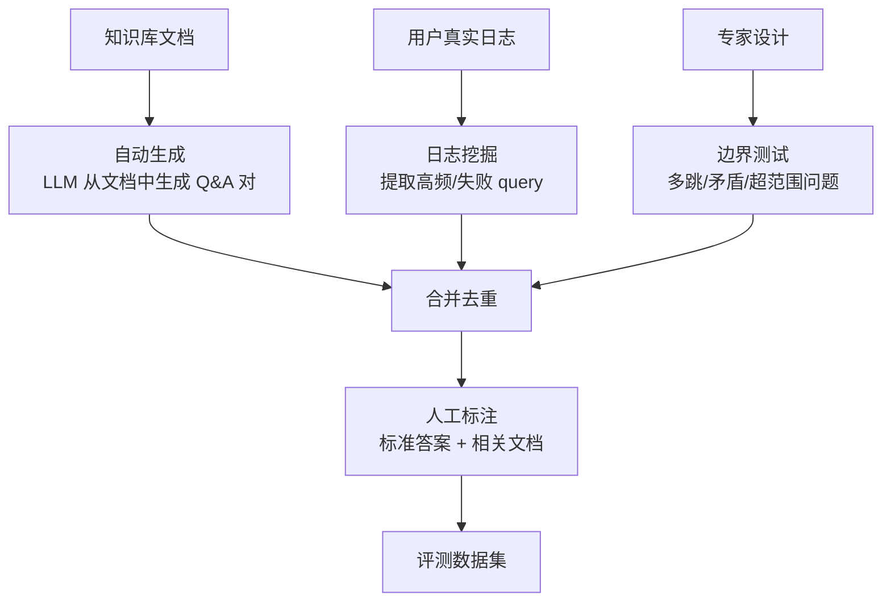
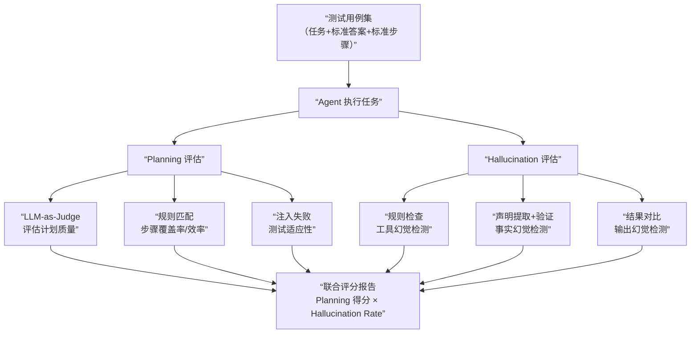
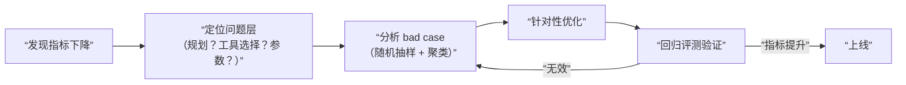
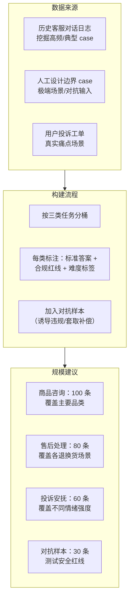

# 评估与全局观：怎么量化 Agent 好坏、落地最大挑战

评估和全局观是面试的最后一道关——通常出现在终面或 leader 面。前面的题考的是“你能不能做”，这类题考的是**“你有没有运营经验”和“你对这个领域有多深的思考”**。

---


## Agent 评测体系

### Q：如何量化评估一个上线的 Agent 好坏？除了准确率。

> 来源：腾讯 Agent 岗终面

**新手答**：“看任务成功率和用户满意度。”

**高手答**：

我们有一个**三维看板**：

1. **效能维度**：任务完成率、平均完成步数、单任务平均耗时与 Token 成本
2. **质量维度**：结果准确率（人工抽检）、用户满意度（评分）、一次解决率
3. **鲁棒性维度**：异常处理成功率、自修复触发率、平均无故障运行时间

最关键的是，每次失败都必须能**归因到具体模块**（是意图理解、规划、工具调用还是记忆的问题），并流入优化队列，驱动系统迭代。

**差距在哪**：新手的答案只有两个指标，且都是结果指标——只知道“好不好”，不知道“哪里不好”。高手的三维看板覆盖效能、质量、鲁棒性三个维度，更关键的是有**失败归因**机制——这才是驱动系统持续改进的关键。面试官考的是“你有没有运营线上系统的经验”。

---

### Q：在你看来，当前阻碍 Agent 大规模落地的最大挑战是什么？

> 来源：腾讯 Agent 岗终面

**新手答**：“成本高，效果不稳定。”

**高手答**：

是**“可控性”与“能力”的权衡困境**。

要它强大，就得给它灵活性和自主权，但这就引入了不可控风险。锁死它的行为，又容易把它变成流程固定的“智障脚本”。

我们的实践是：在核心业务逻辑层用**状态机保证主干流程正确**，在具体的“思考”环节给予模型在**安全沙盒内的最大自由**。同时，投入重兵建设评估、监控、干预体系，用大量测试用例和线上监控，像训警犬一样，明确告诉模型什么能做、什么绝不能做，逐步对齐。

**差距在哪**：新手的回答是事实陈述——“成本高、效果不稳定”谁都知道。高手把问题抽象成了一个**设计权衡**（可控性 vs 能力），并给出了自己的解法。面试官问这种开放题，考的不是“正确答案”（没有正确答案），而是“你对这个领域的思考深度”和“你有没有自己的方法论”。

---

### Q：你觉得 Agent 在线上最难监控的指标是什么？

> 来源：腾讯大模型应用开发二面

**新手答**：“延迟和成功率。”

**高手答**：

最难监控的其实不是延迟和成功率，这些都很容易打点。最难的是**“表面成功但实际决策错误”**——比如工具调用全成功，答案也返回了，但它选错了工具、用了次优证据，或者本来该追问却没追问。这类问题不会直接反映在现有监控指标上。

所以 Agent 监控不能只有系统指标，还要有**决策质量指标**：

```text
系统指标（容易）：延迟、成功率、错误率
决策指标（困难）：工具选择正确率、重复动作率、无效步数占比、
                 需要追问却未追问的比例、最终答案证据覆盖率
```

这些指标更难建，但如果没有，线上看起来一切正常，用户体验却会持续变差。

**差距在哪**：新手只关注系统指标——延迟和成功率容易打点但不够。高手指出了真正的难点是“决策质量指标”——表面成功但实际决策错误的情况在传统监控里看不到。面试官考的是你有没有 Agent 系统运营的实战经验，以及对“决策质量 vs 系统质量”的区分能力。

---

### Q：如何对 Agent 记忆系统的效果进行量化评估？

> 来源：后端 AI 八股 / Memory 系统

**新手答**：“看记忆召回率。”

**高手答**：

记忆系统的评估分**离线评估**和**在线评估**两大类：

**离线评估**（上线前，用标注数据集打分）：

| 指标 | 说明 |
|------|------|
| Precision / Recall | 检索结果的精确率和召回率 |
| ROUGE / F1 | 用记忆生成的答案与标准答案的文本重叠度 |
| 排序质量（MRR / NDCG） | 最相关的记忆是不是排在最前面 |
| 记忆利用率 | 被检索到的记忆有多少真正影响了模型输出 |
| 生成一致性 | 模型的回答和被引用记忆是否一致（有没有检索到了但忽略） |
| 错误记忆使用率 | 基于过期或错误记忆生成回答的比例 |

**在线评估**（上线后，用真实流量监控）：

| 指标 | 说明 |
|------|------|
| Task Success Rate | 有记忆参与的任务完成率 vs 无记忆的对照组 |
| User Engagement | 用户是否感知到 Agent “记得”之前的交互——用对话轮数、回访率衡量 |
| Negative Feedback Rate | 因记忆错误导致的用户负反馈比例 |
| 记忆命中率 | 多少比例的对话轮次用到了记忆 |
| A/B 测试 | 有记忆 vs 无记忆的回答质量对比 |

最容易被忽视的是**离线指标好但在线效果差**的情况——检索 Recall 很高，但模型可能检索到了正确记忆却完全忽略它，这在离线 Recall 上看不出来，只有在线的 Task Success Rate 和 Negative Feedback Rate 才能暴露。

**差距在哪**：新手只看检索维度。高手把评估拆成离线（Precision/Recall/ROUGE）和在线（Task Success Rate/Engagement/Negative Feedback）两大类，且指出”离线指标好不等于在线效果好”这个容易被忽视的盲区。面试官考的是你有没有端到端评估记忆系统的方法论。

---


## AI 工具与开发经验

### Q：你觉得 AI 工具最大的帮助场景是什么？

> 来源：腾讯 Agent 应用开发一面

**新手答**：“写代码快。”

**高手答**：

AI 工具最大的帮助不是“快”，而是**降低了探索未知领域的启动成本**。

具体来说有三个层次：
1. **信息密集型任务**：代码生成、文档撰写、数据清洗——这些任务的共性是“规则清晰但手动执行耗时”，AI 能把执行时间从小时级降到分钟级
2. **认知脚手架**：学习新框架、理解陌生代码库、快速做技术选型调研——AI 充当“即时可用的专家顾问”，把学习曲线压平
3. **思维外包**：把机械性的思维劳动（格式化、查 API 文档、写样板代码）交给 AI，人类专注在需要判断力和创造力的环节

最大的帮助场景是第二类——**让开发者有能力做以前不敢接的任务**。以前不懂前端的后端工程师不会碰 React，现在借助 AI 能快速搭出可用的界面。这是“能力边界扩展”，不只是“效率提升”。

**差距在哪**：新手只想到了效率。高手从信息密集、认知脚手架、思维外包三个层次分析，且指出最大价值是“能力边界扩展”。面试官考的是你对 AI 工具价值的思考深度。

---

### Q：有没有遇到过 AI 应用或者工具无法解决的场景？

> 来源：腾讯 Agent 应用开发一面

**新手答**：“复杂逻辑写不好。”

**高手答**：

AI 工具的能力边界主要在三类场景：

1. **需要深度业务上下文的决策**：AI 不了解你们团队的技术债、历史决策背景、线上事故教训。比如“这个字段为什么叫这个名字”——答案可能在半年前的一次会议记录里，不在代码中
2. **涉及跨系统状态一致性的操作**：AI 能帮你写代码，但不能帮你协调“改完数据库 schema 后同时更新下游三个服务的 proto 文件并通知对应负责人”——这类涉及组织协调的任务超出了工具能力
3. **需要对结果负责的高风险决策**：删除生产数据、修改支付逻辑、选择技术架构——这些决策的后果需要人承担，AI 可以提供选项和分析，但不能替你做最终判断

核心认知：AI 擅长“执行已定义的任务”，不擅长“定义任务本身”。**知道 AI 不能做什么，和知道它能做什么一样重要。**

**差距在哪**：新手用“复杂”一词含糊带过。高手从业务上下文、跨系统协调、高风险决策三个具体角度界定了 AI 的能力边界。面试官考的是你有没有对 AI 工具做过理性评估，而不是盲目吹捧。

---

### Q：你觉得 Agent 框架（如 Claude Code）还有哪些地方可以改进？

> 来源：腾讯 Agent 应用开发一面

**新手答**：“模型再聪明点就好了。”

**高手答**：

改进空间主要在三个方向：

1. **上下文管理的透明度**：当前大部分 Agent 框架的上下文窗口管理对用户是黑盒——什么时候压缩了、丢了什么信息、为什么突然“忘记”了之前的约定，用户感知不到。改进方向是**让上下文状态可视化、可干预**
2. **执行过程的可调试性**：Agent 做了 10 步操作，中间第 3 步选错了工具，但用户到第 10 步才发现结果不对。缺少的是**执行过程的 checkpoint 和回溯能力**——能回到第 3 步改个决策重新执行，而不是从头开始
3. **多模态和跨工具的协作**：目前大部分 Agent 是单模态文本为主，对图片、视频、音频的理解和操作能力有限。同时，不同工具之间的互操作性（MCP 在解决这个问题）还不够成熟

从工程角度看，最需要改进的是**可调试性**——Agent 犯错是常态，关键是犯错后能不能快速定位和修复。

**差距在哪**：新手把改进等同于“模型更强”。高手从上下文透明度、可调试性、多模态协作三个具体工程方向提出了改进意见。面试官考的是你对当前工具的批判性思考能力。

---

### Q：从开发者角度，做 Agent 最难的部分是什么？

> 来源：腾讯 Agent 应用开发一面

**新手答**：“让模型听话。”

**高手答**：

最难的是**在“灵活性”和“可控性”之间找到平衡点**。

给 Agent 足够的自主权，它能处理更复杂的任务，但也更容易跑偏、幻觉、死循环。锁死它的行为空间，任务能正确完成但只能处理预定义的简单场景。

具体来说有三个难点：

1. **状态管理**：Agent 执行多步任务时，如何保证中间状态不丢失、不污染、不矛盾？上下文窗口有限，又不能把所有信息都塞进去——这个“精准投喂信息”的工程是最耗时间的
2. **失败恢复**：Agent 不是一次就能做对的。真正的工程挑战是“做错了之后怎么恢复”——重试？回退？降级？不同类型的错误需要不同的恢复策略，而且这些策略不能让 Agent 自己决定
3. **评估困难**：传统软件有明确的对错判断，但 Agent 的输出是概率性的——“基本对”和“完全对”之间差的可能不是模型能力，而是 Prompt 里少了一句话。这让调试变得极其低效

本质上，做 Agent 最难的不是“让模型做事”，而是**把模型的不确定性关进工程的笼子里**。

**差距在哪**：新手用“不听话”概括了一切。高手从灵活性/可控性权衡出发，拆出了状态管理、失败恢复、评估困难三个具体难点。面试官考的是你有没有做过真实 Agent 开发的深度思考。

---


## RAG 与 Agent 评测指标

### Q：RAG 系统（如 oncall 机器人）的回答准确率怎么计算？用知识问答对比还是文档相似度？

> 来源：蚂蚁集团智能体与大模型应用二面

**新手答**：“人工看看对不对，算个比例。”

**高手答**：

oncall 机器人或 RAG 问答系统的准确率评估比“人工看”复杂得多，因为要区分**检索准确率**和**回答准确率**——检索对了但回答可能错，检索错了但回答可能蒙对。

**评估框架分两层**：

**1. 检索层评估（文档相似度方向）**——衡量“找的资料对不对”：

- **Recall@K**：正确文档是否在 top-K 召回结果中
- **Precision@K**：top-K 结果中有多少是真正相关的
- **MRR**：正确文档排在第几位

评估方式：构建标注集——`(query, ground_truth_docs)` 对，用标注文档和实际召回文档做匹配。

**2. 回答层评估（知识问答对比方向）**——衡量“最终回答对不对”：

- **Exact Match / F1**：回答和标准答案的文本匹配度
- **LLM-as-Judge**：用另一个大模型评分（1-5 分），判断回答的准确性、完整性、相关性
- **Faithfulness**：回答是否忠实于检索到的文档（有没有编造文档里没有的内容）

**用哪种方法，取决于评估目标**：

| 评估目标 | 方法 | 适用场景 |
|---------|------|---------|
| 优化检索管线 | 文档相似度 / Recall / MRR | 调 Embedding、ReRank、chunk 策略时 |
| 评估端到端效果 | 知识问答对比 / LLM-as-Judge | 上线前验收、A/B 测试 |
| 监控线上质量 | 用户反馈率 + 抽样人工评估 | 日常运营 |

**实际生产中的组合策略**：

1. **离线评估**：用标注集同时跑检索指标和回答指标，定位问题出在检索还是生成
2. **在线评估**：埋点用户行为（点赞/点踩/追问率）作为隐式反馈，辅以每日抽样人工评估
3. **归因分析**：回答错误时，先查检索结果——如果检索到了正确文档但回答仍然错，说明是生成环节的问题；如果根本没检索到正确文档，说明是检索环节的问题

**差距在哪**：新手用“人工看”一刀切。高手把评估拆成检索层和回答层两个维度，且说清了不同评估目标对应不同方法，最后给出了离线 + 在线 + 归因的组合策略。面试官考的是你有没有系统性评估 RAG 系统的方法论——“对不对”是表象，“哪里不对、为什么不对”才是核心。

---

### Q：你会怎么给 Agent 建立评测体系？只看最终成功率为什么不够？

> 来源：Agent 开发面试 30 题

**新手答**：“设计一批测试用例，看通过率。”

**高手答**：

只看最终成功率有两个致命问题：① 成功率 80% 告诉你“有 20% 失败了”，但不告诉你**为什么失败**；② 两个 Agent 都是 80% 成功率，但一个平均 3 步完成、另一个平均 15 步完成——体验天差地别。

完整的评测体系要覆盖**四个维度**：

| 维度 | 核心指标 | 衡量的是什么 |
|------|---------|------------|
| **效果** | 任务成功率、答案准确率、用户满意度 | Agent 能不能做对 |
| **效率** | 平均步数、token 消耗、端到端延迟 | Agent 做对的成本 |
| **鲁棒性** | 异常恢复率、对抗输入通过率、长任务完成率 | Agent 在边界条件下的表现 |
| **过程质量** | 工具选择正确率、无效步数占比、重复动作率 | Agent 的决策过程是否合理 |

**过程质量是最容易被忽视但最有价值的维度**——即使最终成功了，如果中间绕了一大圈、调了三次错误工具才蒙对，说明系统有隐患。

**评测集设计**：

```text
基础用例（60%）：覆盖核心功能的标准场景
边界用例（20%）：缺参数、矛盾输入、超长上下文
对抗用例（10%）：prompt injection、故意误导
回归用例（10%）：历史 bug 对应的测试用例
```

**评测频率**：每次模型/Prompt/工具变更后必须跑全量评测，日常用核心用例做冒烟测试。

**调优实战：怎么从评测结果驱动改进？**

评测不是跑个分就完了，关键是**从评测结果中定位瓶颈、制定优化方案、验证改进效果**的闭环。面试官经常追问”讲一个调优 case”，回答结构应该是：

```text
发现问题 → 归因分析 → 优化方案 → 效果验证

例：工具选择准确率从评测中发现只有 65%
  → 归因：工具描述太相似，模型无法区分”搜索文档”和”搜索知识库”
  → 优化：重写工具描述，加入使用场景和输入输出示例
  → 验证：工具选择准确率提升到 88%，端到端成功率从 72% 提升到 85%
```

评测集的构建同样重要——好的评测集不是越大越好，而是要覆盖核心场景、边界条件、已知失败模式。每次修复一个线上问题，都应该把对应的 case 加入回归评测集。

**差距在哪**：新手只看成功率。高手建立了四维评测体系（效果/效率/鲁棒性/过程质量），且指出过程质量是最容易被忽视的维度。面试官考的是你有没有”评测驱动优化”的工程方法论。

---

### Q：如果线上反馈“这个 Agent 有时候很好，有时候很差”，你第一步会看什么指标和日志？

> 来源：Agent 开发面试 30 题

**新手答**：“看看是不是模型不稳定。”

**高手答**：

“有时好有时差”说明不是系统性问题，而是**特定条件下触发的问题**。排查思路是**缩小范围 → 找到分界线 → 定位根因**。

**第一步：看分布，不看平均**

把最近 N 天的请求按成功/失败分两组，对比以下维度的分布差异：

| 对比维度 | 怎么看 | 可能发现 |
|---------|--------|---------|
| 输入长度 | 失败组的 query 是不是更长/更短 | 上下文截断导致信息丢失 |
| 任务类型 | 失败集中在哪类任务 | 某类工具或 Prompt 有缺陷 |
| 执行步数 | 失败组是不是步数更多 | 长链路累积错误 |
| 使用的工具 | 失败组集中调用了哪个工具 | 某个工具不稳定 |
| 时间段 | 失败集中在某个时间段 | 外部依赖在该时段不稳定 |

**第二步：看执行链路日志**

从失败案例中抽 5-10 个典型 case，逐步看执行链路：

```text
用户输入 → 意图识别结果 → 规划的步骤 → 每步的工具调用和返回 → 最终输出
```

找到**第一个出错的环节**——是意图理解错了？规划有遗漏？工具返回异常？还是最终生成时忽略了关键信息？

**第三步：看“成功但低质量”的灰色地带**

不只看失败，还要看**用户评价低但系统判定成功的**请求——这些是“表面成功但体验差”的隐藏问题。

**差距在哪**：新手直觉是“模型不稳定”——这等于没排查。高手有系统性的排查方法论：先看分布找分界线、再看链路定位环节、最后查灰色地带。面试官考的是你排查线上问题时有没有数据驱动的方法。

---


## 落地风险与行业趋势

### Q：要把 Agent 真正上线到生产环境，你认为最容易被低估的三个风险点是什么？

> 来源：Agent 开发面试 30 题

**新手答**：“成本、延迟、准确率。”

**高手答**：

成本、延迟、准确率是**所有人都知道的风险**，恰恰因为人人都知道，反而不会被低估。真正被低估的风险是那些**在 Demo 阶段看不到、上线后才暴露**的：

**1. 长尾输入的不可控行为**

测试集覆盖不了所有用户输入。总有 5% 的用户会问出你从没想过的问题——模型可能给出荒谬的回答、陷入死循环、或者触发不该调用的工具。长尾问题的危害不是频率高，而是**一个恶性案例就能毁掉产品口碑**。

防范：上线初期必须有**人工审核 + 实时告警**，对异常执行模式（步数过多、工具调用异常、输出过长）即时报警。

**2. 状态漂移——系统跑着跑着就“变味”了**

模型版本更新、外部 API 返回格式微调、知识库内容更新——任何一个上游变化都可能让 Agent 行为悄悄偏移。不像传统软件的 bug 有明确的报错，状态漂移是**渐变的、静默的**，可能跑了两周才有人发现“最近回答质量好像下降了”。

防范：建立**持续评测管线**——每天自动跑核心评测集，指标下降立刻告警，不等用户投诉。

**3. 隐式依赖链断裂**

Agent 的正确运行依赖一条长长的隐式链路：模型 API 稳定 → Embedding 服务可用 → 向量库正常 → 外部工具 API 不变 → 知识库内容准确。任何一环断裂都会导致问题，但**故障表现往往和根因相距甚远**——知识库更新了一个错误文档，表现出来是“Agent 给了错误建议”，中间隔了检索、排序、生成三个环节。

防范：对所有外部依赖做**健康检查和变更监控**，知识库更新后自动触发回归测试。

**差距在哪**：新手列的都是显而易见的风险。高手指出了三个“Demo 阶段看不到、上线后才暴露”的隐性风险——长尾输入、状态漂移、隐式依赖链断裂，且每个都有具体的防范方案。面试官考的是你有没有把 Agent 推到生产环境的实战经验。

---

### Q：2026 年做 Agent 应用开发，跟去年相比最大的变化是什么？

> 来源：蚂蚁集团 Agent 开发二面

**新手答**：“模型更强了，能做的事更多了。”

**高手答**：

模型变强是基础事实，但**真正影响开发方式的变化**不在模型本身，而在工具链、架构范式和工程实践三个层面：

**1. 从“Prompt 工程”到“上下文工程”**

去年做 Agent，核心工作是调 Prompt——怎么写 System Prompt、怎么做 few-shot、怎么做 chain-of-thought。2026 年，随着模型能力提升，Prompt 的精细调优变得没那么关键了。真正的瓶颈变成了**上下文工程**——怎么在有限窗口里给模型恰好的信息：项目结构索引、动态工具加载、分层记忆召回、操作后状态刷新。

**2. 从“单 Agent 做所有事”到“协议化的多 Agent 协作”**

去年的多 Agent 还停留在“自己写消息传递逻辑”的阶段。2026 年 MCP（工具协议）和 A2A（Agent 间协议）逐步标准化，Agent 之间的协作从“每次重新造轮子”变成了“基于协议即插即用”。这改变了架构思维——从“设计一个万能 Agent”变成“设计一组专业 Agent + 标准化的协作协议”。

**3. 从“Demo 驱动”到“评测驱动”**

去年很多团队做 Agent 是“先做 Demo，效果好就上线”。2026 年的共识是：没有评测体系的 Agent 不能上线。持续评测管线（自动跑评测集、指标监控、回归检测）成了标配，Agent 开发的一半时间花在评测和可观测性上。

**4. 从“纯 Agent”到“Workflow + Agent 节点”混合架构**

去年有很多“纯 Agent”尝试——让模型全程自主决策。实践证明不可行。2026 年主流方案是确定性环节用 Workflow 控制、不确定性环节嵌入 Agent 节点。这不是 Agent 的退步，而是**找到了 Agent 在生产系统中的正确位置**。

**差距在哪**：新手只看到了“模型更强”。高手从上下文工程、协议化协作、评测驱动、混合架构四个维度说明了开发方式的本质变化——不是“能做更多”，而是“怎么做变了”。面试官考的是你对 Agent 技术发展的结构化观察能力。

---

### Q：了解最近 AI 的新方向吗？

> 来源：蚂蚁集团一面

**新手答**：“大模型越来越强了，能写代码能画图。”

**高手答**：

2025-2026 年 AI 领域有几个真正改变开发范式的方向，不只是“模型更强”：

**1. 推理模型（Reasoning Models）**

以 OpenAI o1/o3、DeepSeek-R1 为代表。核心变化是模型在输出答案前会做**长链推理（Chain of Thought）**，用更多的推理 token 换更高的准确率。这不是简单的“思考更久”——推理模型在数学、代码、逻辑推理等需要多步推导的任务上有质的飞跃。

对开发者的影响：以前靠精心设计 Prompt 引导模型一步步思考，现在模型自己会做——**推理能力从 Prompt 工程转移到了模型内部**。

**2. Agent 原生应用**

从“给现有产品加 AI 功能”变成“围绕 Agent 能力设计整个产品”。代表产品：Claude Code（AI 驱动的开发环境）、Devin（AI 软件工程师）、各类 AI 数据分析工具。

核心转变：用户不再是“输入指令 → 获取结果”的单轮交互，而是“委托任务 → Agent 自主规划执行 → 人类监督审核”的协作模式。

**3. 上下文工程取代 Prompt 工程**

模型能力提升后，Prompt 的精细调优变得不那么关键。真正的瓶颈变成**怎么在有限窗口里给模型恰好的信息**——动态工具加载、分层记忆召回、渐进式披露。上下文工程是 2026 年 Agent 开发的核心技术栈。

**4. 协议标准化（MCP + A2A）**

Agent 生态从“各家自己造轮子”走向协议标准化。MCP 解决了 Agent 到工具的连接标准，A2A 解决了 Agent 之间的通信标准。这意味着**Agent 组件变得可复用、可互操作**——类似 Web 时代 HTTP 协议的意义。

**5. 端侧 AI 和混合推理**

3B 以下的小模型在端侧（手机、笔记本）可用后，出现了**云端大模型 + 端侧小模型混合推理**的架构——简单任务端侧处理（低延迟、隐私保护），复杂任务上传云端。这改变了 AI 应用的部署架构。

**差距在哪**：新手只感知到“模型更强”。高手从推理模型、Agent 原生应用、上下文工程、协议标准化、端侧混合推理五个方向做了结构化梳理，每个方向都说清了对开发者的实际影响。面试官用这道开放题考的是你的**行业视野和技术敏感度**——不是背新闻，而是能从趋势中提炼出对自己工作的影响。

---


## 评测方案设计与实践

### Q：RAG 系统如何评测？有哪些评测维度和指标？评测数据集怎么构建？

> 来源：快手 AI Agent 开发一面

**新手答**：“看回答准不准。”

**高手答**：

RAG 评测不能只看最终回答——需要**分阶段评估**，才能定位问题出在哪个环节。

**评测维度和指标**：

| 评测阶段 | 维度 | 核心指标 | 说明 |
|---------|------|---------|------|
| 检索质量 | 召回率 | Recall@K | 正确文档是否进入了候选集 |
| 检索质量 | 精确率 | Precision@K | 候选集中相关文档的占比 |
| 检索质量 | 排序质量 | MRR / NDCG | 正确文档是否排在前面 |
| 生成质量 | 忠实度 | Faithfulness | 回答是否忠于检索到的文档（不编造） |
| 生成质量 | 相关性 | Answer Relevancy | 回答是否切题 |
| 生成质量 | 完整性 | Completeness | 回答是否覆盖了问题的所有方面 |
| 端到端 | 准确率 | Correctness | 最终回答和标准答案的一致性 |
| 端到端 | 拒答率 | Rejection Rate | 知识库无答案时，模型是否正确拒答而非编造 |

**评测框架**：

```text
RAGAS：自动化评测框架，内置 Faithfulness、Answer Relevancy 等指标
TruLens：支持自定义评测函数，可追踪 RAG 管线每个环节
DeepEval：开源评测框架，支持 LLM-as-Judge 模式
```

**评测数据集的构建**：



**高质量评测数据的要求**：

1. **覆盖多种问题类型**：
   - 单跳事实题（答案在一个文档中）
   - 多跳推理题（需要关联多个文档）
   - 对比题（两个实体的异同）
   - 超范围题（知识库中没有答案，测试拒答能力）
   - 时效性题（信息可能过期）

2. **标注内容**：每条数据包含 query、标准答案、相关文档列表（ground truth）、难度标签

3. **数据规模**：通常 200-500 条覆盖主要场景即可，关键是**多样性而非数量**

4. **持续更新**：知识库更新后，评测集也要同步更新，否则评测结果不反映真实表现

**差距在哪**：新手只看”准不准”一个维度。高手把评测拆成检索和生成两个阶段，每个阶段有独立的指标体系，且说清了评测数据集的构建方法和质量要求。面试官考的是你有没有完整的 RAG 质量保障体系——不是”上线看看效果”，而是有离线评测、有基准数据、有分阶段归因。

**追问：评测集 100 条够吗？分布怎么分析？baseline 用什么？**

> 来源：字节 AI 一面（RAG 项目深挖）

100 条评测集的三个致命问题：

1. **统计显著性不足**：100 条样本下，Recall@5 从 0.81 波动到 0.75 可能只是随机误差，你无法区分”真的变差了”和”评测集太小导致的噪声”
2. **分布偏差**：如果 100 条中 80 条是简单的单跳事实题，Recall@5 = 0.81 不代表系统在多跳推理题上也能达到同样水平
3. **无 baseline 对照**：0.81 是好是坏？没有参照系就是一个孤立数字

**评测集规模的工程标准**：

| 场景规模 | 最低评测集 | 构建方式 |
|---------|-----------|---------|
| PoC / Demo | 50-100 条 | 手工构造即可 |
| 内部工具上线 | 200-500 条 | 自动生成 + 人工审核 |
| 面向用户产品 | 1000+ 条 | 真实日志挖掘 + 专家标注 + 对抗样本 |

**分布分析必做的三件事**：
- **按 query 类型分层**：单跳事实 / 多跳推理 / 对比 / 超范围各占多少，分层计算指标
- **按难度分级**：简单（答案在单段落内）/ 中等（需跨段落）/ 困难（需跨文档）
- **按文档来源分布**：确保评测集覆盖知识库的各个领域，而非集中在少数文档

**baseline 设计**：

| Baseline | 作用 | 实现 |
|----------|------|------|
| BM25 纯关键词检索 | 检验向量检索是否比传统检索好 | 同样的 query 走 BM25 |
| 纯 LLM 无检索 | 检验 RAG 是否真的有价值 | 直接问模型，不给文档 |
| 人类表现 | 性能上限参照 | 让领域专家回答同样的问题 |

有了 baseline，”Recall@5 = 0.81”才有意义——“比 BM25 的 0.62 高 30%，但离人类的 0.95 还有差距”。

---

### Q：如何衡量 Agent 的 Planning 能力 vs Hallucination Rate？请列举具体的量化评估指标或自动化评估框架

> 来源：淘天 AI Agent 一面

**新手答**：”看任务成功率就行了。”

**高手答**：

Planning 能力和 Hallucination Rate 必须**同时评估**，因为它们之间存在本质张力——规划能力越强意味着模型越敢自主决策，但自主决策越多，幻觉风险越高。只看成功率会掩盖这个矛盾：一次”碰巧成功”的幻觉规划和一次”系统性正确”的规划，在成功率上没有区别。

**Planning 能力的量化指标**：

| 指标 | 定义 | 评估方法 |
|------|------|---------|
| 计划完整度（Plan Completeness） | 生成的计划是否覆盖了任务所需的所有关键步骤 | 与标准步骤列表对比，计算覆盖率 |
| 步骤正确率（Step Correctness） | 每一步的动作和参数是否正确 | 逐步对比标准答案，人工或 LLM 评判 |
| 工具选择准确率（Tool Selection Accuracy） | 是否选择了最合适的工具 | 与标注的最优工具选择对比 |
| 计划效率（Plan Efficiency） | 实际步数 vs 最优步数 | 比值越接近 1 越好，>2 说明有冗余 |
| 计划适应性（Plan Adaptability） | 遇到工具失败或意外结果时能否调整计划 | 故意注入失败，观察恢复行为 |
| 子目标分解质量 | 复杂任务是否被合理拆解为可执行的子任务 | LLM-as-Judge 评分（1-5 分） |

**Hallucination Rate 的量化指标**：

| 指标 | 定义 | 评估方法 |
|------|------|---------|
| 忠实度（Faithfulness） | 回答是否忠实于检索到的证据 | RAGAS Faithfulness 指标，或人工标注 |
| 事实基础率（Factual Grounding Rate） | 输出中有多少比例的陈述可以追溯到可靠来源 | 逐句标注来源，计算有来源覆盖的比例 |
| 无依据声明率（Unsupported Claim Ratio） | 输出中无法在上下文或知识库中找到支撑的声明占比 | 自动提取声明 → 逐条验证 → 计算比例 |
| 工具幻觉率（Tool Hallucination Rate） | 调用不存在的工具或使用不合法参数的比例 | 规则检查：工具名 ∈ 可用列表？参数符合 schema？ |
| 结果幻觉率 | 声称工具返回了某结果但实际返回不同 | 对比模型声称的工具结果与实际工具返回值 |

**核心矛盾：Planning 越强，Hallucination 风险越高**

```text
Planning 自主性光谱：
低自主 ──────────────────────────── 高自主
固定流程    受限规划    自由规划    完全自主
幻觉风险低              幻觉风险高
能力上限低              能力上限高

→ 评估不能只看一端，要画出”能力-幻觉”的帕累托曲线
```

所以评估框架必须同时覆盖两个维度，生成类似这样的联合报告：

```text
Agent A：Planning 得分 82，Hallucination Rate 15% → 高能力、中风险
Agent B：Planning 得分 78，Hallucination Rate 5%  → 中能力、低风险
Agent C：Planning 得分 90，Hallucination Rate 30% → 高能力、高风险（不可上线）
```

**自动化评估框架对比**：

| 框架 | 核心能力 | Planning 评估 | Hallucination 评估 |
|------|---------|-------------|-------------------|
| RAGAS | RAG 管线自动评测 | 不直接支持 | Faithfulness、Answer Relevancy |
| AgentBench | Agent 多场景基准测试 | 任务完成率、步骤效率 | 间接（通过错误分析） |
| ToolBench | 工具调用能力评测 | 工具选择准确率、调用链正确性 | 工具幻觉率 |
| 自建评估管线 | 定制化全维度评估 | LLM-as-Judge + 规则打分 | 声明提取 + 来源验证 |

**自建管线的推荐做法**：



LLM-as-Judge 用于评估 Planning 质量（计划是否合理、步骤是否冗余），规则检查用于 Hallucination 检测（工具名是否存在、参数是否合法、引用的事实是否有来源）。两类评估互补：LLM 擅长语义判断，规则擅长精确校验。

**差距在哪**：新手只看”任务成功率”——这是一个结果指标，无法区分”系统性正确”和”碰巧成功”，更无法暴露潜在的幻觉风险。高手同时评估 Planning 能力和 Hallucination Rate，认识到两者之间的张力关系，并用多框架组合（LLM-as-Judge + 规则检查 + 注入测试）构建完整的评估管线。面试官考的是你有没有”评估即工程”的思维——不是跑一个 benchmark 就完了，而是要建一套持续运行的评估体系。

---

### Q：Agent 的端到端成功率和工具误调用率怎么量化？怎么改进？

> 来源：腾讯 AI 应用开发二面

**新手答**：”看任务完成了没有，完成了就算成功。”

**高手答**：

“完成了没有”是最粗的指标，**无法定位问题出在哪个环节**。量化需要拆层，改进需要闭环。

**端到端成功率的分层量化**：

| 指标 | 定义 | 公式 |
|------|------|------|
| 端到端成功率 | 任务从输入到输出完全正确的比例 | 成功任务数 / 总任务数 |
| 规划成功率 | 模型生成的执行计划逻辑正确的比例 | 计划合理数 / 总规划数 |
| 工具选择准确率 | 选对了工具的比例 | 正确选择数 / 总选择数 |
| 工具调用成功率 | 工具调用返回有效结果的比例 | 有效返回数 / 总调用数 |
| 回复质量 | 最终回复满足用户意图的比例 | 满意回复数 / 总回复数（需人工/LLM 评估） |

**工具误调用率的细分**：

工具误调用不是一个单一指标，需要区分三种错误：

```text
误选工具（选了不该选的）→ 看工具选择 Precision
漏选工具（该选的没选）→ 看工具选择 Recall
参数错误（选对了但参数传错）→ 看参数校验通过率
```

**量化工具链**：

- **日志基建**：每一步（意图识别 → 规划 → 工具选择 → 工具执行 → 结果生成）都记结构化日志，带 trace_id 串联
- **离线评估**：用标注好的评测集定期跑回归，计算各层指标
- **线上监控**：用 LangSmith / Langfuse / 自建 dashboard 实时追踪成功率、延迟、token 消耗

**改进闭环**：



常见优化手段：
- **工具选择准确率低** → 重写工具描述（加使用场景、输入输出示例）、减少工具数量（合并相似工具）
- **参数错误率高** → 参数 schema 加 enum 约束、在 System Prompt 中加参数填写示例
- **规划成功率低** → 拆分复杂任务（让模型先生成计划再执行）、加 Few-shot 示例

**差距在哪**：新手只看一个”成功率”数字，出了问题不知道该查哪。高手把端到端成功率拆成规划/工具选择/工具执行/回复质量四层，把工具误调用拆成误选/漏选/参数错误三类，且给出了从日志基建到改进闭环的完整量化方案。面试官考的是你有没有”可观测 + 可归因 + 可改进”的 Agent 评测方法论。

---

### Q：设计一个电商客服 Agent 的评测方案——商品咨询、售后处理、投诉安抚三类任务如何分别评估？

> 来源：淘天 AI Agent 一面（场景题）

**新手答**：“看客服满意度评分。”

**高手答**：

电商客服 Agent 的三类任务——商品咨询、售后处理、投诉安抚——**评测维度和指标必须分开设计**，因为它们的成功标准完全不同。

**分任务评测维度**：

| 维度 | 商品咨询 | 售后处理 | 投诉安抚 |
|------|---------|---------|---------|
| 核心目标 | 回答准确、促进转化 | 问题解决、流程合规 | 情绪缓解、用户留存 |
| 准确性指标 | 商品信息正确率（价格/规格/库存） | 政策引用正确率（退换货规则） | 情绪识别准确率 |
| 效率指标 | 平均响应时间、对话轮数 | 问题解决时长、一次解决率 | 情绪转正轮数 |
| 质量指标 | 推荐相关度、交叉销售率 | 解决方案合理性、用户确认率 | 共情表达质量、升级率（越低越好） |
| 安全指标 | 不承诺虚假信息 | 不违反退换货政策 | 不激化矛盾、不做超权限承诺 |

**投诉安抚场景的特殊指标设计**——用户满意度很难直接衡量，需要**代理指标**：

| 代理指标 | 如何采集 | 为什么能反映满意度 |
|---------|---------|------------------|
| 情绪转正率 | 对话开始和结束时的情绪分类（NLP 情感分析） | 从负面转为中性/正面说明安抚有效 |
| 情绪转正轮数 | 首次情绪转正时的对话轮次 | 轮数越少说明安抚效率越高 |
| 升级人工率 | 安抚后仍要求转人工的比例 | 越低说明 Agent 安抚能力越强 |
| 复访投诉率 | 同一用户 7 天内再次投诉的比例 | 低说明问题真正被解决，不是敷衍过去的 |
| 主动评分率 | 用户主动给好评的比例（非弹窗请求） | 主动好评比被动评分更真实 |
| 会话完成率 | 用户在对话中途离开的比例 | 高离开率说明用户对 Agent 回复不满 |

**评测数据集构建**：



**判定 Agent 好坏的综合评分**：

不能用一个分数定生死——三类任务加权，且有**一票否决**机制：

```text
综合得分 = 0.4 × 商品咨询得分 + 0.3 × 售后处理得分 + 0.3 × 投诉安抚得分

一票否决项（触发任何一项直接判定不合格）：
  - 承诺虚假商品信息（价格/功能/库存）
  - 违反退换货政策做出超权限承诺
  - 回复激化用户情绪（情绪恶化率 > 5%）
  - 泄露其他用户信息
```

**差距在哪**：新手只想到一个”满意度”数字。高手把三类任务的评测维度完全拆开——商品咨询看准确性和转化，售后看解决率和合规，投诉安抚用情绪转正率等代理指标替代难以直接衡量的满意度。面试官用这个场景题考的是你能不能把抽象的”Agent 评测”落地到具体业务场景中，且能设计出可量化、可采集的指标体系。

---

### Q：Ragas 评测框架是什么？Answer Relevance 偏低时，怎么区分是检索问题还是模型问题？

> 来源：蚂蚁 AI应用开发 二面

**新手答**：”Ragas 是评测 RAG 的工具，Answer Relevance 低就是检索不好。”

**高手答**：

**Ragas 框架**：一个专门评测 RAG 系统的开源框架，核心是把端到端的评测拆解成**多个独立维度**，每个维度单独打分，这样出了问题能精准定位到哪个环节。

核心指标：

| 指标 | 评测什么 | 不依赖 |
|------|---------|-------|
| Faithfulness（忠实度） | 回答是否基于检索到的上下文，而非编造 | 不依赖标注答案 |
| Answer Relevance（答案相关性） | 回答是否切题、是否回答了用户的问题 | 不依赖检索结果 |
| Context Precision（上下文精度） | 检索到的内容中，相关内容排在前面的比例 | 需要标注答案 |
| Context Recall（上下文召回） | 回答所需的信息是否都被检索到了 | 需要标注答案 |

**Answer Relevance 偏低时的诊断方法**：

Answer Relevance 低有两种可能：检索给了错误的上下文（模型”巧妇难为无米之炊”），或者检索正确但模型理解/表达能力不足。区分方法：

**1. 交叉检验法**：固定相同的检索结果，分别用当前模型和一个已知强模型（如 GPT-4）生成回答。如果强模型的 Answer Relevance 显著更高 → 当前模型能力不足。如果强模型也低 → 检索问题。

**2. 指标联动分析**：
- Context Recall 低 + Answer Relevance 低 → 检索没有找到相关文档，模型无法回答 → **检索问题**
- Context Recall 高 + Faithfulness 高 + Answer Relevance 低 → 检索结果正确且模型忠实引用了，但回答方式不切题 → **模型理解/表达问题**
- Context Precision 低 + Answer Relevance 低 → 检索结果中噪声太多，模型被无关信息干扰 → **检索排序问题**

**3. 人工抽样**：随机抽取 20-30 个低分 case，人工判断检索结果和模型回答各自的质量。自动化指标是辅助，人工抽样是最终确认。

**差距在哪**：新手直接把 Answer Relevance 低归因于检索——这是最常见的误判。高手用交叉检验和指标联动两种方法精准区分了检索质量和模型能力的影响边界。面试官考的是你有没有系统性的 RAG 评测和问题诊断能力。

**追问：Ragas 的 Context Precision 过低，怎么优化？**

> 来源：阿里淘天 AI应用开发一面

Context Precision 衡量的是**检索结果中相关文档的排位**——即使召回了正确文档，如果排在第 4、5 位而噪声文档排在前面，Context Precision 也会很低。

**优化的三个方向**：

| 方向 | 具体方案 | 效果 |
|------|---------|------|
| 检索排序 | 引入 Rerank 模型（Cross-Encoder）对召回结果重排序 | 直接提升相关文档排位 |
| 召回质量 | 优化 query 改写 + 混合检索（向量+BM25），减少噪声召回 | 从源头减少不相关文档 |
| 索引质量 | 改进分块策略（避免语义碎片化）+ 清洗知识库噪声文档 | 底层数据质量决定上限 |

**诊断优先级**：先看 Context Recall——如果 Recall 也低，说明正确文档根本没进候选集，优化召回策略优先；如果 Recall 高但 Precision 低，说明正确文档进了但排位差，加 Rerank 即可。

---

### Q：怎么理解 Vibe Coding？你有哪些实践经验？

> 来源：蚂蚁 AI应用开发 二面

**新手答**：”就是用 AI 写代码，说需求然后让模型生成。”

**高手答**：

Vibe Coding 是 Andrej Karpathy 提出的概念——开发者用自然语言描述意图，AI 生成代码，开发者不逐行审查而是直接运行看效果，凭”感觉”（vibe）判断代码是否正确。核心特征：**开发者从”写代码的人”变成”描述需求+验证结果的人”**。

**适用场景和边界**：

| 场景 | 适合 Vibe Coding | 原因 |
|------|----------------|------|
| 原型验证 / 脚本 | 适合 | 快速试错，错了重来成本低 |
| UI / 前端样式 | 适合 | 视觉验证直观，改起来快 |
| 数据处理脚本 | 适合 | 输入输出明确，结果可验证 |
| 核心业务逻辑 | **不适合** | 错误难发现，后果严重 |
| 安全相关代码 | **不适合** | “看起来能跑”不等于安全 |

**实践经验**：

1. **小步快跑**：不要一次描述完整需求，而是分步骤——先搭框架 → 再填功能 → 最后优化。每步验证后再进入下一步
2. **验证比生成更重要**：AI 生成代码很快，但验证代码是否正确才是耗时的部分。好的 Vibe Coding 实践是花 20% 时间描述需求，80% 时间验证和调试
3. **知道什么时候停**：Vibe Coding 的效率在简单任务上极高，但在复杂逻辑上迅速下降。当你发现自己花更多时间解释 bug 而非描述需求时，就该切回手写代码

**对 Agent 开发的启示**：Vibe Coding 本质上就是人类使用了一个”代码生成 Agent”——用户用 NL 描述意图，Agent 调用代码生成工具执行。这个体验的好坏直接反映了 Agent 系统的核心能力：意图理解、工具调用、结果验证。

**差距在哪**：新手把 Vibe Coding 等同于”用 AI 写代码”。高手理解它的本质（角色转变：写代码→验证结果），知道适用边界（原型适合、核心逻辑不适合），且有具体的实践方法论。面试官考的是你对 AI 辅助开发的思考深度——不是”用没用过”，而是”怎么用、什么时候不用”。

---

### Q：通过什么方式去验证 Skill 的提升效果，指标是什么？

> 来源：美团/食杂后端一面

**新手答**：“看用户反馈好不好，或者看任务成功率有没有提升。”

**高手答**：

验证 Skill 效果需要**分层度量 + 对照实验**：

**1. 指标体系**

| 层级 | 指标 | 含义 |
|------|------|------|
| 触发层 | 触发准确率 | 该触发时触发、不该触发时不触发 |
| 执行层 | 端到端成功率 | Skill 被调用后任务完成的比例 |
| 效率层 | 步数 / Token 消耗 | 有 Skill vs 无 Skill 的资源对比 |
| 质量层 | 输出一致性 | 同类任务多次执行结果的稳定程度 |

**2. 评测方法**

- **A/B 对照**：同一批 eval case，分别在有/无该 Skill 的条件下跑，对比成功率和步数
- **回归检测**：新增 Skill 后原有能力是否退化（跑全量 eval set）
- **边界测试**：故意给模糊/交叉意图，看 Skill 是否误触发

**3. 实战经验**

Skill 的效果不是线性的——简单任务提升不大，复杂重复任务提升显著。所以评测集要**按任务复杂度分层**，分别算各层提升比例，避免被简单任务的高基线稀释了真正的收益。

**差距在哪**：新手只看一个结果指标。高手分了触发/执行/效率/质量四层，且有对照实验设计和回归检测意识。面试官考的是你对“如何科学度量一个能力模块效果”的工程化思维。

---

## 这类题的答题模式

评估与全局观题的核心是**结构化思维 + 独立见解**：

```text
1. 评估不是一个数字，是一套多维指标体系
2. 必须有失败归因机制——"知道哪里不好"比"知道好不好"更重要
3. 开放题要抽象出核心矛盾，不要只陈述事实
4. 给出你自己的解法和方法论，而不是复述行业共识
```

面试官听到“成功率和满意度”就知道你没运营过线上系统。听到三维看板、失败归因队列、可控性 vs 能力的权衡框架，才会觉得你不只是写代码，还能做决策。

---

## 附：看完这 5 篇，你应该注意到的答题模式

所有维度的高手答都有几个共同特征：

| 特征 | 说明 |
|---|---|
| **有判断标准** | 不说“看情况”，而是给出具体的判断维度 |
| **有层次结构** | 回答是分层的（三层防线、三段记忆、三维看板） |
| **有业务场景** | 每个方案都绑定了具体的业务案例 |
| **有工程经验** | 提到了“我们的做法”——不是背的，是做过的 |
| **有权衡意识** | 不只说优点，也说代价和适用边界 |

面试官要的不是“你知道多少概念”，而是“你能不能在真实约束下做出合理决策”。

下一篇建议继续看：

- [多智能体协作：角色分工、通信机制与冲突仲裁](../06-multi-agent-collab/index.html)
