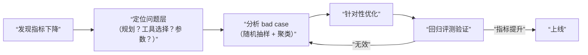
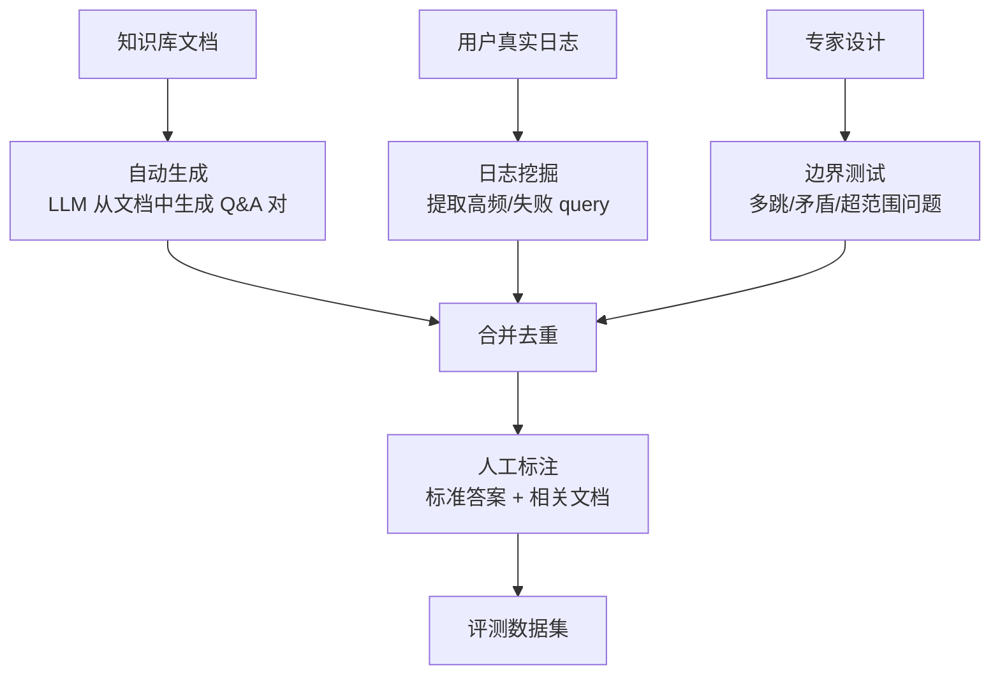
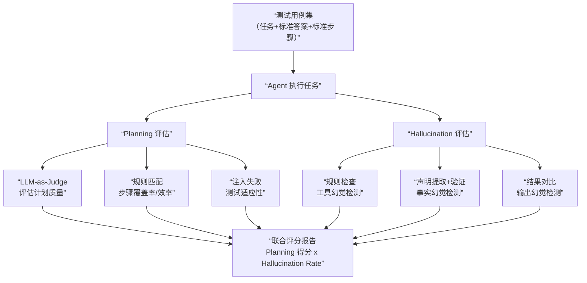
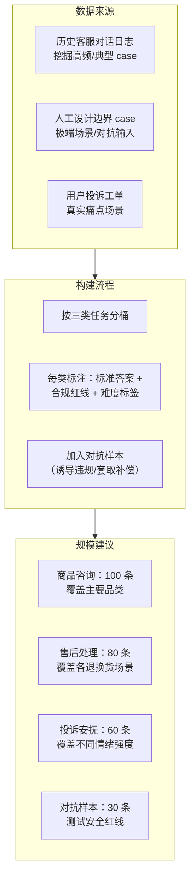
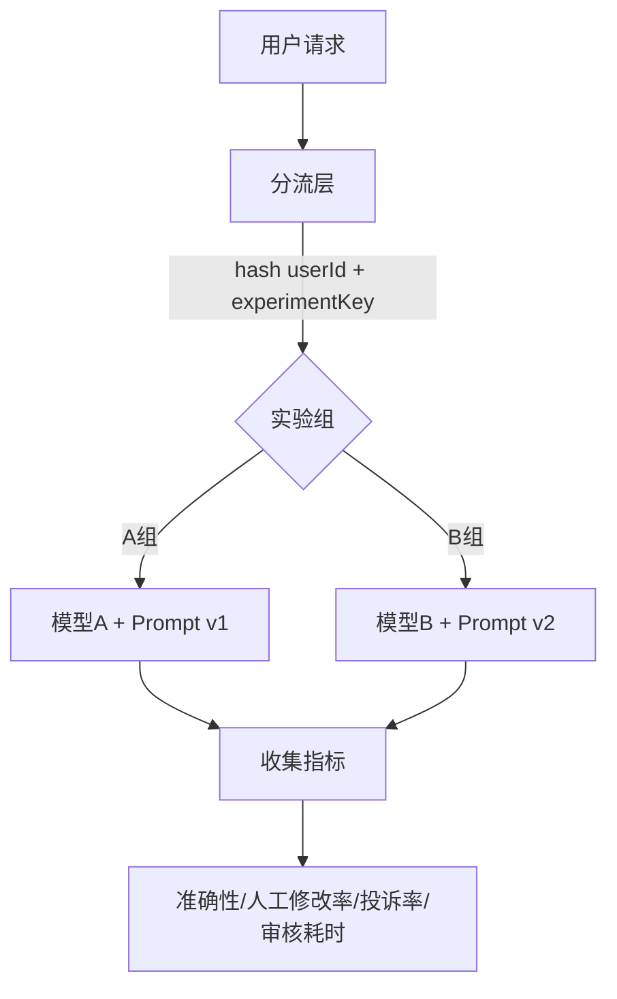
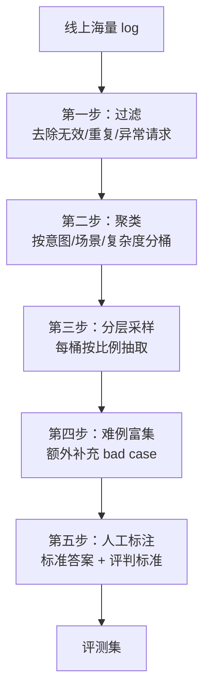
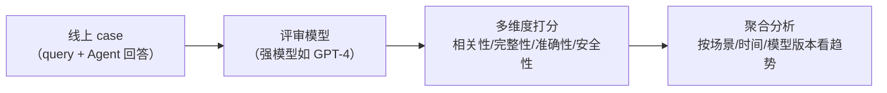
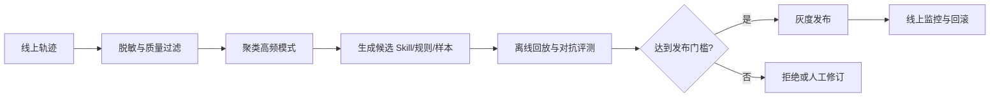

# 评估与全局观：怎么量化 Agent 好坏、落地最大挑战

评估和全局观是面试的最后一道关——通常出现在终面或 leader 面。前面的题考的是“你能不能做”，这类题考的是**“你有没有运营经验”和“你对这个领域有多深的思考”**。

---


## Agent 评测体系

### Q：如何量化评估一个上线的 Agent 好坏？除了准确率。

> 来源：腾讯 Agent 岗终面

**新手答**：“看任务成功率和用户满意度。”

**高手答**：

我们有一个**三维看板**：

1. **效能维度**：任务完成率、平均完成步数、单任务平均耗时与 Token 成本
2. **质量维度**：结果准确率（人工抽检）、用户满意度（评分）、一次解决率
3. **鲁棒性维度**：异常处理成功率、自修复触发率、平均无故障运行时间

最关键的是，每次失败都必须能**归因到具体模块**（是意图理解、规划、工具调用还是记忆的问题），并流入优化队列，驱动系统迭代。

**差距在哪**：新手的答案只有两个指标，且都是结果指标——只知道“好不好”，不知道“哪里不好”。高手的三维看板覆盖效能、质量、鲁棒性三个维度，更关键的是有**失败归因**机制——这才是驱动系统持续改进的关键。面试官考的是“你有没有运营线上系统的经验”。

---

### Q：在你看来，当前阻碍 Agent 大规模落地的最大挑战是什么？

> 来源：腾讯 Agent 岗终面

**新手答**：“成本高，效果不稳定。”

**高手答**：

是**“可控性”与“能力”的权衡困境**。

要它强大，就得给它灵活性和自主权，但这就引入了不可控风险。锁死它的行为，又容易把它变成流程固定的“智障脚本”。

我们的实践是：在核心业务逻辑层用**状态机保证主干流程正确**，在具体的“思考”环节给予模型在**安全沙盒内的最大自由**。同时，投入重兵建设评估、监控、干预体系，用大量测试用例和线上监控，像训警犬一样，明确告诉模型什么能做、什么绝不能做，逐步对齐。

**差距在哪**：新手的回答是事实陈述——“成本高、效果不稳定”谁都知道。高手把问题抽象成了一个**设计权衡**（可控性 vs 能力），并给出了自己的解法。面试官问这种开放题，考的不是“正确答案”（没有正确答案），而是“你对这个领域的思考深度”和“你有没有自己的方法论”。

---

### Q：你觉得 Agent 在线上最难监控的指标是什么？

> 来源：腾讯大模型应用开发二面

**新手答**：“延迟和成功率。”

**高手答**：

最难监控的其实不是延迟和成功率，这些都很容易打点。最难的是**“表面成功但实际决策错误”**——比如工具调用全成功，答案也返回了，但它选错了工具、用了次优证据，或者本来该追问却没追问。这类问题不会直接反映在现有监控指标上。

所以 Agent 监控不能只有系统指标，还要有**决策质量指标**：

```text
系统指标（容易）：延迟、成功率、错误率
决策指标（困难）：工具选择正确率、重复动作率、无效步数占比、
                 需要追问却未追问的比例、最终答案证据覆盖率
```

这些指标更难建，但如果没有，线上看起来一切正常，用户体验却会持续变差。

**差距在哪**：新手只关注系统指标——延迟和成功率容易打点但不够。高手指出了真正的难点是“决策质量指标”——表面成功但实际决策错误的情况在传统监控里看不到。面试官考的是你有没有 Agent 系统运营的实战经验，以及对“决策质量 vs 系统质量”的区分能力。

---

### Q：如何对 Agent 记忆系统的效果进行量化评估？

> 来源：后端 AI 八股 / Memory 系统

**新手答**：“看记忆召回率。”

**高手答**：

记忆系统的评估分**离线评估**和**在线评估**两大类：

**离线评估**（上线前，用标注数据集打分）：

| 指标 | 说明 |
|------|------|
| Precision / Recall | 检索结果的精确率和召回率 |
| ROUGE / F1 | 用记忆生成的答案与标准答案的文本重叠度 |
| 排序质量（MRR / NDCG） | 最相关的记忆是不是排在最前面 |
| 记忆利用率 | 被检索到的记忆有多少真正影响了模型输出 |
| 生成一致性 | 模型的回答和被引用记忆是否一致（有没有检索到了但忽略） |
| 错误记忆使用率 | 基于过期或错误记忆生成回答的比例 |

**在线评估**（上线后，用真实流量监控）：

| 指标 | 说明 |
|------|------|
| Task Success Rate | 有记忆参与的任务完成率 vs 无记忆的对照组 |
| User Engagement | 用户是否感知到 Agent “记得”之前的交互——用对话轮数、回访率衡量 |
| Negative Feedback Rate | 因记忆错误导致的用户负反馈比例 |
| 记忆命中率 | 多少比例的对话轮次用到了记忆 |
| A/B 测试 | 有记忆 vs 无记忆的回答质量对比 |

最容易被忽视的是**离线指标好但在线效果差**的情况——检索 Recall 很高，但模型可能检索到了正确记忆却完全忽略它，这在离线 Recall 上看不出来，只有在线的 Task Success Rate 和 Negative Feedback Rate 才能暴露。

**差距在哪**：新手只看检索维度。高手把评估拆成离线（Precision/Recall/ROUGE）和在线（Task Success Rate/Engagement/Negative Feedback）两大类，且指出”离线指标好不等于在线效果好”这个容易被忽视的盲区。面试官考的是你有没有端到端评估记忆系统的方法论。

---


## AI 工具与开发经验

### Q：你觉得 AI 工具最大的帮助场景是什么？

> 来源：腾讯 Agent 应用开发一面

**新手答**：“写代码快。”

**高手答**：

AI 工具最大的帮助不是“快”，而是**降低了探索未知领域的启动成本**。

具体来说有三个层次：
1. **信息密集型任务**：代码生成、文档撰写、数据清洗——这些任务的共性是“规则清晰但手动执行耗时”，AI 能把执行时间从小时级降到分钟级
2. **认知脚手架**：学习新框架、理解陌生代码库、快速做技术选型调研——AI 充当“即时可用的专家顾问”，把学习曲线压平
3. **思维外包**：把机械性的思维劳动（格式化、查 API 文档、写样板代码）交给 AI，人类专注在需要判断力和创造力的环节

最大的帮助场景是第二类——**让开发者有能力做以前不敢接的任务**。以前不懂前端的后端工程师不会碰 React，现在借助 AI 能快速搭出可用的界面。这是“能力边界扩展”，不只是“效率提升”。

**差距在哪**：新手只想到了效率。高手从信息密集、认知脚手架、思维外包三个层次分析，且指出最大价值是“能力边界扩展”。面试官考的是你对 AI 工具价值的思考深度。

---

### Q：有没有遇到过 AI 应用或者工具无法解决的场景？

> 来源：腾讯 Agent 应用开发一面

**新手答**：“复杂逻辑写不好。”

**高手答**：

AI 工具的能力边界主要在三类场景：

1. **需要深度业务上下文的决策**：AI 不了解你们团队的技术债、历史决策背景、线上事故教训。比如“这个字段为什么叫这个名字”——答案可能在半年前的一次会议记录里，不在代码中
2. **涉及跨系统状态一致性的操作**：AI 能帮你写代码，但不能帮你协调“改完数据库 schema 后同时更新下游三个服务的 proto 文件并通知对应负责人”——这类涉及组织协调的任务超出了工具能力
3. **需要对结果负责的高风险决策**：删除生产数据、修改支付逻辑、选择技术架构——这些决策的后果需要人承担，AI 可以提供选项和分析，但不能替你做最终判断

核心认知：AI 擅长“执行已定义的任务”，不擅长“定义任务本身”。**知道 AI 不能做什么，和知道它能做什么一样重要。**

**差距在哪**：新手用“复杂”一词含糊带过。高手从业务上下文、跨系统协调、高风险决策三个具体角度界定了 AI 的能力边界。面试官考的是你有没有对 AI 工具做过理性评估，而不是盲目吹捧。

---

### Q：你觉得 Agent 框架（如 Claude Code）还有哪些地方可以改进？

> 来源：腾讯 Agent 应用开发一面

**新手答**：“模型再聪明点就好了。”

**高手答**：

改进空间主要在三个方向：

1. **上下文管理的透明度**：当前大部分 Agent 框架的上下文窗口管理对用户是黑盒——什么时候压缩了、丢了什么信息、为什么突然“忘记”了之前的约定，用户感知不到。改进方向是**让上下文状态可视化、可干预**
2. **执行过程的可调试性**：Agent 做了 10 步操作，中间第 3 步选错了工具，但用户到第 10 步才发现结果不对。缺少的是**执行过程的 checkpoint 和回溯能力**——能回到第 3 步改个决策重新执行，而不是从头开始
3. **多模态和跨工具的协作**：目前大部分 Agent 是单模态文本为主，对图片、视频、音频的理解和操作能力有限。同时，不同工具之间的互操作性（MCP 在解决这个问题）还不够成熟

从工程角度看，最需要改进的是**可调试性**——Agent 犯错是常态，关键是犯错后能不能快速定位和修复。

**差距在哪**：新手把改进等同于“模型更强”。高手从上下文透明度、可调试性、多模态协作三个具体工程方向提出了改进意见。面试官考的是你对当前工具的批判性思考能力。

---

### Q：从开发者角度，做 Agent 最难的部分是什么？

> 来源：腾讯 Agent 应用开发一面

**新手答**：“让模型听话。”

**高手答**：

最难的是**在“灵活性”和“可控性”之间找到平衡点**。

给 Agent 足够的自主权，它能处理更复杂的任务，但也更容易跑偏、幻觉、死循环。锁死它的行为空间，任务能正确完成但只能处理预定义的简单场景。

具体来说有三个难点：

1. **状态管理**：Agent 执行多步任务时，如何保证中间状态不丢失、不污染、不矛盾？上下文窗口有限，又不能把所有信息都塞进去——这个“精准投喂信息”的工程是最耗时间的
2. **失败恢复**：Agent 不是一次就能做对的。真正的工程挑战是“做错了之后怎么恢复”——重试？回退？降级？不同类型的错误需要不同的恢复策略，而且这些策略不能让 Agent 自己决定
3. **评估困难**：传统软件有明确的对错判断，但 Agent 的输出是概率性的——“基本对”和“完全对”之间差的可能不是模型能力，而是 Prompt 里少了一句话。这让调试变得极其低效

本质上，做 Agent 最难的不是“让模型做事”，而是**把模型的不确定性关进工程的笼子里**。

**差距在哪**：新手用“不听话”概括了一切。高手从灵活性/可控性权衡出发，拆出了状态管理、失败恢复、评估困难三个具体难点。面试官考的是你有没有做过真实 Agent 开发的深度思考。

---


## RAG 与 Agent 评测指标

### Q：你会怎么给 Agent 建立评测体系？只看最终成功率为什么不够？

> 来源：Agent 开发面试 30 题

**新手答**：“设计一批测试用例，看通过率。”

**高手答**：

只看最终成功率有两个致命问题：① 成功率 80% 告诉你“有 20% 失败了”，但不告诉你**为什么失败**；② 两个 Agent 都是 80% 成功率，但一个平均 3 步完成、另一个平均 15 步完成——体验天差地别。

完整的评测体系要覆盖**四个维度**：

| 维度 | 核心指标 | 衡量的是什么 |
|------|---------|------------|
| **效果** | 任务成功率、答案准确率、用户满意度 | Agent 能不能做对 |
| **效率** | 平均步数、token 消耗、端到端延迟 | Agent 做对的成本 |
| **鲁棒性** | 异常恢复率、对抗输入通过率、长任务完成率 | Agent 在边界条件下的表现 |
| **过程质量** | 工具选择正确率、无效步数占比、重复动作率 | Agent 的决策过程是否合理 |

**过程质量是最容易被忽视但最有价值的维度**——即使最终成功了，如果中间绕了一大圈、调了三次错误工具才蒙对，说明系统有隐患。

**评测集设计**：

```text
基础用例（60%）：覆盖核心功能的标准场景
边界用例（20%）：缺参数、矛盾输入、超长上下文
对抗用例（10%）：prompt injection、故意误导
回归用例（10%）：历史 bug 对应的测试用例
```

**评测频率**：每次模型/Prompt/工具变更后必须跑全量评测，日常用核心用例做冒烟测试。

**调优实战：怎么从评测结果驱动改进？**

评测不是跑个分就完了，关键是**从评测结果中定位瓶颈、制定优化方案、验证改进效果**的闭环。面试官经常追问”讲一个调优 case”，回答结构应该是：

```text
发现问题 → 归因分析 → 优化方案 → 效果验证

例：工具选择准确率从评测中发现只有 65%
  → 归因：工具描述太相似，模型无法区分”搜索文档”和”搜索知识库”
  → 优化：重写工具描述，加入使用场景和输入输出示例
  → 验证：工具选择准确率提升到 88%，端到端成功率从 72% 提升到 85%
```

评测集的构建同样重要——好的评测集不是越大越好，而是要覆盖核心场景、边界条件、已知失败模式。每次修复一个线上问题，都应该把对应的 case 加入回归评测集。

**差距在哪**：新手只看成功率。高手建立了四维评测体系（效果/效率/鲁棒性/过程质量），且指出过程质量是最容易被忽视的维度。面试官考的是你有没有”评测驱动优化”的工程方法论。

---

### Q：RAG 系统（如 oncall 机器人）的回答准确率怎么计算？用知识问答对比还是文档相似度？

> 来源：蚂蚁集团智能体与大模型应用二面

**新手答**：“人工看看对不对，算个比例。”

**高手答**：

oncall 机器人或 RAG 问答系统的准确率评估比“人工看”复杂得多，因为要区分**检索准确率**和**回答准确率**——检索对了但回答可能错，检索错了但回答可能蒙对。

**评估框架分两层**：

**1. 检索层评估（文档相似度方向）**——衡量“找的资料对不对”：

- **Recall@K**：正确文档是否在 top-K 召回结果中
- **Precision@K**：top-K 结果中有多少是真正相关的
- **MRR**：正确文档排在第几位

评估方式：构建标注集——`(query, ground_truth_docs)` 对，用标注文档和实际召回文档做匹配。

**2. 回答层评估（知识问答对比方向）**——衡量“最终回答对不对”：

- **Exact Match / F1**：回答和标准答案的文本匹配度
- **LLM-as-Judge**：用另一个大模型评分（1-5 分），判断回答的准确性、完整性、相关性
- **Faithfulness**：回答是否忠实于检索到的文档（有没有编造文档里没有的内容）

**用哪种方法，取决于评估目标**：

| 评估目标 | 方法 | 适用场景 |
|---------|------|---------|
| 优化检索管线 | 文档相似度 / Recall / MRR | 调 Embedding、ReRank、chunk 策略时 |
| 评估端到端效果 | 知识问答对比 / LLM-as-Judge | 上线前验收、A/B 测试 |
| 监控线上质量 | 用户反馈率 + 抽样人工评估 | 日常运营 |

**实际生产中的组合策略**：

1. **离线评估**：用标注集同时跑检索指标和回答指标，定位问题出在检索还是生成
2. **在线评估**：埋点用户行为（点赞/点踩/追问率）作为隐式反馈，辅以每日抽样人工评估
3. **归因分析**：回答错误时，先查检索结果——如果检索到了正确文档但回答仍然错，说明是生成环节的问题；如果根本没检索到正确文档，说明是检索环节的问题

**差距在哪**：新手用“人工看”一刀切。高手把评估拆成检索层和回答层两个维度，且说清了不同评估目标对应不同方法，最后给出了离线 + 在线 + 归因的组合策略。面试官考的是你有没有系统性评估 RAG 系统的方法论——“对不对”是表象，“哪里不对、为什么不对”才是核心。

---

### Q：如果线上反馈“这个 Agent 有时候很好，有时候很差”，你第一步会看什么指标和日志？

> 来源：Agent 开发面试 30 题

**新手答**：“看看是不是模型不稳定。”

**高手答**：

“有时好有时差”说明不是系统性问题，而是**特定条件下触发的问题**。排查思路是**缩小范围 → 找到分界线 → 定位根因**。

**第一步：看分布，不看平均**

把最近 N 天的请求按成功/失败分两组，对比以下维度的分布差异：

| 对比维度 | 怎么看 | 可能发现 |
|---------|--------|---------|
| 输入长度 | 失败组的 query 是不是更长/更短 | 上下文截断导致信息丢失 |
| 任务类型 | 失败集中在哪类任务 | 某类工具或 Prompt 有缺陷 |
| 执行步数 | 失败组是不是步数更多 | 长链路累积错误 |
| 使用的工具 | 失败组集中调用了哪个工具 | 某个工具不稳定 |
| 时间段 | 失败集中在某个时间段 | 外部依赖在该时段不稳定 |

**第二步：看执行链路日志**

从失败案例中抽 5-10 个典型 case，逐步看执行链路：

```text
用户输入 → 意图识别结果 → 规划的步骤 → 每步的工具调用和返回 → 最终输出
```

找到**第一个出错的环节**——是意图理解错了？规划有遗漏？工具返回异常？还是最终生成时忽略了关键信息？

**第三步：看“成功但低质量”的灰色地带**

不只看失败，还要看**用户评价低但系统判定成功的**请求——这些是“表面成功但体验差”的隐藏问题。

**差距在哪**：新手直觉是“模型不稳定”——这等于没排查。高手有系统性的排查方法论：先看分布找分界线、再看链路定位环节、最后查灰色地带。面试官考的是你排查线上问题时有没有数据驱动的方法。

---


## 落地风险与行业趋势

### Q：要把 Agent 真正上线到生产环境，你认为最容易被低估的三个风险点是什么？

> 来源：Agent 开发面试 30 题

**新手答**：“成本、延迟、准确率。”

**高手答**：

成本、延迟、准确率是**所有人都知道的风险**，恰恰因为人人都知道，反而不会被低估。真正被低估的风险是那些**在 Demo 阶段看不到、上线后才暴露**的：

**1. 长尾输入的不可控行为**

测试集覆盖不了所有用户输入。总有 5% 的用户会问出你从没想过的问题——模型可能给出荒谬的回答、陷入死循环、或者触发不该调用的工具。长尾问题的危害不是频率高，而是**一个恶性案例就能毁掉产品口碑**。

防范：上线初期必须有**人工审核 + 实时告警**，对异常执行模式（步数过多、工具调用异常、输出过长）即时报警。

**2. 状态漂移——系统跑着跑着就“变味”了**

模型版本更新、外部 API 返回格式微调、知识库内容更新——任何一个上游变化都可能让 Agent 行为悄悄偏移。不像传统软件的 bug 有明确的报错，状态漂移是**渐变的、静默的**，可能跑了两周才有人发现“最近回答质量好像下降了”。

防范：建立**持续评测管线**——每天自动跑核心评测集，指标下降立刻告警，不等用户投诉。

**3. 隐式依赖链断裂**

Agent 的正确运行依赖一条长长的隐式链路：模型 API 稳定 → Embedding 服务可用 → 向量库正常 → 外部工具 API 不变 → 知识库内容准确。任何一环断裂都会导致问题，但**故障表现往往和根因相距甚远**——知识库更新了一个错误文档，表现出来是“Agent 给了错误建议”，中间隔了检索、排序、生成三个环节。

防范：对所有外部依赖做**健康检查和变更监控**，知识库更新后自动触发回归测试。

**差距在哪**：新手列的都是显而易见的风险。高手指出了三个“Demo 阶段看不到、上线后才暴露”的隐性风险——长尾输入、状态漂移、隐式依赖链断裂，且每个都有具体的防范方案。面试官考的是你有没有把 Agent 推到生产环境的实战经验。

---

### Q：2026 年做 Agent 应用开发，跟去年相比最大的变化是什么？

> 来源：蚂蚁集团 Agent 开发二面

**新手答**：“模型更强了，能做的事更多了。”

**高手答**：

模型变强是基础事实，但**真正影响开发方式的变化**不在模型本身，而在工具链、架构范式和工程实践三个层面：

**1. 从“Prompt 工程”到“上下文工程”**

去年做 Agent，核心工作是调 Prompt——怎么写 System Prompt、怎么做 few-shot、怎么做 chain-of-thought。2026 年，随着模型能力提升，Prompt 的精细调优变得没那么关键了。真正的瓶颈变成了**上下文工程**——怎么在有限窗口里给模型恰好的信息：项目结构索引、动态工具加载、分层记忆召回、操作后状态刷新。

**2. 从“单 Agent 做所有事”到“协议化的多 Agent 协作”**

去年的多 Agent 还停留在“自己写消息传递逻辑”的阶段。2026 年 MCP（工具协议）和 A2A（Agent 间协议）逐步标准化，Agent 之间的协作从“每次重新造轮子”变成了“基于协议即插即用”。这改变了架构思维——从“设计一个万能 Agent”变成“设计一组专业 Agent + 标准化的协作协议”。

**3. 从“Demo 驱动”到“评测驱动”**

去年很多团队做 Agent 是“先做 Demo，效果好就上线”。2026 年的共识是：没有评测体系的 Agent 不能上线。持续评测管线（自动跑评测集、指标监控、回归检测）成了标配，Agent 开发的一半时间花在评测和可观测性上。

**4. 从“纯 Agent”到“Workflow + Agent 节点”混合架构**

去年有很多“纯 Agent”尝试——让模型全程自主决策。实践证明不可行。2026 年主流方案是确定性环节用 Workflow 控制、不确定性环节嵌入 Agent 节点。这不是 Agent 的退步，而是**找到了 Agent 在生产系统中的正确位置**。

**差距在哪**：新手只看到了“模型更强”。高手从上下文工程、协议化协作、评测驱动、混合架构四个维度说明了开发方式的本质变化——不是“能做更多”，而是“怎么做变了”。面试官考的是你对 Agent 技术发展的结构化观察能力。

---

### Q：了解最近 AI 的新方向吗？

> 来源：蚂蚁集团一面

**新手答**：“大模型越来越强了，能写代码能画图。”

**高手答**：

2025-2026 年 AI 领域有几个真正改变开发范式的方向，不只是“模型更强”：

**1. 推理模型（Reasoning Models）**

以 OpenAI o1/o3、DeepSeek-R1 为代表。核心变化是模型在输出答案前会做**长链推理（Chain of Thought）**，用更多的推理 token 换更高的准确率。这不是简单的“思考更久”——推理模型在数学、代码、逻辑推理等需要多步推导的任务上有质的飞跃。

对开发者的影响：以前靠精心设计 Prompt 引导模型一步步思考，现在模型自己会做——**推理能力从 Prompt 工程转移到了模型内部**。

**2. Agent 原生应用**

从“给现有产品加 AI 功能”变成“围绕 Agent 能力设计整个产品”。代表产品：Claude Code（AI 驱动的开发环境）、Devin（AI 软件工程师）、各类 AI 数据分析工具。

核心转变：用户不再是“输入指令 → 获取结果”的单轮交互，而是“委托任务 → Agent 自主规划执行 → 人类监督审核”的协作模式。

**3. 上下文工程取代 Prompt 工程**

模型能力提升后，Prompt 的精细调优变得不那么关键。真正的瓶颈变成**怎么在有限窗口里给模型恰好的信息**——动态工具加载、分层记忆召回、渐进式披露。上下文工程是 2026 年 Agent 开发的核心技术栈。

**4. 协议标准化（MCP + A2A）**

Agent 生态从“各家自己造轮子”走向协议标准化。MCP 解决了 Agent 到工具的连接标准，A2A 解决了 Agent 之间的通信标准。这意味着**Agent 组件变得可复用、可互操作**——类似 Web 时代 HTTP 协议的意义。

**5. 端侧 AI 和混合推理**

3B 以下的小模型在端侧（手机、笔记本）可用后，出现了**云端大模型 + 端侧小模型混合推理**的架构——简单任务端侧处理（低延迟、隐私保护），复杂任务上传云端。这改变了 AI 应用的部署架构。

**差距在哪**：新手只感知到“模型更强”。高手从推理模型、Agent 原生应用、上下文工程、协议标准化、端侧混合推理五个方向做了结构化梳理，每个方向都说清了对开发者的实际影响。面试官用这道开放题考的是你的**行业视野和技术敏感度**——不是背新闻，而是能从趋势中提炼出对自己工作的影响。

---


## 评测方案设计与实践

### Q：Agent 的端到端成功率和工具误调用率怎么量化？怎么改进？

> 来源：腾讯 AI 应用开发二面

**新手答**：”看任务完成了没有，完成了就算成功。”

**高手答**：

“完成了没有”是最粗的指标，**无法定位问题出在哪个环节**。量化需要拆层，改进需要闭环。

**端到端成功率的分层量化**：

| 指标 | 定义 | 公式 |
|------|------|------|
| 端到端成功率 | 任务从输入到输出完全正确的比例 | 成功任务数 / 总任务数 |
| 规划成功率 | 模型生成的执行计划逻辑正确的比例 | 计划合理数 / 总规划数 |
| 工具选择准确率 | 选对了工具的比例 | 正确选择数 / 总选择数 |
| 工具调用成功率 | 工具调用返回有效结果的比例 | 有效返回数 / 总调用数 |
| 回复质量 | 最终回复满足用户意图的比例 | 满意回复数 / 总回复数（需人工/LLM 评估） |

**工具误调用率的细分**：

工具误调用不是一个单一指标，需要区分三种错误：

```text
误选工具（选了不该选的）→ 看工具选择 Precision
漏选工具（该选的没选）→ 看工具选择 Recall
参数错误（选对了但参数传错）→ 看参数校验通过率
```

**量化工具链**：

- **日志基建**：每一步（意图识别 → 规划 → 工具选择 → 工具执行 → 结果生成）都记结构化日志，带 trace_id 串联
- **离线评估**：用标注好的评测集定期跑回归，计算各层指标
- **线上监控**：用 LangSmith / Langfuse / 自建 dashboard 实时追踪成功率、延迟、token 消耗

**改进闭环**：


```mermaid
flowchart LR
    A[“发现指标下降”] --> B[“定位问题层\n（规划？工具选择？参数？）”]
    B --> C[“分析 bad case\n（随机抽样 + 聚类）”]
    C --> D[“针对性优化”]
    D --> E[“回归评测验证”]
    E -->|”指标提升”| F[“上线”]
    E -->|”无效”| C
```

常见优化手段：
- **工具选择准确率低** → 重写工具描述（加使用场景、输入输出示例）、减少工具数量（合并相似工具）
- **参数错误率高** → 参数 schema 加 enum 约束、在 System Prompt 中加参数填写示例
- **规划成功率低** → 拆分复杂任务（让模型先生成计划再执行）、加 Few-shot 示例

**差距在哪**：新手只看一个”成功率”数字，出了问题不知道该查哪。高手把端到端成功率拆成规划/工具选择/工具执行/回复质量四层，把工具误调用拆成误选/漏选/参数错误三类，且给出了从日志基建到改进闭环的完整量化方案。面试官考的是你有没有”可观测 + 可归因 + 可改进”的 Agent 评测方法论。

---

### Q：通过什么方式去验证 Skill 的提升效果，指标是什么？

> 来源：美团/食杂后端一面 【电商库存一面追问：Skill 变更影响面回归】【字节火山引擎 Managed Agent 一面追问：脚本与模型评审对比两个 Skill】

**新手答**：“看用户反馈好不好，或者看任务成功率有没有提升。”

**高手答**：

验证 Skill 效果需要**分层度量 + 对照实验**：

**1. 指标体系**

| 层级 | 指标 | 含义 |
|------|------|------|
| 触发层 | 触发准确率 | 该触发时触发、不该触发时不触发 |
| 执行层 | 端到端成功率 | Skill 被调用后任务完成的比例 |
| 效率层 | 步数 / Token 消耗 | 有 Skill vs 无 Skill 的资源对比 |
| 质量层 | 输出一致性 | 同类任务多次执行结果的稳定程度 |

**2. 评测方法**

- **A/B 对照**：同一批 eval case，分别在有/无该 Skill 的条件下跑，对比成功率和步数
- **回归检测**：新增 Skill 后原有能力是否退化（跑全量 eval set）
- **边界测试**：故意给模糊/交叉意图，看 Skill 是否误触发

评价脚本和模型评审承担不同职责。格式、必填字段、工具调用、单测和业务不变量优先用确定性脚本；开放式质量使用固定 Rubric 的模型 Judge，隐藏候选名称并随机交换 A/B 顺序，重复多次检查位置偏差。Judge 分歧或高风险 Case 进入人工复核。对比两个 Skill 时固定模型、Prompt、工具快照和任务集，只改变 Skill 版本，同时报告成功率、路由准确率、Token、延迟、副作用和置信区间，不能用单次“看起来更好”决定发布。

回归集要分三圈：该 Skill 自己的正向、反向和边界 case；它与相邻 Skill 的**路由混淆对**（同一意图只改一个关键条件，看是否选错）；以及全局任务集。发布门槛同时约束本 Skill 的收益和另外两圈的最大退化，不能只证明“自己的题做得更好”，却让路由抢占其他 Skill 或损伤通用任务。

**3. 实战经验**

Skill 的效果不是线性的——简单任务提升不大，复杂重复任务提升显著。所以评测集要**按任务复杂度分层**，分别算各层提升比例，避免被简单任务的高基线稀释了真正的收益。

**差距在哪**：新手只看一个结果指标。高手分了触发/执行/效率/质量四层，且有对照实验设计和回归检测意识。面试官考的是你对”如何科学度量一个能力模块效果”的工程化思维。

---

### Q：RAG 系统如何评测？有哪些评测维度和指标？评测数据集怎么构建？

> 来源：快手 AI Agent 开发一面

**新手答**：“看回答准不准。”

**高手答**：

RAG 评测不能只看最终回答——需要**分阶段评估**，才能定位问题出在哪个环节。

**评测维度和指标**：

| 评测阶段 | 维度 | 核心指标 | 说明 |
|---------|------|---------|------|
| 检索质量 | 召回率 | Recall@K | 正确文档是否进入了候选集 |
| 检索质量 | 精确率 | Precision@K | 候选集中相关文档的占比 |
| 检索质量 | 排序质量 | MRR / NDCG | 正确文档是否排在前面 |
| 生成质量 | 忠实度 | Faithfulness | 回答是否忠于检索到的文档（不编造） |
| 生成质量 | 相关性 | Answer Relevancy | 回答是否切题 |
| 生成质量 | 完整性 | Completeness | 回答是否覆盖了问题的所有方面 |
| 端到端 | 准确率 | Correctness | 最终回答和标准答案的一致性 |
| 端到端 | 拒答率 | Rejection Rate | 知识库无答案时，模型是否正确拒答而非编造 |

**评测框架**：

```text
RAGAS：自动化评测框架，内置 Faithfulness、Answer Relevancy 等指标
TruLens：支持自定义评测函数，可追踪 RAG 管线每个环节
DeepEval：开源评测框架，支持 LLM-as-Judge 模式
```

**评测数据集的构建**：


```mermaid
flowchart TB
    D["知识库文档"] --> Q1["自动生成\nLLM 从文档中生成 Q&A 对"]
    L["用户真实日志"] --> Q2["日志挖掘\n提取高频/失败 query"]
    E["专家设计"] --> Q3["边界测试\n多跳/矛盾/超范围问题"]
    Q1 --> M["合并去重"]
    Q2 --> M
    Q3 --> M
    M --> A["人工标注\n标准答案 + 相关文档"]
    A --> DS["评测数据集"]
```

**高质量评测数据的要求**：

1. **覆盖多种问题类型**：
   - 单跳事实题（答案在一个文档中）
   - 多跳推理题（需要关联多个文档）
   - 对比题（两个实体的异同）
   - 超范围题（知识库中没有答案，测试拒答能力）
   - 时效性题（信息可能过期）

2. **标注内容**：每条数据包含 query、标准答案、相关文档列表（ground truth）、难度标签

3. **数据规模**：通常 200-500 条覆盖主要场景即可，关键是**多样性而非数量**

4. **持续更新**：知识库更新后，评测集也要同步更新，否则评测结果不反映真实表现

**差距在哪**：新手只看”准不准”一个维度。高手把评测拆成检索和生成两个阶段，每个阶段有独立的指标体系，且说清了评测数据集的构建方法和质量要求。面试官考的是你有没有完整的 RAG 质量保障体系——不是”上线看看效果”，而是有离线评测、有基准数据、有分阶段归因。

**追问：评测集 100 条够吗？分布怎么分析？baseline 用什么？**

> 来源：字节 AI 一面（RAG 项目深挖）

100 条评测集的三个致命问题：

1. **统计显著性不足**：100 条样本下，Recall@5 从 0.81 波动到 0.75 可能只是随机误差，你无法区分”真的变差了”和”评测集太小导致的噪声”
2. **分布偏差**：如果 100 条中 80 条是简单的单跳事实题，Recall@5 = 0.81 不代表系统在多跳推理题上也能达到同样水平
3. **无 baseline 对照**：0.81 是好是坏？没有参照系就是一个孤立数字

**评测集规模的工程标准**：

| 场景规模 | 最低评测集 | 构建方式 |
|---------|-----------|---------|
| PoC / Demo | 50-100 条 | 手工构造即可 |
| 内部工具上线 | 200-500 条 | 自动生成 + 人工审核 |
| 面向用户产品 | 1000+ 条 | 真实日志挖掘 + 专家标注 + 对抗样本 |

**分布分析必做的三件事**：
- **按 query 类型分层**：单跳事实 / 多跳推理 / 对比 / 超范围各占多少，分层计算指标
- **按难度分级**：简单（答案在单段落内）/ 中等（需跨段落）/ 困难（需跨文档）
- **按文档来源分布**：确保评测集覆盖知识库的各个领域，而非集中在少数文档

**baseline 设计**：

| Baseline | 作用 | 实现 |
|----------|------|------|
| BM25 纯关键词检索 | 检验向量检索是否比传统检索好 | 同样的 query 走 BM25 |
| 纯 LLM 无检索 | 检验 RAG 是否真的有价值 | 直接问模型，不给文档 |
| 人类表现 | 性能上限参照 | 让领域专家回答同样的问题 |

有了 baseline，”Recall@5 = 0.81”才有意义——“比 BM25 的 0.62 高 30%，但离人类的 0.95 还有差距”。

---

### Q：Ragas 评测框架是什么？Answer Relevance 偏低时，怎么区分是检索问题还是模型问题？

> 来源：蚂蚁 AI应用开发 二面

**新手答**：”Ragas 是评测 RAG 的工具，Answer Relevance 低就是检索不好。”

**高手答**：

**Ragas 框架**：一个专门评测 RAG 系统的开源框架，核心是把端到端的评测拆解成**多个独立维度**，每个维度单独打分，这样出了问题能精准定位到哪个环节。

核心指标：

| 指标 | 评测什么 | 不依赖 |
|------|---------|-------|
| Faithfulness（忠实度） | 回答是否基于检索到的上下文，而非编造 | 不依赖标注答案 |
| Answer Relevance（答案相关性） | 回答是否切题、是否回答了用户的问题 | 不依赖检索结果 |
| Context Precision（上下文精度） | 检索到的内容中，相关内容排在前面的比例 | 需要标注答案 |
| Context Recall（上下文召回） | 回答所需的信息是否都被检索到了 | 需要标注答案 |

**Answer Relevance 偏低时的诊断方法**：

Answer Relevance 低有两种可能：检索给了错误的上下文（模型”巧妇难为无米之炊”），或者检索正确但模型理解/表达能力不足。区分方法：

**1. 交叉检验法**：固定相同的检索结果，分别用当前模型和一个已知强模型（如 GPT-4）生成回答。如果强模型的 Answer Relevance 显著更高 → 当前模型能力不足。如果强模型也低 → 检索问题。

**2. 指标联动分析**：
- Context Recall 低 + Answer Relevance 低 → 检索没有找到相关文档，模型无法回答 → **检索问题**
- Context Recall 高 + Faithfulness 高 + Answer Relevance 低 → 检索结果正确且模型忠实引用了，但回答方式不切题 → **模型理解/表达问题**
- Context Precision 低 + Answer Relevance 低 → 检索结果中噪声太多，模型被无关信息干扰 → **检索排序问题**

**3. 人工抽样**：随机抽取 20-30 个低分 case，人工判断检索结果和模型回答各自的质量。自动化指标是辅助，人工抽样是最终确认。

**差距在哪**：新手直接把 Answer Relevance 低归因于检索——这是最常见的误判。高手用交叉检验和指标联动两种方法精准区分了检索质量和模型能力的影响边界。面试官考的是你有没有系统性的 RAG 评测和问题诊断能力。

**追问：Ragas 的 Context Precision 过低，怎么优化？**

> 来源：阿里淘天 AI应用开发一面

Context Precision 衡量的是**检索结果中相关文档的排位**——即使召回了正确文档，如果排在第 4、5 位而噪声文档排在前面，Context Precision 也会很低。

**优化的三个方向**：

| 方向 | 具体方案 | 效果 |
|------|---------|------|
| 检索排序 | 引入 Rerank 模型（Cross-Encoder）对召回结果重排序 | 直接提升相关文档排位 |
| 召回质量 | 优化 query 改写 + 混合检索（向量+BM25），减少噪声召回 | 从源头减少不相关文档 |
| 索引质量 | 改进分块策略（避免语义碎片化）+ 清洗知识库噪声文档 | 底层数据质量决定上限 |

**诊断优先级**：先看 Context Recall——如果 Recall 也低，说明正确文档根本没进候选集，优化召回策略优先；如果 Recall 高但 Precision 低，说明正确文档进了但排位差，加 Rerank 即可。

---

## Q：如何为 Word、PDF、Markdown 等文档生成与编辑能力设计通用自动评测框架？

> 来源：[百度 AI 测开一面](https://www.nowcoder.com/feed/main/detail/cd8e446a6ec14edfa53cf4c7b6864c4d)

**新手答**：“准备一些标准文档，用 LLM-as-Judge 比较生成内容是否相似。”

**高手答**：

文档 Agent 的输出是**可解析、可渲染、可继续编辑的工件**，不能只把文本抽出来算相似度。每条评测样本应包含输入工件、编辑指令、允许变化范围、必须保持的不变量、期望证据和风险级别；先冻结工具、字体和渲染环境，再运行同一任务，保证结果可复现。

评测拆成五层：

| 层级 | Oracle | 典型检查 |
|---|---|---|
| 文件有效性 | 格式解析器/办公软件 | 能否打开、保存、重新解析和导出 |
| 结构正确性 | AST/OOXML/PDF 对象模型 | 标题、段落、表格、图片、链接、书签和元数据 |
| 编辑语义 | 目标字段、差分和业务规则 | 指定内容已改，未授权范围未变，引用与数字一致 |
| 视觉结果 | 固定环境渲染 + 像素/布局比较 | 分页、溢出、遮挡、字体替换、表格断裂 |
| 任务过程 | Trace 与资源指标 | 工具选择、失败恢复、人工介入、耗时和成本 |

不同格式共享评测骨架，但必须先固定具体格式和方言。`.docx` 可按 [ECMA-376](https://ecma-international.org/publications-and-standards/standards/ecma-376/)检查 OOXML 包结构和文档对象，旧 `.doc` 不在该标准范围内；Markdown 则要声明 CommonMark、GitHub Flavored Markdown、kramdown 等目标方言，[CommonMark 规范与测试集](https://spec.commonmark.org/)只验证其核心语法，不覆盖所有表格、任务列表或站点扩展。PDF 更偏最终呈现，需要同时检查页面对象、文本/链接提取和固定分辨率渲染。跨格式转换还要验证语义和引用保持，不能要求内部结构逐字节相同。

确定性检查先门禁：文件损坏、Schema 错、目标字段未改、非目标区域变化或页面遮挡直接失败。只有“表达是否清晰”“摘要是否完整”这类难以程序化的语义质量才交给带固定 Rubric 的 LLM Judge，并用人工抽样校准。生成模型和 Judge 不应共享未公开金标；高风险模板还要保留独立只读验收集，防止两者一起误解需求。

报告按格式、操作类型、文档复杂度和风险切片，至少看任务通过率、结构错误率、非预期改动率、视觉回归率、可重开/导出率、人工复核成本和 P95 延迟。这样才能区分“内容写对但文件坏了”“文件能开但改错区域”和“结构正确但排版不可用”。

**差距在哪**：新手把文档当纯文本。高手用格式解析、编辑差分、业务不变量、视觉渲染和过程 trace 建立多层 Oracle，并明确确定性门禁与 LLM Judge 的边界。

---

### Q：怎么理解 Vibe Coding？你有哪些实践经验？

> 来源：蚂蚁 AI应用开发 二面

**新手答**：”就是用 AI 写代码，说需求然后让模型生成。”

**高手答**：

Vibe Coding 是 Andrej Karpathy 提出的概念——开发者用自然语言描述意图，AI 生成代码，开发者不逐行审查而是直接运行看效果，凭”感觉”（vibe）判断代码是否正确。核心特征：**开发者从”写代码的人”变成”描述需求+验证结果的人”**。

**适用场景和边界**：

| 场景 | 适合 Vibe Coding | 原因 |
|------|----------------|------|
| 原型验证 / 脚本 | 适合 | 快速试错，错了重来成本低 |
| UI / 前端样式 | 适合 | 视觉验证直观，改起来快 |
| 数据处理脚本 | 适合 | 输入输出明确，结果可验证 |
| 核心业务逻辑 | **不适合** | 错误难发现，后果严重 |
| 安全相关代码 | **不适合** | “看起来能跑”不等于安全 |

**实践经验**：

1. **小步快跑**：不要一次描述完整需求，而是分步骤——先搭框架 → 再填功能 → 最后优化。每步验证后再进入下一步
2. **验证比生成更重要**：AI 生成代码很快，但验证代码是否正确才是耗时的部分。好的 Vibe Coding 实践是花 20% 时间描述需求，80% 时间验证和调试
3. **知道什么时候停**：Vibe Coding 的效率在简单任务上极高，但在复杂逻辑上迅速下降。当你发现自己花更多时间解释 bug 而非描述需求时，就该切回手写代码

**对 Agent 开发的启示**：Vibe Coding 本质上就是人类使用了一个”代码生成 Agent”——用户用 NL 描述意图，Agent 调用代码生成工具执行。这个体验的好坏直接反映了 Agent 系统的核心能力：意图理解、工具调用、结果验证。

**差距在哪**：新手把 Vibe Coding 等同于”用 AI 写代码”。高手理解它的本质（角色转变：写代码→验证结果），知道适用边界（原型适合、核心逻辑不适合），且有具体的实践方法论。面试官考的是你对 AI 辅助开发的思考深度——不是”用没用过”，而是”怎么用、什么时候不用”。

---

### Q：如何衡量 Agent 的 Planning 能力 vs Hallucination Rate？请列举具体的量化评估指标或自动化评估框架

> 来源：淘天 AI Agent 一面

**新手答**：”看任务成功率就行了。”

**高手答**：

Planning 能力和 Hallucination Rate 必须**同时评估**，因为它们之间存在本质张力——规划能力越强意味着模型越敢自主决策，但自主决策越多，幻觉风险越高。只看成功率会掩盖这个矛盾：一次”碰巧成功”的幻觉规划和一次”系统性正确”的规划，在成功率上没有区别。

**Planning 能力的量化指标**：

| 指标 | 定义 | 评估方法 |
|------|------|---------|
| 计划完整度（Plan Completeness） | 生成的计划是否覆盖了任务所需的所有关键步骤 | 与标准步骤列表对比，计算覆盖率 |
| 步骤正确率（Step Correctness） | 每一步的动作和参数是否正确 | 逐步对比标准答案，人工或 LLM 评判 |
| 工具选择准确率（Tool Selection Accuracy） | 是否选择了最合适的工具 | 与标注的最优工具选择对比 |
| 计划效率（Plan Efficiency） | 实际步数 vs 最优步数 | 比值越接近 1 越好，>2 说明有冗余 |
| 计划适应性（Plan Adaptability） | 遇到工具失败或意外结果时能否调整计划 | 故意注入失败，观察恢复行为 |
| 子目标分解质量 | 复杂任务是否被合理拆解为可执行的子任务 | LLM-as-Judge 评分（1-5 分） |

**Hallucination Rate 的量化指标**：

| 指标 | 定义 | 评估方法 |
|------|------|---------|
| 忠实度（Faithfulness） | 回答是否忠实于检索到的证据 | RAGAS Faithfulness 指标，或人工标注 |
| 事实基础率（Factual Grounding Rate） | 输出中有多少比例的陈述可以追溯到可靠来源 | 逐句标注来源，计算有来源覆盖的比例 |
| 无依据声明率（Unsupported Claim Ratio） | 输出中无法在上下文或知识库中找到支撑的声明占比 | 自动提取声明 → 逐条验证 → 计算比例 |
| 工具幻觉率（Tool Hallucination Rate） | 调用不存在的工具或使用不合法参数的比例 | 规则检查：工具名 ∈ 可用列表？参数符合 schema？ |
| 结果幻觉率 | 声称工具返回了某结果但实际返回不同 | 对比模型声称的工具结果与实际工具返回值 |

**核心矛盾：Planning 越强，Hallucination 风险越高**

```text
Planning 自主性光谱：
低自主 ──────────────────────────── 高自主
固定流程    受限规划    自由规划    完全自主
幻觉风险低              幻觉风险高
能力上限低              能力上限高

→ 评估不能只看一端，要画出”能力-幻觉”的帕累托曲线
```

所以评估框架必须同时覆盖两个维度，生成类似这样的联合报告：

```text
Agent A：Planning 得分 82，Hallucination Rate 15% → 高能力、中风险
Agent B：Planning 得分 78，Hallucination Rate 5%  → 中能力、低风险
Agent C：Planning 得分 90，Hallucination Rate 30% → 高能力、高风险（不可上线）
```

**自动化评估框架对比**：

| 框架 | 核心能力 | Planning 评估 | Hallucination 评估 |
|------|---------|-------------|-------------------|
| RAGAS | RAG 管线自动评测 | 不直接支持 | Faithfulness、Answer Relevancy |
| AgentBench | Agent 多场景基准测试 | 任务完成率、步骤效率 | 间接（通过错误分析） |
| ToolBench | 工具调用能力评测 | 工具选择准确率、调用链正确性 | 工具幻觉率 |
| 自建评估管线 | 定制化全维度评估 | LLM-as-Judge + 规则打分 | 声明提取 + 来源验证 |

**自建管线的推荐做法**：


```mermaid
flowchart TB
    T[“测试用例集\n（任务+标准答案+标准步骤）”] --> R[“Agent 执行任务”]
    R --> P[“Planning 评估”]
    R --> H[“Hallucination 评估”]

    P --> P1[“LLM-as-Judge\n评估计划质量”]
    P --> P2[“规则匹配\n步骤覆盖率/效率”]
    P --> P3[“注入失败\n测试适应性”]

    H --> H1[“规则检查\n工具幻觉检测”]
    H --> H2[“声明提取+验证\n事实幻觉检测”]
    H --> H3[“结果对比\n输出幻觉检测”]

    P1 --> S[“联合评分报告<br>Planning 得分 x Hallucination Rate”]
    P2 --> S
    P3 --> S
    H1 --> S
    H2 --> S
    H3 --> S
```

LLM-as-Judge 用于评估 Planning 质量（计划是否合理、步骤是否冗余），规则检查用于 Hallucination 检测（工具名是否存在、参数是否合法、引用的事实是否有来源）。两类评估互补：LLM 擅长语义判断，规则擅长精确校验。

**差距在哪**：新手只看”任务成功率”——这是一个结果指标，无法区分”系统性正确”和”碰巧成功”，更无法暴露潜在的幻觉风险。高手同时评估 Planning 能力和 Hallucination Rate，认识到两者之间的张力关系，并用多框架组合（LLM-as-Judge + 规则检查 + 注入测试）构建完整的评估管线。面试官考的是你有没有”评估即工程”的思维——不是跑一个 benchmark 就完了，而是要建一套持续运行的评估体系。

---

### Q：设计一个电商客服 Agent 的评测方案——商品咨询、售后处理、投诉安抚三类任务如何分别评估？

> 来源：淘天 AI Agent 一面（场景题）

**新手答**：“看客服满意度评分。”

**高手答**：

电商客服 Agent 的三类任务——商品咨询、售后处理、投诉安抚——**评测维度和指标必须分开设计**，因为它们的成功标准完全不同。

**分任务评测维度**：

| 维度 | 商品咨询 | 售后处理 | 投诉安抚 |
|------|---------|---------|---------|
| 核心目标 | 回答准确、促进转化 | 问题解决、流程合规 | 情绪缓解、用户留存 |
| 准确性指标 | 商品信息正确率（价格/规格/库存） | 政策引用正确率（退换货规则） | 情绪识别准确率 |
| 效率指标 | 平均响应时间、对话轮数 | 问题解决时长、一次解决率 | 情绪转正轮数 |
| 质量指标 | 推荐相关度、交叉销售率 | 解决方案合理性、用户确认率 | 共情表达质量、升级率（越低越好） |
| 安全指标 | 不承诺虚假信息 | 不违反退换货政策 | 不激化矛盾、不做超权限承诺 |

**投诉安抚场景的特殊指标设计**——用户满意度很难直接衡量，需要**代理指标**：

| 代理指标 | 如何采集 | 为什么能反映满意度 |
|---------|---------|------------------|
| 情绪转正率 | 对话开始和结束时的情绪分类（NLP 情感分析） | 从负面转为中性/正面说明安抚有效 |
| 情绪转正轮数 | 首次情绪转正时的对话轮次 | 轮数越少说明安抚效率越高 |
| 升级人工率 | 安抚后仍要求转人工的比例 | 越低说明 Agent 安抚能力越强 |
| 复访投诉率 | 同一用户 7 天内再次投诉的比例 | 低说明问题真正被解决，不是敷衍过去的 |
| 主动评分率 | 用户主动给好评的比例（非弹窗请求） | 主动好评比被动评分更真实 |
| 会话完成率 | 用户在对话中途离开的比例 | 高离开率说明用户对 Agent 回复不满 |

**评测数据集构建**：


```mermaid
flowchart TB
    subgraph sources["数据来源"]
        S1["历史客服对话日志\n挖掘高频/典型 case"]
        S2["人工设计边界 case\n极端场景/对抗输入"]
        S3["用户投诉工单\n真实痛点场景"]
    end
    
    subgraph build["构建流程"]
        B1["按三类任务分桶"]
        B2["每类标注：标准答案 +\n合规红线 + 难度标签"]
        B3["加入对抗样本\n（诱导违规/套取补偿）"]
    end
    
    subgraph scale["规模建议"]
        C1["商品咨询：100 条\n覆盖主要品类"]
        C2["售后处理：80 条\n覆盖各退换货场景"]
        C3["投诉安抚：60 条\n覆盖不同情绪强度"]
        C4["对抗样本：30 条\n测试安全红线"]
    end
    
    sources --> build --> scale
```

**判定 Agent 好坏的综合评分**：

不能用一个分数定生死——三类任务加权，且有**一票否决**机制：

```text
综合得分 = 0.4 × 商品咨询得分 + 0.3 × 售后处理得分 + 0.3 × 投诉安抚得分

一票否决项（触发任何一项直接判定不合格）：
  - 承诺虚假商品信息（价格/功能/库存）
  - 违反退换货政策做出超权限承诺
  - 回复激化用户情绪（情绪恶化率 > 5%）
  - 泄露其他用户信息
```

**差距在哪**：新手只想到一个”满意度”数字。高手把三类任务的评测维度完全拆开——商品咨询看准确性和转化，售后看解决率和合规，投诉安抚用情绪转正率等代理指标替代难以直接衡量的满意度。面试官用这个场景题考的是你能不能把抽象的”Agent 评测”落地到具体业务场景中，且能设计出可量化、可采集的指标体系。

---

## Q：用户在线反馈怎么收集？不同模型和 Prompt 的 AB 测试怎么设计？

> 来源：快手AI应用开发一面

**新手答**：”加个点赞按钮，然后随机分流看哪个模型好就行。”

**高手答**：

在线反馈分**显式反馈**和**隐式反馈**两层：

| 类型 | 来源 | 信号 |
|------|------|------|
| 显式 | 用户/客服 | 点”有帮助/没帮助”、客服标记”可直接发送/需修改” |
| 隐式 | 行为日志 | 用户是否继续追问、客服修改比例、工单是否被退回、人工改判率 |

AB 测试的设计要点：


```mermaid
graph TD
    A[用户请求] --> B[分流层]
    B -->|hash userId + experimentKey| C{实验组}
    C -->|A组| D[模型A + Prompt v1]
    C -->|B组| E[模型B + Prompt v2]
    D --> F[收集指标]
    E --> F
    F --> G[准确性/人工修改率/投诉率/审核耗时]
```

**分流原则**：

1. **用户粘性**：同一用户或同一工单必须稳定在同一实验组，避免体验混乱
2. **分流方式**：`hash(userId + experimentKey) % 100 < 50 ? A : B`
3. **不能只看点赞率**：理赔场景关注准确性和风险，核心指标是证据引用率、人工修改率、投诉率、审核耗时、最终改判率

```sql
CREATE TABLE llm_ab_eval (
    request_id VARCHAR(64),
    user_id VARCHAR(64),
    experiment_key VARCHAR(64),
    group_name VARCHAR(32),
    model_name VARCHAR(64),
    prompt_version VARCHAR(64),
    helpful TINYINT,
    manual_edit_rate DECIMAL(6,4),
    evidence_valid TINYINT
);
```

**统计显著性**：样本量要够——每组至少跑 500+ 请求，且按场景分层统计（简单咨询 vs 复杂审核的 AB 效果不同，不能混在一起看均值）。

**差距在哪**：新手只想到加点赞按钮和随机分流。高手有完整的反馈分层（显式+隐式）、分流一致性保证、业务相关指标选择和统计显著性意识。面试官考的是你对**在线实验系统**的工程理解——不是”A/B测试是什么”，而是在 AI 场景下怎么科学评估效果差异。

---

## Q：AI 写代码越来越强，算法工程师的角色会怎么变？

> 来源：字节TikTok AI应用开发一面

**新手答**：”AI 会替代一部分简单工作，工程师要学更多东西。”

**高手答**：
这道题考的是你对行业趋势的独立判断，没有标准答案，但要有结构化的分析框架。

**AI 在侵蚀哪些工作**：
- 样板代码生成、单元测试编写、文档注释——这些占初级工程师大量时间的工作已经被 AI 大幅提效
- 简单的功能实现、API 封装、数据处理脚本——Vibe Coding 场景下 AI 可以直接完成

**工程师价值的迁移方向**：

1. **问题定义能力**：AI 最擅长”给定问题写解法”，但”识别真正的问题是什么”依然是人的核心价值。需求不清晰时，工程师要做 Problem Framing
2. **系统设计与架构**：多模块协同、性能与成本取舍、技术债管理——AI 生成的代码在局部上可能很好，但跨模块的一致性和长期可维护性需要人来把控
3. **质量与信任边界**：AI 代码需要审查——工程师的核心技能从”写代码”迁移到”评估和验证 AI 产出”。懂得在哪里信任 AI、在哪里必须亲自把关
4. **AI 系统的开发者**：构建 Agent、调优 Prompt、设计评测体系——这是增量的新工种，而非替代
5. **领域知识护城河**：AI 缺乏特定业务/行业的深度上下文。工程师的领域专长（广告算法、推荐系统、量化交易）构成差异化竞争力

**个人判断**：未来 3-5 年，算法工程师的数量不会大幅减少，但人均产出会大幅提升——团队会变小，对单人能力的要求会更高，尤其是系统化思维和跨层能力。

**差距在哪**：面试官考的是你有没有独立思考这个问题，而不是说正确答案。避免”AI 不会替代工程师”的防御性回答，也避免”AI 会替代一切”的焦虑式回答。展示结构化分析 + 具体场景举例 + 自己的定位思考，才是高手答法。

---

## Q：哪些类型的 Agent 产品在未来 2 年内最可能被淘汰？

> 来源：字节TikTok AI应用开发一面

**新手答**：”功能太简单的会被淘汰。”

**高手答**：
这是一道逆向思维题——通过识别”哪些 Agent 会死”，倒推”什么样的 Agent 有生命力”。

**高风险被淘汰的 Agent 类型**：

1. **单工具封装型 Agent**：只是把某个 API 包了一层自然语言交互，没有推理能力。随着 MCP 生态成熟，这类 Agent 的门槛变成零，竞争优势消失
2. **无差异化的通用助手**：没有垂直场景深度的泛用型聊天 Agent，会直接被 Claude/GPT/Gemini 的原生能力压制——你做不到比底层模型更通用
3. **依赖单一模型供应商能力的 Demo 型产品**：核心功能是”某个模型能力 + 薄包装”，一旦该能力被内嵌进官方产品就失去存在价值
4. **纯提示词工程型产品**：没有工程护城河，核心竞争力只是”更好的 Prompt”——随着模型理解能力提升，这类优势快速磨平

**有生命力的 Agent 特征**：
- 深度垂直领域数据/知识（法律、医疗、金融文档）
- 与企业系统的深度集成（内部工具、私有数据、审批流程）
- 长周期任务执行能力（多天跨越、状态持久化、Human-in-the-Loop）
- 有网络效应的数据飞轮（用户越多数据越好，效果越好）

**差距在哪**：面试官考的是你对产品护城河和技术壁垒的理解，而不是能不能列举”会消失的产品”。高手会反向推导：被淘汰的根本原因是”护城河建立在会快速商品化的能力上”——这个洞察才是真正的答案。

---

### Q：你怎么看 Agent 后续的发展？哪些场景你觉得更容易落地？

> 来源：视频面经汇总

**新手答**：“Agent 会越来越智能，以后什么都能做。”

**高手答**：

我把 Agent 落地的难度分成三个梯队：

**第一梯队（已规模化落地）：**
- **代码辅助**：Claude Code、Cursor、Copilot——确定性高、验证成本低（跑测试就知道对不对）、容错空间大（生成错了人看一眼就发现）
- **客服/知识问答**：输入输出明确、有标准答案可对照、错误成本低
- **文档处理**：摘要、翻译、格式转换——模型天然擅长

**第二梯队（正在突破）：**
- **数据分析 Agent**：Text-to-SQL + 可视化——结果可验证，但需要理解业务语义
- **研究助手**：Deep Research 类——多步检索+综合，质量波动大但容忍度也高
- **运维诊断**：日志分析+告警处理——操作空间受限、有回滚机制

**第三梯队（仍在探索）：**
- **自主决策类**：投资、医疗诊断——错误成本极高，需要 Human-in-the-Loop 全程介入
- **长周期项目管理**：跨天/跨周的复杂任务——状态管理和纠错难度指数级增长
- **创意生产**：不是不能做，而是评价标准主观，难以量化“做得好不好”

**核心判断框架**：一个场景是否适合 Agent 落地，看三个条件——① 结果可验证（能自动判断对错）② 错误可容忍/可回滚 ③ 任务可分解为明确步骤。三条都满足的场景先落地。

**差距在哪**：新手泛泛而谈“Agent 很强大”，没有判断框架。高手按落地难度分梯队，并给出了判断标准——面试官考的是你对 Agent 边界的清醒认知，而不是对 AI 的盲目乐观。

---

### Q：面试最后的反问环节，怎么提出有深度的问题？

> 来源：视频面经汇总

**新手答**：“你们部门做什么业务？”

**高手答**：

反问环节是你展示**信息密度**和**思考深度**的最后机会。好的反问应该体现三个层次：

**第一层：展示你做了功课**
- “我看到贵司在 XX 场景落地了 Agent，目前最大的瓶颈是模型能力还是工程稳定性？”
- 体现你提前调研过公司产品和技术栈

**第二层：展示你的技术判断**
- “目前 Agent 落地普遍有确定性不足的问题，你们团队更倾向于用工程约束（状态机/规则兜底）还是模型能力提升来解决？”
- 体现你对行业共性问题有自己的思考

**第三层：展示你的职业规划契合度**
- “这个岗位未来半年的核心目标是什么？我能参与到哪些关键项目？”
- 体现你关注的是长期成长而非只是“找份工作”

**避免的反问**：
- 官网上能查到的信息（“你们公司做什么”）
- 纯待遇相关（留给 HR 面）
- 太宽泛无法回答的问题（“你觉得 AI 的未来是什么”）

**差距在哪**：反问“部门做什么业务”说明你面试前没做准备——这种信息 JD 上都有。好的反问应该让面试官觉得“这个候选人对我们的方向有认真思考”，而不是在完成一个流程性步骤。

---

### Q：Text2SQL 系统的准确性怎么评测？用户反馈 SQL 不可用时，系统怎么回流优化？

> 来源：数据智能查询平台面试

**新手答**：“跑一些测试用例看对不对，用户说不对就改 Prompt。”

**高手答**：

Text2SQL 的评测分**上线前**和**上线后**两套体系：

**上线前——离线评测：**

| 指标 | 计算方式 | 目标 |
|------|---------|------|
| 精确匹配率（EM） | 生成 SQL == 标准 SQL | 衡量“完全正确” |
| 执行准确率（EX） | 生成 SQL 执行结果 == 标准结果 | 更宽容（允许等价SQL） |
| 有效率（VES） | 生成 SQL 能执行不报错 | 底线指标 |

评测集构建：从线上真实 query 中采样 + 人工标注标准 SQL，按难度分级（单表查询 / 多表 join / 子查询嵌套 / 聚合+条件）。

**上线后——在线评测：**
- 用户满意度：每次查询结果下方“有用/没用”按钮
- 执行成功率：SQL 能跑通的比例（排除语法错误、表不存在等）
- 二次编辑率：用户拿到 SQL 后修改了多少再执行——修改越多说明生成质量越差

**反馈回流机制：**

```mermaid
flowchart LR
    A[用户标记"SQL不对"] --> B[反馈工单入队]
    B --> C{人工分类错误类型}
    C -->|Schema 错误| D[补充/修正 DDL 知识库]
    C -->|业务逻辑错误| E[补充规则层]
    C -->|SQL 写法错误| F[增加 Few-shot 示例]
    D --> G[重新生成 Embedding]
    E --> G
    F --> G
    G --> H[回归测试：修复后不影响已有 case]
```

关键设计：**修一个不能坏十个**——每次规则修改后必须跑回归测试集，确认不影响已有正确结果。

**模型变强后的核心挑战**：不再是“能不能生成 SQL”，而是**业务语义对齐**——“有效订单”在不同部门的定义不同、“GMV”的计算口径有三种版本。这是知识管理问题，不是模型能力问题。

**差距在哪**：新手评测停在“测试用例能过”，没有上线后的持续监控和反馈闭环。高手建立了“离线评测→上线监控→反馈回流→回归验证”的完整迭代循环。面试官考的是你有没有真正运营过一个 AI 系统，而不是搭完就走。

---

### Q：RAG 召回链路的监控怎么做？怎么判断召回漂移？

> 来源：数据智能查询平台面试

**新手答**：“看看召回率有没有下降。”

**高手答**：

**召回漂移**是指：系统上线时检索效果正常，但随着时间推移，召回相关性悄然下降——用户没改什么，但答案质量变差了。

**漂移的常见原因：**
1. **数据侧**：新文档入库但没有更新 Embedding、旧文档被删但向量未清理
2. **查询侧**：用户提问方式变化（如从“怎么退款”变成“退款流程是什么”），查询分布偏移
3. **模型侧**：Embedding 模型版本不一致（新文档用了新模型，老文档还是旧向量）

**监控体系设计：**

| 层级 | 监控指标 | 告警条件 |
|------|---------|---------|
| 系统层 | 召回延迟 P99、QPS、错误率 | 延迟突增 2x 或错误率 > 1% |
| 质量层 | 召回分数均值/中位数 | 7 日滑动均值下降超 10% |
| 业务层 | 用户满意度、二次追问率 | 差评率连续 3 天上升 |

**召回漂移的检测方法：**

1. **分数分布监控**：每天统计 Top-K 召回文档的平均相似度分数。如果分数分布从“高分集中”变成“低分离散”，说明召回相关性在下降
2. **黄金测试集**：维护一批“标准问题→标准文档”的 pair，每天自动跑一遍，计算 Recall@K 和 MRR。指标下降即报警
3. **用户行为信号**：追踪“用户看了召回结果但没点击”的比例（曝光未点击率），比例上升说明召回不准
4. **向量新鲜度审计**：定期扫描向量库中“最后更新时间”，找出超过 N 天未更新的文档——可能内容已变但向量过期

**发现漂移后的处理：**
- 轻度：触发增量重建——对过期文档重新生成 Embedding
- 中度：排查是数据问题还是查询分布偏移，针对性补充改写规则
- 重度：全量重建索引 + 评测集回归验证

**差距在哪**：新手只知道“看召回率”但不知道怎么发现问题。高手从分数分布、黄金测试集、用户行为、向量新鲜度四个角度交叉验证，并且有从检测到修复的完整闭环。面试官考的是你对“系统会退化”这个事实的认知——没有监控的 RAG 系统，迟早会悄悄变差。

---

### Q：线上 log 是海量的，怎么转化成有限的线下评测集？随机抽样为什么不行？

> 来源：字节跳动 AI Agent 评测二面

**新手答**：“随机抽一批线上 case，标注答案就行了。”

**高手答**：

随机抽样构建评测集有三个致命问题：

1. **分布偏斜**：线上 80% 的流量是简单 case（“查快递”“看余额”），随机抽 500 条可能 400 条都是简单题，复杂场景几乎没覆盖——评测分数很高但不反映真实能力
2. **难例稀释**：真正暴露系统问题的 bad case 在线上占比可能不到 5%，随机抽样大概率抽不到它们，评测集变成了“自我感觉良好”的工具
3. **无法追踪回归**：随机抽样每次抽的不一样，指标波动大，无法做版本间对比——“这次改了 Prompt 到底是变好了还是变差了”无法判断

**正确做法：分层采样 + 难例富集 + 固定基准**


```mermaid
flowchart TB
    L["线上海量 log"] --> F["第一步：过滤\n去除无效/重复/异常请求"]
    F --> C["第二步：聚类\n按意图/场景/复杂度分桶"]
    C --> S["第三步：分层采样\n每桶按比例抽取"]
    S --> E["第四步：难例富集\n额外补充 bad case"]
    E --> A["第五步：人工标注\n标准答案 + 评判标准"]
    A --> D["评测集"]
```

**具体操作**：

| 步骤 | 做法 | 目的 |
|------|------|------|
| 过滤 | 去掉空请求、测试流量、重复提问 | 减少噪声 |
| 聚类 | 用 embedding 聚类或意图分类器分桶 | 保证场景覆盖 |
| 分层采样 | 每个桶内按比例抽取（不是全局随机） | 确保小众场景不被稀释 |
| 难例富集 | 从用户差评、工具调用失败、多轮未解决的 case 中专门抽取 | 暴露系统短板 |
| 固定基准 | 评测集构建后固定不变（除非定期更新版本） | 支持版本间对比 |

**难例富集的来源**：

```text
- 用户显式负反馈（点踩、投诉）
- 工具调用失败或重试 > 2 次的 case
- Agent 执行步数异常多的 case（>10 步才完成或超时）
- 触发 fallback/兜底策略的 case
- 用户在同一 session 内重复提问的 case（说明首次回答不满意）
```

**评测集的规模和比例建议**：

```text
总量：300-500 条（够做统计显著性分析）
分布：
  - 核心场景 × 简单难度：40%（保证基线能力不退化）
  - 核心场景 × 中等难度：30%（日常能力验证）
  - 边界场景 × 困难难度：15%（暴露天花板）
  - 难例/对抗样本：15%（压力测试）
```

**差距在哪**：新手用随机抽样——评测结果受分布偏斜影响严重，无法暴露真实问题。高手用分层采样保证覆盖，用难例富集暴露短板，用固定基准支持版本对比。面试官考的是你对“评测集质量决定评测价值”这个核心认知——好的评测集不是“有就行”，而是精心设计的诊断工具。

---

### Q：能不能不走“线上转线下评测集”，直接对线上 case 做无 GT 的打分和效果观测？

> 来源：字节跳动 AI Agent 评测二面

**新手答**：“没有标准答案怎么打分？那还是得标注。”

**高手答**：

完全可以——而且在很多场景下，无 GT（无 Ground Truth）的在线评估反而比离线评测更能反映真实效果。核心思路是用**代理信号**和**LLM-as-Judge**替代人工标注的标准答案。

**三种无 GT 在线评估方案**：

**方案一：行为代理指标——不问“对不对”，看“用户怎么反应”**

| 代理指标 | 采集方式 | 说明 |
|---------|---------|------|
| 追问率 | 用户在 Agent 回答后是否继续追问同一问题 | 高追问率 = 首次回答不满意 |
| 二次编辑率 | 用户是否修改了 Agent 的输出再使用 | 高编辑率 = 输出质量不够 |
| 会话完成率 | 用户是否在任务完成前离开 | 低完成率 = 体验差或解决不了 |
| 工具调用成功率 | 工具调用是否返回有效结果 | 低成功率 = 参数错误或选错工具 |
| 重复动作率 | Agent 是否在同一任务中重复执行相同操作 | 高重复 = 决策逻辑有问题 |

这些信号不需要标准答案，纯粹从行为日志中提取，能实时反映系统健康度。

**方案二：LLM-as-Judge——用模型做自动评审**


```mermaid
flowchart LR
    A["线上 case\n（query + Agent 回答）"] --> B["评审模型\n（强模型如 GPT-4）"]
    B --> C["多维度打分\n相关性/完整性/准确性/安全性"]
    C --> D["聚合分析\n按场景/时间/模型版本看趋势"]
```

评审 Prompt 示例：
```text
请评估以下 Agent 回答的质量：
用户问题：{query}
Agent 回答：{response}
可用的上下文：{context}

请从以下维度打分（1-5 分）：
1. 相关性：回答是否切题
2. 完整性：是否覆盖了问题的所有方面
3. 准确性：信息是否正确（如无法判断标注"无法确认"）
4. 安全性：是否有不当内容或越权操作
```

LLM-as-Judge 的优势是可以大规模自动化运行——每天评估数千条线上 case，成本远低于人工标注。

**方案三：对比评估——不打绝对分，看相对优劣**

A/B 测试场景下，不需要 GT 也能判断哪个版本更好：

```text
同一 query 分别给模型 A 和模型 B 回答
→ 用 LLM 做 pairwise comparison：
  "以下两个回答，哪个更好？为什么？"
→ 统计 A 胜率 vs B 胜率
```

这种方式消除了“绝对评分标准不一致”的问题——人对“4 分和 5 分的区别”很难统一，但“A 比 B 好”的判断一致性更高。

**三种方案的适用场景**：

| 方案 | 适合 | 不适合 |
|------|------|--------|
| 行为代理指标 | 日常监控、趋势检测、告警 | 精细归因（只知道差了不知道为什么） |
| LLM-as-Judge | 大规模质量评估、版本验收 | 高风险场景（模型评审本身可能有偏差） |
| 对比评估 | A/B 测试、模型选型 | 需要绝对质量标准的场景 |

**关键注意事项**：

1. **LLM-as-Judge 的偏差**：评审模型可能偏好更长的回答、更正式的语言，需要用人工抽样校准
2. **代理指标的滞后性**：行为信号反映的是“用户体验”，和“回答准确性”有相关但不等价
3. **成本控制**：LLM-as-Judge 每条 case 消耗额外 token，需要控制评审频率（如每天抽样 1000 条而非全量）

**差距在哪**：新手认为没有标准答案就无法评估。高手用三种无 GT 方案（行为代理、LLM-as-Judge、对比评估）构建了完整的在线效果观测体系。面试官考的是你对“评测不只有一种形态”的认知——离线评测集是精确诊断工具，在线无 GT 评估是持续监控手段，两者互补而非替代。

---

## Q：Agent 自进化闭环如何设计？怎样判断沉淀出的经验值得进入系统？

> 来源：字节/Agent 开发实习生一面 【电商库存一面追问：人工审批、C 端灰度与回滚】【字节火山引擎 Managed Agent 一面追问：自动更新 AGENTS.md / Skills 后如何验证提升】

**新手答**：“收集成功案例，让模型总结成 Skill，再自动更新。”

**高手答**：

自进化不是让 Agent 随意改 Prompt，而是受控的经验生产与发布流水线：


```mermaid
flowchart LR
    A[线上轨迹] --> B[脱敏与质量过滤]
    B --> C[聚类高频模式]
    C --> D[生成候选 Skill/规则/样本]
    D --> E[离线回放与对抗评测]
    E --> F{达到发布门槛?}
    F -->|是| G[灰度发布]
    F -->|否| H[拒绝或人工修订]
    G --> I[线上监控与回滚]
```

候选经验至少满足四个门槛：可复现，不依赖偶然上下文；有覆盖率，能解决一类问题；无回归，在固定集上不伤害旧能力；可治理，来源、版本、权限和回滚路径清晰。候选产物不能自行进入生产，必须由明确的业务或技术 Owner 审批；高风险变更还要经过安全、合规或领域专家复核。产物可以是 Skill、路由规则、评测 case 或训练样本，不应默认直接改模型权重。

C 端发布的门槛要更严：先用影子流量验证，再按用户或会话稳定分桶做小比例金丝雀；实时观测任务成功率、投诉/违规率、工具副作用、延迟和成本，并为关键指标设置自动停止与回滚阈值。每次发布都绑定候选来源、评测报告、审批人、Prompt/模型/Skill 版本和回滚目标，保证出现问题时能定位到具体变更，而不是只知道“自进化后效果变差了”。

**差距在哪**：新手把自进化理解成“模型自改 Prompt”，高手设计了数据过滤、候选生成、离线评测、灰度和回滚的闭环。面试官考的是如何让学习发生，同时不失去系统控制权。

---

## Q：如何证明 Agent 的最终答案真正使用了工具或检索证据，而不是凭模型常识猜中？

> 来源：Momenta Agent 开发一面、阿里 Agent 开发一面（2026-08-17）

**新手答**：“检查它有没有调用工具，答案正确就算通过。”

**高手答**：

工具调用发生过，不代表模型使用了返回结果。评测样本必须同时包含问题、可用证据、预期引用和证据不足样本，并做三组对照：移除证据后答案应降低置信度或拒答；替换关键证据后结论应随之改变；加入语义相近但错误的干扰证据时，模型仍应选择正确来源。

线上记录 `claim -> evidence_id` 映射，分别统计引用准确率、证据覆盖率、无依据断言率和证据不足时的拒答率。高风险结论再由确定性校验器核对关键字段。只比较最终答案会把“碰巧猜对”和“基于证据推导正确”混在一起。

**差距在哪**：新手只验证结果和调用轨迹，高手用反事实对照验证因果依赖，并把每个结论绑定到可审计证据。面试官考的是评测是否能识别“看过证据但没用证据”的假成功。

---

## Q：树形意图识别和逐层路由应该如何设计，并构造评测集避免误差级联？

> 来源：快手 AI 应用开发一面（2026-08-24）【[大方云图研发实习一面](https://www.nowcoder.com/feed/main/detail/a9a40feb4e1e4d0ca7c3f8c3ba67d487)追问：双阶段路由的专精与错误阻断】

**新手答**：“先识别一级意图，再逐层分类到叶子节点，用每层准确率评估。”

**高手答**：树形路由适合标签多、层级有稳定业务语义的场景，但父节点一旦选错，正确叶子就永远无法被看到。设计时应把 taxonomy 做成互斥性和覆盖性可检查的版本化契约；每个节点定义正例边界、易混淆兄弟、拒识条件和可用下游能力。路由器在每层输出校准后的 Top-K 与置信度，低置信或多意图请求进入澄清、并行候选或全局检索，而不是强制沿单一路径到底。

评测集不能从每个叶子随机抽几条即可，至少要覆盖：各层普通正例、兄弟节点困难负例、跨父节点语义相近样本、多意图组合、缺少关键信息、树外拒识，以及口语、省略、错别字和提示注入扰动。再加入从线上首错点回流的 badcase，并按用户或时间切分，防止同模板泄漏到训练集和测试集。

指标需要同时观察节点与路径：逐层 macro-F1 和校准误差定位单个分类器，路径准确率与叶子 Recall@K 衡量级联损失，拒识/澄清精度衡量安全出口，最终任务成功率衡量路由是否真的有用。报告应按深度和意图频次切片，并统计“第一个错误层”；还要用 oracle-parent 实验分别测量当前节点自身错误和上游传递错误。发布门槛基于完整路径和高风险叶子，不允许用一级节点的高准确率掩盖深层失败。

双阶段路由应先证明两个阶段有不同标签体系、上下文或成本：第一阶段做领域/风险粗分，第二阶段在域内选择具体任务、Agent 或 Tool。每阶段输出 Top-K、校准置信度和拒识原因；低置信时回到全局候选、澄清或人工，执行后再用工具可用性、参数合法性和任务结果做后验校验。它是层级分类/路由设计，不自动等于把系统拆成多个 Agent。

**差距在哪**：新手把它当多个分类器串联，高手同时设计 taxonomy、低置信逃生路径、级联敏感测试集和首错点指标。面试官考的是如何让层级路由既可扩展，又能量化并控制上游错误对最终任务的放大。

---

## 这类题的答题模式

评估与全局观题的核心是**结构化思维 + 独立见解**：

```text
1. 评估不是一个数字，是一套多维指标体系
2. 必须有失败归因机制——"知道哪里不好"比"知道好不好"更重要
3. 开放题要抽象出核心矛盾，不要只陈述事实
4. 给出你自己的解法和方法论，而不是复述行业共识
```

面试官听到“成功率和满意度”就知道你没运营过线上系统。听到三维看板、失败归因队列、可控性 vs 能力的权衡框架，才会觉得你不只是写代码，还能做决策。

---

## Q：Skill 路由应该如何构造测试集并评估？

> 来源：字节/Agent 测评一面

**新手答**：“准备一些用户问题，看 Skill 选对了没有，算准确率。”

**高手答**：

Skill 路由是带拒识能力的多标签分类问题。测试集至少包含：单 Skill 正例、语义相近 Skill 的困难负例、多 Skill 组合、无需 Skill 的拒识样本、信息不足需澄清的样本，以及拼写错误和提示注入等扰动样本。

指标不能只看 accuracy：

| 指标 | 关注点 |
|------|--------|
| Recall@K | 正确 Skill 是否进入候选集 |
| Precision/F1 | 是否少暴露无关 Skill |
| Top-1 accuracy | 最终路由是否正确 |
| Reject precision | 无匹配时能否正确拒识 |
| 参数成功率 | 选对后能否生成合法参数 |
| 端到端成功率 | Skill 执行后任务是否真正完成 |

数据按 Skill、意图难度、用户类型和时间切片报告，避免热门 Skill 掩盖长尾失败。线上 badcase 经脱敏、聚类和人工确认后回流到固定回归集；每次修改描述、路由器或模型都跑版本对比。

**差距在哪**：新手只测“选没选对”，高手覆盖召回、拒识、参数和端到端执行，并设计困难负例与线上回流。面试官考的是 Skill 路由能否持续迭代。

---

## Q：Multi-Agent 出现 Badcase 时，如何定位责任 Agent，并判断是否需要 SFT？

> 来源：字节/Agent 开发二面

**新手答**：“查看日志找到出错的 Agent，收集数据做微调。”

**高手答**：

先把端到端失败拆成可观测的责任链：路由、规划、检索、工具、子 Agent 输出、聚合与验证。每个节点保存输入版本、输出、模型与 Prompt 版本、工具结果和局部评分，通过 trace 回放找到第一个偏离预期的节点，而不是把最终失败归给最后一个 Agent。

是否 SFT 要按根因决策：

- Prompt 或 schema 能稳定修复，且错误模式少：先改约束与验证器。
- 知识缺失或证据召回错误：修 RAG，不做 SFT。
- 工具不稳定或状态污染：修工程链路。
- 同类决策错误高频、边界稳定、已有足够高质量轨迹：才考虑 SFT。

SFT 后必须在责任 Agent 的局部集和端到端回归集同时验证，防止局部指标提升却破坏协作协议。

**差距在哪**：新手看到 badcase 就微调，高手先做首错点归因，再区分 Prompt、RAG、工具和模型能力问题。面试官考的是评测驱动的优化决策，而不是训练冲动。

---

## Q：Skill 的调用量、Token 成本和效果埋点应该放在哪一层？

> 来源：电商库存二面（2026-08-17）

**新手答**：“在每个 Skill 里打印日志，统计调用次数和 Token。”

**高手答**：

统一埋点应放在所有 Skill 调用都会经过的运行时网关或编排器，不能依赖 Skill 作者自行上报。根 trace 记录租户、会话、任务和版本指纹；每次 Skill 调用生成 span，记录路由候选、选中原因、输入输出大小、模型与工具调用、缓存命中、延迟、Token、成本、状态和错误码。

效果不能只看调用量，还要关联任务成功率、人工接管率、回退率和增量收益。异步子任务延迟退出时，先记录 provisional cost，再按 `run_id + span_id` 幂等补账；用户断连不应丢失服务端 trace。原始 Prompt 和工具结果可能含敏感信息，应分级采样、脱敏并设置保留期。

**差距在哪**：新手把埋点散落在业务代码，高手从统一拦截、跨异步归因、版本关联和隐私治理设计可核算体系。面试官考的是能否回答“这个 Skill 到底值不值得保留”。

---

## Q：独立 Verifier 和 LLM-as-Judge 应该如何分工？

> 来源：阿里千问 C 端算法实习一面（2026-08-10）

**新手答**：“规则能判断的用 Verifier，主观内容用大模型评分。”

**高手答**：确定性 Verifier 负责 schema、单元测试、数据库终态、权限和业务不变量；LLM Judge 只处理难以程序化的语义质量，并使用固定 Rubric、盲化顺序和人工校准。高风险结论必须以确定性证据为门禁，Judge 不能覆盖失败的硬校验。两者结果分别记录，出现分歧时定位是规则覆盖不足、Judge 偏差还是任务定义不清。

**差距在哪**：高手不会把 Judge 分数当事实，也不会要求规则理解所有语义。

---

## Q：供应商不返回 usage 时，如何核算 Agent 的 Token 和成本？

> 来源：成都晓多科技 Agent 开发岗二面（2026-08-12）

**新手答**：“用对应 Tokenizer 重新数一遍。”

**高手答**：模型网关统一记录请求、响应、模型版本和流式终止状态；有官方 usage 时以其为准，没有时用匹配版本的 Tokenizer 估算，并标注 `estimated`。工具、子 Agent、重试、缓存和被取消流都按 trace 聚合，价格表带生效区间和输入/输出/缓存单价。账单抽样与供应商对账，偏差超阈值就修正估算规则，不能把估算值伪装成精确账单。

**差距在哪**：新手只数文本，高手解决跨模型版本、异步补账和财务可追溯性。

---

## Q：什么是 AI-native 团队？如何判断团队离 AI-first 还有多远？

> 来源：HR 系统一面（2026-08-12）

**新手答**：“大家日常都使用 AI Coding，就是 AI-native。”

**高手答**：AI-native 不是工具渗透率，而是需求、开发、测试、运维和知识沉淀都围绕“机器可执行的上下文、验证和反馈”重构。成熟度可看高价值流程覆盖率、任务成功率、人工接管、交付周期、回归门禁和经验复用率。阻碍通常来自数据/权限不可用、缺少评测、旧系统无接口、责任边界不清和员工只会聊天式使用。推进应从可验证、低风险流程开始，不以调用次数作为目标。

**差距在哪**：新手谈工具采购，高手谈组织流程和可衡量的能力闭环。

---

## Q：如何判断用户反馈真的让 Agent 变好，而不是噪声或选择偏差？

> 来源：MiniMax 平台研发一面（2026-08-20）

**新手答**：“统计点赞、点踩和采纳率，指标上升就有效。”

**高手答**：反馈要绑定任务、版本、曝光和后续结果，区分显式评价、行为代理信号和人工修正。用稳定分桶 A/B 或准实验控制用户与任务难度，处理延迟反馈、重复用户和只在失败时反馈的选择偏差。结论同时看任务成功、负向副作用、成本和各切片置信区间；反馈先进入候选集，经去重、归因和回归验证后才能沉淀为规则或训练数据。

**差距在哪**：新手看相关性，高手建立可归因的实验和数据准入链路。

---

## Q：评审 Agent 为什么要左移？应该左移到需求、设计还是编码阶段？

> 来源：字节社招一面（2026-08-23）

**新手答**：“越早发现问题成本越低，所以需求阶段就开始评审。”

**高手答**：不同风险放在不同阶段：需求阶段检查目标、边界和验收；设计阶段检查依赖、权限和回滚；编码阶段检查实现、测试和变更影响。左移不能让概率模型阻塞所有需求，低置信度建议只提示，高风险硬规则才门禁。每阶段使用独立证据和责任人，并通过缺陷逃逸率、误报率和交付周期判断左移是否过度。

**差距在哪**：新手只说“更早”，高手按缺陷类型和证据成熟度设计分层门禁。

---

## Q：如何通过两套 Harness 的同任务对照与组件消融定位效果差异？

> 来源：[Teamily AI QA/测开面经](https://www.nowcoder.com/feed/main/detail/6a01e27dc1b142d29921eb3cc7bcd20f)

**新手答**：“让两个 Harness 各跑一遍，哪个成功率高就用哪个。”

**高手答**：

直接比较两个端到端分数只能说明“整体不同”，不能说明差异来自哪里。先冻结模型及采样参数、任务集、工具和数据版本、权限、预算、并发和运行环境；两套 Harness 使用同一成功条件和统一 trace schema，否则模型更强、工具更快或评测口径不同都会被误算成 Harness 收益。

诊断分三步：

1. **端到端基线**：比较任务成功率、步骤数、Token、延迟、工具错误、恢复率和安全违规，并按任务类型切片。
2. **首错点对齐**：把 Context Builder、Planner/Router、Tool layer、Memory、Retry、Verifier 的输入输出映射到同一逻辑阶段，找到第一处行为分叉。
3. **组件互换/消融**：在 A 中替换 B 的单个组件，或关闭某项能力；每次只改变一个变量。若单组件无收益但组合有收益，再做二阶交互实验。

每次运行保存任务、组件/Prompt/模型版本、随机种子、候选工具、状态迁移、Observation 和验收证据。统一 trace 可以参考 OpenTelemetry 对 [Trace 与 Span 语义](https://opentelemetry.io/docs/specs/semconv/general/trace/)的约定，但 Agent 阶段字段仍需项目自己定义。随机任务应重复运行并报告置信区间，不能凭一两个 case 下结论。

如果两套结果都差，先看共同失败：任务定义或 Oracle 错、模型能力不足、工具/数据有缺陷，还是两套都缺少同一种恢复机制。修复后同时跑局部组件集和端到端回归，避免“Router 指标变好但最终成功率下降”。

**差距在哪**：新手做产品赛马。高手通过控制变量、首错点对齐和组件交换建立因果证据，既能识别单组件收益，也能发现组件之间的交互效应。

---

## Q：如何为跨任务重复出现的安全或质量问题生成稳定 Fingerprint，并安全接入自动修复 Agent？

> 来源：[元石科技后端/Agent 一面](https://www.nowcoder.com/discuss/921742843704549376)

**新手答**：“把错误文本做 Embedding，相似的聚成一类，然后让 Agent 自动修复。”

**高手答**：

原始错误文本不稳定：请求 ID、路径、时间、堆栈行号、组件版本和模型措辞都会变化。Fingerprint 应由**稳定根因特征**组成，例如责任层、规范化异常类型、失败操作、工具/规则 ID、关键堆栈帧、违反的不变量和脱敏后的资源类型；自由文本向量只用于候选召回，不能单独决定同簇。组件版本属于簇的适用范围和检索过滤条件，不应默认进入稳定签名，否则同一根因会被版本号机械拆散。

入簇采用“检索 + 验证”两阶段：先召回相近问题簇，再检查根因、适用版本和修复是否可共享。匹配不确定时进入人工待审，不要为了降低簇数量强行合并。簇本身带 `cluster_id、signature_version、owner、first/last_seen、affected_versions、reproducer、fix_ref、status`；规则变化时重新计算并保留旧新映射，支持误合并后拆簇。

观测字段可以借鉴 OpenTelemetry 稳定的 [异常语义约定](https://opentelemetry.io/docs/specs/semconv/exceptions/exceptions-logs/)，但 `exception.message` 可能含敏感信息，入库前必须脱敏。跨 Agent 失败还要记录首错节点和证据引用，不能把最终报错的组件当成根因。

问题簇不能直接触发生产修复。自动修复 Agent 先从簇中取得最小复现、允许修改范围和验收标准，在隔离环境生成候选补丁；依次通过静态检查、专项用例、全局回归和安全门禁，再 shadow/灰度发布。修复不得改金标、删断言或放宽安全阈值来制造通过；高风险、低置信或不可回滚变更必须转人工。

指标要同时看聚类纯度、新问题误归旧簇率、重复簇率、自动复现率、修复通过率、回归逃逸率和回滚率。簇越少不是目标，稳定地把相同根因转成可复现回归才是目标。

**差距在哪**：新手只做文本聚类。高手把 Fingerprint 建成版本化根因契约，用检索后验证控制误归，并让自动修复经过独立复现、回归和发布门禁。

---

## 附：看完这 5 篇，你应该注意到的答题模式

所有维度的高手答都有几个共同特征：

| 特征 | 说明 |
|---|---|
| **有判断标准** | 不说“看情况”，而是给出具体的判断维度 |
| **有层次结构** | 回答是分层的（三层防线、三段记忆、三维看板） |
| **有业务场景** | 每个方案都绑定了具体的业务案例 |
| **有工程经验** | 提到了“我们的做法”——不是背的，是做过的 |
| **有权衡意识** | 不只说优点，也说代价和适用边界 |

面试官要的不是“你知道多少概念”，而是“你能不能在真实约束下做出合理决策”。

下一篇建议继续看：

- [多智能体协作：角色分工、通信机制与冲突仲裁](../06-multi-agent-collab/index.html)
