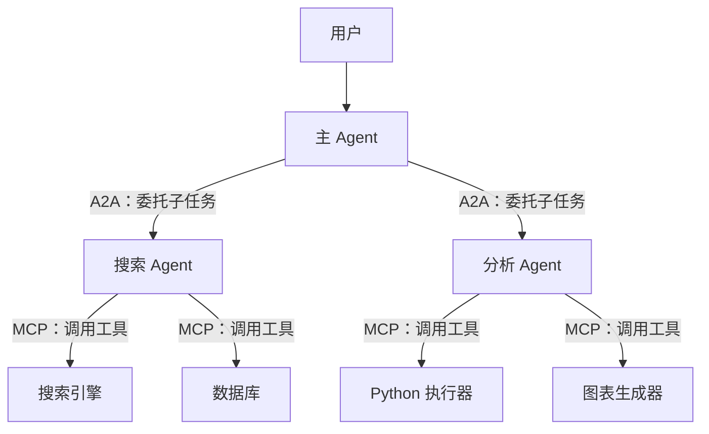

# 多智能体协作：角色分工、通信机制与冲突仲裁

多智能体协作是 Agent 面试中越来越高频的方向。随着单 Agent 能力趋近天花板，面试官开始考察：**你能不能设计一个多 Agent 系统，让它们分工明确、协作高效、出了分歧还能收敛。**

---

## Q：多智能体怎么协作？比如一个写代码一个审查

> 来源：Agent 岗面试高频题

**新手答**：“一个写完发给另一个看就行。”

**高手答**：

多 Agent 协作的核心是**角色隔离 + 通信规范 + 冲突收敛**，不是简单的“你写我看”。

1. **角色定死，职责不交叉**：每个 Agent 的 System Prompt 里明确限定职责和输出格式。比如“程序员”只负责写代码和解释设计意图，“审查员”只负责指出问题和给出修改建议——绝不让审查员自己改代码，否则职责边界模糊，输出会乱
2. **通信用结构化消息**：Agent 之间不传自然语言长文，而是用 JSON 消息体，带上 `task_id`、`role`、`action`、`payload` 等字段。这样既方便下游解析，也方便事后追踪和调试
3. **协作拓扑按场景选**：简单任务用顺序链（写完 → 审查 → 修改）；复杂任务用分治（多个程序员并行写不同模块，汇总后统一审查）；需要讨论的场景用多轮对话（程序员和审查员来回交互，限定最多 3 轮）
4. **冲突必须有收敛机制**：审查员和程序员意见不一致时，不能无限来回。设计一个仲裁者角色（可以是更强的模型，也可以是规则引擎），或者关键步骤直接升级到人工介入

**差距在哪**：新手的回答是一个最简单的两步流程——没有考虑通信格式、冲突处理、拓扑选择。高手的回答覆盖了四个工程维度：角色隔离（谁做什么）、通信规范（怎么传递）、拓扑选择（怎么编排）、冲突收敛（意见不一致怎么办）。面试官考的是“你有没有设计过需要多个组件协作的系统”——多 Agent 协作和微服务架构的思路是相通的。

---

## Q：多 Agent 系统里，怎么防止 Agent 之间“踢皮球”或死循环？

> 来源：Agent 岗面试高频题

**新手答**：“加个超时就行。”

**高手答**：

超时是最后一道防线，但不能只靠它。**踢皮球和死循环的根因是职责模糊或终止条件不明确**：

1. **职责判定前置**：在任务分发层做意图路由，明确判断“这个任务该归谁”。如果路由不确定，直接交给一个“兜底 Agent”处理，而不是让多个 Agent 互相推诿
2. **交互轮次硬限制**：任意两个 Agent 之间的交互最多 N 轮（比如 3 轮），超过就强制输出当前最优结果，不再来回。这个限制写在编排层，Agent 自己不能覆盖
3. **状态机驱动流转**：用状态机管理任务流转，每个状态只能转向有限的下一个状态，不存在“回到原点”的环路。状态转移规则在编排层硬编码，模型无法篡改
4. **全局超时兜底**：整个多 Agent 流程设一个总超时（比如 60 秒），到点不管走到哪一步，都输出当前已有的最优结果并通知用户

**差距在哪**：新手只有超时——这是事后补救。高手的思路是从源头预防：职责判定防踢皮球、轮次限制防无效循环、状态机防非法跳转、超时兜底防极端情况。面试官考的是“你理不理解分布式系统里的活锁问题”，多 Agent 协作本质上就是分布式系统。

---

## Q：多 Agent 之间需要共享状态吗？怎么设计？

> 来源：Agent 岗面试高频题

**新手答**：“放 Redis 里，大家都能读写。”

**高手答**：

需要共享，但**绝不能裸读写**，否则会出现状态冲突和覆盖问题。我们用**黑板模式（Blackboard Pattern）**：

1. **中央状态存储**：一个所有 Agent 都能访问的共享空间（可以是 Redis、数据库、甚至内存字典），存储当前任务的全局状态——任务进度、中间结果、关键决策
2. **读写权限分离**：每个 Agent 只能写自己职责范围内的字段。程序员只能写 `code_output`，审查员只能写 `review_comments`，互不干扰
3. **事件驱动触发**：Agent 不轮询黑板，而是通过事件机制——当某个字段被更新时，自动通知订阅了这个字段的下游 Agent。比如 `code_output` 写入后，自动触发审查员开始工作
4. **版本化防覆盖**：关键字段带版本号，更新时做乐观锁检查，防止并发写入覆盖

**差距在哪**：新手的“放 Redis”解决了存储问题，但没考虑并发冲突、权限隔离、触发机制。高手的黑板模式是一个经典的多智能体架构模式——有读写隔离、事件驱动、版本控制。面试官考的是“你有没有多组件共享状态的设计经验”，如果你做过消息队列或事件总线系统，这道题的思路是一样的。

---

## Q：单 Agent 还是多 Agent 的？子 Agent 的任务是什么？

> 来源：抖音基础架构 Agent 一面

**新手答**：“用一个 Agent 就行。”

**高手答**：

以 AI 代码测试系统为例，用多 Agent 架构，分四个角色：

```text
┌─────────────┐     ┌─────────────┐     ┌─────────────┐     ┌─────────────┐
│  代码分析器   │ ──→ │  测试生成器   │ ──→ │  测试验证器   │ ──→ │  覆盖率检查器 │
│  Analyzer    │     │  Generator   │     │  Validator   │     │  Coverage    │
└─────────────┘     └─────────────┘     └─────────────┘     └─────────────┘
```

1. **代码分析器**：解析待测代码的 AST，提取函数签名、依赖关系、分支结构、复杂度指标，输出结构化的分析报告
2. **测试生成器**：基于分析报告和提示词模板，生成测试代码。它只负责“写”，不负责“验”
3. **测试验证器**：执行生成的测试，检查语法是否正确、能否通过编译、断言是否合理。失败的用例连同错误信息反馈给生成器重试
4. **覆盖率检查器**：跑覆盖率工具，分析哪些分支没覆盖到，把未覆盖的分支信息反馈给生成器做补充生成

拆成多 Agent 的原因：**每个环节的失败模式不同，分开才能精准重试**。生成失败和验证失败的处理逻辑完全不一样，混在一起会导致无效重试。

**差距在哪**：新手默认用单 Agent 解决所有问题。高手的多 Agent 架构有明确的拆分理由——不同环节的失败模式不同，分开才能精准处理。面试官考的是你为什么拆、怎么拆、拆完各个子 Agent 之间怎么协调。

---

## Q：怎么判断一个 Agent 该做成单 Agent，还是多 Agent？

> 来源：腾讯大模型应用开发二面

**新手答**：“复杂任务用多 Agent，简单任务用单 Agent。”

**高手答**：

关键不是任务听起来复不复杂，而是三个判断维度：

1. **能力边界是否清晰**：如果任务里包含明显不同的专业能力（代码修改、合规审查、数据分析），拆开更清晰
2. **上下文是否容易污染**：不同子任务的中间状态混在一起会互相干扰时，隔离有价值
3. **是否存在天然并行**：多个子任务可以同时进行时，多 Agent 能降低总延迟

如果整个任务虽然长，但上下文高度统一，一个 Agent 加状态机通常就够了。

多 Agent 的好处是职责分离、上下文隔离、局部优化方便，但**成本也更高**——需要处理通信、调度和一致性。所以不是越多 Agent 越高级，很多场景单 Agent 反而更稳。只有在“拆开明显比揉在一起更好管”的时候，多 Agent 才值得做。

**差距在哪**：新手用“复杂 vs 简单”做判断——这个维度太模糊。高手给出了三个具体判断标准（能力边界、上下文污染风险、天然并行性），且指出多 Agent 的隐性成本。面试官考的是你选架构时有没有明确的判断框架，而不是凭感觉。

---

## Q：在多 Agent 协作系统中，记忆应该如何共享？是全局共享还是每个 Agent 独立？

> 来源：后端 AI 八股 / Memory 系统

**新手答**：“全部共享，大家都能看到。”

**高手答**：

既不是全局共享，也不是完全独立——是**分层共享**：

| 记忆层 | 共享范围 | 示例 |
|-------|---------|------|
| 全局共享记忆 | 所有 Agent 可读 | 用户画像、系统规则、全局上下文 |
| 团队共享记忆 | 同一任务的 Agent 组可读写 | 当前任务的中间结果、协作状态 |
| 私有记忆 | 单个 Agent 独占 | Agent 自己的推理过程、工具调用中间态 |

关键设计原则：
1. **读写权限分离**：全局记忆大部分 Agent 只读，只有特定角色能写
2. **传结论不传过程**：Agent 之间共享的是结构化结论（“查到用户订单号是 XXX”），不是原始推理链
3. **版本化防冲突**：共享记忆带版本号，并发写入时用乐观锁，防止互相覆盖
4. **按需订阅**：Agent 不轮询共享记忆，而是订阅自己关心的字段变更，事件驱动

全局共享的风险是上下文污染——A Agent 的中间推理被 B Agent 当成事实。完全独立的问题是信息孤岛——Agent 之间重复劳动。分层共享是平衡点。

**记忆隔离与上下文污染防治**：

在多 Agent 系统中，不同 Agent 使用不同工具，工具返回的原始数据如果不经处理就写入共享记忆，会造成**跨工具上下文污染**——A Agent 的搜索结果被 B Agent 当成事实依据。

防治措施：

| 污染类型 | 具体表现 | 防治方案 |
|---------|---------|---------|
| 工具结果泄漏 | Agent A 的搜索结果被 Agent B 误用 | 工具返回值只写入调用者的私有记忆，共享记忆只存结论 |
| 推理过程泄漏 | Agent A 的 chain-of-thought 被 Agent B 当成事实 | 严格区分“推理过程”和“确认结论”，只共享后者 |
| 状态竞态 | 并发 Agent 同时更新共享状态，互相覆盖 | 乐观锁 + 版本号，冲突时由编排层仲裁 |
| 角色混淆 | 共享上下文中包含多个 Agent 的指令，模型混淆角色 | 每条共享信息标注来源 Agent ID 和角色 |

核心原则：**共享记忆中只存“what”（结论和事实），不存“how”（推理过程和工具原始返回）**。每个 Agent 的 thinking 和 tool outputs 严格限制在私有空间内。

**差距在哪**：新手要么全共享（污染风险）要么全独立（效率低）。高手用三层共享模型平衡了协作效率和隔离安全，且给出了权限、传递、版本、订阅四个关键设计点。面试官考的是你对多组件共享状态的架构设计能力。

---

## Q：多 Agent 设计里，按“职能拆分”和按“阶段拆分”各有什么优缺点？

> 来源：Agent 开发面试 30 题

**新手答**：“按职能拆更清晰。”

**高手答**：

两种拆分方式解决的是不同的问题，不存在“哪个更好”：

**按职能拆分（Functional Split）**：

```text
用户请求 → 路由器 → 搜索 Agent / 计算 Agent / 写作 Agent / 数据库 Agent
```

每个 Agent 有独立的能力域，路由器根据用户意图分发。

| 优点 | 缺点 |
|------|------|
| 职责清晰，每个 Agent 的 Prompt 和工具集精简 | 复杂任务需要多个 Agent 协作，通信成本高 |
| 单个 Agent 可独立优化和测试 | 路由器成为单点瓶颈，路由错了全盘皆输 |
| 新增能力只需加一个 Agent，不影响其他 | 跨 Agent 的状态共享是难题 |

**按阶段拆分（Stage Split）**：

```text
用户请求 → 理解 Agent → 规划 Agent → 执行 Agent → 总结 Agent
```

每个 Agent 负责任务流水线的一个阶段，依次传递。

| 优点 | 缺点 |
|------|------|
| 流程清晰，每步输出是下步输入 | 增加一个阶段需要改整条链路 |
| 天然适合有明确先后依赖的任务 | 前一阶段出错，后续全部受影响（错误级联） |
| 状态传递简单（线性传递） | 不适合需要灵活分支的场景 |

**实际工程中的选择标准**：

- 任务类型多样、各子任务独立性强 → 职能拆分（如客服系统：查询/投诉/咨询各一个 Agent）
- 任务流程固定、阶段依赖强 → 阶段拆分（如代码审查：理解 → 分析 → 修复建议 → 总结）
- 两者可以嵌套：宏观按阶段拆，某个阶段内部按职能拆

**差距在哪**：新手只知道职能拆分。高手对比了两种拆分方式的优缺点和适用场景，且指出两者可以嵌套组合。面试官考的是你在多 Agent 架构设计时有没有系统性的拆分思路。

---

## Q：Handoff 的核心难点是什么？是路由问题、状态传递问题，还是权限边界问题？

> 来源：Agent 开发面试 30 题

**新手答**：“主要是路由问题，让请求到正确的 Agent。”

**高手答**：

Handoff（Agent 间交接）的难点**三个都有**，但最容易被低估的是**状态传递**。

**路由问题——最显眼但最好解决**：

用意图分类器或模型判断“该交给哪个 Agent”，准确率做到 90%+ 不难。兜底方案也简单——路由错了让目标 Agent 检测到不属于自己的任务后回退。

**权限边界——重要但相对静态**：

每个 Agent 的工具访问权限、数据访问范围可以在配置中明确定义。Handoff 时校验目标 Agent 是否有权限处理该任务。这是设计时就能确定的，运行时不太会变。

**状态传递——最隐蔽也最容易出问题**：

```text
Agent A 和用户聊了 10 轮 → Handoff 到 Agent B
Agent B 需要知道什么？

❌ 把 A 的全部对话历史传过去 → B 的上下文被污染，A 的推理过程干扰 B 的判断
❌ 只传最后一条消息 → B 丢失了关键约束（用户预算、偏好等）
✅ 传结构化的"交接摘要" → 任务目标 + 关键约束 + 已完成步骤 + 未完成步骤
```

状态传递的核心难点是**信息的取舍**——传多了上下文污染，传少了信息缺失。最佳实践是定义标准化的 Handoff Protocol：

```json
{
  "task_goal": "帮用户订北京到上海的机票",
  "constraints": {"budget": 2000, "date": "2026-04-20", "class": "经济舱"},
  "completed_steps": ["已查询航班列表", "用户选择了 CA1234"],
  "pending_steps": ["确认支付", "出票"],
  "handoff_reason": "进入支付环节，需要支付 Agent 处理"
}
```

**差距在哪**：新手只看到路由问题。高手分析了三个难点的层次——路由最显眼但最好解决，权限重要但静态，状态传递最隐蔽也最关键，且给出了标准化 Handoff Protocol 的设计。面试官考的是你对多 Agent 交接的工程化理解深度。

---

## Q：MCP 和 A2A 分别解决什么层面的问题？如果系统同时用了两者，架构上怎么分工？

> 来源：Agent 开发面试 30 题

**新手答**：“MCP 是调工具的，A2A 是 Agent 之间通信的。”

**高手答**：

方向对，但需要精确区分**协议层次和解决的核心问题**：

**MCP（Model Context Protocol）——Agent 与工具/资源的连接协议**：

解决的是“Agent 怎么发现和调用外部能力”——数据库查询、API 调用、文件读写等。本质是**Agent 到工具的标准化接口**，类似于 USB 协议让电脑能接各种外设。

```text
Agent ──MCP──→ 工具 A（数据库查询）
Agent ──MCP──→ 工具 B（搜索引擎）
Agent ──MCP──→ 工具 C（代码执行）
```

**A2A（Agent-to-Agent）——Agent 与 Agent 的协作协议**：

解决的是“多个 Agent 怎么互相发现、通信和协作”——任务委托、结果回传、状态同步。本质是**Agent 到 Agent 的通信协议**，类似于 HTTP 让不同服务之间能互相调用。

```text
Agent A ──A2A──→ Agent B（委托子任务）
Agent B ──A2A──→ Agent A（返回结果）
Agent A ──A2A──→ Agent C（并行委托）
```

**两者同时使用时的架构分工**：



- **A2A 负责“水平”通信**：Agent 之间的任务分发、结果汇总、状态协调
- **MCP 负责“垂直”连接**：每个 Agent 向下调用自己需要的工具和资源

两者不冲突，是**不同层次的协议**——A2A 解决组织协作问题，MCP 解决能力接入问题。类比公司组织：A2A 是部门之间的沟通协议，MCP 是员工使用办公工具的标准接口。

**差距在哪**：新手把两者简单对立。高手明确了两者的协议层次（水平通信 vs 垂直连接），且给出了同时使用时的架构图和分工原则。面试官考的是你对 Agent 协议生态的理解——不只是“知道”这两个概念，而是知道它们在系统架构中的位置。

---

## Q：什么时候该用 subagent？为什么工具调用多就倾向用 subagent？

> 来源：蚂蚁集团一面

**新手答**：“工具调用多就用 subagent，少就不用。”

**高手答**：

用不用 subagent 的核心判断不是“工具调用多不多”，而是**上下文隔离的收益是否大于通信的成本**。

**什么时候该用 subagent**：

1. **子任务会产生大量中间结果，但主任务只需要最终结论**：比如“搜索 10 个文件找到某个函数定义”——subagent 内部产生大量搜索结果和文件内容，主 agent 只需要一个文件路径和行号。如果不用 subagent，这些中间结果会污染主 agent 的上下文窗口
2. **子任务的上下文和主任务高度不相关**：主任务在做代码重构规划，中间需要查一下某个 API 的用法文档——两者的上下文完全不同，混在一起会干扰主任务的推理
3. **需要并行处理多个独立子任务**：比如同时在三个模块里查找某个接口的调用方，三个搜索互不依赖，用 subagent 可以并行执行

**为什么工具调用多就倾向用 subagent**：

工具调用多意味着**中间状态膨胀快**。每次工具调用的输入和返回都会占用上下文窗口：

```text
主 agent 直接调 10 次工具：
  上下文增量 = 10 × (工具调用描述 + 工具返回结果) ≈ 数千 token
  → 主任务的原始上下文被稀释，推理质量下降

用 subagent 封装：
  上下文增量 = 1 × subagent 返回的结论摘要 ≈ 几百 token
  → 主任务上下文保持干净
```

本质上，subagent 是一种**上下文管理策略**——用进程隔离的思路解决上下文污染问题。和操作系统里“子进程做脏活、父进程只看结果”是同一个思路。

**差距在哪**：新手把 subagent 当成“工具调用多时的自动选择”。高手理解 subagent 的核心价值是上下文隔离，判断标准是“中间结果对主任务有没有价值”。面试官考的是你对上下文管理的工程化理解。

---

## Q：任务简单但工具调用多，用 subagent 是否浪费 token？怎么解决？

> 来源：蚂蚁集团一面

**新手答**：“简单任务就不用 subagent 了，直接调工具。”

**高手答**：

这个问题的核心矛盾是：**subagent 有启动成本（system prompt + 上下文初始化），但简单任务的推理本身不需要那么多 token**。

先量化一下成本：

| 方案 | token 消耗构成 | 适合场景 |
|------|-------------|---------|
| 主 agent 直接调工具 | 工具调用 × N（累积在主上下文中） | 工具调用少（<3 次），结果对主任务有用 |
| 启动完整 subagent | system prompt + 任务描述 + N 次工具调用 + 总结 | 工具调用多，需要独立推理 |
| 轻量级工具链 | 预定义的工具编排序列，无需模型推理 | 流程固定，不需要模型判断 |

**解决方案是分层处理**：

1. **简单 + 工具少**（如“读取某文件的第 10 行”）→ 主 agent 直接调，不值得启动 subagent
2. **简单 + 工具多但流程固定**（如“在 5 个目录里分别执行 ls”）→ 用**轻量工具链**，把多次工具调用编排成一个复合操作，不经过模型推理，零 token 消耗
3. **简单 + 工具多但需要判断**（如“搜索某个函数定义，可能在多个文件里”）→ 用 subagent，但**精简 system prompt**，只给必要的任务描述，不加载完整的能力描述

关键洞察：**“浪费 token”的根源不是 subagent 本身，而是没有根据任务复杂度调整 subagent 的“规格”**。就像不需要为查一个文件启动一台虚拟机——轻量容器就够了。

**差距在哪**：新手把 subagent 当成全有或全无的选择。高手给出了三级分层方案——直接调用、轻量工具链、精简 subagent，根据任务特征选最经济的方案。面试官考的是你对 Agent 系统成本控制的精细化思维。

---

## Q：图片信息怎么在 subagent 之间流转？

> 来源：蚂蚁集团一面

**新手答**：“把图片传给下一个 subagent 就行。”

**高手答**：

图片在 subagent 间流转的核心挑战是**多模态数据的序列化成本远高于文本**。一张图片编码成 token 可能占几百到上千 token，如果在 subagent 之间原样传递，成本和延迟都会爆炸。

**三种流转策略**：

**1. 传引用，不传内容（首选）**

```text
subagent A 处理图片 → 输出：{image_ref: "cache://img_001", description: "架构图，包含三层..."}
subagent B 接收引用 → 需要时才通过 image_ref 加载原图
```

把图片存在共享缓存（内存/磁盘/对象存储），subagent 之间只传引用 ID 和文本描述。大多数下游 subagent 只需要文本描述就够了，只有真正需要“看图”的 subagent 才加载原图。

**2. 传结构化摘要（最省 token）**

如果上游 subagent 已经理解了图片内容，直接传结构化的理解结果：

```json
{
  "image_type": "流程图",
  "entities": ["用户请求", "API 网关", "服务集群"],
  "relationships": ["用户请求 → API 网关 → 服务集群"],
  "key_info": "三层架构，网关做鉴权和限流"
}
```

下游 subagent 拿到结构化数据就能工作，完全不需要再看图片。

**3. 多分辨率传递（平衡质量和成本）**

对同一张图片生成多个版本：缩略图（低 token）、中等分辨率、原图。根据下游任务需要选择合适的分辨率：

- 只需要判断“这是什么类型的图” → 缩略图
- 需要读取图中文字 → 中等分辨率
- 需要精细分析细节 → 原图

**核心原则**：图片数据在 subagent 间流转时，**能用文本描述替代就用文本，能用引用替代就用引用，只有确实需要视觉理解时才传递图片本体**。这和微服务间传大对象的思路一样——传 ID 不传 blob。

**差距在哪**：新手想到的是直接传图片——这是最暴力也最浪费的方式。高手给出了引用传递、结构化摘要、多分辨率三种策略，核心思想是“尽可能用低成本的信息载体替代高成本的原始数据”。面试官考的是你对多模态系统中数据流转的工程化设计能力。

---

## 这类题的答题模式

多智能体协作题的核心是**系统设计思维**：

```text
1. 角色必须隔离——职责不交叉，输出格式固定
2. 通信必须结构化——JSON 消息体，带 task_id，方便追踪
3. 协作拓扑按场景选——顺序链、分治、多轮对话各有适用场景
4. 冲突必须有收敛机制——仲裁者、轮次限制、人工升级
5. 共享状态用黑板模式——读写隔离、事件驱动、版本控制
```

面试官听到“写完发给另一个看”就知道你只跑过 Demo。听到角色隔离、结构化通信、状态机编排、黑板模式，才会觉得你做过需要多组件协作的真实系统。

下一篇建议继续看：

- [工程化踩坑：死循环、状态丢失与成本控制](../07-engineering-pitfalls/index.html)
