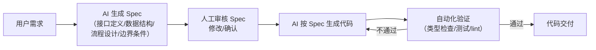
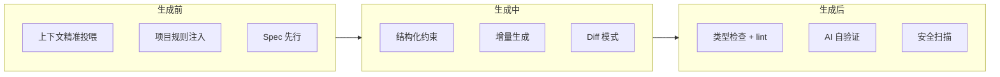
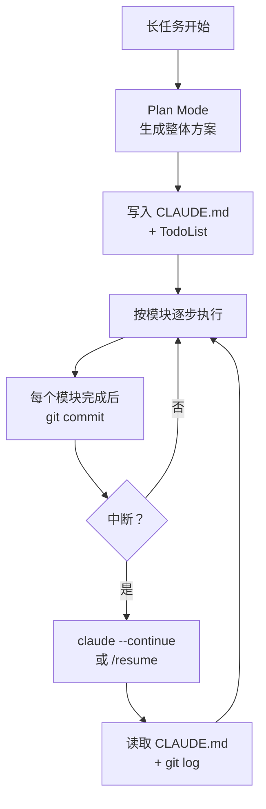
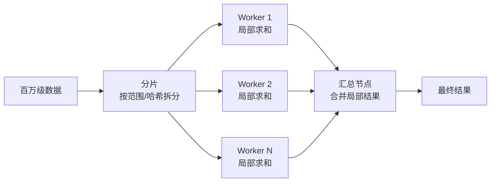
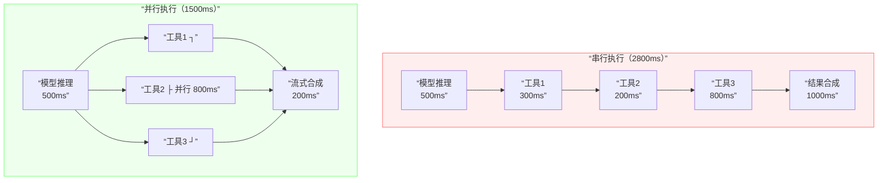
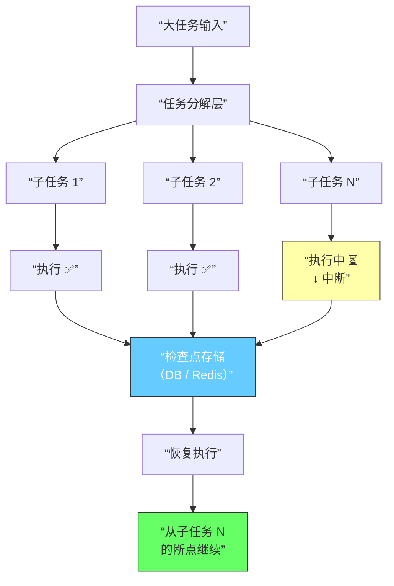
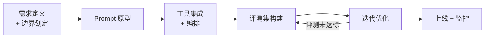
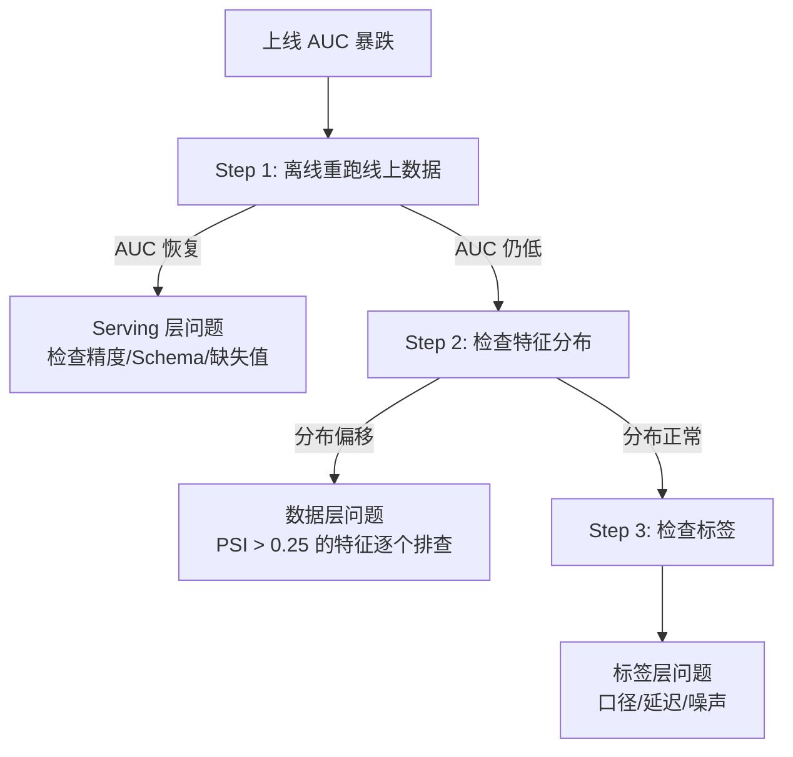
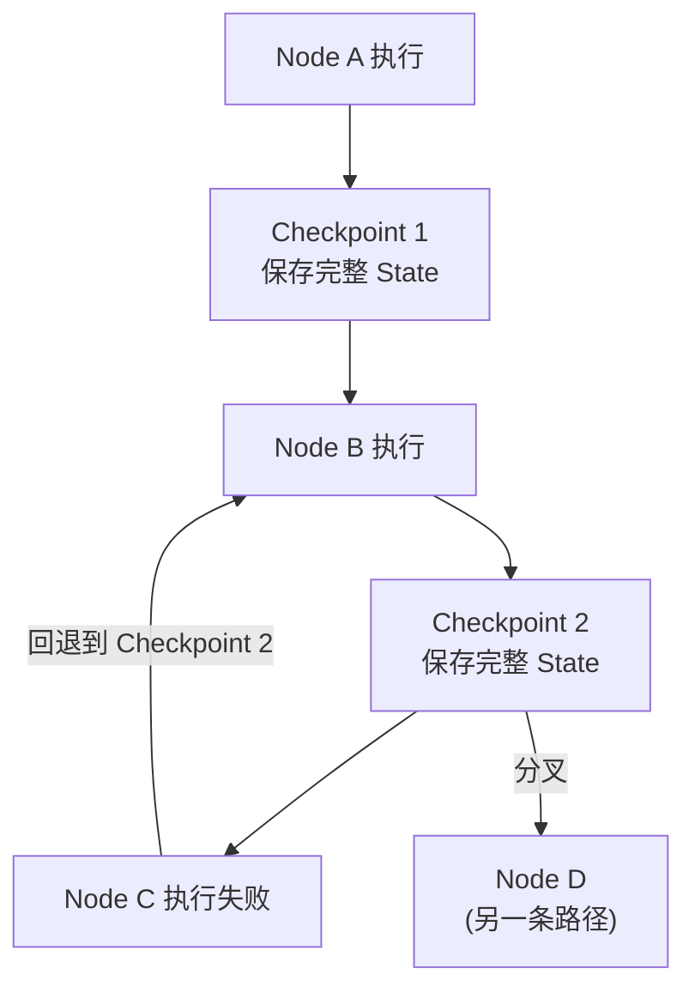

# 工程化踩坑：死循环、状态丢失与成本控制

踩坑题是面试的“照妖镜”——没做过的人编不出来。面试官问这类题不是要标准答案，而是**看你有没有在生产环境里摔过跤、摔完有没有系统性地解决**。答得出具体的坑和对应的工程方案，比答十道理论题都管用。

---


## 踩坑与经验总结

### Q：开发 Agent 时踩过什么坑？

> 来源：Agent 岗面试高频题

**新手答**：“模型有时候不听话，输出格式不对。”

**高手答**：

坑太多了，挑几个最痛的：

### 坑一：死循环——模型反复调同一个工具

模型调了一个工具拿到错误结果，然后用一模一样的参数再调一次，无限循环。

**解法**：① 加失败计数器，同一工具连续失败 2 次直接终止该路径；② 每次重试前让模型先分析上次失败原因，强制改变参数或策略；③ 超过全局步数上限（比如 15 步）直接结束，输出当前最优结果。

### 坑二：状态丢失——多轮对话里关键信息不翼而飞

用户在第 3 轮说了“预算 5000 以内”，到第 10 轮模型推荐了个 8000 的方案。不是模型故意忽略，是上下文太长被截断了，或者关键信息被淹没。

**解法**：① 关键参数实时抽取，写入独立的状态存储（Redis / 数据库），不依赖上下文承载；② 每次调用模型时，把当前任务的关键约束作为 System Prompt 的一部分强制注入，而不是埋在历史消息里；③ 定期用模型做自检——“当前任务的约束条件有哪些？”，发现遗漏立刻补回来。

### 坑三：JSON 解析翻车——模型输出“差一点点”的 JSON

模型返回的 JSON 格式上“几乎正确”——多了个逗号、少了个引号、在 JSON 前面加了句“好的，以下是结果：”。用 `json.loads()` 直接崩。

**解法**：① 用正则先提取 JSON 块（匹配 `{...}` 或 `[...]`），再解析；② 用 `json-repair` 之类的库做容错解析；③ 最根本的解法：用模型原生的 function calling / structured output，不要让模型自己拼 JSON 字符串。

### 坑四：成本失控——一个任务烧掉几十块

复杂任务里模型思考了 30 步，每步都带完整上下文，token 量指数级增长。一个用户的一次请求可能烧掉几十块钱。

**解法**：① 限制每轮 token 数上限，每个 Agent 有独立的 token 预算；② 实时监控单任务累计成本，超过阈值自动告警并降级（比如切换到更便宜的模型）；③ 上下文管理做好——中间结果落库、历史消息压缩，从源头减少 token 消耗。

**差距在哪**：新手只能说出一个笼统的“输出格式不对”。高手每个坑都有三层结构：① 具体的故障现象（什么情况下出的）；② 根因分析（为什么会这样）；③ 系统性的解法（不是临时 patch，而是工程化方案）。面试官考的是“你踩过坑之后有没有复盘和系统性修复的习惯”。

---

### Q：Agent 的成本怎么控制？线上烧钱太快怎么办？

> 来源：Agent 岗面试高频题

**新手答**：“用更便宜的模型。”

**高手答**：

换模型是最后的手段，换了可能效果也打折。成本控制要从**架构层面**系统性地做：

1. **分级调度**：不是所有步骤都需要最强模型。意图识别、参数校验这种简单任务用小模型（7B / 14B），只有核心推理环节才用大模型。一个任务里可能 80% 的调用走小模型，只有 20% 走大模型
2. **Token 预算制**：每个任务有 token 预算上限，执行过程中实时统计。接近预算时自动触发“省钱模式”——压缩上下文、跳过非必要步骤、简化输出
3. **缓存复用**：相似请求的中间结果做缓存。比如“查北京天气”这种高频工具调用，5 分钟内的结果直接复用，不重复调用 API 也不重复让模型处理
4. **超预算熔断**：单用户单日消费超过阈值，自动限流或降级。这不只是省钱，也是防止恶意用户用 prompt injection 让 Agent 无限循环烧钱

**差距在哪**：新手的”换模型”是一维思考——只在模型选择上做文章。高手的方案是四维的：调度策略（谁用什么模型）、预算控制（花多少停）、缓存复用（重复的不花）、熔断保护（异常的不让花）。面试官考的是”你有没有成本意识和系统设计能力”——这和后端系统的限流、降级、熔断是同一套思路。

**追问：开源 Agent 框架（如 LobeChat）为什么特别容易烧 token？**

> 来源：字节实习二面

LobeChat 等开源 Agent 框架烧 token 的原因不是框架本身”浪费”，而是**默认配置追求通用性而非经济性**：

1. **全量对话历史注入**：每次请求把完整对话历史发给模型，10 轮对话后上下文可能已经 8000+ token，但其中大部分和当前问题无关。没有做摘要压缩或滑动窗口
2. **System Prompt 膨胀**：支持多种场景的通用 System Prompt 往往很长（2000+ token），每次请求都重复发送
3. **插件/工具描述全量加载**：即使用户只需要搜索功能，所有已安装插件的 schema 都会写进 tools 参数，每次调用都消耗 token
4. **缺少缓存层**：相似问题每次都重新调模型，没有语义缓存。尤其高频场景（”今天天气””最新新闻”）可以直接返回缓存结果
5. **模型选择不分级**：所有任务都走同一个大模型，没有根据任务复杂度做路由——简单的意图识别和复杂的推理任务用同样贵的模型

**优化方向**就是上面四条策略的具体化：压缩历史、动态加载工具 schema、加语义缓存、做模型路由。

---

### Q：为什么很多 Agent Demo 很惊艳，但一上线就不稳定？

> 来源：腾讯大模型应用开发二面

**新手答**：“因为线上环境比 Demo 复杂。”

**高手答**：

Demo 往往是在理想条件下演示的——输入干净、工具有限、单次任务、短上下文。模型只要看起来会做事就行了。但线上环境完全不一样：

```text
Demo 环境：理想输入、有限工具、单次任务、短上下文
线上环境：输入脏、任务长、工具多、状态复杂、异常频繁、权限安全约束
```

Demo 能跑通，只能说明“这个方向可能”。线上稳定，说明的是**你把模型的不确定性关进了工程笼子里**。

真正难的是做治理，不是做演示。很多团队一开始觉得问题在模型不够强，后来才发现大量问题其实来自**状态管理、工具设计、上下文污染和缺少容错机制**。

**差距在哪**：新手只说了“环境复杂”——这是现象不是分析。高手指出了 Demo 和生产环境的具体差异（输入质量、任务长度、状态管理、异常处理），且点出了核心观点：“稳定不靠模型强，靠工程治理”。面试官考的是你有没有把 Agent 从 Demo 推到生产的实战经验。

---


## AI 工具与框架

### Q：平时用过哪些 AI Agent 工具？

> 来源：腾讯 Agent 应用开发一面

**新手答**：“用过 ChatGPT。”

**高手答**：

AI Agent 工具按用途分三类：

| 类别 | 代表工具 | 特点 |
|------|---------|------|
| 通用对话型 | ChatGPT、Claude、Kimi | 单轮/多轮问答，不主动执行操作 |
| 开发框架型 | LangChain、LangGraph、Dify、Coze | 提供编排、工具调用、记忆等基础设施，开发者搭建 Agent |
| AI Coding 型 | Cursor、Claude Code、GitHub Copilot | 直接辅助写代码，有项目上下文感知 |

关键认知：这三类工具解决的问题不同——通用型解决“问答”，框架型解决“编排”，Coding 型解决“开发效率”。实际做 Agent 开发时，框架型和 Coding 型通常同时使用：用 Coding 工具写代码，用框架搭 Agent 流程。

选工具的标准不是“哪个最热”，而是**你的任务需要什么级别的控制力**：简单任务用 Dify/Coze 拖拽搞定；需要自定义编排的用 LangGraph；需要最大灵活性的直接用 SDK + 自建。

**差距在哪**：新手只列了名字。高手按用途做了分类，且说清了选型标准。面试官考的是你对 Agent 工具生态的全局认知。

---

### Q：平时写的代码有多少是 AI 生成的？怎么保证质量？

> 来源：腾讯 Agent 应用开发一面

**新手答**：“大概 50%，然后自己改改。”

**高手答**：

比例因任务类型而异：

- **样板代码**（CRUD、配置、测试骨架）：80%+ 由 AI 生成，人工只做审查和微调
- **核心业务逻辑**（算法、状态机、并发控制）：AI 生成初版，人工大幅修改，实际保留 30-40%
- **架构设计和技术选型**：AI 提供选项和分析，但决策完全由人做

保证质量的方法不是“自己改改”，而是**流程化的质量门禁**：

1. **生成前约束**：给足上下文（类型定义、接口规范、项目规则文件），让 AI 一次生成质量更高的代码
2. **生成后审查**：AI 生成的代码必须过 Code Review，重点看边界条件、安全漏洞、和已有代码的一致性
3. **自动化验证**：类型检查（TypeScript）、lint、单元测试必须通过。AI 容易写出“看起来对但类型不安全”的代码

核心原则：**AI 生成的比例不重要，重要的是每行代码都经过了验证**。

**怎么回答“占比多少”这类问题**：

面试官问这道题不是想听一个数字，而是考察你对 AI 辅助开发的**认知成熟度**。回答时避免两个极端：说“90% AI 写的”会让面试官觉得你不审代码；说“很少用”会让面试官觉得你效率低。正确的回答结构是：**按任务类型分层 → 每层给一个合理比例 → 重点讲质量保障流程**。数字本身不重要，展示你对“人机协作边界”的清晰认知才重要。

**差距在哪**：新手只给了一个比例。高手按任务类型分了不同比例，且给出了系统化的质量保障方法。面试官考的是你对 AI 辅助开发的成熟度。

---

### Q：你熟悉的 Agent 框架，在架构设计上有什么优势？

> 来源：腾讯 Agent 应用开发一面

**新手答**：“它用了 LLM，很智能。”

**高手答**：

以 OpenClaw 为例，它的架构优势体现在三个层面：

1. **编排层和能力层分离**：编排层（状态机/DAG）负责“做什么、按什么顺序做”，能力层（LLM 调用、工具执行）负责“具体怎么做”。分离后编排逻辑可以独立测试和复用，不和模型调用耦合
2. **工具即插件**：工具通过标准化接口（类似 MCP 的 tool schema）注册，新增工具不需要改编排代码。这让工具生态可以独立演化
3. **上下文管理可配置**：不是硬编码“保留最近 N 轮”，而是提供多种上下文策略（滚动窗口、摘要压缩、按需召回），开发者根据场景组合

这三个优势的共性是**关注点分离**——编排、能力、工具、上下文各自独立演化，互不干扰。这和微服务架构的设计哲学是一致的。

**差距在哪**：新手用“智能”概括一切。高手从编排/能力分离、工具插件化、上下文可配置三个架构决策分析优势。面试官考的是你对框架的理解是“会用”还是“理解设计”。

---

### Q：自己做 Agent 时，踩过最大的坑是什么？

> 来源：腾讯 Agent 应用开发一面

**新手答**：“模型输出不稳定。”

**高手答**：

最大的坑是**过度信任模型的“理解力”，导致状态管理全靠上下文承载**。

早期做 Agent 时，觉得模型能“记住”之前的对话，所以把关键参数（用户偏好、任务进度、中间结果）全放在对话历史里。结果上下文一长，模型就开始丢信息、乱推理——用户在第 3 轮说的约束条件，到第 10 轮完全被忽略。

**系统性修复**：把“模型记住”改成“系统记住”——
1. 关键参数实时提取到独立的状态存储（Redis / 数据库），不依赖上下文
2. 每轮调用前把当前约束条件作为 System Prompt 的固定部分强制注入
3. 中间结果落库，上下文里只留一句摘要

这个坑的本质是：**Agent 的上下文窗口是“工作台”，不是“仓库”**。工作台上只放当前步骤需要的东西，其他全放仓库里按需取。

**差距在哪**：新手说“不稳定”是表象。高手指出了根因（过度依赖上下文承载状态）和系统性解法（状态外置 + 强制注入 + 落库）。面试官考的是你踩坑后有没有做过根因分析和系统性修复。

---

### Q：用过哪些 Code Agent？有什么优缺点？

> 来源：腾讯 AI 应用开发 【淘天Agent开发追问：AI辅助编程工作流拆解 + 提示词策略与人工审核介入点】

**新手答**：“用过 Copilot，挺好用的。”

**高手答**：

目前 Code Agent 工具分两类：**IDE 集成型**和**终端独立型**，工程定位不同。

| 类型 | 代表工具 | 优点 | 缺点 |
|------|---------|------|------|
| IDE 集成型 | Cursor / Windsurf / Copilot | 感知项目上下文（目录、类型、导入），补全即时、改完直接看 diff | 对大规模跨文件重构支持有限 |
| 终端独立型 | Claude Code / Codex CLI / Aider | 能执行 shell 验证代码、跑测试、做 git 操作；全局视角 | 没有实时补全体验，需要更多上下文描述 |

**实际使用策略**——两类互补而非互斥：
- 写新功能、局部修改 → IDE 集成型（实时补全 + 即时预览）
- 跨文件重构、项目搭建、调试排查 → 终端型（能执行验证 + 全局操作）
- 两类工具都受益于**项目级规则约束**（CLAUDE.md / .cursorrules），定义编码规范和技术栈约束后输出质量显著提升

核心认知：Code Agent 的瓶颈通常不是模型能力，而是**上下文不足和约束不够**——给足项目规则和相关代码上下文，输出质量有质的飞跃。

**日常 AI Coding 的实战工作流**：

“平时怎么用 AI Coding”是近期高频面试题，面试官想听的不是”用 Cursor 写代码”，而是你的**工作流和方法论**：

**高效使用的三层模式**：

| 模式 | 场景 | 具体做法 | 效率提升 |
|------|------|---------|---------|
| **自动驾驶** | 重复性任务（CRUD、测试用例、类型定义） | 给 Agent 明确指令 + 格式要求，让它一次性生成 | 5-10x |
| **副驾模式** | 中等复杂度任务（重构、Bug 修复） | 自己做设计决策，让 AI 执行具体代码变更 | 2-3x |
| **导航模式** | 探索性任务（学新框架、理解陌生代码） | 让 AI 解释代码、提供方案对比，自己做最终判断 | 1.5-2x |

**关键实践原则**：

1. **先给上下文再给指令**：不是直接说”帮我写个排序”，而是先让 AI 读懂项目结构、了解编码规范，再给具体任务
2. **小步验证**：不要让 AI 一次改 20 个文件，而是分步执行、每步验证。一次大改出错了很难定位
3. **AI 生成 → 人类审查 → AI 修正**：不盲信 AI 输出，但也不逐行手改——用 AI 的速度生成，用人的判断审核
4. **知道什么时候不用 AI**：涉及核心业务逻辑的架构决策、安全敏感代码、需要深度理解上下文的 Debug——这些场景人工效率更高

**差距在哪**：新手只评价了”好不好用”。高手按工具类型做了系统对比，且给出了互补使用策略和提升质量的方法论。面试官考的是你对 AI Coding 工具的实际使用深度。

**追问：公司里有几十个应用，改一个需求要动多个系统，AI Coding 怎么处理？**

> 来源：蚂蚁 Agent 开发一面

这道题考的是**当前 AI Coding 的能力边界**——大部分候选人只在单 repo 里用过 AI Coding，面试官想知道你对企业级多系统场景的认知。

**核心矛盾**：当前 AI Coding 工具以单项目为粒度工作，但企业需求往往跨多个仓库（前端、BFF、后端、基础设施）。一个需求改三个系统，AI 只能看到一个。

**分层解决思路**：

| 层级 | 方案 | 适用场景 |
|------|------|---------|
| **人工拆解 + AI 执行** | 人工把跨系统需求拆成每个系统的独立任务，每个任务用 AI 完成 | 当前最实际的方案 |
| **共享接口契约** | 把接口定义（OpenAPI/Proto/GraphQL Schema）作为上下文注入到每个系统的 AI 会话中 | 保证跨系统一致性 |
| **多 Worktree / 多 Session** | 每个系统开独立 session，通过 CLAUDE.md 注入全局需求背景和接口约定 | Claude Code 已原生支持 worktree |
| **编排层协调** | 用一个 orchestrator Agent 分解需求、分发子任务、校验接口一致性 | 未来方向，当前不成熟 |

**当前最佳实践**：

```text
1. 人工做需求拆解和接口设计（AI 最弱的环节）
2. 把接口契约写成文档，作为每个系统 AI 会话的上下文
3. 每个系统用 AI 独立实现，实现完跑集成测试
4. 接口变更时手动同步到其他系统的 AI 上下文
```

**诚实回答**：这个场景是当前 AI Coding 的硬伤——跨系统状态同步、接口一致性保障、变更顺序依赖这些问题，AI 暂时没法自主解决。但人工拆解 + AI 分系统执行 + 契约共享，已经比纯人工效率高很多。

---


## 代码质量与测试

### Q：如何解决大模型 API 服务的响应延迟问题？

> 来源：字节 Agent 实习一面

**新手答**：“用更快的模型。”

**高手答**：

API 服务延迟分两部分：**首 token 延迟（TTFT）** 和**生成吞吐（TPS）**，优化思路不同。

**1. 流式输出（Streaming）**——最直接的体感优化：

- 不等全部生成完再返回，逐 token 流式输出。用户感知延迟从“等 10 秒”变成“0.5 秒就开始看到内容”
- SSE（Server-Sent Events）或 WebSocket 实现

**2. 模型层面**：

- **模型分级调度**：简单请求（分类、提取）用小模型（7B/14B），复杂请求（推理、创作）用大模型。80% 的请求可以用小模型处理，延迟降 5-10 倍
- **量化部署**：INT4/INT8 量化减少计算量和显存占用，推理速度提升 2-3 倍
- **推测解码**：小模型快速生成草稿，大模型批量验证，整体速度提升 2-3 倍

**3. 服务架构层面**：

- **KV Cache 复用**：多轮对话中，前几轮的 KV Cache 不需要重算，缓存后复用，TTFT 大幅缩短
- **Prefix Caching**：共享相同 System Prompt 的请求复用前缀计算结果
- **连续批处理**：vLLM/SGLang 的 continuous batching，请求到达即处理，不等凑满一批
- **负载均衡**：多实例部署 + 按当前负载智能路由，避免单实例过载

**4. 缓存层面**：

- **语义缓存**：对高频相似请求做语义匹配，命中缓存直接返回，不调模型。适合 FAQ 类场景
- **工具结果缓存**：Agent 场景中，工具返回值（天气、股价等）设 TTL 缓存，避免重复调用

**差距在哪**：新手只想到换模型。高手从流式输出、模型分级、服务架构、缓存四个层面做了系统优化，且区分了 TTFT 和 TPS 两种延迟类型。面试官考的是你对大模型服务工程化的理解——延迟优化不只是“模型更快”，而是一个全栈工程问题。

---

### Q：AI Coding 产品怎么测试？从 Demo 到生产可交付还差什么？

> 来源：蚂蚁集团智能体与大模型应用二面

**新手答**：“写几个 case 测一下就行。”

**高手答**：

AI Coding 产品的测试和传统软件测试有本质区别——输出是**概率性的**，同样的输入不一定得到同样的输出，所以不能只靠“写几个 case 通过了就行”。

**测试方法论**：

**1. 构造评估集，不是测几个 case**：

- 设计覆盖不同**代码复杂度**（纯函数 / 有依赖 / 异步 / 并发）和**任务类型**（生成 / 修复 / 重构 / 解释）的评估集
- 每个 case 要有**明确的验收标准**：不是“看起来对”，而是能编译、能通过测试、符合代码规范
- 评估集要包含**边界和对抗 case**：超长文件、语法错误的输入、故意误导的 Prompt

**2. 评估维度不只是“对不对”**：

| 维度 | 指标 | 说明 |
|------|------|------|
| 正确性 | Pass@K、编译通过率 | K 次生成中至少一次正确的概率 |
| 一致性 | 同一输入多次生成的方差 | 输出是否稳定 |
| 安全性 | 有无注入漏洞、敏感信息泄露 | 生成的代码是否安全 |
| 效率 | Token 消耗、端到端延迟 | 成本和速度 |

**从 Demo 到生产可交付，还差什么**：

1. **鉴权和权限控制**：Demo 不需要考虑谁能用、能操作哪些文件。生产环境必须有用户身份验证和操作权限隔离
2. **错误恢复和回滚**：Demo 出错了重来就行。生产环境需要操作日志、变更回滚（类似 git revert）、异常告警
3. **并发和多用户**：Demo 是单用户。生产环境要支持多用户同时使用，状态隔离，资源限制
4. **监控和可观测性**：生成质量监控、成本监控、异常检测、用户反馈收集——没有这些，线上问题完全是黑盒
5. **安全审计**：AI 生成的代码可能引入安全漏洞，生产环境需要自动化安全扫描（SAST/DAST）
6. **CI/CD 集成**：生成的代码要能自动跑 lint、测试、构建，不能只靠人工 review

**差距在哪**：新手的“测几个 case”只是验证“能不能跑”。高手从评估集设计、多维度指标、生产化六大能力（鉴权、回滚、并发、监控、安全、CI/CD）展开。面试官考的不是“会不会测试”，而是你对“把 AI 能力做成产品”这件事的完整认知。

---

### Q：什么是 SDD（Spec-Driven Development）？它和 Skills 有什么区别？

> 来源：蚂蚁集团智能体与大模型应用二面

**新手答**：“SDD 就是先写规格再写代码，Skills 是预定义能力。”

**高手答**：

SDD（Spec-Driven Development，规格驱动开发）是 AI Coding 领域的一种工作流方法——**先让 AI 生成详细的技术规格说明（Spec），人工审核确认后，再让 AI 按照 Spec 生成代码**。

**SDD 的核心流程**：



**为什么要这么做**：直接让 AI 写代码的问题是——需求理解错了，生成的代码再完美也没用。SDD 把“理解需求”和“写代码”拆开，在理解阶段就做人工确认，避免代码写完才发现方向错了。

**SDD vs Skills 的对比**：

| 维度 | SDD | Skills |
|------|-----|--------|
| 本质 | 开发工作流方法论 | Agent 的可复用能力单元 |
| 解决的问题 | “怎么让 AI 写出正确的代码” | “怎么让 Agent 处理特定类型的任务” |
| 关注点 | 需求→规格→代码的转化质量 | 触发匹配→Prompt→工具→输出的执行流程 |
| 人工参与 | 核心环节（审核 Spec） | 可选（配置后自动执行） |
| 适用场景 | 代码生成、架构设计 | 任何 Agent 能力扩展 |
| 输出物 | Spec 文档 + 代码 | 任务执行结果 |

**两者的关系**：不互斥，可以结合。一个“代码生成 Skill”可以内部采用 SDD 流程——Skill 定义了“什么时候触发、用什么工具”，SDD 定义了“触发后按什么步骤生成代码”。

Skills 是**能力的封装方式**，SDD 是**代码生成的质量保障方法**。前者回答“Agent 能做什么”，后者回答“怎么做得对”。

**差距在哪**：新手把两者简单对立。高手看到了它们在不同维度上的定位——SDD 是方法论层面的流程设计，Skills 是系统架构层面的能力封装，两者可以组合使用。面试官考的是你能不能区分“工作流方法”和“系统架构”这两个层次的抽象。

---

### Q：如何保证 AI 代码生成的质量与掌控性？

> 来源：蚂蚁集团 Agent 开发一面

**新手答**：“生成后人工 review 一下。”

**高手答**：

人工 review 是最后一道线，但**不能是唯一一道**。保证质量和掌控性要在生成前、生成中、生成后三个阶段都做控制：

**生成前——约束输入，减少出错空间**：

1. **上下文精准投喂**：给模型完整的类型定义、接口规范、相关测试用例，而不是只给一句需求描述。上下文越精确，生成质量越高
2. **项目规则注入**：通过 CLAUDE.md / .cursorrules 定义编码规范（命名风格、错误处理模式、禁用的 API），让模型生成时就遵守项目约定
3. **Spec 先行（SDD）**：对复杂功能，先让 AI 生成技术规格说明，人工确认后再生成代码。在理解阶段就拦住方向性错误

**生成中——约束输出，缩小自由度**：

4. **Structured Output**：函数签名、返回类型、错误码这些关键接口用 schema 约束，不让模型自由发挥
5. **增量生成**：不让模型一次生成 500 行。拆成小步——先生成函数骨架、再填充逻辑、再补异常处理，每步可验证
6. **Diff 模式**：修改已有代码时，要求模型输出精确的 diff 而非整文件重写，减少意外修改

**生成后——验证结果，兜住底线**：

7. **自动化门禁**：生成的代码必须通过类型检查（TypeScript/mypy）、lint、现有测试套件。不过门禁不允许合入
8. **AI 自验证**：让模型同时生成代码和对应的测试用例，跑通测试才算完成。这不完美，但能抓住明显的逻辑错误
9. **安全扫描**：自动检测常见漏洞模式（SQL 注入、XSS、硬编码密钥），AI 生成的代码更容易引入这类问题



**掌控性的核心原则**：**生成的每一步都要有人类可审查的检查点**。不是“生成完看一眼”，而是“每个阶段都有明确的验收标准”。

**差距在哪**：新手只有事后 review 一道防线。高手在生成前（约束输入）、生成中（约束输出）、生成后（自动验证）三个阶段构建了九道防线。面试官考的是你对 AI 代码生成的质量体系有没有工程化的设计。

---


## 基础设施与算法

### Q：LangGraph 定义的搜索节点做不到并发执行吗？怎么做？

> 来源：AI 工程师面试

**新手答**：“LangGraph 是顺序执行的，做不了并发。”

**高手答**：

LangGraph 完全支持并发执行，有三种方式，适用场景不同：

**方式一：Fan-out / Fan-in（静态并行）**

在 graph 定义时，让多个节点从同一个上游节点出发，形成并行分支，最后汇聚到一个下游节点：

```python
graph.add_edge("plan_node", "search_node_1")
graph.add_edge("plan_node", "search_node_2")
graph.add_edge("plan_node", "search_node_3")
graph.add_edge("search_node_1", "merge_node")
graph.add_edge("search_node_2", "merge_node")
graph.add_edge("search_node_3", "merge_node")
```

三个 search 节点会**并发执行**，全部完成后进入 merge_node。适合**编译时就知道要并行几路**的场景。

**方式二：Send API（动态并行）**

并行数量在运行时才确定时，用 `Send` API 动态创建并行分支：

```python
from langgraph.types import Send

def plan_node(state):
    queries = state["search_queries"]  # 运行时才知道有几个查询
    return [Send("search_node", {"query": q}) for q in queries]

graph.add_conditional_edges("plan_node", plan_node)
```

每个 `Send` 创建一个独立的并发执行分支，适合**搜索数量取决于规划结果**的场景。

**方式三：节点内部 asyncio 并发**

如果只是一个节点内部需要并发调用多个 API：

```python
import asyncio

async def search_node(state):
    queries = state["search_queries"]
    results = await asyncio.gather(*[
        search_api(q) for q in queries
    ])
    return {"search_results": results}
```

**状态合并是关键问题**：

并发节点同时写同一个 state 字段会冲突。LangGraph 用 **Reducer 函数**解决：

```python
from typing import Annotated
import operator

class State(TypedDict):
    # operator.add 表示多个并发节点的结果做列表拼接
    search_results: Annotated[list, operator.add]
```

每个并发分支返回的 `search_results` 会被自动拼接成一个大列表，而不是互相覆盖。

**差距在哪**：新手以为 LangGraph 不支持并发——说明没深入用过。高手给出了三种并发方式（静态 Fan-out、动态 Send、节点内 asyncio），且指出了并发状态合并（Reducer）这个关键问题。面试官考的是你对 LangGraph 并发执行机制的实际掌握程度。

---

### Q：PostgreSQL 的索引结构是什么？索引如何优化查询速度？在 Checkpoint 场景下如何用索引加速？

> 来源：AI 工程师面试

**新手答**：“就是 B+ 树，查询快。”

**高手答**：

PostgreSQL 支持**多种索引类型**，不同索引适用不同查询模式：

| 索引类型 | 底层结构 | 适用查询 | 典型场景 |
|---------|---------|---------|---------|
| **B-Tree**（默认） | 平衡多叉树 | 等值查询、范围查询、排序 | 绝大多数场景的首选 |
| **Hash** | 哈希表 | 纯等值查询 | 精确匹配，如 session_id = 'xxx' |
| **GIN** | 倒排索引 | 包含查询、全文搜索 | JSONB 字段查询、数组包含 |
| **GiST** | 通用搜索树 | 范围重叠、最近邻 | 地理空间、区间查询 |
| **BRIN** | 块范围索引 | 大表上的范围查询 | 时间序列、日志表（数据物理有序时） |

**B-Tree 索引如何加速查询**：

B-Tree 是一棵平衡多叉排序树，每个节点存多个键值和指向子节点的指针。查询时从根节点开始，每一层通过比较快速定位到目标区间，时间复杂度 **O(log N)**：

```text
无索引：全表扫描 100 万行 → 逐行比较 → O(N)
有 B-Tree 索引：树高约 3-4 层 → 3-4 次磁盘 IO → O(log N)
```

关键优化手段：

1. **覆盖索引（Covering Index）**：把查询需要的列都放进索引，查询直接从索引返回，不需要回表
2. **复合索引**：`CREATE INDEX ON checkpoints (thread_id, checkpoint_id DESC)` 一个索引同时支持按 thread_id 过滤 + 按 checkpoint_id 排序
3. **部分索引（Partial Index）**：`CREATE INDEX ON checkpoints (thread_id) WHERE is_active = true` 只索引活跃数据，索引体积更小
4. **Index-Only Scan**：当查询的所有列都在索引中时，PostgreSQL 直接扫描索引，完全跳过堆表

**Checkpoint 场景下的索引设计**：

Checkpoint 表的核心查询模式是：**给定 session_id（thread_id），找到最新的 Checkpoint**。

```sql
-- 最常见的查询：加载最新 checkpoint
SELECT * FROM checkpoints
WHERE thread_id = 'abc-123'
ORDER BY checkpoint_id DESC
LIMIT 1;
```

最优索引：

```sql
-- 复合索引：thread_id 精确匹配 + checkpoint_id 倒序排列
CREATE INDEX idx_checkpoints_thread_latest
ON checkpoints (thread_id, checkpoint_id DESC);
```

这个索引让查询**一次 B-Tree 查找就能定位到目标行**——先按 thread_id 定位到该会话的所有 checkpoint，B-Tree 内部已按 checkpoint_id 倒序排列，直接取第一条就是最新的。

如果 Checkpoint 表还有 JSONB 类型的 `metadata` 字段需要查询（如按节点名过滤）：

```sql
-- GIN 索引支持 JSONB 内部字段查询
CREATE INDEX idx_checkpoints_metadata ON checkpoints USING GIN (metadata);

-- 查询：找所有在 search_node 节点暂停的 checkpoint
SELECT * FROM checkpoints WHERE metadata @> '{"node": "search_node"}';
```

**差距在哪**：新手只知道 B+ 树一个名字。高手区分了五种索引类型及适用场景，详细说明了 B-Tree 的查询加速原理，且结合 Checkpoint 实际场景给出了复合索引 + GIN 索引的具体设计。面试官考的是你能不能把数据库基础知识应用到 Agent 系统的实际存储设计中。

---

### Q：用 Claude Code 做一个比较长的任务，如果遇到单次 session 跑不完、中间断网怎么办？

> 来源：AI 工程师面试

**新手答**：“重新开一个 session 从头做。”

**高手答**：

长任务中断是 AI Coding 工具的常见问题。解决方案分**预防**和**恢复**两个层面：

**预防——降低中断的影响**：

1. **任务拆分**：长任务不要一口气交给 Agent。先用 Plan Mode（`/plan`）生成整体方案，再按模块逐步执行。每完成一个模块就 commit 一次，确保进度不丢
2. **CLAUDE.md 持久化上下文**：把项目的关键信息、架构约定、已完成的进度写在 `CLAUDE.md` 文件中。新 session 启动时会自动读取，相当于给 Agent 一个“接班备忘录”
3. **TodoList 跟踪进度**：用 Claude Code 的任务管理功能（或直接在 CLAUDE.md 中维护 checklist），标记每个子任务的完成状态。中断后可以精确知道“做到哪了”

```text
## 当前任务进度
- [x] 数据库 schema 设计
- [x] API 路由层实现
- [ ] 业务逻辑层实现  ← 断点
- [ ] 单元测试
- [ ] 集成测试
```

4. **高频 git commit**：每完成一个有意义的改动就 commit，不要攒到最后。即使 session 崩了，代码改动不会丢

**恢复——中断后快速接续**：

5. **`--continue` 继续上次对话**：Claude Code 支持 `claude --continue` 直接恢复上一次 session 的对话上下文，从断点继续
6. **`/resume` 恢复任务**：在新 session 中使用 `/resume` 命令，可以加载之前的对话历史和任务状态
7. **Git diff 定位进度**：新 session 中让 Claude Code 执行 `git diff` 和 `git log`，快速了解已完成的改动，从断点处继续

**最佳实践流程**：



核心认知：**长任务的可靠性不靠 session 稳定性保证，而靠“频繁保存 + 上下文持久化 + 快速恢复”的工程习惯**。这和写代码要频繁 commit 是同一个道理——不要把所有筹码押在“一次跑通”上。

**差距在哪**：新手遇到中断只会重来。高手从预防（任务拆分 + CLAUDE.md + TodoList + 高频 commit）和恢复（--continue + /resume + git diff）两个层面给出了完整方案。面试官考的是你用 AI Coding 工具做大型任务时的工程化习惯。

---

### Q：分布式限流算法——令牌桶、漏桶、滑动窗口的区别和实现？

> 来源：快手 AI Agent 开发一面

**新手答**：“用令牌桶限流，每秒放几个令牌。”

**高手答**：

三种限流算法各有适用场景，核心差异在于**对突发流量的处理方式**：

| 算法 | 核心思想 | 允许突发 | 流量整形 | 适用场景 |
|------|---------|---------|---------|---------|
| **令牌桶** | 桶以固定速率填充令牌，请求消耗令牌 | ✅ 桶满时可突发 | ❌ | API 限流（允许短时突发） |
| **漏桶** | 请求先入桶，桶以固定速率漏出处理 | ❌ 强制匀速 | ✅ | 流量整形（保护下游） |
| **滑动窗口** | 统计滑动时间窗口内的请求数 | ❌ 窗口内硬上限 | ❌ | 精确的请求频率控制 |

**令牌桶算法**：

```text
参数：桶容量 capacity、填充速率 rate（个/秒）
状态：当前令牌数 tokens、上次填充时间 last_refill

每次请求：
  1. 计算距上次的时间差，补充令牌：tokens += elapsed × rate
  2. tokens = min(tokens, capacity)  // 不超过桶容量
  3. if tokens >= 1: tokens -= 1, 放行
     else: 拒绝
```

**漏桶算法**：

```text
请求入桶（队列），桶以固定速率出队处理。
桶满时新请求直接丢弃或排队等待。
效果：无论入口流量多不均匀，出口始终匀速。
```

**滑动窗口算法**：

```text
参数：窗口大小 window_ms、最大请求数 max_count

结构体字段：
  window_start: int64    // 当前窗口起始时间戳
  request_count: int      // 窗口内已有请求数
  window_size_ms: int     // 窗口大小（毫秒）
  max_requests: int       // 窗口内允许的最大请求数
  // 精确版还需要：request_timestamps: list  // 每个请求的时间戳

每次请求：
  1. 清除窗口外的过期记录
  2. 统计窗口内请求数
  3. if count < max_count: 记录时间戳, 放行
     else: 拒绝
```

**令牌桶 vs 滑动窗口**：

```text
令牌桶：允许突发（桶满时一次性用完所有令牌），适合"平均速率限制"
滑动窗口：任何时刻窗口内请求数不超限，适合"严格频率限制"

例：限制 100 请求/分钟
  令牌桶：可能在第 1 秒就用完 100 个令牌（突发）
  滑动窗口：任意 60 秒窗口内最多 100 个请求（平滑）
```

**Redis 实现**：

| 算法 | Redis 数据结构 | 实现思路 |
|------|--------------|---------|
| 令牌桶 | String + EXPIRY | 存剩余令牌数，用 Lua 脚本原子操作（补充 + 扣减） |
| 滑动窗口 | Sorted Set（ZSET） | 每个请求以时间戳为 score 加入 ZSET，用 ZREMRANGEBYSCORE 清除窗口外记录，ZCARD 统计窗口内数量 |
| 固定窗口 | String + INCR + EXPIRY | key 为“窗口起始时间”，INCR 计数，EXPIRY 到窗口结束 |

分布式场景下，所有操作必须用 **Lua 脚本**保证原子性，避免并发竞态。

**差距在哪**：新手只知道令牌桶一种。高手把三种算法的核心差异（是否允许突发、是否整形）讲清楚了，且给出了滑动窗口的结构体设计和 Redis 数据结构选型。面试官考的是你对限流这个经典系统设计问题的工程化理解。

---

### Q：布隆过滤器的原理？会出现什么问题？如何控制误判率？

> 来源：快手 AI Agent 开发一面

**新手答**：“用来判断一个元素是否在集合中。”

**高手答**：

布隆过滤器是一个**空间效率极高的概率型数据结构**，用于快速判断“某元素是否可能在集合中”。

**原理**：

```text
数据结构：一个 m 位的 bit 数组（初始全 0）+ k 个独立哈希函数

添加元素：对元素做 k 次哈希，将对应的 k 个位置置 1
查询元素：对元素做 k 次哈希，检查 k 个位置
  - 全部为 1 → "可能存在"（可能是误判）
  - 任一为 0 → "一定不存在"（绝无漏判）
```

```text
示例：m=10, k=3

添加 "apple"：hash1→2, hash2→5, hash3→8
  bit: [0,0,1,0,0,1,0,0,1,0]

添加 "banana"：hash1→1, hash2→5, hash3→9
  bit: [0,1,1,0,0,1,0,0,1,1]

查询 "cherry"：hash1→2, hash2→5, hash3→9 → 全部为 1 → "可能存在"（误判！）
查询 "grape"：hash1→3, hash2→7, hash3→9 → 位置 3 为 0 → "一定不存在"
```

**会出现什么问题**：

1. **假阳性（False Positive）**：说“在集合中”但实际不在。多个元素的哈希位重叠导致
2. **不支持删除**：清除某个位可能影响其他元素（它们的哈希位重叠）。变体 Counting Bloom Filter 用计数器替代 bit 可支持删除
3. **无假阴性**：说“不在”就一定不在——这是布隆过滤器的核心保证

**如何控制误判率**：

```text
误判率公式：FPR ≈ (1 - e^(-kn/m))^k

三个可调参数：
  m：bit 数组大小 → 越大误判率越低
  k：哈希函数数量 → 存在最优值
  n：已插入元素数量 → 固定的业务参数

最优 k = (m/n) × ln2 ≈ 0.693 × (m/n)

实际估算：
  n = 100 万元素，目标 FPR = 1%
  m ≈ -n × ln(FPR) / (ln2)² ≈ 958 万 bit ≈ 1.2 MB
  k = 7

  n = 100 万元素，目标 FPR = 0.1%
  m ≈ 1437 万 bit ≈ 1.8 MB
  k = 10
```

**典型应用场景**：缓存穿透防护（快速判断 key 是否存在）、爬虫 URL 去重、垃圾邮件过滤、大规模数据去重。

**差距在哪**：新手只知道“判断是否存在”。高手讲清了原理（bit 数组 + k 次哈希）、两个核心问题（假阳性 + 不可删除）、误判率控制公式及实际估算。面试官考的是你对概率数据结构的工程化理解——不只是“知道这个东西”，还能算出实际场景需要多大空间。

---

### Q：数据库索引失效的常见场景？LIKE 查询会不会导致索引失效？

> 来源：快手 AI Agent 开发一面

**新手答**：“LIKE 查询会导致索引失效。”

**高手答**：

索引失效不是 LIKE 的专利——有很多常见写法会让优化器放弃使用索引：

**索引失效的常见场景**：

| 场景 | 示例 | 失效原因 |
|------|------|---------|
| 对索引列使用函数 | `WHERE YEAR(create_time) = 2024` | 函数运算破坏了索引的有序性 |
| 隐式类型转换 | `WHERE varchar_col = 123` | varchar 列和 int 比较，触发隐式转换 |
| LIKE 前缀通配 | `WHERE name LIKE '%张三'` | 无法利用 B+ 树的有序性 |
| OR 混合非索引列 | `WHERE indexed_col = 1 OR non_indexed = 2` | 优化器可能放弃索引走全表扫描 |
| 违反最左前缀原则 | 联合索引 (a,b,c)，查 `WHERE b=1` | 跳过了最左列 a |
| 索引选择性太低 | `WHERE gender = '男'`（50% 数据命中） | 优化器判断全表扫描更快 |
| NOT / != / <> | `WHERE status != 'deleted'` | 部分情况下优化器放弃索引 |
| IS NULL / IS NOT NULL | `WHERE col IS NOT NULL` | 取决于数据分布和数据库版本 |

**LIKE 查询的索引命中情况**：

```text
✅ 会走索引：
  WHERE name LIKE '张三%'    -- 前缀匹配，B+ 树可以范围扫描
  WHERE name LIKE '张三%王'  -- 前缀固定，仍可利用索引

❌ 不走索引：
  WHERE name LIKE '%张三'    -- 前缀通配，无法确定扫描起点
  WHERE name LIKE '%张三%'   -- 前后通配，只能全表扫描
```

**本质原因**：B+ 树索引是按键值**有序排列**的。前缀匹配相当于范围查询（“张三”开头的所有记录在一个连续范围内），可以利用有序性。但前缀通配意味着匹配位置不确定，B+ 树无法定位起点，只能全表扫描。

**需要模糊匹配怎么办**：如果业务必须支持 `%关键词%` 查询，应该用**全文索引**（MySQL FULLTEXT）或**搜索引擎**（Elasticsearch），而不是在关系数据库上硬撑。

**差距在哪**：新手笼统地说“LIKE 会失效”——其实前缀匹配不会。高手区分了八种索引失效场景，且说清了 LIKE 的前缀匹配 vs 通配的本质区别（B+ 树的有序性）。面试官考的是你对数据库索引原理的理解深度，而不是背条目。

---

### Q：大规模数据处理场景设计——从千条到百万级如何扩展？

> 来源：快手 AI Agent 开发一面

**新手答**：“用循环累加就行。”

**高手答**：

**千条数据**：单机单线程直接处理，没必要引入复杂架构。一个循环累加，时间复杂度 O(n)，毫秒级完成。

**百万级数据**：核心挑战从计算变成了**内存、IO、和故障恢复**：



**分治并行**（MapReduce 思想）：

1. **Map 阶段**：将数据按分片键（如 ID 范围）拆分为 N 个子集，每个 Worker 独立计算局部和
2. **Reduce 阶段**：汇总节点收集所有局部和，做最终聚合
3. 总耗时 ≈ 单个分片处理时间 + 网络传输时间，而非 N 倍

**保证效率和稳定性**：

| 挑战 | 解决方案 |
|------|---------|
| 内存不够 | 流式处理：逐批读取数据，不一次性加载全量到内存 |
| Worker 失败 | 检查点（Checkpoint）：每处理一批保存中间结果，失败后从断点恢复而非从头开始 |
| 数据倾斜 | 均匀分片：避免某个 Worker 分到的数据远多于其他 |
| 结果正确性 | 幂等设计：重试不会导致重复计算（去重或幂等累加） |
| 监控 | 进度追踪：每个 Worker 上报处理进度，整体进度可视化 |

**技术选型**：

```text
百万级：多线程/多进程 + 内存流式处理即可
千万级：单机多核（Python multiprocessing / Go goroutine）
亿级以上：分布式计算框架（Spark / Flink）
```

**差距在哪**：新手用循环就结束了——千条数据确实够用，但百万级完全不同。高手用分治并行处理，且考虑了内存、故障恢复、数据倾斜、幂等性四个生产环境必须面对的问题。面试官考的是你从”能跑”到”能在生产环境稳定跑”的工程化思维跃迁。

---


## 性能与延迟优化

### Q：针对包含 3 个以上工具调用且高频请求的任务，通过什么方式可以压低系统整体的端到端延迟？

> 来源：淘天 AI Agent 一面

**新手答**：”用更快的模型。”

**高手答**：

模型推理速度只是延迟的一部分。Agent 任务的端到端延迟是一条**串行链路的总和**——模型推理 + N 次工具调用 + 网络传输 + 最终合成。要压延迟，必须拆开这条链路，逐段优化。

**延迟拆解**：

```text
一次典型的多工具 Agent 任务延迟组成：

模型推理（工具选择）    ~500ms
├─ 工具调用 1（API 请求）  ~300ms
├─ 工具调用 2（数据库查询） ~200ms
├─ 工具调用 3（网页抓取）   ~800ms
模型推理（结果合成）    ~1000ms
─────────────────────────────
串行总延迟              ~2800ms
```

**核心策略：从串行到并行**：



**六大优化策略**：

**1. 工具并行调用**：识别无依赖关系的工具调用，用 `asyncio.gather` 并行执行。总耗时 = max(各工具耗时)，而非 sum。

```text
# 依赖分析示例
用户问：”北京明天天气怎么样，顺便帮我查一下机票价格”
  - 查天气 API ← 独立
  - 查机票 API ← 独立
  → 可并行，耗时从 300+400=700ms 降到 max(300,400)=400ms
```

**2. 投机执行（Speculative Execution）**：在当前工具还没返回时，预测下一步可能需要的工具调用并提前发起。如果预测正确，省掉一轮等待；如果错误，丢弃结果即可（前提是工具调用是只读的）。

**3. 结果缓存**：高频且时效性要求不高的工具结果做 TTL 缓存。

| 工具类型 | 缓存 TTL | 示例 |
|---------|---------|------|
| 天气查询 | 10 分钟 | 同一城市短时间内多次查询 |
| 汇率查询 | 5 分钟 | 同一币种对 |
| 知识库检索 | 1 小时 | 同一 query 的 RAG 结果 |
| 数据库聚合 | 按业务需求 | 日报、周报类统计 |

**4. 流式生成**：不等所有工具结果全部返回再开始合成，而是**边收结果边生成**。第一个工具结果返回后立即开始流式输出，后续结果到达时追加合成。用户感知到的首 token 延迟大幅降低。

**5. 工具调用批处理**：多次调用同一服务时，合并为一次批量请求。比如需要查 5 个用户的信息，合成一次 `SELECT ... WHERE id IN (...)` 而非 5 次单独查询。

**6. 模型分级**：工具选择和参数提取用小模型（7B），速度快且准确率够用；只有最终结果合成才用大模型保证质量。

**综合效果对比**：

| 优化手段 | 延迟降低 | 实现复杂度 | 适用条件 |
|---------|---------|-----------|---------|
| 工具并行调用 | 40-60% | 低 | 工具之间无依赖 |
| 结果缓存 | 30-80%（命中时） | 低 | 工具结果有时效性容忍 |
| 流式生成 | 首 token 延迟降 50%+ | 中 | 客户端支持流式接收 |
| 工具调用批处理 | 20-40% | 中 | 多次调用同一服务 |
| 投机执行 | 10-30% | 高 | 工具调用只读且可预测 |
| 模型分级 | 20-40% | 高 | 有合适的小模型可用 |

**实际工程组合**：

```text
第一优先级（低成本高收益）：
  ├─ 工具并行调用：改一下调度逻辑即可
  └─ 结果缓存：加一层 Redis 缓存

第二优先级（中等投入）：
  ├─ 流式生成：需要改前后端交互协议
  └─ 批处理合并：需要识别可合并的调用

第三优先级（高投入）：
  ├─ 模型分级：需要评估小模型的工具选择准确率
  └─ 投机执行：需要建立工具调用预测模型
```

**差距在哪**：新手只盯着模型速度——这只是链路中的一环。高手把端到端延迟拆成多段，逐段分析瓶颈，从并行化、缓存、流式、批处理、模型分级五个维度给出方案，并按投入产出比排了优先级。面试官考的是你对分布式系统延迟优化的工程直觉——Agent 系统本质上就是一个”模型 + 多服务调用”的分布式系统，优化思路和后端微服务架构是相通的。

---

### Q：任务执行远大于单次 Token 限制时，如何设计以支持断点继续生成？

> 来源：淘天 AI Agent 一面

**新手答**：”让模型一次生成完。”

**高手答**：

现实中很多 Agent 任务的规模远超单次上下文窗口——比如分析一份 200 页的合同、生成一套完整的测试用例、或执行一个需要 50+ 步的复杂工作流。不可能一次塞进去，也不能指望一次调用就跑完。必须设计**断点续传**机制，像分布式任务调度器一样管理 Agent 的执行状态。

**三层架构设计**：



**第一层：任务分解**

把大任务拆成多个子任务，每个子任务的输入输出在单次上下文窗口内可完成：

```text
示例：分析 200 页合同
  → 子任务 1：提取合同基本信息（甲乙方、日期、金额）
  → 子任务 2：分析第 1-20 页的条款风险
  → 子任务 3：分析第 21-40 页的条款风险
  → ...
  → 子任务 N：汇总所有风险点，生成报告

每个子任务独立可执行，中间结果持久化到数据库
```

**第二层：检查点机制**

每完成一个关键步骤，保存结构化的检查点状态：

```text
Checkpoint 数据结构：
{
  “task_id”: “contract-analysis-001”,
  “total_subtasks”: 12,
  “completed”: [1, 2, 3, 4, 5],
  “current_subtask”: 6,
  “current_progress”: “已分析到第 108 页”,
  “intermediate_results”: {
    “基本信息”: { ... },
    “风险点”: [ ... ],
    “待确认项”: [ ... ]
  },
  “constraints”: {
    “输出格式”: “结构化 JSON”,
    “关注重点”: “知识产权条款”
  },
  “created_at”: “2026-04-23T10:30:00Z”,
  “last_updated”: “2026-04-23T10:45:00Z”
}
```

**第三层：状态恢复与上下文重建**

恢复时**不需要重放完整历史**，而是构建一个”恢复提示词”：

```text
恢复提示词 = 
  系统指令（角色 + 约束）
  + 任务概述（原始目标的一句话摘要）
  + 已完成进度（完成了什么、关键结论）
  + 当前子任务（从哪里继续、还剩什么）
  + 核心约束（必须遵循的格式和规则）

关键原则：恢复提示词的 token 数应远小于上下文窗口
  完整历史可能有 50K+ token
  恢复提示词只需要 2K-4K token
```

**关键工程细节**：

| 问题 | 解决方案 |
|------|---------|
| **幂等性** | 工具调用必须幂等，或用执行日志去重。恢复后不能重复执行已完成的操作（比如重复发邮件、重复写数据库） |
| **检查点粒度** | 太粗（每个子任务一次）→ 恢复代价大；太细（每步一次）→ 存储开销大。实践中按”关键里程碑”保存 |
| **上下文一致性** | 恢复时外部状态可能已变化（比如数据库数据更新了），需要校验检查点中引用的数据是否仍然有效 |
| **超时与重试** | 单个子任务设超时时间，超时后保存当前进度、切换到下一个子任务或进入等待队列 |
| **人工介入点** | 在关键决策节点设置人工确认，避免长时间无人监控的自动执行走偏 |

**与传统分布式任务框架的对比**：

| 特性 | Agent 断点续传 | Temporal / Airflow |
|------|--------------|-------------------|
| 状态管理 | 自然语言摘要 + 结构化 JSON | 严格的状态机 |
| 恢复策略 | 上下文重建（可能有信息损失） | 精确重放（无损） |
| 任务拆分 | 动态的，模型自行判断 | 静态的 DAG 定义 |
| 错误处理 | 模型可自适应调整策略 | 按预定义规则重试 |
| 适用场景 | 开放式、探索性任务 | 确定性流程 |

**实际上，最成熟的方案是两者结合**：用 Temporal 等工作流引擎管理子任务编排和检查点持久化，用 Agent 负责每个子任务内部的智能推理。工作流引擎保证可靠性，Agent 保证灵活性。

**差距在哪**：新手以为模型的上下文窗口是无限的——“一次生成完”在 4K token 的小任务上能凑合，但面对真实的复杂任务完全行不通。高手设计了任务分解 → 检查点 → 状态恢复的三层架构，并考虑了幂等性、粒度、一致性等生产级问题，还能类比到传统分布式任务框架。面试官考的是你对长时间运行任务的工程化设计能力——Agent 不只是”调一次 API”，而是一个需要持久化状态、支持故障恢复的分布式系统。

---

### Q：开发 Agent 的时候，你用的是什么开发流程？为什么选这个流程？

> 来源：字节 Agent 开发实习一面

**新手答**：“想到什么做什么，边做边调。”

**高手答**：

Agent 开发和传统软件开发有本质区别——行为是概率性的、测试更难、需求往往要通过实验才能明确。所以不能用传统的“写需求→写代码→上线”流程，需要一套**以评测驱动为核心**的开发方法论。

### 六阶段 Agent 开发流程



**阶段一：需求定义 + 边界划定**

定义 Agent 应该做什么，更重要的是定义**它不应该做什么**。边界划定是 Agent 项目成败的关键——范围无限膨胀的 Agent 项目必然失败。

**阶段二：Prompt 原型**

用一个简单的 Prompt + 手动工具描述快速验证核心假设：模型能不能理解这个任务？这个阶段只需要几个小时，不要花几天搭架构。

**阶段三：工具集成 + 编排**

接入真实工具（MCP/原生函数调用），搭建执行循环。先跑通 Happy Path，不要在这个阶段处理所有边界情况。

**阶段四：评测集构建**

这是整个流程中**最关键的一步**——在优化之前构建评测集。评测集的组成：

| 类别 | 占比 | 作用 |
|------|------|------|
| 基础用例 | 60% | 验证核心功能 |
| 边界用例 | 20% | 覆盖异常输入和极端情况 |
| 对抗用例 | 10% | 测试 Prompt 注入、恶意输入 |
| 回归用例 | 10% | 防止优化过程中旧功能退化 |

没有评测集就去优化 Prompt，等于闭着眼睛调参数——不知道改好了还是改坏了。

**阶段五：迭代优化**

跑评测 → 找失败模式 → 修复（调整 Prompt / 增加工具 / 改善上下文） → 重新跑评测。每一轮迭代都是**数据驱动**的，不是凭感觉调。

**阶段六：上线 + 监控**

部署时加上日志记录、行为监控、高风险操作的人工审批。Agent 上线不是结束，是持续监控和迭代的开始。

### 为什么选这个流程？

核心理念是**评测驱动开发**（Eval-Driven Development），类似于传统软件的 TDD。评测集就是 Agent 开发的“测试套件”——每次改动都必须提升评测指标，否则就是退化。

### Agent 开发 vs 传统软件开发

| 维度 | 传统软件开发 | Agent 开发 |
|------|------------|-----------|
| 需求定义 | 确定性的功能规格 | 概率性的行为边界 |
| 测试方式 | 单元测试 + 集成测试 | 评测集 + 人工审查 |
| 调试方式 | 堆栈追踪 + 日志 | 执行链分析 + Prompt 考古 |
| 迭代节奏 | 写代码 → 跑测试 → 部署 | 调 Prompt → 跑评测 → 观察 → 调整 |
| 发布策略 | 功能开关 + 回滚 | 灰度发布 + 人工兜底 |

### 什么做法是错的

- 不要一上来就搭复杂的多 Agent 架构——先用单 Agent 验证核心假设
- 不要没有评测集就反复调 Prompt——这是盲人摸象
- 不要不测边界情况就上功能——Agent 的失败模式远比传统软件多

**差距在哪**：新手没有流程，想到什么做什么，遇到问题靠感觉调。高手有一套六阶段的系统化流程，核心是评测驱动开发——用数据说话而不是凭直觉。面试官考的是你有没有把 Agent 开发当成一个工程问题来系统性地解决，而不是当成”调 Prompt”的手艺活。

---

### Q：AI 应用的前端资源缓存怎么配的？

> 来源：百度实习 AI 应用开发一面

**新手答**：”用浏览器缓存就行。”

**高手答**：

AI 应用的前端缓存策略和普通 Web 应用一样，核心是**按资源变更频率分层**——频繁变化的资源不缓存或短缓存，稳定的资源强缓存。

**分层缓存策略**：

| 资源类型 | 缓存策略 | HTTP 头配置 | 原因 |
|---------|---------|-----------|------|
| JS/CSS（带 hash） | 强缓存一年 | `Cache-Control: max-age=31536000, immutable` | 文件名含 hash，内容变则 URL 变，无需重新验证 |
| HTML 入口文件 | 协商缓存 | `Cache-Control: no-cache` + `ETag` | 每次请求都验证是否更新，保证用户拿到最新版本 |
| 图片/字体 | 强缓存 + CDN | `Cache-Control: max-age=2592000` | 静态资源很少变，CDN 边缘节点分发 |
| API 响应 | 不缓存或短缓存 | `Cache-Control: no-store` 或 `max-age=60` | AI 生成结果通常不可复用 |

**关键机制**：

1. **内容哈希命名**：构建工具（Vite/Webpack）给 JS/CSS 文件名加 hash（如 `app.3a7f2b.js`），内容变则文件名变。这样可以对带 hash 的文件设超长缓存，部署新版本时旧缓存自动失效
2. **协商缓存**：HTML 文件用 `ETag`（内容指纹）或 `Last-Modified`。浏览器每次请求时带 `If-None-Match`，服务器内容没变则返回 304，省带宽
3. **CDN 配置**：静态资源上 CDN，配置 CDN 缓存 TTL + 部署时主动刷新 CDN 缓存
4. **Service Worker**：PWA 场景下可用 Service Worker 做离线缓存，但 AI 应用通常依赖后端实时响应，离线场景有限

**AI 应用的特殊点**：

- **SSE/WebSocket 连接不走缓存**：流式响应是实时的，缓存无意义
- **对话历史可以缓存在客户端**：用 IndexedDB 或 localStorage 存已完成的对话，减少重复请求
- **模型响应缓存**：相同 query 的模型响应可以在服务端做 KV 缓存（语义缓存），但这是后端策略，不是前端配置

**差距在哪**：新手只说”浏览器缓存”——太笼统。高手按资源类型分层配置，说清了强缓存 vs 协商缓存的选择逻辑、内容哈希命名的原理、以及 AI 应用的特殊缓存考量。面试官考的是你对前端工程化的基本功。

---

### Q：AI 应用中 SSE 流式数据怎么处理？数据格式是什么？

> 来源：百度实习 AI 应用开发一面

**新手答**：”就是后端一直发数据，前端一直收。”

**高手答**：

SSE（Server-Sent Events）是 AI 应用做流式输出的主流方案——模型逐 token 生成，后端逐 token 推送，用户不需要等全部生成完就能看到内容。

**SSE 数据格式**：

SSE 是纯文本协议，每条消息由字段组成，消息之间用空行分隔：

```text
event: message
data: {“content”: “你”, “role”: “assistant”}

event: message
data: {“content”: “好”, “role”: “assistant”}

event: done
data: [DONE]
```

| 字段 | 作用 | 示例 |
|------|------|------|
| `data:` | 消息体（必须），多行 data 会自动拼接 | `data: {“token”: “hello”}` |
| `event:` | 事件类型（可选），客户端按类型监听 | `event: tool_call` |
| `id:` | 消息 ID（可选），断线重连时用 | `id: 42` |
| `retry:` | 重连间隔毫秒（可选） | `retry: 3000` |

Content-Type 必须是 `text/event-stream`，连接是**单向的**（服务端 → 客户端）。

**前端处理**：

```text
核心 API：EventSource（原生）或 fetch + ReadableStream（更灵活）

EventSource 方式：
  - 自动重连、自动解析 SSE 格式
  - 缺点：只支持 GET，不能带自定义 header
  
fetch 方式（主流）：
  - fetch(url, {method: 'POST', body: ...})
  - 拿到 response.body（ReadableStream）
  - 用 TextDecoder 逐 chunk 解码
  - 手动按 \n\n 分割 SSE 消息
  - 优点：支持 POST、自定义 header、更灵活的错误处理
```

**工程上要处理的边界情况**：

1. **断线重连**：网络波动导致连接断开，需要用 `Last-Event-ID` 从断点续传，而非从头开始
2. **消息拼接**：一个 SSE chunk 可能包含不完整的消息（TCP 拆包），需要在客户端做缓冲区拼接
3. **背压处理**：模型生成速度可能超过前端渲染速度，需要控制 DOM 更新频率（requestAnimationFrame 或节流）
4. **超时处理**：长时间无数据推送时，客户端需要区分”模型还在思考”和”连接已断”
5. **优雅关闭**：用户中途取消生成时，前端 abort 请求，后端需要同步停止推理以节省算力

**SSE vs WebSocket**：

| 维度 | SSE | WebSocket |
|------|-----|-----------|
| 方向 | 单向（服务端→客户端） | 双向 |
| 协议 | HTTP | 独立协议（ws://） |
| 重连 | 内置自动重连 | 需手动实现 |
| 适用场景 | LLM 流式输出、通知推送 | 实时聊天、协同编辑 |
| 基础设施兼容性 | 好（走 HTTP，CDN/代理友好） | 需要额外配置代理 |

AI 应用中，模型输出是单向流，SSE 足够且更简单。只有需要客户端实时发送大量数据（如语音流）时才需要 WebSocket。

**差距在哪**：新手对 SSE 的理解停留在”后端发前端收”。高手说清了 SSE 的数据格式规范、两种前端处理方式的取舍、五个工程边界情况、以及和 WebSocket 的选型对比。面试官考的是你对流式通信的工程化理解——AI 应用开发绕不开 SSE。

---


## 扩展与排查

### Q：数据量和 QPS 增大后，Agent 架构怎么改进？需要什么硬件？RT 要求高时怎么部署？

> 来源：阿里国际 AI 应用研发二面

**新手答**：“加机器，用更好的 GPU。”

**高手答**：

### 按 QPS 量级分层的架构改进

| QPS 量级 | 架构策略 | 硬件配置 |
|---------|---------|---------|
| < 10 | 单机部署，vLLM/Ollama | 单卡 A100/H100，或 4090 开发机 |
| 10-100 | 多实例 + 负载均衡，连续批处理 | 2-4 卡 A100/H100，CPU 用于编排层 |
| 100-1000 | 微服务拆分（编排/推理/检索分离），推理集群 | GPU 集群 + 独立向量 DB 节点 + Redis 缓存 |
| 1000+ | 模型分级（大小模型混合），全链路异步，缓存命中率优化 | 混合 GPU 集群（H100 给大模型 + A10 给小模型） |

### RT（响应时间）优化的关键手段

1. **推理加速**：量化（INT4/INT8/FP8）、推测解码、KV Cache 复用、Prefix Caching
2. **模型分级调度**：简单请求走 7B/14B 小模型（延迟 < 200ms），复杂请求走大模型
3. **服务架构**：推理和编排分离部署，编排层用 CPU 即可；推理层用 vLLM/TensorRT-LLM/SGLang，continuous batching
4. **缓存策略**：语义缓存（相似 query 命中率可达 30-50%），工具结果缓存，KV Cache 跨请求复用

### GPU 选型参考

| GPU | 显存 | 适用场景 | 性价比 |
|-----|------|---------|-------|
| A100 80G | 80G | 70B 模型推理/微调，主力生产 GPU | 中 |
| H100 | 80G | 高吞吐推理，支持 FP8 | 高（新项目首选） |
| A10/L4 | 24G | 小模型推理（7B-14B），性价比高 | 高 |
| 4090 | 24G | 开发测试，不建议生产（缺 ECC、NVLink） | 开发最优 |

### Agent 特有的扩容挑战

Agent 和普通 LLM 推理不同——单次请求可能触发 5-15 次模型调用（规划 + 多次工具调用 + 总结），所以 Agent 的 QPS 要乘以平均调用次数来估算推理集群的真实负载。

**差距在哪**：新手只想到“加机器加 GPU”。高手按 QPS 量级分层给出了架构策略和硬件配置，且区分了推理加速和服务架构两个优化层面，并指出 Agent 的 QPS 需要乘以平均调用次数来估算真实负载。面试官考的是你对 Agent 系统从开发到生产扩容的全链路工程认知。

---

### Q：使用 LangGraph 开发 Agent，遇到最大的困难是什么？

> 来源：bilibili AI研发实习一面

**新手答**：“文档看不太懂。”

**高手答**：

LangGraph 的核心价值是把 Agent 的执行逻辑建模为**有状态的图（Graph）**，但这也带来了几个实际开发中非常痛的问题：

**困难一：状态设计是最大的架构决策**

LangGraph 中所有节点共享一个 State 对象，State 的字段设计直接决定了整个 Agent 的行为。设计不好的 State 会导致：
- 字段太少 → 节点之间信息传递不够，每个节点都要重新推理
- 字段太多 → 状态膨胀，调试困难，且不相关的字段可能干扰模型判断
- 类型不对 → 并发节点写同一个字段时覆盖（忘了用 Reducer）

```python
# 常见的 State 设计错误
class BadState(TypedDict):
    messages: list  # ❌ 并发节点同时 append 会互相覆盖

class GoodState(TypedDict):
    messages: Annotated[list, operator.add]  # ✅ Reducer 自动合并
```

**困难二：调试极其困难**

传统代码用断点就能调试。LangGraph 的执行是“图遍历 + 模型推理”的混合，出了问题很难定位：
- 不知道是模型推理错了，还是图的边条件判断错了，还是 State 传递有问题
- 节点之间的数据流是隐式的（通过 State），不像函数调用那样有明确的参数传递
- 解法：用 LangSmith 做执行链追踪，每个节点的输入输出都可视化；对关键节点加日志断点

**困难三：并发和状态合并**

LangGraph 支持 Fan-out 并行，但并发节点写回同一个 State 字段时必须用 Reducer 函数处理合并。这个机制初学时很容易忽略——结果是多个并发节点的输出互相覆盖，只剩最后一个。

**困难四：图的复杂度失控**

项目初期图很简单（3-5 个节点），但随着功能增加，边和条件判断快速膨胀。超过 10 个节点的图已经很难在脑子里追踪执行路径了。
- 解法：用 subgraph 做模块化——把相关节点封装成子图，主图只编排子图之间的关系
- 给每个条件边起有意义的名字，画出来能读懂

**困难五：Checkpoint 和恢复**

LangGraph 的 checkpointer 机制允许在任意节点暂停和恢复，但实际使用中 checkpoint 的序列化和反序列化经常出问题——特别是 State 中包含不可序列化的对象（如数据库连接、模型实例）时。

| 困难 | 根因 | 解法 |
|------|------|------|
| 状态设计难 | State 是全局共享的，字段设计影响所有节点 | 先画数据流图，再定义 State；并发字段必须加 Reducer |
| 调试难 | 执行链路是图遍历+模型推理的混合 | 用 LangSmith 可视化执行链；关键节点加日志 |
| 并发合并 | Reducer 机制不直观 | 任何可能被并发写入的字段都显式定义 Reducer |
| 复杂度失控 | 节点和边增长后图不可读 | 用 subgraph 模块化；控制单图节点数 < 10 |
| Checkpoint 序列化 | State 包含不可序列化对象 | State 中只放可序列化数据，非序列化对象放工厂函数 |

**差距在哪**：新手只说”文档看不懂”——这是学习阶段的问题不是工程问题。高手点出了状态设计、调试、并发合并、复杂度控制、Checkpoint 五个实际工程难点，每个都有具体的根因和解法。面试官考的是你对 Agent 开发框架的实战理解深度——踩过的坑越具体，越说明你真正用过。

---

### Q：AI Coding 检查错误的时间比自己写还长，怎么提效？

> 来源：字节实习二面

**新手答**：”那就不用 AI 写了，自己写更快。”

**高手答**：

这个”悖论”很常见，但**问题不在 AI Coding 本身，而在使用方式**。检查时间长，通常是因为三个原因：

**1. 生成粒度太大**

一次让 AI 生成整个模块（几百行），review 时完全不知道它的意图和设计决策，只能逐行检查。

解法：**小步生成，逐步确认**。每次只让 AI 生成一个函数或一个逻辑块（20-50 行），确认正确后再继续。Claude Code 的 plan 模式就是这个思路——先生成计划，确认后再执行。

**2. 对生成结果没有结构化验证**

只用肉眼 review 是最慢的方式。

解法：**让机器帮你检查**。配置好 TypeScript 类型检查、Lint 规则、已有测试套件，AI 生成后自动跑一遍。通过了静态检查和测试的代码，人工只需要 review 业务逻辑正确性，工作量减少 70%。

**3. 上下文给得不够精确**

AI 不了解项目上下文，生成的代码风格不一致、用了错误的 API、不符合项目规范。这些”小问题”累积起来，review 成本极高。

解法：**投入上下文工程**。把项目规范、API 文档、代码风格写进 CLAUDE.md 或 Rules；用 `@file` 引入相关代码作为参考。上下文给得越精确，生成质量越高，检查成本越低。

**效率公式**：

```text
AI Coding 的实际效率 = 生成速度 × 首次通过率
                    = 生成速度 × f(上下文质量, 任务粒度, 自动化验证)
```

检查时间长说明”首次通过率”太低，根因是上下文质量差、任务粒度大、没有自动化验证——不是 AI Coding 不行，是使用姿势需要优化。

**差距在哪**：新手直接放弃 AI Coding——这是把工具的学习曲线当成工具的上限。高手分析了检查成本高的三个根因（粒度大、无自动化验证、上下文不足），且给出了对应的提效方案。面试官考的是你对 AI Coding 工作流有没有深入思考——不是”用没用过”，而是”怎么用才高效”。

---

### Q：Agent 系统的缓存选型——本地缓存 vs Redis，怎么选？

> 来源：字节实习二面

**新手答**：”数据量大用 Redis，小用本地缓存。”

**高手答**：

数据量只是一个维度。**选型的核心是根据一致性要求、访问模式和部署架构综合判断**：

| 维度 | 本地缓存（Guava/Caffeine） | Redis |
|------|--------------------------|-------|
| 访问延迟 | 纳秒级（堆内存） | 毫秒级（网络 IO） |
| 一致性 | 单进程内一致 | 跨进程/跨机器一致 |
| 容量 | 受 JVM 堆限制（通常 < 1GB） | 独立内存，可扩展到 TB |
| 故障影响 | 进程重启即丢失 | 持久化可恢复 |
| 适合场景 | 热点数据、不常变更、可容忍短暂不一致 | 共享状态、需要跨实例一致、数据量大 |

**Agent 系统中的典型选型**：

- **工具 schema 缓存** → 本地缓存。schema 很少变更，每台机器缓存一份即可，不需要跨实例一致
- **用户会话状态** → Redis。多个 Agent 实例需要读取同一个用户的会话上下文
- **LLM 响应缓存（语义缓存）** → Redis。相同语义的请求可以跨用户复用
- **Token 消耗计数** → Redis。需要实时跨实例汇总，做预算熔断

**二级缓存架构**：

很多生产系统同时使用两者——本地缓存做 L1（减少网络 IO），Redis 做 L2（保证一致性）：

```text
请求 → L1 本地缓存（命中？） → L2 Redis（命中？） → 数据源
                ↑ 回填                    ↑ 回填
```

**关键工程问题**：

1. **热 Key**：某个 Agent 工具被高频调用，对应的 Redis Key 请求量暴涨。解法：本地缓存兜底 + Redis 读副本分散压力
2. **大 Key**：长对话的会话状态可能达到几 MB。解法：拆分存储（按轮次分 key）或压缩后存储
3. **缓存命中率计算**：`命中率 = 缓存命中次数 / 总请求次数`。L1 命中率低于 60% 说明缓存策略需要调整（TTL 太短或缓存容量不足）
4. **迁移注意点**：从本地缓存迁到 Redis 后，JVM 堆内存压力减小（GC 频率降低），但网络延迟增加。需要在延迟和一致性之间找平衡

**差距在哪**：新手只按数据量做判断——这是最表面的维度。高手从一致性、延迟、容量、故障影响四个维度对比，且给出了 Agent 场景下的具体选型建议和二级缓存架构。面试官考的是你对缓存体系的工程化理解——不只是”知道 Redis”，而是知道什么场景用什么缓存、为什么。

---

### Q：模型离线 AUC 很高但上线后效果暴跌，怎么排查？

> 来源：淘宝闪购 Agent 一面（AI Coding 压轴题）

**新手答**：“可能是数据有问题，重新训练一下。”

**高手答**：

离线 AUC 92%、测试 89%、上线跌至 62%——这是工业界最经典的 Train-Serving Skew 问题。排查需要从**数据、标签、Serving 三个维度**系统展开，按影响幅度排序：

**数据层（影响最大，优先排查）**

| 排序 | 原因 | 影响幅度 | 排查方法 |
|------|------|---------|---------|
| 1 | Train-Serving 特征分布偏移 | 10-30% AUC 下降 | 对比线上/线下特征分布（KL 散度、PSI） |
| 2 | 线上样本分布与训练集不一致 | 5-20% | 对比线上流量的类别分布 vs 训练集 |
| 3 | 特征泄露导致离线 AUC 虚高 | 可达 20%+ | 检查是否用到了只有离线才有的“未来特征” |

**标签层**

| 排序 | 原因 | 影响幅度 | 排查方法 |
|------|------|---------|---------|
| 4 | 标签定义口径不一致 | 5-15% | 比对离线标签定义 vs 线上业务指标定义 |
| 5 | Label Delay 问题 | 3-10% | 检查标签回收窗口是否覆盖完整转化周期 |
| 6 | 标注噪声线上放大 | 3-8% | 抽样人工复审标注质量 |

**Serving 层**

| 排序 | 原因 | 影响幅度 | 排查方法 |
|------|------|---------|---------|
| 7 | 模型版本与 Feature Schema 未对齐 | 可致严重错误 | 比对模型期望的特征列表 vs 线上实际提供的 |
| 8 | 在线推理精度损失/缺失填充策略不一致 | 1-5% | 对比离线 batch 推理 vs 在线实时推理的输出 |

**排序依据**：数据层 skew 对 AUC 的影响幅度最大（可达 10-30%），且在工业界出现频率最高，因此排在前三。标签问题通常灰度期可被发现。Serving 层问题通过日志比对可快速定位，实际频率相对低。

**排查方法论**：



**差距在哪**：新手只能模糊地说“数据有问题”。高手从数据、标签、Serving 三个维度列出 8+ 具体原因，按影响幅度排序，并给出每个原因对应的排查方法。面试官考的不只是你知不知道这些原因，更是你能不能**按优先级系统排查**——工业界的 debug 不是靠灵感，是靠方法论。

---

### Q：高并发场景下同时调 10 个 Embedding 接口，asyncio.gather 相比多线程有什么资源优势？

> 来源：阿里淘天 AI应用开发一面

**新手答**：“asyncio 更快。”

**高手答**：

“更快”不准确——asyncio 和多线程在 IO 密集场景下的**完成时间几乎一样**，真正的差距在于**资源消耗**。

**核心区别**：

| 维度 | 多线程（threading） | 协程（asyncio） |
|------|-------------------|----------------|
| 调度层级 | OS 内核态调度 | 用户态调度（Python 解释器内部） |
| 内存开销 | 每线程 ~8MB 栈内存（默认） | 每协程 ~KB 级（几百字节到几 KB） |
| 上下文切换 | 内核态切换，涉及寄存器保存/恢复、TLB 刷新 | 用户态切换，只需保存/恢复 Python 帧对象 |
| 创建销毁成本 | 高（系统调用） | 极低（普通 Python 对象） |
| GIL 影响 | 受 GIL 限制，同一时刻只有一个线程执行 Python 代码 | 单线程内运行，天然不受 GIL 影响 |

**10 个并发 Embedding 调用的场景分析**：

瓶颈在**网络 IO**（等 API 返回），不在 CPU 计算。IO 密集型任务是协程的最佳场景——协程在 `await` 时让出执行权，单线程就能管理上千并发连接。

**资源对比**：

```text
多线程方案（10 个线程）：
  内存：10 × 8MB = 80MB 额外栈内存
  线程池管理开销：线程创建/销毁/调度
  OS 资源：10 个内核线程对象

asyncio 方案（10 个协程）：
  内存：10 × ~几KB = ~几十 KB
  无线程池，单线程 event loop 调度
  OS 资源：1 个线程

差距：内存开销差 1000 倍+
```

**asyncio 方案实现**：

```python
import asyncio
import aiohttp

async def embed_one(session, text):
    async with session.post(EMBED_URL, json={"input": text}) as resp:
        return await resp.json()

async def embed_batch(texts):
    async with aiohttp.ClientSession() as session:
        tasks = [embed_one(session, t) for t in texts]
        results = await asyncio.gather(*tasks)
    return results

# 10 个并发请求，单线程完成
results = asyncio.run(embed_batch(texts[:10]))
```

**asyncio 的局限——什么时候不适用**：

如果 Embedding 是**本地 CPU 计算**（比如用 sentence-transformers 在本地跑模型），asyncio **无法并行**——因为 Python 的 GIL 限制，单线程内 CPU 密集计算无法真正并行执行。这时需要 `ProcessPoolExecutor`：

```python
from concurrent.futures import ProcessPoolExecutor
import asyncio

async def embed_batch_cpu(texts):
    loop = asyncio.get_event_loop()
    with ProcessPoolExecutor(max_workers=4) as pool:
        # CPU 密集任务交给进程池
        results = await loop.run_in_executor(pool, local_embed, texts)
    return results
```

**实际工程中的混合方案**：

```text
asyncio + aiohttp      → 网络并发（调远程 Embedding API）
ProcessPoolExecutor     → CPU 密集（本地模型推理）
两者结合               → 最优资源利用

典型场景：
  10 个文本需要 Embedding
  ├─ 远程 API（OpenAI / BGE API）→ asyncio.gather + aiohttp
  └─ 本地模型（sentence-transformers）→ ProcessPoolExecutor + batch inference
```

| 场景 | 推荐方案 | 原因 |
|------|---------|------|
| 远程 API 调用（IO 密集） | asyncio + aiohttp | 内存占用极低，单线程管理上千连接 |
| 本地模型推理（CPU 密集） | ProcessPoolExecutor | 绕过 GIL，真正多核并行 |
| 本地 GPU 推理 | batch inference（一次送入） | GPU 本身并行计算，不需要多线程/多进程 |
| 混合场景 | asyncio 编排 + executor 处理 CPU 部分 | 各取所长 |

**差距在哪**：新手只说“更快”。高手区分了 IO 密集 vs CPU 密集场景，给出了具体的内存开销对比，且知道什么时候协程不适用。面试官考的是你对 Python 并发模型的工程理解。

---

### Q：Agent 异步任务管线中引入消息中间件（如 Kafka），会不会反而变慢或成为瓶颈？扫表和消息驱动各有什么优缺点？

> 来源：淘天 Agent 开发

**新手答**：“Kafka 是异步的，肯定更快。”

**高手答**：

消息中间件不是万能提速器——引入 Kafka 后系统延迟**可能反而增加**，关键看任务类型：

**什么时候 Kafka 反而变慢？**

| 场景 | 直接调用延迟 | Kafka 延迟 | 结论 |
|------|------------|-----------|------|
| 单次简单任务（<100ms） | ~50ms | ~50ms + 入队 + 消费延迟 ≈ 200ms | Kafka 更慢 |
| 多步串行任务 | 步骤间直接调用 | 每步都经 Kafka 中转，延迟倍增 | 严重更慢 |
| 高并发异步任务 | 线程池打满，排队阻塞 | 削峰填谷，稳定吞吐 | Kafka 优势明显 |
| 长时任务（分钟级） | 占线程等待，资源浪费 | 发消息后释放线程，异步回调 | Kafka 优势明显 |

**核心认知**：Kafka 的价值不是「更快」，而是「更稳」——通过**解耦生产者和消费者**，让系统在流量突增时不崩溃。延迟可能增加几十毫秒，但换来的是吞吐稳定性和可靠性。

**流量变大后 Kafka 本身会不会成为瓶颈？**

会，但可控。常见的瓶颈点和解法：

| 瓶颈 | 表现 | 解法 |
|------|------|------|
| 分区数不足 | 消费速度跟不上生产速度 | 增加 partition 数 + 消费者组扩容 |
| 单条消息过大 | 序列化/网络传输耗时 | 消息体只传 ID/引用，大数据走对象存储 |
| 消费者处理慢 | 消息堆积、lag 持续增长 | 业务侧限流（令牌桶） + 结合业务频次限制 |

**扫表 vs 消息驱动管理长时任务**：

| 维度 | 扫表（定时轮询） | 消息驱动（如 Kafka 双 Topic） |
|------|-----------------|---------------------------|
| **实时性** | 取决于扫描间隔（秒级延迟） | 近实时（毫秒级） |
| **资源开销** | 持续查库，空转浪费 | 事件驱动，无空转 |
| **可靠性** | 数据库是天然持久化，断电不丢 | 需配置持久化和消费确认 |
| **复杂度** | 简单直接，一条 SQL 搞定 | 需维护 Topic、消费者组、死信队列 |
| **适用规模** | 小规模（<1000 任务/分钟） | 大规模（10000+ 任务/分钟） |
| **状态可查** | 数据库直接查，运维友好 | 需额外建状态表或监控面板 |

**生产中的最佳实践**：小规模用扫表（简单可靠），中大规模用消息驱动 + 状态表（消息负责流转，数据库负责状态持久化和查询），两者结合取长补短。

**差距在哪**：新手认为异步就等于更快。高手区分了 Kafka 适用和不适用的场景，且给出了扫表和消息驱动在不同规模下的选型依据。面试官考的是你对异步架构 trade-off 的理解——不是「用不用」，而是「什么时候用」。

---

### Q：用 AI Coding 工具写代码达不到预期怎么办？

> 来源：CVTE/AI应用工程师一面

**新手答**：“多试几次，换个写法描述需求，或者自己手写。”

**高手答**：

“达不到预期”要先**定位是哪层的问题**，然后针对性解决：

**1. 意图传达问题（最常见）**

AI 不理解你要什么。表现为：生成的代码逻辑方向完全错误。

解法：不要一句话描述需求，而是给**结构化上下文**——输入/输出示例、约束条件、已有代码片段、类似功能的参考实现。本质上你在做上下文工程，和给 Agent 写 Prompt 一样的方法论。

**2. 知识边界问题**

AI 对你用的框架/库版本不熟。表现为：API 不存在、用法过时。

解法：把相关源码、类型定义、文档片段喂给它。Claude Code 的 `@file` 引用、Cursor 的 `@codebase` 都是这个思路——扩充 AI 的工作上下文。

**3. 架构一致性问题**

AI 生成的代码能跑但不符合项目风格/架构。表现为：命名混乱、模式不统一。

解法：用 CLAUDE.md / .cursorrules 定义项目规范，或者用 Skill 封装项目特有的代码模式，让 AI 每次生成都对齐架构约束。

**4. 复杂度超限问题**

任务太复杂，超出单次生成能力。表现为：前半段对后半段错。

解法：**拆任务**。把一个大需求拆成 3-5 个小步骤，每步验证后再进行下一步。用 Plan 模式先对齐方案，再逐步实现。

**差距在哪**：新手的“多试几次”是盲目重试。高手先分类问题（意图/知识/架构/复杂度），每类有不同的解法策略。面试官考的是你对 AI 辅助开发的方法论——不是“用不用 AI”，而是“AI 不好使时怎么系统性解决”。

---

### Q：LangGraph 的 State Snapshot（状态快照）机制是怎么实现的？解决什么问题？

> 来源：字节后端开发 Agent 一面

**新手答**：“就是保存一下当前状态，方便恢复。”

**高手答**：

LangGraph 的 State Snapshot 机制本质是**基于 Checkpoint 的确定性状态管理**——让 Agent 的执行过程可追溯、可回退、可分叉。

**解决的核心问题**：

Agent 执行多步任务时，中间任何一步可能失败或产生分支。没有快照机制，失败后只能从头重跑；有了快照，可以从任意中间状态恢复或分叉。

**实现机制**：



| 组件 | 职责 |
|------|------|
| State | 图执行的全局状态对象（TypedDict），包含所有节点共享的数据 |
| Checkpointer | 在每个节点执行后序列化并持久化当前 State |
| Thread | 一次完整的图执行实例，通过 thread_id 标识 |
| Checkpoint ID | 每个快照的唯一标识，支持精确回退到任意历史状态 |

**Checkpointer 的存储实现**：

| 存储后端 | 适用场景 |
|---------|---------|
| MemorySaver | 开发调试，内存存储，进程结束丢失 |
| SqliteSaver | 单机持久化，轻量部署 |
| PostgresSaver | 生产环境，多实例共享状态 |

**快照解决的三个工程问题**：

1. **Human-in-the-loop**：节点执行到需要人工确认时，保存快照暂停；人工审批后从快照恢复继续执行
2. **错误恢复**：工具调用失败时回退到上一个快照，换策略重试，而不是从头重跑整个流程
3. **状态分叉**：同一个快照可以沿不同路径继续执行（类似 Git 分支），用于 A/B 测试不同的 Agent 决策路径

**和 Git 的类比**：

```text
Checkpoint ≈ Git Commit（记录某一刻的完整状态）
Thread ≈ Git Branch（一条执行路径）
回退 ≈ Git Reset（回到历史状态）
分叉 ≈ Git Branch（从某个 Commit 开出新分支）
```

**差距在哪**：新手只理解“保存状态”——这和普通变量序列化没区别。高手理解 Checkpoint 是 LangGraph 实现确定性执行、人工干预、错误恢复的基础设施，且能讲清具体的存储实现和应用场景。面试官考的是你对 Agent 框架状态管理的理解深度——不是“用过 LangGraph”，而是理解它为什么要这样设计。

---

## 这类题的答题模式

踩坑题的核心是**真实 + 系统性**：

```text
1. 每个坑要有三层：故障现象 → 根因分析 → 工程化解法
2. 解法不能是"下次注意"——要是代码层面、架构层面的系统性方案
3. 成本控制不只是换模型——分级调度、预算制、缓存、熔断四管齐下
4. 踩坑经验要能泛化——"这个坑的本质是什么，其他场景会不会也遇到"
```

面试官听到“模型不听话”就知道你只在 Notebook 里跑过。听到死循环计数器、状态外置存储、JSON 容错解析、token 预算熔断，才会觉得你真的在生产环境里摔过跤，并且摔完站起来做了系统性修复。

---

下一篇建议继续看：

- [Prompt 工程与框架原理：模板构建、Skills 机制](../08-prompt-engineering/index.html)
