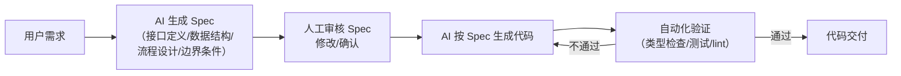
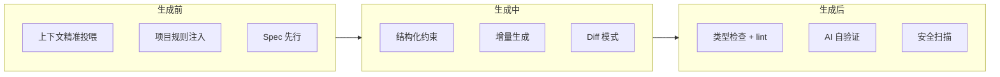
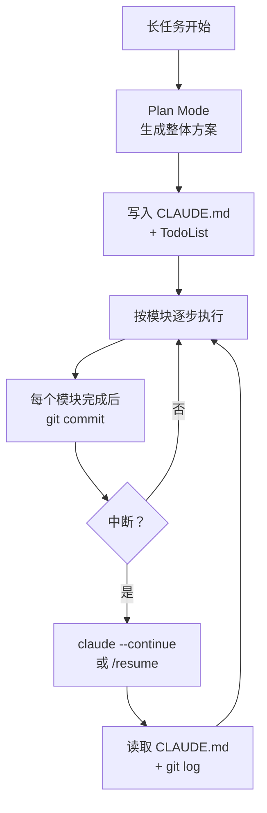

# 工程化踩坑：死循环、状态丢失与成本控制

踩坑题是面试的“照妖镜”——没做过的人编不出来。面试官问这类题不是要标准答案，而是**看你有没有在生产环境里摔过跤、摔完有没有系统性地解决**。答得出具体的坑和对应的工程方案，比答十道理论题都管用。

---

## Q：开发 Agent 时踩过什么坑？

> 来源：Agent 岗面试高频题

**新手答**：“模型有时候不听话，输出格式不对。”

**高手答**：

坑太多了，挑几个最痛的：

### 坑一：死循环——模型反复调同一个工具

模型调了一个工具拿到错误结果，然后用一模一样的参数再调一次，无限循环。

**解法**：① 加失败计数器，同一工具连续失败 2 次直接终止该路径；② 每次重试前让模型先分析上次失败原因，强制改变参数或策略；③ 超过全局步数上限（比如 15 步）直接结束，输出当前最优结果。

### 坑二：状态丢失——多轮对话里关键信息不翼而飞

用户在第 3 轮说了“预算 5000 以内”，到第 10 轮模型推荐了个 8000 的方案。不是模型故意忽略，是上下文太长被截断了，或者关键信息被淹没。

**解法**：① 关键参数实时抽取，写入独立的状态存储（Redis / 数据库），不依赖上下文承载；② 每次调用模型时，把当前任务的关键约束作为 System Prompt 的一部分强制注入，而不是埋在历史消息里；③ 定期用模型做自检——“当前任务的约束条件有哪些？”，发现遗漏立刻补回来。

### 坑三：JSON 解析翻车——模型输出“差一点点”的 JSON

模型返回的 JSON 格式上“几乎正确”——多了个逗号、少了个引号、在 JSON 前面加了句“好的，以下是结果：”。用 `json.loads()` 直接崩。

**解法**：① 用正则先提取 JSON 块（匹配 `{...}` 或 `[...]`），再解析；② 用 `json-repair` 之类的库做容错解析；③ 最根本的解法：用模型原生的 function calling / structured output，不要让模型自己拼 JSON 字符串。

### 坑四：成本失控——一个任务烧掉几十块

复杂任务里模型思考了 30 步，每步都带完整上下文，token 量指数级增长。一个用户的一次请求可能烧掉几十块钱。

**解法**：① 限制每轮 token 数上限，每个 Agent 有独立的 token 预算；② 实时监控单任务累计成本，超过阈值自动告警并降级（比如切换到更便宜的模型）；③ 上下文管理做好——中间结果落库、历史消息压缩，从源头减少 token 消耗。

**差距在哪**：新手只能说出一个笼统的“输出格式不对”。高手每个坑都有三层结构：① 具体的故障现象（什么情况下出的）；② 根因分析（为什么会这样）；③ 系统性的解法（不是临时 patch，而是工程化方案）。面试官考的是“你踩过坑之后有没有复盘和系统性修复的习惯”。

---

## Q：Agent 的成本怎么控制？线上烧钱太快怎么办？

> 来源：Agent 岗面试高频题

**新手答**：“用更便宜的模型。”

**高手答**：

换模型是最后的手段，换了可能效果也打折。成本控制要从**架构层面**系统性地做：

1. **分级调度**：不是所有步骤都需要最强模型。意图识别、参数校验这种简单任务用小模型（7B / 14B），只有核心推理环节才用大模型。一个任务里可能 80% 的调用走小模型，只有 20% 走大模型
2. **Token 预算制**：每个任务有 token 预算上限，执行过程中实时统计。接近预算时自动触发“省钱模式”——压缩上下文、跳过非必要步骤、简化输出
3. **缓存复用**：相似请求的中间结果做缓存。比如“查北京天气”这种高频工具调用，5 分钟内的结果直接复用，不重复调用 API 也不重复让模型处理
4. **超预算熔断**：单用户单日消费超过阈值，自动限流或降级。这不只是省钱，也是防止恶意用户用 prompt injection 让 Agent 无限循环烧钱

**差距在哪**：新手的“换模型”是一维思考——只在模型选择上做文章。高手的方案是四维的：调度策略（谁用什么模型）、预算控制（花多少停）、缓存复用（重复的不花）、熔断保护（异常的不让花）。面试官考的是“你有没有成本意识和系统设计能力”——这和后端系统的限流、降级、熔断是同一套思路。

---

## Q：为什么很多 Agent Demo 很惊艳，但一上线就不稳定？

> 来源：腾讯大模型应用开发二面

**新手答**：“因为线上环境比 Demo 复杂。”

**高手答**：

Demo 往往是在理想条件下演示的——输入干净、工具有限、单次任务、短上下文。模型只要看起来会做事就行了。但线上环境完全不一样：

```text
Demo 环境：理想输入、有限工具、单次任务、短上下文
线上环境：输入脏、任务长、工具多、状态复杂、异常频繁、权限安全约束
```

Demo 能跑通，只能说明“这个方向可能”。线上稳定，说明的是**你把模型的不确定性关进了工程笼子里**。

真正难的是做治理，不是做演示。很多团队一开始觉得问题在模型不够强，后来才发现大量问题其实来自**状态管理、工具设计、上下文污染和缺少容错机制**。

**差距在哪**：新手只说了“环境复杂”——这是现象不是分析。高手指出了 Demo 和生产环境的具体差异（输入质量、任务长度、状态管理、异常处理），且点出了核心观点：“稳定不靠模型强，靠工程治理”。面试官考的是你有没有把 Agent 从 Demo 推到生产的实战经验。

---

## Q：平时用过哪些 AI Agent 工具？

> 来源：腾讯 Agent 应用开发一面

**新手答**：“用过 ChatGPT。”

**高手答**：

AI Agent 工具按用途分三类：

| 类别 | 代表工具 | 特点 |
|------|---------|------|
| 通用对话型 | ChatGPT、Claude、Kimi | 单轮/多轮问答，不主动执行操作 |
| 开发框架型 | LangChain、LangGraph、Dify、Coze | 提供编排、工具调用、记忆等基础设施，开发者搭建 Agent |
| AI Coding 型 | Cursor、Claude Code、GitHub Copilot | 直接辅助写代码，有项目上下文感知 |

关键认知：这三类工具解决的问题不同——通用型解决“问答”，框架型解决“编排”，Coding 型解决“开发效率”。实际做 Agent 开发时，框架型和 Coding 型通常同时使用：用 Coding 工具写代码，用框架搭 Agent 流程。

选工具的标准不是“哪个最热”，而是**你的任务需要什么级别的控制力**：简单任务用 Dify/Coze 拖拽搞定；需要自定义编排的用 LangGraph；需要最大灵活性的直接用 SDK + 自建。

**差距在哪**：新手只列了名字。高手按用途做了分类，且说清了选型标准。面试官考的是你对 Agent 工具生态的全局认知。

---

## Q：平时写的代码有多少是 AI 生成的？怎么保证质量？

> 来源：腾讯 Agent 应用开发一面

**新手答**：“大概 50%，然后自己改改。”

**高手答**：

比例因任务类型而异：

- **样板代码**（CRUD、配置、测试骨架）：80%+ 由 AI 生成，人工只做审查和微调
- **核心业务逻辑**（算法、状态机、并发控制）：AI 生成初版，人工大幅修改，实际保留 30-40%
- **架构设计和技术选型**：AI 提供选项和分析，但决策完全由人做

保证质量的方法不是“自己改改”，而是**流程化的质量门禁**：

1. **生成前约束**：给足上下文（类型定义、接口规范、项目规则文件），让 AI 一次生成质量更高的代码
2. **生成后审查**：AI 生成的代码必须过 Code Review，重点看边界条件、安全漏洞、和已有代码的一致性
3. **自动化验证**：类型检查（TypeScript）、lint、单元测试必须通过。AI 容易写出“看起来对但类型不安全”的代码

核心原则：**AI 生成的比例不重要，重要的是每行代码都经过了验证**。

**差距在哪**：新手只给了一个比例。高手按任务类型分了不同比例，且给出了系统化的质量保障方法。面试官考的是你对 AI 辅助开发的成熟度。

---

## Q：你熟悉的 Agent 框架，在架构设计上有什么优势？

> 来源：腾讯 Agent 应用开发一面

**新手答**：“它用了 LLM，很智能。”

**高手答**：

以 OpenClaw 为例，它的架构优势体现在三个层面：

1. **编排层和能力层分离**：编排层（状态机/DAG）负责“做什么、按什么顺序做”，能力层（LLM 调用、工具执行）负责“具体怎么做”。分离后编排逻辑可以独立测试和复用，不和模型调用耦合
2. **工具即插件**：工具通过标准化接口（类似 MCP 的 tool schema）注册，新增工具不需要改编排代码。这让工具生态可以独立演化
3. **上下文管理可配置**：不是硬编码“保留最近 N 轮”，而是提供多种上下文策略（滚动窗口、摘要压缩、按需召回），开发者根据场景组合

这三个优势的共性是**关注点分离**——编排、能力、工具、上下文各自独立演化，互不干扰。这和微服务架构的设计哲学是一致的。

**差距在哪**：新手用“智能”概括一切。高手从编排/能力分离、工具插件化、上下文可配置三个架构决策分析优势。面试官考的是你对框架的理解是“会用”还是“理解设计”。

---

## Q：自己做 Agent 时，踩过最大的坑是什么？

> 来源：腾讯 Agent 应用开发一面

**新手答**：“模型输出不稳定。”

**高手答**：

最大的坑是**过度信任模型的“理解力”，导致状态管理全靠上下文承载**。

早期做 Agent 时，觉得模型能“记住”之前的对话，所以把关键参数（用户偏好、任务进度、中间结果）全放在对话历史里。结果上下文一长，模型就开始丢信息、乱推理——用户在第 3 轮说的约束条件，到第 10 轮完全被忽略。

**系统性修复**：把“模型记住”改成“系统记住”——
1. 关键参数实时提取到独立的状态存储（Redis / 数据库），不依赖上下文
2. 每轮调用前把当前约束条件作为 System Prompt 的固定部分强制注入
3. 中间结果落库，上下文里只留一句摘要

这个坑的本质是：**Agent 的上下文窗口是“工作台”，不是“仓库”**。工作台上只放当前步骤需要的东西，其他全放仓库里按需取。

**差距在哪**：新手说“不稳定”是表象。高手指出了根因（过度依赖上下文承载状态）和系统性解法（状态外置 + 强制注入 + 落库）。面试官考的是你踩坑后有没有做过根因分析和系统性修复。

---

## Q：用过哪些 Code Agent？有什么优缺点？

> 来源：腾讯 AI 应用开发

**新手答**：“用过 Copilot，挺好用的。”

**高手答**：

目前 Code Agent 工具分两类：**IDE 集成型**和**终端独立型**，工程定位不同。

| 类型 | 代表工具 | 优点 | 缺点 |
|------|---------|------|------|
| IDE 集成型 | Cursor / Windsurf / Copilot | 感知项目上下文（目录、类型、导入），补全即时、改完直接看 diff | 对大规模跨文件重构支持有限 |
| 终端独立型 | Claude Code / Codex CLI / Aider | 能执行 shell 验证代码、跑测试、做 git 操作；全局视角 | 没有实时补全体验，需要更多上下文描述 |

**实际使用策略**——两类互补而非互斥：
- 写新功能、局部修改 → IDE 集成型（实时补全 + 即时预览）
- 跨文件重构、项目搭建、调试排查 → 终端型（能执行验证 + 全局操作）
- 两类工具都受益于**项目级规则约束**（CLAUDE.md / .cursorrules），定义编码规范和技术栈约束后输出质量显著提升

核心认知：Code Agent 的瓶颈通常不是模型能力，而是**上下文不足和约束不够**——给足项目规则和相关代码上下文，输出质量有质的飞跃。

**差距在哪**：新手只评价了“好不好用”。高手按工具类型做了系统对比，且给出了互补使用策略和提升质量的方法论。面试官考的是你对 AI Coding 工具的实际使用深度。

---

## Q：如何解决大模型 API 服务的响应延迟问题？

> 来源：字节 Agent 实习一面

**新手答**：“用更快的模型。”

**高手答**：

API 服务延迟分两部分：**首 token 延迟（TTFT）** 和**生成吞吐（TPS）**，优化思路不同。

**1. 流式输出（Streaming）**——最直接的体感优化：

- 不等全部生成完再返回，逐 token 流式输出。用户感知延迟从“等 10 秒”变成“0.5 秒就开始看到内容”
- SSE（Server-Sent Events）或 WebSocket 实现

**2. 模型层面**：

- **模型分级调度**：简单请求（分类、提取）用小模型（7B/14B），复杂请求（推理、创作）用大模型。80% 的请求可以用小模型处理，延迟降 5-10 倍
- **量化部署**：INT4/INT8 量化减少计算量和显存占用，推理速度提升 2-3 倍
- **推测解码**：小模型快速生成草稿，大模型批量验证，整体速度提升 2-3 倍

**3. 服务架构层面**：

- **KV Cache 复用**：多轮对话中，前几轮的 KV Cache 不需要重算，缓存后复用，TTFT 大幅缩短
- **Prefix Caching**：共享相同 System Prompt 的请求复用前缀计算结果
- **连续批处理**：vLLM/SGLang 的 continuous batching，请求到达即处理，不等凑满一批
- **负载均衡**：多实例部署 + 按当前负载智能路由，避免单实例过载

**4. 缓存层面**：

- **语义缓存**：对高频相似请求做语义匹配，命中缓存直接返回，不调模型。适合 FAQ 类场景
- **工具结果缓存**：Agent 场景中，工具返回值（天气、股价等）设 TTL 缓存，避免重复调用

**差距在哪**：新手只想到换模型。高手从流式输出、模型分级、服务架构、缓存四个层面做了系统优化，且区分了 TTFT 和 TPS 两种延迟类型。面试官考的是你对大模型服务工程化的理解——延迟优化不只是“模型更快”，而是一个全栈工程问题。

---

## Q：AI Coding 产品怎么测试？从 Demo 到生产可交付还差什么？

> 来源：蚂蚁集团智能体与大模型应用二面

**新手答**：“写几个 case 测一下就行。”

**高手答**：

AI Coding 产品的测试和传统软件测试有本质区别——输出是**概率性的**，同样的输入不一定得到同样的输出，所以不能只靠“写几个 case 通过了就行”。

**测试方法论**：

**1. 构造评估集，不是测几个 case**：

- 设计覆盖不同**代码复杂度**（纯函数 / 有依赖 / 异步 / 并发）和**任务类型**（生成 / 修复 / 重构 / 解释）的评估集
- 每个 case 要有**明确的验收标准**：不是“看起来对”，而是能编译、能通过测试、符合代码规范
- 评估集要包含**边界和对抗 case**：超长文件、语法错误的输入、故意误导的 Prompt

**2. 评估维度不只是“对不对”**：

| 维度 | 指标 | 说明 |
|------|------|------|
| 正确性 | Pass@K、编译通过率 | K 次生成中至少一次正确的概率 |
| 一致性 | 同一输入多次生成的方差 | 输出是否稳定 |
| 安全性 | 有无注入漏洞、敏感信息泄露 | 生成的代码是否安全 |
| 效率 | Token 消耗、端到端延迟 | 成本和速度 |

**从 Demo 到生产可交付，还差什么**：

1. **鉴权和权限控制**：Demo 不需要考虑谁能用、能操作哪些文件。生产环境必须有用户身份验证和操作权限隔离
2. **错误恢复和回滚**：Demo 出错了重来就行。生产环境需要操作日志、变更回滚（类似 git revert）、异常告警
3. **并发和多用户**：Demo 是单用户。生产环境要支持多用户同时使用，状态隔离，资源限制
4. **监控和可观测性**：生成质量监控、成本监控、异常检测、用户反馈收集——没有这些，线上问题完全是黑盒
5. **安全审计**：AI 生成的代码可能引入安全漏洞，生产环境需要自动化安全扫描（SAST/DAST）
6. **CI/CD 集成**：生成的代码要能自动跑 lint、测试、构建，不能只靠人工 review

**差距在哪**：新手的“测几个 case”只是验证“能不能跑”。高手从评估集设计、多维度指标、生产化六大能力（鉴权、回滚、并发、监控、安全、CI/CD）展开。面试官考的不是“会不会测试”，而是你对“把 AI 能力做成产品”这件事的完整认知。

---

## Q：什么是 SDD（Spec-Driven Development）？它和 Skills 有什么区别？

> 来源：蚂蚁集团智能体与大模型应用二面

**新手答**：“SDD 就是先写规格再写代码，Skills 是预定义能力。”

**高手答**：

SDD（Spec-Driven Development，规格驱动开发）是 AI Coding 领域的一种工作流方法——**先让 AI 生成详细的技术规格说明（Spec），人工审核确认后，再让 AI 按照 Spec 生成代码**。

**SDD 的核心流程**：



**为什么要这么做**：直接让 AI 写代码的问题是——需求理解错了，生成的代码再完美也没用。SDD 把“理解需求”和“写代码”拆开，在理解阶段就做人工确认，避免代码写完才发现方向错了。

**SDD vs Skills 的对比**：

| 维度 | SDD | Skills |
|------|-----|--------|
| 本质 | 开发工作流方法论 | Agent 的可复用能力单元 |
| 解决的问题 | “怎么让 AI 写出正确的代码” | “怎么让 Agent 处理特定类型的任务” |
| 关注点 | 需求→规格→代码的转化质量 | 触发匹配→Prompt→工具→输出的执行流程 |
| 人工参与 | 核心环节（审核 Spec） | 可选（配置后自动执行） |
| 适用场景 | 代码生成、架构设计 | 任何 Agent 能力扩展 |
| 输出物 | Spec 文档 + 代码 | 任务执行结果 |

**两者的关系**：不互斥，可以结合。一个“代码生成 Skill”可以内部采用 SDD 流程——Skill 定义了“什么时候触发、用什么工具”，SDD 定义了“触发后按什么步骤生成代码”。

Skills 是**能力的封装方式**，SDD 是**代码生成的质量保障方法**。前者回答“Agent 能做什么”，后者回答“怎么做得对”。

**差距在哪**：新手把两者简单对立。高手看到了它们在不同维度上的定位——SDD 是方法论层面的流程设计，Skills 是系统架构层面的能力封装，两者可以组合使用。面试官考的是你能不能区分“工作流方法”和“系统架构”这两个层次的抽象。

---

## Q：如何保证 AI 代码生成的质量与掌控性？

> 来源：蚂蚁集团 Agent 开发一面

**新手答**：“生成后人工 review 一下。”

**高手答**：

人工 review 是最后一道线，但**不能是唯一一道**。保证质量和掌控性要在生成前、生成中、生成后三个阶段都做控制：

**生成前——约束输入，减少出错空间**：

1. **上下文精准投喂**：给模型完整的类型定义、接口规范、相关测试用例，而不是只给一句需求描述。上下文越精确，生成质量越高
2. **项目规则注入**：通过 CLAUDE.md / .cursorrules 定义编码规范（命名风格、错误处理模式、禁用的 API），让模型生成时就遵守项目约定
3. **Spec 先行（SDD）**：对复杂功能，先让 AI 生成技术规格说明，人工确认后再生成代码。在理解阶段就拦住方向性错误

**生成中——约束输出，缩小自由度**：

4. **Structured Output**：函数签名、返回类型、错误码这些关键接口用 schema 约束，不让模型自由发挥
5. **增量生成**：不让模型一次生成 500 行。拆成小步——先生成函数骨架、再填充逻辑、再补异常处理，每步可验证
6. **Diff 模式**：修改已有代码时，要求模型输出精确的 diff 而非整文件重写，减少意外修改

**生成后——验证结果，兜住底线**：

7. **自动化门禁**：生成的代码必须通过类型检查（TypeScript/mypy）、lint、现有测试套件。不过门禁不允许合入
8. **AI 自验证**：让模型同时生成代码和对应的测试用例，跑通测试才算完成。这不完美，但能抓住明显的逻辑错误
9. **安全扫描**：自动检测常见漏洞模式（SQL 注入、XSS、硬编码密钥），AI 生成的代码更容易引入这类问题



**掌控性的核心原则**：**生成的每一步都要有人类可审查的检查点**。不是“生成完看一眼”，而是“每个阶段都有明确的验收标准”。

**差距在哪**：新手只有事后 review 一道防线。高手在生成前（约束输入）、生成中（约束输出）、生成后（自动验证）三个阶段构建了九道防线。面试官考的是你对 AI 代码生成的质量体系有没有工程化的设计。

---

## Q：LangGraph 定义的搜索节点做不到并发执行吗？怎么做？

> 来源：AI 工程师面试

**新手答**：“LangGraph 是顺序执行的，做不了并发。”

**高手答**：

LangGraph 完全支持并发执行，有三种方式，适用场景不同：

**方式一：Fan-out / Fan-in（静态并行）**

在 graph 定义时，让多个节点从同一个上游节点出发，形成并行分支，最后汇聚到一个下游节点：

```python
graph.add_edge("plan_node", "search_node_1")
graph.add_edge("plan_node", "search_node_2")
graph.add_edge("plan_node", "search_node_3")
graph.add_edge("search_node_1", "merge_node")
graph.add_edge("search_node_2", "merge_node")
graph.add_edge("search_node_3", "merge_node")
```

三个 search 节点会**并发执行**，全部完成后进入 merge_node。适合**编译时就知道要并行几路**的场景。

**方式二：Send API（动态并行）**

并行数量在运行时才确定时，用 `Send` API 动态创建并行分支：

```python
from langgraph.types import Send

def plan_node(state):
    queries = state["search_queries"]  # 运行时才知道有几个查询
    return [Send("search_node", {"query": q}) for q in queries]

graph.add_conditional_edges("plan_node", plan_node)
```

每个 `Send` 创建一个独立的并发执行分支，适合**搜索数量取决于规划结果**的场景。

**方式三：节点内部 asyncio 并发**

如果只是一个节点内部需要并发调用多个 API：

```python
import asyncio

async def search_node(state):
    queries = state["search_queries"]
    results = await asyncio.gather(*[
        search_api(q) for q in queries
    ])
    return {"search_results": results}
```

**状态合并是关键问题**：

并发节点同时写同一个 state 字段会冲突。LangGraph 用 **Reducer 函数**解决：

```python
from typing import Annotated
import operator

class State(TypedDict):
    # operator.add 表示多个并发节点的结果做列表拼接
    search_results: Annotated[list, operator.add]
```

每个并发分支返回的 `search_results` 会被自动拼接成一个大列表，而不是互相覆盖。

**差距在哪**：新手以为 LangGraph 不支持并发——说明没深入用过。高手给出了三种并发方式（静态 Fan-out、动态 Send、节点内 asyncio），且指出了并发状态合并（Reducer）这个关键问题。面试官考的是你对 LangGraph 并发执行机制的实际掌握程度。

---

## Q：PostgreSQL 的索引结构是什么？索引如何优化查询速度？在 Checkpoint 场景下如何用索引加速？

> 来源：AI 工程师面试

**新手答**：“就是 B+ 树，查询快。”

**高手答**：

PostgreSQL 支持**多种索引类型**，不同索引适用不同查询模式：

| 索引类型 | 底层结构 | 适用查询 | 典型场景 |
|---------|---------|---------|---------|
| **B-Tree**（默认） | 平衡多叉树 | 等值查询、范围查询、排序 | 绝大多数场景的首选 |
| **Hash** | 哈希表 | 纯等值查询 | 精确匹配，如 session_id = 'xxx' |
| **GIN** | 倒排索引 | 包含查询、全文搜索 | JSONB 字段查询、数组包含 |
| **GiST** | 通用搜索树 | 范围重叠、最近邻 | 地理空间、区间查询 |
| **BRIN** | 块范围索引 | 大表上的范围查询 | 时间序列、日志表（数据物理有序时） |

**B-Tree 索引如何加速查询**：

B-Tree 是一棵平衡多叉排序树，每个节点存多个键值和指向子节点的指针。查询时从根节点开始，每一层通过比较快速定位到目标区间，时间复杂度 **O(log N)**：

```text
无索引：全表扫描 100 万行 → 逐行比较 → O(N)
有 B-Tree 索引：树高约 3-4 层 → 3-4 次磁盘 IO → O(log N)
```

关键优化手段：

1. **覆盖索引（Covering Index）**：把查询需要的列都放进索引，查询直接从索引返回，不需要回表
2. **复合索引**：`CREATE INDEX ON checkpoints (thread_id, checkpoint_id DESC)` 一个索引同时支持按 thread_id 过滤 + 按 checkpoint_id 排序
3. **部分索引（Partial Index）**：`CREATE INDEX ON checkpoints (thread_id) WHERE is_active = true` 只索引活跃数据，索引体积更小
4. **Index-Only Scan**：当查询的所有列都在索引中时，PostgreSQL 直接扫描索引，完全跳过堆表

**Checkpoint 场景下的索引设计**：

Checkpoint 表的核心查询模式是：**给定 session_id（thread_id），找到最新的 Checkpoint**。

```sql
-- 最常见的查询：加载最新 checkpoint
SELECT * FROM checkpoints
WHERE thread_id = 'abc-123'
ORDER BY checkpoint_id DESC
LIMIT 1;
```

最优索引：

```sql
-- 复合索引：thread_id 精确匹配 + checkpoint_id 倒序排列
CREATE INDEX idx_checkpoints_thread_latest
ON checkpoints (thread_id, checkpoint_id DESC);
```

这个索引让查询**一次 B-Tree 查找就能定位到目标行**——先按 thread_id 定位到该会话的所有 checkpoint，B-Tree 内部已按 checkpoint_id 倒序排列，直接取第一条就是最新的。

如果 Checkpoint 表还有 JSONB 类型的 `metadata` 字段需要查询（如按节点名过滤）：

```sql
-- GIN 索引支持 JSONB 内部字段查询
CREATE INDEX idx_checkpoints_metadata ON checkpoints USING GIN (metadata);

-- 查询：找所有在 search_node 节点暂停的 checkpoint
SELECT * FROM checkpoints WHERE metadata @> '{"node": "search_node"}';
```

**差距在哪**：新手只知道 B+ 树一个名字。高手区分了五种索引类型及适用场景，详细说明了 B-Tree 的查询加速原理，且结合 Checkpoint 实际场景给出了复合索引 + GIN 索引的具体设计。面试官考的是你能不能把数据库基础知识应用到 Agent 系统的实际存储设计中。

---

## Q：用 Claude Code 做一个比较长的任务，如果遇到单次 session 跑不完、中间断网怎么办？

> 来源：AI 工程师面试

**新手答**：“重新开一个 session 从头做。”

**高手答**：

长任务中断是 AI Coding 工具的常见问题。解决方案分**预防**和**恢复**两个层面：

**预防——降低中断的影响**：

1. **任务拆分**：长任务不要一口气交给 Agent。先用 Plan Mode（`/plan`）生成整体方案，再按模块逐步执行。每完成一个模块就 commit 一次，确保进度不丢
2. **CLAUDE.md 持久化上下文**：把项目的关键信息、架构约定、已完成的进度写在 `CLAUDE.md` 文件中。新 session 启动时会自动读取，相当于给 Agent 一个“接班备忘录”
3. **TodoList 跟踪进度**：用 Claude Code 的任务管理功能（或直接在 CLAUDE.md 中维护 checklist），标记每个子任务的完成状态。中断后可以精确知道“做到哪了”

```text
## 当前任务进度
- [x] 数据库 schema 设计
- [x] API 路由层实现
- [ ] 业务逻辑层实现  ← 断点
- [ ] 单元测试
- [ ] 集成测试
```

4. **高频 git commit**：每完成一个有意义的改动就 commit，不要攒到最后。即使 session 崩了，代码改动不会丢

**恢复——中断后快速接续**：

5. **`--continue` 继续上次对话**：Claude Code 支持 `claude --continue` 直接恢复上一次 session 的对话上下文，从断点继续
6. **`/resume` 恢复任务**：在新 session 中使用 `/resume` 命令，可以加载之前的对话历史和任务状态
7. **Git diff 定位进度**：新 session 中让 Claude Code 执行 `git diff` 和 `git log`，快速了解已完成的改动，从断点处继续

**最佳实践流程**：



核心认知：**长任务的可靠性不靠 session 稳定性保证，而靠“频繁保存 + 上下文持久化 + 快速恢复”的工程习惯**。这和写代码要频繁 commit 是同一个道理——不要把所有筹码押在“一次跑通”上。

**差距在哪**：新手遇到中断只会重来。高手从预防（任务拆分 + CLAUDE.md + TodoList + 高频 commit）和恢复（--continue + /resume + git diff）两个层面给出了完整方案。面试官考的是你用 AI Coding 工具做大型任务时的工程化习惯。

---

## 这类题的答题模式

踩坑题的核心是**真实 + 系统性**：

```text
1. 每个坑要有三层：故障现象 → 根因分析 → 工程化解法
2. 解法不能是"下次注意"——要是代码层面、架构层面的系统性方案
3. 成本控制不只是换模型——分级调度、预算制、缓存、熔断四管齐下
4. 踩坑经验要能泛化——"这个坑的本质是什么，其他场景会不会也遇到"
```

面试官听到“模型不听话”就知道你只在 Notebook 里跑过。听到死循环计数器、状态外置存储、JSON 容错解析、token 预算熔断，才会觉得你真的在生产环境里摔过跤，并且摔完站起来做了系统性修复。

---

下一篇建议继续看：

- [Prompt 工程与框架原理：模板构建、Skills 机制](../08-prompt-engineering/index.html)
