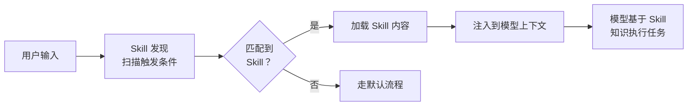
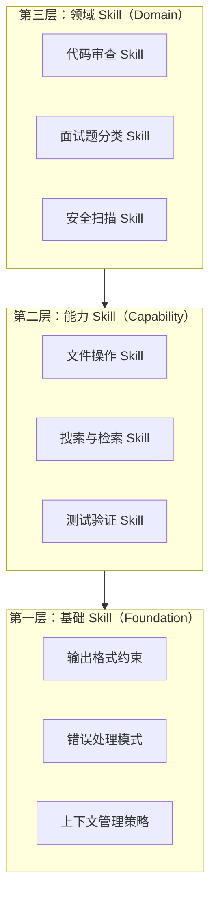
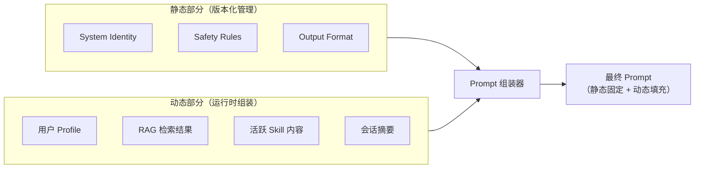
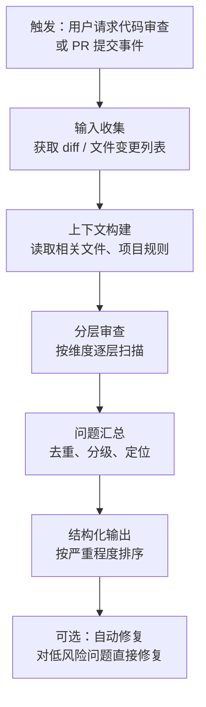
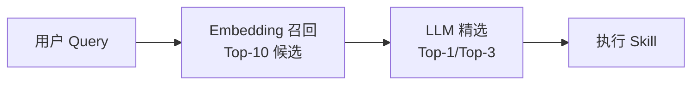
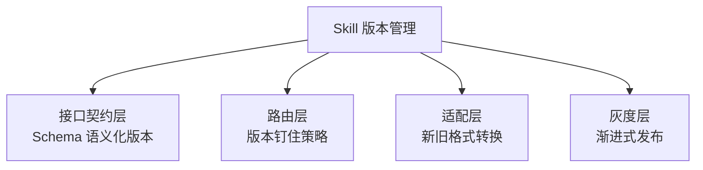

# Prompt 工程与框架原理：模板构建、Skills 机制

Prompt 工程不是“写提示词”，是一个**分层组装系统**。面试官问这个方向时，考的是你能不能把 Prompt 从“拼字符串”做成“模板工程”，以及你对 Agent 框架内部机制的理解深度。

---


## Prompt 模板方法

### Q：提示词模板是怎么构建的？

> 来源：抖音基础架构 Agent 一面

**新手答**：“把任务描述和代码拼成一个 Prompt 发给模型。”

**高手答**：

提示词模板不是字符串拼接，是一个**分层组装系统**：

1. **System Prompt 层**：定义角色（“你是一个资深测试工程师”）、输出格式约束（“只输出可执行的测试代码，不要解释”）、语言和框架约束（“使用 pytest”）
2. **上下文注入层**：把待测函数的源码、函数签名、依赖的类型定义、已有的测试用例作为参考注入。这里有个关键决策——**注入多少上下文**。太少模型不理解代码，太多撑爆窗口且干扰生成
3. **任务指令层**：具体要生成什么——单元测试、边界测试、异常路径测试。不同测试目标对应不同的指令模板
4. **Few-shot 示例层**：给 1-2 个同项目风格的测试用例作为示范，让模型对齐代码风格和断言习惯

模板不是静态的，会根据**待测代码的特征动态调整**——比如纯函数用轻量模板，有外部依赖的函数自动加上 mock 引导指令。模板还需要版本管理和 A/B 测试，不同模板对不同类型代码的效果差异很大。

**差距在哪**：新手把 Prompt 当成一次性的字符串拼接。高手的回答展示了一个四层分离的模板系统——角色、上下文、指令、示例各司其职，且能根据输入特征动态调整。面试官想看的是你有没有把 Prompt 当成一个需要版本管理和测试的工程产物。

---


## Skill 与框架原理

### Q：Skills 的原理有没有了解过？怎么实现的？

> 来源：抖音基础架构 Agent 一面 【小红书AI应用开发同题：Skills了解+如何管理各个Skills】【CVTE AI应用工程师一面追问：怎么理解 Skill？能解决什么问题？怎么写 MCP？】

**新手答**：“就是预定义的 Prompt 模板。”

**高手答**：

Skills 是 Agent 系统中**可复用的能力单元**，比 Prompt 模板更完整。一个 Skill 通常包含：

```text
Skill = {
    触发条件:  意图匹配规则 / 关键词 / 正则,
    Prompt 模板:  针对这个能力的专用提示词,
    工具集合:  这个 Skill 能调用哪些工具,
    输出约束:  输出格式和校验规则,
    上下文策略:  需要注入哪些额外信息
}
```

**实现机制**：

1. **Skill 注册表**：所有 Skill 以文件形式存储（比如 `SKILL.md`），包含名称、描述、触发条件、完整的 Prompt 指令。系统启动时加载到内存
2. **触发匹配**：用户输入或 Agent 行为触发时，先做意图匹配——可以是关键词匹配（“整理面经” → 触发 `new-article` Skill）、正则匹配，或者用 embedding 做语义匹配
3. **动态 Prompt 组装**：匹配到 Skill 后，把 Skill 的 Prompt 模板展开，注入当前上下文（用户消息、项目状态等），形成完整的 Prompt 发给模型
4. **工具权限隔离**：不同 Skill 可以访问不同的工具子集——代码生成 Skill 能调文件读写工具，但搜索 Skill 只能调检索工具

**和普通 Prompt 模板的区别**：Prompt 模板是静态文本，Skill 是**一个完整的执行上下文**——它不只定义了”说什么”，还定义了”能做什么”和”在什么条件下触发”。

**怎么理解 Skill 的本质**：

Skill 本质上是**可复用的、领域特定的上下文注入模块**。理解 Skill 有三个层次：

**第一层：Skill 是结构化的 Prompt 模板**
- 每个 Skill 是一个 Markdown 文件，包含任务描述、执行步骤、注意事项
- 当 Skill 被触发时，其内容被注入到模型的上下文中，指导模型的行为

**第二层：Skill 是领域知识的封装**
- 不只是指令，还包含领域专业知识（如”面试题分类应该怎么做”、”代码审查应该检查什么”）
- 把专家经验固化成可执行的流程，让模型在特定领域表现得像专家

**第三层：Skill 是 Agent 的”职业技能树”**
- 每个 Skill 让 Agent 获得一项专业能力
- Skill 之间可以组合——一个复杂任务可能触发多个 Skill 协同工作
- 和 MCP 的区别：MCP 给 Agent 提供**工具**（能做什么），Skill 给 Agent 提供**知识和方法论**（怎么做、为什么这样做）

| 对比维度 | Skill | MCP Tool |
|---------|-------|----------|
| 本质 | 领域知识 + 执行流程 | 外部能力接口 |
| 注入方式 | 加载到上下文 | 注册为可调用工具 |
| 作用 | 指导模型”怎么思考和行动” | 让模型”能调用外部服务” |
| 类比 | 教科书/操作手册 | 工具箱里的工具 |

理解了这三层，就能回答”为什么 Claude Code 能在不同项目中表现不同”——因为不同项目配置了不同的 Skill，Agent 的”专业能力”随 Skill 配置动态变化。

**差距在哪**：新手只看到了 Skill 的表面（Prompt 模板），高手看到了完整的执行上下文——触发条件、工具权限、上下文策略。面试官考的是你对 Agent 框架的理解深度——不只是用框架，还理解框架怎么设计的。

**追问：创建 Skill 有哪些方式？除了自然语言描述，还有什么？**

> 来源：蚂蚁 Agent 开发一面

Skill 的创建方式不止一种，按自动化程度从低到高：

| 方式 | 描述 | 适用场景 |
|------|------|---------|
| **手写 Markdown** | 直接在 `.claude/skills/` 下创建 `.md` 文件，写 frontmatter + 正文 | 复杂领域 Skill，需要精细控制 |
| **自然语言描述** | 告诉 Agent「帮我创建一个做 X 的 Skill」，Agent 自动生成 .md 文件 | 快速原型，让 AI 帮你写 Skill |
| **Skill Creator 工具** | 用专门的 skill-creator 元 Skill，引导式创建、测试和优化 Skill | 标准化流程，带评测验证 |
| **从已有 Skill 派生** | 复制一个相似 Skill 后修改触发条件和内容 | 同类 Skill 批量创建 |
| **CLAUDE.md 内联** | 在项目 CLAUDE.md 中直接写行为指令（非独立文件） | 简单的项目级约束，不值得独立成 Skill |

关键认知：Skill 本质是 Markdown 文件，所以创建方式的区别不在于「用什么工具创建」，而在于**内容质量**——触发条件是否精准、执行步骤是否清晰、边界条件是否覆盖。

---

### Q：Claude Code 的架构有什么比较创新的设计？

> 来源：腾讯 Agent 应用开发一面

**新手答**：“它很强，能直接改代码。”

**高手答**：

Claude Code 在架构上有几个值得关注的设计：

1. **System Prompt 即规则引擎**：把项目约定、编码规范、安全约束全部写进 System Prompt（通过 CLAUDE.md），让模型在每次决策时都受约束。这比在代码里硬编码规则更灵活——改一个文件就能改变 Agent 行为，不需要重新部署
2. **工具调用的权限分级**：不同工具有不同的权限级别——读文件可以自动执行，写文件需要用户确认，危险操作（删除、push）需要显式授权。这个分级机制在安全和效率之间取得了平衡
3. **上下文自动压缩**：对话过长时自动做上下文压缩（summary），保留关键信息丢弃冗余。用户无感知，但解决了长会话的 token 限制问题
4. **Hooks 机制**：允许用户在工具调用前后插入自定义的 shell 命令（pre/post hooks），实现自动化的 lint、测试、格式化——把 Agent 行为嵌入到已有的开发工作流中

创新的核心不是某个单点技术，而是**把 Agent 当作开发者工作流的一部分来设计**——不是替代开发者，而是嵌入开发者的工具链。

**从源码角度看 Claude Code 的设计哲学**：

Claude Code 的开源让我们能直接看到生产级 Code Agent 的设计选择，有几个特别值得学习的理念：

**1. 上下文工程优先于 Prompt 工程**

Claude Code 不是靠一个精心调教的 System Prompt 来驱动的，而是通过**多层上下文注入**构建 Agent 的认知：

| 上下文层级 | 来源 | 作用 |
|-----------|------|------|
| 系统层 | 内置 System Prompt | 定义 Agent 身份和基本行为规范 |
| 项目层 | CLAUDE.md 文件 | 项目特定的规则、约定、架构信息 |
| 技能层 | Skills 目录 | 可复用的领域知识和操作流程 |
| 会话层 | 对话历史 + 工具结果 | 当前任务的动态上下文 |
| 环境层 | git status、文件内容、终端输出 | 实时的代码库状态 |

这五层上下文的动态组装，比任何静态 Prompt 都强大——Agent 的能力上限取决于上下文质量，不是 Prompt 技巧。

**2. 渐进式信息披露（Progressive Disclosure）**

Claude Code 不会一次性把整个项目塞进上下文。而是按需加载——先读目录结构，需要时再读具体文件，用 grep 定位再精读。这种”先粗后细”的策略：
- 节省 token：只加载真正需要的信息
- 减少噪声：避免无关代码干扰模型判断
- 更像人类开发者的工作方式

**3. 工具即能力边界**

Claude Code 通过工具定义（Read、Edit、Bash、Agent 等）严格限定了 Agent 能做什么。模型不能”自由发挥”——它只能通过预定义的工具与环境交互。这个设计把模型的不确定性限制在了工具调用的粒度内，而每个工具调用都可以做权限控制和审计。

**4. Hooks 机制实现行为可定制**

用户可以通过 hooks 在工具调用前后注入自定义逻辑（如自动格式化、安全检查），而不需要修改 Agent 本身。这是一种**开放-封闭原则**的体现——Agent 行为对扩展开放，对修改封闭。

**差距在哪**：新手只感受到了”强”。高手从 System Prompt 规则引擎、权限分级、上下文压缩、Hooks 四个具体设计点分析了创新。面试官考的是你对 Agent 框架的拆解和分析能力。

---


## Prompt 标准与 Skill 体系

### Q：一个好的 Prompt 和一个差的 Prompt 的区别？

> 来源：腾讯 Agent 应用开发一面

**新手答**：“好的 Prompt 描述清楚，差的 Prompt 太模糊。”

**高手答**：

区别不只是“清不清楚”，是**五个维度的差距**：

| 维度 | 差的 Prompt | 好的 Prompt |
|------|-----------|-----------|
| 任务边界 | “帮我写个程序” | “写一个 Python 函数，输入用户 ID 列表，返回每个用户最近 7 天的订单总额” |
| 输出格式 | 不指定 | 明确要求 JSON/代码/表格，给出示例 |
| 约束条件 | 无 | “不要用第三方库”“错误时返回空字典而不是抛异常” |
| 上下文 | 不提供 | 附上相关的类型定义、接口文档、已有代码 |
| 角色设定 | 无 | “你是一个熟悉 SQLAlchemy 的后端工程师” |

更深层的区别：

1. **好 Prompt 减少模型的决策空间**：模型面对的选择越少，输出越稳定。“写一个函数”有无数种写法，“写一个接收 list[int] 返回 dict[int, float] 的函数”就只有有限的合理写法
2. **好 Prompt 提供失败时的指引**：不只说“做什么”，还说“做不到时怎么办”——“如果找不到相关信息，回复‘信息不足，需要以下补充：...’”
3. **好 Prompt 是可迭代的**：不是一次写完，而是根据模型的实际输出不断调整，做版本管理和 A/B 测试

**差距在哪**：新手只用“清楚 vs 模糊”一个维度。高手从任务边界、输出格式、约束条件、上下文、角色五个维度对比，且点出了“减少决策空间”和“可迭代”两个深层原则。面试官考的是你写 Prompt 的工程化程度。

---

### Q：为什么已经有了 MCP，Anthropic 还要做 Skill？Skill 里面有没有工具？

> 来源：字节 Agent 开发实习一面

**新手答**：“Skill 就是 MCP 的升级版。”

**高手答**：

MCP 和 Skill 不是竞争关系，而是解决**两个完全不同的问题**：

- **MCP 解决的是“Agent 怎么调用外部工具”**——它是一个能力协议
- **Skill 解决的是“Agent 怎么在某个领域正确地思考和行动”**——它是一个知识框架

### 为什么只有 MCP 不够？

MCP 给了 Agent 工具，但没有告诉它**怎么有效地使用这些工具**。

举个例子：Agent 有一个“搜索数据库”的 MCP 工具。但如果没有 Skill，它不知道：按什么顺序搜索？搜索结果怎么解读？没有结果时该怎么办？特定领域的工作流是什么？

**MCP = 给一个人一套工具箱。Skill = 给他使用工具箱的专业技能。**

### 为什么现在才做 Skill？

| 原因 | 说明 |
|------|------|
| 模型能力提升 | 模型变聪明了，能可靠地遵循复杂指令，基于指令的（Skill）方案变得可行 |
| 工程成本差异 | Skill 是一个 .md 文件，任何人都能写；MCP Server 需要编码、部署、维护 |
| 可组合性 | 多个 Skill 可以自然地同时加载到上下文中；MCP 工具之间的集成更复杂 |
| 领域适配性 | Skill 让领域专家直接编码知识，不需要工程师介入；MCP 必须由工程师实现 |

### MCP vs Skill 全维度对比

| 对比维度 | MCP | Skill |
|---------|-----|-------|
| 本质 | 能力协议（工具注册与调用） | 知识框架（领域知识与方法论） |
| 解决的问题 | Agent 能调用什么 | Agent 怎么思考和行动 |
| 载体 | 代码（Server + Client） | 文档（Markdown 文件） |
| 创建门槛 | 需要编程能力 | 只需领域知识 |
| 注入方式 | 注册为可调用的工具 | 加载到模型上下文中 |
| 作用时机 | 模型显式调用时 | 加载后持续影响模型行为 |
| 类比 | 工具箱里的锤子和螺丝刀 | 教你什么时候用锤子、什么时候用螺丝刀的操作手册 |

### Skill 里面有没有工具？

这个问题的答案是**有引用，但不包含**：

- Skill 可以**引用**工具：“在第三步，执行这条 bash 命令”、“用 Edit 工具修改文件”
- 但 Skill 不**包含**工具——它包含的是**关于何时、如何使用现有工具的指令**
- Skill 通过自然语言指令来编排工具，而不是通过工具注册机制

本质上，Skill 是工具的“使用说明书”，不是工具本身。

**差距在哪**：新手把 MCP 和 Skill 看成竞争关系，以为 Skill 是 MCP 的替代品。高手理解它们服务于不同层次——MCP 提供能力（能做什么），Skill 提供知识（怎么做），两者互补而非互斥。面试官考的是你能不能区分“工具”和“使用工具的知识”这两个抽象层次，以及你对 Agent 系统架构演进方向的理解。

---

### Q：如果让你从零设计一个 Skill 系统，需要实现哪些核心能力？

> 来源：字节 Agent 开发实习一面 【蚂蚁AI应用开发二面追问：单一 Skill 模块设计思路】【阿里国际AI应用开发二面追问：多Skill可见时如何保证执行顺序 + Plan模式协调机制】【阿里国际大模型应用开发一面追问：Skill自我迭代机制本质 + Skill质量评测方法】

**新手答**：“写个插件系统，注册回调函数。”

**高手答**：

Skill 系统的设计和传统插件系统有本质区别——Skill 不是代码，是知识；调用不是函数执行，是上下文注入。围绕这个核心理念，需要实现三个核心能力：

### 整体架构



### 核心能力一：注册（Registration）

基于文件系统的注册，不需要服务器和数据库：

```text
skills/
  ├── code-review/
  │   ├── config.yaml       # 名称、描述、触发条件、参数定义
  │   └── skill.md          # Skill 内容（领域知识 + 执行流程）
  ├── deploy-check/
  │   ├── config.yaml
  │   └── skill.md
  └── ...
```

config 中定义的关键字段：
- **name**：Skill 的唯一标识
- **description**：用于发现匹配的描述（这个字段至关重要，直接决定匹配质量）
- **triggers**：触发条件（关键词、正则、显式命令）
- **args_schema**：Skill 接受的参数定义

设计要点：纯文件系统，支持热重载——新增或修改 Skill 文件后立即生效，不需要重启服务。

### 核心能力二：发现（Discovery）

当用户输入到达时，快速匹配最相关的 Skill：

| 匹配策略 | 实现方式 | 适用场景 |
|---------|---------|---------|
| 显式调用 | 用户输入 `/skill-name` | 用户明确知道要用哪个 Skill |
| 关键词匹配 | 正则或关键词命中触发条件 | 简单直接，零延迟 |
| 语义匹配 | 用 embedding 计算输入与 Skill 描述的相似度 | 更智能，但有延迟开销 |

发现过程必须**快**——每条用户消息都要扫描所有 Skill 的触发条件，延迟必须可忽略。所以关键词匹配是首选，语义匹配作为兜底。

### 核心能力三：调用（Invocation）

匹配到 Skill 后，执行的不是函数调用，而是**上下文注入**：

1. 读取 Skill 的 .md 内容
2. 如果 Skill 定义了参数，解析用户输入中的参数值
3. 将 Skill 内容注入到模型的上下文中——Skill 的知识变成模型在本次会话中的“专业背景”
4. 模型在 Skill 知识的指导下完成任务

**关键认知：Skill 调用不是函数调用，是上下文注入。** Skill 不是“执行一段代码然后返回结果”，而是“把一段领域知识注入模型的认知中，影响模型后续的所有行为”。

### 设计时必须考虑的问题

| 问题 | 解决方案 |
|------|---------|
| 命名空间冲突 | 两个 Skill 触发条件相似时，需要优先级机制（权重或显式排序） |
| 多 Skill 组合 | 复杂任务可能需要同时激活多个 Skill，需要定义组合规则和上下文拼接顺序 |
| 生命周期管理 | Skill 的影响何时结束？一次任务后？整个会话？需要明确的作用域定义 |
| Skill 级评测 | 每个 Skill 需要自己的评测集，验证注入 Skill 后模型行为是否符合预期 |
| 上下文预算 | 多个 Skill 同时加载可能撑爆上下文窗口，需要按优先级裁剪 |

**差距在哪**：新手按照传统插件系统的思路来设计——注册回调函数、执行代码逻辑。高手理解 Skill 系统的本质是**基于文件的知识管理 + 触发式发现 + 上下文注入**，和传统插件系统（代码注册 + 函数调用 + 返回结果）在架构理念上完全不同。面试官考的是你能不能跳出”一切皆代码”的思维定式，理解 LLM 时代”知识即能力”的新范式。

**追问：手撕一个 Skill 系统——实现注册、发现和调用**

> 来源：字节抖音 Agent 开发一面

题目要求：目录结构为 `.agents/skills/` 下每个 Skill 一个子目录，包含 `.yaml` 配置文件和 `scripts/*.js` 执行脚本。

这道手撕题的关键不是写多少代码，而是**设计清晰的三层抽象**：

```text
注册（Registration）：扫描 .agents/skills/ 目录，解析每个子目录的 yaml 配置，建立 Skill 注册表
发现（Discovery）：根据用户输入匹配 Skill 的触发条件（关键词/意图/正则）
调用（Invocation）：加载匹配 Skill 的内容（知识注入）或执行脚本（动作执行）
```

**yaml 配置文件设计**：

```yaml
name: deploy-checker
description: 检查部署状态并报告异常
triggers:
  - pattern: “检查部署|部署状态|上线情况”
    type: regex
scripts:
  - scripts/check_status.js
  - scripts/report.js
context: |
  你是一个部署检查专家，擅长分析 CI/CD 管线状态...
```

**核心实现思路**（伪代码）：

```text
1. 注册：启动时递归扫描 .agents/skills/*/，
   解析 yaml → 建立 Map<name, SkillConfig>
2. 发现：用户输入到来时，遍历注册表，
   逐个匹配 triggers（正则/关键词/语义相似度）
   → 返回匹配度最高的 Skill（或 top-K）
3. 调用：
   - 如果 Skill 有 context 字段 → 注入上下文（知识型 Skill）
   - 如果 Skill 有 scripts 字段 → 按序执行脚本（动作型 Skill）
   - 两者可同时存在
```

**面试官关注的设计细节**：冲突解决（多个 Skill 同时匹配时的优先级）、热加载（新增 Skill 不需要重启）、错误隔离（一个 Skill 的脚本崩溃不影响其他 Skill）。

---

### Q：LobeChat 的插件和 Claude Code 的 Skills 有什么本质区别？

> 来源：字节实习二面

**新手答**：”都是给 AI 加功能的，只是平台不一样。”

**高手答**：

表面看都是”扩展能力”，但**架构理念完全不同**——LobeChat 的插件是传统的代码执行模型，Claude Code 的 Skills 是 Prompt 注入模型：

| 维度 | LobeChat 插件 | Claude Code Skills |
|------|--------------|-------------------|
| **本质** | 可执行的代码模块（API 调用） | Markdown 文件（知识 + 指令） |
| **触发方式** | 模型输出 function_call → 执行代码 | 用户输入匹配描述 → 注入到上下文 |
| **执行者** | 插件的代码运行时 | 模型本身（按 Skill 中的指令行动） |
| **能力边界** | 取决于代码能做什么 | 取决于模型能理解和执行什么 |
| **开发方式** | 写代码、定义 API schema、部署服务 | 写 Markdown、定义触发条件和步骤 |
| **状态管理** | 插件代码自己管状态 | 无状态，每次重新注入 |

**LobeChat 插件的工作流**：

```text
用户输入 → 模型判断需要调用插件 → 输出 function_call JSON
→ LobeChat 解析 JSON → 调用插件 API → 返回结果 → 模型组织回答
```

插件是**模型的手**——模型决定要不要用、怎么用，但执行逻辑是代码写死的。

**Claude Code Skills 的工作流**：

```text
用户输入 → 匹配 Skill 的触发描述 → 将 Skill 的 Markdown 内容注入上下文
→ 模型按照 Skill 中的步骤指引行动（调工具、写代码、组织输出）
```

Skill 是**模型的知识**——不执行代码，而是告诉模型”遇到这类任务该怎么做”。模型拥有完整的执行自主权。

**核心区别的一句话总结**：LobeChat 插件是**”代码做事，模型指挥”**；Claude Code Skills 是**”模型做事，知识指导”**。

**差距在哪**：新手把两者等同于”不同平台的同一种东西”。高手从本质（代码 vs 知识）、触发（function_call vs 描述匹配）、执行者（运行时 vs 模型）三个维度做了精确区分。面试官考的是你对 Agent 能力扩展的两种范式的理解——传统的”工具调用”范式和新兴的”知识注入”范式，各有适用场景。

---


## Prompt 结构化设计

### Q：通常 Prompt 包含哪些结构？

> 来源：淘宝闪购 AI应用研发 一面

**新手答**：“角色、指令、示例，三个部分。”

**高手答**：

生产级 Prompt 远不止三要素。一个完整的 Agent 系统 Prompt 通常包含六层结构，每层有不同的职责和优先级：

**1. 身份与角色层（Identity）**

定义模型是谁、基本行为准则。放在最开头，优先级最高。

```text
你是一个电商客服助手，服务于XX平台的用户。
你的回答必须准确、礼貌、简洁。
```

**2. 规则约束层（Rules）**

硬性限制——模型绝对不能违反的规则。通常用否定句式强调。

```text
- 绝不编造商品信息，不确定时说"我帮您查询"
- 不讨论政治、宗教等敏感话题
- 涉及退款操作必须确认订单号
```

**3. 上下文注入层（Context）**

动态注入的背景信息——当前用户画像、历史对话摘要、检索到的知识片段。这一层每次请求都不同。

**4. 工具描述层（Tools）**

可用工具的定义和使用说明。通过 function calling 接口或 Prompt 内嵌的方式提供。

**5. 示例层（Examples）**

Few-shot 示例——展示期望的输入输出格式和推理方式。2-3 个示例通常足够，太多会挤占上下文空间。

**6. 输出格式层（Output Format）**

约束输出的结构——JSON、Markdown、特定模板。放在 Prompt 末尾，离模型输出最近，遵循度最高。

**层级之间的优先级**：

```text
规则约束 > 身份角色 > 上下文 > 示例 > 输出格式 > 工具描述
```

当不同层的指令冲突时（比如示例中的行为违反了规则），规则约束应该胜出。在 Prompt 中可以显式声明优先级：“如果以下示例与上述规则冲突，以规则为准。”

**工程实践**：

生产系统中，这六层通常不是写在一个字符串里，而是用**模板引擎**动态拼装——身份层和规则层固定，上下文层和工具层按需注入，示例层按任务类型切换。Prompt 版本管理和 A/B 测试也是必要的工程实践。

**差距在哪**：新手只知道“角色+指令+示例”三件套。高手展示了六层架构——身份、规则、上下文、工具、示例、输出格式——且理解层级间的优先级关系和动态拼装机制。面试官考的是你对 Prompt 的理解是“写一段话”还是“设计一个分层系统”。

---

### Q：在调优 Prompt 时，你有哪些实战经验？如何利用 AI 辅助自己优化 Prompt？

> 来源：字节后端 Agent 开发二面

**新手答**：“多试几遍，看哪个效果好就用哪个。”

**高手答**：

Prompt 调优不是「碰运气」，是一个有方法论的工程流程。分两个层面回答：

**一、人工调优的实战经验**

核心方法论是**控制变量 + 快速迭代**：

| 步骤 | 做法 | 关键点 |
|------|------|--------|
| 1. 建评测集 | 准备 20-50 条覆盖主要场景的测试 case | 包含正常 case + 边界 case + 已知 bad case |
| 2. 单变量调整 | 每次只改一个要素（角色/约束/示例/格式） | 多变量同时改，效果归因不清 |
| 3. 定量对比 | 跑评测集，记录通过率变化 | 不要凭感觉判断「好像好了一点」 |
| 4. 版本管理 | 每个版本的 Prompt 存档 + 评测结果 | 方便回退和复盘 |

**高频有效的调优手段（按 ROI 排序）**：

1. **加约束条件**：从「回答问题」到「用 JSON 格式回答，字段包含 answer 和 confidence」——约束越明确，输出越稳定
2. **加 Few-shot 示例**：1-2 个好示例的效果常常超过大段指令描述
3. **拆步骤**：把复杂任务拆成「先分析 → 再判断 → 最后输出」，比一步到位成功率高很多
4. **加负面指令**：明确说「不要做什么」，比只说「做什么」更能避免常见错误
5. **调整上下文顺序**：把最重要的信息放在开头和结尾（避免 Lost in the Middle）

**二、AI 辅助优化 Prompt 的方法**

| 方法 | 做法 | 适用场景 |
|------|------|---------|
| **让 AI 分析 bad case** | 把失败的输入输出给 AI，问「为什么这个 Prompt 在这个 case 上失败了」 | 定位单个 case 的失败原因 |
| **让 AI 生成变体** | 给 AI 当前 Prompt + 目标，让它生成 5 个改进版本 | 快速探索优化方向 |
| **让 AI 做评测** | LLM-as-Judge，让 AI 对两个 Prompt 版本的输出做偏好排序 | 评测集太大、人工评判成本高 |
| **Meta-Prompting** | 让 AI 扮演「Prompt 工程师」，输入任务描述，输出优化后的 Prompt | 冷启动阶段快速获得基线 Prompt |

**关键认知**：AI 辅助优化 Prompt 的价值不在于「自动变好」，而在于**加速迭代循环**——人定方向（哪里需要改进），AI 提供候选方案（怎么改），人做最终判断（哪个版本上线）。完全依赖 AI 自动优化容易陷入「过拟合评测集」的陷阱。

**差距在哪**：新手的「多试几遍」没有方法论，效率低且不可复现。高手展示了控制变量法 + 评测集驱动的工程化流程，且把 AI 辅助定位在加速迭代而非替代判断。面试官考的是你在 Prompt 调优上有没有系统性的工程实践。

---

### Q：Harness Engineering 是什么？它如何演进的？

> 来源：CVTE/AI应用工程师一面 | 更完整的 Harness 专题见 → [概念考察：Harness Engineering](../15-agent-concepts/index.html)

**新手答**：“不太了解这个概念，是不是跟测试框架有关？”

**高手答**：

Harness Engineering 是 Claude Code 提出的核心设计理念——**用工程化的“线束”约束和增强 Agent 行为**，而不是把所有能力都塞进模型本身。

**核心思想**：模型是引擎，Harness 是方向盘和安全带。

**演进路线**：


**阶段 1（纯 Prompt 时代）**：所有行为约束写在 System Prompt 里。问题：Prompt 越写越长，模型遵循率随长度下降。

**阶段 2（结构化工具时代）**：把能力拆成 Tools / Function Calling，Prompt 只负责决策。问题：工具多了模型选错。

**阶段 3（Harness 工程化）**：引入三层机制：
- **Rules**（CLAUDE.md）：静态约束，每次对话都注入
- **Skills**：可复用的能力单元，按需触发
- **Hooks**：事件驱动的自动化行为（如 pre-commit 检查）

**阶段 4（自适应）**：Harness 本身可以被 Agent 修改——Agent 执行任务时发现某个 Skill 不够好，可以自我改进 Skill 定义。形成“使用→评估→改进”的闭环。

**和传统 Agent 框架的区别**：LangChain 的 Chain 是“预定义执行路径”，Harness 是“约束条件下的自由执行”。Harness 不规定 Agent 怎么做，只规定什么能做、什么不能做、做完怎么验证。

**差距在哪**：新手不了解这个概念。高手能讲清演进逻辑（为什么从 Prompt 演进到 Harness）和核心区别（约束 vs 规定路径），展示对 Agent 框架设计哲学的深度理解。面试官考的是你对前沿 Agent 工程架构的认知。

---

### Q：Skill 的渐进式披露（Progressive Disclosure）怎么实现？Skill 之间的沙箱隔离和通信机制是什么？

> 来源：蚂蚁AI应用开发二面

**新手答**：“Skill 加载进去就行了，不需要什么披露策略。”

**高手答**：

Skill 不是一次性全量加载的——这样会撑爆上下文且干扰模型判断。渐进式披露是**按需、分层、递进地注入 Skill 内容**：

**渐进式披露的三层实现**：

| 层级 | 加载内容 | 触发时机 |
|------|---------|---------|
| L0 索引层 | 只加载所有 Skill 的名称 + 一句话描述 | 会话启动时 |
| L1 摘要层 | 匹配到的 Skill 加载执行步骤概要 | 用户意图命中触发条件 |
| L2 完整层 | 加载 Skill 的全部内容（知识 + 约束 + 示例） | 模型确认需要执行该 Skill |

这样设计的好处：L0 让模型知道“有哪些能力可用”（几百 token），只有真正需要时才花费完整 Skill 的 token 预算。

**沙箱隔离机制**：

多个 Skill 同时激活时，需要防止相互干扰：

1. **上下文命名空间**：每个 Skill 的注入内容用明确的边界标记（`<!-- skill:code-review start -->...<!-- end -->`），模型能区分哪段指令来自哪个 Skill
2. **工具权限隔离**：不同 Skill 声明自己可以使用的工具子集——代码审查 Skill 只能读文件，部署 Skill 才能执行 bash 命令
3. **输出作用域**：每个 Skill 的输出约束互不覆盖——格式化 Skill 要求 JSON 输出不会干扰到同时激活的分析 Skill

**Skill 间通信**：

Skill 之间不直接通信（避免耦合），而是通过**共享状态层**间接交互：

```text
Skill A 执行完 → 将结果写入 shared_context（结构化 JSON）
                → Skill B 启动时从 shared_context 读取前置结果
```

这和微服务通过消息队列通信是同一个模式——Skill 之间松耦合，通过标准化的数据结构传递结果，而不是直接引用彼此的内部状态。

**差距在哪**：新手认为 Skill 是”全量加载、互不相关”的。高手理解生产级 Skill 系统需要渐进披露（控制 token 成本）、沙箱隔离（防止冲突）、间接通信（支持组合）三重机制。面试官考的是你能不能把 Skill 从”单个文件”的认知提升到”多 Skill 协作系统”的架构层面。

---

### Q：什么是一个好的提示词？如何做好提示词的评估？

> 来源：科大讯飞AI一面

**新手答**：”好的提示词就是写得清楚，让模型能理解。”

**高手答**：

好 Prompt 和差 Prompt 的区别不是”写得多 vs 写得少”，而是**约束是否充分且无歧义**。一个好的 Prompt 需要满足四个标准：

**1. 角色和边界清晰** — 模型知道自己是谁、不该做什么。”你是一个金融合规审核员，只判断是否合规，不提供建议” 比 “帮我看看这段话有没有问题” 好 10 倍。

**2. 输出格式可解析** — 下游代码能稳定解析输出。JSON Schema 约束、XML 标签包裹、固定分隔符都是手段。最怕的是”自由格式输出”——每次格式不同，正则也匹配不了。

**3. 边界条件有兜底** — 输入为空、输入不在预期范围内、模型不确定时的行为都有明确指令。”如果无法判断，输出 UNKNOWN 而非猜测”。

**4. Few-shot 示例锚定风格** — 1-2 个示例比 200 字的描述更有效。示例传递的是隐含规则（格式、粒度、语气），文字描述传递的是显式规则。

**提示词评估的方法论**：

| 评估维度 | 指标 | 方法 |
|---------|------|------|
| 格式稳定性 | 输出能被下游解析的比例 | 跑 100 条 query，统计 JSON parse 成功率 |
| 任务准确率 | 答案正确的比例 | 标注 golden set，自动对比 |
| 边界鲁棒性 | 异常输入下的表现 | 注入空输入/超长输入/对抗输入 |
| 一致性 | 相同输入多次输出的稳定度 | 同 query 跑 5 次，计算输出相似度 |
| token 效率 | 同等效果下的 prompt 长度 | A/B 对比精简版 vs 完整版 |

**实际评估流程**：

1. 先构建 20-50 条有标注的评测集（覆盖正常/边界/对抗）
2. 改 Prompt → 跑评测集 → 对比指标变化
3. 用 LLM-as-Judge 做初筛（效率高），再人工抽检 bad case（准确高）
4. 记录每次 Prompt 变更和对应指标，形成版本管理

**差距在哪**：新手觉得 Prompt 好不好靠”感觉”。高手有系统化的质量标准（四个维度）和量化评估方法（评测集 + 多维指标 + 版本管理）。面试官考的是你有没有把 Prompt 当工程问题来做——有标准、有测试、有迭代。

---

## Q：用户的某个需求，你会沉淀为 Skill 还是长期记忆？判断标准是什么？

> 来源：字节TikTok AI应用开发一面

**新手答**：”重复用的东西存起来，不重复的不用存。”

**高手答**：
Skill 和长期记忆是两个维度完全不同的存储机制，选择标准要从”什么类型的知识”来判断：

**核心判断维度**：

| 维度 | 沉淀为 Skill | 沉淀为长期记忆 |
|------|-------------|----------------|
| **知识类型** | 操作流程/推理模式/行为约束 | 用户偏好/事实信息/历史上下文 |
| **使用者** | 所有用户或某类任务通用 | 特定用户专属 |
| **触发方式** | 意图匹配主动加载 | 检索召回被动注入 |
| **更新频率** | 低（功能级更新） | 高（每次对话可能更新） |
| **存储形态** | Markdown 文档/Prompt 模板 | 向量库/KV 存储 |

**典型案例**：

- “用户每次写代码都喜欢加详细注释” → **长期记忆**（用户个性化偏好，每次写代码时召回注入）
- “处理 SQL 注入问题的标准排查步骤” → **Skill**（通用操作流程，遇到安全类任务时加载）
- “用户的项目使用 PostgreSQL + FastAPI 技术栈” → **长期记忆**（用户上下文，每次技术问题时提供）
- “回答法律问题时必须加免责声明” → **Skill**（行为约束，法律意图触发时强制加载）

**边界模糊时的判断原则**：
1. **个性化程度**：越个性化（跟这个用户强绑定）越应该是记忆，越通用越应该是 Skill
2. **是否需要推理**：如果存储的内容本身包含”如何处理”的逻辑，是 Skill；如果只是”事实或偏好”，是记忆
3. **更新触发点**：用户行为更新 → 记忆；工程师迭代 → Skill

**差距在哪**：面试官考的是你对 Skill 和记忆这两个抽象的本质理解——不是”都存起来”，而是理解它们在 Agent Runtime 里扮演的角色不同（行为约束 vs 上下文注入），从而做出正确的架构决策。

---

## Q：DSPy 是什么？它在 Agent 提示词优化和流程构建上有什么优势？

> 来源：Agent开发八股合集（南京大学）

**新手答**：“DSPy 是一个 Prompt 模板工具，帮你管理不同的提示词版本。”

**高手答**：

DSPy 是斯坦福 NLP 实验室推出的框架，核心理念是**把 Prompt Engineering 变成 Programming**——用声明式模块替代手写 Prompt，用编译器自动优化 Prompt 内容。

**DSPy 的核心设计：**

1. **Signature（签名）**：用 Python 类型注解声明输入输出语义，如 `"question -> answer"`，而不是手写 Prompt 文本
2. **Module（模块）**：预定义的推理模式（如 ChainOfThought、ReAct、ProgramOfThought），组合就像搭积木
3. **Teleprompter/Optimizer（编译器）**：给定少量示例和评估函数，自动搜索最优 Prompt（包括 few-shot 示例选择、指令措辞、格式约束）
4. **Metric（评估）**：内置评估管线，优化过程数据驱动而非直觉驱动

**对 Agent 开发的优势：**

- **可复现**：Prompt 不是字符串拼接的黑箱，而是版本化的模块组合，团队协作时不会“改坏别人的 Prompt”
- **自动调优**：当模型升级或数据分布变化时，重新编译即可得到新的最优 Prompt，无需手动逐句调
- **组合性**：多个模块可以串联成 Pipeline（如 Retrieve → Rerank → Generate），每个环节独立优化
- **模型无关**：换底层模型时只需重新编译，Signature 和 Module 结构不变

**局限性（也要说）：**

- 对简单任务（单轮 QA）引入了不必要的抽象
- 编译器搜索空间大时优化耗时长，需要足够的评估数据
- 与 LangGraph/LangChain 等框架的集成不够原生，生态还在早期
- 调试时“为什么优化出这个 Prompt”的可解释性有限

**适用场景**：多步推理管线、需要频繁迭代 Prompt 的生产系统、团队协作场景。不适合：简单的一次性脚本或高度定制的 Prompt Hack。

**差距在哪**：面试官考的是你对“Prompt 工程工具化”趋势的认知。新手把 DSPy 等同于模板管理，高手能说出“声明式 + 自动编译”的范式区别，并能客观评价优势与局限，说明你对 Prompt 工程不只是“写 Prompt”这个层次。

---

### Q：单看 Prompt 层面，有哪些办法能让模型回答更快、更稳定？

> 来源：视频面经汇总

**新手答**：“写清楚需求，给几个 few-shot 示例。”

**高手答**：

“更快”和“更稳定”是两个维度，Prompt 层面的优化手段：

**提速手段（减少输出 token）：**
1. **限定输出格式**：要求 JSON/结构化输出比自由文本短 3-5 倍。加 `"只输出结果，不要解释过程"` 可削减 50%+ token
2. **预填充（Prefill）**：在 assistant 消息开头预设格式前缀（如 `{"action":`），模型只需补全剩余部分
3. **精简 System Prompt**：删除冗余描述，把规则压缩到最少 token。10 条规则能合并成 3 条就合并
4. **分步拆解**：一个复杂 Prompt 拆成多次短调用，每次上下文更小，单次响应更快

**稳定手段（减少输出波动）：**
1. **Temperature 调低**：创造性任务用 0.7，结构化输出用 0-0.1
2. **输出 Schema 约束**：用 Structured Output / Function Calling 而非让模型自由输出 JSON
3. **负面指令**：告诉模型“不要做什么”比“要做什么”更能约束行为边界
4. **Few-shot 锚定**：给 2-3 个风格一致的示例，锚定输出模式。示例要覆盖边界情况
5. **输出前置思考**：让模型先 `<thinking>` 再输出答案，思考过程稳定推理链路

**差距在哪**：新手把“快”和“稳定”混在一起回答。高手分开处理——“快”是减 token 的工程问题，“稳定”是减波动的约束问题。能给出 prefill、structured output、负面指令这类具体手段，说明你在生产中调过 Prompt 性能。

---

### Q：你觉得一个 Skill 写得好不好，应该看哪些标准？

> 来源：视频面经汇总

**新手答**：“看模型能不能正确触发它。”

**高手答**：

评估一个 Skill 的质量，我会看五个维度：

| 维度 | 好的 Skill | 差的 Skill |
|------|-----------|-----------|
| 触发精度 | 描述清晰，该触发时触发，不该触发时沉默 | 描述模糊，频繁误触发或漏触发 |
| 输出稳定性 | 同类输入产出一致，格式可预期 | 输出波动大，时对时错 |
| 边界明确 | 明确声明“能做什么、不能做什么” | 什么都想覆盖，边界模糊 |
| 可组合性 | 输入输出 Schema 标准化，能被其他 Skill 调用 | 硬编码逻辑，无法嵌套 |
| 可维护性 | 指令简洁，改一个参数不影响整体 | 指令冗长纠缠，牵一发动全身 |

**量化评估方法**：
1. **触发准确率**：构造正例（应触发）和负例（不应触发）测试集，统计 Precision/Recall
2. **输出一致性**：同一输入跑 10 次，看输出结构的方差（JSON 字段是否稳定、关键信息是否丢失）
3. **端到端成功率**：从用户意图到最终结果的全链路成功比例
4. **Token 效率**：完成同一任务消耗的 token 数——越少说明指令越精炼

**差距在哪**：新手只关注“能不能用”，高手构建了一个多维评估体系。面试官考的是你对 Skill 作为工程产物的理解——它不是写完就完了，需要持续评估和迭代，就像代码需要单测一样。

---

## Q：Skill 分层体系怎么设计？为什么这么分层？

> 来源：字节跳动 Agent 二面（Coding Agent）

**新手答**：“按功能分类，比如代码生成一类、文档处理一类。”

**高手答**：

Skill 分层不是简单的“功能分类”，而是一个**按抽象层级递进的知识架构**——不同层级的 Skill 服务于不同阶段的 Agent 决策。

**三层 Skill 体系设计**：



**各层的职责和设计原则**：

| 层级 | 职责 | 触发方式 | 生命周期 | 示例 |
|------|------|---------|---------|------|
| **基础层** | 通用行为约束，适用于所有任务 | 始终加载（Session 级） | 整个会话有效 | 输出格式、错误处理、安全红线 |
| **能力层** | 通用能力模式，跨领域复用 | 按任务类型自动加载 | 任务执行期间有效 | 文件操作规范、搜索策略、测试方法 |
| **领域层** | 特定领域的专业知识和流程 | 意图匹配或显式触发 | 单次任务有效 | 代码审查标准、文档写作规范 |

**为什么要分层？——解决三个工程问题**：

**1. 上下文预算管理**

所有 Skill 同时加载会撑爆上下文窗口。分层后：
- 基础层常驻（约 500 token），成本固定
- 能力层按需加载（约 1000 token），只在需要时注入
- 领域层精确触发（约 2000 token），匹配到才加载

总注入量从“全部 Skill × N”降低到“基础 + 1-2 个能力 + 1 个领域”。

**2. 优先级与冲突解决**

不同 Skill 的指令可能冲突。分层提供了天然的优先级：

```text
冲突示例：
  基础层："输出必须是中文"
  领域层（代码审查）："代码注释保持英文"
  
解决：领域层在特定上下文中覆盖基础层
优先级：领域层 > 能力层 > 基础层（更具体的覆盖更通用的）
```

**3. 复用与组合**

领域 Skill 可以复用能力层的通用模式：

```text
"代码审查 Skill"复用了：
  - 能力层的"文件操作 Skill"（知道怎么读取代码文件）
  - 能力层的"搜索与检索 Skill"（知道怎么定位相关代码）
  - 基础层的"输出格式约束"（知道怎么结构化输出结果）
```

这种分层复用避免了在每个领域 Skill 中重复定义通用行为。

**实际 Skill 分层设计示例（Coding Agent）**：

```text
基础层：
  ├── output-format.md    — 结构化输出格式（JSON/Markdown）
  ├── safety-rules.md     — 安全红线（不删除、不推送、不暴露密钥）
  └── error-handling.md   — 遇到错误时的标准处理流程

能力层：
  ├── file-operations.md  — 读/写/编辑文件的规范和最佳实践
  ├── search-strategy.md  — 代码搜索的渐进式策略（grep→read→分析）
  ├── test-verify.md      — 修改后验证的标准流程
  └── git-workflow.md     — Git 操作规范

领域层：
  ├── code-review.md      — 代码审查的具体标准和输出格式
  ├── refactor.md         — 重构的安全策略和验证步骤
  ├── new-feature.md      — 新功能开发的架构评估和实现流程
  └── bug-fix.md          — Bug 修复的排查方法和回归验证
```

**差距在哪**：新手按“功能”做扁平分类——这会导致 Skill 之间大量重复定义、上下文预算失控、冲突无法解决。高手按“抽象层级”分层——基础层管约束、能力层管方法、领域层管专业知识——层级之间有明确的优先级和复用关系。面试官考的是你能不能把 Skill 从“一堆文件”设计成“一个有架构的知识系统”。

---

## Q：动态 Prompt 和静态 Prompt 有什么区别？各自在什么场景下用？

> 来源：字节跳动 Agent 二面（Coding Agent）

**新手答**：“静态 Prompt 写死的，动态 Prompt 可以变。”

**高手答**：

“可以变”只是表象。两者的核心区别在于**信息的确定时机和变化维度**：

**定义与区别**：

| 维度 | 静态 Prompt | 动态 Prompt |
|------|-----------|-----------|
| **确定时机** | 开发时确定，部署后不变 | 运行时根据上下文实时组装 |
| **变化频率** | 版本级别（每次发版才改） | 请求级别（每次请求都可能不同） |
| **内容来源** | 工程师手写 | 代码逻辑 + 外部数据 + 用户状态 |
| **token 开销** | 固定，可优化 | 不确定，需要预算控制 |
| **典型内容** | 角色定义、行为规则、安全约束 | 用户画像、检索结果、工具列表、历史摘要 |

**静态 Prompt 的典型场景**：

```text
适合做静态 Prompt 的内容：
├── 角色定义："你是一个资深代码审查工程师"
├── 行为红线："绝不删除用户代码，不执行 rm -rf"
├── 输出格式："回答使用 Markdown 格式，代码块标注语言"
└── 通用规则："不确定时主动确认，不要猜测用户意图"

特征：所有用户、所有请求都适用，不随上下文变化
```

**动态 Prompt 的典型场景**：

```text
适合做动态 Prompt 的内容：
├── 用户上下文："该用户的项目使用 React + TypeScript + Tailwind"
├── 检索结果："以下是和用户问题相关的 3 段文档..."
├── 工具可用性："当前可用工具：Read, Edit, Bash（限制：不可写 /etc）"
├── 会话历史摘要："用户之前讨论了数据库优化方案，已确认用 PostgreSQL"
└── 条件规则："如果用户是付费版，可以使用高级功能 X"

特征：随用户、会话、任务状态动态变化
```

**工程实践中的组装模式**：



**为什么不能全部动态化**：

- 静态部分利用 **Prompt Caching**——相同的 System Prompt 前缀可以跨请求复用 KV Cache，大幅降低首 token 延迟和成本
- 静态部分是**质量锚点**——动态内容可能引入噪声（检索结果不相关、用户信息过时），静态规则确保行为底线不变
- 静态部分便于**版本管理和 A/B 测试**——改一个角色定义的影响是全局的，需要严格测试后才能上线

**为什么不能全部静态化**：

- 无法适应不同用户的个性化需求
- 无法注入实时知识（检索结果、工具状态）
- 上下文窗口浪费——把所有可能需要的信息全写进静态 Prompt 会极度臃肿

**最佳实践**：

```text
黄金比例：静态 20-30% + 动态 70-80%

静态部分放最前面（利用 Prefix Caching）：
  [Identity + Rules + Format]  ← 固定前缀，命中缓存

动态部分按优先级排在后面：
  [Skill 内容 > RAG 结果 > 用户画像 > 历史摘要]
  
Token 预算分配：
  总预算 8K，静态 2K 固定，动态 6K 按优先级分配
```

**差距在哪**：新手只看到“变不变”的表面区别。高手理解背后的工程权衡——静态保证缓存复用和行为一致性，动态保证上下文相关性和个性化。两者的比例设计直接影响成本（Prompt Caching 命中率）和质量（上下文相关性）。面试官考的是你对 Prompt 系统工程化设计的理解深度。

---

## Q：如果让你设计一个代码审查的 Skill，你会如何设计？

> 来源：最有料 AI 实习生面经

**新手答**：“写一个 Prompt 让模型去审查代码，列出问题就行。”

**高手答**：

设计一个生产级的代码审查 Skill，需要从**触发条件、执行流程、审查维度、输出格式和质量保障**五个方面系统设计。

**整体架构**：



**1. 触发条件设计**：

```yaml
name: code-review
description: 审查代码变更的正确性、安全性、可维护性
triggers:
  - pattern: "审查代码|review|帮我看看这段代码|代码有没有问题"
    type: regex
  - command: "/review"
    type: explicit
  - event: "git diff 产出变更"
    type: contextual
```

**2. 执行流程——四阶段**：

**阶段一：上下文收集**

不能只看 diff，要理解变更的上下文：
- 读取变更文件的完整内容（不只是改动行）
- 读取项目的 CLAUDE.md 或 .cursorrules（了解项目规范）
- 读取相关的类型定义和接口文件（理解接口契约）
- 查看 git log 了解变更意图

**阶段二：分层审查**

按五个维度从高优先级到低优先级逐层扫描：

| 优先级 | 审查维度 | 检查内容 | 严重程度 |
|--------|---------|---------|---------|
| P0 | 正确性 | 逻辑错误、边界条件、空指针、类型不匹配 | Critical |
| P1 | 安全性 | SQL 注入、XSS、硬编码密钥、权限泄露 | High |
| P2 | 一致性 | 和项目现有模式是否一致、命名规范 | Medium |
| P3 | 可维护性 | 代码重复、过度复杂、缺少注释 | Low |
| P4 | 性能 | N+1 查询、不必要的循环、内存泄漏风险 | Low |

**阶段三：问题输出**

每个问题必须包含：具体位置（文件名 + 行号）、问题描述、严重程度、修复建议

**阶段四：可选自动修复**

对 P3/P4 级别的问题（命名不规范、简单的代码风格问题），可以直接生成修复 diff，让用户一键 apply。

**3. 输出格式设计**：

```text
## 代码审查结果

### 🔴 Critical（必须修复）

**[文件名:行号]** 问题标题
- 问题：具体描述
- 原因：为什么这是个问题
- 修复建议：具体怎么改

### 🟡 Medium（建议修复）
...

### 🟢 Low（可选优化）
...

### 总结
- 审查了 X 个文件，Y 行变更
- 发现 N 个问题（Critical: a, High: b, Medium: c, Low: d）
- 整体评价：一句话总结代码质量
```

**4. 质量保障机制**：

| 机制 | 目的 |
|------|------|
| **False Positive 控制** | 对不确定的问题标注“建议确认”而非“必须修复” |
| **项目规则对齐** | 读取项目配置文件，避免提出违反项目约定的建议 |
| **修复验证** | 如果提供了自动修复，建议跑一次 lint/test 验证 |
| **反馈闭环** | 记录用户采纳/忽略的比例，用于优化审查标准 |

**5. 和传统 Lint 工具的区别**：

Skill 式的代码审查不是替代 ESLint/Pylint，而是补充它们无法覆盖的维度：
- Lint 能抓语法和风格问题，但抓不到**业务逻辑错误**
- Lint 不理解上下文——不知道这段代码的意图是什么，Skill 可以结合 commit message 和上下文理解
- Lint 规则是固定的，Skill 可以根据项目特点动态调整审查标准

**差距在哪**：新手只想到“让模型看代码找问题”——这是最粗暴的方式，没有结构、没有分级、没有上下文。高手设计了完整的四阶段流程（收集→审查→输出→修复），按五个维度分级审查，并考虑了质量保障和反馈闭环。面试官考的是你能不能把一个“让 AI 做 X”的模糊需求转化为一个可工程化、可评测、可迭代的 Skill 设计。

---

## Q：如果 Agent 挂 100 个 Skill，如何提升召回率、准确度、F1 综合值？

> 来源：关于skill的面试问题

**新手答**：“优化 skill 的描述，让模型更容易选对。”

**高手答**：

Skill 路由本质是一个**信息检索+分类问题**，100 个 Skill 的规模下，单靠描述优化远远不够。需要从召回、精排、评测、运行时四个层面系统优化。

**1. 描述优化（提升 Recall）**

让更多相关 Skill 被候选进入：

| 优化手段 | 做法 | 效果 |
|---------|------|------|
| 触发场景示例 | 每个 Skill 描述加 3-5 个 example queries | 扩大语义覆盖面 |
| Negative examples | 添加“这个 Skill 不处理 XX” | 减少误触发 |
| 同义词扩展 | “天气” → “天气/气温/降雨/紫外线” | 提升长尾 query 召回 |
| 分层描述 | 一句话摘要 + 详细能力说明 | 粗筛用摘要，精排用详情 |

**2. 路由架构（提升 Precision）**

让召回的候选中选出最准确的：



- **两阶段路由**：先 embedding 召回 Top-10 → 再 LLM 精选 Top-1（兼顾速度和准确度）
- **分层分域**：先确定领域（工作/生活/学习）→ 域内选 Skill（缩小候选空间）
- **互斥组**：定义互斥关系（如“翻译”和“润色”不能同时触发），避免模型在相似 Skill 间犹豫

**3. 评测驱动（提升 F1）**

没有评测就没有优化方向：

```text
评测集构建：
  - 100+ 真实 query → 标注正确 Skill
  - 计算 per-skill precision/recall
  - 找出"高混淆对"（如"总结" vs "摘要"）
  - 对高混淆对做差异化描述优化

迭代流程：
  跑评测 → 定位低分 Skill → 优化描述/架构 → 重新跑评测
```

**4. 运行时优化**

- **上下文感知**：根据当前对话历史动态调整 Skill 候选池——用户在讨论代码时，代码相关 Skill 权重提升
- **用户反馈回流**：用户纠正“不是这个 Skill”时记录，自动优化路由权重
- **频率先验**：高频使用的 Skill 在同等匹配度下优先（贝叶斯先验）

**差距在哪**：新手只想到“优化描述”——这是一维的。高手把 Skill 路由当作一个可量化的 ML 问题来解——有两阶段架构（召回+精排）、有评测集和指标（Precision/Recall/F1）、有迭代方法论（找混淆对→差异化优化）。面试官考的是你能不能把“选对 Skill”这个模糊问题工程化为一个有数据、有指标、有闭环的系统。

---

## Q：如何给 Agent 工具系统设计动态 Skill，而不让版本升级破坏历史任务？

> 来源：关于skill的面试问题

**新手答**：“做好版本管理就行。”

**高手答**：

核心矛盾：Skill 需要迭代升级（修 bug、加功能），但正在执行的任务依赖旧版本的输入输出格式。简单的“版本管理”不够——需要一套**运行时兼容+灰度验证+自动回滚**的完整方案。

**版本兼容设计（四层）**：



**第一层：接口契约层**

Skill 的 input/output schema 使用语义化版本号：
- v1.0 → v1.1：minor 升级，只加字段不删字段（向后兼容）
- v1.x → v2.0：major 升级，允许破坏性变更（不兼容）

```text
skill_name/
  ├── v1/
  │   ├── schema.yaml    # 输入输出格式定义
  │   └── handler.py     # 执行逻辑
  ├── v2/
  │   ├── schema.yaml
  │   └── handler.py
  └── adapter_v1_to_v2.py  # 格式转换器
```

**第二层：路由层——版本钉住**

- 新 session 使用最新版本
- 进行中的 session 锁定启动时的版本（版本钉住）
- 路由表记录 `{session_id: skill_version}` 映射

**第三层：适配层——新旧格式互转**

新旧版本间加 adapter：旧版本的输出格式自动转换为新版本的输入格式。这样即使上游还在用 v1，下游已经升级到 v2，中间的 adapter 保证数据流不断。

**第四层：灰度层——渐进式发布**

新版本先对 10% 流量生效，监控以下指标：
- 执行成功率是否下降
- 输出格式解析错误率
- 用户反馈满意度

验证无回退问题后全量发布。

**防破坏的自动化检查**：

| 检查项 | 实现方式 | 触发时机 |
|--------|---------|---------|
| 向后兼容性测试 | 用旧版本的 test fixtures 调新版本，断言不报错 | CI 中每次 Skill 变更 |
| Schema diff 检查 | 自动检测是否有字段删除或类型变更 | PR 提交时 |
| 回滚演练 | 定期切回旧版本验证回滚路径可用 | 定期自动化 |

**回滚机制**：发现新版本问题后，一键切回旧版本——路由表指向旧版本即可，无需代码回滚。

**差距在哪**：新手的“版本管理”停留在“给文件打个 tag”的层面。高手设计了接口契约（语义化版本）+ 路由钉住（进行中任务不受影响）+ 适配层（格式互转）+ 灰度发布（渐进验证）的四层方案。面试官考的是对“运行中系统不可停”这个约束的系统性解法——不是简单的“版本号”，而是一套保证连续性的工程机制。

---

## Q：Skill 和 Agent 的关系，为什么不用 Skill 而用子 Agent？

> 来源：AI应用开发进阶面

**新手答**：“Skill 比较简单，Agent 比较复杂。”

**高手答**：

“简单 vs 复杂”只是表象。本质区别在于**执行时是否需要自主决策循环**：

| 维度 | Skill | 子 Agent |
|------|-------|---------|
| 本质 | 确定性能力单元（输入→固定流程→输出） | 自主决策单元（有推理循环、可多步执行） |
| 决策权 | 无自主决策，按预定义步骤执行 | 有自己的推理循环，自主判断下一步 |
| 工具调用 | 可能调用工具，但调用逻辑是预定义的 | 自主决定何时调用什么工具 |
| 延迟 | 通常 <1s（规则执行或单次 API 调用） | 5-30s（需要多轮 LLM 推理） |
| 成本 | 低（不调 LLM 或只调一次） | 高（每次调用消耗数千 token） |

**选择标准**：

| 用 Skill | 用子 Agent |
|----------|-----------|
| 流程固定、步骤可枚举 | 需要自主规划、步骤不确定 |
| 无需推理、纯执行 | 需要理解上下文做判断 |
| 延迟敏感（<1s） | 可接受较高延迟（5-30s） |
| 成本敏感（不调LLM） | 质量优先（需要LLM推理） |
| 输入输出格式固定 | 需要灵活处理多种输入 |

**具体举例**：

```text
"查天气" → Skill
  原因：API 调用，固定流程，无需推理

"帮我规划明天的行程" → 子 Agent
  原因：需要综合天气、日历、偏好做规划，步骤不确定

"翻译这段话" → Skill
  原因：单步执行，格式固定

"帮我写一篇调研报告" → 子 Agent
  原因：需要多轮搜索、阅读、总结，自主决定何时搜索够了
```

**工程考量——成本陷阱**：

子 Agent 每次调用消耗数千 token（规划 + 多次工具调用 + 总结），Skill 可能只需几十 ms 的规则执行。滥用子 Agent 是最常见的成本陷阱：

```text
反例：用子 Agent 做"格式化日期"
  成本：~2000 token × ¥0.03/千token = ¥0.06/次
  正确做法：用 Skill（一行代码规则），成本 ≈ 0

正例：用子 Agent 做"分析用户反馈并生成改进方案"
  原因：需要阅读多条反馈、分类问题、综合分析、生成方案
  Skill 做不到：步骤数不确定，每步都需要推理
```

**混合架构**：

生产系统中通常是 Skill 和子 Agent 混合使用——主 Agent 编排全局流程，简单步骤调 Skill（快+便宜），复杂步骤调子 Agent（慢但质量高）。

**差距在哪**：新手只能说“简单 vs 复杂”——这不是可操作的判断标准。高手从决策权、延迟、成本三个维度给出了明确的选择标准，并用具体例子说明边界。面试官考的是对“能力粒度”的设计判断——什么时候该用轻量 Skill，什么时候值得付出子 Agent 的成本，这直接影响系统的成本和性能。

---

## 这类题的答题模式

Prompt 工程与框架原理题的核心是**系统化思维**：

```text
1. Prompt 不是字符串——是分层的、动态的、需要版本管理的工程产物
2. Skill 不是模板——是触发条件 + Prompt + 工具 + 约束的完整执行上下文
3. 讲实现时要讲清楚"怎么触发、怎么组装、怎么隔离"
4. 和传统软件设计的类比：Skill ≈ 插件系统，Prompt 模板 ≈ 配置化策略
```

下一篇建议继续看：

- [RAG 与检索系统：从 chunk 设计到多路召回](../09-rag-retrieval/index.html)
