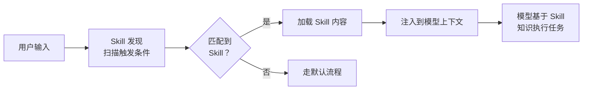

# Prompt 工程与框架原理：模板构建、Skills 机制

Prompt 工程不是“写提示词”，是一个**分层组装系统**。面试官问这个方向时，考的是你能不能把 Prompt 从“拼字符串”做成“模板工程”，以及你对 Agent 框架内部机制的理解深度。

---


## Prompt 模板方法

### Q：提示词模板是怎么构建的？

> 来源：抖音基础架构 Agent 一面

**新手答**：“把任务描述和代码拼成一个 Prompt 发给模型。”

**高手答**：

提示词模板不是字符串拼接，是一个**分层组装系统**：

1. **System Prompt 层**：定义角色（“你是一个资深测试工程师”）、输出格式约束（“只输出可执行的测试代码，不要解释”）、语言和框架约束（“使用 pytest”）
2. **上下文注入层**：把待测函数的源码、函数签名、依赖的类型定义、已有的测试用例作为参考注入。这里有个关键决策——**注入多少上下文**。太少模型不理解代码，太多撑爆窗口且干扰生成
3. **任务指令层**：具体要生成什么——单元测试、边界测试、异常路径测试。不同测试目标对应不同的指令模板
4. **Few-shot 示例层**：给 1-2 个同项目风格的测试用例作为示范，让模型对齐代码风格和断言习惯

模板不是静态的，会根据**待测代码的特征动态调整**——比如纯函数用轻量模板，有外部依赖的函数自动加上 mock 引导指令。模板还需要版本管理和 A/B 测试，不同模板对不同类型代码的效果差异很大。

**差距在哪**：新手把 Prompt 当成一次性的字符串拼接。高手的回答展示了一个四层分离的模板系统——角色、上下文、指令、示例各司其职，且能根据输入特征动态调整。面试官想看的是你有没有把 Prompt 当成一个需要版本管理和测试的工程产物。

---


## Skill 与框架原理

### Q：Skills 的原理有没有了解过？怎么实现的？

> 来源：抖音基础架构 Agent 一面 【小红书AI应用开发同题：Skills了解+如何管理各个Skills】

**新手答**：“就是预定义的 Prompt 模板。”

**高手答**：

Skills 是 Agent 系统中**可复用的能力单元**，比 Prompt 模板更完整。一个 Skill 通常包含：

```text
Skill = {
    触发条件:  意图匹配规则 / 关键词 / 正则,
    Prompt 模板:  针对这个能力的专用提示词,
    工具集合:  这个 Skill 能调用哪些工具,
    输出约束:  输出格式和校验规则,
    上下文策略:  需要注入哪些额外信息
}
```

**实现机制**：

1. **Skill 注册表**：所有 Skill 以文件形式存储（比如 `SKILL.md`），包含名称、描述、触发条件、完整的 Prompt 指令。系统启动时加载到内存
2. **触发匹配**：用户输入或 Agent 行为触发时，先做意图匹配——可以是关键词匹配（“整理面经” → 触发 `new-article` Skill）、正则匹配，或者用 embedding 做语义匹配
3. **动态 Prompt 组装**：匹配到 Skill 后，把 Skill 的 Prompt 模板展开，注入当前上下文（用户消息、项目状态等），形成完整的 Prompt 发给模型
4. **工具权限隔离**：不同 Skill 可以访问不同的工具子集——代码生成 Skill 能调文件读写工具，但搜索 Skill 只能调检索工具

**和普通 Prompt 模板的区别**：Prompt 模板是静态文本，Skill 是**一个完整的执行上下文**——它不只定义了”说什么”，还定义了”能做什么”和”在什么条件下触发”。

**怎么理解 Skill 的本质**：

Skill 本质上是**可复用的、领域特定的上下文注入模块**。理解 Skill 有三个层次：

**第一层：Skill 是结构化的 Prompt 模板**
- 每个 Skill 是一个 Markdown 文件，包含任务描述、执行步骤、注意事项
- 当 Skill 被触发时，其内容被注入到模型的上下文中，指导模型的行为

**第二层：Skill 是领域知识的封装**
- 不只是指令，还包含领域专业知识（如”面试题分类应该怎么做”、”代码审查应该检查什么”）
- 把专家经验固化成可执行的流程，让模型在特定领域表现得像专家

**第三层：Skill 是 Agent 的”职业技能树”**
- 每个 Skill 让 Agent 获得一项专业能力
- Skill 之间可以组合——一个复杂任务可能触发多个 Skill 协同工作
- 和 MCP 的区别：MCP 给 Agent 提供**工具**（能做什么），Skill 给 Agent 提供**知识和方法论**（怎么做、为什么这样做）

| 对比维度 | Skill | MCP Tool |
|---------|-------|----------|
| 本质 | 领域知识 + 执行流程 | 外部能力接口 |
| 注入方式 | 加载到上下文 | 注册为可调用工具 |
| 作用 | 指导模型”怎么思考和行动” | 让模型”能调用外部服务” |
| 类比 | 教科书/操作手册 | 工具箱里的工具 |

理解了这三层，就能回答”为什么 Claude Code 能在不同项目中表现不同”——因为不同项目配置了不同的 Skill，Agent 的”专业能力”随 Skill 配置动态变化。

**差距在哪**：新手只看到了 Skill 的表面（Prompt 模板），高手看到了完整的执行上下文——触发条件、工具权限、上下文策略。面试官考的是你对 Agent 框架的理解深度——不只是用框架，还理解框架怎么设计的。

**追问：创建 Skill 有哪些方式？除了自然语言描述，还有什么？**

> 来源：蚂蚁 Agent 开发一面

Skill 的创建方式不止一种，按自动化程度从低到高：

| 方式 | 描述 | 适用场景 |
|------|------|---------|
| **手写 Markdown** | 直接在 `.claude/skills/` 下创建 `.md` 文件，写 frontmatter + 正文 | 复杂领域 Skill，需要精细控制 |
| **自然语言描述** | 告诉 Agent「帮我创建一个做 X 的 Skill」，Agent 自动生成 .md 文件 | 快速原型，让 AI 帮你写 Skill |
| **Skill Creator 工具** | 用专门的 skill-creator 元 Skill，引导式创建、测试和优化 Skill | 标准化流程，带评测验证 |
| **从已有 Skill 派生** | 复制一个相似 Skill 后修改触发条件和内容 | 同类 Skill 批量创建 |
| **CLAUDE.md 内联** | 在项目 CLAUDE.md 中直接写行为指令（非独立文件） | 简单的项目级约束，不值得独立成 Skill |

关键认知：Skill 本质是 Markdown 文件，所以创建方式的区别不在于「用什么工具创建」，而在于**内容质量**——触发条件是否精准、执行步骤是否清晰、边界条件是否覆盖。

---

### Q：Claude Code 的架构有什么比较创新的设计？

> 来源：腾讯 Agent 应用开发一面

**新手答**：“它很强，能直接改代码。”

**高手答**：

Claude Code 在架构上有几个值得关注的设计：

1. **System Prompt 即规则引擎**：把项目约定、编码规范、安全约束全部写进 System Prompt（通过 CLAUDE.md），让模型在每次决策时都受约束。这比在代码里硬编码规则更灵活——改一个文件就能改变 Agent 行为，不需要重新部署
2. **工具调用的权限分级**：不同工具有不同的权限级别——读文件可以自动执行，写文件需要用户确认，危险操作（删除、push）需要显式授权。这个分级机制在安全和效率之间取得了平衡
3. **上下文自动压缩**：对话过长时自动做上下文压缩（summary），保留关键信息丢弃冗余。用户无感知，但解决了长会话的 token 限制问题
4. **Hooks 机制**：允许用户在工具调用前后插入自定义的 shell 命令（pre/post hooks），实现自动化的 lint、测试、格式化——把 Agent 行为嵌入到已有的开发工作流中

创新的核心不是某个单点技术，而是**把 Agent 当作开发者工作流的一部分来设计**——不是替代开发者，而是嵌入开发者的工具链。

**从源码角度看 Claude Code 的设计哲学**：

Claude Code 的开源让我们能直接看到生产级 Code Agent 的设计选择，有几个特别值得学习的理念：

**1. 上下文工程优先于 Prompt 工程**

Claude Code 不是靠一个精心调教的 System Prompt 来驱动的，而是通过**多层上下文注入**构建 Agent 的认知：

| 上下文层级 | 来源 | 作用 |
|-----------|------|------|
| 系统层 | 内置 System Prompt | 定义 Agent 身份和基本行为规范 |
| 项目层 | CLAUDE.md 文件 | 项目特定的规则、约定、架构信息 |
| 技能层 | Skills 目录 | 可复用的领域知识和操作流程 |
| 会话层 | 对话历史 + 工具结果 | 当前任务的动态上下文 |
| 环境层 | git status、文件内容、终端输出 | 实时的代码库状态 |

这五层上下文的动态组装，比任何静态 Prompt 都强大——Agent 的能力上限取决于上下文质量，不是 Prompt 技巧。

**2. 渐进式信息披露（Progressive Disclosure）**

Claude Code 不会一次性把整个项目塞进上下文。而是按需加载——先读目录结构，需要时再读具体文件，用 grep 定位再精读。这种”先粗后细”的策略：
- 节省 token：只加载真正需要的信息
- 减少噪声：避免无关代码干扰模型判断
- 更像人类开发者的工作方式

**3. 工具即能力边界**

Claude Code 通过工具定义（Read、Edit、Bash、Agent 等）严格限定了 Agent 能做什么。模型不能”自由发挥”——它只能通过预定义的工具与环境交互。这个设计把模型的不确定性限制在了工具调用的粒度内，而每个工具调用都可以做权限控制和审计。

**4. Hooks 机制实现行为可定制**

用户可以通过 hooks 在工具调用前后注入自定义逻辑（如自动格式化、安全检查），而不需要修改 Agent 本身。这是一种**开放-封闭原则**的体现——Agent 行为对扩展开放，对修改封闭。

**差距在哪**：新手只感受到了”强”。高手从 System Prompt 规则引擎、权限分级、上下文压缩、Hooks 四个具体设计点分析了创新。面试官考的是你对 Agent 框架的拆解和分析能力。

---


## Prompt 标准与 Skill 体系

### Q：一个好的 Prompt 和一个差的 Prompt 的区别？

> 来源：腾讯 Agent 应用开发一面

**新手答**：“好的 Prompt 描述清楚，差的 Prompt 太模糊。”

**高手答**：

区别不只是“清不清楚”，是**五个维度的差距**：

| 维度 | 差的 Prompt | 好的 Prompt |
|------|-----------|-----------|
| 任务边界 | “帮我写个程序” | “写一个 Python 函数，输入用户 ID 列表，返回每个用户最近 7 天的订单总额” |
| 输出格式 | 不指定 | 明确要求 JSON/代码/表格，给出示例 |
| 约束条件 | 无 | “不要用第三方库”“错误时返回空字典而不是抛异常” |
| 上下文 | 不提供 | 附上相关的类型定义、接口文档、已有代码 |
| 角色设定 | 无 | “你是一个熟悉 SQLAlchemy 的后端工程师” |

更深层的区别：

1. **好 Prompt 减少模型的决策空间**：模型面对的选择越少，输出越稳定。“写一个函数”有无数种写法，“写一个接收 list[int] 返回 dict[int, float] 的函数”就只有有限的合理写法
2. **好 Prompt 提供失败时的指引**：不只说“做什么”，还说“做不到时怎么办”——“如果找不到相关信息，回复‘信息不足，需要以下补充：...’”
3. **好 Prompt 是可迭代的**：不是一次写完，而是根据模型的实际输出不断调整，做版本管理和 A/B 测试

**差距在哪**：新手只用“清楚 vs 模糊”一个维度。高手从任务边界、输出格式、约束条件、上下文、角色五个维度对比，且点出了“减少决策空间”和“可迭代”两个深层原则。面试官考的是你写 Prompt 的工程化程度。

---

### Q：为什么已经有了 MCP，Anthropic 还要做 Skill？Skill 里面有没有工具？

> 来源：字节 Agent 开发实习一面

**新手答**：“Skill 就是 MCP 的升级版。”

**高手答**：

MCP 和 Skill 不是竞争关系，而是解决**两个完全不同的问题**：

- **MCP 解决的是“Agent 怎么调用外部工具”**——它是一个能力协议
- **Skill 解决的是“Agent 怎么在某个领域正确地思考和行动”**——它是一个知识框架

### 为什么只有 MCP 不够？

MCP 给了 Agent 工具，但没有告诉它**怎么有效地使用这些工具**。

举个例子：Agent 有一个“搜索数据库”的 MCP 工具。但如果没有 Skill，它不知道：按什么顺序搜索？搜索结果怎么解读？没有结果时该怎么办？特定领域的工作流是什么？

**MCP = 给一个人一套工具箱。Skill = 给他使用工具箱的专业技能。**

### 为什么现在才做 Skill？

| 原因 | 说明 |
|------|------|
| 模型能力提升 | 模型变聪明了，能可靠地遵循复杂指令，基于指令的（Skill）方案变得可行 |
| 工程成本差异 | Skill 是一个 .md 文件，任何人都能写；MCP Server 需要编码、部署、维护 |
| 可组合性 | 多个 Skill 可以自然地同时加载到上下文中；MCP 工具之间的集成更复杂 |
| 领域适配性 | Skill 让领域专家直接编码知识，不需要工程师介入；MCP 必须由工程师实现 |

### MCP vs Skill 全维度对比

| 对比维度 | MCP | Skill |
|---------|-----|-------|
| 本质 | 能力协议（工具注册与调用） | 知识框架（领域知识与方法论） |
| 解决的问题 | Agent 能调用什么 | Agent 怎么思考和行动 |
| 载体 | 代码（Server + Client） | 文档（Markdown 文件） |
| 创建门槛 | 需要编程能力 | 只需领域知识 |
| 注入方式 | 注册为可调用的工具 | 加载到模型上下文中 |
| 作用时机 | 模型显式调用时 | 加载后持续影响模型行为 |
| 类比 | 工具箱里的锤子和螺丝刀 | 教你什么时候用锤子、什么时候用螺丝刀的操作手册 |

### Skill 里面有没有工具？

这个问题的答案是**有引用，但不包含**：

- Skill 可以**引用**工具：“在第三步，执行这条 bash 命令”、“用 Edit 工具修改文件”
- 但 Skill 不**包含**工具——它包含的是**关于何时、如何使用现有工具的指令**
- Skill 通过自然语言指令来编排工具，而不是通过工具注册机制

本质上，Skill 是工具的“使用说明书”，不是工具本身。

**差距在哪**：新手把 MCP 和 Skill 看成竞争关系，以为 Skill 是 MCP 的替代品。高手理解它们服务于不同层次——MCP 提供能力（能做什么），Skill 提供知识（怎么做），两者互补而非互斥。面试官考的是你能不能区分“工具”和“使用工具的知识”这两个抽象层次，以及你对 Agent 系统架构演进方向的理解。

---

### Q：如果让你从零设计一个 Skill 系统，需要实现哪些核心能力？

> 来源：字节 Agent 开发实习一面 【蚂蚁AI应用开发二面追问：单一 Skill 模块设计思路】

**新手答**：“写个插件系统，注册回调函数。”

**高手答**：

Skill 系统的设计和传统插件系统有本质区别——Skill 不是代码，是知识；调用不是函数执行，是上下文注入。围绕这个核心理念，需要实现三个核心能力：

### 整体架构



### 核心能力一：注册（Registration）

基于文件系统的注册，不需要服务器和数据库：

```text
skills/
  ├── code-review/
  │   ├── config.yaml       # 名称、描述、触发条件、参数定义
  │   └── skill.md          # Skill 内容（领域知识 + 执行流程）
  ├── deploy-check/
  │   ├── config.yaml
  │   └── skill.md
  └── ...
```

config 中定义的关键字段：
- **name**：Skill 的唯一标识
- **description**：用于发现匹配的描述（这个字段至关重要，直接决定匹配质量）
- **triggers**：触发条件（关键词、正则、显式命令）
- **args_schema**：Skill 接受的参数定义

设计要点：纯文件系统，支持热重载——新增或修改 Skill 文件后立即生效，不需要重启服务。

### 核心能力二：发现（Discovery）

当用户输入到达时，快速匹配最相关的 Skill：

| 匹配策略 | 实现方式 | 适用场景 |
|---------|---------|---------|
| 显式调用 | 用户输入 `/skill-name` | 用户明确知道要用哪个 Skill |
| 关键词匹配 | 正则或关键词命中触发条件 | 简单直接，零延迟 |
| 语义匹配 | 用 embedding 计算输入与 Skill 描述的相似度 | 更智能，但有延迟开销 |

发现过程必须**快**——每条用户消息都要扫描所有 Skill 的触发条件，延迟必须可忽略。所以关键词匹配是首选，语义匹配作为兜底。

### 核心能力三：调用（Invocation）

匹配到 Skill 后，执行的不是函数调用，而是**上下文注入**：

1. 读取 Skill 的 .md 内容
2. 如果 Skill 定义了参数，解析用户输入中的参数值
3. 将 Skill 内容注入到模型的上下文中——Skill 的知识变成模型在本次会话中的“专业背景”
4. 模型在 Skill 知识的指导下完成任务

**关键认知：Skill 调用不是函数调用，是上下文注入。** Skill 不是“执行一段代码然后返回结果”，而是“把一段领域知识注入模型的认知中，影响模型后续的所有行为”。

### 设计时必须考虑的问题

| 问题 | 解决方案 |
|------|---------|
| 命名空间冲突 | 两个 Skill 触发条件相似时，需要优先级机制（权重或显式排序） |
| 多 Skill 组合 | 复杂任务可能需要同时激活多个 Skill，需要定义组合规则和上下文拼接顺序 |
| 生命周期管理 | Skill 的影响何时结束？一次任务后？整个会话？需要明确的作用域定义 |
| Skill 级评测 | 每个 Skill 需要自己的评测集，验证注入 Skill 后模型行为是否符合预期 |
| 上下文预算 | 多个 Skill 同时加载可能撑爆上下文窗口，需要按优先级裁剪 |

**差距在哪**：新手按照传统插件系统的思路来设计——注册回调函数、执行代码逻辑。高手理解 Skill 系统的本质是**基于文件的知识管理 + 触发式发现 + 上下文注入**，和传统插件系统（代码注册 + 函数调用 + 返回结果）在架构理念上完全不同。面试官考的是你能不能跳出”一切皆代码”的思维定式，理解 LLM 时代”知识即能力”的新范式。

**追问：手撕一个 Skill 系统——实现注册、发现和调用**

> 来源：字节抖音 Agent 开发一面

题目要求：目录结构为 `.agents/skills/` 下每个 Skill 一个子目录，包含 `.yaml` 配置文件和 `scripts/*.js` 执行脚本。

这道手撕题的关键不是写多少代码，而是**设计清晰的三层抽象**：

```text
注册（Registration）：扫描 .agents/skills/ 目录，解析每个子目录的 yaml 配置，建立 Skill 注册表
发现（Discovery）：根据用户输入匹配 Skill 的触发条件（关键词/意图/正则）
调用（Invocation）：加载匹配 Skill 的内容（知识注入）或执行脚本（动作执行）
```

**yaml 配置文件设计**：

```yaml
name: deploy-checker
description: 检查部署状态并报告异常
triggers:
  - pattern: “检查部署|部署状态|上线情况”
    type: regex
scripts:
  - scripts/check_status.js
  - scripts/report.js
context: |
  你是一个部署检查专家，擅长分析 CI/CD 管线状态...
```

**核心实现思路**（伪代码）：

```text
1. 注册：启动时递归扫描 .agents/skills/*/，
   解析 yaml → 建立 Map<name, SkillConfig>
2. 发现：用户输入到来时，遍历注册表，
   逐个匹配 triggers（正则/关键词/语义相似度）
   → 返回匹配度最高的 Skill（或 top-K）
3. 调用：
   - 如果 Skill 有 context 字段 → 注入上下文（知识型 Skill）
   - 如果 Skill 有 scripts 字段 → 按序执行脚本（动作型 Skill）
   - 两者可同时存在
```

**面试官关注的设计细节**：冲突解决（多个 Skill 同时匹配时的优先级）、热加载（新增 Skill 不需要重启）、错误隔离（一个 Skill 的脚本崩溃不影响其他 Skill）。

---

### Q：LobeChat 的插件和 Claude Code 的 Skills 有什么本质区别？

> 来源：字节实习二面

**新手答**：”都是给 AI 加功能的，只是平台不一样。”

**高手答**：

表面看都是”扩展能力”，但**架构理念完全不同**——LobeChat 的插件是传统的代码执行模型，Claude Code 的 Skills 是 Prompt 注入模型：

| 维度 | LobeChat 插件 | Claude Code Skills |
|------|--------------|-------------------|
| **本质** | 可执行的代码模块（API 调用） | Markdown 文件（知识 + 指令） |
| **触发方式** | 模型输出 function_call → 执行代码 | 用户输入匹配描述 → 注入到上下文 |
| **执行者** | 插件的代码运行时 | 模型本身（按 Skill 中的指令行动） |
| **能力边界** | 取决于代码能做什么 | 取决于模型能理解和执行什么 |
| **开发方式** | 写代码、定义 API schema、部署服务 | 写 Markdown、定义触发条件和步骤 |
| **状态管理** | 插件代码自己管状态 | 无状态，每次重新注入 |

**LobeChat 插件的工作流**：

```text
用户输入 → 模型判断需要调用插件 → 输出 function_call JSON
→ LobeChat 解析 JSON → 调用插件 API → 返回结果 → 模型组织回答
```

插件是**模型的手**——模型决定要不要用、怎么用，但执行逻辑是代码写死的。

**Claude Code Skills 的工作流**：

```text
用户输入 → 匹配 Skill 的触发描述 → 将 Skill 的 Markdown 内容注入上下文
→ 模型按照 Skill 中的步骤指引行动（调工具、写代码、组织输出）
```

Skill 是**模型的知识**——不执行代码，而是告诉模型”遇到这类任务该怎么做”。模型拥有完整的执行自主权。

**核心区别的一句话总结**：LobeChat 插件是**”代码做事，模型指挥”**；Claude Code Skills 是**”模型做事，知识指导”**。

**差距在哪**：新手把两者等同于”不同平台的同一种东西”。高手从本质（代码 vs 知识）、触发（function_call vs 描述匹配）、执行者（运行时 vs 模型）三个维度做了精确区分。面试官考的是你对 Agent 能力扩展的两种范式的理解——传统的”工具调用”范式和新兴的”知识注入”范式，各有适用场景。

---


## Prompt 结构化设计

### Q：通常 Prompt 包含哪些结构？

> 来源：淘宝闪购 AI应用研发 一面

**新手答**：“角色、指令、示例，三个部分。”

**高手答**：

生产级 Prompt 远不止三要素。一个完整的 Agent 系统 Prompt 通常包含六层结构，每层有不同的职责和优先级：

**1. 身份与角色层（Identity）**

定义模型是谁、基本行为准则。放在最开头，优先级最高。

```text
你是一个电商客服助手，服务于XX平台的用户。
你的回答必须准确、礼貌、简洁。
```

**2. 规则约束层（Rules）**

硬性限制——模型绝对不能违反的规则。通常用否定句式强调。

```text
- 绝不编造商品信息，不确定时说"我帮您查询"
- 不讨论政治、宗教等敏感话题
- 涉及退款操作必须确认订单号
```

**3. 上下文注入层（Context）**

动态注入的背景信息——当前用户画像、历史对话摘要、检索到的知识片段。这一层每次请求都不同。

**4. 工具描述层（Tools）**

可用工具的定义和使用说明。通过 function calling 接口或 Prompt 内嵌的方式提供。

**5. 示例层（Examples）**

Few-shot 示例——展示期望的输入输出格式和推理方式。2-3 个示例通常足够，太多会挤占上下文空间。

**6. 输出格式层（Output Format）**

约束输出的结构——JSON、Markdown、特定模板。放在 Prompt 末尾，离模型输出最近，遵循度最高。

**层级之间的优先级**：

```text
规则约束 > 身份角色 > 上下文 > 示例 > 输出格式 > 工具描述
```

当不同层的指令冲突时（比如示例中的行为违反了规则），规则约束应该胜出。在 Prompt 中可以显式声明优先级：“如果以下示例与上述规则冲突，以规则为准。”

**工程实践**：

生产系统中，这六层通常不是写在一个字符串里，而是用**模板引擎**动态拼装——身份层和规则层固定，上下文层和工具层按需注入，示例层按任务类型切换。Prompt 版本管理和 A/B 测试也是必要的工程实践。

**差距在哪**：新手只知道“角色+指令+示例”三件套。高手展示了六层架构——身份、规则、上下文、工具、示例、输出格式——且理解层级间的优先级关系和动态拼装机制。面试官考的是你对 Prompt 的理解是“写一段话”还是“设计一个分层系统”。

---

### Q：在调优 Prompt 时，你有哪些实战经验？如何利用 AI 辅助自己优化 Prompt？

> 来源：字节后端 Agent 开发二面

**新手答**：“多试几遍，看哪个效果好就用哪个。”

**高手答**：

Prompt 调优不是「碰运气」，是一个有方法论的工程流程。分两个层面回答：

**一、人工调优的实战经验**

核心方法论是**控制变量 + 快速迭代**：

| 步骤 | 做法 | 关键点 |
|------|------|--------|
| 1. 建评测集 | 准备 20-50 条覆盖主要场景的测试 case | 包含正常 case + 边界 case + 已知 bad case |
| 2. 单变量调整 | 每次只改一个要素（角色/约束/示例/格式） | 多变量同时改，效果归因不清 |
| 3. 定量对比 | 跑评测集，记录通过率变化 | 不要凭感觉判断「好像好了一点」 |
| 4. 版本管理 | 每个版本的 Prompt 存档 + 评测结果 | 方便回退和复盘 |

**高频有效的调优手段（按 ROI 排序）**：

1. **加约束条件**：从「回答问题」到「用 JSON 格式回答，字段包含 answer 和 confidence」——约束越明确，输出越稳定
2. **加 Few-shot 示例**：1-2 个好示例的效果常常超过大段指令描述
3. **拆步骤**：把复杂任务拆成「先分析 → 再判断 → 最后输出」，比一步到位成功率高很多
4. **加负面指令**：明确说「不要做什么」，比只说「做什么」更能避免常见错误
5. **调整上下文顺序**：把最重要的信息放在开头和结尾（避免 Lost in the Middle）

**二、AI 辅助优化 Prompt 的方法**

| 方法 | 做法 | 适用场景 |
|------|------|---------|
| **让 AI 分析 bad case** | 把失败的输入输出给 AI，问「为什么这个 Prompt 在这个 case 上失败了」 | 定位单个 case 的失败原因 |
| **让 AI 生成变体** | 给 AI 当前 Prompt + 目标，让它生成 5 个改进版本 | 快速探索优化方向 |
| **让 AI 做评测** | LLM-as-Judge，让 AI 对两个 Prompt 版本的输出做偏好排序 | 评测集太大、人工评判成本高 |
| **Meta-Prompting** | 让 AI 扮演「Prompt 工程师」，输入任务描述，输出优化后的 Prompt | 冷启动阶段快速获得基线 Prompt |

**关键认知**：AI 辅助优化 Prompt 的价值不在于「自动变好」，而在于**加速迭代循环**——人定方向（哪里需要改进），AI 提供候选方案（怎么改），人做最终判断（哪个版本上线）。完全依赖 AI 自动优化容易陷入「过拟合评测集」的陷阱。

**差距在哪**：新手的「多试几遍」没有方法论，效率低且不可复现。高手展示了控制变量法 + 评测集驱动的工程化流程，且把 AI 辅助定位在加速迭代而非替代判断。面试官考的是你在 Prompt 调优上有没有系统性的工程实践。

---

## 这类题的答题模式

Prompt 工程与框架原理题的核心是**系统化思维**：

```text
1. Prompt 不是字符串——是分层的、动态的、需要版本管理的工程产物
2. Skill 不是模板——是触发条件 + Prompt + 工具 + 约束的完整执行上下文
3. 讲实现时要讲清楚"怎么触发、怎么组装、怎么隔离"
4. 和传统软件设计的类比：Skill ≈ 插件系统，Prompt 模板 ≈ 配置化策略
```

下一篇建议继续看：

- [RAG 与检索系统：从 chunk 设计到多路召回](../09-rag-retrieval/index.html)
