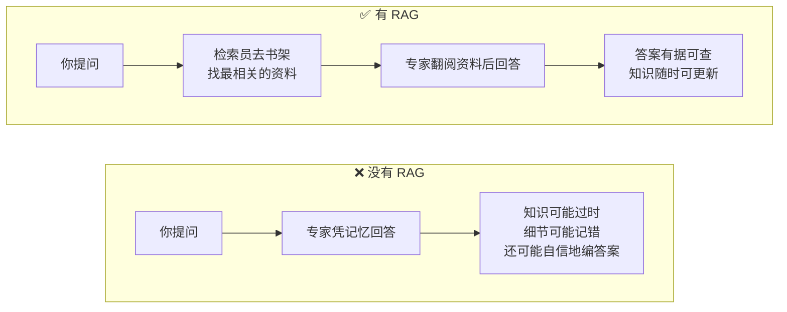
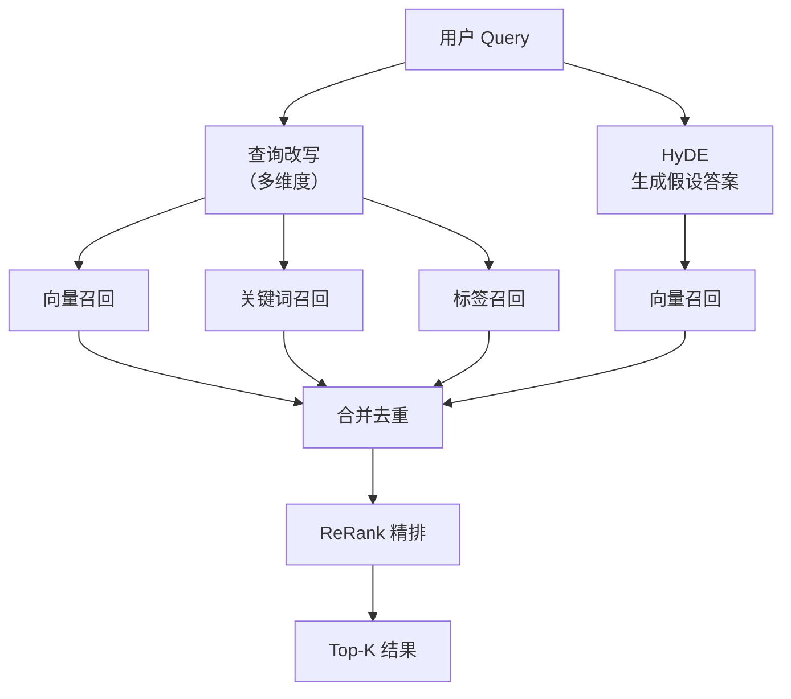
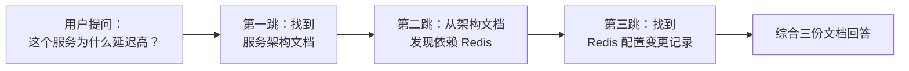
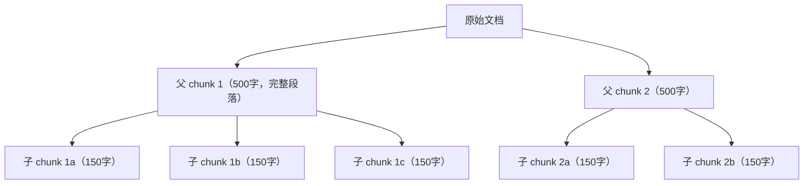
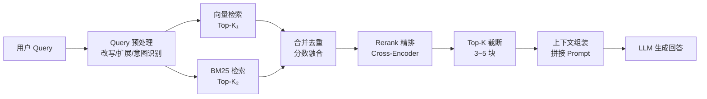
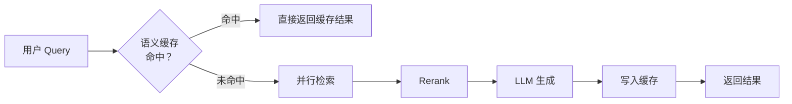
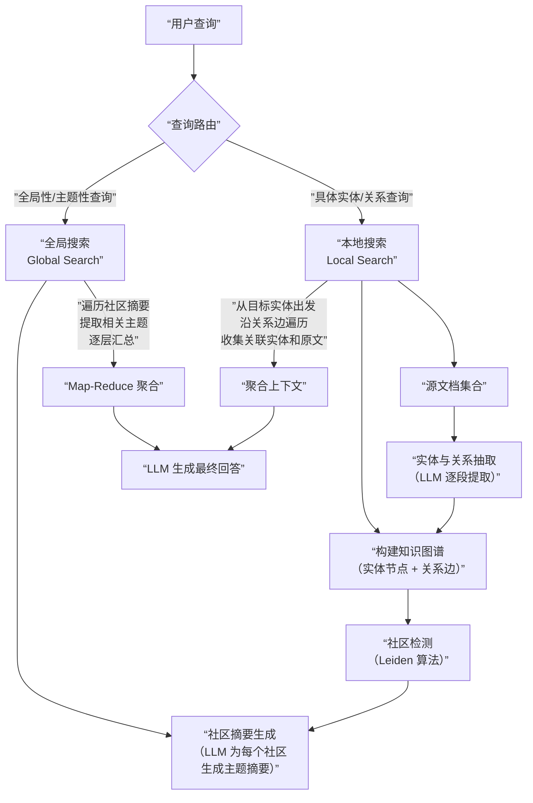

# RAG 与检索系统：从 chunk 设计到多路召回

RAG 是 Agent 系统的“外部知识接口”。面试官考 RAG 时不想听“向量数据库”四个字——他想知道的是**离线怎么切片、在线怎么召回、召回后怎么排序**，以及面对复杂查询时怎么做改写和意图识别。

---

## Q：RAG 的检索如何实现？

> 来源：阿里 AI Agent 开发一面

**新手答**：“用向量数据库做相似度搜索。”

**高手答**：

RAG 检索分**离线**和**在线**两部分。

离线侧负责文档清洗、切片、去重、embedding 计算和向量入库。在线侧的流程是：

1. 用 query 编码成向量，去向量库做召回
2. 结合 BM25 或关键词检索做**混合召回**
3. 用 rerank 模型重排
4. 把最相关的证据拼接给大模型生成答案

```python
# 简化版 RAG 检索流程
query_vec = embed(query)
candidates = vector_db.search(query_vec)
bm25_docs = bm25.search(query)
merged = merge_and_dedup(candidates, bm25_docs)
reranked = reranker.rank(query, merged)
context = "\n".join(doc.text for doc in reranked[:top_k])
answer = llm.generate(query, context)
```

切片策略直接影响效果：块太大召回不准，块太小上下文断裂。通常用**滑窗切割 + overlap**，对长文档还会给每个 chunk 带上标题、章节路径、来源元信息，提升召回相关性。

**差距在哪**：新手只说了“向量数据库”——这是一个组件，不是方案。高手的回答覆盖了离线和在线两条链路，且点出了 chunk 设计这个影响效果的关键因素。面试官考的是你对 RAG 工程的完整认知。

---

## Q：多维度的查询改写是什么？改写遇到需要用户补充信息时怎么设计？

> 来源：抖音基础架构 Agent 一面

**新手答**：“用大模型把用户的查询扩展一下。”

**高手答**：

多维度查询改写是指**同时从多个角度对原始 query 做变换**，提升召回的全面性：

```text
原始 query："北京周末带娃去哪玩"

维度1-意图展开：亲子活动 / 儿童乐园 / 博物馆 / 户外游
维度2-实体补全：北京市 → 朝阳区/海淀区/...
维度3-同义改写："带娃" → "亲子" / "儿童" / "适合小朋友"
维度4-约束提取：时间=周末，地点=北京，人群=有孩子的家庭
```

**需要用户补充信息时**，用**槽位填充 + 主动澄清**机制：
1. 意图识别后，检查必要槽位是否完整（比如“订酒店”需要日期、城市、人数）
2. 缺失槽位时，不是笼统地问“你能说得更清楚吗”，而是生成**具体的选择题**：“你想去哪个城市？”或“入住日期是什么时候？”
3. 多个槽位都缺时，按优先级排序，先问最关键的

技术实现上，查询改写用**模型生成 + 规则约束混合**：模型负责语义理解和改写，规则负责实体标准化和格式校验。槽位检测用一个轻量分类器判断缺失情况，避免每次都调大模型。

**差距在哪**：新手的“扩展一下”是单维度思考。高手的多维度改写覆盖了意图、实体、同义、约束四个角度，且有用户交互的槽位填充机制。面试官考的是你对查询理解链路的完整认知。

---

## Q：并行化意图识别是什么？为什么要并行化？如何实现的？

> 来源：抖音基础架构 Agent 一面

**新手答**：“用多线程跑意图分类。”

**高手答**：

并行化意图识别是指**同时执行多个意图维度的判断，而不是串行地先判大类再判小类**。

串行方案的问题是链路长、延迟高。比如先判“是不是搜索意图” → 再判“搜索什么品类” → 再判“有没有比较意图”，三级串行加起来可能 300ms+。而且前一级判断错了，后面全错——错误级联放大。

并行化把多个维度**同时发出去**：

```text
              ┌→ 意图大类分类器（搜索/导航/交易）
user query ──┼→ 品类识别器（美食/旅游/购物/...）
              ├→ 行为意图检测器（比较/推荐/查询/...）
              └→ 情感倾向检测器（正面/负面/中性）
```

每个分类器独立运行，结果汇总后做**融合决策**。实现关键点：
1. 各分类器用**异步并发**执行（`asyncio.gather` 或线程池），总延迟 = 最慢的那个
2. 每个分类器可以用不同规模的模型——简单维度用小模型，复杂维度用大模型
3. 设置**超时兜底**：某个分类器超时不影响其他维度，用默认值填充

**差距在哪**：新手的“多线程”只答了实现手段，没答为什么要并行化。高手先解释了串行方案的问题（延迟高 + 错误级联），再给出并行化的架构和融合策略。面试官考的是性能优化思维。

---

## Q：讲一下项目里召回的流程

> 来源：抖音基础架构 Agent 一面

**新手答**：“用向量搜索召回相关文档。”

**高手答**：

召回是一个**多路召回 → 合并去重 → 精排**的三阶段流程：

**第一阶段：多路召回**

```text
              ┌→ 向量召回（语义相似度，覆盖同义表达）
改写后 query ──┼→ 关键词召回（BM25，覆盖精确匹配）
              ├→ 标签召回（实体/品类标签匹配）
              └→ 图召回（知识图谱关联路径）
```

每路召回各取 top-K，各有优势：向量召回抓语义，关键词召回抓精确词，标签召回抓结构化属性，图召回抓实体关系。

**第二阶段：合并去重**

多路结果合并，同一文档被多路召回的加分。去重用文档 ID 做精确去重 + 内容指纹做近重复去重。

**第三阶段：精排**

用 Cross-Encoder 或精排模型对候选集做细粒度相关性打分。精排模型能看到 query 和文档的交互特征，精度远高于召回阶段的双塔模型。关键工程细节：每路召回的 K 值怎么定——K 太小漏结果，K 太大精排压力大，通常根据各路历史准确率动态调整。

**差距在哪**：新手只知道向量检索一路。高手的多路召回 + 精排是搜索系统的标准范式，面试官考的是你对召回-精排两阶段架构的完整理解。

---

## Q：如果 RAG 召回了很多相互矛盾的文档，Agent 应该怎么处理，而不是直接让模型自己总结？

> 来源：腾讯大模型应用开发二面

**新手答**：“让模型自己综合判断。”

**高手答**：

不能直接把矛盾文档一股脑丢给模型让它自己“综合”，那样很容易生成一个看起来圆滑但实际上没有依据的答案。

更合理的做法是**先做证据归一化和冲突检测**：

1. **分组**：按来源、时间、可信度对召回文档分组
2. **冲突检测**：抽取同一字段的不同取值，判断冲突类型——是时间差异导致的，还是来源本身互相打架
3. **冲突消解**：
   - 时间敏感信息 → 新版本优先
   - 来源权威性不同 → 官方文档优先
   - 无法判断 → 明确告诉用户存在冲突，说明目前最可信的依据

Agent 在这里更像**证据调解器**，而不是万能总结器。核心是在模型生成前就把冲突处理好，而不是让模型在矛盾信息中自己编一个“看起来合理”的答案。

**差距在哪**：新手直接把矛盾丢给模型——这会生成看似合理但无依据的答案。高手在模型生成前加了冲突检测和消解层，按时间、权威性、可判断性三个维度做处理。面试官考的是你有没有意识到 RAG 不只是“召回 + 生成”，中间还需要证据治理。

---

## Q：Embedding 和 ReRank 模型具体怎么做的微调？

> 来源：腾讯 AI 应用开发

**新手答**：“用自己的数据训练一下。”

**高手答**：

**Embedding 模型微调**：

目标是让模型在业务领域里，把语义相近的 query 和文档映射到向量空间中的相近位置。

训练数据格式：`(query, positive_doc, negative_doc)` 三元组。hard negative 越难越好——随机采样的 negative 太简单，模型学不到有区分度的表示。用 BM25 或当前模型 top-K 中的非相关文档做 hard negative。

常用 loss：
- **MultipleNegativesRankingLoss**（sentence-transformers 最常用）：batch 内其他 query 的 positive 自动作为 negative，不需显式构造
- **InfoNCE / Contrastive Loss**：拉近 positive pair，推远 negative pair
- **Triplet Loss**：`max(0, d(q, pos) - d(q, neg) + margin)`

框架：`sentence-transformers` 最成熟，支持 BGE、E5、GTE 等预训练模型的微调。

**ReRank 模型微调**：

ReRank 是 Cross-Encoder——输入是 `(query, doc)` 拼接后一起过模型，输出相关性分数。比 Embedding 双塔精度高，但计算量大，只用于精排。

训练数据：`(query, doc, label)`，label 是相关性分数或 0/1 标签。Loss 用 BCE 或 MSE。

**微调关键细节**：
1. **Hard Negative Mining**：negative 质量决定微调效果
2. **评估指标**：用 Recall@K、MRR、NDCG 在验证集上评估，不是看 loss 降了就行
3. **防止过拟合**：微调轮数不宜过多（1-3 epoch），否则通用检索能力退化

**差距在哪**：新手只说了“用数据训”。高手覆盖了完整链路——数据构造（三元组 + hard negative）、loss 选择、框架、评估、防过拟合。面试官考的是你有没有真正微调过检索模型。

---

## Q：双路召回的 TopK，K 是如何确定的？有没有试过一个多召回点、一个少召回点？

> 来源：腾讯 AI 应用开发

**新手答**：“K 就取 10 或 20。”

**高手答**：

K 值要**根据召回路的特性和下游精排的承载能力来定**。

```text
BM25 关键词召回：K = 10~20（精确匹配路，召回量不需要太大）
Embedding 向量召回：K = 20~50（语义路，覆盖面要大一些）
ReRank 精排后最终 TopK：K = 3~5（给模型的上下文不宜太多）
```

**K 值调优方法**：Grid Search 在评估集上搜索最优组合——固定一路 K，遍历另一路（5、10、20、30、50），合并去重后精排，用 Recall@K 和最终生成质量评判。

**一多一少的策略**：实际中确实会对不同路设不同 K：
- **向量路 K 大、BM25 路 K 小**：向量覆盖面广但精度稍低，多召回交给 ReRank 筛；BM25 精确率高，少量就够
- **反过来也有场景**：精确查询（订单号、型号）时 BM25 路 K 调大

关键权衡：K 越大覆盖率越高但噪声也多（ReRank 负担重、延迟增加）；K 越小精度高但可能漏掉相关文档。生产环境通常还有延迟约束（“总检索时间不超过 200ms”），K 值要在 Recall 和延迟之间找平衡。

**差距在哪**：新手随便定一个 K。高手有系统的调优方法论——Grid Search + 不同路不同 K + 延迟约束。面试官考的是你调 RAG 参数时有没有数据驱动的方法。

---

## Q：如何用通俗易懂的方式向非技术人员解释 RAG？有没有好的类比？

> 来源：携程 Agent 开发实习一面

**新手答**：“就是让模型先搜索再回答。”

**高手答**：

给非技术同事解释 RAG，我会这么说：

**一句话版本**：RAG 就是让 AI 在回答问题之前，先去翻资料，而不是纯靠记忆回答。

**图书馆类比**（最直观）：



**核心价值**（三点）：
1. **知识实时性**：模型训练数据有截止日期，但外部知识库可以随时更新——今天新上线的产品文档，明天就能被检索到
2. **可追溯性**：回答附带引用来源，用户可以点击查看原文，建立信任
3. **降低幻觉**：有资料做依据，模型不容易“编”答案

**主要应用场景**：企业知识库问答（内部文档/FAQ）、客服系统（产品手册检索）、法律/医疗等需要精确引用的领域、代码文档助手。

**差距在哪**：新手的解释太技术化，非技术人员听不懂。高手用图书馆类比把 RAG 的三个角色（用户 → 检索员 → 专家）讲清楚了，再用三点核心价值说明“为什么需要”。面试官考的不只是你懂不懂 RAG，还考你能不能把复杂概念讲给不同背景的人听——这是工程师的沟通能力。

---

## Q：如何快速上手一个没接触过的技术（如向量数据库）？

> 来源：携程 Agent 开发实习一面

**新手答**：“看官方文档，跑个 Demo。”

**高手答**：

快速上手一个新技术，我的方法论是**“倒金字塔学习法”——从应用场景倒推，不从底层原理开始**：

**第一步：搞清楚“它解决什么问题”（30 分钟）**

不是先看原理，而是先理解：传统方案的痛点是什么？向量数据库比传统数据库多解决了什么？答案是——传统数据库只能精确匹配，而向量数据库能做**语义相似度检索**。这一步决定了你后面学的所有东西有没有方向感。

**第二步：跑通一个最小可用的 Demo（2-3 小时）**

选一个主流方案（如 Milvus / Qdrant / Chroma），跑通“文本 → Embedding → 入库 → 查询 → 返回结果”的最短路径。不要一开始就研究分布式部署、索引类型选择这些细节。

```python
# 最小 Demo：Chroma
import chromadb
client = chromadb.Client()
collection = client.create_collection("demo")
collection.add(documents=["北京今天晴天", "上海明天下雨"], ids=["1", "2"])
results = collection.query(query_texts=["天气怎么样"], n_results=1)
```

**第三步：对标项目需求，补齐关键知识点（1-2 天）**

Demo 跑通后，对照项目需求列一个清单：需要什么索引类型（HNSW / IVF）？数据量级多大？需不需要过滤？需不需要持久化？然后**按需深入**，不铺开学。

**第四步：踩坑 → 查 Issue → 形成经验（持续）**

真正的理解来自踩坑。遇到问题先查 GitHub Issue 和社区讨论，很多坑别人已经踩过了。

**差距在哪**：新手的“看文档跑 Demo”没有方法论，容易在原理细节里迷失方向。高手的倒金字塔方法有明确的四步节奏——先理解价值、再跑通最短路径、再按需深入、最后靠实践沉淀。面试官考的是你的学习效率和自驱能力。

---

## Q：RAG 系统检索到的文档很多但回答质量差，怎么排查？

> 来源：携程 Agent 开发实习一面

**新手答**：“可能是模型不够好，换个更强的模型。”

**高手答**：

“检索多但回答差”说明问题大概率不在模型，而在**检索质量和上下文组装**。排查按链路从前到后逐段定位：

**1. 检索相关性差（召回了但不准）**：

- **症状**：返回的文档和用户问题表面相关但实际不对口
- **排查**：抽样看 top-K 文档和 query 的匹配度，计算 Recall@K / Precision@K
- **常见原因 + 解法**：
  - Embedding 模型领域适配差 → 用业务数据微调 Embedding
  - Chunk 切分不合理（太大导致噪声多，太小导致上下文断裂）→ 调整 chunk size 和 overlap
  - 缺少多路召回 → 加 BM25 关键词路补充精确匹配

**2. 排序失效（相关文档排在后面）**：

- **症状**：相关文档确实被召回了，但排在第 8、9 位，top-3 都是噪声
- **排查**：对比有无 ReRank 时的排序效果
- **解法**：加 Cross-Encoder ReRank 模型做精排；或微调 ReRank 模型

**3. 上下文组装问题（给模型的信息太杂）**：

- **症状**：top-K 文档质量还行，但模型回答仍然差
- **排查**：直接看拼给模型的 context，是不是信息太多、互相矛盾、或关键信息被淹没
- **解法**：减少 top-K（从 10 降到 3-5）；对召回文档做摘要提取再喂给模型；加冲突检测

**4. Prompt 模板问题**：

- **症状**：换了更好的检索结果，回答质量还是没提升
- **排查**：检查 Prompt 是否清晰指示模型“基于以下资料回答，如果资料不足请说明”
- **解法**：优化 Prompt 模板，加引用约束

**差距在哪**：新手第一反应是“换模型”——这是最贵且通常无效的做法。高手按 RAG 链路逐段排查（检索 → 排序 → 组装 → Prompt），每段都有具体的症状、排查方法和解法。面试官考的是你排查问题时的系统性思维。

---

## Q：什么是余弦相似度？在 RAG 系统中用来做什么？

> 来源：携程 Agent 开发实习一面

**新手答**：“衡量两个向量的相似程度。”

**高手答**：

余弦相似度衡量的是**两个向量方向的接近程度**，不关心长度，只关心角度：

```text
cos(A, B) = (A · B) / (|A| × |B|)

值域：[-1, 1]
  1  = 方向完全一致（语义最相似）
  0  = 正交（语义无关）
 -1  = 方向完全相反（语义相反）
```

**为什么用余弦而不是欧氏距离**：

Embedding 模型输出的向量，不同文本的向量长度（模）可能差异很大。如果用欧氏距离，一段长文本和一段短文本即使语义相同，距离也可能很远（因为向量模不同）。余弦相似度归一化了长度，只比较方向——语义相同的文本，无论长短，余弦相似度都接近 1。

**在 RAG 系统中的用途**：

1. **检索阶段**：用户 query 向量和文档库中所有文档向量计算余弦相似度，取 top-K 作为候选
2. **去重阶段**：两个 chunk 的余弦相似度 > 0.95，判定为近重复，去掉一个
3. **阈值过滤**：相似度低于阈值（如 0.6）的文档直接丢弃，不进入精排——避免把完全不相关的文档喂给模型

**补充**：实际向量数据库（Milvus / Qdrant）在 ANN 检索时用的是**近似最近邻算法**（HNSW / IVF），不是暴力遍历所有向量。精确的余弦计算只在小规模候选集上做。

**差距在哪**：新手只背了定义。高手从公式、为什么选余弦而非欧氏、在 RAG 中的三个具体用途（检索/去重/过滤）做了完整解释，且补充了工程实现细节。面试官考的是你理解了这个指标的设计动机，而不只是会算。

---

## Q：什么是嵌入（Embedding）？为什么 RAG 系统需要将文本转为向量？

> 来源：携程 Agent 开发实习一面

**新手答**：“把文本变成数字，方便计算。”

**高手答**：

嵌入（Embedding）是把文本映射到一个**高维向量空间**中的过程——每段文本变成一个固定长度的数字数组（如 768 维或 1536 维），这个数组就叫这段文本的“向量表示”。

**关键特性**：语义相近的文本，在向量空间中的位置也相近。

```text
"北京今天天气很好"  →  [0.12, -0.45, 0.78, ...]  ─┐
"今日北京晴朗"      →  [0.11, -0.43, 0.76, ...]  ─┘ 向量接近

"明天股市走势如何"  →  [-0.67, 0.23, -0.11, ...] ← 向量远离
```

**为什么 RAG 需要向量化**：

传统检索靠**关键词匹配**——用户搜“怎么退货”，系统只能找到包含“退货”两个字的文档。但用户可能问的是“买错了怎么办”“商品不满意能换吗”——意思一样，但没有一个共同关键词。

向量化解决的是**语义匹配**问题——“怎么退货”和“商品不满意能换吗”的 Embedding 向量很接近，即使没有共同关键词也能检索到。

**Embedding 模型的选型考量**：
- **通用模型**：OpenAI text-embedding-3、BGE、E5、GTE——开箱即用，适合大部分场景
- **领域微调**：如果业务术语多（医疗、法律、金融），通用模型可能把业务术语和日常用语混淆，需要用业务数据做微调
- **维度和性能的权衡**：维度越高表达力越强，但存储和计算成本也越高。768 维是常见平衡点

**差距在哪**：新手的“变成数字”没有解释为什么要这么做。高手从语义匹配的角度解释了向量化的动机——解决关键词匹配的语义鸿沟问题，且覆盖了模型选型的实际考量。面试官考的是你理不理解 Embedding 在 RAG 管线中的核心作用。

---

## Q：RAG 中如何提高文档召回率？

> 来源：蚂蚁集团智能体与大模型应用一面

**新手答**：“换更好的 Embedding 模型。”

**高手答**：

召回率低意味着**正确文档没有进入候选集**——模型连看到正确答案的机会都没有。提升召回率要从离线和在线两端同时入手：

**离线端——提升文档的“可被检索性”**：

1. **Chunk 策略优化**：
   - 块太大 → 一个 chunk 混了多个主题，语义被平均化，精准匹配变弱
   - 块太小 → 上下文断裂，语义不完整
   - 最佳实践：语义分块（按段落/标题/逻辑边界切割）+ overlap（相邻 chunk 重叠 10-20%）
2. **文档增强**：给每个 chunk 附加元信息——标题、所属章节、关键词标签、生成摘要。检索时不只匹配 chunk 正文，还匹配元信息
3. **Embedding 模型适配**：通用模型在专业领域（医疗/法律/代码）的表现可能大幅下降。用业务数据微调 Embedding 模型，Recall 通常能提升 10-20%

**在线端——提升查询的“被理解度”**：

4. **查询改写**：用大模型对用户 query 做多维度改写（同义替换、意图展开、实体补全），从不同角度匹配文档
5. **混合召回**：不只用向量检索，同时用 BM25 关键词检索 + 标签检索，多路结果合并。向量路抓语义，关键词路抓精确匹配，互补覆盖
6. **HyDE（Hypothetical Document Embeddings）**：让模型先生成一个“假设性答案”，用这个答案的 embedding 去检索——因为答案和文档的语义更接近，比直接用 query 检索效果好



**效果最大的三板斧**：根据实践经验，混合召回 > chunk 优化 > Embedding 微调。很多团队一上来就微调模型，其实先加一路 BM25 召回就能显著提升 Recall。

**差距在哪**：新手只想到换模型。高手从离线端（chunk/文档增强/Embedding 微调）和在线端（查询改写/混合召回/HyDE）六个方向给出了完整方案，且点出了优先级排序。面试官考的不是你知不知道某个技术，而是你能不能系统性地优化一条 RAG 管线。

---

## Q：RAG 为什么需要向量检索？和传统关键词检索有什么本质区别？

> 来源：蚂蚁集团智能体与大模型应用一面

**新手答**：“向量检索更准。”

**高手答**：

不是“更准”——是**解决了不同的问题**。传统检索和向量检索的核心差异在于匹配方式：

| 维度 | 传统关键词检索（BM25） | 向量检索（Embedding） |
|------|---------------------|---------------------|
| 匹配方式 | 词级精确匹配 | 语义级相似度匹配 |
| 核心算法 | TF-IDF / BM25 | ANN（近似最近邻） |
| 能处理同义词 | ❌ “退货”搜不到“退款” | ✅ 语义相近就能匹配 |
| 能处理精确术语 | ✅ 搜“order_id=123”直接命中 | ❌ 向量化后精确性丢失 |
| 计算成本 | 低（倒排索引，O(1)级） | 高（向量距离计算 + ANN 索引） |
| 索引存储 | 小（倒排表） | 大（每条文档一个高维向量） |
| 对新词/专业术语 | 好（只要文档里有就能匹配） | 差（模型没见过的词 embedding 质量低） |

**RAG 为什么需要向量检索**：

用户提问的方式和文档的表述方式**几乎不可能完全一样**。用户问“服务器老是挂”，文档里写的是“服务可用性异常”——没有一个共同关键词，但语义完全匹配。传统检索在这种场景下召回率为零，向量检索能轻松解决。

**但向量检索不能完全替代关键词检索**：

查具体的错误码（`ERR_CONNECTION_REFUSED`）、精确的文件路径、特定的 API 名称——这些场景关键词检索比向量检索更快更准。向量化反而会把精确信息“模糊化”。

**生产环境的最佳实践是混合检索**：

```text
向量检索（语义匹配）─┐
                     ├→ 合并去重 → ReRank 精排 → Top-K
关键词检索（精确匹配）─┘
```

两路互补：向量路保证语义覆盖，关键词路保证精确命中。合并后用 ReRank 统一排序。

**差距在哪**：新手用“更准”一词概括——其实向量检索在精确匹配上反而不如关键词检索。高手明确了两者的优劣势互补关系，且指出生产环境用混合检索。面试官考的是你对检索系统的工程认知——不是“哪个更好”，而是“什么场景用什么”。

---

## Q：如果用全量生产文档做关联性检索，用户每个问题要交互多少轮？有没有更高效的方案？

> 来源：蚂蚁集团智能体与大模型应用二面

**新手答**：“文档多了就慢一点，多检索几次。”

**高手答**：

全量文档场景的核心挑战是**文档量级和查询效率的矛盾**——几万甚至几十万份文档，用户一个问题不可能遍历所有文档找关联。

**传统 RAG 的局限**：

标准 RAG 是 query → embedding → top-K 召回。但当文档量大且内容跨领域时，单次召回很难覆盖所有相关信息。用户可能需要多轮追问才能拿到完整答案——每轮交互本质上是在“逐步缩小检索范围”。

**更高效的方案**：

**1. 文档预处理——建立关联索引**：

不等用户查询时才找关联，离线阶段就把文档间的关联性预计算好：

- **文档聚类**：按主题对文档自动分组，查询时先定位到相关组，缩小搜索范围
- **知识图谱**：从文档中抽取实体和关系，建立文档间的语义关联图。查询时沿着图谱做多跳检索，找到间接关联的文档
- **摘要索引**：每份文档生成摘要，先用摘要做粗筛，再用原文做精排——两级检索比全量检索快很多

**2. Multi-hop RAG——一次查询找到链式关联**：



Multi-hop RAG 让 Agent **自动做多轮检索**，每一跳基于上一跳的结果生成新的子查询，沿关联链逐步深入。用户只问一次，Agent 内部自动完成多轮检索。

**3. GraphRAG——结构化关联检索**：

微软提出的 GraphRAG 方案：先从全量文档构建知识图谱和社区摘要，查询时在图上检索而非在文档上检索。优势是能找到**文档间的隐式关联**——两份文档没有共同关键词，但通过实体关系链接在一起。

**差距在哪**：新手认为全量文档只能“多搜几次”。高手给出了三种更高效的方案——预计算关联索引、Multi-hop RAG 自动多跳检索、GraphRAG 结构化关联。面试官考的是你对 RAG 架构演进方向的认知——从单次检索到多跳检索到图检索，是检索系统面对大规模文档的自然演化路径。

---

## Q：RAG 在 Agent 体系里应该被看成工具、记忆，还是推理前置步骤？

> 来源：Agent 开发面试 30 题

**新手答**：“RAG 就是个工具，需要的时候调一下。”

**高手答**：

RAG 在 Agent 体系里的定位**取决于使用方式**，三种定位都成立，适用场景不同：

**当工具用——按需调用**：

Agent 在执行过程中判断“我需要查资料”，主动调用 RAG 检索。这时 RAG 和其他工具（搜索、计算器）是同级的。

适用场景：开放性任务，Agent 不一定每次都需要检索。比如用户问“1+1 等于几”不需要 RAG，问“公司休假制度”才需要。

**当记忆用——上下文扩展**：

每次对话开始时，自动检索和当前话题相关的历史文档注入上下文。RAG 充当的是“长期记忆的检索接口”。

适用场景：垂直领域问答，几乎每次都需要外部知识。比如客服机器人，每个问题都要查产品文档。

**当推理前置步骤——先检索再思考**：

RAG 不是可选步骤，而是必经环节——先检索证据，再基于证据推理。模型不允许在没有证据的情况下直接回答。

适用场景：高准确性要求的场景（法律、医疗），必须有据可依。

| 定位 | 触发方式 | 适用场景 | 典型架构 |
|------|---------|---------|---------|
| 工具 | Agent 主动调用 | 开放性任务 | ReAct + RAG Tool |
| 记忆 | 每轮自动注入 | 垂直领域问答 | RAG-augmented Chat |
| 前置步骤 | 强制先检索 | 高准确性要求 | Retrieve-then-Read |

实际生产中这三种往往**混合使用**：基础知识自动注入（记忆模式），需要深入查找时主动调用（工具模式），关键结论必须有证据支撑（前置步骤模式）。

**差距在哪**：新手把 RAG 固定为“工具”一种定位。高手看到了 RAG 在 Agent 体系中的三种不同角色，且说清了各自的适用场景和触发方式。面试官考的是你对 RAG 和 Agent 系统集成方式的灵活理解。

---

## Q：如果检索结果很多但质量参差不齐，你会把控制点放在召回、重排，还是 Agent 规划层？

> 来源：Agent 开发面试 30 题

**新手答**：“加 ReRank 重排就行。”

**高手答**：

三个控制点**都需要**，但投入产出比不同：

**召回层——控制“进来什么”**：

```text
问题：召回 50 条，30 条不相关
解法：① 优化 query（多维度改写）② 收紧召回阈值 ③ 加关键词路补充精确匹配
效果：减少噪声进入下游，降低精排压力
```

召回层的控制是**成本最低、效果最直接**的——垃圾在入口就拦住，比在后面处理便宜得多。

**重排层——控制“排在前面的是什么”**：

```text
问题：相关文档被召回了，但排在第 8 位，top-3 都是噪声
解法：用 Cross-Encoder 精排，把真正相关的推到前面
效果：精度提升显著，但增加延迟和计算成本
```

重排层解决的是**顺序问题**，前提是相关文档已经被召回了。如果召回阶段就漏了，重排也救不了。

**Agent 规划层——控制“怎么用检索结果”**：

```text
问题：top-3 文档质量还行，但信息分散，模型拼出了错误答案
解法：Agent 在使用检索结果前做质量判断——
      "这些证据是否足够回答问题？是否有矛盾？需不需要再查一次？"
效果：提升最终回答质量，但增加一轮模型调用
```

规划层是**最后一道防线**，也是唯一能做“再查一次”决策的地方。

**优先级排序**：

```text
投入优先级：召回优化（成本低效果大）> ReRank（精度提升明显）> 规划层判断（兜底）
```

先把召回质量做好，再加精排提升排序，最后在 Agent 层做质量兜底。很多团队跳过前两步直接在 Agent 层“让模型自己判断”，这是最贵且最不可靠的做法。

**差距在哪**：新手只想到 ReRank 一个点。高手从召回、重排、规划三层分别分析了控制方法和投入产出比，且给出了明确的优先级排序。面试官考的是你对 RAG 质量控制的全链路思维。

---

## Q：Agent 场景下，什么时候该做一次检索、多次使用；什么时候该边执行边检索？

> 来源：Agent 开发面试 30 题

**新手答**：“复杂问题多查几次。”

**高手答**：

判断标准是**信息需求在任务开始时是否完全可知**：

**一次检索、多次使用（Retrieve-once）**：

```text
适用条件：
- 任务开始时就能确定需要什么信息
- 信息需求不会随执行过程变化
- 检索结果在整个任务周期内有效

典型场景：
- 客服问答：用户问"退货政策是什么"→ 一次检索产品文档，回答完整问题
- 报告生成：给定主题，一次性检索所有相关数据，然后生成报告
- FAQ 类问答：一问一答，信息需求明确
```

优势是**延迟低、成本低**，只调用一次检索管线。

**边执行边检索（Iterative Retrieval）**：

```text
适用条件：
- 下一步需要查什么取决于上一步的结果
- 任务目标可能在过程中细化或变化
- 单次检索无法覆盖所有需要的信息

典型场景：
- 故障排查："服务挂了"→ 查架构文档 → 发现依赖 Redis → 查 Redis 变更记录 → 定位根因
- 竞品分析：查到竞品 A 的信息后，发现需要对比的维度，再查竞品 B
- 多跳推理：答案分布在多个文档中，需要逐步追溯
```

优势是**信息覆盖全**，但延迟和成本成倍增加。

**工程上的混合策略**：

先做一次广泛的初始检索，如果 Agent 判断信息不足再触发增量检索。设一个**检索预算上限**（如最多 3 次），避免无限检索。

```text
第一次：广泛检索，覆盖主要信息需求
执行中判断：信息够 → 继续执行。信息不够 → 生成更精确的子查询，再检索一次
最多追加 2 次，超过后用已有信息给出最优答案
```

**差距在哪**：新手用“复杂度”判断。高手用“信息需求是否可预知”做精确判断，且给出了一次检索和迭代检索的各自适用场景，以及“初始广泛 + 按需增量”的混合策略。面试官考的是你在 RAG 和 Agent 结合时的架构设计能力。

---

## Q：如果 RAG 返回了看似可信但实际过时的信息，你会怎么降低 Agent 被误导的概率？

> 来源：Agent 开发面试 30 题

**新手答**：“定期更新知识库。”

**高手答**：

定期更新是必要的，但**更新和检索之间一定有时间差**——今天更新的文档可能要到明天才入库，而在这个窗口期内返回的就是过时信息。更根本的问题是：**很多文档没有明确的“过期时间”，系统不知道它过时了**。

需要**多层防线**：

**第一层：离线端——给文档打时间标签和可信度标签**

- 每个 chunk 存储**文档创建时间、最后更新时间、来源权威等级**
- 有明确时效性的内容（价格、政策、版本号）标记为“时效敏感”
- 建立文档更新监控——源文档变更后自动触发重新入库

**第二层：检索端——时间感知的检索和排序**

- 检索时对结果按**时间新鲜度加权**——同等相关性下，新文档排在前面
- 对“时效敏感”标签的 chunk，如果超过 TTL（如 30 天）直接降权或过滤
- 返回结果时附带时间元信息，让 Agent 知道证据的时效性

**第三层：Agent 端——生成前做时效性判断**

在 Prompt 中明确要求模型：

```text
注意：以下检索结果附带了文档日期。如果信息可能已过时（如价格、政策、版本号），
请在回答中标注"此信息来源于 YYYY-MM-DD 的文档，建议确认是否仍然有效"。
```

模型看到日期后会主动判断时效性，并在回答中加上免责提示。

**第四层：用户端——可追溯的引用**

回答中附带引用来源和日期，让用户自行判断信息是否过时。这是最后一道防线——即使系统没发现过时，用户看到“来源：2024 年 3 月的文档”也会自己注意。

**差距在哪**：新手只想到“更新知识库”——这是必要但不充分的。高手从离线（时间标签）、检索（时间加权）、Agent（时效性判断）、用户（可追溯引用）四层构建了防过时信息的完整体系。面试官考的是你对 RAG 系统“证据可靠性”这个核心问题的工程化思考。

---

## Q：在渐进式披露的架构下，还需要 RAG 吗？RAG 的角色会怎么变？

> 来源：蚂蚁集团 Agent 开发二面

**新手答**：“模型上下文窗口越来越大，RAG 可能不需要了。”

**高手答**：

RAG 不会消失，但**角色会发生本质变化**——从“弥补模型知识不足”变成“渐进式披露架构的信息供给层”。

**为什么上下文窗口变大不能替代 RAG**：

即使窗口有 100 万 token，也不能把所有文档都塞进去：
1. **成本问题**：塞 100 万 token 的成本是塞 1 万 token 的 100 倍
2. **精度问题**：信息越多，模型在噪声中迷失的概率越大（Lost in the Middle）
3. **实时性问题**：长上下文解决不了“信息需要实时更新”的问题

所以不是“要不要 RAG”，而是“RAG 在新架构里扮演什么角色”。

**RAG 在渐进式披露架构中的新角色**：

```text
传统 RAG：用户提问 → 检索文档 → 塞进上下文 → 生成回答（一次性、静态）
新角色 RAG：Agent 执行到某阶段 → 按需检索该阶段需要的知识 → 精确注入 → 继续执行（多次、动态）
```

| 维度 | 传统 RAG | 渐进式架构下的 RAG |
|------|---------|-------------------|
| 触发时机 | 用户提问时一次性触发 | Agent 执行过程中多次按需触发 |
| 检索粒度 | 和用户 query 匹配 | 和当前执行阶段的子目标匹配 |
| 结果用途 | 直接喂给模型生成答案 | 作为当前阶段的决策依据 |
| 生命周期 | 检索一次用到结束 | 阶段切换后可能需要重新检索 |

**具体变化**：

1. **从“回答前检索”到“执行中检索”**：RAG 不只在开头检索一次，而是 Agent 在规划、执行、验证各阶段都可能触发检索，每次检索的 query 不同
2. **从“通用检索”到“阶段感知检索”**：同一个用户问题，规划阶段需要检索的是“方法论文档”，执行阶段需要的是“API 文档”，验证阶段需要的是“规范标准”——检索策略随阶段变化
3. **从“替代模型知识”到“精确注入运行时上下文”**：RAG 的价值从“给模型不知道的知识”转变为“在正确的时机给出正确的精确信息”

**差距在哪**：新手用“窗口大了不需要 RAG”的线性思维。高手看到了 RAG 在新架构下的角色转变——从一次性的知识注入变成多阶段的动态信息供给。面试官考的是你对 RAG 技术演进方向的理解，以及能不能把 RAG 放到更大的架构图景中思考。

---

## Q：RAG 中为什么引入父子索引？

> 来源：快手 AI Agent 开发一面

**新手答**：“为了更精确地检索。”

**高手答**：

父子索引解决的是 chunk 粒度的两难问题——**检索精度和生成质量对 chunk 大小的需求是矛盾的**。

```text
小 chunk（100-200 字）：
  ✅ Embedding 语义集中，检索精度高
  ❌ 上下文断裂，模型拿到的信息不完整

大 chunk（500-1000 字）：
  ✅ 上下文完整，模型能理解前因后果
  ❌ Embedding 被多个主题稀释，检索精度下降
```

父子索引的设计思路是**解耦检索粒度和上下文粒度**：



**检索时用子 chunk**（小粒度，精度高），**返回时取父 chunk**（大粒度，上下文完整）。这样同时拿到了检索精度和生成上下文质量。

实现方式：

1. 离线阶段把文档切成大块（父 chunk），再把每个父 chunk 切成若干小块（子 chunk），子 chunk 记录 `parent_id`
2. 对子 chunk 做 embedding 入向量库
3. 检索时用 query 匹配子 chunk，拿到结果后通过 `parent_id` 取出对应的父 chunk
4. 父 chunk 去重后送入 rerank 和 LLM

进阶：还可以做**多级索引**——文档摘要作为最顶层，段落作为中间层，句子作为最底层。先粗筛文档，再定位段落，最后精确到句子，逐层缩小范围。

**差距在哪**：新手只说了“更精确”但不知道为什么需要两层。高手点出了核心矛盾——检索需要小 chunk 精度、生成需要大 chunk 上下文——父子索引用“小粒度检索、大粒度返回”同时满足两个需求。面试官考的是你对 chunk 策略的深入理解。

---

## Q：为什么在检索阶段引入BM25？它和向量检索怎样组合？

> 来源：快手 AI Agent 开发一面

**新手答**：“BM25 是传统检索方法，加上它可以互补。”

**高手答**：

**为什么引入 BM25**：向量检索擅长语义匹配，但在三类场景下表现很差：

1. **精确术语**：错误码 `ERR_OOM_KILL`、API 名称 `getUserProfile`——向量化后精确信息被稀释
2. **低频专业词**：Embedding 模型对训练数据中低频的词 embedding 质量差
3. **新词/缩写**：近期出现的产品名、术语，Embedding 模型没见过

BM25 基于词频和逆文档频率做精确匹配，恰好弥补这三个短板。实际项目中，加一路 BM25 召回通常能把整体 Recall 提升 10-15%。

**组合方式**：主流有两种融合策略：

```text
方案一：分数融合（Score Fusion）
  final_score = α × normalize(vector_score) + (1-α) × normalize(bm25_score)
  需要先对两路分数做归一化（min-max 或 z-score），否则量纲不同无法直接加权

方案二：倒数排名融合（Reciprocal Rank Fusion, RRF）
  RRF_score(d) = Σ 1/(k + rank_i(d))
  只看排名不看分数，对分数分布差异免疫，k 通常取 60
```

**比例怎么设**：不是拍脑袋定的。初始值用 0.7 向量 + 0.3 BM25，然后在评估集上做 grid search：

```text
遍历 α = [0.5, 0.6, 0.7, 0.8, 0.9]
对每个 α，计算 Recall@10 和最终回答质量
选最优 α。不同业务场景最优值不同：
  技术文档 → BM25 权重可以更高（精确术语多）
  日常对话 → 向量权重更高（同义表达多）
```

**完整检索流程**（从 query 到最终上下文）：



1. **Query 预处理**：意图识别、查询改写、关键词提取
2. **双路并行召回**：向量路取 Top-20~50，BM25 路取 Top-10~20，并行执行
3. **合并去重**：按文档 ID 去重，同一文档被多路命中的加分
4. **Rerank 精排**：用 Cross-Encoder（如 bge-reranker-v2、Cohere rerank）对 query-doc pair 做精细打分
5. **Top-K 截断**：取精排后 Top-3~5 作为最终上下文
6. **Prompt 组装**：把检索结果按相关度排序拼入 Prompt，交给 LLM 生成回答

**差距在哪**：新手只说了“互补”两个字。高手说清了 BM25 解决的三类具体问题、两种融合方案的差异、比例调优方法论，以及完整的端到端检索流程。面试官考的是你对混合检索的工程化认知——不只是“加了 BM25”，而是知道怎么组合、怎么调参、怎么评估。

---

## Q：Rerank 后一般返回几个块？TopK 截断策略怎么设计？

> 来源：快手 AI Agent 开发一面

**新手答**：“返回 5 个左右。”

**高手答**：

**通常返回 3~5 个块**，这个范围是多个因素权衡的结果：

```text
太少（1-2 个）：信息可能不完整，复杂问题需要多个证据源佐证
太多（8-10 个）：
  ① 噪声增加——低相关度的块干扰模型判断
  ② Lost in the Middle——模型对中间位置的信息关注度下降
  ③ Token 成本线性增长
  ④ 生成延迟增加
```

**验证方法**：在评估集上做消融实验：

```text
固定其他参数，遍历 K = [1, 2, 3, 5, 8, 10]
对每个 K 计算：
  - 回答准确率（人工评判或 LLM-as-Judge）
  - Faithfulness（回答是否忠于检索结果）
  - Token 消耗和延迟
通常 K=3~5 是准确率和成本的甜点区间
```

**TopK 截断策略**：

不建议用固定 K 一刀切。更好的做法是**分数阈值 + 上限 K + 断崖检测**三条件组合：

```python
def adaptive_topk(reranked, max_k=5, min_score=0.6, score_drop=0.3):
    selected = []
    for i, result in enumerate(reranked[:max_k]):
        if result.score < min_score:
            break
        if i > 0 and (selected[-1].score - result.score) > score_drop:
            break
        selected.append(result)
    return selected if selected else [reranked[0]]
```

三个截断条件：

1. **硬上限**：最多取 max_k 个，防止上下文过长
2. **绝对阈值**：低于 min_score 的块直接丢弃——质量太差的证据不如没有
3. **分数断崖检测**：相邻块分数骤降超过阈值时截断——说明后面的块相关度显著下降

**上下文过长/过短的处理**：

| 情况 | 处理策略 |
|------|---------|
| 上下文过长 | ① 对每个块提取关键句而非全文 ② 截断低分块 ③ 只保留和 query 最相关的段落 |
| 上下文过短 | ① 增大召回 K 值，降低召回阈值 ② 启用父 chunk 扩展上下文 ③ 查询改写后重新检索 ④ 兜底：告知用户“知识库中未找到足够信息” |

**差距在哪**：新手随便说了个数。高手用消融实验确定 K 值，用三条件自适应截断代替固定 K，且对上下文过长/过短都有处理方案。面试官考的是你调参时有没有数据支撑的方法论，以及面对边界情况的工程化处理。

---

## Q：如何系统性提升 RAG 的检索相关度与生成效果？

> 来源：快手 AI Agent 开发一面

**新手答**：“换更好的 Embedding 模型。”

**高手答**：

优化要分**检索阶段**和**生成阶段**，两者瓶颈不同、手段不同：

**检索阶段优化（提升相关度）**：

| 优化方向 | 具体手段 | 预期效果 |
|---------|---------|---------|
| Query 侧 | 查询改写、意图识别、HyDE | 提升 query 和文档的匹配度 |
| 索引侧 | 父子索引、语义分块、元信息增强 | 提升文档的可检索性 |
| 模型侧 | Embedding 微调、ReRank 微调 | 提升语义匹配精度 |
| 召回策略 | 混合检索（BM25 + 向量）、多路召回 | 提升覆盖率 |

**生成阶段优化（提升回答效果）**：

| 优化方向 | 具体手段 | 预期效果 |
|---------|---------|---------|
| 上下文质量 | 精排后截断、去除低分块、冲突检测 | 减少噪声干扰 |
| Prompt 工程 | 引用约束、格式要求、拒答指令 | 提升回答的忠实度和格式规范 |
| 模型选择 | 复杂问题用强模型、简单问题用轻量模型 | 平衡质量和成本 |
| 后处理 | 答案事实性校验、引用来源标注 | 降低幻觉风险 |

**优先级排序**（投入产出比从高到低）：

```text
① 混合检索（加 BM25 路，成本几乎为零，Recall 提升 10-15%）
② Chunk 策略优化（父子索引、语义分块，一次性投入，长期受益）
③ 查询改写（显著提升长尾 query 的召回率）
④ ReRank 引入/微调（精排对最终质量影响大）
⑤ Embedding 微调（效果好但需要标注数据，成本较高）
⑥ Prompt 优化（持续迭代，每次小幅提升）
```

**如何验证优化是否有效**：

```text
离线评估：
  检索指标：Recall@K、MRR、NDCG
  生成指标：Faithfulness、Answer Relevancy、Completeness
  工具：RAGAS 框架自动化评估

在线验证：
  A/B 测试：新旧方案同时上线，对比用户满意度和任务完成率
  灰度发布：先 10% 流量验证，确认无回退再全量

关键原则：每次只改一个变量，否则无法归因
```

**差距在哪**：新手只想到换模型——这是最贵且不一定有效的做法。高手把优化拆成检索和生成两阶段，每个阶段有明确的手段和优先级排序，且有离线+在线的验证体系。面试官考的是你优化 RAG 系统时有没有系统性的方法论和效果验证闭环。

---

## Q：RAG 系统的端到端性能如何优化？

> 来源：快手 AI Agent 开发一面

**新手答**：“用更快的向量数据库。”

**高手答**：

RAG 的端到端延迟 = 检索延迟 + 排序延迟 + LLM 生成延迟。优化从三个层面切入：

**检索层优化**：

```text
① ANN 索引调优：HNSW 的 ef_construction 和 M 参数影响召回率和速度的平衡
② 预过滤：先用元数据（时间范围、文档类别）缩小候选集，再做向量检索
③ 并行召回：BM25 和向量检索并行执行，总延迟 = max(两路) 而非 sum(两路)
④ Embedding 缓存：高频 query 的 embedding 结果缓存，避免重复计算
```

**模型层优化**：

```text
① 流式输出（Streaming）：用户不用等完整回答生成完才看到内容
② 模型路由：简单问题用小模型快速回答，复杂问题用大模型保证质量
③ 上下文压缩：减少送入 LLM 的 token 数——token 越少生成越快、成本越低
④ KV Cache 复用：相同 system prompt 部分的 KV cache 可以跨请求复用
```

**架构层优化**：



```text
① 语义缓存：用 embedding 相似度判断——"RAG 是什么"和"什么是 RAG"命中同一缓存
   命中率高的场景能减少 40-60% 的 LLM 调用
② 异步预处理：文档入库时预计算 embedding、预生成摘要，查询时直接用
③ 请求合并：短时间内相同/相似 query 合并为一次检索
④ 分级 SLA：核心业务走低延迟链路，非核心走高质量链路
```

**各优化手段的延迟收益估算**：

| 优化手段 | 典型延迟收益 | 实现成本 |
|---------|-----------|---------|
| 并行召回 | -30~50ms | 低 |
| 语义缓存 | 命中时 -500ms+ | 中 |
| 流式输出 | 首 token 提前 200-500ms | 低 |
| Embedding 缓存 | -20~50ms | 低 |
| 模型路由 | 简单问题 -300ms+ | 中 |
| 上下文压缩 | -100~300ms | 中 |

**差距在哪**：新手只想到”换更快的数据库”——这只是检索层的一个点。高手从检索、模型、架构三层拆解了完整的性能优化方案，且给出了每个手段的延迟收益估算。面试官考的是你对 RAG 系统全链路延迟的分析和优化能力。

---

## Q：GraphRAG 在处理 Agent 复杂关联查询时的优势在哪里？

> 来源：淘天 AI Agent 一面

**新手答**：”用知识图谱检索，比向量搜索更准。”

**高手答**：

先说清一个常见误解：GraphRAG ≠ 知识图谱检索。传统知识图谱检索是在预构建的三元组上做 SPARQL 查询，而 GraphRAG 是微软提出的一套完整架构——**从文档自动构建知识图谱 + 社区摘要 + 本地/全局双搜索**。

**传统 RAG 的瓶颈**：

传统 RAG 的检索单元是”文本块”（chunk），本质是扁平的。当用户的问题涉及**多跳推理**（A 和 B 的关系 → B 和 C 的关系 → 推导 A 和 C 的关系）或**跨文档关联**（信息分散在多个文档中）时，靠向量相似度只能找到局部相关的片段，无法把分散的信息串联起来。

```text
传统 RAG 的困境：
用户问：”项目 A 的技术负责人和项目 B 的技术负责人之间有什么合作关系？”

文档1 提到：张三是项目 A 的技术负责人
文档2 提到：李四是项目 B 的技术负责人
文档3 提到：张三和李四共同发表了论文 X

→ 向量检索可能只召回文档1和文档2，漏掉关键的文档3
→ 即使三个都召回了，模型也需要自己做推理串联
```

**GraphRAG 的架构与流程**：



**GraphRAG 的三大核心优势**：

**1. 多跳推理能力**

知识图谱天然支持关系链遍历。上面那个例子，在图中就是：项目A → 技术负责人 → 张三 → 合作论文 → 李四 → 技术负责人 → 项目B。沿着关系边走两三跳就能拿到完整的关联信息，不需要模型自己推理。

**2. 全局理解能力**

这是 GraphRAG 最大的创新——**社区摘要**。通过社区检测算法把图中紧密关联的实体聚成社区，再用 LLM 为每个社区生成主题摘要。当用户问”这个领域的整体趋势是什么”这类全局性问题时，传统 RAG 只能拼凑零散的片段，GraphRAG 可以直接基于社区摘要回答。

**3. 结构化实体消歧**

同一个实体在不同文档中可能有不同的名称（”OpenAI”、”openai”、”Open AI”），图构建过程中会做实体合并和消歧，保证检索的一致性。

**不同查询类型下的对比**：

| 查询类型 | 传统 RAG | GraphRAG |
|---------|---------|----------|
| 单跳事实题（”X 是什么”） | 效果好，向量检索足够 | 效果好，但构建成本更高 |
| 多跳关系题（”A 和 C 什么关系”） | 容易漏召回，依赖模型推理 | 图遍历直接获取关系链 |
| 全局摘要题（”整体趋势是什么”） | 只能拼凑片段，质量差 | 社区摘要直接回答，质量显著更好 |
| 对比分析题（”X 和 Y 的异同”） | 需要分别检索再交叉，效果不稳定 | 两个实体的关联属性在图中直接可比 |
| 时序关系题（”先发生什么后发生什么”） | 缺乏时序建模 | 可在关系边上标注时间属性 |

**什么时候该用 GraphRAG**：

```text
适合 GraphRAG 的场景：
✓ 文档集中有大量实体间的关系信息
✓ 用户经常问多跳推理或全局摘要类问题
✓ 实体消歧是痛点（同一实体多种写法）
✓ 需要可解释的推理路径

不适合 GraphRAG 的场景：
✗ 文档量小（<100篇），图太稀疏没有意义
✗ 查询以单跳事实题为主，传统 RAG 就够了
✗ 对实时性要求极高——图构建和社区摘要是离线批处理，延迟高
✗ 预算有限——图构建需要大量 LLM 调用（实体抽取 + 社区摘要）
```

成本方面，GraphRAG 的图构建阶段需要对每个文档段落调用 LLM 提取实体和关系，再对每个社区调用 LLM 生成摘要。对于 10 万篇文档的知识库，图构建的 LLM 调用成本可能是传统 RAG embedding 计算的 10-50 倍。但构建完成后，查询阶段的成本差异不大。

**差距在哪**：新手把 GraphRAG 等同于”知识图谱检索”——这忽略了 GraphRAG 最核心的创新：社区摘要和本地/全局双搜索架构。高手的回答从传统 RAG 的瓶颈讲起，解释了 GraphRAG 的完整管线（实体抽取 → 图构建 → 社区检测 → 摘要生成 → 双路搜索），并用对比表格说清了不同查询类型下的效果差异和适用边界。面试官考的不是”你知不知道 GraphRAG”，而是”你能不能说清楚它比传统 RAG 好在哪、什么时候该用、什么时候不该用”。

---

## 这类题的答题模式

RAG 与检索题的核心是**完整链路 + 工程细节**：

```text
1. RAG 不是"向量搜索"——是离线切片 + 在线召回 + 精排的完整管线
2. 查询改写不是"扩展"——是多维度变换 + 槽位填充 + 主动澄清
3. 召回不是"一路搜索"——是多路召回 + 融合 + 精排
4. 性能优化用并行化——串行意图识别会引入延迟和错误级联
```

下一篇建议继续看：

- [训练、数据与模型优化：从数据清洗到 LoRA](../10-training-and-data/index.html)
