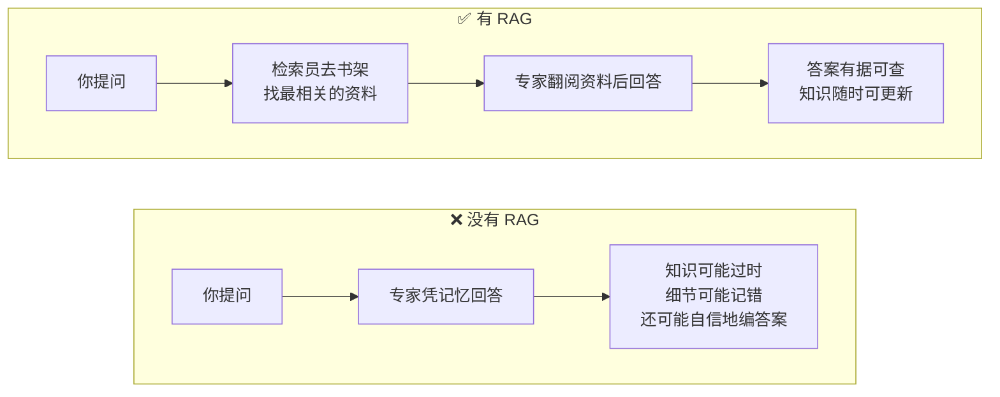
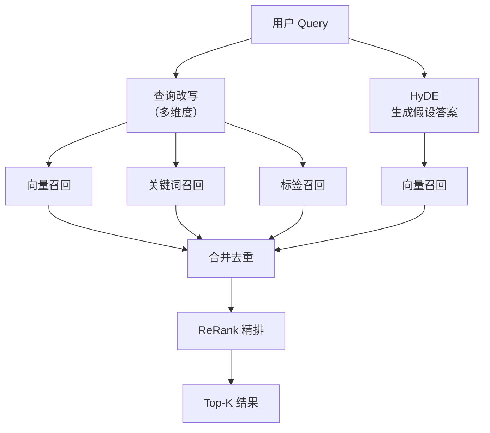
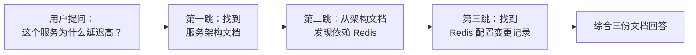

# RAG 与检索系统：从 chunk 设计到多路召回

RAG 是 Agent 系统的“外部知识接口”。面试官考 RAG 时不想听“向量数据库”四个字——他想知道的是**离线怎么切片、在线怎么召回、召回后怎么排序**，以及面对复杂查询时怎么做改写和意图识别。

---

## Q：RAG 的检索如何实现？

> 来源：阿里 AI Agent 开发一面

**新手答**：“用向量数据库做相似度搜索。”

**高手答**：

RAG 检索分**离线**和**在线**两部分。

离线侧负责文档清洗、切片、去重、embedding 计算和向量入库。在线侧的流程是：

1. 用 query 编码成向量，去向量库做召回
2. 结合 BM25 或关键词检索做**混合召回**
3. 用 rerank 模型重排
4. 把最相关的证据拼接给大模型生成答案

```python
# 简化版 RAG 检索流程
query_vec = embed(query)
candidates = vector_db.search(query_vec)
bm25_docs = bm25.search(query)
merged = merge_and_dedup(candidates, bm25_docs)
reranked = reranker.rank(query, merged)
context = "\n".join(doc.text for doc in reranked[:top_k])
answer = llm.generate(query, context)
```

切片策略直接影响效果：块太大召回不准，块太小上下文断裂。通常用**滑窗切割 + overlap**，对长文档还会给每个 chunk 带上标题、章节路径、来源元信息，提升召回相关性。

**差距在哪**：新手只说了“向量数据库”——这是一个组件，不是方案。高手的回答覆盖了离线和在线两条链路，且点出了 chunk 设计这个影响效果的关键因素。面试官考的是你对 RAG 工程的完整认知。

---

## Q：多维度的查询改写是什么？改写遇到需要用户补充信息时怎么设计？

> 来源：抖音基础架构 Agent 一面

**新手答**：“用大模型把用户的查询扩展一下。”

**高手答**：

多维度查询改写是指**同时从多个角度对原始 query 做变换**，提升召回的全面性：

```text
原始 query："北京周末带娃去哪玩"

维度1-意图展开：亲子活动 / 儿童乐园 / 博物馆 / 户外游
维度2-实体补全：北京市 → 朝阳区/海淀区/...
维度3-同义改写："带娃" → "亲子" / "儿童" / "适合小朋友"
维度4-约束提取：时间=周末，地点=北京，人群=有孩子的家庭
```

**需要用户补充信息时**，用**槽位填充 + 主动澄清**机制：
1. 意图识别后，检查必要槽位是否完整（比如“订酒店”需要日期、城市、人数）
2. 缺失槽位时，不是笼统地问“你能说得更清楚吗”，而是生成**具体的选择题**：“你想去哪个城市？”或“入住日期是什么时候？”
3. 多个槽位都缺时，按优先级排序，先问最关键的

技术实现上，查询改写用**模型生成 + 规则约束混合**：模型负责语义理解和改写，规则负责实体标准化和格式校验。槽位检测用一个轻量分类器判断缺失情况，避免每次都调大模型。

**差距在哪**：新手的“扩展一下”是单维度思考。高手的多维度改写覆盖了意图、实体、同义、约束四个角度，且有用户交互的槽位填充机制。面试官考的是你对查询理解链路的完整认知。

---

## Q：并行化意图识别是什么？为什么要并行化？如何实现的？

> 来源：抖音基础架构 Agent 一面

**新手答**：“用多线程跑意图分类。”

**高手答**：

并行化意图识别是指**同时执行多个意图维度的判断，而不是串行地先判大类再判小类**。

串行方案的问题是链路长、延迟高。比如先判“是不是搜索意图” → 再判“搜索什么品类” → 再判“有没有比较意图”，三级串行加起来可能 300ms+。而且前一级判断错了，后面全错——错误级联放大。

并行化把多个维度**同时发出去**：

```text
              ┌→ 意图大类分类器（搜索/导航/交易）
user query ──┼→ 品类识别器（美食/旅游/购物/...）
              ├→ 行为意图检测器（比较/推荐/查询/...）
              └→ 情感倾向检测器（正面/负面/中性）
```

每个分类器独立运行，结果汇总后做**融合决策**。实现关键点：
1. 各分类器用**异步并发**执行（`asyncio.gather` 或线程池），总延迟 = 最慢的那个
2. 每个分类器可以用不同规模的模型——简单维度用小模型，复杂维度用大模型
3. 设置**超时兜底**：某个分类器超时不影响其他维度，用默认值填充

**差距在哪**：新手的“多线程”只答了实现手段，没答为什么要并行化。高手先解释了串行方案的问题（延迟高 + 错误级联），再给出并行化的架构和融合策略。面试官考的是性能优化思维。

---

## Q：讲一下项目里召回的流程

> 来源：抖音基础架构 Agent 一面

**新手答**：“用向量搜索召回相关文档。”

**高手答**：

召回是一个**多路召回 → 合并去重 → 精排**的三阶段流程：

**第一阶段：多路召回**

```text
              ┌→ 向量召回（语义相似度，覆盖同义表达）
改写后 query ──┼→ 关键词召回（BM25，覆盖精确匹配）
              ├→ 标签召回（实体/品类标签匹配）
              └→ 图召回（知识图谱关联路径）
```

每路召回各取 top-K，各有优势：向量召回抓语义，关键词召回抓精确词，标签召回抓结构化属性，图召回抓实体关系。

**第二阶段：合并去重**

多路结果合并，同一文档被多路召回的加分。去重用文档 ID 做精确去重 + 内容指纹做近重复去重。

**第三阶段：精排**

用 Cross-Encoder 或精排模型对候选集做细粒度相关性打分。精排模型能看到 query 和文档的交互特征，精度远高于召回阶段的双塔模型。关键工程细节：每路召回的 K 值怎么定——K 太小漏结果，K 太大精排压力大，通常根据各路历史准确率动态调整。

**差距在哪**：新手只知道向量检索一路。高手的多路召回 + 精排是搜索系统的标准范式，面试官考的是你对召回-精排两阶段架构的完整理解。

---

## Q：如果 RAG 召回了很多相互矛盾的文档，Agent 应该怎么处理，而不是直接让模型自己总结？

> 来源：腾讯大模型应用开发二面

**新手答**：“让模型自己综合判断。”

**高手答**：

不能直接把矛盾文档一股脑丢给模型让它自己“综合”，那样很容易生成一个看起来圆滑但实际上没有依据的答案。

更合理的做法是**先做证据归一化和冲突检测**：

1. **分组**：按来源、时间、可信度对召回文档分组
2. **冲突检测**：抽取同一字段的不同取值，判断冲突类型——是时间差异导致的，还是来源本身互相打架
3. **冲突消解**：
   - 时间敏感信息 → 新版本优先
   - 来源权威性不同 → 官方文档优先
   - 无法判断 → 明确告诉用户存在冲突，说明目前最可信的依据

Agent 在这里更像**证据调解器**，而不是万能总结器。核心是在模型生成前就把冲突处理好，而不是让模型在矛盾信息中自己编一个“看起来合理”的答案。

**差距在哪**：新手直接把矛盾丢给模型——这会生成看似合理但无依据的答案。高手在模型生成前加了冲突检测和消解层，按时间、权威性、可判断性三个维度做处理。面试官考的是你有没有意识到 RAG 不只是“召回 + 生成”，中间还需要证据治理。

---

## Q：Embedding 和 ReRank 模型具体怎么做的微调？

> 来源：腾讯 AI 应用开发

**新手答**：“用自己的数据训练一下。”

**高手答**：

**Embedding 模型微调**：

目标是让模型在业务领域里，把语义相近的 query 和文档映射到向量空间中的相近位置。

训练数据格式：`(query, positive_doc, negative_doc)` 三元组。hard negative 越难越好——随机采样的 negative 太简单，模型学不到有区分度的表示。用 BM25 或当前模型 top-K 中的非相关文档做 hard negative。

常用 loss：
- **MultipleNegativesRankingLoss**（sentence-transformers 最常用）：batch 内其他 query 的 positive 自动作为 negative，不需显式构造
- **InfoNCE / Contrastive Loss**：拉近 positive pair，推远 negative pair
- **Triplet Loss**：`max(0, d(q, pos) - d(q, neg) + margin)`

框架：`sentence-transformers` 最成熟，支持 BGE、E5、GTE 等预训练模型的微调。

**ReRank 模型微调**：

ReRank 是 Cross-Encoder——输入是 `(query, doc)` 拼接后一起过模型，输出相关性分数。比 Embedding 双塔精度高，但计算量大，只用于精排。

训练数据：`(query, doc, label)`，label 是相关性分数或 0/1 标签。Loss 用 BCE 或 MSE。

**微调关键细节**：
1. **Hard Negative Mining**：negative 质量决定微调效果
2. **评估指标**：用 Recall@K、MRR、NDCG 在验证集上评估，不是看 loss 降了就行
3. **防止过拟合**：微调轮数不宜过多（1-3 epoch），否则通用检索能力退化

**差距在哪**：新手只说了“用数据训”。高手覆盖了完整链路——数据构造（三元组 + hard negative）、loss 选择、框架、评估、防过拟合。面试官考的是你有没有真正微调过检索模型。

---

## Q：双路召回的 TopK，K 是如何确定的？有没有试过一个多召回点、一个少召回点？

> 来源：腾讯 AI 应用开发

**新手答**：“K 就取 10 或 20。”

**高手答**：

K 值要**根据召回路的特性和下游精排的承载能力来定**。

```text
BM25 关键词召回：K = 10~20（精确匹配路，召回量不需要太大）
Embedding 向量召回：K = 20~50（语义路，覆盖面要大一些）
ReRank 精排后最终 TopK：K = 3~5（给模型的上下文不宜太多）
```

**K 值调优方法**：Grid Search 在评估集上搜索最优组合——固定一路 K，遍历另一路（5、10、20、30、50），合并去重后精排，用 Recall@K 和最终生成质量评判。

**一多一少的策略**：实际中确实会对不同路设不同 K：
- **向量路 K 大、BM25 路 K 小**：向量覆盖面广但精度稍低，多召回交给 ReRank 筛；BM25 精确率高，少量就够
- **反过来也有场景**：精确查询（订单号、型号）时 BM25 路 K 调大

关键权衡：K 越大覆盖率越高但噪声也多（ReRank 负担重、延迟增加）；K 越小精度高但可能漏掉相关文档。生产环境通常还有延迟约束（“总检索时间不超过 200ms”），K 值要在 Recall 和延迟之间找平衡。

**差距在哪**：新手随便定一个 K。高手有系统的调优方法论——Grid Search + 不同路不同 K + 延迟约束。面试官考的是你调 RAG 参数时有没有数据驱动的方法。

---

## Q：如何用通俗易懂的方式向非技术人员解释 RAG？有没有好的类比？

> 来源：携程 Agent 开发实习一面

**新手答**：“就是让模型先搜索再回答。”

**高手答**：

给非技术同事解释 RAG，我会这么说：

**一句话版本**：RAG 就是让 AI 在回答问题之前，先去翻资料，而不是纯靠记忆回答。

**图书馆类比**（最直观）：



**核心价值**（三点）：
1. **知识实时性**：模型训练数据有截止日期，但外部知识库可以随时更新——今天新上线的产品文档，明天就能被检索到
2. **可追溯性**：回答附带引用来源，用户可以点击查看原文，建立信任
3. **降低幻觉**：有资料做依据，模型不容易“编”答案

**主要应用场景**：企业知识库问答（内部文档/FAQ）、客服系统（产品手册检索）、法律/医疗等需要精确引用的领域、代码文档助手。

**差距在哪**：新手的解释太技术化，非技术人员听不懂。高手用图书馆类比把 RAG 的三个角色（用户 → 检索员 → 专家）讲清楚了，再用三点核心价值说明“为什么需要”。面试官考的不只是你懂不懂 RAG，还考你能不能把复杂概念讲给不同背景的人听——这是工程师的沟通能力。

---

## Q：如何快速上手一个没接触过的技术（如向量数据库）？

> 来源：携程 Agent 开发实习一面

**新手答**：“看官方文档，跑个 Demo。”

**高手答**：

快速上手一个新技术，我的方法论是**“倒金字塔学习法”——从应用场景倒推，不从底层原理开始**：

**第一步：搞清楚“它解决什么问题”（30 分钟）**

不是先看原理，而是先理解：传统方案的痛点是什么？向量数据库比传统数据库多解决了什么？答案是——传统数据库只能精确匹配，而向量数据库能做**语义相似度检索**。这一步决定了你后面学的所有东西有没有方向感。

**第二步：跑通一个最小可用的 Demo（2-3 小时）**

选一个主流方案（如 Milvus / Qdrant / Chroma），跑通“文本 → Embedding → 入库 → 查询 → 返回结果”的最短路径。不要一开始就研究分布式部署、索引类型选择这些细节。

```python
# 最小 Demo：Chroma
import chromadb
client = chromadb.Client()
collection = client.create_collection("demo")
collection.add(documents=["北京今天晴天", "上海明天下雨"], ids=["1", "2"])
results = collection.query(query_texts=["天气怎么样"], n_results=1)
```

**第三步：对标项目需求，补齐关键知识点（1-2 天）**

Demo 跑通后，对照项目需求列一个清单：需要什么索引类型（HNSW / IVF）？数据量级多大？需不需要过滤？需不需要持久化？然后**按需深入**，不铺开学。

**第四步：踩坑 → 查 Issue → 形成经验（持续）**

真正的理解来自踩坑。遇到问题先查 GitHub Issue 和社区讨论，很多坑别人已经踩过了。

**差距在哪**：新手的“看文档跑 Demo”没有方法论，容易在原理细节里迷失方向。高手的倒金字塔方法有明确的四步节奏——先理解价值、再跑通最短路径、再按需深入、最后靠实践沉淀。面试官考的是你的学习效率和自驱能力。

---

## Q：RAG 系统检索到的文档很多但回答质量差，怎么排查？

> 来源：携程 Agent 开发实习一面

**新手答**：“可能是模型不够好，换个更强的模型。”

**高手答**：

“检索多但回答差”说明问题大概率不在模型，而在**检索质量和上下文组装**。排查按链路从前到后逐段定位：

**1. 检索相关性差（召回了但不准）**：

- **症状**：返回的文档和用户问题表面相关但实际不对口
- **排查**：抽样看 top-K 文档和 query 的匹配度，计算 Recall@K / Precision@K
- **常见原因 + 解法**：
  - Embedding 模型领域适配差 → 用业务数据微调 Embedding
  - Chunk 切分不合理（太大导致噪声多，太小导致上下文断裂）→ 调整 chunk size 和 overlap
  - 缺少多路召回 → 加 BM25 关键词路补充精确匹配

**2. 排序失效（相关文档排在后面）**：

- **症状**：相关文档确实被召回了，但排在第 8、9 位，top-3 都是噪声
- **排查**：对比有无 ReRank 时的排序效果
- **解法**：加 Cross-Encoder ReRank 模型做精排；或微调 ReRank 模型

**3. 上下文组装问题（给模型的信息太杂）**：

- **症状**：top-K 文档质量还行，但模型回答仍然差
- **排查**：直接看拼给模型的 context，是不是信息太多、互相矛盾、或关键信息被淹没
- **解法**：减少 top-K（从 10 降到 3-5）；对召回文档做摘要提取再喂给模型；加冲突检测

**4. Prompt 模板问题**：

- **症状**：换了更好的检索结果，回答质量还是没提升
- **排查**：检查 Prompt 是否清晰指示模型“基于以下资料回答，如果资料不足请说明”
- **解法**：优化 Prompt 模板，加引用约束

**差距在哪**：新手第一反应是“换模型”——这是最贵且通常无效的做法。高手按 RAG 链路逐段排查（检索 → 排序 → 组装 → Prompt），每段都有具体的症状、排查方法和解法。面试官考的是你排查问题时的系统性思维。

---

## Q：什么是余弦相似度？在 RAG 系统中用来做什么？

> 来源：携程 Agent 开发实习一面

**新手答**：“衡量两个向量的相似程度。”

**高手答**：

余弦相似度衡量的是**两个向量方向的接近程度**，不关心长度，只关心角度：

```text
cos(A, B) = (A · B) / (|A| × |B|)

值域：[-1, 1]
  1  = 方向完全一致（语义最相似）
  0  = 正交（语义无关）
 -1  = 方向完全相反（语义相反）
```

**为什么用余弦而不是欧氏距离**：

Embedding 模型输出的向量，不同文本的向量长度（模）可能差异很大。如果用欧氏距离，一段长文本和一段短文本即使语义相同，距离也可能很远（因为向量模不同）。余弦相似度归一化了长度，只比较方向——语义相同的文本，无论长短，余弦相似度都接近 1。

**在 RAG 系统中的用途**：

1. **检索阶段**：用户 query 向量和文档库中所有文档向量计算余弦相似度，取 top-K 作为候选
2. **去重阶段**：两个 chunk 的余弦相似度 > 0.95，判定为近重复，去掉一个
3. **阈值过滤**：相似度低于阈值（如 0.6）的文档直接丢弃，不进入精排——避免把完全不相关的文档喂给模型

**补充**：实际向量数据库（Milvus / Qdrant）在 ANN 检索时用的是**近似最近邻算法**（HNSW / IVF），不是暴力遍历所有向量。精确的余弦计算只在小规模候选集上做。

**差距在哪**：新手只背了定义。高手从公式、为什么选余弦而非欧氏、在 RAG 中的三个具体用途（检索/去重/过滤）做了完整解释，且补充了工程实现细节。面试官考的是你理解了这个指标的设计动机，而不只是会算。

---

## Q：什么是嵌入（Embedding）？为什么 RAG 系统需要将文本转为向量？

> 来源：携程 Agent 开发实习一面

**新手答**：“把文本变成数字，方便计算。”

**高手答**：

嵌入（Embedding）是把文本映射到一个**高维向量空间**中的过程——每段文本变成一个固定长度的数字数组（如 768 维或 1536 维），这个数组就叫这段文本的“向量表示”。

**关键特性**：语义相近的文本，在向量空间中的位置也相近。

```text
"北京今天天气很好"  →  [0.12, -0.45, 0.78, ...]  ─┐
"今日北京晴朗"      →  [0.11, -0.43, 0.76, ...]  ─┘ 向量接近

"明天股市走势如何"  →  [-0.67, 0.23, -0.11, ...] ← 向量远离
```

**为什么 RAG 需要向量化**：

传统检索靠**关键词匹配**——用户搜“怎么退货”，系统只能找到包含“退货”两个字的文档。但用户可能问的是“买错了怎么办”“商品不满意能换吗”——意思一样，但没有一个共同关键词。

向量化解决的是**语义匹配**问题——“怎么退货”和“商品不满意能换吗”的 Embedding 向量很接近，即使没有共同关键词也能检索到。

**Embedding 模型的选型考量**：
- **通用模型**：OpenAI text-embedding-3、BGE、E5、GTE——开箱即用，适合大部分场景
- **领域微调**：如果业务术语多（医疗、法律、金融），通用模型可能把业务术语和日常用语混淆，需要用业务数据做微调
- **维度和性能的权衡**：维度越高表达力越强，但存储和计算成本也越高。768 维是常见平衡点

**差距在哪**：新手的“变成数字”没有解释为什么要这么做。高手从语义匹配的角度解释了向量化的动机——解决关键词匹配的语义鸿沟问题，且覆盖了模型选型的实际考量。面试官考的是你理不理解 Embedding 在 RAG 管线中的核心作用。

---

## Q：RAG 中如何提高文档召回率？

> 来源：蚂蚁集团智能体与大模型应用一面

**新手答**：“换更好的 Embedding 模型。”

**高手答**：

召回率低意味着**正确文档没有进入候选集**——模型连看到正确答案的机会都没有。提升召回率要从离线和在线两端同时入手：

**离线端——提升文档的“可被检索性”**：

1. **Chunk 策略优化**：
   - 块太大 → 一个 chunk 混了多个主题，语义被平均化，精准匹配变弱
   - 块太小 → 上下文断裂，语义不完整
   - 最佳实践：语义分块（按段落/标题/逻辑边界切割）+ overlap（相邻 chunk 重叠 10-20%）
2. **文档增强**：给每个 chunk 附加元信息——标题、所属章节、关键词标签、生成摘要。检索时不只匹配 chunk 正文，还匹配元信息
3. **Embedding 模型适配**：通用模型在专业领域（医疗/法律/代码）的表现可能大幅下降。用业务数据微调 Embedding 模型，Recall 通常能提升 10-20%

**在线端——提升查询的“被理解度”**：

4. **查询改写**：用大模型对用户 query 做多维度改写（同义替换、意图展开、实体补全），从不同角度匹配文档
5. **混合召回**：不只用向量检索，同时用 BM25 关键词检索 + 标签检索，多路结果合并。向量路抓语义，关键词路抓精确匹配，互补覆盖
6. **HyDE（Hypothetical Document Embeddings）**：让模型先生成一个“假设性答案”，用这个答案的 embedding 去检索——因为答案和文档的语义更接近，比直接用 query 检索效果好



**效果最大的三板斧**：根据实践经验，混合召回 > chunk 优化 > Embedding 微调。很多团队一上来就微调模型，其实先加一路 BM25 召回就能显著提升 Recall。

**差距在哪**：新手只想到换模型。高手从离线端（chunk/文档增强/Embedding 微调）和在线端（查询改写/混合召回/HyDE）六个方向给出了完整方案，且点出了优先级排序。面试官考的不是你知不知道某个技术，而是你能不能系统性地优化一条 RAG 管线。

---

## Q：RAG 为什么需要向量检索？和传统关键词检索有什么本质区别？

> 来源：蚂蚁集团智能体与大模型应用一面

**新手答**：“向量检索更准。”

**高手答**：

不是“更准”——是**解决了不同的问题**。传统检索和向量检索的核心差异在于匹配方式：

| 维度 | 传统关键词检索（BM25） | 向量检索（Embedding） |
|------|---------------------|---------------------|
| 匹配方式 | 词级精确匹配 | 语义级相似度匹配 |
| 核心算法 | TF-IDF / BM25 | ANN（近似最近邻） |
| 能处理同义词 | ❌ “退货”搜不到“退款” | ✅ 语义相近就能匹配 |
| 能处理精确术语 | ✅ 搜“order_id=123”直接命中 | ❌ 向量化后精确性丢失 |
| 计算成本 | 低（倒排索引，O(1)级） | 高（向量距离计算 + ANN 索引） |
| 索引存储 | 小（倒排表） | 大（每条文档一个高维向量） |
| 对新词/专业术语 | 好（只要文档里有就能匹配） | 差（模型没见过的词 embedding 质量低） |

**RAG 为什么需要向量检索**：

用户提问的方式和文档的表述方式**几乎不可能完全一样**。用户问“服务器老是挂”，文档里写的是“服务可用性异常”——没有一个共同关键词，但语义完全匹配。传统检索在这种场景下召回率为零，向量检索能轻松解决。

**但向量检索不能完全替代关键词检索**：

查具体的错误码（`ERR_CONNECTION_REFUSED`）、精确的文件路径、特定的 API 名称——这些场景关键词检索比向量检索更快更准。向量化反而会把精确信息“模糊化”。

**生产环境的最佳实践是混合检索**：

```text
向量检索（语义匹配）─┐
                     ├→ 合并去重 → ReRank 精排 → Top-K
关键词检索（精确匹配）─┘
```

两路互补：向量路保证语义覆盖，关键词路保证精确命中。合并后用 ReRank 统一排序。

**差距在哪**：新手用“更准”一词概括——其实向量检索在精确匹配上反而不如关键词检索。高手明确了两者的优劣势互补关系，且指出生产环境用混合检索。面试官考的是你对检索系统的工程认知——不是“哪个更好”，而是“什么场景用什么”。

---

## Q：如果用全量生产文档做关联性检索，用户每个问题要交互多少轮？有没有更高效的方案？

> 来源：蚂蚁集团智能体与大模型应用二面

**新手答**：“文档多了就慢一点，多检索几次。”

**高手答**：

全量文档场景的核心挑战是**文档量级和查询效率的矛盾**——几万甚至几十万份文档，用户一个问题不可能遍历所有文档找关联。

**传统 RAG 的局限**：

标准 RAG 是 query → embedding → top-K 召回。但当文档量大且内容跨领域时，单次召回很难覆盖所有相关信息。用户可能需要多轮追问才能拿到完整答案——每轮交互本质上是在“逐步缩小检索范围”。

**更高效的方案**：

**1. 文档预处理——建立关联索引**：

不等用户查询时才找关联，离线阶段就把文档间的关联性预计算好：

- **文档聚类**：按主题对文档自动分组，查询时先定位到相关组，缩小搜索范围
- **知识图谱**：从文档中抽取实体和关系，建立文档间的语义关联图。查询时沿着图谱做多跳检索，找到间接关联的文档
- **摘要索引**：每份文档生成摘要，先用摘要做粗筛，再用原文做精排——两级检索比全量检索快很多

**2. Multi-hop RAG——一次查询找到链式关联**：



Multi-hop RAG 让 Agent **自动做多轮检索**，每一跳基于上一跳的结果生成新的子查询，沿关联链逐步深入。用户只问一次，Agent 内部自动完成多轮检索。

**3. GraphRAG——结构化关联检索**：

微软提出的 GraphRAG 方案：先从全量文档构建知识图谱和社区摘要，查询时在图上检索而非在文档上检索。优势是能找到**文档间的隐式关联**——两份文档没有共同关键词，但通过实体关系链接在一起。

**差距在哪**：新手认为全量文档只能“多搜几次”。高手给出了三种更高效的方案——预计算关联索引、Multi-hop RAG 自动多跳检索、GraphRAG 结构化关联。面试官考的是你对 RAG 架构演进方向的认知——从单次检索到多跳检索到图检索，是检索系统面对大规模文档的自然演化路径。

---

## 这类题的答题模式

RAG 与检索题的核心是**完整链路 + 工程细节**：

```text
1. RAG 不是"向量搜索"——是离线切片 + 在线召回 + 精排的完整管线
2. 查询改写不是"扩展"——是多维度变换 + 槽位填充 + 主动澄清
3. 召回不是"一路搜索"——是多路召回 + 融合 + 精排
4. 性能优化用并行化——串行意图识别会引入延迟和错误级联
```

下一篇建议继续看：

- [训练、数据与模型优化：从数据清洗到 LoRA](../10-training-and-data/index.html)
