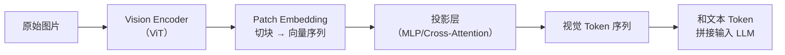

# 训练、数据与模型优化：从数据清洗到 LoRA

Agent 岗位面试不只考“会不会用 Agent”，还考**“Agent 背后的模型是怎么训出来的”**。数据怎么洗、训练集怎么构造、微调用什么方法、对齐算法怎么选——这些问题考的是你对 Agent 全链路的理解深度。

---

## Q：预训练数据清洗方法？

> 来源：阿里 AI Agent 开发一面

**新手答**：“去重，过滤脏数据。”

**高手答**：

预训练数据清洗要解决三类问题：

| 类型 | 典型表现 |
|------|---------|
| 脏数据 | 乱码、HTML 残留、脚本片段、异常符号、错误编码 |
| 重复数据 | 完全重复、近重复 |
| 低质量数据 | 广告、灌水、模板文、机器翻译残片、拼接错乱文本 |

处理流程分三步递进：

1. **规则清洗**：去标签、过滤控制字符、长度约束、语言检测
2. **质量过滤**：困惑度过滤、分类器识别垃圾文本、关键词规则
3. **去重**：MinHash、SimHash、LSH 做近重复检测

真正影响模型上限的，很多时候不是模型结构，而是预训练数据质量。

**差距在哪**：新手只说了两个词。高手按“规则→统计→算法”的层次把清洗逻辑讲清楚了。面试官考的是你有没有处理过大规模数据的经验。

---

## Q：Agent 工具调用怎么训练？训练集该包含什么？数据怎么来？

> 来源：阿里 AI Agent 开发一面

**新手答**：“找一些工具调用的例子做微调。”

**高手答**：

训练集至少要覆盖**三类样本**：

1. **该调用工具的**——正样本
2. **不该调用工具的**——只教“会调用”不够，还得教“什么时候不要调”
3. **多工具串并联调用的**——复杂场景下的编排能力

数据来源一般有**四种**：

| 来源 | 做法 | 特点 |
|------|------|------|
| 人工标注轨迹 | 问题 → 思考 → 工具选择 → 参数 → 结果，整合成监督样本 | 质量高，成本大 |
| 线上日志回放 | 从高质量人工操作或已有系统中抽取工具调用链 | 真实，但需清洗 |
| 规则合成数据 | 用模板生成标准调用样本 | 量大，但多样性差 |
| 模型自举 | 用强模型生成轨迹，再人工检验修正 | 扩量快，需质检 |

真正关键的是**负样本和边界样本**——参数缺失、工具返回空、多个工具都可用但优先级不一……这些不补，模型上线很容易乱调。

**差距在哪**：新手只想到了正样本。高手覆盖了正/负/复杂三类样本和四种数据来源。面试官考的是你理不理解模型是怎么学会使用工具的。

---

## Q：构造数据集遇到过什么难点，怎么解决？

> 来源：阿里 AI Agent 开发一面

**新手答**：“数据不够，就多标一些。”

**高手答**：

最大的问题不是数据不够，而是**数据不真实**。

人工构造的数据常常太标准——用户表达很整齐，参数给得很全，工具永远成功。结果上线之后用户一句话没说全，模型就不会了。

三个核心难点和解法：

**难点一：数据不真实**
→ 把真实线上 query 引进来，按意图、复杂度、缺参情况、歧义情况分桶，然后做针对性补齐

**难点二：标注不一致**
→ 同一种问题不同人可能给出不同工具路径，所以需要**先统一 schema 和决策标准**，再开始标注

**难点三：长尾样本太少**
→ 靠模板改写、对抗生成和人工补充边界案例，把最容易出事故的地方优先补上

**差距在哪**：新手以为问题是“量不够”。高手知道问题是“质不真”。面试官想听的是你真实踩过的坑。

---

## Q：微调方法有哪些？LoRA 和全参数微调的区别？怎么选？

> 来源：阿里 AI Agent 开发一面 / 字节 Agent 实习一面

**新手答**：“LoRA 省显存，全参数效果好。”

**高手答**：

主流微调方法按参数更新范围分三类：

| 方法 | 原理 | 参数量 | 显存 | 适用场景 |
|------|------|--------|------|---------|
| 全参数微调 | 直接更新所有参数 | 100% | 大，需要多卡 | 需要深度改变模型行为 |
| LoRA | 在原始权重旁插入低秩矩阵，只训练新增参数 | 0.1%–1% | 小 | 领域适配、指令跟随、工具调用格式对齐 |
| QLoRA | LoRA + 4-bit 量化基座模型 | 同 LoRA | 更小（单卡 24GB 可微调 65B） | 资源受限时的首选 |
| Prefix Tuning | 在每层 Attention 前插入可训练的虚拟 token | <0.1% | 极小 | 轻量级任务适配、多租户场景 |
| Adapter | 在 FFN 层后插入小型瓶颈网络 | 1%–5% | 较小 | 多任务共享基座 |

**LoRA vs 全参数微调的核心对比**：

| 维度 | LoRA | 全参数微调 |
|------|------|-----------|
| 原理 | 在原始权重旁插入低秩矩阵，只训练新增参数 | 直接更新所有参数 |
| 参数量 | 通常只有原模型的 0.1%–1% | 100% |
| 显存 | 小，适合消费级 GPU | 大，需要多卡 |
| 训练速度 | 快 | 慢 |
| 任务切换 | 方便，换 adapter 即可 | 每个任务一个完整模型 |
| 适用场景 | 领域适配、指令跟随、工具调用格式对齐 | 需要深度改变模型行为的场景 |

LoRA 的核心优势不只是“省显存”，而是**方便任务切换和多租户部署**——同一个基座模型挂不同 adapter，就能服务不同场景。

**怎么选**：
- 数据量大（万级以上）+ 要深度改变模型行为 → 全参数微调
- 数据量中等 + 领域适配 / 格式对齐 → LoRA（当前最主流）
- 资源极度受限（单卡消费级 GPU）→ QLoRA
- 需要多任务快速切换 → LoRA / Adapter（换 adapter 不换基座）
- 只做轻量提示适配 → Prefix Tuning

**差距在哪**：新手只知道两种方法且只说了一个维度。高手把主流微调方法按参数效率做了系统对比，并给出了场景化的选型建议。面试官考的是“你理不理解微调方法的设计动机，能不能根据资源和需求做选型”。

---

## Q：DPO、PPO、GRPO 的区别和优缺点？

> 来源：阿里 AI Agent 开发一面 / 腾讯 AI 应用开发 / 字节 Agent 实习二面

**新手答**：“都是对齐方法，PPO 用 RL，DPO 不用。”

**高手答**：

先说大背景：强化学习在大模型中的核心应用是**对齐（Alignment）**——让模型从“能生成”变成“生成得好”。经典路线是 RLHF（Reinforcement Learning from Human Feedback），即先用人类偏好数据训练一个 Reward Model，再用 RL 算法（如 PPO）优化策略模型。后来 DPO、GRPO 分别从不同角度简化了这条路线。

三者都是大模型对齐的训练方法，核心区别在于**奖励信号的来源、数据形态和工程复杂度**：

| 维度 | PPO | DPO | GRPO |
|------|-----|-----|------|
| 训练范式 | 在线强化学习 | 离线偏好优化 | 在线组相对优化 |
| 是否需要 Reward Model | 是（单独训练） | 否（隐式从偏好中学） | 否（组内相对奖励） |
| 是否需要 Critic | 是（Actor-Critic） | 否 | 否 |
| 数据需求 | 实时采样 | 离线偏好对数据 | 实时采样 |
| 训练复杂度 | 高（4 个模型） | 低（1 个模型） | 中（无 Critic） |

**PPO（Proximal Policy Optimization）**：
- 经典在线 RL 方法。训练时模型实时生成回答，Reward Model 打分，用打分信号更新策略
- 需要同时维护 Actor、Critic、Reward Model、Reference Model 四个模型，显存和计算开销大
- 用 clip 机制限制策略更新幅度，防止训练不稳定
- 优点：在线采样能持续探索，效果天花板高；缺点：训练复杂度高，调参困难

**DPO（Direct Preference Optimization）**：
- 核心洞察：把 Reward Model 的训练和策略优化合并成一步，直接从人类偏好对（chosen vs rejected）中学习
- 数学上证明了 DPO 的最优解和 RLHF（PPO）的最优解等价，但绕过了显式的奖励建模
- 优点：训练简单，只需要一个模型，像做 SFT 一样简单；缺点：离线方法，依赖静态偏好数据，无法在线探索

**GRPO（Group Relative Policy Optimization）**：
- DeepSeek 提出。每个 prompt 采样一组回答（比如 8 个），用组内相对排名作为奖励信号——不需要外部 Reward Model，也不需要 Critic
- 比 PPO 轻量（去掉了 Critic），比 DPO 灵活（在线采样）
- 特别适合数学、代码等有明确对错判断的场景——组内相对奖励天然支持“有标准答案”的任务

```text
PPO:  query → model → output → reward model → policy update（4 个模型）
DPO:  query → chosen/rejected pair → 直接优化（1 个模型）
GRPO: query → N 个候选 → 组内相对排序 → 优化（无 Critic）
```

**差距在哪**：新手只记了“用不用 RL”这一个区别。高手从训练范式、数据形态、工程复杂度三个角度做了完整对比，且说清了每种方法的设计动机和适用场景。面试官想看的是你理解了本质差异，而不只是记了名字。

---

## Q：给定时间序列，如何用 ML 筛选特征，再基于规则建模？

> 来源：阿里 AI Agent 开发一面

**新手答**：“提取特征，训练模型，看 feature importance。”

**高手答**：

先把原始序列变成可学习的特征：

```text
统计特征：均值、方差、最大最小值
趋势特征：移动平均、环比
波动特征：标准差、变异系数
周期特征：傅里叶分量、周期自相关
滞后特征：lag 值、rolling lag
```

然后用 XGBoost / LightGBM / 随机森林训练，输出的关键因子整理成多条规则做线上解释。

好处是**既保留了 ML 筛特征的能力，也兼顾了规则系统的稳定和可解释**——线上跑的是规则，但因子是 ML 选出来的。

**差距在哪**：新手只说了思路没说具体特征。高手列出了五类特征且说清了 ML 和规则如何衔接。面试官考的是你能不能把 ML 和规则系统结合起来满足可解释性要求。

---

## Q：kernel 级别的优化，比如用 CUTE DSL 或手写 CUDA 做 fusion？

> 来源：阿里 AI Agent 开发一面

**新手答**：“就是把多个算子合成一个，减少开销。”

**高手答**：

kernel 级别优化的核心目标是**减少访存开销、减少 kernel launch 次数、提高并行利用率**。很多模型推理慢，不一定是算力不够，更多是 memory bound。

算子融合的思路：

1. **纵向融合**：把连续的 elementwise 操作（如 LayerNorm + Dropout + Add）合成一个 kernel，减少中间结果写回显存
2. **横向融合**：把多个独立但可以并行的小 kernel 合并，减少 launch overhead
3. **访存优化**：利用 shared memory、寄存器缓存，减少 global memory 访问

工具链选择：手写 CUDA 最灵活但成本高；Triton 降低门槛但灵活性有限；CUTE DSL 在特定场景下能兼顾性能和开发效率。选哪个取决于**场景对性能的极致要求程度和团队的工程能力**。

**差距在哪**：新手只说了“合成一个”。高手区分了纵向/横向/访存三个优化方向。面试官考的是底层技术深度。

---

## Q：位置编码的作用是什么？

> 来源：腾讯 AI 应用开发

**新手答**：“告诉模型 token 的位置。”

**高手答**：

Transformer 的 Self-Attention 本质上是**置换不变的（permutation invariant）**——把输入 token 打乱顺序，Attention 的计算结果完全一样。这意味着没有位置编码的 Transformer 无法区分“我喜欢你”和“你喜欢我”。

位置编码的作用是**把序列顺序信息注入到模型中**，让每个 token 不仅知道“我是什么”，还知道“我在哪”。

为什么 Attention 是置换不变的：Attention 计算 `softmax(QK^T/√d)V`，Q、K、V 都是 token embedding 的线性变换。点积只关心向量本身的值，不关心向量在序列中的位置。

注入方式有两种：
1. **加法注入**：把位置向量加到 token embedding 上（GPT、BERT 的做法）
2. **注意力偏置**：不改 embedding，在 Attention score 上加一个位置相关的偏置项（ALiBi 的做法）

**差距在哪**：新手只说了“告诉位置”四个字。高手从 Attention 的置换不变性出发，解释了为什么需要位置编码、怎么注入。面试官考的是你理不理解这个设计的动机。

---

## Q：绝对位置编码和相对位置编码的区别？应用场景有什么不同？

> 来源：腾讯 AI 应用开发

**新手答**：“绝对编码给每个位置一个固定向量，相对编码看距离。”

**高手答**：

| 维度 | 绝对位置编码 | 相对位置编码 |
|------|-----------|-----------|
| 编码内容 | 每个位置的绝对索引（第 1 个、第 2 个…） | 两个 token 之间的相对距离 |
| 长度泛化 | 差，超过训练长度性能急剧下降 | 好，天然支持外推到更长序列 |
| 代表方法 | Sinusoidal（原始 Transformer）、Learned（BERT/GPT） | RoPE（LLaMA）、ALiBi（BLOOM） |

**绝对位置编码**：
- **Sinusoidal**：用不同频率的正弦/余弦函数生成位置向量，不需要学习。理论上可推广到任意长度，但实际效果在超出训练长度后衰减明显
- **Learned**：每个位置训练一个可学习的 embedding（BERT 512、GPT-2 1024）。效果好但长度固定

**相对位置编码**：
- **RoPE（Rotary Position Embedding）**：通过旋转矩阵把位置信息编码到 Q、K 向量中，两个 token 做 Attention 时旋转角度的差值反映相对距离。LLaMA、Qwen、DeepSeek 系列都用 RoPE
- **ALiBi**：不修改 embedding，在 Attention score 上减去与距离成正比的惩罚项，天然支持长度外推

**场景选择**：短序列固定长度用绝对编码够用；LLM 长文本生成用 RoPE（当前主流）；极长序列且推理效率优先用 ALiBi。当前大模型几乎都用 RoPE，配合 NTK-aware scaling 或 YaRN 可进一步扩展上下文。

**差距在哪**：新手只说了区别没说应用。高手从原理到代表方法到场景选择做了完整对比。面试官考的是你能不能根据需求选择合适的位置编码方案。

---

## Q：常用解决过拟合的方法？

> 来源：腾讯 AI 应用开发

**新手答**：“Dropout 和正则化。”

**高手答**：

过拟合的本质是模型学到了训练集中的噪声模式。解决方法分三个层面：

**数据层面**：
1. **数据增强**：NLP 中用同义词替换、回译、随机删除；CV 中用翻转、裁剪、颜色抖动
2. **增加数据量**：最直接有效——数据量够大，模型没机会记住噪声

**训练层面**：
3. **Early Stopping**：监控验证集 loss，连续 N 个 epoch 不下降就停止。简单但有效，几乎是标配
4. **L1/L2 正则化**：loss 中加权重范数惩罚。L2（权重衰减）让权重趋小；L1 产生稀疏权重，起特征选择作用
5. **Dropout**：训练时随机丢弃一定比例神经元输出（0.1-0.5），迫使网络不依赖单一神经元。推理时关闭，权重乘以保留概率
6. **归一化**：BatchNorm / LayerNorm 本身有轻微正则化效果

**架构层面**：
7. **降低模型复杂度**：减少层数、隐藏维度、参数量
8. **交叉验证**：K-Fold 评估泛化能力，选择多个 fold 上表现稳定的超参数

实际工程中通常组合使用——Early Stopping + Dropout + 权重衰减是最常见的三件套。

**差距在哪**：新手只背了两个方法名。高手按数据/训练/架构三层分类，每种方法说清了原理。面试官考的是你对过拟合的理解是否系统。

---

## Q：LayerNorm 和 BatchNorm 的区别？应用场景？

> 来源：腾讯 AI 应用开发

**新手答**：“LayerNorm 用在 Transformer，BatchNorm 用在 CNN。”

**高手答**：

两者都是归一化技术，核心区别在于**归一化的维度不同**：

```text
输入张量形状：[batch_size, seq_len, hidden_dim]

BatchNorm：对同一个特征，在 batch 维度上归一化
LayerNorm：对同一个样本，在特征维度上归一化
```

**BatchNorm**：
- 训练时用 mini-batch 统计量，推理时用 running mean/variance
- 优点：加速收敛、允许更高学习率
- 局限：依赖 batch size（太小统计量不准）；对变长序列不友好（同一位置在不同样本中语义不同）

**LayerNorm**：
- 对每个样本独立归一化，不依赖 batch 内其他样本
- 训练和推理行为一致，batch size 为 1 也正常
- 几乎所有 Transformer 都用 LayerNorm

**为什么 Transformer 用 LayerNorm**：
1. NLP 输入是变长序列，不同样本同一位置语义完全不同——BatchNorm 在这个维度上求统计量没有意义
2. 推理时可能 batch size = 1，BatchNorm 的 running statistics 不可靠
3. LayerNorm 和序列长度、batch size 都无关

补充：RMSNorm（LLaMA 使用）去掉了均值中心化，只做方差归一化，计算更快。

**差距在哪**：新手死记了结论。高手从归一化维度的本质差异出发，推导出各自的适用场景。面试官考的是你能不能从原理推出应用。

---

## Q：手撕 Multi-Head Attention

> 来源：腾讯 AI 应用开发

**新手答**：写了个 `softmax(QK^T)V` 但没处理 mask 和多头。

**高手答**：

```python
import torch
import torch.nn as nn
import math
import torch.nn.functional as F


def scaled_dot_product_attention(query, key, value, mask=None):
    """
    query/key/value: [batch, n_heads, seq_len, head_dim]
    mask: [batch, 1, 1, seq_len] or [batch, 1, seq_len, seq_len]
    """
    d_k = query.size(-1)
    scores = torch.matmul(query, key.transpose(-2, -1)) / math.sqrt(d_k)
    if mask is not None:
        scores = scores.masked_fill(mask == 0, float('-inf'))
    attention_weights = F.softmax(scores, dim=-1)
    output = torch.matmul(attention_weights, value)
    return output, attention_weights


class MultiHeadAttention(nn.Module):
    def __init__(self, d_model, n_heads):
        super().__init__()
        assert d_model % n_heads == 0
        self.d_model = d_model
        self.n_heads = n_heads
        self.head_dim = d_model // n_heads
        self.W_q = nn.Linear(d_model, d_model)
        self.W_k = nn.Linear(d_model, d_model)
        self.W_v = nn.Linear(d_model, d_model)
        self.W_o = nn.Linear(d_model, d_model)

    def forward(self, query, key, value, mask=None):
        batch_size = query.size(0)
        # 线性投影
        Q = self.W_q(query)
        K = self.W_k(key)
        V = self.W_v(value)
        # 拆多头: [batch, seq, d_model] -> [batch, n_heads, seq, head_dim]
        Q = Q.view(batch_size, -1, self.n_heads, self.head_dim).transpose(1, 2)
        K = K.view(batch_size, -1, self.n_heads, self.head_dim).transpose(1, 2)
        V = V.view(batch_size, -1, self.n_heads, self.head_dim).transpose(1, 2)
        # Attention
        output, attn_weights = scaled_dot_product_attention(Q, K, V, mask)
        # 合并多头: [batch, n_heads, seq, head_dim] -> [batch, seq, d_model]
        output = output.transpose(1, 2).contiguous().view(batch_size, -1, self.d_model)
        return self.W_o(output), attn_weights
```

**面试官可能追问的细节**：

1. **为什么除以 √d_k**：d_k 越大，QK^T 点积的方差越大，softmax 输出越接近 one-hot，梯度消失。除以 √d_k 做缩放保持梯度健康
2. **多头的意义**：不同头在不同子空间学不同的 attention pattern（语法关系、语义关系、位置关系）
3. **mask 的两种用途**：padding mask（忽略填充位置）和 causal mask（自回归时防止看到未来 token）
4. **contiguous() 的作用**：transpose 后内存不连续，view 前需要 contiguous 保证内存布局正确

**差距在哪**：新手只写了核心公式。高手写出完整的多头实现（含 mask、拆头、合并、输出投影），且能解释每一步的设计动机。手撕 Attention 是 AI 岗基本功。

---

## Q：你了解哪些多模态大模型？各自的特点？

> 来源：腾讯 Agent 应用开发一面

**新手答**：“GPT-4V 可以看图。”

**高手答**：

多模态大模型按架构和能力分几类：

| 模型 | 架构特点 | 擅长场景 |
|------|---------|---------|
| GPT-4o | 原生多模态，文本/图像/音频统一处理 | 通用多模态理解和生成 |
| Claude 3.5 Sonnet | 视觉理解 + 长文本，图表和文档分析强 | 复杂文档理解、代码截图分析 |
| Qwen2.5-VL / Qwen3-VL | 开源，支持动态分辨率和视频理解 | 中文场景、本地部署 |
| LLaVA 系列 | 开源，visual encoder + LLM 两阶段训练 | 学术研究、定制微调 |
| InternVL | 开源，ViT + LLM，多分辨率策略 | 细粒度视觉理解 |
| Gemini | 原生多模态，长上下文（100 万 token） | 长视频理解、大规模文档处理 |

选型关键：不是“哪个最强”，而是**场景匹配**——
- 需要部署到本地 → Qwen-VL、InternVL（开源可控）
- 需要文档理解 → Claude（长文本 + 图表理解）
- 需要视频分析 → Gemini（长上下文）、Qwen-VL（视频理解）
- 需要微调 → LLaVA、Qwen-VL（开源 + 社区活跃）

**差距在哪**：新手只知道一两个。高手按架构和场景做了系统对比。面试官考的是你对多模态模型生态的广度认知。

---

## Q：有没有了解过端侧部署的模型？

> 来源：腾讯 Agent 应用开发一面

**新手答**：“手机上跑不了大模型吧。”

**高手答**：

端侧部署已经是可行的工程实践，关键是**模型够小 + 量化够狠 + 推理框架够优化**。

**端侧可部署的模型**：
- **Qwen2.5-0.5B/1.5B/3B**：阿里小参数模型，INT4 量化后可在手机/边缘设备运行
- **Phi-3-mini（3.8B）**：微软小模型，专为端侧优化，ONNX Runtime 支持
- **Gemma 2B**：Google 开源小模型，TensorFlow Lite 部署
- **LLaMA 3.2 1B/3B**：Meta 专为移动端发布的小模型

**端侧推理框架**：
- **llama.cpp**：C++ 实现，支持 GGUF 格式量化，跨平台（Mac/Linux/Android/iOS）
- **MLC-LLM**：基于 TVM 编译优化，支持 GPU 加速
- **MediaPipe LLM**：Google 出品，Android/iOS 原生支持
- **ONNX Runtime Mobile**：微软出品，支持多种硬件后端

**量化是端侧部署的关键**：3B 模型 FP16 约 6GB，INT4 量化后约 1.5GB——手机内存可以承受。精度损失通常在 1-3% 以内，对大部分应用场景可接受。

端侧部署的价值不只是“省钱”，更重要的是**隐私保护**（数据不出设备）和**离线可用**（无需网络）。

**差距在哪**：新手认为端侧不可行。高手列出了具体可部署的模型、推理框架和量化方案。面试官考的是你对模型部署的工程认知广度。

---

## Q：RLHF 中奖励模型（RM）的训练数据如何构建？

> 来源：字节 Agent 实习一面

**新手答**：“找人标注好坏就行。”

**高手答**：

RM 的训练数据核心是**偏好对（preference pairs）**——同一个 prompt，两条不同回答，人类标注哪条更好。

**数据构建流程**：

1. **采样候选回答**：对同一个 prompt，用 SFT 模型采样多条回答（通常 4-8 条），用不同的 temperature 和 top-p 增加多样性
2. **人工偏好标注**：标注员对每对回答标注偏好（A 优于 B / B 优于 A / 平局）。标注维度通常包括有用性（helpfulness）、无害性（harmlessness）、诚实性（honesty）
3. **质量控制**：
   - 多人标注同一对，用 Fleiss' Kappa 衡量一致性，低一致性的样本审核或丢弃
   - 设置金标准题（标注员已知的正确答案），筛除不合格标注员
   - 对争议样本做多轮仲裁
4. **数据增强**：用强模型（如 GPT-4）批量生成候选回答并做初步排序，再交人工校验，降低标注成本

**训练数据的关键设计**：

- **难度分层**：不能只有“好 vs 很差”的简单对比，需要大量“好 vs 稍好”的难样本，否则 RM 学不到细粒度区分
- **场景覆盖**：代码、数学、创意写作、事实性问答等不同场景需要分别覆盖
- **负样本多样性**：不只是“错的回答”，还要包含“部分正确但有瑕疵”、“正确但啰嗦”、“正确但不安全”等边界样本

**差距在哪**：新手以为标注就是“标好坏”。高手的回答覆盖了从采样、标注、质量控制到数据增强的完整流程，且强调了难样本和场景覆盖的重要性。面试官考的是你对 RLHF 数据管线的理解深度。

---

## Q：大模型推理加速技术有哪些？

> 来源：字节 Agent 实习一面

**新手答**：“用量化压缩模型。”

**高手答**：

推理加速从四个层面入手：

**1. 模型压缩**：

| 方法 | 原理 | 代表方案 | 精度损失 |
|------|------|---------|---------|
| 量化 | 降低权重/激活的数值精度 | GPTQ（训练后量化）、AWQ（激活感知量化）、GGUF（llama.cpp 格式） | INT4 约 1-3% |
| 剪枝 | 去除冗余连接或注意力头 | 结构化剪枝（去整层/头）、非结构化剪枝 | 视剪枝比例 |
| 蒸馏 | 用大模型教小模型 | DistilBERT、TinyLLaMA | 取决于师生模型差距 |

量化是当前性价比最高的方案——AWQ 在 INT4 下几乎不掉点，且推理速度提升 2-3 倍。

**2. 服务化框架**：

| 框架 | 核心技术 | 适用场景 |
|------|---------|---------|
| vLLM | PagedAttention（KV Cache 分页管理）+ 连续批处理 | 高并发在线服务 |
| TensorRT-LLM | 算子融合 + CUDA kernel 优化 | NVIDIA GPU 极致性能 |
| llama.cpp | CPU/Metal 推理 + GGUF 量化 | 端侧/低资源部署 |
| SGLang | RadixAttention + 前缀缓存 | 多轮对话/共享前缀场景 |

**3. 解码优化**：

- **推测解码（Speculative Decoding）**：用小模型快速生成候选 token，大模型只做验证。速度提升 2-3 倍，输出质量不变
- **连续批处理（Continuous Batching）**：不等一批请求全完成再处理下一批，有请求完成就立即填入新请求，GPU 利用率大幅提升

**4. KV Cache 优化**：

- **PagedAttention**：把 KV Cache 分页存储（类似操作系统虚拟内存），避免预分配大块连续显存
- **GQA/MQA**：Grouped Query Attention / Multi-Query Attention，用更少的 KV Head 减少缓存量
- **KV Cache 量化**：对缓存做 INT8 量化，显存占用减半

实际部署一般是**组合方案**：AWQ 量化 + vLLM 服务 + 推测解码，综合提速 5-10 倍。

**差距在哪**：新手只知道量化。高手从模型压缩、服务化框架、解码策略、KV Cache 四个层面做了系统梳理，且给出了组合方案。面试官考的是你对推理优化全栈的理解。

---

## Q：如何优化大模型在长文本生成中的显存占用？

> 来源：字节 Agent 实习一面

**新手答**：“用更大显存的 GPU。”

**高手答**：

长文本生成的显存瓶颈主要在 **KV Cache**——它随序列长度线性增长。一个 7B 模型生成 32K token 时，KV Cache 可能占到 16GB+。优化分四个方向：

**1. KV Cache 管理**：

- **PagedAttention**（vLLM）：把 KV Cache 分成固定大小的 page，按需分配，避免预留大块连续显存。显存浪费从 60-80% 降到 <4%
- **滑动窗口注意力**（Mistral）：只保留最近 N 个 token 的 KV Cache，超出窗口的丢弃。适合不需要完整长距离依赖的场景
- **KV Cache 量化**：对 KV 缓存做 FP8/INT8 量化，显存占用减半，精度损失微小

**2. 注意力机制优化**：

- **Flash Attention**：优化 attention 计算的内存访问模式，不把完整的 attention matrix 写入 HBM，而是用 tiling 技术在 SRAM 上分块计算。显存从 O(N²) 降到 O(N)
- **GQA（Grouped Query Attention）**：多个 query head 共享一组 KV head。LLaMA 3 用 8 组 GQA，KV Cache 直接缩减到 1/4

**3. 模型级优化**：

- **量化部署**：INT4/INT8 量化让模型参数本身占用缩小 2-4 倍
- **梯度检查点**（训练时）：不保留所有层的中间激活值，需要时重新计算。以时间换空间，显存降 60%+

**4. 系统级优化**：

- **Offloading**：把不活跃的 KV Cache 或模型层卸载到 CPU 内存/NVMe，需要时再加载回 GPU
- **Tensor Parallel**：把模型参数和 KV Cache 分布到多卡上，单卡显存压力线性下降

**差距在哪**：新手只想到换硬件。高手从 KV Cache 管理、注意力优化、模型压缩、系统调度四个层面给出了具体方案，且说清了每个方案的原理和效果。面试官考的是你对 Transformer 推理过程中显存消耗细节的理解。

---

## Q：Transformer 中梯度消失/爆炸是怎么解决的？

> 来源：字节 Agent 实习一面

**新手答**：“用 BatchNorm。”

**高手答**：

Transformer 架构本身就包含了多种防止梯度消失/爆炸的设计，这些不是“加上去的补丁”，而是**架构内建的稳定性保障**：

**1. 残差连接（Residual Connection）**：

- 每个子层（Attention、FFN）的输出都加上输入：`output = LayerNorm(x + SubLayer(x))`
- 梯度可以通过残差通道直接回传，不经过非线性变换，避免深层网络梯度消失
- 这是最关键的设计——没有残差连接，Transformer 深到 6 层就很难训练

**2. Layer Normalization**：

- 对每个样本的特征维度做归一化，稳定每层输入的分布
- **Pre-Norm**（GPT 系列）vs **Post-Norm**（原始 Transformer）：Pre-Norm 把 LayerNorm 放在子层之前，训练更稳定，但理论上限略低；Post-Norm 理论上限高但训练不稳定。当前大模型几乎都用 Pre-Norm
- RMSNorm（LLaMA）进一步简化，去掉均值中心化，只做方差归一化

**3. 缩放点积注意力**：

- `softmax(QK^T / √d_k)` 中的 `√d_k` 就是为了防止梯度消失——d_k 越大，点积值越大，softmax 输出越接近 one-hot，梯度趋近于零

**4. 权重初始化**：

- Xavier / He 初始化确保前向传播和反向传播时每层的方差稳定
- GPT 系列对残差分支做特殊缩放：`1/√(2N)`（N 是层数），防止深层模型的残差累积导致梯度爆炸

**5. 梯度裁剪（Gradient Clipping）**：

- 训练时设置梯度范数上限（通常 1.0），超过就按比例缩小。这是防止梯度爆炸的最后一道防线
- 大模型训练几乎必用，否则 loss spike 可能直接导致训练崩溃

**6. 学习率 Warmup**：

- 训练初期用很小的学习率逐步增大，避免随机初始化阶段梯度方向不稳定时做大步更新引发爆炸

**差距在哪**：新手只知道 BatchNorm（且 Transformer 不用 BatchNorm）。高手从残差连接、归一化、缩放注意力、初始化、梯度裁剪、Warmup 六个层面系统梳理了 Transformer 的梯度稳定机制，且说清了每个设计的动机。面试官考的是你对 Transformer 架构设计“为什么这么设计”的理解深度。

---

## Q：多模态是怎么实现的？图片怎么编码？消耗很大怎么缩减 token 使用？

> 来源：蚂蚁集团一面

**新手答**：“把图片转成向量，和文本一起输入模型。”

**高手答**：

多模态大模型的核心架构是**视觉编码器 + 投影层 + 语言模型**，关键在于“怎么把图片变成 LLM 能理解的 token 序列”。

**图片编码流程**：



1. **图片切块（Patch Embedding）**：把图片按固定大小（通常 14×14 或 16×16 像素）切成 patch，每个 patch 经过线性投影变成一个向量——一个 patch 就是一个“视觉 token”
2. **Vision Encoder 提取特征**：用预训练的 ViT（Vision Transformer）对 patch 序列做 self-attention，提取视觉语义特征
3. **投影对齐**：视觉特征的维度和 LLM 的 embedding 维度不同，需要投影层（MLP 或 Cross-Attention）做对齐，让 LLM 能“读懂”视觉 token
4. **拼接输入**：视觉 token 和文本 token 拼在一起，送入 LLM 做联合推理

**为什么图片消耗 token 多**：

一张 224×224 的图片，按 14×14 切块，产生 (224/14)² = 256 个视觉 token。如果是高分辨率图片（如 1344×1344），可能产生上千个视觉 token——这直接吃掉大量上下文窗口。

**缩减 token 的方案**：

| 方案 | 原理 | 效果 | 代表模型 |
|------|------|------|---------|
| **动态分辨率** | 根据图片内容自动选择分辨率，简单图片用低分辨率 | token 数随内容复杂度弹性调整 | Qwen2.5-VL |
| **视觉 Token 压缩** | 在投影层用 Perceiver/Q-Former 把数百个视觉 token 压缩成几十个 | 4-8 倍压缩 | BLIP-2、InternVL |
| **自适应 Pooling** | 对视觉特征做空间池化，合并相邻的相似 patch | 2-4 倍压缩，信息损失可控 | LLaVA-1.6 |
| **稀疏注意力** | 视觉 token 之间不做全连接 attention，只关注关键区域 | 计算量降低，token 数不变但推理更快 | — |
| **早期退出** | 简单图片不需要 ViT 跑完所有层，中间层特征就够用 | 编码阶段省算力 | — |

**工程实践中的组合策略**：

```text
输入预处理：判断图片复杂度 → 选择分辨率
编码阶段：ViT + Q-Former 压缩视觉 token 到 64-128 个
缓存优化：相同图片多轮对话中复用视觉 token，不重复编码
提示优化：如果用户只问图片的局部信息，裁剪 ROI 区域再编码
```

**差距在哪**：新手只有“转向量”三个字。高手从 patch embedding → ViT → 投影对齐完整说清了图片编码流程，且给出了五种 token 缩减方案和工程组合策略。面试官考的是你对多模态模型实现细节的理解深度——不是“知道能处理图片”，而是“知道图片怎么变成模型输入、成本怎么控制”。

---

## 这类题的答题模式

训练与数据题的核心是**全链路思维**：

```text
1. 数据质量 > 数据数量——"不真实"比"不够"更致命
2. 训练集不只要正样本——负样本和边界样本决定线上表现
3. 微调方法按场景选——不是"哪个好"，而是"什么场景用哪个"
4. 对齐方法看数据形态——PPO/DPO/GRPO 的核心差异在数据需求
```

下一篇建议继续看：

- [AI 代码分析与测试：覆盖率、插桩、代码过滤](../11-ai-code-testing/index.html)
