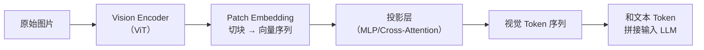
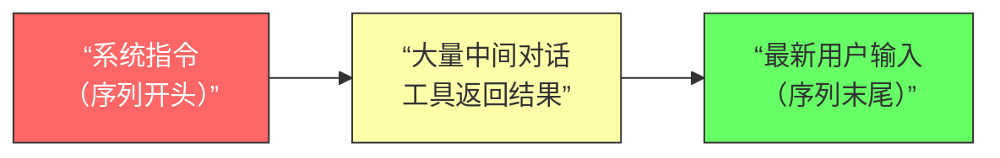
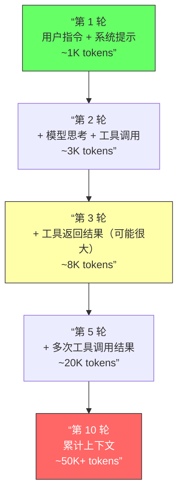
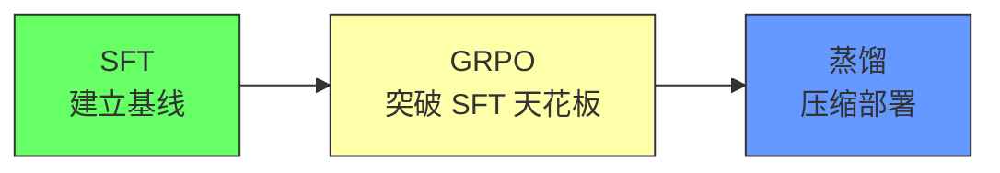
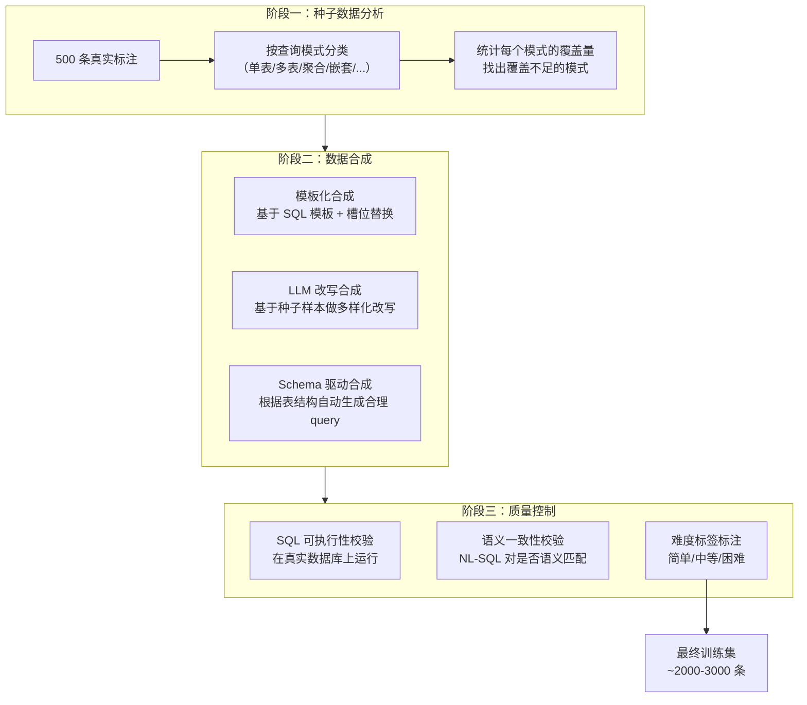
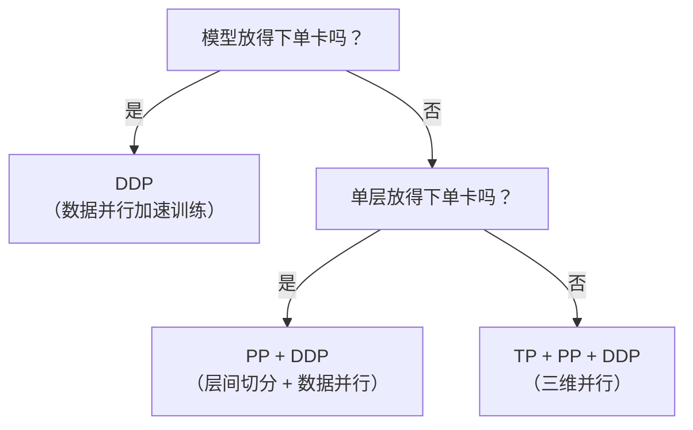

# 训练、数据与模型优化：从数据清洗到 LoRA

Agent 岗位面试不只考“会不会用 Agent”，还考**“Agent 背后的模型是怎么训出来的”**。数据怎么洗、训练集怎么构造、微调用什么方法、对齐算法怎么选——这些问题考的是你对 Agent 全链路的理解深度。

---

## Q：预训练数据清洗方法？

> 来源：阿里 AI Agent 开发一面

**新手答**：“去重，过滤脏数据。”

**高手答**：

预训练数据清洗要解决三类问题：

| 类型 | 典型表现 |
|------|---------|
| 脏数据 | 乱码、HTML 残留、脚本片段、异常符号、错误编码 |
| 重复数据 | 完全重复、近重复 |
| 低质量数据 | 广告、灌水、模板文、机器翻译残片、拼接错乱文本 |

处理流程分三步递进：

1. **规则清洗**：去标签、过滤控制字符、长度约束、语言检测
2. **质量过滤**：困惑度过滤、分类器识别垃圾文本、关键词规则
3. **去重**：MinHash、SimHash、LSH 做近重复检测

真正影响模型上限的，很多时候不是模型结构，而是预训练数据质量。

**差距在哪**：新手只说了两个词。高手按“规则→统计→算法”的层次把清洗逻辑讲清楚了。面试官考的是你有没有处理过大规模数据的经验。

---

## Q：Agent 工具调用怎么训练？训练集该包含什么？数据怎么来？

> 来源：阿里 AI Agent 开发一面

**新手答**：“找一些工具调用的例子做微调。”

**高手答**：

训练集至少要覆盖**三类样本**：

1. **该调用工具的**——正样本
2. **不该调用工具的**——只教“会调用”不够，还得教“什么时候不要调”
3. **多工具串并联调用的**——复杂场景下的编排能力

数据来源一般有**四种**：

| 来源 | 做法 | 特点 |
|------|------|------|
| 人工标注轨迹 | 问题 → 思考 → 工具选择 → 参数 → 结果，整合成监督样本 | 质量高，成本大 |
| 线上日志回放 | 从高质量人工操作或已有系统中抽取工具调用链 | 真实，但需清洗 |
| 规则合成数据 | 用模板生成标准调用样本 | 量大，但多样性差 |
| 模型自举 | 用强模型生成轨迹，再人工检验修正 | 扩量快，需质检 |

真正关键的是**负样本和边界样本**——参数缺失、工具返回空、多个工具都可用但优先级不一……这些不补，模型上线很容易乱调。

**差距在哪**：新手只想到了正样本。高手覆盖了正/负/复杂三类样本和四种数据来源。面试官考的是你理不理解模型是怎么学会使用工具的。

---

## Q：构造数据集遇到过什么难点，怎么解决？

> 来源：阿里 AI Agent 开发一面

**新手答**：“数据不够，就多标一些。”

**高手答**：

最大的问题不是数据不够，而是**数据不真实**。

人工构造的数据常常太标准——用户表达很整齐，参数给得很全，工具永远成功。结果上线之后用户一句话没说全，模型就不会了。

三个核心难点和解法：

**难点一：数据不真实**
→ 把真实线上 query 引进来，按意图、复杂度、缺参情况、歧义情况分桶，然后做针对性补齐

**难点二：标注不一致**
→ 同一种问题不同人可能给出不同工具路径，所以需要**先统一 schema 和决策标准**，再开始标注

**难点三：长尾样本太少**
→ 靠模板改写、对抗生成和人工补充边界案例，把最容易出事故的地方优先补上

**差距在哪**：新手以为问题是“量不够”。高手知道问题是“质不真”。面试官想听的是你真实踩过的坑。

---

## Q：微调方法有哪些？LoRA 和全参数微调的区别？怎么选？

> 来源：阿里 AI Agent 开发一面 / 字节 Agent 实习一面

**新手答**：“LoRA 省显存，全参数效果好。”

**高手答**：

主流微调方法按参数更新范围分三类：

| 方法 | 原理 | 参数量 | 显存 | 适用场景 |
|------|------|--------|------|---------|
| 全参数微调 | 直接更新所有参数 | 100% | 大，需要多卡 | 需要深度改变模型行为 |
| LoRA | 在原始权重旁插入低秩矩阵，只训练新增参数 | 0.1%–1% | 小 | 领域适配、指令跟随、工具调用格式对齐 |
| QLoRA | LoRA + 4-bit 量化基座模型 | 同 LoRA | 更小（单卡 24GB 可微调 65B） | 资源受限时的首选 |
| Prefix Tuning | 在每层 Attention 前插入可训练的虚拟 token | <0.1% | 极小 | 轻量级任务适配、多租户场景 |
| Adapter | 在 FFN 层后插入小型瓶颈网络 | 1%–5% | 较小 | 多任务共享基座 |

**LoRA vs 全参数微调的核心对比**：

| 维度 | LoRA | 全参数微调 |
|------|------|-----------|
| 原理 | 在原始权重旁插入低秩矩阵，只训练新增参数 | 直接更新所有参数 |
| 参数量 | 通常只有原模型的 0.1%–1% | 100% |
| 显存 | 小，适合消费级 GPU | 大，需要多卡 |
| 训练速度 | 快 | 慢 |
| 任务切换 | 方便，换 adapter 即可 | 每个任务一个完整模型 |
| 适用场景 | 领域适配、指令跟随、工具调用格式对齐 | 需要深度改变模型行为的场景 |

LoRA 的核心优势不只是“省显存”，而是**方便任务切换和多租户部署**——同一个基座模型挂不同 adapter，就能服务不同场景。

**怎么选**：
- 数据量大（万级以上）+ 要深度改变模型行为 → 全参数微调
- 数据量中等 + 领域适配 / 格式对齐 → LoRA（当前最主流）
- 资源极度受限（单卡消费级 GPU）→ QLoRA
- 需要多任务快速切换 → LoRA / Adapter（换 adapter 不换基座）
- 只做轻量提示适配 → Prefix Tuning

**面试官追问：”你自己做过微调吗？”**

这类追问不是问”会不会写训练脚本”，而是考察你对微调全流程的工程认知。回答结构：**数据 → 方法选型 → 训练细节 → 评估**。即使没亲手做过大规模微调，也应该说清楚：用什么数据（多少条、什么格式、怎么清洗）、为什么选这个方法（LoRA vs 全参数）、训练时关注什么指标（loss 曲线、过拟合检测）、怎么评估效果（离线评测 + 在线 A/B）。

**差距在哪**：新手只知道两种方法且只说了一个维度。高手把主流微调方法按参数效率做了系统对比，并给出了场景化的选型建议。面试官考的是”你理不理解微调方法的设计动机，能不能根据资源和需求做选型”。

**追问：LoRA 的 A、B 两个矩阵分别怎么初始化？逻辑推理任务的秩该偏大还是偏小？训推一体时权重 Merge 怎么做？**

> 来源：阿里淘天 AI应用开发一面（三连追问）

这三个问题串起来考的是 LoRA 从训练到部署的完整认知：

**矩阵初始化**：
- **A 矩阵**（降维矩阵）：随机高斯初始化（均值 0，方差小）
- **B 矩阵**（升维矩阵）：**零初始化**
- 为什么 B 用零初始化？因为 ΔW = BA，B=0 意味着训练开始时 ΔW=0，模型从原始预训练权重出发——保证微调初期不破坏已有能力

**秩（rank）选择**：

| 任务类型 | 推荐秩 | 原因 |
|---------|--------|------|
| 简单对话/格式调整 | r = 4~8 | 输出模式变化小，低秩足以捕获 |
| 领域知识注入 | r = 16~32 | 需要学习新知识，更新量更大 |
| 逻辑推理/数学 | r = 32~64（偏大） | 推理能力依赖多层复杂交互，低秩会欠拟合 |

逻辑推理任务秩偏大的核心原因：推理链的正确性依赖于注意力头之间精细的协作模式，这种模式的参数空间维度高，低秩近似会丢失关键信息。

**权重 Merge**：
部署时把 LoRA 分支合并回主权重：W_merged = W_original + α × B × A。合并后推理路径和原始模型完全相同——**零额外延迟**，因为不再有旁路分支。α 是 LoRA 的 scaling factor（通常 α/r）。合并是不可逆的——如果需要切换多个 LoRA 适配器，保留未合并版本。

---

## Q：DPO、PPO、GRPO 的区别和优缺点？

> 来源：阿里 AI Agent 开发一面 / 腾讯 AI 应用开发 / 字节 Agent 实习二面

**新手答**：“都是对齐方法，PPO 用 RL，DPO 不用。”

**高手答**：

先说大背景：强化学习在大模型中的核心应用是**对齐（Alignment）**——让模型从“能生成”变成“生成得好”。经典路线是 RLHF（Reinforcement Learning from Human Feedback），即先用人类偏好数据训练一个 Reward Model，再用 RL 算法（如 PPO）优化策略模型。后来 DPO、GRPO 分别从不同角度简化了这条路线。

三者都是大模型对齐的训练方法，核心区别在于**奖励信号的来源、数据形态和工程复杂度**：

| 维度 | PPO | DPO | GRPO |
|------|-----|-----|------|
| 训练范式 | 在线强化学习 | 离线偏好优化 | 在线组相对优化 |
| 是否需要 Reward Model | 是（单独训练） | 否（隐式从偏好中学） | 否（组内相对奖励） |
| 是否需要 Critic | 是（Actor-Critic） | 否 | 否 |
| 数据需求 | 实时采样 | 离线偏好对数据 | 实时采样 |
| 训练复杂度 | 高（4 个模型） | 低（1 个模型） | 中（无 Critic） |

**PPO（Proximal Policy Optimization）**：
- 经典在线 RL 方法。训练时模型实时生成回答，Reward Model 打分，用打分信号更新策略
- 需要同时维护 Actor、Critic、Reward Model、Reference Model 四个模型，显存和计算开销大
- 用 clip 机制限制策略更新幅度，防止训练不稳定
- 优点：在线采样能持续探索，效果天花板高；缺点：训练复杂度高，调参困难

**DPO（Direct Preference Optimization）**：
- 核心洞察：把 Reward Model 的训练和策略优化合并成一步，直接从人类偏好对（chosen vs rejected）中学习
- 数学上证明了 DPO 的最优解和 RLHF（PPO）的最优解等价，但绕过了显式的奖励建模
- 优点：训练简单，只需要一个模型，像做 SFT 一样简单；缺点：离线方法，依赖静态偏好数据，无法在线探索

**GRPO（Group Relative Policy Optimization）**：
- DeepSeek 提出。每个 prompt 采样一组回答（比如 8 个），用组内相对排名作为奖励信号——不需要外部 Reward Model，也不需要 Critic
- 比 PPO 轻量（去掉了 Critic），比 DPO 灵活（在线采样）
- 特别适合数学、代码等有明确对错判断的场景——组内相对奖励天然支持“有标准答案”的任务

```text
PPO:  query → model → output → reward model → policy update（4 个模型）
DPO:  query → chosen/rejected pair → 直接优化（1 个模型）
GRPO: query → N 个候选 → 组内相对排序 → 优化（无 Critic）
```

**PPO vs GRPO 深度对比（高频追问）**：

以下是算法面试中围绕 PPO 和 GRPO 最常见的深度追问：

**1. 重要性采样（Importance Sampling）为什么需要？**

PPO 和 GRPO 都用旧策略 π_old 采样，用新策略 π_θ 更新。如果不做修正，旧策略的采样分布和新策略的目标分布不匹配，梯度估计有偏。重要性采样通过比率 r(θ) = π_θ(a|s) / π_old(a|s) 来修正这个偏差。

**追问：新旧策略差别很大时，重要性采样还有用吗？**

不行。当 π_θ 和 π_old 差别过大时，重要性权重 r(θ) 的方差会爆炸——个别样本的权重极大，梯度估计变得不稳定。这正是 PPO 引入 clip 机制的原因：

```text
L_clip = min(r(θ) · A, clip(r(θ), 1-ε, 1+ε) · A)
```

把 r(θ) 截断在 [1-ε, 1+ε] 范围内（通常 ε=0.2），防止单步更新跨度过大。GRPO 同样使用 clip，并额外加 KL 惩罚作为双重保险。

**2. GRPO 的 KL 散度和 PPO 的 KL 散度一样吗？**

不完全一样。

| 对比 | PPO | GRPO |
|------|-----|------|
| KL 约束方式 | 主要靠 clip 隐式约束，部分实现加 KL penalty | 显式 KL 惩罚项，直接加入 loss |
| KL 参考分布 | KL(π_θ ∥ π_old) | KL(π_θ ∥ π_ref)，π_ref 通常是 SFT 后的初始策略 |
| 作用 | 防止策略更新过快 | 防止策略偏离 SFT 基线太远（防止”忘记”对齐能力） |

关键区别：PPO 的 KL 是相邻迭代之间的约束（π_θ vs π_old），GRPO 的 KL 是和固定参考策略的约束（π_θ vs π_ref）。GRPO 的 KL 更像一个”锚”，始终拉着模型不要偏离初始对齐状态太远。

**3. On-policy vs Off-policy**

| 方法 | 类型 | 原因 |
|------|------|------|
| PPO | On-policy（但有 off-policy 近似） | 用当前策略采样，重要性采样修正后可复用少量旧数据 |
| GRPO | On-policy | 每次用当前策略 π_θ 采样 G 个响应，计算组内相对奖励 |
| DPO | Off-policy | 直接用离线偏好数据训练，不需要在线采样 |

PPO 和 GRPO 本质都是 on-policy（需要当前策略的采样），但 PPO 通过重要性采样可以在一批数据上做多个 epoch 的更新，这是一种”温和的 off-policy 近似”。GRPO 也类似。纯 off-policy 方法是 DPO——直接用预先收集的偏好数据。

**4. PPO 中 Advantages 是怎么得到的？（GAE）**

PPO 用 **GAE（Generalized Advantage Estimation）** 计算 Advantages：

```text
δ_t = r_t + γ · V(s_{t+1}) - V(s_t)          // TD 误差
A_t^GAE = Σ_{l=0}^{T-t} (γλ)^l · δ_{t+l}     // 加权求和

γ：折扣因子（通常 0.99）
λ：GAE 系数（通常 0.95），控制偏差-方差权衡
```

GAE 需要一个**价值函数 V(s)** 来计算 TD 误差——这就是 PPO 需要训练 Critic 网络的原因。GRPO 的核心创新正是**去掉了 Critic**，用组内相对排名代替，从而避免了训练一个和 Policy 同等规模的 Value Model 的巨大开销。

**差距在哪**：新手只记了”用不用 RL”这一个区别。高手从训练范式、数据形态、工程复杂度三个角度做了完整对比，且说清了每种方法的设计动机和适用场景。面试官想看的是你理解了本质差异，而不只是记了名字。

**追问：DPO 不需要在线采样的核心原因是什么？标准 DPO 训练数据长什么样？**

> 来源：阿里淘天 AI应用开发一面

**为什么 DPO 不需要在线采样**：

PPO 的训练循环是：模型生成回答 → 奖励模型打分 → 用打分信号更新策略。这个「模型生成回答」就是在线采样——每一步都要用当前策略跑一遍推理，成本极高。

DPO 的核心洞察：**奖励函数可以被隐式地表示为策略的函数**。Bradley-Terry 偏好模型告诉我们，如果已知人类偏好数据（哪个回答好、哪个差），可以直接优化策略使其对齐偏好，**绕过显式奖励模型**。数学上，DPO 把奖励建模和策略优化压缩成了一个 loss：

```text
L_DPO = -log σ(β × (log π(y_w|x)/π_ref(y_w|x) - log π(y_l|x)/π_ref(y_l|x)))
```

不需要奖励模型，不需要在线采样，只需要离线的偏好对数据。

**标准 DPO 训练数据格式**：

| 字段 | 说明 | 示例 |
|------|------|------|
| prompt | 用户输入 | 「解释量子计算的基本原理」 |
| chosen (y_w) | 人类偏好的好回答 | （准确、清晰的回答） |
| rejected (y_l) | 人类不偏好的差回答 | （含幻觉或啰嗦的回答） |

每条数据是一个三元组 (prompt, chosen, rejected)。数据质量的关键不是数量，而是 **chosen 和 rejected 之间的差距要有意义**——如果两个回答质量差不多，模型学不到有效信号。

---

## Q：给定时间序列，如何用 ML 筛选特征，再基于规则建模？

> 来源：阿里 AI Agent 开发一面

**新手答**：“提取特征，训练模型，看 feature importance。”

**高手答**：

先把原始序列变成可学习的特征：

```text
统计特征：均值、方差、最大最小值
趋势特征：移动平均、环比
波动特征：标准差、变异系数
周期特征：傅里叶分量、周期自相关
滞后特征：lag 值、rolling lag
```

然后用 XGBoost / LightGBM / 随机森林训练，输出的关键因子整理成多条规则做线上解释。

好处是**既保留了 ML 筛特征的能力，也兼顾了规则系统的稳定和可解释**——线上跑的是规则，但因子是 ML 选出来的。

**差距在哪**：新手只说了思路没说具体特征。高手列出了五类特征且说清了 ML 和规则如何衔接。面试官考的是你能不能把 ML 和规则系统结合起来满足可解释性要求。

---

## Q：kernel 级别的优化，比如用 CUTE DSL 或手写 CUDA 做 fusion？

> 来源：阿里 AI Agent 开发一面

**新手答**：“就是把多个算子合成一个，减少开销。”

**高手答**：

kernel 级别优化的核心目标是**减少访存开销、减少 kernel launch 次数、提高并行利用率**。很多模型推理慢，不一定是算力不够，更多是 memory bound。

算子融合的思路：

1. **纵向融合**：把连续的 elementwise 操作（如 LayerNorm + Dropout + Add）合成一个 kernel，减少中间结果写回显存
2. **横向融合**：把多个独立但可以并行的小 kernel 合并，减少 launch overhead
3. **访存优化**：利用 shared memory、寄存器缓存，减少 global memory 访问

工具链选择：手写 CUDA 最灵活但成本高；Triton 降低门槛但灵活性有限；CUTE DSL 在特定场景下能兼顾性能和开发效率。选哪个取决于**场景对性能的极致要求程度和团队的工程能力**。

**差距在哪**：新手只说了“合成一个”。高手区分了纵向/横向/访存三个优化方向。面试官考的是底层技术深度。

---

## Q：位置编码的作用是什么？

> 来源：腾讯 AI 应用开发

**新手答**：“告诉模型 token 的位置。”

**高手答**：

Transformer 的 Self-Attention 本质上是**置换不变的（permutation invariant）**——把输入 token 打乱顺序，Attention 的计算结果完全一样。这意味着没有位置编码的 Transformer 无法区分“我喜欢你”和“你喜欢我”。

位置编码的作用是**把序列顺序信息注入到模型中**，让每个 token 不仅知道“我是什么”，还知道“我在哪”。

为什么 Attention 是置换不变的：Attention 计算 `softmax(QK^T/√d)V`，Q、K、V 都是 token embedding 的线性变换。点积只关心向量本身的值，不关心向量在序列中的位置。

注入方式有两种：
1. **加法注入**：把位置向量加到 token embedding 上（GPT、BERT 的做法）
2. **注意力偏置**：不改 embedding，在 Attention score 上加一个位置相关的偏置项（ALiBi 的做法）

**差距在哪**：新手只说了“告诉位置”四个字。高手从 Attention 的置换不变性出发，解释了为什么需要位置编码、怎么注入。面试官考的是你理不理解这个设计的动机。

---

## Q：绝对位置编码和相对位置编码的区别？应用场景有什么不同？

> 来源：腾讯 AI 应用开发

**新手答**：“绝对编码给每个位置一个固定向量，相对编码看距离。”

**高手答**：

| 维度 | 绝对位置编码 | 相对位置编码 |
|------|-----------|-----------|
| 编码内容 | 每个位置的绝对索引（第 1 个、第 2 个…） | 两个 token 之间的相对距离 |
| 长度泛化 | 差，超过训练长度性能急剧下降 | 好，天然支持外推到更长序列 |
| 代表方法 | Sinusoidal（原始 Transformer）、Learned（BERT/GPT） | RoPE（LLaMA）、ALiBi（BLOOM） |

**绝对位置编码**：
- **Sinusoidal**：用不同频率的正弦/余弦函数生成位置向量，不需要学习。理论上可推广到任意长度，但实际效果在超出训练长度后衰减明显
- **Learned**：每个位置训练一个可学习的 embedding（BERT 512、GPT-2 1024）。效果好但长度固定

**相对位置编码**：
- **RoPE（Rotary Position Embedding）**：通过旋转矩阵把位置信息编码到 Q、K 向量中，两个 token 做 Attention 时旋转角度的差值反映相对距离。LLaMA、Qwen、DeepSeek 系列都用 RoPE
- **ALiBi**：不修改 embedding，在 Attention score 上减去与距离成正比的惩罚项，天然支持长度外推

**场景选择**：短序列固定长度用绝对编码够用；LLM 长文本生成用 RoPE（当前主流）；极长序列且推理效率优先用 ALiBi。当前大模型几乎都用 RoPE，配合 NTK-aware scaling 或 YaRN 可进一步扩展上下文。

**差距在哪**：新手只说了区别没说应用。高手从原理到代表方法到场景选择做了完整对比。面试官考的是你能不能根据需求选择合适的位置编码方案。

---

## Q：常用解决过拟合的方法？

> 来源：腾讯 AI 应用开发

**新手答**：“Dropout 和正则化。”

**高手答**：

过拟合的本质是模型学到了训练集中的噪声模式。解决方法分三个层面：

**数据层面**：
1. **数据增强**：NLP 中用同义词替换、回译、随机删除；CV 中用翻转、裁剪、颜色抖动
2. **增加数据量**：最直接有效——数据量够大，模型没机会记住噪声

**训练层面**：
3. **Early Stopping**：监控验证集 loss，连续 N 个 epoch 不下降就停止。简单但有效，几乎是标配
4. **L1/L2 正则化**：loss 中加权重范数惩罚。L2（权重衰减）让权重趋小；L1 产生稀疏权重，起特征选择作用
5. **Dropout**：训练时随机丢弃一定比例神经元输出（0.1-0.5），迫使网络不依赖单一神经元。推理时关闭，权重乘以保留概率
6. **归一化**：BatchNorm / LayerNorm 本身有轻微正则化效果

**架构层面**：
7. **降低模型复杂度**：减少层数、隐藏维度、参数量
8. **交叉验证**：K-Fold 评估泛化能力，选择多个 fold 上表现稳定的超参数

实际工程中通常组合使用——Early Stopping + Dropout + 权重衰减是最常见的三件套。

**差距在哪**：新手只背了两个方法名。高手按数据/训练/架构三层分类，每种方法说清了原理。面试官考的是你对过拟合的理解是否系统。

---

## Q：LayerNorm 和 BatchNorm 的区别？应用场景？

> 来源：腾讯 AI 应用开发

**新手答**：“LayerNorm 用在 Transformer，BatchNorm 用在 CNN。”

**高手答**：

两者都是归一化技术，核心区别在于**归一化的维度不同**：

```text
输入张量形状：[batch_size, seq_len, hidden_dim]

BatchNorm：对同一个特征，在 batch 维度上归一化
LayerNorm：对同一个样本，在特征维度上归一化
```

**BatchNorm**：
- 训练时用 mini-batch 统计量，推理时用 running mean/variance
- 优点：加速收敛、允许更高学习率
- 局限：依赖 batch size（太小统计量不准）；对变长序列不友好（同一位置在不同样本中语义不同）

**LayerNorm**：
- 对每个样本独立归一化，不依赖 batch 内其他样本
- 训练和推理行为一致，batch size 为 1 也正常
- 几乎所有 Transformer 都用 LayerNorm

**为什么 Transformer 用 LayerNorm**：
1. NLP 输入是变长序列，不同样本同一位置语义完全不同——BatchNorm 在这个维度上求统计量没有意义
2. 推理时可能 batch size = 1，BatchNorm 的 running statistics 不可靠
3. LayerNorm 和序列长度、batch size 都无关

补充：RMSNorm（LLaMA 使用）去掉了均值中心化，只做方差归一化，计算更快。

**差距在哪**：新手死记了结论。高手从归一化维度的本质差异出发，推导出各自的适用场景。面试官考的是你能不能从原理推出应用。

---

## Q：手撕 Multi-Head Attention

> 来源：腾讯 AI 应用开发

**新手答**：写了个 `softmax(QK^T)V` 但没处理 mask 和多头。

**高手答**：

```python
import torch
import torch.nn as nn
import math
import torch.nn.functional as F


def scaled_dot_product_attention(query, key, value, mask=None):
    """
    query/key/value: [batch, n_heads, seq_len, head_dim]
    mask: [batch, 1, 1, seq_len] or [batch, 1, seq_len, seq_len]
    """
    d_k = query.size(-1)
    scores = torch.matmul(query, key.transpose(-2, -1)) / math.sqrt(d_k)
    if mask is not None:
        scores = scores.masked_fill(mask == 0, float('-inf'))
    attention_weights = F.softmax(scores, dim=-1)
    output = torch.matmul(attention_weights, value)
    return output, attention_weights


class MultiHeadAttention(nn.Module):
    def __init__(self, d_model, n_heads):
        super().__init__()
        assert d_model % n_heads == 0
        self.d_model = d_model
        self.n_heads = n_heads
        self.head_dim = d_model // n_heads
        self.W_q = nn.Linear(d_model, d_model)
        self.W_k = nn.Linear(d_model, d_model)
        self.W_v = nn.Linear(d_model, d_model)
        self.W_o = nn.Linear(d_model, d_model)

    def forward(self, query, key, value, mask=None):
        batch_size = query.size(0)
        # 线性投影
        Q = self.W_q(query)
        K = self.W_k(key)
        V = self.W_v(value)
        # 拆多头: [batch, seq, d_model] -> [batch, n_heads, seq, head_dim]
        Q = Q.view(batch_size, -1, self.n_heads, self.head_dim).transpose(1, 2)
        K = K.view(batch_size, -1, self.n_heads, self.head_dim).transpose(1, 2)
        V = V.view(batch_size, -1, self.n_heads, self.head_dim).transpose(1, 2)
        # Attention
        output, attn_weights = scaled_dot_product_attention(Q, K, V, mask)
        # 合并多头: [batch, n_heads, seq, head_dim] -> [batch, seq, d_model]
        output = output.transpose(1, 2).contiguous().view(batch_size, -1, self.d_model)
        return self.W_o(output), attn_weights
```

**面试官可能追问的细节**：

1. **为什么除以 √d_k**：d_k 越大，QK^T 点积的方差越大，softmax 输出越接近 one-hot，梯度消失。除以 √d_k 做缩放保持梯度健康
2. **多头的意义**：不同头在不同子空间学不同的 attention pattern（语法关系、语义关系、位置关系）
3. **mask 的两种用途**：padding mask（忽略填充位置）和 causal mask（自回归时防止看到未来 token）
4. **contiguous() 的作用**：transpose 后内存不连续，view 前需要 contiguous 保证内存布局正确

**差距在哪**：新手只写了核心公式。高手写出完整的多头实现（含 mask、拆头、合并、输出投影），且能解释每一步的设计动机。手撕 Attention 是 AI 岗基本功。

---

## Q：你了解哪些多模态大模型？各自的特点？

> 来源：腾讯 Agent 应用开发一面

**新手答**：“GPT-4V 可以看图。”

**高手答**：

多模态大模型按架构和能力分几类：

| 模型 | 架构特点 | 擅长场景 |
|------|---------|---------|
| GPT-4o | 原生多模态，文本/图像/音频统一处理 | 通用多模态理解和生成 |
| Claude 3.5 Sonnet | 视觉理解 + 长文本，图表和文档分析强 | 复杂文档理解、代码截图分析 |
| Qwen2.5-VL / Qwen3-VL | 开源，支持动态分辨率和视频理解 | 中文场景、本地部署 |
| LLaVA 系列 | 开源，visual encoder + LLM 两阶段训练 | 学术研究、定制微调 |
| InternVL | 开源，ViT + LLM，多分辨率策略 | 细粒度视觉理解 |
| Gemini | 原生多模态，长上下文（100 万 token） | 长视频理解、大规模文档处理 |

选型关键：不是“哪个最强”，而是**场景匹配**——
- 需要部署到本地 → Qwen-VL、InternVL（开源可控）
- 需要文档理解 → Claude（长文本 + 图表理解）
- 需要视频分析 → Gemini（长上下文）、Qwen-VL（视频理解）
- 需要微调 → LLaVA、Qwen-VL（开源 + 社区活跃）

**差距在哪**：新手只知道一两个。高手按架构和场景做了系统对比。面试官考的是你对多模态模型生态的广度认知。

---

## Q：有没有了解过端侧部署的模型？

> 来源：腾讯 Agent 应用开发一面

**新手答**：“手机上跑不了大模型吧。”

**高手答**：

端侧部署已经是可行的工程实践，关键是**模型够小 + 量化够狠 + 推理框架够优化**。

**端侧可部署的模型**：
- **Qwen2.5-0.5B/1.5B/3B**：阿里小参数模型，INT4 量化后可在手机/边缘设备运行
- **Phi-3-mini（3.8B）**：微软小模型，专为端侧优化，ONNX Runtime 支持
- **Gemma 2B**：Google 开源小模型，TensorFlow Lite 部署
- **LLaMA 3.2 1B/3B**：Meta 专为移动端发布的小模型

**端侧推理框架**：
- **llama.cpp**：C++ 实现，支持 GGUF 格式量化，跨平台（Mac/Linux/Android/iOS）
- **MLC-LLM**：基于 TVM 编译优化，支持 GPU 加速
- **MediaPipe LLM**：Google 出品，Android/iOS 原生支持
- **ONNX Runtime Mobile**：微软出品，支持多种硬件后端

**量化是端侧部署的关键**：3B 模型 FP16 约 6GB，INT4 量化后约 1.5GB——手机内存可以承受。精度损失通常在 1-3% 以内，对大部分应用场景可接受。

端侧部署的价值不只是“省钱”，更重要的是**隐私保护**（数据不出设备）和**离线可用**（无需网络）。

**差距在哪**：新手认为端侧不可行。高手列出了具体可部署的模型、推理框架和量化方案。面试官考的是你对模型部署的工程认知广度。

---

## Q：RLHF 中奖励模型（RM）的训练数据如何构建？

> 来源：字节 Agent 实习一面

**新手答**：“找人标注好坏就行。”

**高手答**：

RM 的训练数据核心是**偏好对（preference pairs）**——同一个 prompt，两条不同回答，人类标注哪条更好。

**数据构建流程**：

1. **采样候选回答**：对同一个 prompt，用 SFT 模型采样多条回答（通常 4-8 条），用不同的 temperature 和 top-p 增加多样性
2. **人工偏好标注**：标注员对每对回答标注偏好（A 优于 B / B 优于 A / 平局）。标注维度通常包括有用性（helpfulness）、无害性（harmlessness）、诚实性（honesty）
3. **质量控制**：
   - 多人标注同一对，用 Fleiss' Kappa 衡量一致性，低一致性的样本审核或丢弃
   - 设置金标准题（标注员已知的正确答案），筛除不合格标注员
   - 对争议样本做多轮仲裁
4. **数据增强**：用强模型（如 GPT-4）批量生成候选回答并做初步排序，再交人工校验，降低标注成本

**训练数据的关键设计**：

- **难度分层**：不能只有“好 vs 很差”的简单对比，需要大量“好 vs 稍好”的难样本，否则 RM 学不到细粒度区分
- **场景覆盖**：代码、数学、创意写作、事实性问答等不同场景需要分别覆盖
- **负样本多样性**：不只是“错的回答”，还要包含“部分正确但有瑕疵”、“正确但啰嗦”、“正确但不安全”等边界样本

**差距在哪**：新手以为标注就是”标好坏”。高手的回答覆盖了从采样、标注、质量控制到数据增强的完整流程，且强调了难样本和场景覆盖的重要性。面试官考的是你对 RLHF 数据管线的理解深度。

**追问：奖励函数/奖励模型的打分逻辑具体怎么设计？规则 vs 模型怎么选？**

> 来源：快手大模型推荐算法一面 / 荣耀大模型算法实习一面

奖励函数的设计直接决定 RL 训练的天花板——**奖励信号错了，模型越训越歪**。

**两种奖励方案对比**：

| 维度 | 规则奖励（Rule-based） | 模型奖励（Reward Model） |
|------|---------------------|----------------------|
| 打分逻辑 | 人工定义评分规则，确定性输出 | 训练一个模型学习人类偏好 |
| 适用场景 | 有客观正确答案（数学、代码、格式遵循） | 无唯一正确答案（创意写作、对话质量） |
| 优点 | 零噪声、可解释、无需训练、迭代快 | 能捕捉人类偏好中的微妙差异 |
| 缺点 | 难以覆盖开放式任务 | 有偏差、可被 hack、需要持续校准 |
| Reward hacking 风险 | 低（规则明确） | 高（模型可能学到捷径） |

**规则奖励的设计模式**：

```text
数学/代码任务的典型评分规则：
  结果正确性：answer == ground_truth → +1.0，否则 0.0
  格式遵循：输出包含指定格式标签 → +0.1
  推理完整性：包含中间步骤 → +0.1
  长度惩罚：超过 max_tokens → -0.1

组合公式：R = w1·正确性 + w2·格式 + w3·步骤 + w4·长度惩罚
```

关键原则：**正确性权重必须远大于其他项**，否则模型会通过格式分和步骤分刷分而忽略正确性。

**模型奖励的校准问题**：

RM 最大的风险是 **reward hacking**——模型找到 RM 的评分漏洞来刷高分，比如输出更长的回答（RM 偏好长回答）、堆砌关键词。校准手段：

1. **多维度打分**：不给一个总分，分维度（有用性/安全性/格式）独立打分再加权
2. **对抗评估**：定期用 RM 给已知差回答打分，检查是否有高分异常
3. **RM 版本迭代**：随着 Policy 变强，RM 也要重新训练——用新 Policy 的输出做标注

**实际选型建议**：

```text
有客观答案 → 规则奖励（数学/代码/SQL/格式遵循）
无客观答案但有标注数据 → Reward Model（对话/写作/摘要）
混合任务 → 规则 + 模型组合（正确性用规则，质量用模型）
```

DeepSeek-R1 的成功经验：数学和代码任务**纯用规则奖励**就够了，不需要训练 RM，大幅降低了 RL 训练的工程复杂度。

---

## Q：大模型推理加速技术有哪些？

> 来源：字节 Agent 实习一面

**新手答**：“用量化压缩模型。”

**高手答**：

推理加速从四个层面入手：

**1. 模型压缩**：

| 方法 | 原理 | 代表方案 | 精度损失 |
|------|------|---------|---------|
| 量化 | 降低权重/激活的数值精度 | GPTQ（训练后量化）、AWQ（激活感知量化）、GGUF（llama.cpp 格式） | INT4 约 1-3% |
| 剪枝 | 去除冗余连接或注意力头 | 结构化剪枝（去整层/头）、非结构化剪枝 | 视剪枝比例 |
| 蒸馏 | 用大模型教小模型 | DistilBERT、TinyLLaMA | 取决于师生模型差距 |

量化是当前性价比最高的方案——AWQ 在 INT4 下几乎不掉点，且推理速度提升 2-3 倍。

**2. 服务化框架**：

| 框架 | 核心技术 | 适用场景 |
|------|---------|---------|
| vLLM | PagedAttention（KV Cache 分页管理）+ 连续批处理 | 高并发在线服务 |
| TensorRT-LLM | 算子融合 + CUDA kernel 优化 | NVIDIA GPU 极致性能 |
| llama.cpp | CPU/Metal 推理 + GGUF 量化 | 端侧/低资源部署 |
| SGLang | RadixAttention + 前缀缓存 | 多轮对话/共享前缀场景 |

**3. 解码优化**：

- **推测解码（Speculative Decoding）**：用小模型快速生成候选 token，大模型只做验证。速度提升 2-3 倍，输出质量不变
- **连续批处理（Continuous Batching）**：不等一批请求全完成再处理下一批，有请求完成就立即填入新请求，GPU 利用率大幅提升

**4. KV Cache 优化**：

- **PagedAttention**：把 KV Cache 分页存储（类似操作系统虚拟内存），避免预分配大块连续显存
- **GQA/MQA**：Grouped Query Attention / Multi-Query Attention，用更少的 KV Head 减少缓存量
- **KV Cache 量化**：对缓存做 INT8 量化，显存占用减半

实际部署一般是**组合方案**：AWQ 量化 + vLLM 服务 + 推测解码，综合提速 5-10 倍。

**面试官追问：“有没有自己部署过推理服务？做过哪些优化？”**

如果做过，重点讲：用的什么框架（vLLM/TensorRT-LLM/SGLang）、部署在什么硬件上、做了哪些针对性优化。如果没做过，也要能说清楚关键优化方向：

- **算子融合（Operator Fusion）**：将多个小算子合并为一个大 kernel，减少 GPU 内存读写和 kernel launch 开销。典型案例：FlashAttention 把 QKV 计算和 Softmax 融合在一个 kernel 里
- **IO 瓶颈优化**：推理的主要瓶颈往往不是计算而是内存带宽（Memory-bound）。优化方向：减少 KV Cache 的内存占用（PagedAttention）、用量化降低数据搬运量、用 tensor parallelism 分摊内存压力
- **批处理优化**：continuous batching（请求到达即拼入当前 batch）比 static batching 吞吐高 2-5 倍

**差距在哪**：新手只知道量化。高手从模型压缩、服务化框架、解码策略、KV Cache 四个层面做了系统梳理，且给出了组合方案。面试官考的是你对推理优化全栈的理解。

---

## Q：如何优化大模型在长文本生成中的显存占用？

> 来源：字节 Agent 实习一面

**新手答**：“用更大显存的 GPU。”

**高手答**：

长文本生成的显存瓶颈主要在 **KV Cache**——它随序列长度线性增长。一个 7B 模型生成 32K token 时，KV Cache 可能占到 16GB+。优化分四个方向：

**1. KV Cache 管理**：

- **PagedAttention**（vLLM）：把 KV Cache 分成固定大小的 page，按需分配，避免预留大块连续显存。显存浪费从 60-80% 降到 <4%
- **滑动窗口注意力**（Mistral）：只保留最近 N 个 token 的 KV Cache，超出窗口的丢弃。适合不需要完整长距离依赖的场景
- **KV Cache 量化**：对 KV 缓存做 FP8/INT8 量化，显存占用减半，精度损失微小

**2. 注意力机制优化**：

- **Flash Attention**：优化 attention 计算的内存访问模式，不把完整的 attention matrix 写入 HBM，而是用 tiling 技术在 SRAM 上分块计算。显存从 O(N²) 降到 O(N)
- **GQA（Grouped Query Attention）**：多个 query head 共享一组 KV head。LLaMA 3 用 8 组 GQA，KV Cache 直接缩减到 1/4

**3. 模型级优化**：

- **量化部署**：INT4/INT8 量化让模型参数本身占用缩小 2-4 倍
- **梯度检查点**（训练时）：不保留所有层的中间激活值，需要时重新计算。以时间换空间，显存降 60%+

**4. 系统级优化**：

- **Offloading**：把不活跃的 KV Cache 或模型层卸载到 CPU 内存/NVMe，需要时再加载回 GPU
- **Tensor Parallel**：把模型参数和 KV Cache 分布到多卡上，单卡显存压力线性下降

**差距在哪**：新手只想到换硬件。高手从 KV Cache 管理、注意力优化、模型压缩、系统调度四个层面给出了具体方案，且说清了每个方案的原理和效果。面试官考的是你对 Transformer 推理过程中显存消耗细节的理解。

---

## Q：Transformer 中梯度消失/爆炸是怎么解决的？

> 来源：字节 Agent 实习一面

**新手答**：“用 BatchNorm。”

**高手答**：

Transformer 架构本身就包含了多种防止梯度消失/爆炸的设计，这些不是“加上去的补丁”，而是**架构内建的稳定性保障**：

**1. 残差连接（Residual Connection）**：

- 每个子层（Attention、FFN）的输出都加上输入：`output = LayerNorm(x + SubLayer(x))`
- 梯度可以通过残差通道直接回传，不经过非线性变换，避免深层网络梯度消失
- 这是最关键的设计——没有残差连接，Transformer 深到 6 层就很难训练

**2. Layer Normalization**：

- 对每个样本的特征维度做归一化，稳定每层输入的分布
- **Pre-Norm**（GPT 系列）vs **Post-Norm**（原始 Transformer）：Pre-Norm 把 LayerNorm 放在子层之前，训练更稳定，但理论上限略低；Post-Norm 理论上限高但训练不稳定。当前大模型几乎都用 Pre-Norm
- RMSNorm（LLaMA）进一步简化，去掉均值中心化，只做方差归一化

**3. 缩放点积注意力**：

- `softmax(QK^T / √d_k)` 中的 `√d_k` 就是为了防止梯度消失——d_k 越大，点积值越大，softmax 输出越接近 one-hot，梯度趋近于零

**4. 权重初始化**：

- Xavier / He 初始化确保前向传播和反向传播时每层的方差稳定
- GPT 系列对残差分支做特殊缩放：`1/√(2N)`（N 是层数），防止深层模型的残差累积导致梯度爆炸

**5. 梯度裁剪（Gradient Clipping）**：

- 训练时设置梯度范数上限（通常 1.0），超过就按比例缩小。这是防止梯度爆炸的最后一道防线
- 大模型训练几乎必用，否则 loss spike 可能直接导致训练崩溃

**6. 学习率 Warmup**：

- 训练初期用很小的学习率逐步增大，避免随机初始化阶段梯度方向不稳定时做大步更新引发爆炸

**差距在哪**：新手只知道 BatchNorm（且 Transformer 不用 BatchNorm）。高手从残差连接、归一化、缩放注意力、初始化、梯度裁剪、Warmup 六个层面系统梳理了 Transformer 的梯度稳定机制，且说清了每个设计的动机。面试官考的是你对 Transformer 架构设计“为什么这么设计”的理解深度。

---

## Q：多模态是怎么实现的？图片怎么编码？消耗很大怎么缩减 token 使用？

> 来源：蚂蚁集团一面

**新手答**：“把图片转成向量，和文本一起输入模型。”

**高手答**：

多模态大模型的核心架构是**视觉编码器 + 投影层 + 语言模型**，关键在于“怎么把图片变成 LLM 能理解的 token 序列”。

**图片编码流程**：



1. **图片切块（Patch Embedding）**：把图片按固定大小（通常 14×14 或 16×16 像素）切成 patch，每个 patch 经过线性投影变成一个向量——一个 patch 就是一个“视觉 token”
2. **Vision Encoder 提取特征**：用预训练的 ViT（Vision Transformer）对 patch 序列做 self-attention，提取视觉语义特征
3. **投影对齐**：视觉特征的维度和 LLM 的 embedding 维度不同，需要投影层（MLP 或 Cross-Attention）做对齐，让 LLM 能“读懂”视觉 token
4. **拼接输入**：视觉 token 和文本 token 拼在一起，送入 LLM 做联合推理

**为什么图片消耗 token 多**：

一张 224×224 的图片，按 14×14 切块，产生 (224/14)² = 256 个视觉 token。如果是高分辨率图片（如 1344×1344），可能产生上千个视觉 token——这直接吃掉大量上下文窗口。

**缩减 token 的方案**：

| 方案 | 原理 | 效果 | 代表模型 |
|------|------|------|---------|
| **动态分辨率** | 根据图片内容自动选择分辨率，简单图片用低分辨率 | token 数随内容复杂度弹性调整 | Qwen2.5-VL |
| **视觉 Token 压缩** | 在投影层用 Perceiver/Q-Former 把数百个视觉 token 压缩成几十个 | 4-8 倍压缩 | BLIP-2、InternVL |
| **自适应 Pooling** | 对视觉特征做空间池化，合并相邻的相似 patch | 2-4 倍压缩，信息损失可控 | LLaVA-1.6 |
| **稀疏注意力** | 视觉 token 之间不做全连接 attention，只关注关键区域 | 计算量降低，token 数不变但推理更快 | — |
| **早期退出** | 简单图片不需要 ViT 跑完所有层，中间层特征就够用 | 编码阶段省算力 | — |

**工程实践中的组合策略**：

```text
输入预处理：判断图片复杂度 → 选择分辨率
编码阶段：ViT + Q-Former 压缩视觉 token 到 64-128 个
缓存优化：相同图片多轮对话中复用视觉 token，不重复编码
提示优化：如果用户只问图片的局部信息，裁剪 ROI 区域再编码
```

**差距在哪**：新手只有”转向量”三个字。高手从 patch embedding → ViT → 投影对齐完整说清了图片编码流程，且给出了五种 token 缩减方案和工程组合策略。面试官考的是你对多模态模型实现细节的理解深度——不是”知道能处理图片”，而是”知道图片怎么变成模型输入、成本怎么控制”。

---

## Q：Token 过长导致的 Attention 稀释现象为什么会导致 Agent 的指令遵循能力下降？

> 来源：淘天 AI Agent 一面

**新手答**：”上下文太长模型就处理不好。”

**高手答**：

这个问题的核心在于 **Softmax 注意力的概率质量守恒**——注意力分数经过 softmax 后总和恒为 1，当序列长度从 N 增长到 10N，每个 token 能分到的平均注意力权重就从 1/N 缩小到 1/10N。这就是 **Attention 稀释（Attention Dilution）**。

**Softmax 稀释的数学直觉**：

```text
Attention(Q, K, V) = softmax(QK^T / √d_k) · V

softmax 输出是概率分布，总和 = 1
  - 4K 上下文：每个 token 平均注意力 ≈ 1/4000 = 0.025%
  - 100K 上下文：每个 token 平均注意力 ≈ 1/100000 = 0.001%

系统指令通常在序列开头，占比固定（比如 200 token）：
  - 4K 上下文：系统指令占比 200/4000 = 5%
  - 32K 上下文：系统指令占比 200/32000 = 0.625%
  - 100K 上下文：系统指令占比 200/100000 = 0.2%
```

**为什么系统指令最先”被遗忘”**：



这涉及 **Lost in the Middle** 现象——研究表明模型对序列开头和末尾的关注度最高，中间部分的信息检索准确率可以下降 20% 以上。但当序列极长时，即使是开头的系统指令也会被稀释：

1. **位置编码衰减**：RoPE 等位置编码在长距离上的区分度下降，模型难以精确定位远处的指令 token
2. **KV Cache 中的竞争**：后续对话和工具结果不断注入新 token，这些新 token 在语义上与当前查询更相关，进一步抢占了系统指令的注意力份额
3. **训练分布偏移**：多数模型在中短上下文上训练更充分，超长上下文下的注意力分配模式偏离训练时的分布

**对 Agent 的具体影响**：

| 影响 | 表现 | 示例 |
|------|------|------|
| 指令遵循退化 | 忘记角色设定和输出约束 | 系统指令要求用 JSON 输出，10 轮后开始输出自然语言 |
| 工具选择混乱 | 不再按指令优先级选工具 | 应该先查数据库，却随机调了搜索引擎 |
| 格式约束失效 | 输出格式逐渐偏离模板 | 前几轮严格遵循格式，后面越来越随意 |
| 安全护栏松动 | 安全约束被稀释后更容易被绕过 | 前 3 轮拒绝越狱提示，20 轮后被攻破 |

**工程缓解策略**：

| 策略 | 原理 | 实现成本 |
|------|------|---------|
| **末尾重复注入** | 在每轮输入末尾重复关键指令，利用 recency bias | 低——改 prompt 模板即可 |
| **结构化标记** | 用 `<SYSTEM_INSTRUCTION>` 等特殊标记包裹关键指令，增强显著性 | 低 |
| **上下文压缩** | 定期用模型总结历史对话，只保留关键信息，缩短序列长度 | 中——需要额外一次模型调用 |
| **关键约束外置** | 把核心约束（预算、角色、格式）写入独立状态存储，每轮强制注入 | 中 |
| **滑动窗口 + 锚点** | 历史消息用滑动窗口截断，但系统指令作为锚点始终保留在窗口内 | 中 |

**差距在哪**：新手只说”处理不好”三个字——连症状都没描述清楚。高手从 softmax 的概率守恒出发，解释了注意力稀释的数学机制，再到 Lost in the Middle、位置编码衰减等具体成因，最后给出五种工程缓解策略。面试官考的是你对 Attention 机制的量化理解——不是”知道长了不好”，而是”知道为什么不好、不好到什么程度、怎么缓解”。

---

## Q：在 Agent 多轮对话任务中，标准 Attention 机制的平方复杂度在工程落地上主要引发了哪些问题？

> 来源：淘天 AI Agent 一面

**新手答**：”用更大的 GPU。”

**高手答**：

标准 Self-Attention 的计算和内存复杂度都是 **O(N²)**，其中 N 是序列长度。这个平方关系在 Agent 多轮对话场景下会被急剧放大，因为 Agent 的上下文增长速度远快于普通对话。

**平方复杂度的来源**：

```text
Attention 矩阵 = Q × K^T → 形状 [N, N]

内存占用：N × N × 2 bytes（FP16）
  -   4K tokens：  4K ×   4K × 2 = 32 MB     ✅ 轻松
  -  32K tokens： 32K ×  32K × 2 = 2 GB      ⚠️ 开始吃力
  - 128K tokens：128K × 128K × 2 = 32 GB     ❌ 超出单卡显存

计算量：2 × N² × d（d 为 head 维度）
  - N 翻倍 → 计算量翻 4 倍
```

**Agent 场景为什么特别痛**：

普通对话可能 5-10 轮结束，但 Agent 任务的上下文增长有其特殊性：



| Agent 特有的问题 | 具体表现 | 影响 |
|-----------------|---------|------|
| **上下文逐轮膨胀** | 每轮新增模型推理 + 工具调用 + 工具结果，上下文线性增长 | 第 N 轮的 Attention 计算量是第 1 轮的 N² 倍增长 |
| **工具结果尺寸不可控** | 数据库查询返回几百行、网页抓取返回整页 HTML | 单次工具调用就可能让上下文暴涨数千 token |
| **延迟逐步恶化** | 每生成一个新 token 都要对全量上下文做 Attention | 用户等待时间随对话轮次越来越长 |
| **成本不可预测** | token 用量呈超线性增长，实际花费难以提前估算 | 一个复杂任务可能烧掉远超预算的费用 |

**工程解决方案对比**：

| 方案 | 原理 | 内存复杂度 | 计算复杂度 | 质量损失 | 适用场景 |
|------|------|-----------|-----------|---------|---------|
| **Flash Attention** | 分块计算 Attention，避免完整 N×N 矩阵写入显存 | O(N) | O(N²)（但常数小很多） | 无损 | 通用，所有场景首选 |
| **KV Cache** | 缓存已计算的 K、V，新 token 只算增量 Attention | O(N) | 单 token 生成 O(N) | 无损 | 自回归生成必备 |
| **GQA / MQA** | 多个 Query Head 共享 KV Head，减少 KV Cache 大小 | O(N/G) | O(N²/G) | 极小 | LLaMA 3、Gemma 等主流模型已内置 |
| **滑动窗口注意力** | 每个 token 只关注最近 W 个 token | O(N×W) | O(N×W) | 丢失远距离依赖 | Mistral、对长距离依赖要求低的场景 |
| **上下文压缩** | 用模型总结历史对话，只保留摘要 | O(N') | O(N'²)，N' ≪ N | 信息有损 | 超长多轮对话 |
| **分层注意力** | 局部用全注意力，全局用稀疏注意力 | O(N√N) | O(N√N) | 略有损失 | 超长文档处理 |

**实际工程中的组合方案**：

```text
基础层：Flash Attention + KV Cache（零损失提速，必选）
模型层：GQA（选用内置 GQA 的模型，如 LLaMA 3）
应用层：上下文管理策略
  ├─ 工具结果截断：限制每次工具返回的最大 token 数
  ├─ 历史压缩：每 5 轮对历史消息做摘要压缩
  └─ 关键信息外置：核心状态存数据库，不占上下文空间
```

**差距在哪**：新手只想到堆硬件——这是最贵且最不可扩展的方案。高手理解 O(N²) 的算法根因，知道 Agent 场景下上下文增长有”工具结果不可控”等特殊性，并从算法层（Flash Attention）、模型层（GQA）、应用层（上下文管理）三个层面给出了组合方案。面试官考的是你对 Attention 复杂度问题的工程化思考——不是”知道 N² 很大”，而是”知道在 Agent 场景下具体大在哪、怎么在不同层级上逐个击破”。

---

---

## Q：SFT、蒸馏、GRPO 的技术选型——什么时候用什么？

> 来源：阿里国际大模型算法一面

**新手答**：“数据多就 SFT，数据少就蒸馏。”

**高手答**：

这三种方法解决的是**不同层次的问题**，不是简单的“数据多少”能决定的：

| 方法 | 核心作用 | 最适合的场景 |
|------|---------|------------|
| **SFT（监督微调）** | 教模型特定格式、领域知识或行为模式 | 有高质量（输入, 输出）标注对，需要格式遵循或领域适配 |
| **蒸馏（Distillation）** | 把大模型的能力迁移到小模型 | 有强大的教师模型，需要低成本部署 |
| **GRPO/RLHF** | 对齐人类偏好，提升推理质量 | SFT 到瓶颈后，需要超越监督学习上限 |

**决策框架**：

| 条件 | 推荐方法 | 原因 |
|------|---------|------|
| 有高质量标注数据 + 格式/领域适配 | SFT | 直接学习目标分布 |
| 有大模型但需要部署到小模型 | 蒸馏 | 保留能力，降低成本 |
| SFT 后效果到瓶颈 + 有奖励信号 | GRPO | 超越监督学习上限 |
| 需要提升推理/数学能力 | GRPO > SFT | RL 探索能发现 SFT 数据中没有的推理路径 |
| 数据量少但质量高 | SFT + 蒸馏 | 先 SFT 对齐格式，再蒸馏压缩 |

**为什么推理任务 GRPO 优于 SFT？**

SFT 学的是**模仿**——训练数据里有什么解法，模型就学什么解法，天花板就是数据质量。GRPO 学的是**探索**——模型自己尝试多种解法，通过奖励信号强化成功路径。对于数学和代码任务，GRPO 能发现训练数据中不存在的新推理路径，这是 SFT 做不到的。

**实际工程中的标准流水线**：



先 SFT 建立格式和领域基线 → 再 GRPO 推动能力突破 → 最后蒸馏压缩到部署可用的小模型。三者不是互斥的，而是流水线上的不同阶段。

**GRPO 训练过程中的关键监控指标**：

| 指标 | 健康信号 | 异常信号 |
|------|---------|---------|
| Reward 均值/标准差 | 均值上升，标准差下降（收敛） | 均值不涨或标准差持续很大 |
| KL 散度 | 保持在可控范围内 | 持续发散，说明偏离参考策略太远 |
| 响应长度 | 稳定或缓慢增长 | 长度暴涨——可能是 reward hacking（模型通过拉长回答来刷分） |
| Pass@k（代码/数学） | 稳步提升 | 停滞说明 reward 信号不够好 |
| 组内 Advantage 方差 | 适中 | 太低说明组大小 G 可能太小，区分度不够 |

**差距在哪**：新手只考虑数据量这一个维度。高手有系统的决策框架——按任务类型、能力差距和部署约束选择方法，清楚 SFT→GRPO→蒸馏的标准流水线，且知道 GRPO 训练过程中该监控什么。面试官考的是你能不能根据实际场景做技术选型，而不是背方法名。

**追问：SFT 为什么不够？什么时候必须上 RL？**

> 来源：快手推荐算法二面

SFT 和 RL 的核心区别是**模仿 vs 探索**：

| 维度 | SFT | RL（GRPO/PPO） |
|------|-----|---------------|
| 学习方式 | 模仿标注数据中的解法 | 自己探索，奖励信号引导 |
| 天花板 | 训练数据的质量上限 | 可以超越训练数据 |
| 适合任务 | 格式对齐、领域适配、知识注入 | 推理、创造性问题解决、偏好对齐 |

**SFT 不够的三个典型场景**：

1. **训练数据中没有最优解法**：数学题的标准答案只有一种解法，但可能存在更优雅的推理路径——SFT 永远学不到数据里没有的东西，RL 能通过探索发现
2. **需要对齐人类偏好，而偏好难以显式标注**：“哪个回答更好”比“写一个完美回答”容易标注得多——这正是 RL 从偏好对中学习的优势
3. **模型已经“会”但不够“精”**：SFT 后模型能做对 60% 的题，但剩下 40% 不是“不知道”而是“推理不够严谨”——RL 通过反复尝试和奖励反馈来强化严谨推理

**判断是否需要上 RL 的决策标准**：

```text
SFT 后评估 → pass@1 和 pass@k 的差距大吗？

差距大（如 pass@1=40%, pass@k=80%）：
  → 模型"会"但不稳定，RL 能稳定输出质量 ✅ 上 RL

差距小（如 pass@1=40%, pass@k=45%）：
  → 模型根本不会，RL 也救不了 ❌ 先加数据/换模型

pass@1 已经很高（>90%）：
  → SFT 已经够了 ❌ 不需要 RL
```

核心洞察：**pass@1 和 pass@k 的差距是 RL 价值的最好预测指标**——差距大说明模型有潜力但不稳定，RL 的作用就是把 pass@k 的能力稳定到 pass@1。

---

## Q：GRPO 的 Loss 函数、Advantages 计算与信用分配机制

> 来源：阿里国际大模型算法一面

**新手答**：“就是 RLHF 的 loss。”

**高手答**：

GRPO 的 Loss 函数看起来和 PPO 类似，但每一项的计算方式都不同：

```text
L_GRPO = -E[min(r(θ)·A, clip(r(θ), 1-ε, 1+ε)·A)] + β·KL(π_θ ∥ π_ref)
```

其中 r(θ) = π_θ(o|q) / π_old(o|q) 是重要性采样比率。

**Advantages 的计算——“Group Relative”的含义**：

GRPO 名字中的“Group Relative”指的就是 Advantages 的计算方式：

1. 对每个 query q，用当前策略采样 G 个响应 {o_1, ..., o_G}
2. 用奖励模型（或规则）得到每个响应的奖励 {r_1, ..., r_G}
3. **组内标准化**：A_i = (r_i - mean(r)) / std(r)

```text
举例：query = "求解 x² - 5x + 6 = 0"
采样 5 个响应，奖励分别为 [1.0, 0.0, 1.0, 0.5, 0.0]

mean = 0.5, std = 0.447
A = [1.12, -1.12, 1.12, 0, -1.12]

正 Advantage → 强化（比组内平均好）
负 Advantage → 抑制（比组内平均差）
零 Advantage → 不变（刚好等于平均）
```

**为什么用 Advantages 而不是原始奖励？**

| 问题 | 原始奖励 | 组内相对 Advantages |
|------|---------|-------------------|
| 方差 | 高——简单题高分，难题低分，梯度波动大 | 低——每组内标准化，消除题目难度差异 |
| 基线 | 无——所有正奖励都强化，即使是组内最差的 | 组均值自动充当基线，只强化组内较好的 |
| 方向信号 | 模糊——奖励 0.6 是好是差取决于任务难度 | 清晰——正值就是比同组平均好，负值就是差 |

组内均值本质上等价于 PPO 中 Critic 提供的基线，但**不需要训练额外的 Value Model**——这正是 GRPO 去掉 Critic 的关键。

**信用分配——从序列级奖励到 token 级学习**：

GRPO 对整个响应只给一个奖励 R，但梯度更新是 token 级别的。这中间的映射是怎么做的？

通过自回归分解，序列级的 log 概率等于每个 token 的 log 概率之和：

```text
log π_θ(o|q) = Σ_{t=1}^{T} log π_θ(o_t | q, o_{<t})
```

序列级的 Advantage A_i **均匀地乘到每个 token 的 log 概率上**。这意味着：

- 高奖励序列 → 序列中**所有** token 都被强化
- 低奖励序列 → 序列中**所有** token 都被抑制

**这是一个粗粒度的信用分配**。一个正确的解题过程中可能有几步冗余推理（幸运的错误），一个错误的解题过程中可能有几步是对的——但 GRPO 无法区分。

**信用分配粗糙的缓解方式**：

| 缓解策略 | 原理 |
|---------|------|
| 大组 G + 大量训练步 | 统计上，好 token 被强化的频率始终高于坏 token，长期收敛到正确方向 |
| Token 级 KL 惩罚 | KL 项是逐 token 计算的，对偏离参考策略过大的 token 提供细粒度的纠偏信号 |
| 过程奖励模型（PRM） | 不只给最终结果打分，给每一步推理打分——将信用分配从序列级细化到步骤级（前沿研究方向） |

**PPO vs GRPO 信用分配对比**：

| 维度 | PPO | GRPO |
|------|-----|------|
| Advantage 粒度 | Token 级（GAE 逐步计算） | 序列级（整个响应一个 Advantage） |
| 是否需要 Critic | 是——Critic 提供每步的 V(s) | 否——用组内均值替代 |
| 信用分配精度 | 高——每个 token 有独立的 Advantage | 低——所有 token 共享同一个 Advantage |
| 训练成本 | 高——需要训练和 Policy 同等规模的 Value Model | 低——不需要额外模型 |

GRPO 用信用分配的精度换取了工程上的简洁性——去掉 Critic 后训练成本大幅降低，且实验证明在数学和代码任务上效果不逊于 PPO。

**差距在哪**：新手把 GRPO 当黑箱，只知道”是 RLHF 的一种”。高手能写出完整的 Loss 函数，解释为什么组内相对 Advantages 能在去掉 Critic 的同时保持方差可控，并清楚 GRPO 信用分配的核心局限（序列级奖励均匀分配到所有 token）以及缓解方法。面试官考的是你对 GRPO 数学细节的理解深度——不是”知道 GRPO 不需要 Critic”，而是”知道为什么不需要、代价是什么”。

**追问：GRPO 训练时奖励全 0 或全 1 怎么办？单步就能判对错的题目还需要 GRPO 吗？**

> 来源：快手大模型推荐算法一面 / 美团大模型应用算法一面

**全 0 / 全 1 奖励问题——Advantages 退化**：

当同一组 G 个采样的奖励全部相同时，std(r) = 0，组内标准化公式 A_i = (r_i - mean) / std 会除零或全部为 0——梯度信号消失，这组样本对训练完全无贡献。

| 情况 | 根因 | 对训练的影响 | 解决方案 |
|------|------|------------|---------|
| 全 0（全错） | 题目太难，当前策略无法生成正确答案 | Advantages 全 0，无学习信号 | 课程学习：先用简单题热身，逐步增加难度 |
| 全 1（全对） | 题目太简单，任何采样都能做对 | Advantages 全 0，无区分信号 | 移除已”学会”的简单题，动态调整训练集 |
| 同质化 | 组大小 G 太小或 temperature 太低 | 采样多样性不够，容易全同 | 增大 G（如 16→64）+ 提高采样 temperature |

**工程上的标准做法**：

```text
1. 动态题目过滤：每个 epoch 前预跑一轮评估，移除 pass rate > 0.95 和 < 0.05 的题目
2. 分桶采样：按题目难度分桶，训练时从中等难度桶多采样
3. std 兜底：当 std(r) < ε 时，跳过该组不计算梯度，避免数值不稳定
4. 混合奖励：不只看最终结果对错（0/1），加入格式分、步骤分等连续奖励，增加区分度
```

**单步问题是否需要 GRPO？**

对于”查 x 的值”这类**单步就能判对错**的题目，GRPO 仍然有价值，但价值来源不同：

- **SFT 只学一条路径**：训练数据里怎么解，模型就怎么解。如果数据里的解法对当前模型来说很难模仿，SFT 效率低
- **GRPO 探索多条路径**：采样 G 个解法，奖励高的强化、低的抑制。即使是单步问题，模型可能有多种表述/格式/中间推理方式，GRPO 能找到当前模型最容易复现的那条

但如果题目真的简单到所有采样都对（全 1 问题），那确实不需要 GRPO——这类题 SFT 就能搞定，用 GRPO 反而浪费算力。判断标准是**当前模型在该题上的 pass rate 是否在 0.1-0.9 之间**——只有在这个区间内，GRPO 的组内对比才有区分度。

---

## Q：设计一个 Text-to-SQL 训练集构建方案——500 条样本覆盖 200+ 查询模式，如何设计数据生产流？

> 来源：淘天 AI Agent 一面（场景题）

**新手答**：“让标注团队写 500 条 SQL。”

**高手答**：

500 条真实标注覆盖 200+ 模式，意味着**每个模式平均不到 2.5 条样本**——纯靠人工标注不可能覆盖所有模式的变体。必须用**真实标注 + 合成数据 + 质量控制**的三阶段生产流。

**整体数据生产流**：



**阶段一：种子数据分析**

先对 500 条真实标注做分类，理清覆盖现状：

| 查询模式 | 示例 | 真实标注量 | 需合成量 |
|---------|------|----------|---------|
| 单表简单查询 | `SELECT name FROM users WHERE age > 30` | 80 条 | 少量 |
| 多表 JOIN | `SELECT ... FROM orders JOIN products ON ...` | 60 条 | 中等 |
| 聚合 + GROUP BY | `SELECT dept, COUNT(*) FROM ... GROUP BY dept HAVING ...` | 40 条 | 中等 |
| 嵌套子查询 | `SELECT ... WHERE id IN (SELECT ...)` | 20 条 | 大量 |
| 窗口函数 | `SELECT ..., ROW_NUMBER() OVER (PARTITION BY ...)` | 5 条 | 大量 |
| 多条件组合 | `WHERE A AND (B OR C) AND D BETWEEN ...` | 30 条 | 中等 |

**阶段二：合成策略（三种互补）**

**策略一：模板化合成（覆盖率优先）**

```text
模板："查询 {表名} 中 {条件列} {比较符} {值} 的 {目标列}"
→ SQL：SELECT {目标列} FROM {表名} WHERE {条件列} {比较符} {值}

通过枚举表名、列名、比较符、值的组合，快速生成大量基础样本
优点：100% SQL 合法，生成快
缺点：自然语言表述单一，不够多样
```

**策略二：LLM 改写合成（多样性优先）**

```text
输入：种子样本 (NL, SQL) + 指令"用 5 种不同的自然语言表述描述同一个查询意图"
输出：5 条不同表述的 NL，对应同一个 SQL

例：
  原始："查询年龄大于 30 的用户姓名"
  改写1："帮我找出超过 30 岁的用户叫什么"
  改写2："30 岁以上的人的名字有哪些"
  改写3："列出年纪在 30 以上的用户"
```

**策略三：Schema 驱动合成（复杂模式优先）**

```text
输入：数据库 Schema（表结构 + 外键关系）
过程：
  1. 随机选择 2-3 张表，根据外键关系确定 JOIN 条件
  2. 随机选择聚合函数、WHERE 条件、ORDER BY
  3. 组装成合法 SQL
  4. 用 LLM 为这条 SQL 生成自然语言描述

优点：能自动覆盖复杂模式（多表 JOIN + 聚合 + 嵌套）
缺点：生成的 NL 需要人工审核
```

**阶段三：质量控制**

```text
三重校验：
1. SQL 可执行性 → 在真实数据库上 RUN，报错的丢弃
2. 结果合理性 → 查询结果不为空且不是全表（太宽泛的 query 无意义）
3. NL-SQL 一致性 → 用另一个 LLM 做 back-translation：SQL → NL'，
   比较 NL' 和原始 NL 的语义一致性，不一致的标记人工审核
```

**迭代优化闭环**：

训练集不是做完就结束——训完模型后还要做**错误分析驱动的迭代**：

```text
训练模型 → 在验证集上评估 → 收集错误预测
→ 分析错误集中在哪些模式（如 HAVING 子句、嵌套子查询）
→ 针对性合成这些模式的更多样本 → 重新训练 → 验证改进
```

**差距在哪**：新手想到的是“找人标 500 条”。高手设计了三阶段生产流——种子分析定方向、三种合成策略互补、三重质量校验兜底——且有迭代优化闭环。面试官用这个场景题考的是你面对“数据不够”时的工程化思维——不是“多标点数据”，而是“用最少的真实数据撬动最大的覆盖”。

---

## Q：DP、DDP、TP、PP——分布式训练并行策略的区别与选型？

> 来源：荣耀大模型算法实习一面

**新手答**：“多卡就用数据并行。”

**高手答**：

分布式训练的四种并行策略解决的是**不同瓶颈**，不是“多卡就行”：

| 并行策略 | 全称 | 切分什么 | 解决什么瓶颈 |
|---------|------|---------|------------|
| **DP** | Data Parallelism | 数据 | 训练速度（单卡吞吐不够） |
| **DDP** | Distributed Data Parallelism | 数据 | DP 的通信效率（AllReduce 替代 PS） |
| **TP** | Tensor Parallelism | 模型层内的权重矩阵 | 单层参数太大，一张卡放不下 |
| **PP** | Pipeline Parallelism | 模型的层（跨层切分） | 总参数太多，一张卡放不下 |

**DP vs DDP——数据并行的两代方案**：

```text
DP（PyTorch DataParallel）：
  主卡聚合梯度 → 主卡更新参数 → 广播到其他卡
  问题：主卡成为通信瓶颈，GPU 利用率不均衡

DDP（DistributedDataParallel）：
  每张卡独立前向+反向 → AllReduce 同步梯度 → 各卡独立更新
  优势：无主卡瓶颈，通信与计算可重叠（bucket gradient AllReduce）
```

生产环境**只用 DDP，不用 DP**——DP 的主卡瓶颈在多卡场景下严重拖慢训练速度。

**TP vs PP——模型并行的两种切法**：

```text
TP（层内切分）：
  一个 Attention 层的 Q/K/V 权重矩阵按列切分到多张卡
  → 每张卡算一部分，再 AllReduce 合并
  → 通信频繁（每层都要通信），但延迟低（层内并行）

PP（层间切分）：
  前 N 层放卡 0，后 N 层放卡 1
  → micro-batch 流水线调度，减少 bubble（空闲等待）
  → 通信少（只在层间边界传激活值），但有 pipeline bubble
```

**选型决策框架**：



**实际大模型训练的三维并行**：

训练 70B+ 的大模型时，通常三种并行同时使用：

| 维度 | 策略 | 范围 |
|------|------|------|
| 节点内（同机多卡） | TP | 利用 NVLink 高带宽，适合频繁通信 |
| 节点间（跨机） | PP | 跨机带宽低，PP 通信量小 |
| 全局 | DDP | 在 TP+PP 分组上再做数据并行 |

Megatron-LM 和 DeepSpeed 的 3D 并行就是这个思路：TP 在机内、PP 在机间、DDP 在全局。

**差距在哪**：新手只知道“多卡数据并行”。高手区分了四种并行策略的适用场景——DP/DDP 解决速度问题，TP/PP 解决显存问题，且知道生产环境的三维并行组合方案。面试官考的是你对大模型训练基础设施的系统性理解。

---

## Q：Token 和字符有什么区别？

> 来源：淘宝闪购 AI应用研发 一面

**新手答**：“Token 就是模型切分文字的最小单位，一个词就是一个 token。”

**高手答**：

Token 和字符是两个不同层次的概念，理解它们的关系对 Agent 开发中的成本估算、上下文管理、Prompt 设计都有直接影响。

**字符（Character）**：人类可读的最小文本单位。一个中文字是一个字符，一个英文字母也是一个字符。

**Token**：模型处理文本的最小单位。模型不直接处理字符，而是先用 **Tokenizer** 把文本切分成 token 序列，再转成数字 ID 输入模型。

**Tokenizer 的工作原理（BPE 算法）**：

主流的 Tokenizer 使用 BPE（Byte Pair Encoding）算法——从字符级别开始，统计训练语料中频繁相邻出现的字符对，逐步合并成更大的子词单元。最终形成一个词表（通常 3-10 万个 token）。

```text
英文示例："unhappiness"
→ ["un", "happiness"]  (常见前缀单独成 token)
→ 2 个 token

中文示例："人工智能"
→ ["人工", "智能"] 或 ["人", "工", "智", "能"]
→ 2-4 个 token（取决于 tokenizer）
```

**中英文的关键差异**：

| 语言 | 粗略换算 | 原因 |
|------|---------|------|
| 英文 | 1 个词 ≈ 1-1.5 个 token | 常见词通常是完整 token |
| 中文 | 1 个字 ≈ 1-2 个 token | 中文字在训练语料中出现频率较低，拆分更细 |

这意味着**同样语义的内容，中文消耗的 token 数通常比英文多 30%-50%**。

**对 Agent 开发的实际影响**：

1. **成本估算**：API 按 token 计费，中文项目成本要比英文项目预估高一些
2. **上下文窗口**：模型的上下文限制是 token 数而非字数。4K token 对英文是 ~3000 词，对中文是 ~2000-2500 字
3. **Prompt 设计**：同样的 Prompt 中文版比英文版消耗更多 token，需要更注意精简
4. **Embedding 质量**：不同 Tokenizer 对中文的切分粒度不同，影响语义表达的精度

**差距在哪**：新手停留在”token 是最小单位”的定义。高手从 BPE 编码机制、中英文差异、到对 Agent 开发的实际影响（成本、上下文、Prompt 设计）做了完整的链路分析。面试官考的是你对模型基础设施的理解深度——这直接影响你做 Agent 时的工程决策。

---

## Q：QLoRA 的核心设计思想是什么？和标准 LoRA 有什么区别？

> 来源：阿里淘天 AI应用开发一面

**新手答**：「就是量化版的 LoRA。」

**高手答**：

QLoRA 不是简单地「量化 + LoRA」，而是三项创新协同工作，让单卡消费级 GPU 也能微调 65B 大模型：

**三大核心创新**：

**1. 4-bit NormalFloat（NF4）量化**：
- 这是一种**信息论最优**的 4-bit 数据类型。正态分布的数据（预训练权重近似正态分布），用 NF4 量化比普通 INT4 精度损失更小
- 核心思路：量化区间的划分不是均匀的，而是按正态分布的分位数划分——让数据密集区域获得更高的量化精度

**2. 双重量化（Double Quantization）**：
- 量化需要存储量化常数（scaling factor），每 64 个参数一个常数。65B 模型的量化常数本身占 ~0.5GB
- 双重量化：对量化常数**再做一次 8-bit 量化**，额外存储开销从 0.5GB 降到 ~0.125GB
- 看起来省的不多，但在显存极度紧张的场景下，每一点都很关键

**3. 分页优化器（Paged Optimizers）**：
- 训练时优化器状态（如 Adam 的一阶/二阶矩）会产生显存峰值
- 分页优化器利用 NVIDIA 统一内存（Unified Memory）机制，当 GPU 显存不足时自动把优化器状态页迁移到 CPU 内存，峰值过后再迁回
- 类似操作系统的虚拟内存分页，对用户透明

**核心思想**：基础模型权重冻结并压缩到 4-bit 存储，只训练 LoRA 的低秩适配器（仍用 BF16 精度）。前向传播时将 4-bit 权重反量化回 BF16 参与计算，反向传播只更新 LoRA 参数。

**QLoRA vs 标准 LoRA 对比**：

| 维度 | 标准 LoRA | QLoRA |
|------|----------|-------|
| 基座权重精度 | FP16/BF16 | NF4（4-bit） |
| LoRA 适配器精度 | FP16/BF16 | BF16（不量化） |
| 65B 模型微调显存 | ~130GB（需多卡） | ~48GB（单卡 A100） |
| 训练速度 | 较快 | 略慢（需反量化计算） |
| 精度损失 | 无 | 极小（NF4 信息论最优） |
| 适用场景 | 有多卡资源的团队 | 资源受限、单卡微调大模型 |

**效果**：QLoRA 在 65B 模型上只需 ~48GB 显存就能微调，且在多个 benchmark 上效果接近全参数 16-bit 微调——这意味着一张 A100 就能微调最大的开源模型。

**差距在哪**：新手只知道「量化+LoRA」。高手讲清楚了 NF4 量化的信息论依据、双重量化的存储优化、分页优化器的显存管理三大创新。面试官考的是你对显存优化技术的系统理解。

---

## Q：垂直领域指令微调后，模型通用能力出现退化，怎么解决？

> 来源：阿里淘天 AI应用开发一面

**新手答**：「多加点通用数据混着训。」

**高手答**：

这个问题叫**灾难性遗忘（Catastrophic Forgetting）**，是微调的经典难题——模型在学习新领域知识时，覆盖了原有的通用能力权重。

**五种解决方案**：

| 方案 | 原理 | 优点 | 缺点 |
|------|------|------|------|
| **数据混合（Data Mixing）** | 领域数据 + 通用数据按比例混合训练 | 简单有效，工程成本低 | 需要高质量通用数据集，比例需调参 |
| **LoRA 而非全参数微调** | 只更新少量参数，对原始能力的破坏更小 | 天然保留大部分原始能力 | 领域适配深度可能不够 |
| **正则化约束（KL 散度）** | 在 loss 中加 KL 散度项，约束微调后的模型不要偏离原始模型太远 | 理论优雅，DPO/PPO 中的 reference model 就是这个作用 | 超参数敏感，约束太强会限制学习 |
| **渐进式微调（Progressive Fine-tuning）** | 先通用后领域，逐步收窄训练范围 | 平滑过渡，遗忘较少 | 训练流程复杂，耗时更长 |
| **模型合并（Model Merging）** | 分别训练领域模型和通用模型，用 TIES-Merging / DARE 等方法合并权重 | 各模型独立训练，灵活组合 | 合并效果不稳定，需要实验调参 |

**数据混合的经验比例**：领域数据占 70%-80%，通用数据占 20%-30%。通用数据的来源通常是开源的高质量指令数据集（如 OpenHermes、SlimOrca 等）。比例不是固定的——领域和通用的差距越大，通用数据占比应该越高。

**正则化约束的具体做法**：

```text
L_total = L_SFT(领域数据) + λ · KL(π_θ ∥ π_ref)

π_θ：当前微调中的模型
π_ref：微调前的原始模型（冻结）
λ：约束强度，越大越保守
```

这正是 DPO 和 PPO 中 reference model 的设计动机——不仅是对齐用的，也是防遗忘用的。

**模型合并的前沿方法**：
- **TIES-Merging**：只保留变化最大的参数（trim），解决符号冲突（elect sign），再合并。比简单平均效果好很多
- **DARE**：随机丢弃大部分参数变化（类似 Dropout），只保留少量关键变化做合并。适合合并多个 LoRA 适配器

**实际工程选择**：大多数团队用「LoRA + 数据混合」组合，性价比最高——LoRA 天然限制参数更新范围，数据混合进一步补充通用能力。只有在需要极深度的领域适配时，才考虑全参数微调 + 正则化约束。

**差距在哪**：新手只知道混数据。高手给出了五种系统性方案且理解各自 trade-off。面试官考的是你对微调工程全链路的掌控力。

---

## 这类题的答题模式

训练与数据题的核心是**全链路思维**：

```text
1. 数据质量 > 数据数量——"不真实"比"不够"更致命
2. 训练集不只要正样本——负样本和边界样本决定线上表现
3. 微调方法按场景选——不是"哪个好"，而是"什么场景用哪个"
4. 对齐方法看数据形态——PPO/DPO/GRPO 的核心差异在数据需求
```

下一篇建议继续看：

- [AI 代码分析与测试：覆盖率、插桩、代码过滤](../11-ai-code-testing/index.html)
