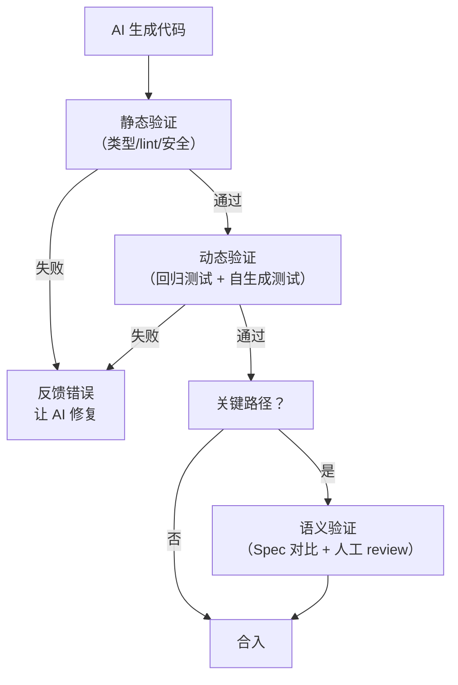
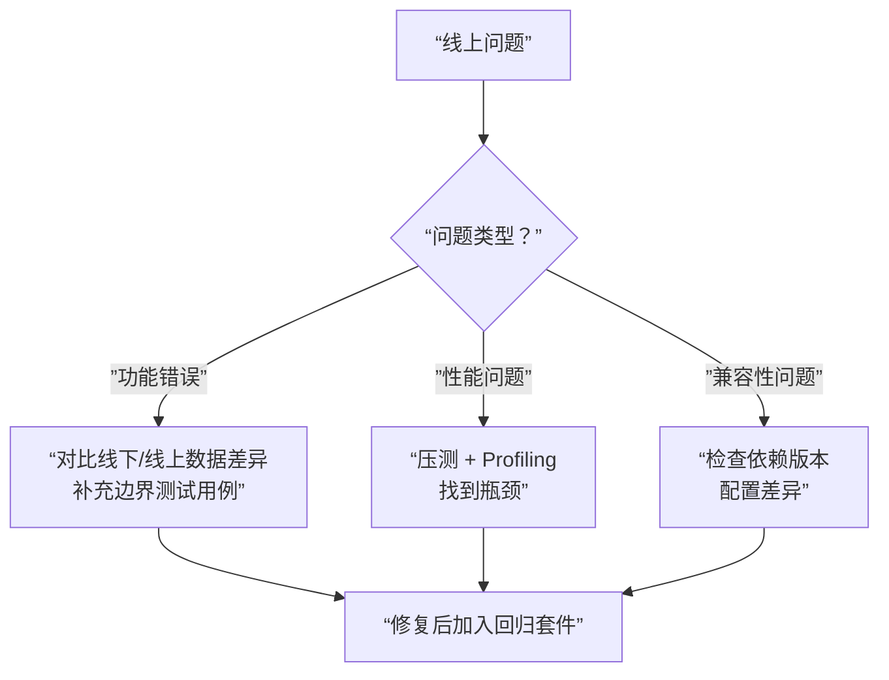

# AI 代码分析与测试：覆盖率、插桩、代码过滤

用 Agent 做自动化代码测试是一个热门落地方向。面试官考这个方向时，不只关心“你会不会让模型生成测试”，更关心**你对代码分析的底层原理和边界认知**——什么代码能自动测、什么代码不能、为什么。

---

## Q：分支覆盖率是怎么统计的？原理有没有了解过？代码插桩具体是怎么实现的？

> 来源：抖音基础架构 Agent 一面

**新手答**：“用 coverage 工具跑一下就行。”

**高手答**：

分支覆盖率 = 被执行的分支数 / 总分支数。核心是**代码插桩（Instrumentation）**：

1. **解析阶段**：先把源代码解析成 AST，识别所有分支点——`if/else`、`switch/case`、三元表达式、`&&`/`||` 短路运算
2. **插桩阶段**：在每个分支入口插入计数器代码
3. **执行阶段**：运行插桩后的代码，计数器记录每个分支被执行的次数
4. **统计阶段**：汇总所有计数器，计算覆盖率

```python
# 插桩前
if x > 0:
    return x
else:
    return -x

# 插桩后（概念示意）
if x > 0:
    __cov[12] += 1  # branch 12: if-true
    return x
else:
    __cov[13] += 1  # branch 13: if-false
    return -x
```

具体实现方式分两类：
- **源码级插桩**（Istanbul/nyc、coverage.py）：在 AST 层面改写代码，插入计数器
- **字节码级插桩**（JaCoCo）：不改源码，在类加载时修改字节码，性能开销更小

**差距在哪**：新手只知道“跑工具”。高手理解工具背后的四个阶段和两种实现路径。面试官考的是底层原理认知。

---

## Q：对于代码解析有没有前置分析？有效性判断怎么实现的？未来让你来优化这些指标你会怎么设计？

> 来源：抖音基础架构 Agent 一面

**新手答**：“直接把代码发给模型就行。”

**高手答**：

前置分析是**生成质量的关键**，不做前置分析等于盲目生成：

**前置分析做什么**：
1. AST 解析提取函数签名、参数类型、返回类型
2. 依赖分析：这个函数调用了哪些外部模块、类、函数
3. 复杂度评估：圈复杂度、嵌套深度、分支数量——决定需要生成多少测试用例
4. 可测性判断：有没有全局状态依赖、有没有不可控的外部调用

**有效性判断**分三级：
1. **语法有效性**：生成的测试代码能不能通过解析器
2. **编译有效性**：import 能不能解析、类型能不能对齐
3. **语义有效性**：断言是否合理——测试是不是在检查有意义的行为，而不是 `assert True`

**优化设计思路**：
- 低复杂度函数（纯函数、无依赖）用轻量模板快速生成，省 token
- 高复杂度函数做路径分析，按分支拆分成多次生成任务，每次只关注一条路径
- 引入**变异测试**做质量评估——故意改待测代码里的运算符或常量，看生成的测试能不能检测出来

**差距在哪**：新手跳过了分析直接生成。高手展示了完整的前置分析链路和三级有效性判断，且能从执行者视角切换到设计者视角。面试官考的是工程优化能力。

---

## Q：有没有思考过哪些代码会让模型生成的准确度和覆盖率降低？这些用 AST 和 LSP 都生成不了单测的代码如何过滤？

> 来源：抖音基础架构 Agent 一面

**新手答**：“复杂代码肯定效果差。”

**高手答**：

有几类代码是“模型杀手”：

| 代码类型 | 为什么难 | 示例 |
|---------|---------|------|
| 动态代码 | 运行时才确定行为，静态分析看不到 | `eval()`、`getattr()`、元编程 |
| 重副作用代码 | 依赖外部状态，无法纯靠输入输出验证 | 数据库操作、网络请求、文件系统 |
| 复杂继承链 | 模型难以追踪多层继承和方法覆盖 | 深度继承 + mixin + 装饰器 |
| 隐式依赖 | 依赖全局变量、环境变量、配置文件 | 依赖 `os.environ` 的逻辑 |
| 并发代码 | 执行顺序不确定，测试难以复现 | 多线程竞争、异步回调链 |

**过滤策略**：

1. **静态标记**：用 AST 扫描，标记含有 `eval`、`exec`、`__import__` 等动态特征的函数
2. **复杂度阈值**：圈复杂度超过阈值（比如 20）的函数标记为“需要人工辅助”
3. **依赖深度检查**：用 LSP 或调用图分析，外部依赖层数超过阈值的降级处理
4. **历史成功率**：记录每类代码特征的生成成功率，低于阈值的自动跳过或降级到“只生成基础用例”

核心思路：**不是所有代码都适合自动生成测试，把资源集中在 ROI 最高的代码上**。

**差距在哪**：新手只知道“复杂的不行”，说不出具体是哪类复杂。高手分了五类难测代码且给出四种过滤策略。面试官考的是边界思维——你有没有想过“什么做不了”。

---

## Q：如何测试 AI 生成代码的正确性？

> 来源：蚂蚁集团 Agent 开发一面

**新手答**：“跑一下看能不能通过。”

**高手答**：

“跑一下”只能验证“能不能运行”，不能验证“逻辑对不对”。AI 生成的代码最危险的问题不是编译报错，而是**看起来能跑、但行为不符合预期**。

测试 AI 生成代码的正确性，分**三个层次**：

**第一层：静态验证（零成本、秒级反馈）**

| 检查项 | 工具 | 能抓什么问题 |
|--------|------|------------|
| 类型检查 | TypeScript / mypy | 参数类型不匹配、返回值类型错误 |
| Lint 规则 | ESLint / Ruff | 代码风格违规、常见 bug 模式 |
| 安全扫描 | Semgrep / Bandit | SQL 注入、XSS、硬编码凭证 |
| Import 检查 | 编译器 | 引用了不存在的模块或 API |

AI 经常生成“看起来合理但引用了不存在的 API”的代码。静态检查能秒级拦住这类问题。

**第二层：动态验证（中等成本、分钟级反馈）**

1. **已有测试套件回归**：生成的代码不能破坏已有功能。跑一遍现有的单元测试和集成测试
2. **AI 自生成测试**：让 AI 同时生成代码和对应的测试用例。虽然 AI 生成的测试也可能有 bug，但能抓住**明显的逻辑错误**（如边界条件、空值处理）
3. **属性测试（Property-based Testing）**：用 Hypothesis / fast-check 生成大量随机输入，验证代码是否满足不变量（如“排序后数组长度不变”）。对于纯函数特别有效

**第三层：语义验证（高成本、但最可靠）**

4. **Spec 对比**：如果有明确的技术规格（接口定义、行为描述），用另一个模型或规则引擎检查生成的代码是否符合 Spec
5. **Mutation Testing**：对生成的测试用例做变异测试——故意在代码里引入 bug，看测试能不能发现。如果测试发现不了人为注入的 bug，说明测试本身不可靠
6. **人工抽检**：对关键路径的代码做人工 review，重点看业务逻辑正确性和边界条件

**验证流程编排**：



**差距在哪**：新手的”跑一下”只覆盖了”能不能运行”。高手从静态（类型/lint/安全）、动态（回归/自生成/属性测试）、语义（Spec 对比/变异测试/人工）三层构建了完整的正确性验证体系。面试官考的是你对 AI 生成代码测试有没有系统性的方法论——不是”测了没有”，而是”怎么测才可靠”。

**追问：AI 写的代码如何验证？（更偏实操角度）**

> 来源：字节实习二面

上面的三层体系是方法论，实际操作中还需要**验证策略的选择**：

| 代码类型 | 验证重点 | 推荐手段 |
|---------|---------|---------|
| 纯函数/工具函数 | 输入输出正确性 | 属性测试 + 边界用例 |
| API 路由/接口 | 状态码、响应格式、鉴权 | 集成测试 + 契约测试 |
| 业务逻辑 | 符合需求规格 | Spec 对比 + 人工 review |
| 数据库操作 | 数据一致性、幂等性 | 事务测试 + 回滚验证 |

核心原则：**AI 生成的代码和人写的代码用同一套验证标准**，不要因为是 AI 写的就降低标准，也不要因为是 AI 写的就额外怀疑。唯一的区别是 AI 代码更容易出”看起来对但语义错”的问题——所以在语义验证层要比人写的代码投入更多精力。

---

## Q：AI 生成的代码线下测试没问题，上线后出了问题怎么办？

> 来源：字节实习二面

**新手答**：”回滚，然后重新让 AI 生成。”

**高手答**：

这个问题的核心是**线下和线上环境的差异导致测试覆盖不足**。回滚只是止血，关键是搞清楚为什么线下测没出来。

**第一步：定位”差在哪”**

线下测试和线上环境的常见差异：

| 差异维度 | 线下环境 | 线上环境 |
|---------|---------|---------|
| 数据规模 | 几百条测试数据 | 百万级真实数据 |
| 并发量 | 单线程跑测试 | 高并发请求 |
| 数据分布 | 干净、均匀 | 存在脏数据、极端值、编码问题 |
| 依赖服务 | Mock 或测试环境 | 真实服务（可能超时、降级） |
| 配置差异 | 本地配置 | 线上配置（环境变量、Feature Flag） |

**第二步：分类处理**



**第三步：建立防复发机制**

1. **线上流量回放**：录制线上真实请求，在测试环境回放。这是缩小线下/线上差异最有效的手段
2. **灰度发布**：AI 生成的代码不直接全量上线，先灰度 5% 流量，观察错误率和性能指标
3. **AI 代码标记**：在 git commit 中标记哪些代码是 AI 生成的，线上出问题时优先排查这些文件
4. **断言增强**：在 AI 生成的代码关键路径加 assertion，线上触发时直接报警而不是静默错误

**差距在哪**：新手的”回滚重新生成”是事后补救，没有分析根因。高手从定位差异（为什么线下没测出来）、分类处理（不同问题类型的排查路径）、防复发（流量回放/灰度/标记/断言）三层建立了系统化的应对方案。面试官考的是你对”测试环境和生产环境差异”的工程认知——这不是 AI 特有的问题，传统软件开发也一样，但 AI 生成代码的不可预测性让这个问题更突出。

---

## 这类题的答题模式

AI 代码测试题的核心是**底层原理 + 边界认知**：

```text
1. 不只会用工具——要理解覆盖率统计和代码插桩的底层原理
2. 前置分析是质量关键——不分析就生成等于盲目
3. 有效性分三级——语法、编译、语义递进判断
4. 知道什么做不了——动态代码、重副作用、复杂继承是"模型杀手"
5. 过滤策略要可量化——复杂度阈值、历史成功率，不是拍脑袋
```

返回模块首页：

- [Agent 面试通关](../index.html)
