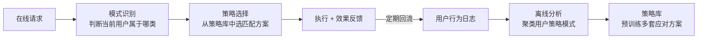
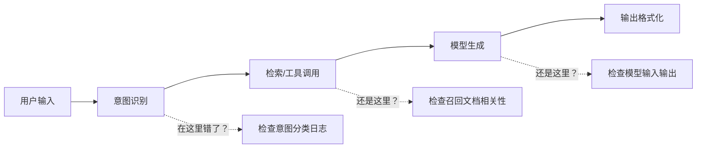
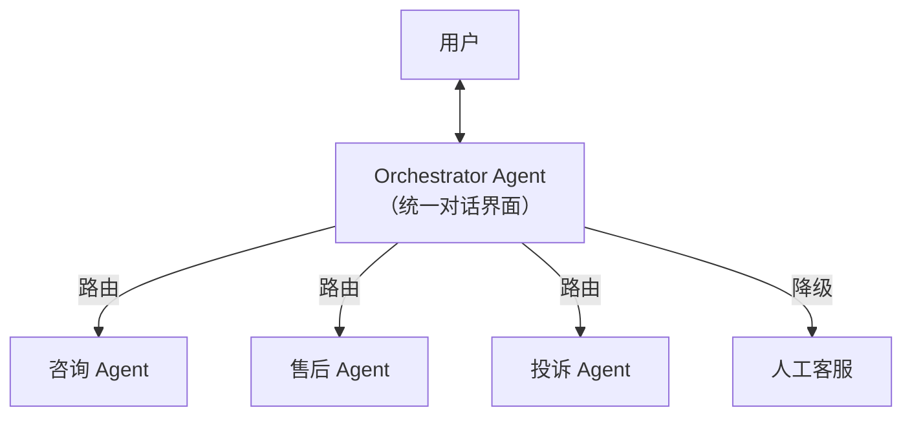
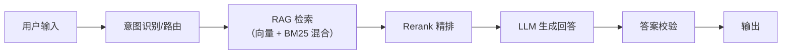

# 业务 AI 工程分析

这个维度考察的不是纯技术能力，而是**你能不能把业务问题翻译成 AI 工程方案**。面试官会给一个具体业务场景，看你怎么拆需求、选方案、评估效果——是「懂业务的 AI 工程师」和「只会调 API」的分水岭。

---

## 方案选型与决策

### Q：时间紧张，“快速上线规则方案”和“训练一个更智能的 AI 方案”之间怎么选？

> 来源：网易 AI Agent 开发实习

**新手答**：“先上规则方案，后面再换 AI。”

**高手答**：

方向没错，但决策框架不能只有“先上再说”。需要从三个维度判断：

**1. 问题的确定性**

| 确定性 | 特征 | 推荐方案 |
|--------|------|---------|
| 高确定性 | 规则可穷举、边界清晰、异常少 | 规则引擎，AI 是过度设计 |
| 中确定性 | 大部分可枚举，少量长尾 case | 规则 + AI 兜底（混合方案） |
| 低确定性 | 输入多变、无法穷举、需要泛化 | 必须上 AI，规则撑不住 |

**2. 数据就绪度**

没有训练数据或标注数据，AI 方案就是空中楼阁。这时候先上规则不是妥协，是**唯一选择**——同时用规则方案跑线上积累数据，为后续 AI 方案准备训练集。

**3. 切换成本**

架构设计时预留 AI 接入口：

```text
用户请求 → 路由层 → 规则引擎（当前）
                  → AI 模型（预留接口，AB 测试切换）
```

如果一开始就把规则逻辑写死在业务代码里，后面换 AI 的改造成本会很高。好的做法是把决策逻辑抽象成**策略接口**，规则和 AI 只是两种实现。

**核心认知**：这道题考的不是“AI 还是规则”的二选一，而是你有没有**渐进式落地**的工程思维——先用确定性方案兜底，同时积累数据和信任，再逐步引入 AI。90% 的生产系统都是这么演进的。

**差距在哪**：新手的“先上规则后面换”缺乏判断框架。高手从问题确定性、数据就绪度、切换成本三个维度给出决策依据，且在架构上预留了演进空间。面试官考的是你对 AI 落地的务实认知——不是“AI 万能”，而是“什么时候该用什么”。

---

### Q：设计一个能根据用户行为自适应调整策略的 AI 系统，从技术架构上怎么做？

> 来源：网易 AI Agent 开发实习（原题：设计进化 BOSS 战 AI）

**新手答**：“用强化学习，让 AI 从用户行为中学习。”

**高手答**：

“自适应”听起来需要复杂的在线学习，但生产系统里通常分成**离线学习 + 在线切换**两层，而不是让模型实时训练：

**整体架构**：



**三层设计**：

| 层级 | 职责 | 技术选型 |
|------|------|---------|
| **离线层** | 从历史行为中挖掘用户策略模式，训练/更新策略库 | 聚类分析、行为序列建模、离线 RL |
| **在线层** | 实时识别当前用户的行为模式，匹配最佳策略 | 轻量分类器、规则路由、特征匹配 |
| **反馈层** | 收集策略执行效果，回流到离线层 | 埋点 + 效果指标计算 |

**为什么不直接在线学习？**

- **延迟**：在线训练/推理延迟不可控，业务场景通常要求毫秒级响应
- **安全**：在线学习可能学到不该学的模式（作弊行为、极端 case），没有人工审核就更新策略很危险
- **可回滚**：离线训练的策略可以 AB 测试、灰度发布、一键回滚；在线学习的模型状态很难精确回退

**关键工程细节**：策略切换不能太突然。用户上一秒还在面对策略 A，下一秒突然变成策略 B，体验会很割裂。需要**渐进式过渡**——在几轮交互中逐步调整策略权重，而非硬切。

**差距在哪**：新手直觉是“强化学习”，但没考虑在线学习的延迟、安全和可控性问题。高手把“自适应”拆成离线学习 + 在线匹配两层，既保留了适应能力，又保证了工程可控性。面试官考的是你能不能把一个看似需要前沿技术的需求，翻译成可落地的工程方案。

---

## 效果评估与排查

### Q：如何验证 AI 方案确实提升了业务指标，而不是带来了副作用？

> 来源：网易 AI Agent 开发实习（原题：验证 AI 提升游戏体验而非难度）

**新手答**：“看准确率提升了就行。”

**高手答**：

模型指标（准确率、F1）提升不等于业务指标提升——这是 AI 落地最常踩的坑。验证体系要分三层：

**第一层：定义正确的业务指标**

AI 方案的目标不是“模型更准”，是“业务更好”。两者经常不一致：

```text
模型准确率 92% → 但推荐的内容用户不点
回答正确率 95% → 但用户满意度反而下降（回答太机械、缺乏温度）
意图识别 F1 0.9 → 但转化率没变（识别对了但后续流程有问题）
```

正确做法：**从业务目标倒推评估指标**。如果目标是提升用户留存，就看留存率而非模型准确率。

**第二层：AB 测试隔离变量**

```text
对照组：原方案（规则/旧模型）
实验组：新 AI 方案
流量分配：5% → 20% → 50%（渐进放量）
观测周期：至少 2 周（排除新奇效应）
```

关键是**只改一个变量**。如果同时上了新模型和新 UI，效果变化归因不清。

**第三层：监控副作用指标**

除了目标指标，必须同时监控**护栏指标**（guardrail metrics）——那些“绝对不能变差”的指标：

| 目标指标 | 护栏指标 |
|---------|---------|
| 推荐点击率提升 | 用户投诉率不能上升 |
| 客服响应速度提升 | 回答准确率不能下降 |
| 任务完成率提升 | 用户流失率不能上升 |

如果目标指标提升了但护栏指标恶化，这个方案就不能上线——AI“提升”的部分可能是以牺牲用户体验为代价的。

**差距在哪**：新手只看模型指标。高手从业务指标定义、AB 测试设计、护栏指标监控三层构建了完整的验证体系。面试官考的是你对“AI 效果”的理解是“模型更准”还是“业务更好”。

---

### Q：业务方反馈“AI 效果差”，你怎么系统性定位问题？

> 来源：网易 AI Agent 开发实习（原题：玩家反馈 AI 很蠢如何定位）

**新手答**：“看看 bad case，调调 Prompt。”

**高手答**：

“效果差”是一个模糊反馈，第一步是**把主观评价转化为可量化的问题**。排查框架分四层：

**第一层：复现与分类**

```text
收集 bad case → 标注失败类型 → 统计分布
```

失败类型通常落在几个桶里：

| 失败类型 | 占比（示例） | 排查方向 |
|---------|------------|---------|
| 理解错误（意图识别偏了） | 35% | Prompt / 意图分类模型 |
| 检索错误（召回了不相关内容） | 25% | RAG 管线 / 知识库质量 |
| 生成错误（理解对了但回答错了） | 20% | 模型能力 / 输出约束 |
| 体验问题（答案对但感觉差） | 15% | 语气 / 格式 / 响应速度 |
| 数据问题（知识库本身有错） | 5% | 数据源清洗 |

**关键认知：不分类就优化，等于蒙眼治病。** 如果 35% 的问题出在意图识别，你去调生成 Prompt 是浪费时间。

**第二层：定位瓶颈环节**

Agent 系统是一条管线，每个环节都可能出问题：



方法：拿 bad case 逐环节回放——意图识别对不对？检索召回了什么？模型看到的上下文是什么？输出前有没有被截断或格式化出错？通常 80% 的问题集中在 1-2 个环节。

**第三层：区分“能力问题”和“数据问题”**

- **能力问题**：模型/算法本身不行 → 需要换模型、调架构、加微调
- **数据问题**：输入数据质量差（知识库过时、标注有错、用户输入太模糊）→ 需要修数据、加预处理

大部分“AI 效果差”最终定位下来是**数据问题**，不是模型问题。先查数据再查模型，能节省大量排查时间。

**第四层：建立持续监控**

修完当前 bad case 不够，要建**自动化质量监控**：
- 定期从线上抽样做自动评测（LLM-as-Judge 或规则校验）
- 关键指标（意图识别准确率、检索相关度、用户满意度）设告警阈值
- 新版本上线后自动跑回归测试集

**差距在哪**：新手直接看 bad case 调 Prompt——这是在“碰运气”。高手先分类统计找到主要失败类型，再逐环节定位瓶颈，最后区分能力问题和数据问题。面试官考的是你有没有系统性的排查方法论，而不是“哪里不对改哪里”。

---

## 智能客服与 AI 系统落地

### Q：面向客户的 Multi-Agent 客服系统，怎么保证用户体验良好？

> 来源：币安 AI大模型实习一面

**新手答**：“让多个 Agent 各自负责不同问题就行。”

**高手答**：

核心原则：**用户感知到的是一个客服，背后是多个 Agent 协作**。Multi-Agent 的拆分是内部架构优化，不能让用户察觉到“被转接给了不同的机器人”。

**体验设计五原则**：



1. **统一对话界面**：用户始终在一个对话窗口中，Agent 切换对用户透明。Orchestrator 管理路由，用户只和它对话
2. **Handoff 时传结论不传过程**：Agent A 转给 Agent B 时，传结构化摘要（用户需求 + 已确认信息 + 待处理事项），不传原始对话历史。避免 B 重复问用户已经说过的信息
3. **追问策略**：不让用户做填空题，让用户做选择题。“您是想查物流还是申请退款？”而不是“请问您有什么需求？”
4. **状态感知**：每个 Agent 接手时，先用一句话确认已知信息——“我看到您要退货的是订单 XXX，对吗？”让用户觉得“它记得我说过的话”
5. **降级兜底**：Agent 连续 2 次无法理解用户 → 自动升级到人工，附带完整上下文摘要，让人工客服无缝接续

**常见体验灾难及防治**：

| 体验灾难 | 根因 | 防治方案 |
|---------|------|---------|
| 用户被反复追问相同信息 | Handoff 时信息丢失 | 标准化交接摘要协议 |
| 回答风格突变（突然变得很机械） | Agent 切换后 Prompt 风格不一致 | 统一语气指南写入所有 Agent 的 System Prompt |
| 用户说了半天对方没任何反应 | LLM 推理延迟 + 无流式反馈 | 打字指示器 + 流式输出 + 预设过渡语 |
| “我帮您转接同事”频繁出现 | 路由频繁切换 Agent | 对用户隐藏路由行为，切换时不通知 |

**差距在哪**：新手把 Multi-Agent 等同于“拆分问题类型”，没考虑用户体验。高手从用户感知出发设计——统一界面、无感切换、结论传递、主动确认、降级兜底。面试官考的是你能不能从技术架构的视角切换到用户体验的视角——多 Agent 是为了“系统更好管”，但不能让用户为此买单。

---

### Q：知识库 RAG 和智能客服 Agent 系统的成熟方案有哪些？标准方案的优点和局限性？

> 来源：币安 AI大模型实习一面

**新手答**：“用 RAG 检索知识库，然后 LLM 回答。”

**高手答**：

智能客服 Agent 的方案选型不是“用不用 RAG”的问题，而是**用什么级别的架构**。按成熟度和复杂度分四档：

| 方案 | 代表产品 | 优点 | 局限性 |
|------|---------|------|--------|
| 纯 RAG 问答 | 大多数企业知识库 | 简单、可追溯、成本低 | 不能处理多轮复杂任务、无法执行操作 |
| RAG + Agent | Coze、Dify、FastGPT | 既能查知识又能调工具执行操作 | 工具调用准确率不稳定、调试困难 |
| Multi-Agent 客服 | 蚂蚁/阿里内部方案 | 专业分工、可扩展、体验好 | 架构复杂、通信成本高、需大量领域数据 |
| 知识图谱 + RAG | GraphRAG 方案 | 多跳推理强、实体消歧好 | 图构建成本高、维护复杂 |

**标准方案架构**：



**标准方案的四大核心局限**：

1. **知识库覆盖度**：用户问了知识库没有的问题 → 模型要么幻觉要么拒答，体验都不好。解法：知识库覆盖度监控 + 未命中 query 自动收集 + 定期补充
2. **多轮上下文管理**：标准 RAG 是单轮检索，多轮对话中上下文漂移导致检索偏离。解法：对话状态追踪 + query 改写融合历史
3. **个性化不足**：同一个问题对不同用户应该有不同回答（VIP vs 普通用户）。解法：用户画像注入检索条件和 Prompt
4. **实时性**：知识库更新有延迟，新政策/新产品上线后用户马上来问，知识库还没入库。解法：热更新机制 + 兜底到在线搜索

**选型决策框架**：

```text
问题确定性高 + 无需操作 → 纯 RAG
问题多变 + 需要执行操作 → RAG + Agent
用户量大 + 场景复杂 + 有团队维护 → Multi-Agent
实体关系复杂 + 多跳推理需求 → GraphRAG
```

**差距在哪**：新手只知道“RAG + LLM”一种方案。高手对比了四档方案的适用场景和局限性，且分析了标准方案的四大核心问题和对应解法。面试官考的是你对智能客服系统的全局认知——不只是“能做”，而是知道每种方案“做到什么程度、卡在哪里”。

---

## 这类题的答题模式

业务 AI 工程分析题的核心是**从业务出发，回到业务**：

```text
1. 先理解业务目标——不是"用 AI 做什么"，是"业务要解决什么问题"
2. 再判断 AI 是否是最优解——不是所有问题都需要 AI，规则引擎可能更稳
3. 选方案时考虑 ROI——不是最先进的方案最好，是性价比最高的方案最好
4. 效果评估回到业务指标——不是模型准确率，是业务转化率/效率提升/成本降低
```

面试官听到「用 RAG + Agent」就知道你在套方案。听到「这个场景的核心瓶颈是 X，所以我选 Y 方案，预期提升 Z 指标」，才会觉得你有业务 sense。

---

## 推荐阅读

- [架构选型：ReAct、Plan-and-Execute 与 ToT 怎么选](../01-architecture-design/index.html)
- [评估与全局观：怎么量化 Agent 好坏、落地最大挑战](../05-eval-and-vision/index.html)
- [工程化踩坑：死循环、状态丢失与成本控制](../07-engineering-pitfalls/index.html)
