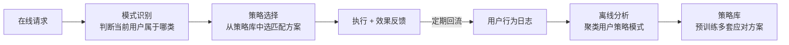
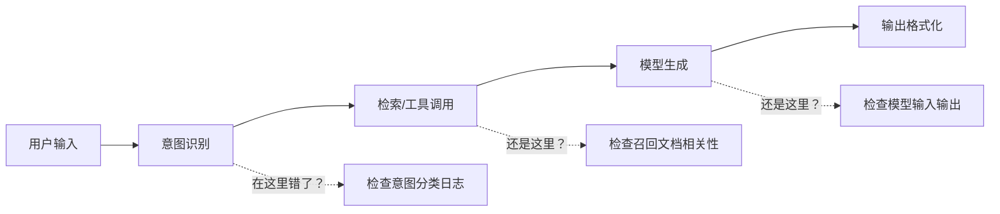
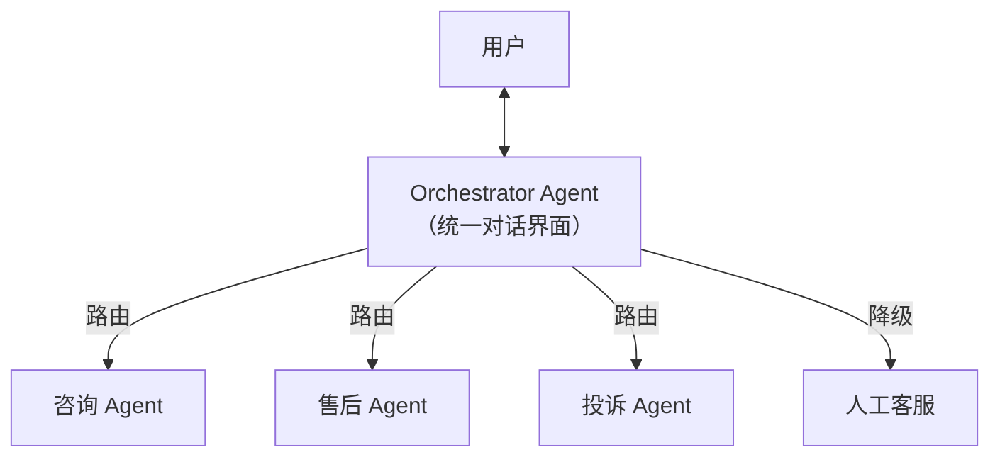
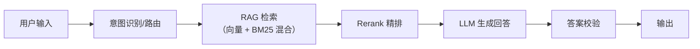
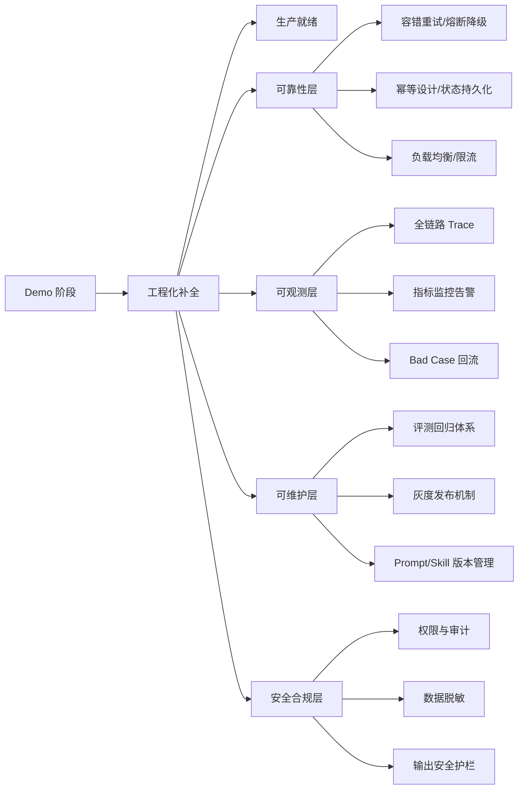
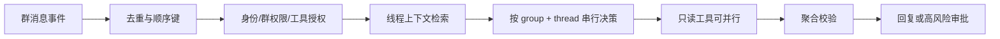

# 业务 AI 工程分析

这个维度考察的不是纯技术能力，而是**你能不能把业务问题翻译成 AI 工程方案**。面试官会给一个具体业务场景，看你怎么拆需求、选方案、评估效果——是「懂业务的 AI 工程师」和「只会调 API」的分水岭。

---

## 方案选型与决策

### Q：时间紧张，“快速上线规则方案”和“训练一个更智能的 AI 方案”之间怎么选？

> 来源：网易 AI Agent 开发实习

**新手答**：“先上规则方案，后面再换 AI。”

**高手答**：

方向没错，但决策框架不能只有“先上再说”。需要从三个维度判断：

**1. 问题的确定性**

| 确定性 | 特征 | 推荐方案 |
|--------|------|---------|
| 高确定性 | 规则可穷举、边界清晰、异常少 | 规则引擎，AI 是过度设计 |
| 中确定性 | 大部分可枚举，少量长尾 case | 规则 + AI 兜底（混合方案） |
| 低确定性 | 输入多变、无法穷举、需要泛化 | 必须上 AI，规则撑不住 |

**2. 数据就绪度**

没有训练数据或标注数据，AI 方案就是空中楼阁。这时候先上规则不是妥协，是**唯一选择**——同时用规则方案跑线上积累数据，为后续 AI 方案准备训练集。

**3. 切换成本**

架构设计时预留 AI 接入口：

```text
用户请求 → 路由层 → 规则引擎（当前）
                  → AI 模型（预留接口，AB 测试切换）
```

如果一开始就把规则逻辑写死在业务代码里，后面换 AI 的改造成本会很高。好的做法是把决策逻辑抽象成**策略接口**，规则和 AI 只是两种实现。

**核心认知**：这道题考的不是“AI 还是规则”的二选一，而是你有没有**渐进式落地**的工程思维——先用确定性方案兜底，同时积累数据和信任，再逐步引入 AI。90% 的生产系统都是这么演进的。

**差距在哪**：新手的“先上规则后面换”缺乏判断框架。高手从问题确定性、数据就绪度、切换成本三个维度给出决策依据，且在架构上预留了演进空间。面试官考的是你对 AI 落地的务实认知——不是“AI 万能”，而是“什么时候该用什么”。

---

### Q：设计一个能根据用户行为自适应调整策略的 AI 系统，从技术架构上怎么做？

> 来源：网易 AI Agent 开发实习（原题：设计进化 BOSS 战 AI）

**新手答**：“用强化学习，让 AI 从用户行为中学习。”

**高手答**：

“自适应”听起来需要复杂的在线学习，但生产系统里通常分成**离线学习 + 在线切换**两层，而不是让模型实时训练：

**整体架构**：


```mermaid
flowchart LR
    A["用户行为日志"] --> B["离线分析\n聚类用户策略模式"]
    B --> C["策略库\n预训练多套应对方案"]
    D["在线请求"] --> E["模式识别\n判断当前用户属于哪类"]
    E --> F["策略选择\n从策略库中选匹配方案"]
    F --> G["执行 + 效果反馈"]
    G -->|"定期回流"| A
```

**三层设计**：

| 层级 | 职责 | 技术选型 |
|------|------|---------|
| **离线层** | 从历史行为中挖掘用户策略模式，训练/更新策略库 | 聚类分析、行为序列建模、离线 RL |
| **在线层** | 实时识别当前用户的行为模式，匹配最佳策略 | 轻量分类器、规则路由、特征匹配 |
| **反馈层** | 收集策略执行效果，回流到离线层 | 埋点 + 效果指标计算 |

**为什么不直接在线学习？**

- **延迟**：在线训练/推理延迟不可控，业务场景通常要求毫秒级响应
- **安全**：在线学习可能学到不该学的模式（作弊行为、极端 case），没有人工审核就更新策略很危险
- **可回滚**：离线训练的策略可以 AB 测试、灰度发布、一键回滚；在线学习的模型状态很难精确回退

**关键工程细节**：策略切换不能太突然。用户上一秒还在面对策略 A，下一秒突然变成策略 B，体验会很割裂。需要**渐进式过渡**——在几轮交互中逐步调整策略权重，而非硬切。

**差距在哪**：新手直觉是“强化学习”，但没考虑在线学习的延迟、安全和可控性问题。高手把“自适应”拆成离线学习 + 在线匹配两层，既保留了适应能力，又保证了工程可控性。面试官考的是你能不能把一个看似需要前沿技术的需求，翻译成可落地的工程方案。

---

## 效果评估与排查

### Q：如何验证 AI 方案确实提升了业务指标，而不是带来了副作用？

> 来源：网易 AI Agent 开发实习（原题：验证 AI 提升游戏体验而非难度）

**新手答**：“看准确率提升了就行。”

**高手答**：

模型指标（准确率、F1）提升不等于业务指标提升——这是 AI 落地最常踩的坑。验证体系要分三层：

**第一层：定义正确的业务指标**

AI 方案的目标不是“模型更准”，是“业务更好”。两者经常不一致：

```text
模型准确率 92% → 但推荐的内容用户不点
回答正确率 95% → 但用户满意度反而下降（回答太机械、缺乏温度）
意图识别 F1 0.9 → 但转化率没变（识别对了但后续流程有问题）
```

正确做法：**从业务目标倒推评估指标**。如果目标是提升用户留存，就看留存率而非模型准确率。

**第二层：AB 测试隔离变量**

```text
对照组：原方案（规则/旧模型）
实验组：新 AI 方案
流量分配：5% → 20% → 50%（渐进放量）
观测周期：至少 2 周（排除新奇效应）
```

关键是**只改一个变量**。如果同时上了新模型和新 UI，效果变化归因不清。

**第三层：监控副作用指标**

除了目标指标，必须同时监控**护栏指标**（guardrail metrics）——那些“绝对不能变差”的指标：

| 目标指标 | 护栏指标 |
|---------|---------|
| 推荐点击率提升 | 用户投诉率不能上升 |
| 客服响应速度提升 | 回答准确率不能下降 |
| 任务完成率提升 | 用户流失率不能上升 |

如果目标指标提升了但护栏指标恶化，这个方案就不能上线——AI“提升”的部分可能是以牺牲用户体验为代价的。

**差距在哪**：新手只看模型指标。高手从业务指标定义、AB 测试设计、护栏指标监控三层构建了完整的验证体系。面试官考的是你对“AI 效果”的理解是“模型更准”还是“业务更好”。

---

### Q：业务方反馈“AI 效果差”，你怎么系统性定位问题？

> 来源：网易 AI Agent 开发实习（原题：玩家反馈 AI 很蠢如何定位）

**新手答**：“看看 bad case，调调 Prompt。”

**高手答**：

“效果差”是一个模糊反馈，第一步是**把主观评价转化为可量化的问题**。排查框架分四层：

**第一层：复现与分类**

```text
收集 bad case → 标注失败类型 → 统计分布
```

失败类型通常落在几个桶里：

| 失败类型 | 占比（示例） | 排查方向 |
|---------|------------|---------|
| 理解错误（意图识别偏了） | 35% | Prompt / 意图分类模型 |
| 检索错误（召回了不相关内容） | 25% | RAG 管线 / 知识库质量 |
| 生成错误（理解对了但回答错了） | 20% | 模型能力 / 输出约束 |
| 体验问题（答案对但感觉差） | 15% | 语气 / 格式 / 响应速度 |
| 数据问题（知识库本身有错） | 5% | 数据源清洗 |

**关键认知：不分类就优化，等于蒙眼治病。** 如果 35% 的问题出在意图识别，你去调生成 Prompt 是浪费时间。

**第二层：定位瓶颈环节**

Agent 系统是一条管线，每个环节都可能出问题：


```mermaid
flowchart LR
    A["用户输入"] --> B["意图识别"]
    B --> C["检索/工具调用"]
    C --> D["模型生成"]
    D --> E["输出格式化"]
    
    B -.->|"在这里错了？"| F["检查意图分类日志"]
    C -.->|"还是这里？"| G["检查召回文档相关性"]
    D -.->|"还是这里？"| H["检查模型输入输出"]
```

方法：拿 bad case 逐环节回放——意图识别对不对？检索召回了什么？模型看到的上下文是什么？输出前有没有被截断或格式化出错？通常 80% 的问题集中在 1-2 个环节。

**第三层：区分“能力问题”和“数据问题”**

- **能力问题**：模型/算法本身不行 → 需要换模型、调架构、加微调
- **数据问题**：输入数据质量差（知识库过时、标注有错、用户输入太模糊）→ 需要修数据、加预处理

大部分“AI 效果差”最终定位下来是**数据问题**，不是模型问题。先查数据再查模型，能节省大量排查时间。

**第四层：建立持续监控**

修完当前 bad case 不够，要建**自动化质量监控**：
- 定期从线上抽样做自动评测（LLM-as-Judge 或规则校验）
- 关键指标（意图识别准确率、检索相关度、用户满意度）设告警阈值
- 新版本上线后自动跑回归测试集

**差距在哪**：新手直接看 bad case 调 Prompt——这是在“碰运气”。高手先分类统计找到主要失败类型，再逐环节定位瓶颈，最后区分能力问题和数据问题。面试官考的是你有没有系统性的排查方法论，而不是“哪里不对改哪里”。

---

## 智能客服与 AI 系统落地

### Q：面向客户的 Multi-Agent 客服系统，怎么保证用户体验良好？

> 来源：币安 AI大模型实习一面

**新手答**：“让多个 Agent 各自负责不同问题就行。”

**高手答**：

核心原则：**用户感知到的是一个客服，背后是多个 Agent 协作**。Multi-Agent 的拆分是内部架构优化，不能让用户察觉到“被转接给了不同的机器人”。

**体验设计五原则**：


```mermaid
flowchart TB
    U["用户"] <--> O["Orchestrator Agent\n（统一对话界面）"]
    O -->|"路由"| A1["咨询 Agent"]
    O -->|"路由"| A2["售后 Agent"]
    O -->|"路由"| A3["投诉 Agent"]
    O -->|"降级"| H["人工客服"]
```

1. **统一对话界面**：用户始终在一个对话窗口中，Agent 切换对用户透明。Orchestrator 管理路由，用户只和它对话
2. **Handoff 时传结论不传过程**：Agent A 转给 Agent B 时，传结构化摘要（用户需求 + 已确认信息 + 待处理事项），不传原始对话历史。避免 B 重复问用户已经说过的信息
3. **追问策略**：不让用户做填空题，让用户做选择题。“您是想查物流还是申请退款？”而不是“请问您有什么需求？”
4. **状态感知**：每个 Agent 接手时，先用一句话确认已知信息——“我看到您要退货的是订单 XXX，对吗？”让用户觉得“它记得我说过的话”
5. **降级兜底**：Agent 连续 2 次无法理解用户 → 自动升级到人工，附带完整上下文摘要，让人工客服无缝接续

**常见体验灾难及防治**：

| 体验灾难 | 根因 | 防治方案 |
|---------|------|---------|
| 用户被反复追问相同信息 | Handoff 时信息丢失 | 标准化交接摘要协议 |
| 回答风格突变（突然变得很机械） | Agent 切换后 Prompt 风格不一致 | 统一语气指南写入所有 Agent 的 System Prompt |
| 用户说了半天对方没任何反应 | LLM 推理延迟 + 无流式反馈 | 打字指示器 + 流式输出 + 预设过渡语 |
| “我帮您转接同事”频繁出现 | 路由频繁切换 Agent | 对用户隐藏路由行为，切换时不通知 |

**差距在哪**：新手把 Multi-Agent 等同于“拆分问题类型”，没考虑用户体验。高手从用户感知出发设计——统一界面、无感切换、结论传递、主动确认、降级兜底。面试官考的是你能不能从技术架构的视角切换到用户体验的视角——多 Agent 是为了“系统更好管”，但不能让用户为此买单。

---

### Q：知识库 RAG 和智能客服 Agent 系统的成熟方案有哪些？标准方案的优点和局限性？

> 来源：币安 AI大模型实习一面

**新手答**：“用 RAG 检索知识库，然后 LLM 回答。”

**高手答**：

智能客服 Agent 的方案选型不是“用不用 RAG”的问题，而是**用什么级别的架构**。按成熟度和复杂度分四档：

| 方案 | 代表产品 | 优点 | 局限性 |
|------|---------|------|--------|
| 纯 RAG 问答 | 大多数企业知识库 | 简单、可追溯、成本低 | 不能处理多轮复杂任务、无法执行操作 |
| RAG + Agent | Coze、Dify、FastGPT | 既能查知识又能调工具执行操作 | 工具调用准确率不稳定、调试困难 |
| Multi-Agent 客服 | 蚂蚁/阿里内部方案 | 专业分工、可扩展、体验好 | 架构复杂、通信成本高、需大量领域数据 |
| 知识图谱 + RAG | GraphRAG 方案 | 多跳推理强、实体消歧好 | 图构建成本高、维护复杂 |

**标准方案架构**：


```mermaid
flowchart LR
    A["用户输入"] --> B["意图识别/路由"]
    B --> C["RAG 检索\n（向量 + BM25 混合）"]
    C --> D["Rerank 精排"]
    D --> E["LLM 生成回答"]
    E --> F["答案校验"]
    F --> G["输出"]
```

**标准方案的四大核心局限**：

1. **知识库覆盖度**：用户问了知识库没有的问题 → 模型要么幻觉要么拒答，体验都不好。解法：知识库覆盖度监控 + 未命中 query 自动收集 + 定期补充
2. **多轮上下文管理**：标准 RAG 是单轮检索，多轮对话中上下文漂移导致检索偏离。解法：对话状态追踪 + query 改写融合历史
3. **个性化不足**：同一个问题对不同用户应该有不同回答（VIP vs 普通用户）。解法：用户画像注入检索条件和 Prompt
4. **实时性**：知识库更新有延迟，新政策/新产品上线后用户马上来问，知识库还没入库。解法：热更新机制 + 兜底到在线搜索

**选型决策框架**：

```text
问题确定性高 + 无需操作 → 纯 RAG
问题多变 + 需要执行操作 → RAG + Agent
用户量大 + 场景复杂 + 有团队维护 → Multi-Agent
实体关系复杂 + 多跳推理需求 → GraphRAG
```

**差距在哪**：新手只知道“RAG + LLM”一种方案。高手对比了四档方案的适用场景和局限性，且分析了标准方案的四大核心问题和对应解法。面试官考的是你对智能客服系统的全局认知——不只是“能做”，而是知道每种方案“做到什么程度、卡在哪里”。

---

## Q：Agent 项目如何从 Demo 进行企业级落地？从原型到生产需要补全哪些工程能力？

> 来源：哆咔互娱 Agent开发实习一面 【[国际业务 Agent 一面](https://www.nowcoder.com/feed/main/detail/3c305b0c1565458ba05c9906322f5327)追问：无人化业务链路的自治边界】

**新手答**：“把 Demo 代码优化一下，加个前端界面，部署到服务器上就行了。”

**高手答**：

Demo 到生产的鸿沟不在于功能实现，而在于**可靠性、可观测性、可维护性**三个维度的系统性补全：


```mermaid
graph LR
    A[Demo 阶段] --> B[工程化补全]
    B --> C[生产就绪]
    
    B --> D[可靠性层]
    B --> E[可观测层]
    B --> F[可维护层]
    B --> G[安全合规层]
    
    D --> D1[容错重试/熔断降级]
    D --> D2[幂等设计/状态持久化]
    D --> D3[负载均衡/限流]
    
    E --> E1[全链路 Trace]
    E --> E2[指标监控告警]
    E --> E3[Bad Case 回流]
    
    F --> F1[评测回归体系]
    F --> F2[灰度发布机制]
    F --> F3[Prompt/Skill 版本管理]
    
    G --> G1[权限与审计]
    G --> G2[数据脱敏]
    G --> G3[输出安全护栏]
```

具体需要补全的工程能力：

**1. 容错与稳定性**
- Demo 里工具调用失败直接报错；生产需要重试策略、超时熔断、降级路径
- Demo 的状态全在内存；生产需要 Checkpoint 持久化 + 断点续跑
- Demo 单用户；生产需要并发控制、资源隔离、排队机制

**2. 可观测性**
- 全链路 Trace：每步推理耗时、工具调用结果、token 消耗都要可追溯
- Bad Case 收集闭环：线上失败 case 自动入库，定期回流到评测集
- 成本监控：按用户/任务/工具维度统计 token 开销，做成本归因

**3. 评测与迭代**
- Demo 靠人看输出质量；生产需要自动化评测集（按任务类型分层）
- Prompt 和 Skill 的变更需要回归测试，不能改一处全线崩
- 灰度发布：新策略先对 5% 流量生效，观察指标再全量

**4. 安全合规**
- 工具权限分级：高风险操作（删除、支付）走 Human-in-the-Loop
- 输出安全护栏：敏感词拦截、幻觉检测、PII 脱敏
- 审计日志：谁触发了什么操作，完整记录不可篡改

**5. 运维与交付**
- CI/CD：评测集跑通才能合并，不能靠“手动试了一下没问题”
- 文档与 Onboarding：新人接手不需要读五千行 Prompt 才能开始改
- SLA 定义：响应时间、成功率、可用性的承诺和降级策略

**追问：怎样定义一条业务链路“真正无人化”，哪些环节仍要保留人工门禁？**

无人化不是“没有人看最终文本”，而是在声明的任务范围内，输入、决策、动作和验收都能由可验证规则闭环。先按动作副作用分级：只读查询和可撤销草稿可以自动执行；对外发送、资金、权限、生产写入等高风险动作保持审批或双重确认。每个自动步骤都要有成功条件、证据、幂等键、超时、补偿和责任 owner，模型说“完成”不算完成，必须读取权威业务状态。

上线采用影子模式、建议模式、限额自动执行再逐步放权。监控自动完成率时同时看错误放行、撤回、补偿、人工接管和用户投诉，不能靠压低转人工率制造“无人化”。无法稳定验证、后果不可逆或策略含糊的环节，保留人工不是失败，而是系统边界。

**差距在哪**：面试官考的是你对“工程成熟度”的认知。Demo 证明“能做”，生产证明“做得稳”。能列出从可靠性、可观测性到安全合规的系统清单，说明你有真实的落地思维而不只是跑通 Happy Path。

---

## Q：设计订单客服 Agent 时，如何处理转人工和意图识别调优？

> 来源：某 Java/Agent 岗面经（2026-08-12）

**新手答**：“分类用户意图，查订单后回答；模型不会就转人工。”

**高手答**：

订单客服应采用“意图路由 + 确定性工作流 + LLM 交互”的混合架构。查物流、取消订单、退款等操作由带权限和幂等保护的业务工作流执行；LLM 负责理解表达、补槽位、解释结果和安抚情绪，不能自行编造订单状态或赔付规则。

转人工是一个显式状态，而不是失败后的兜底字符串。触发条件包括：用户主动要求；连续两轮未解决或重复表达；低置信度/多意图冲突；高风险退款、投诉和账号安全；工具连续失败；情绪升级。交接包要包含用户目标、订单号、已验证身份、已执行动作、工具结果、失败原因和最近关键对话，避免人工重新问一遍。

意图调优使用线上闭环：

1. 从“转人工后人工选择的真实原因”、用户纠正、重复提问和失败 Trace 中采集 hard cases。
2. 建分层标签体系，先区分咨询/操作/投诉，再细分业务意图；同时保留 `unknown` 和多标签能力。
3. 先做规则、Prompt、few-shot 和 query rewrite；若错误集中且样本稳定，再训练分类器或 SFT。
4. 用 macro-F1、关键意图召回率、误路由率、澄清率、转人工率和任务成功率共同评估；不能为了压低转人工率把高风险请求强留给 Agent。

**差距在哪**：新手把客服 Agent 视为问答机器人。高手把意图、业务动作、风险门禁、人工交接和数据回流组成闭环，并知道转人工率不是越低越好。

---

## Q：什么时候接入 MCP 是合理设计，什么时候属于过度设计？

> 来源：拼多多 AI Agent 提前批二面（2026-08-12）

**新手答**：“MCP 是标准协议，接上后扩展性更好，所以有工具就应该用 MCP。”

**高手答**：

MCP 的价值是**跨 Host 复用、动态发现和协议标准化**，不是让一次普通函数调用变得更“Agent”。判断是否值得接入，要看四个问题：

1. 能力是否要被多个 Agent/IDE/团队复用？只有单体应用内部使用，直接函数或稳定 REST 接口更简单。
2. 工具是否需要独立部署、版本演进和权限边界？如果生命周期和主应用完全一致，拆 Server 只增加运维面。
3. 是否真正需要 resources、prompts、tools、能力协商或远程发现？只调用一个固定 API，薄适配层已经够用。
4. 标准化收益能否覆盖成本？MCP 会增加 transport、连接管理、鉴权、Schema 维护、超时重试、可观测性和供应链风险。

可以用一个简化决策：

```text
单应用 + 固定能力 + 同一团队维护       -> 本地函数/内部接口
跨服务 + 明确契约 + 传统系统消费者      -> REST/gRPC
多 Host 复用 + 动态工具生态 + Agent 消费 -> MCP
```

最稳妥的演进方式是先把领域能力做成与协议无关的 service，再按真实消费者需求加 REST/MCP adapter。这样不会为了展示技术栈，把业务逻辑锁死在 MCP Server 里。

**差距在哪**：新手把“用了新协议”当架构能力。高手能计算复用收益、治理需求和新增复杂度，并给出渐进演进路径。面试官是在验证项目里的 MCP 是解决真实问题，还是简历装饰。

---

## Q：设计一个群聊 Agent，如何同时处理权限、上下文和并行请求？

> 来源：小红书数据库智能化日常实习一面（2026-08-10）

**新手答**：“监听群里的 @ 消息，把群聊历史发给模型，并发调用就行。”

**高手答**：

群聊 Agent 不是单用户 Bot 的简单放大，必须把每次运行绑定到 `tenant_id + group_id + thread_id + requester_id`，并在进入模型前完成身份和权限计算。


```mermaid
flowchart LR
    A["群消息事件"] --> B["去重与顺序键"]
    B --> C["身份/群权限/工具授权"]
    C --> D["线程上下文检索"]
    D --> E["按 group + thread 串行决策"]
    E --> F["只读工具可并行"]
    F --> G["聚合校验"]
    G --> H["回复或高风险审批"]
```

**权限**：读取群消息不等于有权读取每个成员的私有资料，也不等于能以群成员身份执行写操作。工具授权取发起人权限、群策略和 Agent 自身权限的交集；转账、删数据、发外部消息等操作要二次确认或管理员审批。

**上下文**：默认只取当前 thread、最近相关消息、被引用消息和群级公开知识；私聊记忆与其他群记忆严格隔离。对每条消息保留作者、时间和可见范围，模型输出引用事实时能回溯证据。长群聊使用主题分段和检索，不能把整群历史直接塞进窗口。

**并发**：事件先用 message id 幂等去重。同一 thread 的状态变更按版本号或队列串行，不同 thread 可并行；无依赖的只读工具可以 fan-out，有副作用的工具按业务键加锁并使用幂等键。回复前检查 `state_version`，发现期间出现新消息就重规划或标注基于哪个快照回答。

**差距在哪**：新手只看到“群消息更多”。高手意识到群聊引入了多主体权限、上下文可见性和状态竞争，能用隔离键、版本控制和幂等把概率模型放进可控系统。

---

## Q：长文本内容安全审核如何区分“引用有害内容”与“表达有害立场”？

> 来源：[中国电信风控 Agent 二面](https://www.nowcoder.com/feed/main/detail/22e18a3d20734429aec41b37744beadc)（2026-08-22）

**新手答**：“不能只看关键词，要把全文交给大模型判断语义。”

**高手答**：

先把文本切成带重叠和章节结构的片段，提取“内容是什么、谁在说、对谁说、用于支持还是反驳、是否要求执行”的语用信息。局部分类器负责高召回发现风险片段，文档级模型结合标题、前后论证和引用边界判断立场；规则层继续处理明确违法、高风险实体和业务硬约束。不能把未经信任的长文本直接拼进系统 Prompt，以免形成间接提示注入。

评测集要成对构造：相同有害句子分别出现在赞同、批判、新闻引用、学术讨论和操作指令中，比较片段召回、文档级精确率及严重级别。高风险但上下文不确定时保留证据跨度、置信度并转人工；改写只能在不改变用户合法诉求的前提下消除风险内容。

**差距在哪**：新手把关键词换成一个大模型，高手分离局部召回、全文立场、规则硬约束和对抗评测。面试官考的是安全系统能否理解语境且不被被审文本反向控制。

---

## Q：如何设计会议转写 Agent 的端到端链路并评估质量？

> 来源：字节 TikTok AI Agent 开发一面（2026-08-13）

**新手答**：“音频调用 ASR，再让大模型总结会议。”

**高手答**：媒体接入后依次做降噪/VAD、分段、流式 ASR、说话人分离、标点与热词纠错，再生成带时间戳的转写、摘要、决策和待办。评测除 WER/CER 外，还看关键实体加权错误、说话人混淆、时间戳、稳定前缀延迟及摘要/待办准确率；必须回放同一批音频验证下游指标，不能用 WER 单独决定上线。

**差距在哪**：新手只串两个模型，高手把流式语音、结构化会议结果和端到端指标连起来。

---

## Q：音视频 Agent 如何保护隐私并提供可验证删除？

> 来源：字节 TikTok AI Agent 开发一面（2026-08-13）

**新手答**：“传输和存储加密，用户删除时删数据库。”

**高手答**：采集前取得明确同意，原始音视频、转写、声纹、摘要和向量按敏感等级使用独立权限、密钥和保留期。删除请求沿数据血缘清理对象存储副本、缓存、索引、离线样本和派生结果，并记录任务状态与证明；不可立即修改的备份通过密钥销毁和恢复后重放删除日志处理。日志只保留脱敏元数据，第三方模型调用还要限制地域与二次使用。

**差距在哪**：新手只删主表，高手覆盖派生数据、备份和可审计证明。

---

## Q：医疗 Skill 如何与 HIS 系统协同，同时满足权限和审计要求？

> 来源：[百川智能医疗大模型后训练一面](https://www.nowcoder.com/feed/main/detail/d209892dc2cf43c6859a776c5e526eca)（2026-08-22）

**新手答**：“通过 MCP/API 查询患者数据，模型给出建议，医生确认。”

**高手答**：HIS 是权威事实源，Skill 只按患者、角色和场景取得最小字段，使用短时授权且不把凭据放进模型。查询、建议和写回分开；诊断/医嘱只生成带证据和置信度的草稿，由规则校验和医务人员签署后写回。全链记录模型、知识版本、输入来源、人工修改和最终责任人，支持撤回、纠错和患者数据删除。

**差距在哪**：新手完成接口连接，高手明确临床责任、最小权限和不可绕过的人工签署。

---

## Q：20K 流式长文本安全审核如何兼顾增量响应与全文语义？

> 来源：[中国电信风控 Agent 二面](https://www.nowcoder.com/feed/main/detail/22e18a3d20734429aec41b37744beadc)（2026-08-22）

**新手答**：“分块审核，最后再做一次全文汇总。”

**高手答**：流式层对每个窗口做高召回风险检测，维护实体、引用边界、立场和未决上下文状态；只有明确高风险才早停，依赖后文消歧的内容标记 pending。段落/章节结束做局部合并，全文结束再判断立场、跨段指代和组合风险。结果事件带版本和证据跨度，后续修正不能静默覆盖；评测同时看首告警延迟、全文准确率和修订率。

**差距在哪**：新手把独立块投票，高手维护跨块状态并允许可审计修订。

---

## Q：面向 C 端的 Agent 应用应该包含哪些架构和模块？

> 来源：百度大模型研发工程师二面（2026-08-21）

**新手答**：“前端接一个大模型，后端提供 RAG、Memory 和 Tools。”

**高手答**：

C 端 Agent 要同时回答“用户如何持续使用”和“任务如何可靠完成”。产品接入层包含账号、会话、流式交互、多模态输入、历史记录和反馈；Agent Runtime 负责 Context 装配、规划、工具循环、暂停恢复和预算；能力层提供搜索、RAG、Memory、业务 API 与 Sandbox；治理层负责权限、内容安全、隐私、审计、Eval、成本和灰度。

与内部 Agent 相比，C 端还要处理弱网重连、跨设备会话、首屏/首 Token 延迟、用户插话和取消、工具操作确认、未成年人或敏感数据保护。高风险动作必须展示将执行什么、影响什么，并让用户确认；模型生成文本成功不等于业务任务成功，最终状态要以权威业务系统为准。

指标也要分层：产品层看留存、任务完成率和投诉；Agent 层看步骤数、澄清率、工具正确率；系统层看 TTFT、P99、失败恢复和单任务成本。架构选择由目标任务决定，通用助手、办公 Agent 和 Coding Agent 不应复用同一套默认工具与权限。

**差距在哪**：新手只列模型组件，高手把产品交互、Runtime、业务能力和治理连成完整闭环，并能指出 C 端特有的体验与安全约束。

---

## Q：设计一个“输入网站、输出宣发内容”的 Agent，完整链路是什么？

> 来源：百度大模型研发工程师二面（2026-08-21）

**新手答**：“爬取网站正文，拼接 Prompt，让模型生成标题和文案。”

**高手答**：

链路可以拆成采集、理解、生成、验证和发布。采集前校验 URL、DNS 和重定向，防 SSRF；按授权范围抓取 HTML 或使用浏览器渲染，提取正文、产品事实、图片和更新时间。理解层把事实转成带来源位置的结构化 Brief，并结合品牌语气、平台、受众、字数和禁用词约束选择模板。

生成层针对不同渠道产出多版本标题、正文、CTA 和标签，但不能让模型补造价格、效果和资质。验证层检查 JSON Schema、事实是否能回指网站证据、敏感词、版权、链接有效性和平台限制；低置信事实、高风险行业与正式发布都进入人工审批。发布工具使用最小权限、幂等键和草稿模式，保留内容版本与审计记录。

评测不能只看文案“好不好”：离线看事实一致性、约束通过率、品牌风格和人工偏好，线上看审核通过率、点击/转化、撤回率和投诉，并和人工基线做分层 A/B。网站内容变化时按内容摘要增量重建 Brief，避免每次全站抓取和上下文膨胀。

**差距在哪**：新手只会爬取加生成，高手覆盖了抓取安全、证据约束、人工审批、幂等发布和业务效果闭环。

---

## Q：有害内容安全改写如何兼顾风险控制与用户真实诉求，并验证语义保持？

> 来源：[中国电信风控 Agent 二面](https://www.nowcoder.com/feed/main/detail/22e18a3d20734429aec41b37744beadc)

**新手答**：“先检测敏感词，再让大模型把危险部分改得委婉一点。”

**高手答**：

先把“识别风险”和“改写内容”拆开。审核层根据组织的当前政策与场景输出风险类别、证据跨度、置信度和允许动作；处置层只能在授权范围内选择原样通过、最小删除/替换、澄清、转人工或拒绝。不要把模型输出称为法律合规结论，也不要让改写模型自行扩大或放宽政策。

改写前建立语义契约：用户合法目标、必须保留的实体/数字/立场、不得输出的操作性细节和可修改跨度。生成多个候选后，用独立检查器比较事实实体、否定关系、因果、语气和风险片段；高风险或语义差异大的候选转人工。评测集使用成对样本，覆盖引用、批判、求助、新闻、虚构和真实执行意图，同时观察风险残留率、合法内容误改率、语义保持和人工接受率。

[NIST GenAI Profile](https://nvlpubs.nist.gov/nistpubs/ai/NIST.AI.600-1.pdf)将治理、部署前测试、内容来源和事件披露列为生成式 AI 风险管理的重要考虑，这些可用于组织检查清单，但不能替代适用场景的专业审查。

**差距在哪**：新手只做词语替换，高手分离政策判定与受约束改写，用证据、语义契约和独立验收控制“改安全了但意思也变了”的风险。

---

## Q：内容安全误杀后，如何通过申诉、分层策略和回归集持续治理？

> 来源：[中国电信风控 Agent 二面](https://www.nowcoder.com/feed/main/detail/22e18a3d20734429aec41b37744beadc)

**新手答**：“用户申诉后人工放行，再把这个样本加进训练集。”

**高手答**：

申诉必须关联原输入、命中证据、政策/模型/规则版本、处置动作和可复现 Trace。复核人员看到的是完整上下文与判定理由，而不是只看用户说“误杀”；结论区分规则错误、上下文缺失、阈值问题、标签歧义和政策变化。放行只影响当前案例还是形成通用先例，要由明确 owner 审批，不能让单次反馈自动改线上策略。

治理按风险分层：明确高风险保留硬规则和人工门禁，语境依赖问题使用模型与上下文判断，低风险边界可调整阈值或改写。每次修复把申诉样本加入带相邻反例的回归簇，防止“修一个误杀、放过一批漏检”；按语言、场景、内容类型和处置等级观察精确率、召回率、申诉改判率与严重漏放。新策略先回放历史流量并影子运行，达到门槛再灰度。

治理过程保留版本、审批和影响面，定期复查陈旧规则。NIST 的 [AI RMF 资源页](https://www.nist.gov/itl/ai-risk-management-framework)提供风险识别、测试与治理框架，可作为流程参考；具体判断仍应服从组织政策和适用的专业要求。

**差距在哪**：新手把申诉当一次人工放行，高手把证据复核、策略分层、成对回归、灰度和审计串成持续治理闭环。

---

## Q：浏览器端运行小模型有什么价值？隐私、算力和能力边界是什么？

> 来源：[拼多多 AI 全栈两轮技术面](https://www.nowcoder.com/discuss/921104232256675840)

**新手答**：“模型在本地运行，不用请求服务器，所以更快、更安全而且免费。”

**高手答**：

浏览器推理适合低延迟、可离线、输入不必上传且模型较小的任务，例如分类、轻量抽取、Embedding 或交互预处理。[ONNX Runtime Web 官方文档](https://onnxruntime.ai/docs/tutorials/web/)提供浏览器内推理，并列出 WASM、WebGPU、WebNN 等执行后端；[WebGPU 规范](https://www.w3.org/TR/webgpu/)定义了浏览器访问 GPU 计算的底层 API。它们证明“可以在浏览器算”，不代表任意模型、算子和设备都能稳定运行。

工程上先做能力探测和基准测试，再选择 WebGPU/WebNN/WASM 或服务端回退。模型下载体积、初始化时间、内存峰值、移动端发热、电量、浏览器兼容性和算子覆盖都会限制可用模型；大模型或长上下文任务通常仍需云端。模型文件要做版本与完整性校验，缓存受控更新；页面中的其他脚本、日志和网络请求仍可能泄露数据，因此“本地推理”只是减少上传面，不等于自动获得隐私保证。

采用端云分层：本地完成低风险、可验证的前处理和即时交互，云端处理需要更强模型、权威数据或统一审计的任务。评测按设备档位统计冷启动、P95 延迟、内存、功耗、回退率和任务质量，并准备禁用 GPU、低内存和离线场景。

**差距在哪**：新手把浏览器端等同于快、免费和绝对隐私，高手能用能力探测、端云分层、版本安全和真实设备指标定义它的适用边界。

---

## Q：如何设计批量 PDF 转 HTML 并与知识库核对的 LLM Workflow？

> 来源：[平安健康保险 AI 应用开发一面](https://www.nowcoder.com/feed/main/detail/6c11a75a8bd44628943deff3e42ae15c)

**新手答**：“把 PDF 全部交给大模型，让它输出 HTML，再用 RAG 检查内容。”

**高手答**：

先对文件做类型、大小、页数、加密和内容流预算检查，再区分数字原生、扫描件和已有 OCR 文本层。PDF 并不天然包含段落、表格等语义结构；[pypdf 官方文档](https://pypdf.readthedocs.io/en/stable/user/extract-text.html)明确说明表格、阅读顺序、扫描图片和坐标提取的边界，因此解析器输出只能作为候选结构，扫描页需要独立 OCR 路径，不能承诺一种解析方式覆盖所有 PDF。

中间表示不要直接用 HTML 字符串，而是保存带 `document/page/bbox` 来源跨度的标题、段落、列表、表格、图片和脚注节点。确定性渲染器把中间表示转成语义 HTML，模型只处理结构歧义、标题层级和异常修复；所有文本转义，外链和资源使用白名单。W3C 的 [Markup Validation 文档](https://validator.w3.org/docs/)可用于语法检查，但语法通过不等于版式、可访问性或事实正确，还要做 DOM 规则、视觉回归、表格/链接检查和抽样人工验收。

知识核对阶段先从中间表示提取事实单元，用来源文档与知识库分别检索证据，输出“支持、冲突、缺证据”及引用；冲突不能由模型静默改写，必须保留 PDF 原文、知识版本和处理决定。批处理按文件和阶段保存 checkpoint，使用内容哈希幂等去重，失败进入隔离队列，单文件异常不能拖垮整批。最终交付 HTML、资源、解析/核对报告、未决冲突和可追溯证据。

**差距在哪**：新手做一次 PDF→Prompt→HTML 调用，高手用受控中间表示串起解析、OCR、证据核对、确定性渲染、分层验收和可恢复批处理。

---

## 这类题的答题模式

业务 AI 工程分析题的核心是**从业务出发，回到业务**：

```text
1. 先理解业务目标——不是"用 AI 做什么"，是"业务要解决什么问题"
2. 再判断 AI 是否是最优解——不是所有问题都需要 AI，规则引擎可能更稳
3. 选方案时考虑 ROI——不是最先进的方案最好，是性价比最高的方案最好
4. 效果评估回到业务指标——不是模型准确率，是业务转化率/效率提升/成本降低
```

面试官听到「用 RAG + Agent」就知道你在套方案。听到「这个场景的核心瓶颈是 X，所以我选 Y 方案，预期提升 Z 指标」，才会觉得你有业务 sense。

---

## 推荐阅读

- [架构选型：ReAct、Plan-and-Execute 与 ToT 怎么选](../01-architecture-design/index.html)
- [评估与全局观：怎么量化 Agent 好坏、落地最大挑战](../05-eval-and-vision/index.html)
- [工程化踩坑：死循环、状态丢失与成本控制](../07-engineering-pitfalls/index.html)
