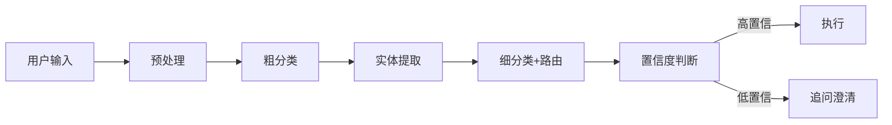
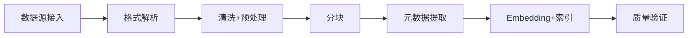
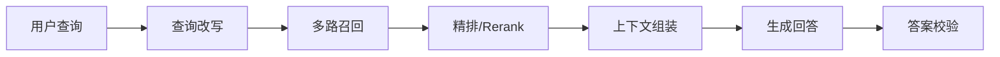

# 简历项目拷打：面试官追着你的 Agent 项目问到底

八股题考的是你**知不知道**，项目拷打考的是你**做没做过**。

面试官拿着你的简历，从架构选型到线上效果，一层一层往下挖。回答得越泛，追问越狠；回答得越具体，面试官越满意。项目拷打没有标准答案——面试官听的不是“正确答案”，而是**你做决策的过程**：为什么选 A 不选 B？遇到问题怎么排查？效果不好怎么迭代？

本维度覆盖面试官针对 Agent 项目最常追问的 12 个方向。每道题的“新手答”是面试官一听就知道你没做过的典型回答，“高手答”是真正做过项目的人才说得出的深度。

**面试官识别假经验的三个信号**：
1. 只描述架构不描述决策——“我们用了 LangChain”但说不出为什么
2. 只有正面没有踩坑——真正做过的人一定遇到过问题
3. 回答和教程一模一样——真实项目永远比教程复杂

---


## 项目整体与选型

### Q：你的 Agent 项目有没有真正上线部署？线上效果怎么样？

> 来源：淘宝闪购 AI应用研发 一面

**新手答**：“做了一个 demo，效果挺好的，能完成基本的对话和工具调用。”

**高手答**：

上线了，部署在公司内部平台 / 云服务上，服务了 X 个用户。我从三个阶段讲：

**1. 部署方案**

后端用 FastAPI 做服务，模型调用走 API（GPT-4 / Claude），部署在容器化环境。核心考虑是**可观测性**——每次 Agent 调用链路都有完整的 trace，包括每步的 Prompt 输入、模型输出、工具调用参数和返回值。

**2. 线上效果**

上线后跟踪了几个核心指标：

| 指标 | 数值 | 说明 |
|------|------|------|
| 端到端任务完成率 | ~75% | 用户给出任务，Agent 不需要人工介入就完成的比例 |
| 平均工具调用次数 | 2.3 次/任务 | 简单任务 1 次，复杂任务可达 5-6 次 |
| 平均响应时间 | 4-8 秒 | 含模型推理 + 工具执行，流式输出让用户感知更快 |
| 用户满意度 | 中等偏上 | 简单任务满意度高，复杂多步任务容易出错 |

**3. 上线后的核心问题和迭代**

上线和 demo 最大的区别是**边界情况暴增**——用户的真实输入远比测试集复杂。我们主要做了三轮迭代：
- 第一轮：加了输入预处理和意图兜底，解决“模型不知道该干什么”的情况
- 第二轮：优化了工具调用的错误恢复，工具失败后 Agent 会尝试换一种方式而不是直接报错
- 第三轮：加了对话历史压缩，解决长对话后期 Agent 表现下降的问题

**差距在哪**：新手的回答停留在“做出来了”——面试官追一句“线上跑了多久？多少用户？遇到什么问题？”就答不上来。高手能说清楚部署方案、线上指标、迭代过程，展示的是**从 demo 到生产的完整工程经验**。面试官通过这道题判断你是“写了个脚本”还是“交付了一个系统”。

---

### Q：你的 Agent 项目用了什么框架？为什么选它？

> 来源：淘宝闪购 AI应用研发 一面

**新手答**：“用了 LangChain，因为最流行，社区资源多。”

**高手答**：

我的选择和理由分两种情况讲：

**如果用了 LangChain / LangGraph**：

选 LangChain 是因为项目初期需要快速验证——它的 Tool 抽象和 Memory 模块省了不少 boilerplate。但用到后期发现几个问题：
- **调试困难**：LangChain 的链式抽象层数多，出错时堆栈信息不直观，定位问题要逐层拆解
- **定制化成本高**：默认的 AgentExecutor 行为不完全符合业务需求，改写它比从头写还麻烦
- **版本迭代快**：API 变动频繁，升级要改大量代码

后来项目复杂度上来后，关键模块（工具调度、上下文管理）我们改成了自己实现，LangChain 只保留了 Embedding 和文档加载器。

**如果没用框架**：

没用 LangChain，主要三个原因：
1. **透明度**：Agent 的核心循环（推理→工具调用→结果整合）代码量不大，自己写更可控
2. **调试**：自己实现的代码，每一步的 Prompt 和响应都能直接打日志，不用穿透框架抽象
3. **灵活性**：我们的工具调用逻辑需要自定义的重试策略和错误恢复，框架的默认行为反而是限制

核心模块（Prompt 管理、工具注册、Agent 循环）大概 500-800 行代码，维护成本比依赖一个重框架低。

**差距在哪**：新手选框架没有理由，或者理由是“最流行”。高手能说清楚框架的优缺点、在项目中的实际体验、以及做了哪些取舍。面试官考的不是“你用没用 LangChain”，而是**你有没有能力评估技术选型的 trade-off**。回答“没用框架”不丢分，回答“用了但说不出为什么”才丢分。

**追问：出于安全合规考量，开源方案和闭源 SDK 怎么选？**

> 来源：淘宝闪购 Agent 一面（二面追问）

这道追问的核心是**框架选型的安全维度**，面试官想听到你不只考虑功能，还考虑合规：

| 维度 | 闭源 SDK（如 OpenAI Agents SDK） | 开源框架（如 LangGraph、AutoGen） |
|------|----------------------------------|----------------------------------|
| 工具编排稳定性 | 高，官方维护 | 取决于社区活跃度 |
| 数据合规 | 数据经第三方 API，需评估出域风险 | 私有化部署，数据不出域 |
| 可审计性 | 黑箱，调用链路不透明 | 源码可审计，行为可追溯 |
| 定制灵活度 | 受 SDK 接口限制 | 可深度定制 |

**关键态度**：在企业生产环境中，应**优先评估开源/私有化部署方案**以满足数据不出域要求。用闭源 SDK 做 POC 验证没问题，但上线前必须过合规评审。面试官认可的不是“选了什么”，而是“我知道它的局限在哪”。

---


## 意图识别与工具设计

### Q：意图识别模块具体怎么做的？

> 来源：淘宝闪购 AI应用研发 一面

**新手答**：“用 Prompt 让模型判断用户意图，分成几个类别。”

**高手答**：

意图识别不是一步分类，而是一个多阶段的管线：



**1. 预处理**

先做输入规范化——去掉无意义的口语词、修正明显的错别字、提取关键词。这一步不用模型，用规则就行，成本低且稳定。

**2. 粗分类**

把用户意图分成 3-5 个大类（比如：查询类、操作类、闲聊类、投诉类）。粗分类可以用轻量模型或者 few-shot Prompt，目标是**快速缩小范围**而不是精准分类。

**3. 实体提取**

从用户输入中提取关键实体——时间、地点、对象、数量等。实体是后续工具调用的参数来源。我用的是 Prompt + JSON Schema 约束，让模型输出结构化的实体信息。

**4. 细分类 + 路由**

在粗分类的基础上，结合提取到的实体做细粒度分类，决定调用哪个工具或走哪条处理链路。

**5. 置信度判断**

关键设计：当模型对意图分类的置信度低于阈值时，**不硬猜，而是追问用户**。比如用户说“帮我看看那个”，与其猜“那个”是什么，不如问“您是想查看订单还是商品信息？”。

**踩过的坑**：最初没做粗分类，直接让模型做细粒度分类，意图类别多了之后准确率明显下降。加了两级分类后，整体准确率从 ~70% 提升到 ~85%。

**差距在哪**：新手把意图识别当成“一个 Prompt 搞定”的单步操作。高手展示了多阶段管线——预处理→粗分类→实体提取→细分类→置信度兜底，每个阶段有明确的输入输出。面试官考的是你能不能把一个看似简单的模块拆解成工程化的管线。

---

### Q：你的 Agent 有哪些工具？工具是怎么设计的？

> 来源：淘宝闪购 AI应用研发 一面

**新手答**：“有搜索工具、数据库查询工具、计算工具，用 function calling 调用。”

**高手答**：

工具设计不只是“列清单”，更重要的是**设计原则和演进过程**。

**工具清单和分类**：

| 类别 | 工具 | 说明 |
|------|------|------|
| 信息检索 | 知识库搜索、网络搜索 | 从向量数据库或外部搜索引擎获取信息 |
| 数据操作 | 数据库查询、文件读写 | 对结构化数据做 CRUD |
| 计算处理 | 代码执行、数学计算 | 需要精确计算的场景，不让模型心算 |
| 外部集成 | API 调用、消息通知 | 和外部系统交互 |

**设计原则**：

1. **单一职责**：每个工具只做一件事。最初我把“搜索+摘要”放在一个工具里，后来发现模型经常在不需要摘要时也触发摘要逻辑，拆成两个工具后调用准确率明显提升
2. **描述即文档**：工具的 description 是模型选择工具的唯一依据，写得不好模型就选错。我花了大量时间迭代工具描述——不只写“做什么”，还写“什么时候用”和“什么时候不用”
3. **参数最小化**：能从上下文推断的参数不暴露给模型。参数越少，模型填错的概率越低
4. **输出结构化**：工具返回值用统一的 JSON 格式，包含 status、data、error_message 三个字段，方便模型理解执行结果

**演进过程**：

最初只有 3 个工具，后来根据用户真实使用场景逐步扩展到 8 个。每加一个工具都要验证：不会导致已有工具的调用准确率下降。

**差距在哪**：新手在列清单——“有搜索、有查询、有计算”。高手在讲设计思考——为什么这样拆分、描述怎么写、参数怎么精简、工具之间怎么不冲突。面试官考的是**工具设计的工程思维**，不是工具数量。

---

### Q：工具调用时怎么保证参数提取准确？

> 来源：淘宝闪购 AI应用研发 一面

**新手答**：“在 Prompt 里写清楚参数格式，让模型按格式输出。”

**高手答**：

参数提取准确性是工具调用最容易出问题的环节。我从四个层面保障：

**1. Schema 约束（第一道防线）**

用 JSON Schema 定义每个工具的参数类型、必填/选填、枚举值范围。模型通过 function calling 接口输出参数，格式层面由 API 保证。但 Schema 只能约束格式，不能约束语义——模型可能输出一个格式正确但值错误的参数。

**2. 描述 + Few-shot（语义引导）**

每个参数的 description 不只写类型说明，还写**典型值示例**。比如 date 参数不只写“日期”，还写“格式为 YYYY-MM-DD，如 2024-03-15”。关键参数在系统 Prompt 里放 2-3 个 few-shot 示例，让模型看到“用户说X → 参数应该填Y”的映射关系。

**3. 默认值 + 类型转换（容错处理）**

对于非关键参数，设置合理的默认值——模型没提取到就用默认值，避免因为一个可选参数提取失败导致整个工具调用失败。对于类型不匹配的情况（比如模型输出字符串“10”但参数要求整数），在调用层做自动类型转换。

**4. 二次确认（高风险操作）**

对于不可逆操作（删除、支付、发送），即使参数提取成功，也会让 Agent 把关键参数复述给用户确认后再执行。这不只是安全措施，也是参数校验的最后一道防线。

**差距在哪**：新手只想到 Prompt 层面的约束——这是最弱的防线。高手构建了四层保障体系：Schema 约束→描述引导→容错处理→二次确认，从格式、语义、容错、安全四个层面逐层递进。面试官考的是你有没有把“参数可能出错”当成工程问题系统性解决。

---

### Q：怎么提升工具调用的正确率？

> 来源：淘宝闪购 AI应用研发 一面

**新手答**：“优化 Prompt，让模型更准确地选择工具。”

**高手答**：

工具调用正确率包含两个维度：**选对工具**和**填对参数**。参数准确性前面讲了，这里聚焦“选对工具”：

**1. 工具描述迭代**

工具描述是模型选择工具的唯一信号。我的经验是：好的描述不只说“这个工具做什么”，更要说**“什么场景用它”和“什么场景不要用它”**。

比如搜索工具的描述：
```text
✗ "搜索知识库"
✓ "当用户提问涉及产品信息、政策规定等事实性问题时，搜索内部知识库获取准确信息。
   不要用于：闲聊、数学计算、用户明确要求你自己回答的情况"
```

**2. 工具路由层**

工具数量超过 5-6 个后，直接让模型从所有工具中选，准确率会下降。解决方案是加一个路由层——先判断任务类别，再只展示该类别下的 2-3 个候选工具。

**3. 置信度 + 兜底**

让模型在选择工具时输出置信度。低于阈值时不直接调用，而是追问用户或走兜底逻辑（比如直接用模型自身知识回答）。

**4. 评测驱动优化**

建了一个工具调用的评测集——50-100 条标注数据，标注了“用户输入→应该调哪个工具→参数应该是什么”。每次修改工具描述或 Prompt 后跑一遍评测，确保改进不是“按下葫芦浮起瓢”。

**差距在哪**：新手只有一招“优化 Prompt”。高手从描述迭代、路由分层、置信度兜底、评测闭环四个维度系统提升——这不是一次性优化，而是一个持续迭代的工程体系。面试官考的是你有没有**数据驱动的优化方法论**。

---


## 知识库与检索

### Q：知识库是怎么构建的？

> 来源：淘宝闪购 AI应用研发 一面

**新手答**：“把文档切块，用 Embedding 模型转成向量，存进向量数据库，检索的时候做相似度匹配。”

**高手答**：

知识库构建是一个完整的数据工程管线，不只是“切块+向量化”：



**1. 数据源管理**

知识库的数据来源不止一种——可能有 PDF 文档、内部 Wiki、数据库表、FAQ 列表。每种数据源需要不同的接入方式和更新策略。我做了一个统一的数据接入层，支持增量更新（文档有修改时只更新变更部分，不全量重建索引）。

**2. 格式解析**

不同格式的解析难度差异很大：
- 纯文本 / Markdown：直接处理，最简单
- PDF：需要 layout-aware 解析，保留标题层级和段落结构
- 表格（Excel / CSV）：要把二维表格转成模型能理解的文本描述
- 图片：用多模态模型提取图片内容描述

**3. 清洗 + 预处理**

去除无意义的内容（页眉页脚、重复段落、格式噪声），统一编码和格式。这一步看起来不起眼，但直接影响检索质量——垃圾进去，垃圾出来。

**4. 分块（详见下一题）**

**5. 元数据提取**

每个 chunk 除了内容本身，还标注了来源文档、章节标题、创建时间、文档类型等元数据。检索时可以用元数据做过滤（比如只搜最近一年的文档），也能在回答中标注信息来源。

**6. 质量验证**

构建完成后，用一组预设的测试查询跑一遍检索，验证能否召回预期的文档。这相当于知识库的“单元测试”。

**差距在哪**：新手描述的是最简流程——切块→向量化→存储。高手展示了完整的数据工程管线——数据源管理、格式解析、清洗、分块、元数据、质量验证，每个环节都影响最终检索效果。面试官考的是你有没有**端到端的数据工程思维**。

---

### Q：分块策略是怎么设计的？

> 来源：淘宝闪购 AI应用研发 一面 【腾讯AI应用开发一面追问：分块方案选型理由与指标量化】

**新手答**：“按 512 个 token 固定切分，块之间有 50 token 的重叠。”

**高手答**：

固定长度切分是最基础的方案，但真实文档用单一策略效果很差。我针对不同内容类型设计了不同的分块策略：

**1. 结构化文档（有标题层级的）**

按标题层级切分——每个二级标题下的内容作为一个 chunk。如果某个章节特别长，再按段落拆分。优势是每个 chunk 语义完整，不会把一个概念切成两半。

**2. 纯文本（无明显结构的）**

用滑动窗口切分，但不是固定 token 数，而是**按语义边界**——尽量在句号或段落结束处切分。块大小控制在 300-500 token，重叠 50-100 token。

**3. FAQ / 问答对**

每个 Q&A 对作为一个独立 chunk。这类内容天然就是自包含的，不需要额外切分。

**4. 表格**

表格不切分——每个表格作为整体保留，附带表头信息和所在章节的上下文描述。表格被切分后几乎不可用。

**关键经验**：

chunk 大小不是越小越好，也不是越大越好：
- 太小：语义不完整，检索到了但信息不够用，模型还得“脑补”
- 太大：检索精度下降，且占用上下文窗口

我最终的经验值是 300-500 token，但更重要的是**语义完整性**——宁可多给 50 token 也不要把一个完整论述切成两半。

**差距在哪**：新手用一刀切策略。高手针对不同内容类型（结构化文档、纯文本、FAQ、表格）设计了不同的分块方案，且理解 chunk 大小和语义完整性之间的 trade-off。面试官考的是你有没有**因材施策的工程判断力**。

**追问：overlap 参数的核心作用是什么？分片尺寸和上下文完整性怎么权衡？**

> 来源：蚂蚁 AI应用开发 二面

**overlap 的作用**：相邻 chunk 之间重叠一段内容，防止关键信息恰好落在切分边界上。比如一个完整的因果关系“因为A所以B”，如果 A 在 chunk1 末尾、B 在 chunk2 开头，没有 overlap 就会导致两个 chunk 都不包含完整的因果链。

**尺寸权衡的核心矛盾**：
- chunk 太小（<200 token）→ 语义不完整，检索到了但信息不够用
- chunk 太大（>1000 token）→ 检索精度下降（噪声多），且占用更多上下文窗口
- overlap 太大 → 索引膨胀，相似 chunk 过多导致去重困难
- overlap 太小 → 边界信息丢失

**实践经验值**：chunk 300-500 token + overlap 10%-20%（即 30-100 token）是多数场景的平衡点。但更重要的是按语义边界切分而非固定 token 数——宁可 chunk 大一点也不要把一个完整段落切成两半。

---

### Q：知识检索时如何提升模型回答正确率？

> 来源：淘宝闪购 AI应用研发 一面

**新手答**：“多召回几条相关文档，让模型参考更多信息。”

**高手答**：

“多召回几条”可能反而降低正确率——无关信息越多，模型越容易被干扰。提升回答正确率需要在检索全链路上优化：



**1. 查询改写**

用户的原始查询往往不适合直接做检索——口语化、信息不完整、或者一句话包含多个意图。改写策略：
- 关键词提取：从口语化表达中抽出核心检索词
- 查询扩展：补充同义词或相关概念
- 多角度改写：一个问题改写成 2-3 个不同表述，并行检索后合并结果

**2. 多路召回**

不只依赖向量检索——同时用 BM25 做关键词检索，两路结果用 RRF（Reciprocal Rank Fusion）合并。向量检索擅长语义匹配，BM25 擅长精确匹配，互补效果明显。

**3. 精排 / Rerank**

召回的 Top-20 结果用 Rerank 模型（如 bge-reranker）重新排序，取 Top-3 到 Top-5 送给生成模型。Rerank 的准确率远高于 Embedding 的初筛。

**4. 上下文组装**

不是把召回结果拼在一起就完了。需要：
- 去重：多路召回可能有重复结果
- 排序：最相关的放最前面（模型对开头信息的注意力更高）
- 截断：控制总上下文长度，避免超出模型有效处理范围

**5. 答案校验**

生成回答后，检查答案是否有检索结果支撑——如果模型说了一个检索结果里没有的“事实”，大概率是幻觉。可以加一个轻量的验证步骤，或者在 Prompt 里要求模型标注信息来源。

**差距在哪**：新手只想到“多召回”——这是最直觉但往往适得其反的策略。高手展示了检索全链路优化——查询改写→多路召回→精排→上下文组装→答案校验，每个环节都有可测量的提升。面试官考的是你对 RAG 系统的**全链路优化能力**。

---

### Q：构建知识库时如何解析上传的表格或图片文件？

> 来源：淘宝闪购 AI应用研发 一面

**新手答**：“用 OCR 识别文字，然后和普通文本一样处理。”

**高手答**：

表格和图片是知识库构建中最难处理的两类文件，简单 OCR 远远不够。

**表格解析**：

表格的核心难点是**结构信息**——行列关系、合并单元格、表头嵌套。处理流程：

1. **格式识别**：Excel/CSV 直接读取结构化数据；PDF 中的表格需要用表格检测模型（如 Table Transformer）先定位表格区域
2. **结构提取**：识别行列关系，处理合并单元格和多级表头
3. **文本化**：把二维表格转成模型能理解的文本。两种方案：
   - Markdown 表格格式（适合简单表格）
   - 逐行描述，如“产品A的价格是99元，库存500件”（适合复杂表格）
4. **保留上下文**：表格不能脱离上下文——在表格前后附加所在章节的标题和描述

**图片解析**：

1. **分类**：先判断图片类型——流程图、数据图表、截图、照片
2. **多模态理解**：用多模态模型（GPT-4V / Claude Vision）生成图片描述。关键是 Prompt 设计——不是“描述这张图”，而是“提取这张图中的关键信息和数据”
3. **结构化输出**：如果是图表，要求模型提取具体数据点；如果是流程图，要求模型提取节点和边的关系

**实际踩坑**：
- PDF 中的表格是最痛苦的——扫描件里的表格 OCR 识别率低，且行列对齐经常出错
- 图片描述的质量高度依赖 Prompt——同一张图，好 Prompt 和差 Prompt 的输出质量天差地别
- 表格文本化后 token 消耗大，一个复杂表格可能占 500+ token

**差距在哪**：新手一句“用 OCR”就结束了。高手分别讲了表格和图片的完整处理管线，包括结构提取、文本化策略、上下文保留，且提到了实际遇到的问题。面试官考的是你有没有处理过**非纯文本数据**的真实经验。

**追问：跨页表格解析时，怎么保障表格的语义完整性？**

> 来源：蚂蚁 AI应用开发 二面（MinerU 项目深挖）

跨页表格是 PDF 解析中最棘手的问题——物理分页把一个语义完整的表格切成了两半。核心思路：

1. **跨页检测**：当页尾出现表格行但没有表格结束标志（如合计行或分隔线），且下一页开头也是表格行时，判定为跨页表格
2. **表头续接**：下半页通常没有重复表头——需要把上半页的表头信息自动拼接到下半页的数据行前面，恢复完整的行列语义
3. **合并验证**：合并后检查列数是否一致、数据类型是否匹配，防止误合并

MinerU 等工具的做法是先用版面分析模型定位表格区域，再用跨页检测逻辑判断是否需要合并。关键是**版面分析的准确性**——如果表格区域识别错误，后续所有处理都会出错。

---


## 架构与性能优化

### Q：你的系统有没有用到 ReAct 模式？怎么用的？

> 来源：淘宝闪购 AI应用研发 一面

**新手答**：“用了 ReAct，就是让模型先 Thought 再 Action 再 Observation，循环执行。”

**高手答**：

用了，但不是所有模块都用 ReAct，哪里用、哪里不用是有考量的。

**用了 ReAct 的地方——开放性任务处理**：

用户提的需求不确定需要几步、调用哪些工具时，用 ReAct 模式让 Agent 自主决策。具体实现：

```text
循环（最多 N 轮）：
  1. 模型输出 Thought（分析当前状态、决定下一步）
  2. 模型输出 Action（选择工具 + 参数）
  3. 系统执行工具，返回 Observation
  4. 将 Observation 追加到上下文，回到 1
  5. 模型判断任务完成 → 输出最终回答
```

**没用 ReAct 的地方——确定性流程**：

比如“查询订单状态”这种流程固定的任务，直接用硬编码的流程：解析订单号→调数据库→格式化返回。用 ReAct 反而引入不确定性——模型可能先搜索、再查数据库、再搜索一次，白白消耗 token。

**做了哪些改造**：

1. **最大轮次限制**：防止 Agent 陷入循环。超过 N 轮（我设的 5 轮）强制退出，给用户返回“任务太复杂，请拆分”的提示
2. **Thought 压缩**：每轮的 Thought 会累积在上下文里，轮次多了 token 消耗大。我在第 3 轮后对之前的 Thought 做摘要压缩
3. **Observation 截断**：工具返回结果太长时（比如搜索返回 10 条结果），只保留前 3 条最相关的摘要，避免上下文爆炸

**差距在哪**：新手能复述 ReAct 的定义——Thought-Action-Observation。高手能说清楚在系统的哪些模块用了 ReAct、哪些没用、为什么这样分、做了哪些工程化改造。面试官考的是你对 ReAct 的理解是**停留在论文层面还是有落地经验**。

---

### Q：怎么提升模型回答的性能？

> 来源：淘宝闪购 AI应用研发 一面

**新手答**：“用更好的模型，或者加缓存。”

**高手答**：

性能优化分两个维度：**响应速度**和**回答质量**。面试官问的“性能”通常两个都包含。

**响应速度优化**：

| 策略 | 效果 | 适用场景 |
|------|------|---------|
| 流式输出 | 用户感知延迟从 5s 降到 <1s | 所有对话场景 |
| 语义缓存 | 相似问题命中缓存，响应 <100ms | 高频重复查询 |
| 模型路由 | 简单问题用小模型，复杂问题用大模型 | 混合难度场景 |
| 并行工具调用 | 多个独立工具同时执行 | 多工具任务 |
| Prompt 精简 | 缩短系统 Prompt，减少输入 token | 所有场景 |

**语义缓存**是我做的最有效的优化——很多用户的问题本质上是相同的，只是表述不同。用 Embedding 做相似度匹配，相似度超过阈值直接返回缓存的回答，省掉模型调用。

**模型路由**也很关键——简单的打招呼、FAQ 类问题用小模型（成本低、速度快），复杂的多步推理任务才用大模型。路由本身用一个轻量的分类器实现。

**回答质量优化**：

1. **Prompt 迭代**：这是持续的工作。每次发现 bad case，分析是 Prompt 不清晰还是检索不准，针对性调整
2. **检索优化**：回答质量很大程度取决于检索质量（前面几题已详细讲了）
3. **输出格式约束**：对于需要结构化回答的场景（如对比分析、步骤指引），在 Prompt 里要求特定输出格式，避免模型“自由发挥”出不可控的结果

**差距在哪**：新手只想到一两个点（换模型、加缓存）。高手从响应速度和回答质量两个维度展开，列出了流式输出、语义缓存、模型路由、并行调用、Prompt 精简等具体策略，且能说清楚每个策略的效果和适用场景。面试官考的是你有没有**系统性的性能优化思维**。

---

### Q：LangGraph 中的 State 怎么定义和流转？节点多了怎么防止状态膨胀？

> 来源：蚂蚁 AI应用开发 二面

**新手答**：“State 就是一个字典，每个节点往里面加数据。”

**高手答**：

**State 的定义逻辑**：

LangGraph 的 State 是一个 TypedDict（或 Pydantic Model），定义了图执行过程中所有节点共享的状态结构。每个节点接收当前 State 作为输入，输出 State 的更新部分——框架自动做合并。

```text
State = {messages: [], current_step: str, tool_results: {}, user_intent: str}
Node_A(state) → {"current_step": "search", "tool_results": {"query": "..."}}
→ 框架合并后传给下一个节点
```

关键设计：State 的字段用 **Annotated 类型 + Reducer 函数**控制合并策略。比如 `messages` 字段用 `add` reducer（追加），`current_step` 用默认 reducer（覆盖）。

**状态膨胀的防治**：

节点多了之后，State 对象容易膨胀——每个节点都往里塞数据，最终 State 变成一个巨大的字典，内存和序列化成本都很高。

1. **分层 State**：把 State 拆成全局 State 和节点局部 State。全局 State 只存跨节点共享的核心信息（如 messages、current_step），节点内部的中间计算结果用局部变量，不写入全局 State
2. **及时清理**：工具调用的原始返回值处理完后，只保留摘要或结论，不保留原始数据。可以在节点末尾显式清理不再需要的字段
3. **Checkpoint 策略**：LangGraph 内置 Checkpoint 机制。对于长流程，定期保存 Checkpoint 到外部存储，清理内存中的历史 State。需要回溯时从 Checkpoint 恢复

**多轮对话→用户画像的实现路径**：

在 Agent 系统中，多轮对话信息提炼为结构化用户画像是记忆系统的关键能力。实现路径：

1. **实体提取**：每轮对话后，用轻量 Prompt 提取用户提到的偏好、约束、历史行为等结构化信息
2. **画像合并**：新提取的信息与已有画像做合并——新信息覆盖旧信息（如地址变更），偏好类信息做增量追加
3. **入库持久化**：画像存入用户维度的数据库（PostgreSQL / MongoDB），按 user_id 索引，每次会话开始时加载到 State 中

**差距在哪**：新手只知道 State 是字典。高手展示了 Reducer 合并策略、状态膨胀防治（分层+清理+Checkpoint）、以及用户画像的完整实现路径。面试官考的是你对有状态 Agent 框架的工程理解深度。

---

### Q：你的 Agent 系统还有哪些未充分优化的地方？你的改进路线图是什么？

> 来源：淘宝闪购 Agent 一面

**新手答**：“目前已经比较完善了，主要是一些小bug需要修。”

**高手答**：

这道题面试官考的是**自我认知深度**——你能不能准确识别系统短板，并给出有优先级的改进方案。最忌讳说“没什么大问题”，因为面试官一定比你更清楚哪里有问题。

**常见的未优化方向**（按优先级排序）：

**1. 缺闭环反馈机制（最关键）**

当前大部分 Agent 系统是“开环”的——任务完成后没有量化评估，不知道做得好不好。改进方案：
- 基于任务完成率的自动评分
- 用 DPO/PPO 微调 planner，让规划器从历史成功/失败中学习
- 多版本 Agent 沙盒 ELO 竞争选优

**2. 缺量化评测体系**

离线评测不够，需要：
- 历史任务回测 + 仿真环境双验证
- 分维度评测（规划准确率、工具选择正确率、输出质量）
- 回归测试：每次改动后自动跑 baseline 对比

**3. 缺元认知能力**

Agent 不知道自己“不知道”——对低置信度任务没有主动上报机制。改进：加入自评分模块，置信度低于阈值时主动暂停并请求人工介入。

**回答策略**：先承认 1-2 个真实短板（表明你深入思考过），再给出具体改进方案和优先级排序（表明你有行动力）。坦诚讲一个 60 分但你能说清楚为什么的系统，比吹一个 90 分但经不起追问的系统强得多。

**差距在哪**：新手要么说“没什么问题”（缺乏自我认知），要么列一堆问题但没有优先级（缺乏判断力）。高手能准确识别核心短板，按影响优先级排序，并给出可落地的改进路线图。面试官考的不是你的系统有多完美，而是你对系统的**反思深度**和**改进能力**。

---

### Q：你的 Agent 和别人开发的相比，核心差异是什么？

> 来源：淘宝闪购 Agent 一面

**新手答**：“我用了更好的模型，效果更好。”

**高手答**：

当大家用的模型和框架趋同时，差距体现在**工程打磨的细节**：

**1. 严格的 Function Schema 校验**

不依赖模型自觉遵守格式——在工具调用前加一层 schema 校验，格式不合规直接拒绝并要求模型重新生成。这一层减少了约 15-20% 的格式错误。

**2. CLI 封装原子化操作**

把常用的多步操作封装成单条 CLI 命令——模型一次调用完成，而不是分 3-5 步分别调用。效果：token 消耗降低约 30%，错误传播链缩短。

**3. 针对业务裁剪工具集**

不用 MCP 通用协议暴露全量工具，而是按任务类型预筛——每个任务只暴露 5-8 个相关工具，而不是 50+ 个全量工具。效果：平均工具调用轮次从 8 降至 4，选错工具的概率大幅下降。

**回答框架**：

```text
差异 = 不是"用了什么" × 而是"怎么用"
     = Schema 校验减错误 + CLI 封装降 token + 工具裁剪提准确率
```

**差距在哪**：新手用模型和框架的选择来回答差异。高手用工程打磨细节来回答——Schema 校验、CLI 封装、工具集裁剪。面试官考的是你有没有超越“调 API”层面的工程能力，以及你能不能用数据量化差异（“降低 30%”“从 8 降至 4”）。

---

## 这类题的答题模式

项目拷打题的核心是**用具体细节证明你做过**：

```text
1. 不要泛泛而谈——给出具体的技术选型、数值、阶段
2. 主动暴露踩坑——真正做过的人不可能一帆风顺
3. 讲演进过程——"最初用了A，发现B问题，改成了C"
4. 量化效果——"准确率从70%提升到85%"比"效果有提升"有力100倍
```

每道项目题都可以用这个框架回答：

```text
方案选型 → 实现细节 → 遇到的问题 → 怎么解决 → 最终效果
```

**关键心态**：项目拷打不是要你证明项目有多完美，而是证明**你在这个项目中有深度思考和真实贡献**。坦诚地讲一个做了 60 分但你能说清楚为什么的项目，比吹一个 90 分但经不起追问的项目强得多。

---

## 推荐阅读

项目拷打题的知识基础，可以在以下维度文章中深入学习：

- 工具设计相关 → [工具管理：参数校验、工具路由与百级工具库](../02-tool-management/index.html)
- 知识库和检索相关 → [RAG 与检索系统：从 chunk 设计到多路召回](../09-rag-retrieval/index.html)
- 架构选型相关 → [架构选型：ReAct、Plan-and-Execute 与 ToT 怎么选](../01-architecture-design/index.html)
- 工程化问题相关 → [工程化踩坑：死循环、状态丢失与成本控制](../07-engineering-pitfalls/index.html)
