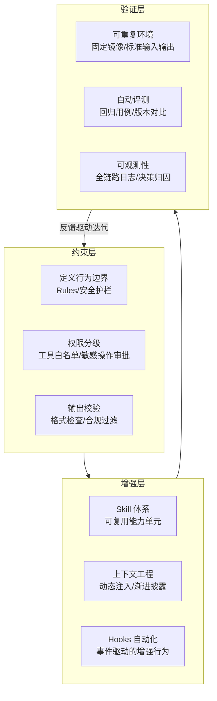
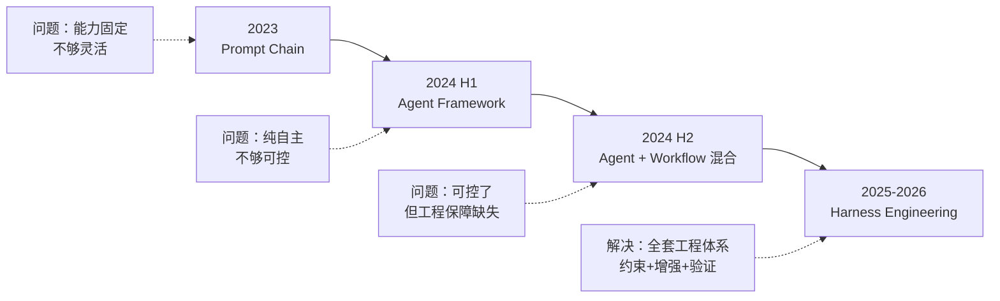
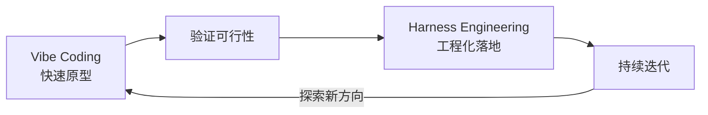
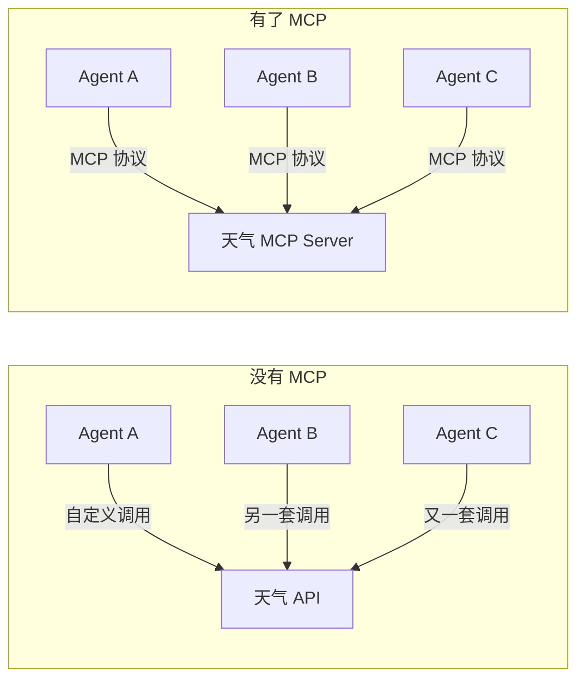
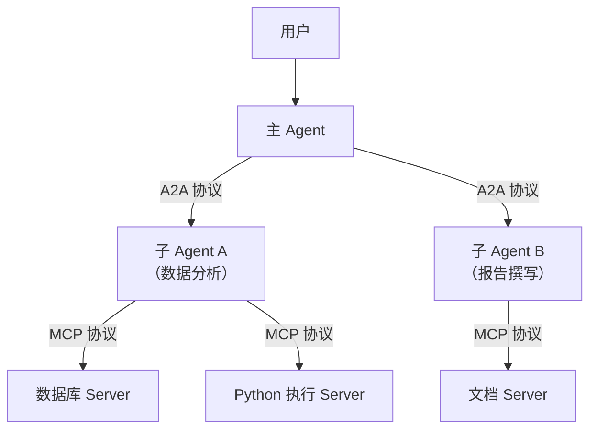
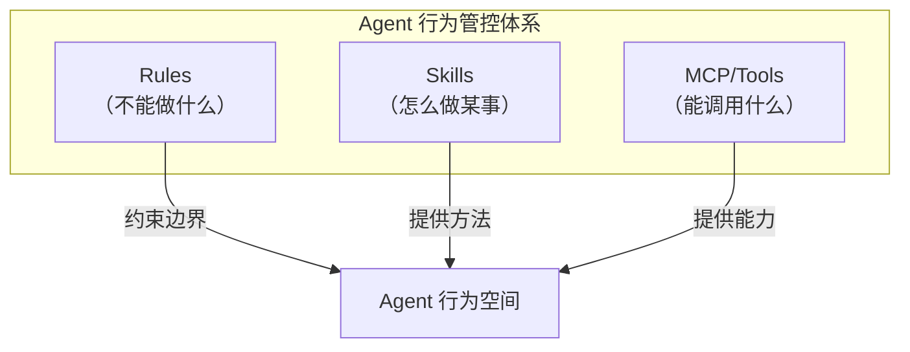
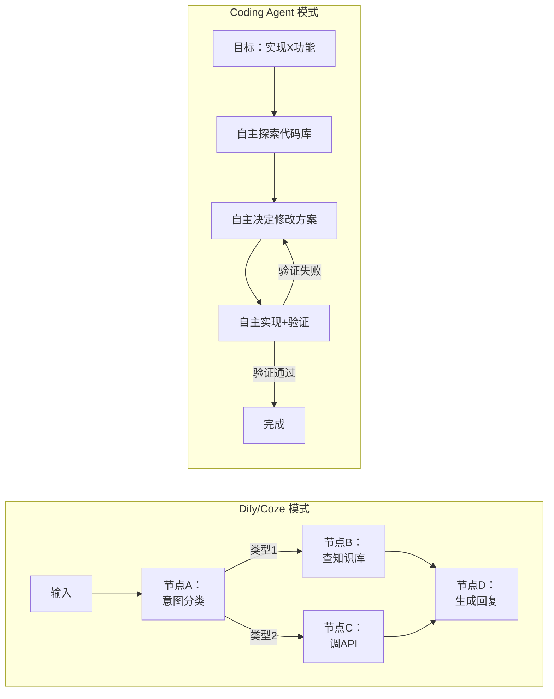

# 概念考察：Harness Engineering、Context Engineering 与前沿范式

2026 年面试出现了一类新题型：面试官直接问“你了解 X 吗？”——不考具体实现，考的是**你对 Agent 领域前沿概念的认知深度和独立思考**。

这类题的特点是：答浅了（“听说过”）等于没答，答深了需要展示**概念的本质、演进逻辑、与相关概念的区别、以及你的判断**。

---


## Harness Engineering

### Q：Harness Engineering 是什么？如果让你构建一个 Harness 体系，你会做哪些工作？

> 来源：快手 AI业务应用设计开发 【字节后端开发日常实习二面同题：“harness有了解吗”】【腾讯AI后端开发一面同题：“了解harness嘛，具体是做什么的”】【美团Agent方向面经同题：“harness工程了解吗？主要内容？项目里怎么用？还能补什么？”】【社招五年Go面经同题：“了解harness engineer吗”】【腾讯音乐暑期+日常同题：“有了解过Harness么？有用过Harness么？”】

**新手答**：“好像是跟测试框架有关的东西？不太了解。”

**高手答**：

Harness 的原意是“线束”——把散乱的线缆约束成有序的束。在 Agent 工程中，**Harness Engineering 是用工程化手段约束和增强 Agent 行为的系统方法论**。核心思想：模型是引擎，Harness 是方向盘、安全带和仪表盘。

具体来说，Harness 包含三层：

| 层次 | 职责 | 典型实现 |
|------|------|---------|
| **约束层** | 告诉 Agent 什么能做、什么不能做 | Rules（CLAUDE.md）、安全护栏、权限白名单 |
| **增强层** | 给 Agent 提供可复用的能力和知识 | Skills、动态工具注册、上下文模板 |
| **验证层** | 评估 Agent 行为是否符合预期 | 可重复评测环境、自动打分、日志采集、回归测试 |

**如果让我从零构建 Harness 体系，关键工作**：



**验证层是最容易被忽视但最关键的**——没有可重复的评测环境，你不知道 Prompt 改动是变好了还是变差了。我们项目里用 Harness 做三件事：① 回归固定用例（确保改动不破坏已有能力）；② 对比 Prompt/模型版本（量化改进效果）；③ 日志归因（失败时精准定位是约束不够、工具出错、还是模型幻觉）。

**可以补充的方向**：更接近真实业务的“半合成”评测环境（不是纯 mock，而是真实 API + 可控输入）、对抗性用例（测试安全边界）、成本与性能的持续监控。

**差距在哪**：新手不了解这个概念，或只知道“跟测试有关”。高手能讲清 Harness 的三层结构（约束/增强/验证）和核心价值（不是规定 Agent 怎么做，而是确保它在安全范围内自主做事），且能给出具体的构建方案。面试官考的是你对“Agent 工程化”这件事有多深的理解——是只会调 Prompt，还是能搭建完整的工程保障体系。

---

### Q：Prompt Engineering、Context Engineering、Harness Engineering 三者有什么区别？

> 来源：阿里淘天 Agent开发 日常实习一面

**新手答**：“Prompt Engineering 是写提示词，其他两个不太清楚。”

**高手答**：

这三个“工程”代表了 Agent 开发方法论的**三代演进**——不是替代关系，而是逐层递进：

| 维度 | Prompt Engineering | Context Engineering | Harness Engineering |
|------|-------------------|--------------------|--------------------|
| **核心关注** | 怎么写指令让模型听话 | 怎么给模型恰好的信息 | 怎么用工程体系约束和增强模型 |
| **操作对象** | System Prompt 文本 | 整个上下文窗口的内容编排 | 模型之外的全套基础设施 |
| **典型手段** | Few-shot、CoT、角色设定 | 动态注入、记忆召回、渐进披露、工具描述编排 | Rules、Skills、Hooks、评测管线、安全护栏 |
| **解决的问题** | 模型不知道该做什么 | 模型缺少做事需要的信息 | 模型做事时缺少约束和保障 |
| **类比** | 写说明书 | 准备材料和工具 | 搭建整条生产线 |

**为什么会演进**：

**Prompt Engineering 的瓶颈**：模型能力提升后，精心调优的 Prompt 不再是瓶颈——模型已经“聪明到不需要手把手教”。真正的瓶颈变成了“给它什么信息”。

**Context Engineering 的瓶颈**：即使上下文信息完美，模型仍然会犯错——选错工具、幻觉、死循环、违反安全规则。纯靠上下文无法解决“如何保障行为正确性”的问题。

**Harness Engineering 的价值**：把保障能力从模型内部（靠 Prompt 约束）转移到模型外部（靠工程体系保障）。模型负责“思考和执行”，Harness 负责“约束、增强和验证”。

**一句话总结**：Prompt Engineering 解决“说什么”，Context Engineering 解决“给什么”，Harness Engineering 解决“怎么保障”。

**差距在哪**：新手只知道 Prompt Engineering，对后两者模糊。高手能清晰区分三者的层次关系——不是并列的三种方法，而是逐代演进的三种范式，解决的问题层级越来越高。面试官考的是你对 Agent 工程方法论的全景认知。

**追问变体**：加入 Loop Engineering 作为第四层（来源：成都某中厂 Agent 产品开发实习）——Loop Engineering 指的是让 Agent 在执行循环中自我纠错、反复迭代直到满足退出条件的工程实践，是 Harness 之上更高层的自主性设计。

---

### Q：讲一讲 Agent 的发展路线——从以前的架构到现在的 Harness Engineering

> 来源：阿里淘天 AI应用开发 暑期二面

**新手答**：“以前是 ReAct，现在有了 MCP 和多 Agent。”

**高手答**：

Agent 架构的演进可以分为四个阶段，每个阶段解决的核心问题不同：



**阶段 1：Prompt Chain（2023）**

代表：LangChain 的 SequentialChain、Flowise 等。本质是预定义的流程图——每个节点做一件事，按固定顺序执行。优点是可预测，缺点是不灵活——遇到预期之外的情况无法应对。

**阶段 2：Autonomous Agent（2024 上半年）**

代表：AutoGPT、BabyAGI、早期 ReAct Agent。让模型自主规划和执行，不限制路径。优点是灵活，缺点是极度不可控——死循环、幻觉、胡乱调工具。大量团队发现“Demo 很惊艳，上线就崩”。

**阶段 3：Workflow + Agent 混合（2024 下半年）**

代表：LangGraph 的状态机、Dify 的工作流。核心思想是“确定性环节用 Workflow 控制，不确定性环节嵌入 Agent 节点”。解决了可控性问题，但缺少系统性的工程保障——评测靠手动、约束写在 Prompt 里容易被忽略、没有持续验证机制。

**阶段 4：Harness Engineering（2025-2026）**

代表：Claude Code 的 Rules/Skills/Hooks 体系、企业级 Agent 平台。核心转变是**把 Agent 的保障能力从模型内部迁移到外部工程体系**：

- 约束不再写在 Prompt 里（容易被忽略）→ 用 Rules 和权限系统强制执行
- 能力不再硬编码 → 用 Skills 实现可复用、可组合、可热更新
- 质量不再靠手动检查 → 用持续评测管线自动验证
- 行为不再是黑盒 → 用全链路 Trace 实现可观测

**本质变化**：从“让模型更强”转向“让模型周围的工程体系更强”。模型能力是给定的（你不能改 GPT-4 的权重），但 Harness 是你能控制的——这才是工程师的主战场。

**差距在哪**：新手只能说出技术名词（ReAct、MCP），但说不清“为什么从 A 演进到 B”。高手能讲清每个阶段解决的问题和暴露的新瓶颈，形成“问题→解法→新问题→新解法”的递进逻辑。面试官考的是你对 Agent 技术演进有没有结构化的认知——不是背时间线，而是理解每一步“为什么”。

---

### Q：你的项目中体现了哪些 Harness Engineering 的思想？

> 来源：阿里国际 一面

**新手答**：“我用了 System Prompt 来约束模型行为，算 Harness 吗？”

**高手答**：

System Prompt 约束只是 Harness 最原始的形态。真正的 Harness Engineering 思想体现在**模型外部的工程保障是否系统化**。我的项目中有三个层面的体现：

**1. 约束层：行为边界不依赖 Prompt 遵循**

- 工具调用前有**参数校验中间层**——模型传的参数必须符合 JSON Schema，不符合直接拦截并给模型结构化错误信息，而不是让模型“自己注意”
- 敏感操作（删除数据、发送消息）有**人工确认门控**——不是在 Prompt 里写“重要操作要确认”，而是在代码层面强制拦截
- 执行有**硬性预算**——最大步数、最大 token 消耗、最大工具调用次数，超过直接终止

**2. 增强层：能力可复用且按需加载**

- 将常见任务的最佳实践抽象为 **Skill 文件**——新人接手项目不需要重新摸索“怎么做代码审查”或“怎么处理部署”，Skill 里有完整的步骤和约束
- 上下文采用**渐进式披露**——不是把所有信息塞给模型，而是先给摘要，需要时再展开细节
- 工具描述**动态精简**——根据当前任务只注入相关工具子集，而不是 100 个工具的描述全部塞进上下文

**3. 验证层：改动效果可量化**

- 维护了一个**核心评测集**（50+ 条覆盖主要场景的 case），每次改 Prompt 或切模型后必须跑回归
- 全链路**结构化日志**——每个决策节点（意图识别→规划→工具选择→执行→生成）都记录输入输出，失败时能精准归因
- 线上有**异常模式告警**——步数异常多、重复调用同一工具、输出过长等模式自动报警

**差距在哪**：新手把 Harness 等同于“写了 System Prompt”。高手能从约束/增强/验证三层展示自己项目中的工程化实践——不是“有没有用 Harness”的问题，而是“你的工程保障做到了什么程度”。面试官考的是你有没有系统性工程思维，以及能否把抽象概念落地到真实项目。

---


## Vibe Coding vs Harness

### Q：Vibe Coding 和 Harness，你更偏向哪种路线？为什么？

> 来源：字节 TikTok 实习后端AI开发 一面

**新手答**：“Vibe Coding 就是用 AI 写代码吧，Harness 我不太清楚。”

**高手答**：

这两个代表了 AI 辅助开发的**两种哲学**——不是非此即彼，而是适用于不同阶段和场景：

| 维度 | Vibe Coding | Harness |
|------|-------------|---------|
| **核心理念** | 人机协作靠“感觉”——快速生成、直觉验证 | 人机协作靠“约束”——结构化流程、工程化保障 |
| **开发方式** | 用自然语言描述意图，AI 生成，凭感觉判断对错 | 定义 Rules/Skills/评测，AI 在约束内执行 |
| **适合场景** | 原型验证、探索性开发、小工具 | 生产系统、团队协作、长期维护 |
| **核心优势** | 极高的开发速度、极低的启动成本 | 可复现、可审计、可持续迭代 |
| **核心风险** | 不可审计、不可复现、个人依赖 | 前期投入大、灵活性受限 |

**我的判断**：两者不是替代关系，而是**开发生命周期的不同阶段**：



- **0→1 阶段用 Vibe Coding**：快速试错，验证想法是否可行。此时约束太多反而降低创造力
- **1→N 阶段用 Harness**：把验证通过的方案工程化——加约束保安全、加 Skill 保复用、加评测保质量

**如果只能选一个，我选 Harness**——因为面试官问这个问题的背景是“你要加入我们的生产系统”。生产系统的核心需求是可控性和可维护性，Vibe Coding 无法满足。但我不会否定 Vibe Coding 的价值——它在探索阶段是最高效的工具。

**差距在哪**：新手不了解两者的区别，或只认识 Vibe Coding。高手能讲清两种路线的适用场景和本质差异，且能结合面试岗位的需求给出有判断力的回答。面试官考的不是“你选哪个”，而是“你能不能看清两者的本质，并在具体场景下做出合理选择”。

---


## 前沿概念辨析

### Q：你会关注 Harness、Context Engineering 这类行业热点吗？你觉得它们有什么优势劣势？

> 来源：腾讯 CDG 产品经理（技术背景）一面 【腾讯音乐追问：“为什么没用过这些来辅助提升效率？”】

**新手答**：“关注，我看到过这些词。”

**高手答**：

会关注，而且我认为需要**区分“概念创新”和“营销术语”**——Agent 领域概念更迭很快，但真正改变工程实践的不多。我的判断标准是：**这个概念有没有解决一个以前解决不了的问题？**

| 概念 | 解决的真实问题 | 优势 | 劣势/局限 |
|------|-------------|------|----------|
| **Harness Engineering** | Agent 行为不可控、改动无法验证 | 把保障从模型内部迁到外部，工程师可控 | 前期搭建成本高，简单项目是过度工程化 |
| **Context Engineering** | 模型有能力但缺信息 | 精准投喂比精细 Prompt 更高效 | 对上下文窗口大小有硬依赖，窗口不够仍是瓶颈 |
| **MCP/A2A** | 工具和 Agent 之间的连接缺乏标准 | 协议标准化后组件可复用 | 生态还在早期，协议本身在快速迭代中 |

**这些概念的共同趋势**：从“让模型更强”转向“让模型周围的工程更强”。这说明行业进入了工程化阶段——模型能力已经足够，瓶颈在于怎么可靠地把能力落地。

**我没有盲目追每个热词**，而是看它是否能解决我当前项目的具体痛点。比如 Harness 中的评测管线思想，我已经在项目里落地了（每次改 Prompt 跑回归评测集）；但 A2A 协议我还没有使用场景，所以只保持关注不深入投入。

**差距在哪**：新手只能说“看到过这些词”。高手对每个概念有独立判断（解决什么问题、有什么局限），且能说清自己的取舍逻辑。面试官考的是你对行业动态的**批判性思考能力**——不是追热点，而是能辨别哪些值得投入。

---

### Q：Harness、Hermes 这种比较新的 Agent 设计了解吗？

> 来源：字节 大模型算法 暑期实习 二面

**新手答**：“Harness 听说过，Hermes 不了解。”

**高手答**：

两者代表了 Agent 设计的两个不同方向——**外部约束 vs 内部增强**：

**Harness（外部约束工程）**：

核心思想是“模型不变，改周围的工程体系”。通过 Rules、Skills、Hooks、评测管线等外部机制，约束和增强 Agent 行为。优势是**不需要训练模型**，任何团队都能快速搭建；劣势是完全依赖模型的指令遵循能力，模型“不听话”时约束可能失效。

**Hermes（内部能力增强）**：

Hermes 是 Nous Research 的开源微调模型系列，核心思想是通过**训练让模型内化 Agent 能力**——工具调用格式、多轮推理模式、结构化输出等能力直接训练进模型权重。优势是模型本身就具备 Agent 行为，不需要复杂的外部框架；劣势是需要训练资源，且模型能力固定后不易调整。

**两者的关系**：

```text
Harness（外部）和 Hermes（内部）不矛盾——最佳实践是结合：
  - 用 Hermes 类模型获得更强的基础 Agent 能力
  - 用 Harness 工程体系保障行为可控和可验证
  - 模型提供能力上限，Harness 提供安全下限
```

**差距在哪**：新手只知道名字。高手能区分两者的设计哲学（外部约束 vs 内部增强），且理解它们是互补而非替代的关系。面试官考的是你对 Agent 设计范式的全面认知。

---


## 协议标准化：MCP

### Q：MCP 是什么？它解决了 Function Calling 的什么根本问题？

> 来源：蚂蚁集团智能体与大模型应用二面 【蚂蚁Agent开发一面追问：“有了FC是否可以没有MCP”】【高德实习一面同题：“MCP协议的完整调用过程”】【字节实习Agent开发一面追问：“MCP和Function Calling的关系”】

**新手答**：“MCP 就是 Anthropic 出的一个调用工具的协议，跟 Function Calling 差不多。”

**高手答**：

MCP（Model Context Protocol）和 Function Calling 解决的是**不同层面的问题**——把两者等同是最常见的误区。

**Function Calling 解决的是“模型怎么表达工具调用意图”**：

模型输出一段结构化 JSON（工具名 + 参数），宿主程序解析后执行。FC 是模型侧的能力——让模型能以结构化格式表达“我想调用什么”。

**MCP 解决的是“工具怎么被发现、连接和管理”**：

MCP 是一个**连接协议**——定义了 Agent（Client）和工具提供者（Server）之间的通信标准。类比：FC 是“会说话”，MCP 是“有电话网络”。

| 维度 | Function Calling | MCP |
|------|-----------------|-----|
| **解决的问题** | 模型如何结构化表达工具调用 | 工具如何被发现、连接、调用 |
| **协议层级** | 模型输出格式规范 | 客户端-服务器通信协议 |
| **工具注册** | 硬编码在 Prompt 或 API 参数中 | 动态发现——Server 声明自己有什么能力 |
| **运行时** | 宿主程序负责解析和执行 | MCP Client 和 Server 通过标准协议交互 |
| **可复用性** | 每个应用自己实现工具调用逻辑 | 一个 MCP Server 可被任何 MCP Client 复用 |
| **类比** | USB 设备的驱动程序 | USB 接口标准本身 |

**为什么“有了 FC 还需要 MCP”**：

FC 的根本问题是**不可复用**——每个 Agent 应用都要自己实现工具的发现、鉴权、调用、错误处理逻辑。A 团队写了一个“查天气”工具，B 团队要用就得重新适配。MCP 把这层标准化了：



一个 MCP Server 写一次，所有支持 MCP 的 Agent 都能用——这就是协议标准化的价值。

**MCP 的完整架构**：

```text
Host（宿主应用，如 Claude Code）
  └── MCP Client（协议客户端）
        ├── 连接 MCP Server A（文件系统）
        ├── 连接 MCP Server B（数据库）
        └── 连接 MCP Server C（第三方 API）
```

MCP Server 通过 `tools/list` 声明能力，Client 通过 `tools/call` 调用。通信方式支持 stdio（本地进程）和 HTTP+SSE（远程服务）。

**差距在哪**：新手把 MCP 等同于 FC 的升级版。高手理解两者是不同层面的东西——FC 是模型能力，MCP 是连接协议。面试官考的是你对 Agent 工具链架构的分层理解，以及对“标准化为什么重要”的工程认知。

---

### Q：MCP 和 A2A 分别解决什么层面的问题？为什么需要两个协议？

> 来源：Agent 30 题 【蚂蚁一面追问：“MCP 和 A2A 什么关系”】【币安AI大模型实习一面追问：“Multi-Agent如何通信”】

**新手答**：“MCP 是调工具的，A2A 是 Agent 之间通信的。”

**高手答**：

这个回答对了但不够深——关键是理解**为什么不能用一个协议解决两个问题**。

**层次不同**：

| 维度 | MCP | A2A |
|------|-----|-----|
| **连接对象** | Agent ↔ 工具（Tool） | Agent ↔ Agent |
| **交互模式** | 请求-响应（调用工具，拿到结果） | 任务委托（发起任务，等待完成） |
| **状态管理** | 无状态（每次调用独立） | 有状态（任务有生命周期：创建→执行→完成） |
| **发现机制** | Server 声明 tools | Agent 声明 skills（能做什么任务） |
| **类比** | 员工使用办公软件 | 部门之间的协作流程 |

**为什么不能合并成一个协议**：

工具调用和 Agent 协作的**语义不同**：
- 调用工具是**同步的、确定的**——“查天气”，马上返回结果，不需要“协商”
- Agent 协作是**异步的、不确定的**——“帮我做市场调研”，可能需要几分钟，中间可能需要追问，结果不确定

把两者合并会导致协议过于复杂。MCP 保持简单（请求-响应），A2A 处理复杂性（任务生命周期、能力协商、进度报告）。

**在系统中的位置**：



MCP 在底层（Agent 到工具），A2A 在上层（Agent 到 Agent）。两者组合形成完整的 Agent 生态连接标准。

**当前状态的判断**：MCP 已经相对成熟，主流 Agent 框架（Claude Code、Cursor 等）都已支持。A2A 还在早期阶段，实际落地的案例少，协议本身还在快速迭代。如果现在要做技术选型，MCP 可以直接用，A2A 建议保持关注但不急于深度投入。

**差距在哪**：新手只说了“一个调工具一个通信”——这是表面区别。高手理解两者的语义差异（同步确定 vs 异步不确定）和架构位置（底层 vs 上层），且对当前成熟度有自己的判断。面试官考的是你对 Agent 生态协议层次的理解深度。

---


## Skills 机制

### Q：Skills 是什么？为什么有了 MCP 和 Function Calling，还需要 Skills？

> 来源：字节实习一面 【蚂蚁一面同题：“Skills 的原理有没有了解过？”】【小红书AI应用开发同题：“Skills了解+如何管理”】【CVTE AI应用工程师一面追问：“怎么理解 Skill？能解决什么问题？”】【科大讯飞一面追问：“写Skills和写提示词的区别与共同点”】

**新手答**：“Skills 就是预写好的 Prompt 模板吧，调用时注入进去。”

**高手答**：

Skills、MCP、Function Calling 解决的是 Agent 能力扩展的**三个不同层面**——把它们混为一谈是常见误区：

| 维度 | Function Calling | MCP | Skills |
|------|-----------------|-----|--------|
| **本质** | 模型输出结构化工具调用 | 工具的标准连接协议 | 可复用的知识+指令单元 |
| **扩展的是什么** | 模型“能调用什么” | 工具“怎么被发现和连接” | Agent“怎么做某类任务” |
| **执行者** | 宿主程序解析后调用外部代码 | MCP Server 执行 | **模型自己**按 Skill 内容行动 |
| **内容** | 工具名 + 参数 Schema | 服务端点 + 通信协议 | Markdown：步骤、约束、知识、示例 |
| **类比** | 员工会用哪些软件 | 软件怎么安装和连网 | 员工的岗位手册 |

**为什么有了 FC/MCP 还需要 Skills**：

FC 和 MCP 解决“Agent 能调用什么工具”，但不解决**“Agent 该怎么组合使用这些工具完成一个复杂任务”**。举例：

```text
有 MCP/FC：Agent 能查数据库、能读文件、能跑代码
缺 Skills：Agent 不知道"做代码审查"该先查 git diff → 再读相关文件 → 
          再按规范检查 → 最后输出结构化报告

有 Skills：注入"代码审查"Skill 后，Agent 知道完整的任务流程、
          输出格式、检查规范、常见陷阱
```

**Skills 的核心价值是“经验封装”**——把团队的最佳实践、任务流程、约束规则打包成一个可复用单元，让 Agent 不用每次从零摸索。

**Skills 和 Prompt 的关键区别**：

| 维度 | 普通 Prompt | Skills |
|------|------------|--------|
| 生命周期 | 写在代码里，改了要发版 | 独立文件，热更新 |
| 触发方式 | 每次对话都注入 | 按需触发，匹配时才加载 |
| 粒度 | 全局性的角色和规则 | 针对特定任务类型 |
| 上下文成本 | 始终占用 token | 不触发时零成本 |
| 可管理性 | 散落在代码各处 | 独立文件，可版本管理 |

**一句话总结**：Function Calling 给 Agent 装了工具箱，MCP 让工具箱标准化可插拔，Skills 给 Agent 配了岗位操作手册。三者分别解决“能做什么”“怎么连接”“怎么做好”。

**差距在哪**：新手把 Skills 等同于 Prompt 模板。高手理解 Skills 是能力扩展的第三层——不是“调什么工具”的问题，而是“怎么组合工具完成复杂任务”的问题。面试官考的是你对 Agent 能力体系分层的理解。

---

### Q：Skill、MCP、Rule 三者在 Agent 系统中各自扮演什么角色？

> 来源：蚂蚁一面 【快手AI应用开发一面追问：“Tool/Skill/Agent 三层抽象的本质区别”】

**新手答**：“都是给 Agent 加能力的，只是形式不同。”

**高手答**：

三者不是“加能力的不同形式”，而是 Agent 行为管控的**三个正交维度**：



| 维度 | Rule | Skill | MCP/Tool |
|------|------|-------|----------|
| **职责** | 定义边界——什么不能做 | 提供方法——怎么做好 | 提供能力——能做什么 |
| **性质** | 约束性（硬限制） | 指导性（最佳实践） | 能力性（工具集） |
| **加载时机** | 始终生效 | 按需触发 | 注册后可用 |
| **违反后果** | 拦截/报警/终止 | 效果变差但不会崩 | 调用失败 |
| **谁定义** | 安全团队/运维 | 业务专家/高级工程师 | 工具开发者 |
| **类比** | 公司规章制度 | 岗位操作手册 | 办公设备和软件 |

**为什么需要三个维度**：

只有 Tools 没有 Rules → Agent 有能力但无边界，可能删除生产数据
只有 Rules 没有 Skills → Agent 知道边界但不知道最佳实践，做事低效
只有 Skills 没有 Tools → Agent 知道怎么做但没有执行手段

三者组合才构成完整的 Agent 行为管控体系：Rules 画红线，Skills 铺方法，Tools 提供手段。

**差距在哪**：新手觉得三者“差不多”。高手理解它们是正交的三个维度——约束、方法、能力——缺任何一个 Agent 系统都有缺陷。面试官考的是你对 Agent 系统设计的分层思维。

---


## Q：Agent 和 Siri 这种传统助手的核心差别在哪？

> 来源：字节AI产品（智能体方向）

**新手答**：“Agent 更智能，Siri 比较笨。”

**高手答**：

核心差别不在“智能程度”，而在架构范式：

1. **决策模式**：Siri 是“意图识别→槽位填充→调用固定 API”的管道式架构，每个能力是工程师预定义的；Agent 是“理解目标→自主规划→动态选择工具→反思调整”的闭环架构，能力边界由模型能力决定
2. **任务复杂度**：Siri 处理单轮单意图（“设个闹钟”），Agent 能处理多步骤复合任务（“帮我规划周末行程并预订”）
3. **容错方式**：Siri 失败了说“我不太明白”，Agent 失败了会自主尝试其他路径（Reflection + Retry）
4. **上下文利用**：Siri 基本无记忆（每次对话独立），Agent 有长短期记忆，能利用历史交互持续优化
5. **工具扩展性**：Siri 的技能由苹果开发团队预定义，Agent 可以通过 MCP/Function Calling 动态接入任意新工具
6. **不确定性处理**：Siri 要求精确匹配意图才能执行，Agent 能处理模糊需求并主动澄清

**差距在哪**：面试官考的是你对“Agent 本质是自主决策系统”的理解——传统助手是确定性流水线，Agent 是非确定性闭环。

---

## Q：Hermes、OpenCode、Claude Code、OpenClaw 等热门 Coding Agent 工具的核心差异和适用场景？

> 来源：哆咔互娱 Agent开发实习一面

**新手答**：“Claude Code 最强，其他的也差不多，都是用大模型写代码的工具。”

**高手答**：

这几个工具虽然都属于 Coding Agent，但设计哲学和定位差异很大：

| 工具 | 核心定位 | 架构特点 | 适用场景 |
|------|---------|---------|---------|
| **Claude Code** | 闭源商业级 CLI Agent | 单 Agent + Harness 工程（Skills/Hooks/CLAUDE.md）；内置权限沙箱和上下文管理 | 企业级代码生成、长任务编排、安全要求高的场景 |
| **Hermes** | 开源 Agent Runtime | 分层压缩记忆 + 多模型切换；强调可观测性和 session 持久化 | 需要自托管、定制记忆策略的团队 |
| **OpenCode** | 轻量开源终端 Agent | Go 实现，启动快，插件少，专注 code completion + 简单 ReAct | 个人开发者、资源受限环境、不需要复杂编排 |
| **OpenClaw** | 开源 Agent 框架/Runtime | 模块化设计，工具生态开放，支持 MCP 协议原生接入 | 研究性项目、需要深度定制 Agent 行为的场景 |

从工程角度看几个关键差异维度：

1. **上下文管理**：Claude Code 用 Harness + 渐进式披露 + compaction；Hermes 用分层压缩 + 外挂记忆；OpenCode 相对简单靠窗口截断
2. **工具协议**：Claude Code 原生支持 MCP + Skills 分层；OpenClaw 以 MCP 为核心协议；Hermes 和 OpenCode 各有自己的工具注册方式
3. **可控性**：Claude Code 的 Hooks 机制允许在工具调用前后插入自定义逻辑，企业级场景必需；开源方案需自行实现类似能力
4. **成本与隐私**：闭源方案调用付费 API，数据过云端；开源方案可本地部署 + 接本地模型，但能力上限受限于底层模型

选型建议：如果是企业内部需要可控、可审计、安全性要求高 → Claude Code；如果需要深度定制 Runtime 行为 → Hermes/OpenClaw；如果只想快速上手轻量使用 → OpenCode。

**差距在哪**：面试官考的不是你“用过几个工具”，而是你能否从架构层面理解不同 Agent 工具的设计取舍——上下文管理策略、工具协议选型、可控性与开放性的平衡。能说出具体差异而非只报名字，说明你对 Agent 工程有深度认知。

---

## Q：Dify/Coze 这种低代码工作流平台和 Codex/Claude Code 这类 Coding Agent 的本质区别是什么？

> 来源：成都某中厂 Agent 产品开发实习面经

**新手答**：“一个是拖拽的，一个是命令行的，都是做 AI 应用的工具。”

**高手答**：

两者虽然都叫“Agent 工具”，但设计哲学和能力边界有根本性差异——它们解决的是 Agent 应用开发中**完全不同层次的问题**。

| 维度 | Dify/Coze（低代码工作流平台） | Codex/Claude Code（Coding Agent） |
|------|---------------------------|--------------------------------|
| **核心抽象** | 节点+连线的可视化工作流 | 自然语言指令→自主多步执行 |
| **决策模式** | 人类设计时穷举所有分支路径 | Agent 运行时自主决策执行路径 |
| **灵活性上限** | 只能走预定义的节点连线 | 能处理任何设计时未预见的情况 |
| **目标用户** | 产品经理/运营（非编程背景） | 开发者（技术背景） |
| **输出产物** | 一个可运行的 AI 工作流应用 | 代码变更（新功能/bug 修复/重构） |
| **确定性** | 高——同样输入走同样路径 | 低——同样需求可能走不同实现路径 |

**本质区别一：编排者 vs 执行者**

Dify/Coze 是**编排工具**——帮你把 LLM 调用、知识库检索、条件判断、API 调用等节点“编排”成一条固定管线。它本身不是 Agent，而是用来**构建简单 Agent 应用的 IDE**。编排的上限取决于设计者能否穷举所有分支。

Codex/Claude Code 本身**就是 Agent**——它接收一个目标后自主决定做什么、读什么文件、调什么工具、怎么验证。它不需要预定义路径，每次执行都是动态决策。

**本质区别二：确定性流程 vs 非确定性探索**



Dify/Coze 的每条路径在设计时就确定了——用户输入只是“选择走哪条预设路径”。Coding Agent 的路径在运行时才产生——面对从未见过的代码库也能自主探索和实现。

**本质区别三：能力天花板**

低代码平台的天花板是**设计者的想象力**——它只能做设计者预见到的事。如果需求变了、场景复杂了，就要重新拖拽连线。适合标准化、重复性高的任务（客服问答、表单处理、简单 RAG 应用）。

Coding Agent 的天花板是**底层模型的能力**——理论上只要模型能理解，就能做。适合开放性、创造性、需要探索和试错的任务（代码开发、复杂分析、研究性工作）。

**两者的互补关系**：

实际生产中两者经常组合使用：用 Dify/Coze 搭建用户可见的 AI 应用（确定性高、用户体验可控），用 Coding Agent 开发和维护这个应用本身的代码（灵活性高、效率高）。

**差距在哪**：新手只看到了交互形式的差异（拖拽 vs 命令行）。高手理解两者的本质区别在于决策模式（预定义路径 vs 运行时自主决策）和能力上限（设计者想象力 vs 模型能力）。面试官考的是你对 Agent 产品形态的分类认知——不是所有带 AI 的产品都是 Agent，关键区别在于“谁在做决策”。

---

## 这类题的答题模式

概念考察题的核心是**独立思考 + 结构化表达**：

```text
1. 先给定义：一句话说清概念的本质（不要复述定义，要用自己的理解）
2. 再讲演进：为什么出现这个概念？解决了什么之前解不了的问题？
3. 做对比：和相关概念的关键区别是什么？（用表格最清晰）
4. 给判断：你怎么看这个概念？适用场景和局限各是什么？
5. 接项目：你在实际项目里怎么用的？或者为什么没用？
```

面试官问“你了解X吗”不是在考记忆力——“了解”只是入门，**有判断**才是高手。

---

## 附：概念考察高频考点速查

| 概念 | 一句话本质 | 高频追问 |
|------|-----------|---------|
| Harness Engineering | 用外部工程体系约束和增强 Agent | “怎么构建？”“项目里怎么体现？” |
| Context Engineering | 精准控制上下文窗口内的信息编排 | “和 Prompt Engineering 区别？” |
| Vibe Coding | 凭感觉用 AI 写代码，快速验证 | “和 Harness 怎么选？” |
| Skills | 可复用的知识+指令单元，Agent 的岗位手册 | “和 MCP/Prompt 区别？””为什么需要？” |
| MCP | Agent 到工具的标准连接协议 | “和 Function Calling 区别？” |
| A2A | Agent 之间的通信协议 | “和 MCP 什么关系？” |
| Agentic RL | 用强化学习训练 Agent 行为策略 | “和 GRPO/PPO 的关系？” |
| Agent OS | Agent 的操作系统层抽象 | “包含哪些能力？” |

下一篇建议继续看：

- [架构选型：ReAct、Plan-and-Execute 与 ToT 怎么选](../01-architecture-design/index.html)
- [Prompt 工程与框架原理](../08-prompt-engineering/index.html)
