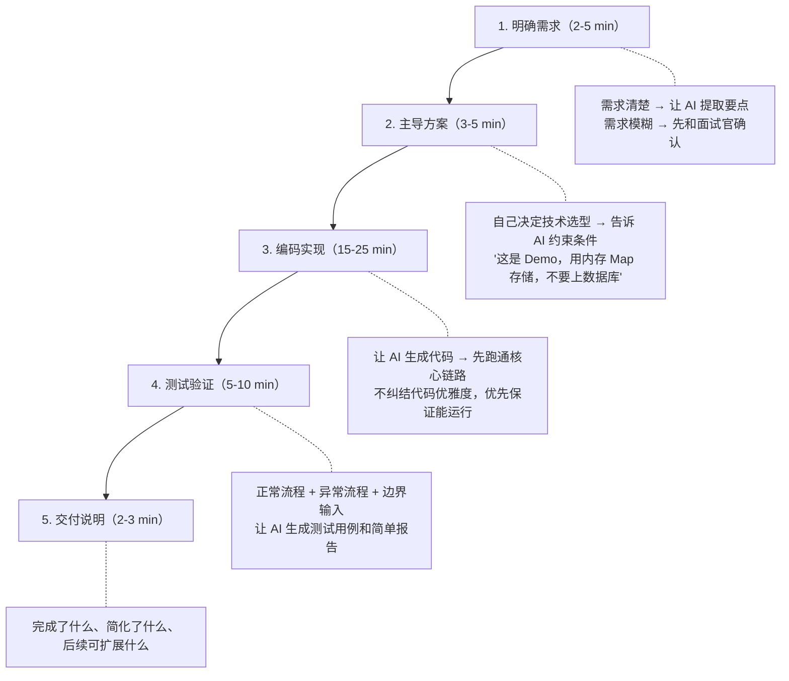

# AI Coding 面试：解题流程与交付策略

越来越多的公司在面试中加入 AI Coding 环节：给你 30-60 分钟，允许使用任何 AI 工具，完成一个小型 Demo 并交付。这不是在考"AI 能不能写代码"——**考的是你能不能驾驭 AI 工具完成一个完整的工程闭环**。

很多人的失败模式是：把题目丢给 AI，AI 输出一堆代码，自己看不太懂但觉得"应该能跑"，结果面试官一追问就穿帮。另一种失败是：过度设计，时间耗在架构上，核心功能没跑通。

## AI Coding 到底考什么

它考的不是工具本身，而是候选人在有限时间内能不能完成：

**需求理解 → 方案决策 → 编码实现 → 测试验证 → 交付说明**

AI 负责提效，你负责判断和把控方向。如果只是无脑把题目丢给 AI，不做需求判断、不控制方案、不 Review 代码，最终产出大概率跑偏。

面试官观察的核心信号：

| 正面信号 | 负面信号 |
|----------|----------|
| 先确认需求再动手 | 拿到题目直接让 AI 写 |
| 方案由自己主导 | 完全跟着 AI 走 |
| 关键逻辑能解释清楚 | 被追问时答不上来 |
| 边界情况有测试 | 只有 happy path |
| 主动同步思路 | 全程沉默 |

## 两种常见题型

### 需求明确型

面试官给出完整需求文档：功能要求、输入输出、边界情况、交付形式都写清楚了。

**策略**：直接让 AI 先整理需求要点，确认无误后生成方案和代码。重点放在核心功能跑通和测试覆盖。

### 需求模糊型

面试官口述一个大方向："做一个订单系统"、"实现一个异常识别功能"。

**策略**：先跟面试官确认关键问题（输入是什么、输出是什么、核心业务流程、交付到什么程度算完成），然后再动手。这类题额外考察需求分析意识和沟通能力。

## 通用解题流程



## 方案设计：自己主导，AI 执行

这是最容易出错的环节。AI 很容易过度设计：引入复杂架构、拆一堆不必要的模块、做题目没要求的扩展。

给 AI 设定清晰约束：

```text
约束指令示例：
- "这是面试 Demo，只需要最小可用实现"
- "用本地内存 Map 存储，不要接数据库"
- "不做复杂权限系统，保留接口扩展点即可"
- "不要微服务架构，单体跑通核心流程"
- "优先保证核心链路可运行"
```

**原则：你做架构决策，AI 做代码实现。** 面试官看的是你的技术判断力，不是 AI 的代码生成速度。

## 交付优先级

时间紧张时严格按优先级砍：

1. **核心功能代码**（必须跑通）
2. **测试验证**（证明代码可靠）
3. **运行说明**（让面试官能跑起来）
4. **前端页面**（加分项）
5. **额外优化**（锦上添花）

很多人反着来——先做前端页面或过度设计架构，结果核心功能没交付。

## 面试中的沟通节奏

不要全程沉默写代码。适当同步思路：

- "我先确认一下需求边界，再做最小实现"
- "这里我用本地内存存储，保证核心流程跑通"
- "核心代码已生成，我先跑一下测试"
- "这个功能时间有限，先不做复杂实现，保留扩展点"

面试官需要看到你在控制开发节奏，而不是被 AI 带着走。

## 常见坑

### 完全相信 AI 的输出

AI 生成的代码经常有：字段不一致、边界遗漏、接口跑不通、逻辑死循环。关键逻辑必须自己 Review——状态流转、边界判断、异常处理、幂等逻辑。

### 过度设计

面试 Demo 不是生产系统。能用 Map 跑通的不要上数据库，能单体实现的不要拆微服务，能硬编码的不要抽配置中心。

### 只生成不验证

生成了代码但没跑测试 = 没有完成交付。测试不是可选项。

### 用太重的工具流程

面试限时场景下，不要用 open spec、superpowers 这类重流程工具。用最轻量的方式快速出结果：直接在 Claude Code / Cursor 里对话式开发。

### 耗时在非核心环节

别在 README、前端页面、代码注释上花太多时间。这些是"核心功能完成后"的加分项。

## 提效技巧

1. **合并对话轮次**：需求明确时，一次对话完成需求分析 + 方案设计，另一次完成编码 + 测试
2. **第一句话就设范围**：开场告诉 AI "这是面试 Demo，最小可用实现，核心链路跑通即可"
3. **出错时精准描述**：不要说"代码有问题"，而是贴上错误信息 + 说清期望行为
4. **前端放最后**：用简单 HTML 即可，不要上 Vue/React 全家桶

## 小结

- AI Coding 面试考的是工程闭环能力，不是 AI 用得多溜
- 方案由你主导、代码让 AI 写、关键逻辑你必须能解释
- 优先级永远是：核心功能 > 测试 > 运行说明 > 前端 > 优化
- 和面试官保持沟通节奏，展示你在控制方向
- 约束 AI 不过度设计，是面试场景下最重要的提效手段

上一篇：

- [从 0 开始 Vibe Coding：用 Codex 发布个人主页](../01-vibe-coding-homepage/index.html)

下一篇：

- [日常开发中的 Agent 工作流：从 Context 到 Loop 的实战方法论](../03-daily-dev-workflow/index.html)
