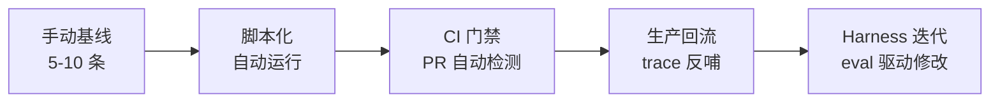
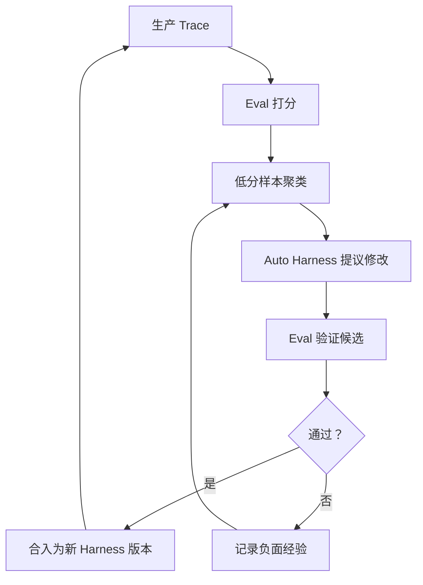

# Eval-Driven Agent Practice：用评估驱动 Agent 工作流迭代

## 为什么这个问题值得关注

AI Coding 工具到底能提效多少？答案取决于你怎么测。

GitHub/Microsoft 的 RCT 实验（95 人）显示，单个任务完成时间快了 55.8%（p=.0017，95% CI [21%, 89%]）（来源：arxiv 2302.06590）。Microsoft 大规模元分析（4,867 人，3 场实验）把范围放到真实工作环境，增益降到完成任务量 +26.08%（SE: 10.3%）。Accenture RCT 进一步贴近日常，PR 产出只提升了 8.69%。

规律很清晰：实验室单任务增益大（约 56%），真实多任务环境增益小（约 8-26%）。更值得注意的是 METR 2025 的独立复现——资深开发者用 AI 工具反而慢了 19%。

这组数据说明一件事：**你觉得提效了和真的提效了之间，差一个可测量的反馈信号。** 这就是 Eval 在 Agent 工作流中的核心角色——把"感觉更好了"变成"在这组任务上、这个指标确实改善了"。

## Eval 在 Agent 系统中扮演什么角色

上一篇讨论了 Auto Harness 的迭代循环：失败轨迹 -> 假设 -> 最小修改 -> 比较验证。Eval 就是这条链路中"比较验证"的具体实现。

但 Eval 不只服务于 Harness 迭代。它贯穿 Agent 工程的三个阶段：

| 阶段 | Eval 解决的问题 | 失败代价 |
|------|----------------|---------|
| 开发时 | Prompt 修改是否引入回归 | 低：本地发现，立即回退 |
| PR 门禁 | 新版本是否值得合入 | 中：阻塞交付流程 |
| 生产运行 | 实际表现是否符合预期 | 高：用户已受影响 |

没有 Eval，每次修改 Prompt、换模型或调整工具定义都是盲操作。有了 Eval，修改变成实验，实验产生证据，证据驱动决策。

## 三个框架怎样落地同一套工作流

当前主流 Eval 框架虽然产品形态不同，但收敛于相似的阶段划分。

### Promptfoo：CLI 驱动，CI/CD 原生

五阶段：定义用例 -> 配置 eval（YAML 声明测试用例和评分器） -> CLI 运行 -> 分析结果 -> 迭代修改。

解决的问题：Prompt 回归检测。每次 PR 自动跑 eval，打分器判定通过或失败，结果作为 PR 门禁。

代价：需要自己维护测试用例集；评分器逻辑越复杂，维护成本越高。

```yaml
# promptfoo 配置示例
prompts:
  - file://prompts/coding-agent-v2.txt
providers:
  - openai:gpt-4o
  - anthropic:claude-sonnet-4-20250514
tests:
  - vars:
      task: "Fix the timeout bug in api/handler.py"
    assert:
      - type: llm-rubric
        value: "Response includes a specific code fix, not just explanation"
      - type: cost
        threshold: 0.05
```

### Braintrust：不可变快照，跨版本对比

五阶段：playground 快速实验 -> 不可变实验快照 -> CI/CD PR 自动化 -> 生产打分 -> trace 回流测试集。

解决的问题：版本间精确对比。每次实验生成不可变快照，支持任意两个版本逐条比较。提供 `--first N` 和 `--sample N` 做 PR 快速冒烟测试，不必每次跑全量。

代价：平台依赖度高；快照积累后需要管理存储和过期策略。

### LangSmith：生产 Trace 反哺开发

三阶段：开发时离线 eval -> 部署时在线 eval -> 持续改进循环。

解决的问题：生产数据驱动迭代。线上 trace 自动打分，低分样本回流为新测试用例，形成数据飞轮。

代价：需要线上部署 LangSmith 采集器；隐私和数据治理要求更高。

### 共识

三个框架的共识可以归纳为四条：

1. **5-10 条测试用例起步即可**，不要等到有 1000 条才开始
2. **PR 门禁做回归检测**，不追求绝对分数，只看相对变化
3. **生产 trace 反哺测试集**，让 eval 数据活起来
4. **评分器和被测系统分离**，否则改一次 Prompt 可能同时改了判定标准

## 必须测完整系统，不能只测模型

GitHub 2026 年 6 月的评测揭示了一个反直觉的现象：Copilot CLI 的 Harness 在 Claude Sonnet 4.6 和 Opus 4.7 上表现优于这些模型的原生 Harness，但在 GPT 5.4/5.5 上反而落后原生 4-7%。

用表格来看这个交互效应：

| 模型 | Copilot CLI Harness | 模型原生 Harness | 差异 |
|------|-------------------|-----------------|------|
| Claude Sonnet 4.6 | 更优 | 基线 | Copilot 胜 |
| Claude Opus 4.7 | 更优 | 基线 | Copilot 胜 |
| GPT 5.4 | 基线 | 更优 | 原生胜 4% |
| GPT 5.5 | 基线 | 更优 | 原生胜 7% |

这意味着 Eval 的对象不能只是模型本身，而必须是 **模型 + Harness 的完整组合**。同一个 Prompt 换一个模型，表现可能反转。同一个模型换一套工具定义，结果也会不同。

这种交互效应的根源在于：不同模型对工具定义格式、System Prompt 结构、错误恢复指令的响应方式不同。一个为 Claude 优化的 Harness 可能恰好触发了 GPT 的弱点，反之亦然。

实操建议：

- Eval 配置里固定模型版本，不要用 `latest` 别名
- 换模型时重跑完整 eval，不要假设"更强的模型一定更好"
- 如果同时迭代 Prompt 和模型，分两步做，否则无法归因
- 记录每次 eval 的完整环境：模型版本 + Harness 版本 + 工具版本

## Prompt 回归测试的工程实践

把 Eval 接入 CI/CD 不需要大动基础设施。最小可行方案：

```text
PR 提交 -> CI 触发 eval 子集 -> 打分器判定 -> 通过则绿灯 / 失败则阻塞
```

关键决策：

**跑多少条？** 全量 eval 可能耗时几十分钟。Braintrust 的 `--first N` 和 `--sample N` 提供了折中——PR 只跑 10-20 条核心用例做冒烟测试，合入 main 后再跑全量。

**怎么判定通过？** 避免硬编码绝对分数阈值。更稳健的做法是和基准版本对比：如果新版本在任何维度显著退化（比如成功率下降超过 5%），标记为需要人工审查。

**快照怎么管理？** 每次 eval 结果绑定 commit hash。回看历史时能精确知道"这个版本的 Prompt 在那组测试上表现如何"。Git tag 或 Braintrust 的不可变快照都能做到。

**评分器怎么选？** 常见三类：

| 评分器类型 | 适用场景 | 注意事项 |
|-----------|---------|---------|
| 精确匹配 / 正则 | 格式约束、关键字段存在性 | 简单可靠，但覆盖面窄 |
| 代码验证（测试通过率） | 代码生成、bug 修复 | 最客观，但需要可运行环境 |
| LLM-as-Judge | 开放式输出质量 | 需要验证评分器一致性，成本较高 |

建议优先用代码验证和精确匹配覆盖能覆盖的，LLM-as-Judge 只处理无法程序化判定的维度。

## 何时不该依赖 Eval 自动化

Eval 不是万能的，以下场景需要警惕：

**评分器本身不可靠。** 如果你用 LLM 做评分器，而评分 Prompt 没有经过验证，你可能在用一个不靠谱的裁判来判定另一个不靠谱的选手。先验证评分器的一致性，再信任它的判定。

**测试集太小或太偏。** 5 条用例足够起步，但如果这 5 条都是简单场景，你可能漏掉所有边界情况。测试集需要随生产问题持续扩充。

**资深开发者的场景。** METR 2025 的数据提示，对于已经很熟练的开发者，AI 工具可能引入切换成本而非节省时间。Eval 能告诉你"Agent 在这个任务上表现如何"，但不能告诉你"这个开发者是否应该用 Agent"。这个判断目前还是研究空白，公开数据极少。

**过度优化 eval 分数。** 当团队开始为了过 eval 而修改 Prompt，而不是为了真实用户体验，eval 就从工具变成了目标。定期用生产 trace 更新测试集，保持 eval 和现实对齐。

**单次运行不能下结论。** LLM 输出有随机性。同一组输入跑三次可能得到三个不同分数。对于关键决策（是否合入、是否切换模型），至少重复 3-5 次取均值和方差，确认改善超出噪声范围。

## 从零搭建的最小路径

不需要一步到位。按复杂度递增：

**第一周：手动基线。** 选 5-10 个代表性任务，手动运行 Agent，记录成功/失败和耗时。这就是你的 v0 eval。

**第二周：脚本化运行。** 把手动步骤写成脚本，配合 Promptfoo 或等效工具自动执行。每次改 Prompt 前后各跑一次，对比结果。

**第三周：接入 CI。** PR 触发 eval 子集，结果作为 Check 显示在 PR 页面。不通过不合入。

**第四周及以后：生产回流。** 线上 trace 中的低分样本或用户投诉转化为新测试用例。eval 集与真实问题同步增长。

一个常见的错误是在第一周就试图搭建完整平台。Eval 的核心价值不在工具链的完备性，而在于**有没有形成"改动前跑一次、改动后跑一次、对比结果"的习惯**。哪怕只是一个 shell 脚本加一张手动记录的表格，也比没有 eval 强一个数量级。



## 与 Auto Harness 的衔接

上一篇的 Auto Harness 循环依赖一个前提：有可靠的比较机制。Eval 就是这个机制的工程实现。

具体衔接点：

- Auto Harness 生成候选 Diff -> Eval 在目标任务上验证修复 -> Eval 在回归任务上检查退化
- 生产 Eval 发现低分模式 -> 聚类为失败簇 -> 触发 Harness 迭代提议
- Eval 结果绑定 Harness 版本 -> 支持任意两个版本精确对比

没有 Eval，Harness 迭代就是猜测；有了 Eval，迭代才是实验。



这个闭环的关键在于：Eval 既是触发器（发现问题），也是验证器（确认修复）。两个角色使用的测试集必须分离，否则系统会学会"通过已见过的测试"而非真正改进。

## 小结

- **效率增益在实验室和真实环境差距很大，Eval 是弥合这个差距的测量工具。**
- **Eval 贯穿开发、PR 门禁和生产三个阶段，不是事后补充。**
- **必须测完整系统（模型 + Harness），不能只测模型。**
- **5-10 条用例起步，PR 门禁看相对变化，生产 trace 反哺测试集。**
- **Eval 自动化有边界：评分器要验证、测试集要更新、资深场景要审慎。**

---

下一篇建议继续看：[返回模块目录](../index.html)
