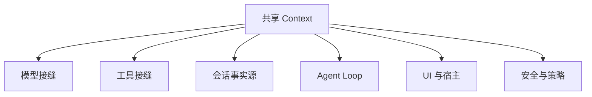

# Agent Harness 与一切皆插件

做一个“帮我改代码”的 AI 助手并不只是接一次模型 API。它要读文件、运行命令、循环调用工具、保存会话、允许用户中途干预，还要把流式过程交给 Web、CLI 或其他客户端。Harness 就是把模型能力装配成这些产品行为的运行时。

## DSH 最重要的判断：不存在特权内核

常见插件架构仍然保留一个不可替换的 Kernel。插件只能在 Kernel 预留的 Hook 上工作：你可以增加一个工具，却不能换掉工具循环；可以接一个存储，却不能改变会话如何成为上下文。

DSH 把边界再向内推了一步。模型适配器、工具注册表、会话日志和 Agent Loop 本身都是插件，可以从配置中替换。所谓“一切皆插件”不是插件数量很多，而是**重要性不再自动带来不可替换的特权**。

这些插件站在同一棵 Context 树中，通过服务、事件和可逆副作用协作。耦合关系主要存在于运行时注册，而不是消费者直接导入某个具体实现。

## Harness 要回答的五类问题

| 工程问题 | DSH 的设计回答 | 典型接缝 |
| --- | --- | --- |
| 如何接不同模型 | 协议与 Provider 作为可替换适配器 | `ctx.llm` |
| 如何让模型使用能力 | 工具声明、执行和策略组成管线 | `ctx.tools` |
| 如何保存和恢复 | 追加式事件作为事实源 | `ctx.sessions` |
| 如何干预中间过程 | 请求、工具和轮次暴露类型化事件 | `agent/*`、`tools/*` |
| 如何组成不同产品 | Profile 组合插件树，Surface 只做宿主适配 | Web、headless、外部 Profile |

这张表不是 API 清单。它说明每个横切问题都拥有自己的可替换边界，而不是被硬编码进一个巨型 Agent 类。

## 三个思维实验

### 模型与工具协议继续变化

如果工具循环、模型协议和 Provider 实现写死在同一个核心里，协议演进会变成内核手术。DSH 把 LLM、Tools 和 Agent Loop 分开，哪个边界变化就替换哪个插件，其他部分继续使用原有契约。

### 产品形态无法提前枚举

Web、一次性 headless 任务、TUI、ACP 或 SDK 都需要同一套会话和工具能力。DSH 让产品形态成为 Profile 的组合结果，而不是复制一份核心代码。官方 Web 和 headless 只是两份预置，不是全部可能性。

### 个性化不应该都等待核心发版

审计工具结果、请求前路由、给单个 Agent 增加隔离策略，都可以附着在已有服务或事件上。局部需求由局部插件承担，核心仓库不必为每个用户维护分支。

## 这是不是过度设计

有可能。对一次性问答、普通 Skill、搜索服务或短进程 MCP，改配置并重启通常更简单。DSH 的价值只有在你确实需要替换进程内有状态组件、改变控制流、维护多个产品形态，或探索运行时自我修改时才明显。

因此，正确问题不是“一切皆插件是否更先进”，而是“你的系统是否需要把这个边界变成可替换能力”。可替换性提高了上限，也把依赖、生命周期、生态质量和版本兼容的成本带进了运行时。

官方事实来源：[README](https://github.com/deepseek-ai/deepseek-harness/blob/dsh-v0.1.0-rc.8/README.zh.md)、[Architecture](https://github.com/deepseek-ai/deepseek-harness/blob/dsh-v0.1.0-rc.8/docs/architecture.zh.md) 和 Cordis 论文 [A Programming Paradigm for Spatiotemporal Composability](https://github.com/cordiverse/paper)。

下一篇建议继续看：[声明式与命令式：Cordis 的五个核心概念](../02-cordis-plugin-kernel/index.html)
