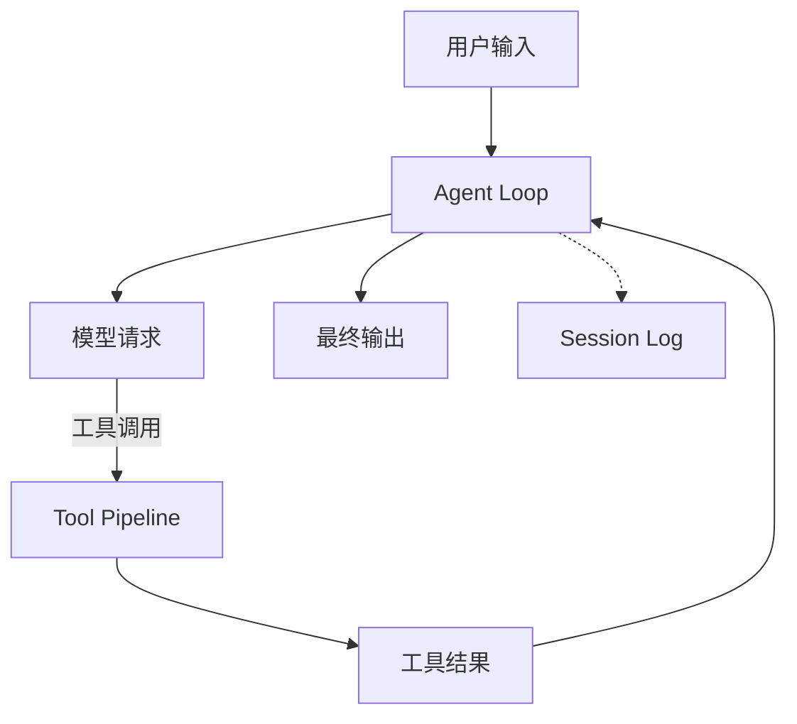

# Harness 到底解决什么问题

如果一个 Agent 只需要调用一次模型，SDK 已经足够。真正麻烦的是它要运行数十轮：工具可能失败，用户会插话，上下文会超预算，危险操作需要审批，进程还要在重启后恢复。把这些问题全部塞进一个 `while` 循环，系统很快就无法解释和测试。

## 五个层次

| 层次 | 负责什么 | 典型边界 |
| --- | --- | --- |
| Model | 根据输入产生输出或工具调用 | 不负责权限和重试策略 |
| SDK | 封装 Provider 的 HTTP、流式和类型 | 不保存完整会话事实 |
| Agent | 根据轨迹循环请求模型、执行工具 | 负责任务推进 |
| Harness | 为 Agent 提供日志、工具、上下文、审批、沙箱等可替换能力 | 负责运行时治理 |
| Runtime surface | 把 Harness 暴露给 Web、CLI、ACP 或 SDK 客户端 | 负责宿主与生命周期 |

DeepSeek Harness 的关键判断是：**Agent Loop 是核心流程，能力通过服务接缝注入。** 因此 `ctx.sessions`、`ctx.tools`、`ctx.approval` 和 `ctx.sandbox` 都是可以被替换、测试和审计的模块，而不是散落在循环里的全局函数。

## 最小闭环

日志不是旁路的调试输出，而是这条闭环的事实源。后续的上下文、压缩、恢复和审计都应能从日志重新推导。

## 阅读官方文档的方法

本模块引用的官方文档固定在 [dsh-v0.1.0-rc.8](https://github.com/deepseek-ai/deepseek-harness/tree/dsh-v0.1.0-rc.8)。阅读其他文章时，先确认它描述的是哪个 tag，再看它说的是公共 service seam、内部实现还是教学封装。一个名字相同的 `Agent` 或 `Tool`，在不同层次可能拥有完全不同的生命周期。

官方总览见 [Architecture](https://github.com/deepseek-ai/deepseek-harness/blob/dsh-v0.1.0-rc.8/docs/architecture.zh.md)。它描述了 Profile、Bundle、Patch 和 Harness Home 的组装关系，是后续所有 API 解释的入口。
