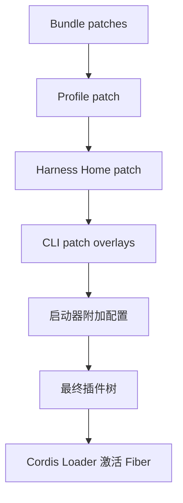

# 运行中的 DSH：插件树、组合层与能力接缝

知道“一切皆插件”还不够。真正运行时，系统必须回答三件事：这次启动究竟装了什么，多个配置发生冲突时谁获胜，替换一个文件系统为什么能让 Bash、终端和 LSP 一起迁移到沙箱。

DSH 的答案是：**产品不是一份写死的启动代码，而是一棵在启动时由有序配置层组合出来的插件树。**

## 从产品到插件树

官方 Web 和 headless 不是两个独立内核，而是两份不同的产品配方。它们共享基础能力，再装入各自的宿主插件。

这棵树让“本次运行由什么组成”变成可检查的事实。`--dump-config` 的价值不只是方便排错，它给构建、审计和复现提供了一份组装结果。

## Profile、Bundle 与 Patch 各管什么

| 层 | 设计责任 | 不应该承担的责任 |
| --- | --- | --- |
| Bundle | 分发一组可以共同安装的插件行 | 决定每台机器的最终偏好 |
| Profile | 定义 Web、headless 或定制产品的有序配方 | 偷偷修改全局环境 |
| Patch | 在明确层级替换或插入条目 | 依赖不透明的隐式合并 |

Bundle 解决复用和分发，Profile 解决产品形态，Patch 解决环境差异与临时实验。把三者混在一个配置文件里同样能启动，但很难判断一项变化应该跟着产品发布、跟着机器生效，还是只属于一次运行。

## 覆盖顺序就是架构事实

当前 `rc.8` 文档给出的组合顺序是：Bundle 层按 Profile 声明顺序叠加，然后是 Profile Patch、Harness Home Patch、命令行 Patch，最后还有启动器附加的 Agent preset 和遥测开关等配置。后层拥有更高优先级。

这里有一个容易误判的限制：**按 `id` 覆盖配置时是整段替换，不做深合并。** 只写一个新字段可能使旧字段全部消失。这降低了合并语义的魔法程度，却把复述配置和版本迁移的责任交给使用者。

`!!js` 则是配置中的窄逃生口，可以在 `config` 或 `disabled` 等受限位置引用运行时值。它提高了表达力，也意味着 Patch 不是天然安全的数据文件：来源、评审和执行权限必须像代码一样管理。

## Seam：替换能力，不只是替换包名

插件树解释“装了什么”，能力接缝解释“为什么替换能传播”。一个完整 Seam 有三个角色：

| 角色 | 责任 | 文件系统例子 |
| --- | --- | --- |
| Service Definition | 定义稳定契约 | `ctx.fs` 能做哪些文件操作 |
| Service Provider | 实现契约 | 本地文件系统或远程沙箱 |
| Consumer | 只依赖契约使用能力 | 文件工具、终端、LSP |

真正的可替换性不来自“用了接口”这句口号，而来自消费者没有绕过接缝直接访问本地实现。只要 Bash 工具仍直接调用宿主机进程，替换 `ctx.fs` 就不能把完整执行环境迁移到沙箱。

因此评审一个 Seam 时，要沿依赖链追问：定义是否稳定，提供方是否完整，消费者是否都经过它，错误与取消语义是否一致。三者缺一，替换就只存在于配置表面。

## 热更新改变的是依赖分支

Patch 变化后，理想行为不是重启全部系统，而是找到受影响条目，卸载旧 Fiber，再让依赖解析器重新激活相关分支。Cordis 的可逆 Effect 使这件事可行；Profile 的确定顺序则使重组结果可预测。

但 HMR 不会自动迁移所有业务状态。一个插件若持有无法重建的内存状态，仍需定义迁移或降级策略。配置解析失败、插件激活失败和 disposer 失败，也必须有清晰诊断；“最后一棵好树”只能保护框架状态，不能撤销已经提交到外部系统的副作用。

## 设计检查

- 能否从 Profile 和 Patch 重建一次运行，而不是依赖某台机器上的隐式状态？
- 覆盖规则是否明确，整段替换造成的字段丢失能否在评审或测试中发现？
- 每项可替换能力是否都有 Definition、Provider、Consumer 三个角色？
- 切换提供方后，是否仍有消费者绕过 Seam 访问旧实现？
- HMR 失败时，运行时状态和外部副作用分别怎样收场？

事实基线见官方 [Architecture](https://github.com/deepseek-ai/deepseek-harness/blob/dsh-v0.1.0-rc.8/docs/architecture.zh.md) 与 [Capability Seams](https://github.com/deepseek-ai/deepseek-harness/blob/dsh-v0.1.0-rc.8/docs/capability-seams.zh.md)。

## 小结

- 运行中的 DSH 是一棵由有序配置层启动出来的插件树。
- Bundle、Profile、Patch 分别承担分发、产品组合和覆盖责任。
- Patch 的顺序、整段替换和 `!!js` 都是需要审计的运行时语义。
- Seam 由定义、提供方和消费者共同形成，替换能力必须沿完整依赖链成立。

下一篇建议继续看：

- [LLM 接缝：把模型差异关在适配器里](../04-llm-seam/index.html)
