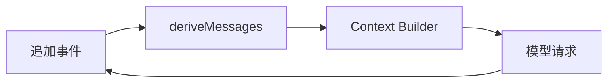

# Session Log：为什么日志就是事实源

如果只保存最后一条回答，系统无法知道模型为什么调用工具、用户何时插话、某次审批是否被拒绝。DeepSeek Harness 把会话建模为追加式日志，消息、工具调用和控制事件都落在同一条时间线上。

## 事件而不是可变消息数组

常见事件包括 `turn/start`、`step/start`、`user/message`、`assistant/chunk`、`assistant/message`、`tool/call`、`tool/result`、`steering/message` 和 `request/header`。这些事件保留顺序与元数据，模型可见消息则由日志派生，而不是反过来修改日志。

## 恢复的正确姿势

`ctx.sessions` 负责会话发现、读取和持久化；`ctx.agents.resume()` 根据日志恢复 Agent 状态。恢复时应重新校验事件格式、配置版本和工具能力，不能假设旧日志一定适配当前运行时。

## 日志设计的三个约束

1. **追加优先**：修正错误用补偿事件或派生视图，不直接覆写历史。
2. **序列可解释**：每个事件都能定位到 turn、step、工具调用和来源。
3. **失败也记录**：请求错误、拒绝、取消和压缩都要有事件，否则审计会出现“无事发生”的假象。

官方参考：[Core Subsystem](https://github.com/deepseek-ai/deepseek-harness/blob/dsh-v0.1.0-rc.8/docs/subsystems/core.zh.md) 与 [Capability Seams](https://github.com/deepseek-ai/deepseek-harness/blob/dsh-v0.1.0-rc.8/docs/capability-seams.zh.md)。
