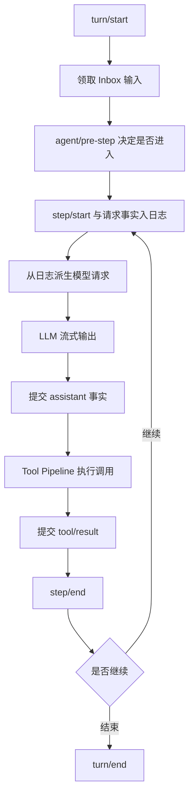

# Agent Loop：控制平面如何推进任务

把 Agent 写成 `while (!done)` 只描述了循环，不描述系统如何处理失败、插话、重试和副作用。真正需要设计的是：谁决定下一步，谁确认这一步已经发生，谁负责在中途取消，以及恢复后凭什么继续。

## Loop 本身也是可替换服务

DSH 的默认 Agent Loop 依赖 Agent、Session、LLM、Tools 和 System Prompt 等服务，再向外提供 `ctx.agentLoop`。它是驱动引擎，却不是一个不可替换的特权内核。

这项选择比“工具可插拔”更激进：Hook 只能改变预留节点上的局部行为，替换 Loop 则能改变控制流骨架。单 Agent、多 Agent、串行或并行工具调度、不同的上下文装配策略，都可以成为另一套 Loop 实现。

代价同样明显。替代实现必须继续满足会话日志、取消、工具结果和请求重建等系统契约，否则它虽然实现了同名服务，却不再是可恢复的 DSH Agent。

## 控制平面与执行平面分离

模型属于控制平面，它提出下一步；工具、进程和外部 API 属于执行平面，它们产生真实副作用。Loop 的职责不是替模型做决定，而是把模型输出转换成受约束的执行请求，再把结果提交到事实源。

这里最重要的不是函数调用顺序，而是提交边界：事实先写入日志，后续决策再从日志派生。外部副作用不能只存在于内存里的临时变量中。

## Turn、Step 与 Request 分别约束什么

| 边界 | 当前契约 | 适合绑定的治理 |
| --- | --- | --- |
| Turn | 一次任务唤醒，从 `turn/start` 到 `turn/end` | 用户意图、总预算、最终原因 |
| Step | 一次模型调用及其请求的工具执行 | 上下文快照、工具批次、局部取消 |
| Request | 一次具体 Provider 调用 | 路由、超时、限流、重试和用量 |

首次输入被拒绝或被改写为空，仍然可以留下一个没有 Step 的 Turn。这个细节很重要：系统记录“尝试进入但被拒绝”的事实，而不是假装这次交互从未发生。

请求失败也不应模糊成整个会话失败。失败的 Step 先闭合，`agent/request-error` 再获得恢复决策权；策略可以重试，也可以让 Turn 以明确错误结束。

## 模型可见内容必须能从日志重建

默认 Loop 在分发请求前写入请求头和模型可见消息，再通过 `deriveMessages()` 生成历史。Loop 构造的请求会被冻结，配套运行时不变量还会检查：日志中是否存在当前 Step、请求头是否存在、请求消息是否与日志投影一致。

这条约束排除了一个常见捷径：某个 Hook 在发送前偷偷向 `messages` 塞入提示，但不记日志。短期看很灵活，恢复、Fork 和审计时却无法解释模型为什么看到了这段内容。

## 拦截点按责任分层

| 接缝 | 拥有什么决策权 | 不应该做什么 |
| --- | --- | --- |
| `agent/pre-step` | 接受、改写或拒绝已领取输入 | 直接执行工具副作用 |
| `agent/request` | 决定 Provider、模型和请求配置 | 绕过日志修改消息历史 |
| `llm/stream` | 包裹传输、遥测或测试替身 | 破坏流式协议不变量 |
| `agent/request-error` | 选择重试或终止 | 把失败从日志中抹掉 |
| `tools/*` | 审批、执行、结果治理 | 把模型选择当作授权 |
| `session/event` | 观察已提交事实 | 反向改写权威结果 |

接口多不是目的，责任不混淆才是目的。若所有插件都能在任意阶段改变任意状态，所谓可扩展只会变成不可预测。

需要注意：模型在 `turn/end` 声称任务完成，不等于系统已验证结果。第三方评测（[coding-agent-harness-eval](https://github.com/Heathcliff-1104/coding-agent-harness-eval)）发现 DSH 在功能覆盖度上领先，但存在"Agent 报告完成、后端实际缺少校验逻辑"的案例。这意味着 `agent/turn-stopping` 只表达模型判断，验收必须由外部测试或审批策略独立确认。

## 取消与恢复的真实边界

取消信号需要从 Turn 穿过模型请求和工具执行。它只能要求协作式停止，不能撤销已经提交到文件系统、数据库或远端 API 的副作用。恢复时必须从日志判断哪些结果已经提交，再决定补偿、继续还是结束，不能简单重跑整个 Step。

同理，替换 Agent Loop 也不能自动迁移任意内存状态。可替换控制流的前提，是关键状态已经外化到 Session Log 和稳定服务中。

事实基线见官方 [Architecture](https://github.com/deepseek-ai/deepseek-harness/blob/dsh-v0.1.0-rc.8/docs/architecture.zh.md)、[Core Subsystem](https://github.com/deepseek-ai/deepseek-harness/blob/dsh-v0.1.0-rc.8/docs/subsystems/core.zh.md) 与 [`agent-loop` 请求不变量](https://github.com/deepseek-ai/deepseek-harness/blob/dsh-v0.1.0-rc.8/packages/core/agent-loop/src/invariant.ts)。

## 小结

- Agent Loop 是可替换的控制平面，但替代实现仍要遵守日志、取消和工具契约。
- Turn、Step、Request 把用户任务、推进单元和 Provider 故障分开。
- 模型请求必须从日志派生，不能靠发送前的隐式内存修改。
- 取消是协作式终止，不是副作用回滚；恢复要根据已提交事实决定下一步。

下一篇建议继续看：

- [Tool Pipeline：能力为什么不能直接等于权限](../06-tool-pipeline/index.html)
