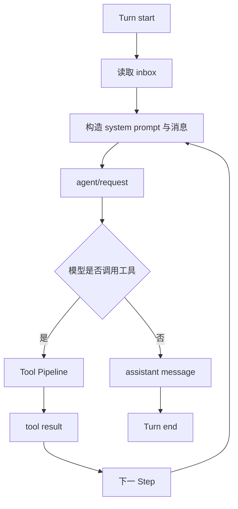

# Agent Loop：Turn、Step 与请求边界

把 Agent Loop 写成 `while (!done)` 只能说明控制流，不能说明边界。DSH 用 Turn 和 Step 把一次用户任务、一次模型请求、一次工具执行拆开，日志因此可以恢复、计量和重放。

## 一次循环的骨架

`ctx.agents.create()` 创建新 Agent，`ctx.agents.resume()` 从会话日志恢复 Agent。`ctx.agentLoop` 负责推进循环，模型 Provider、工具注册表和会话持久化则通过服务接缝提供。

## 观察哪些事件

至少要关注 `agent/request`、`agent/request-error`、`turn/start`、`turn/end`、`step/start` 和 `step/end`。请求错误不等于 Turn 结束：系统可能重试，也可能写入错误事件后把控制权交回客户端。

## 工程上的边界

- Turn 是面向用户的一次任务边界，适合做审批窗口、超时和计费统计。
- Step 是一次推进单元，适合做工具调用、上下文重建和取消检查。
- Provider 请求是外部不确定性边界，必须记录请求头、模型、耗时和错误分类，但要过滤凭据。

参考官方 [Core Subsystem](https://github.com/deepseek-ai/deepseek-harness/blob/dsh-v0.1.0-rc.8/docs/subsystems/core.zh.md)。
